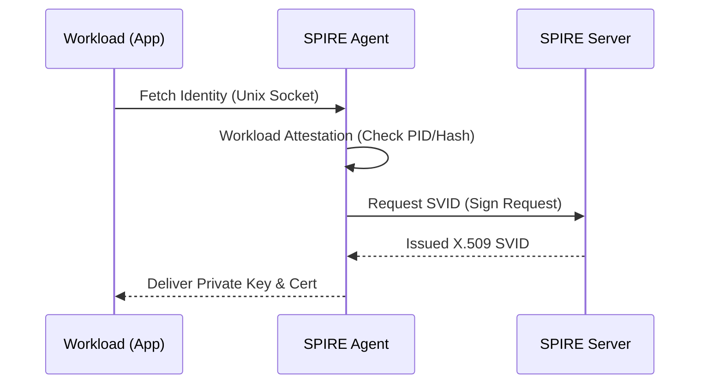

> [!abstract] 软件定义安全边界 (SDP) 深度系列
> 1. **[[2026-03-11-sdp-zero-trust-overview|1. 概论篇：SDP 与零信任的范式转移]]**
> 2. **[[2026-03-11-sdp-cloud-infrastructure-security|2. 基础设施篇：云底座的租户隔离与流量劫持]]**
> 3. **[[2026-03-11-sdp-kernel-path-deep-dive|3. 内核深度篇：OVS 与 eBPF 的路径博弈]]**
> 4. **[[2026-03-11-sdp-application-identity-mtls|4. 应用身份篇：SPIFFE 与透明加密实施 (当前文章)]]**
> 5. **[[2026-03-11-sdp-advanced-threat-defense|5. 防御进阶篇：应对容器逃逸与底座沦陷]]**

## 1. SPIRE 身份自动化颁发流程
为了防止身份伪造，SPIRE 建立了严密的信任链。参考：[[2025-12-19-ebpf-networking-vs-vpn|eBPF 原始进程归因]]。

## 2. 身份校验全场景矩阵

| 场景组合 | 校验机制 | 安全结果 |
| :--- | :--- | :--- |
| **同节点 + 异租户** | 信任域不匹配 | **TLS 握手直接失败** |
| **异节点 + 同租户** | mTLS 隧道验证 | 全链路加密通信 |
| **异节点 + 异租户** | 证书链非法 | 强制阻断，防御 [[2025-11-27-capture-ssl|中途嗅探]] |

## 3. 对等透明加密实施方案
| 方案 | 成对组件 | 核心协议 | 优点 |
| :--- | :--- | :--- | :--- |
| **Sidecar 模式** | Envoy + Envoy | mTLS | 支持 7 层精细审计（[[2025-12-16-consul-proxy|Consul 方案]]） |
| **Ambient 模式** | Ztunnel + Ztunnel | HBONE | 部署轻量，低损耗 |
| **内核加密** | Node Kernel | WireGuard | **性能最高** |

---
## 外部参考
- [SPIFFE 官方标准](https://spiffe.io/docs/latest/spiffe-about/overview/)
