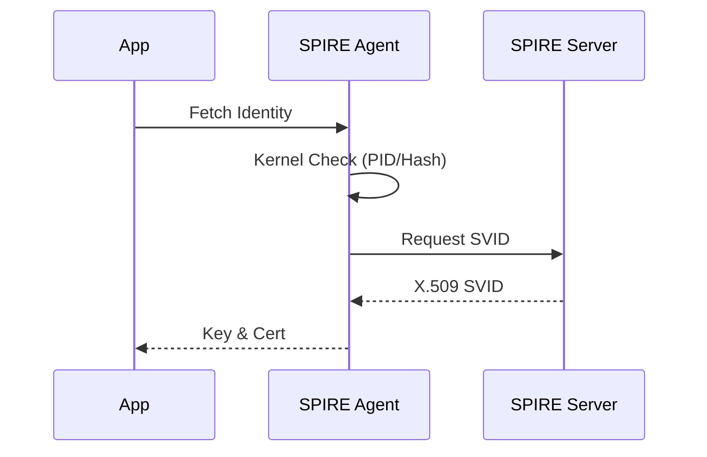

> [!abstract] 软件定义安全边界 (SDP) 深度系列
>
> 1. **[[2026-03-11-sdp-zero-trust-overview|1. 概论篇：SDP 与零信任的范式转移]]**
> 2. **[[2026-03-11-sdp-cloud-infrastructure-security|2. 基础设施篇：云底座的租户隔离与流量劫持]]**
> 3. **[[2026-03-11-sdp-kernel-path-deep-dive|3. 内核深度篇：OVS 与 eBPF 的路径博弈]]**
> 4. **[[2026-03-11-sdp-application-identity-mtls|4. 应用身份篇：SPIFFE 与透明加密实施 (当前文章)]]**
> 5. **[[2026-03-11-sdp-advanced-threat-defense|5. 防御进阶篇：应对容器逃逸与底座沦陷]]**

## 1. SPIRE 身份自动化颁发流程

SPIRE 确保身份不看 IP，只看“血统”。通过双重审计建立可信链：

1. **节点审计 (Node Attestation)**：验证宿主机硬件合法性（TPM/云身份）。
2. **工作负载审计 (Workload Attestation)**：利用内核接口检查 PID、二进制哈希。参考：[[2025-12-19-ebpf-networking-vs-vpn|eBPF 原始进程归因]]。

## 2. 核心战术：握手即审计

在零信任架构中，加密不仅是保护内容，更是**强制身份准入**。

- **验证时机**：发生在 TLS 1.3 握手阶段，而非业务逻辑层。
- **提取逻辑**：从证书 SAN 扩展字段读出 SPIFFE ID（如 `spiffe://ns/tenant-a/...`）。
- **判定动作**：只有匹配授权名单（ACL），加密隧道才能建立。失败则发送 `TLS Alert` 并熔断。

## 3. 对等透明加密实施对比

| 方案         | 实施路径          | 租户感知 | 核心优势                                        |
| :----------- | :---------------- | :------- | :---------------------------------------------- | --------------- |
| **Sidecar**  | Envoy 流量劫持    | 完全无感 | 完美支持 L7 精细策略（[[2025-12-16-consul-proxy | Consul 实践]]） |
| **Ambient**  | Ztunnel 共享网关  | 完全无感 | 部署轻量，消除 Sidecar 注入复杂度               |
| **内核加密** | WireGuard / IPsec | 完全无感 | **性能最高**，无用户态代理损耗                  |

---

## 外部参考

- [SPIFFE 官方标准](https://spiffe.io/docs/latest/spiffe-about/overview/)
