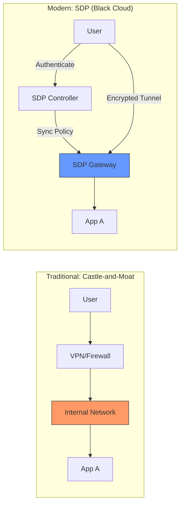

> [!abstract] 软件定义安全边界 (SDP) 深度系列
> 1. **[[2026-03-11-sdp-zero-trust-overview|1. 概论篇：SDP 与零信任的范式转移 (当前文章)]]**
> 2. **[[2026-03-11-sdp-cloud-infrastructure-security|2. 基础设施篇：云底座的租户隔离与流量劫持]]**
> 3. **[[2026-03-11-sdp-kernel-path-deep-dive|3. 内核深度篇：OVS 与 eBPF 的路径博弈]]**
> 4. **[[2026-03-11-sdp-application-identity-mtls|4. 应用身份篇：SPIFFE 与透明加密实施]]**
> 5. **[[2026-03-11-sdp-advanced-threat-defense|5. 防御进阶篇：应对容器逃逸与底座沦陷]]**
> ---
> 补充：[[2026-03-11-spa-c-implementation|SPA 的高性能 C 语言实现]]

## 1. 核心综述
传统的“边界防御”模式（防火墙+VPN）正在失效。现代主流做法是 **SDP (Software Defined Perimeter)**，其核心逻辑是“先验证身份，后建立连接”。

## 2. 范式转移：从“堡垒模式”到“隐身模式”

### 2.1 架构图示对比

## 3. 深度洞察：为什么 SDP 是东西向安全的终极武器？
SDP 的核心价值在于彻底解决了数据中心内部的**东西向 (East-West) 流量**安全。
- **扼杀横向移动**：通过“黑云”架构使资源隐身。
- **微隔离实现**：结合 [[2025-12-16-consul-proxy|Consul Connect]] 实现身份级授权。
- **联动观测**：通过 [[2026-03-08-deepflow-detailed-analysis-report|DeepFlow eBPF]] 实时监控内部拓扑。

---
## 外部参考
- [Cloud Security Alliance (CSA) SDP 标准](https://cloudsecurityalliance.org/research/working-groups/software-defined-perimeter/)
