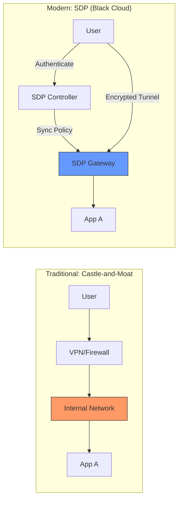

> [!abstract] 软件定义安全边界 (SDP) 深度系列
>
> 1. **[[2026-03-11-sdp-zero-trust-overview|1. 概论篇：SDP 与零信任的范式转移 (当前文章)]]**
> 2. **[[2026-03-11-sdp-cloud-infrastructure-security|2. 基础设施篇：云底座的租户隔离与流量劫持]]**
> 3. **[[2026-03-11-sdp-kernel-path-deep-dive|3. 内核深度篇：OVS 与 eBPF 的路径博弈]]**
> 4. **[[2026-03-11-sdp-application-identity-mtls|4. 应用身份篇：SPIFFE 与透明加密实施]]**
> 5. **[[2026-03-11-sdp-advanced-threat-defense|5. 防御进阶篇：应对容器逃逸与底座沦陷]]**

## 1. 核心综述

传统的“边界防御”模式（防火墙+VPN）正在失效。现代主流做法是 **SDP (Software Defined Perimeter)**，其核心逻辑是“先验证身份，后建立连接”。通过将资源对互联网“隐身”，彻底消除了扫描和暴力破解的攻击面。

## 2. 范式转移：从“堡垒模式”到“隐身模式”

### 2.1 架构图示对比

## 3. 深度洞察：为什么 SDP 是东西向安全的终极武器？

SDP 的核心价值不仅在于南北向接入，更在于解决了数据中心内部的**东西向 (East-West) 流量**安全。

- **扼杀横向移动**：在传统网络中，攻击者一旦攻破边界即可自由嗅探。SDP 通过“黑云”架构使未授权资源之间互不可见。
- **微隔离实现**：结合 [[2025-12-16-consul-proxy|Consul Connect]] 将权限细化到服务标识级。
- **联动观测**：通过 [[2026-03-08-deepflow-detailed-analysis-report|DeepFlow eBPF]] 实时监控东西向拓扑，发现潜在异常行为。

## 4. 行业博弈：eBPF 会取代 OVS 吗？

虽然 eBPF 在性能上碾压 OVS，但由于以下原因，两者目前处于“竞争中融合”状态：

- **生态惯性**：OVS 是 OpenStack 及大量传统私有云的标准，迁移成本高。
- **控制面成熟度**：OVS 拥有统一的 OpenFlow 标准；eBPF 插件（如 Cilium, DeepFlow）目前各成体系。
- **混合架构趋势**：现代云底座常采用 eBPF 进行前置快速过滤，而将复杂长链逻辑交由 OVS 处理。

---

## 外部参考

- [Cloud Security Alliance (CSA) SDP 标准](https://cloudsecurityalliance.org/research/working-groups/software-defined-perimeter/)
