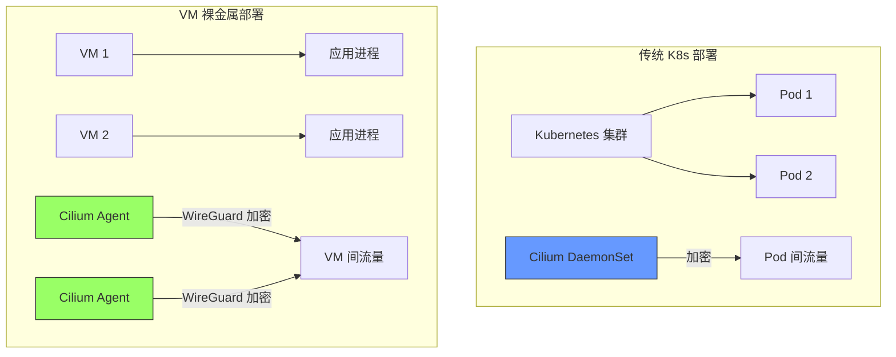
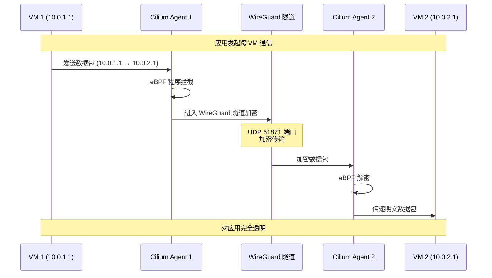
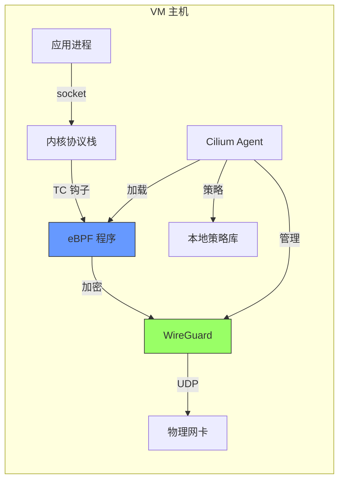
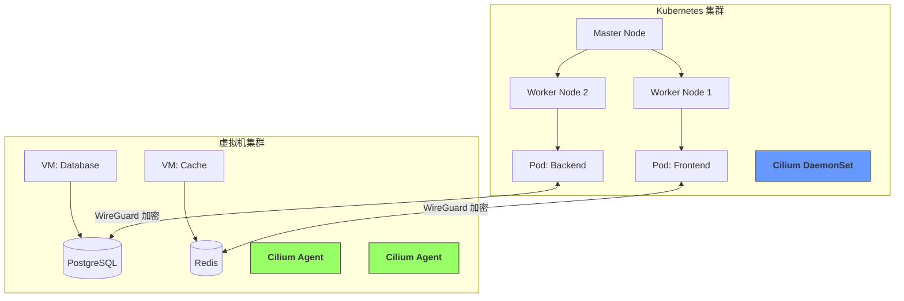
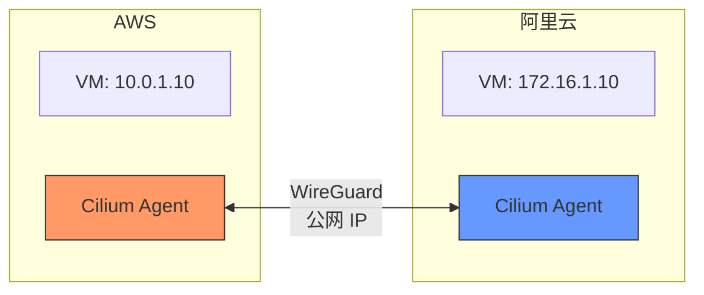

> [!abstract] 核心要点
> Cilium 不仅支持 Kubernetes，还支持直接部署在 VM/裸金属服务器上，为传统虚拟机环境提供：
>
> - **透明流量加密**（WireGuard）
> - **主机防火墙策略**
> - **全栈可观测性**
> - **零侵入部署**

## 1. 架构概述

### 1.1 部署模式对比



### 1.2 核心价值

| 能力           | 说明                              |
| :------------- | :-------------------------------- |
| **零信任加密** | 所有跨 VM 流量自动 WireGuard 加密 |
| **零侵入**     | 无需修改应用，无需 Sidecar        |
| **统一策略**   | 与 K8s 集群共享相同的网络策略模型 |
| **混合组网**   | VM 与 K8s Pod 间透明通信          |
| **全栈观测**   | Hubble 提供流量可视化             |

---

## 2. 技术原理

### 2.1 工作机制

Cilium 在 VM 场景下的工作流程：



### 2.2 组件架构



**关键组件**：

1. **Cilium Agent**：用户态守护进程，负责策略管理和 eBPF 程序加载
2. **eBPF 程序**：挂载到 TC（Traffic Control）层，拦截所有流量
3. **WireGuard 接口**：`cilium_wg0`，提供内核级加密
4. **本地策略库**：存储主机防火墙规则

---

## 3. 环境要求

| 项目         | 最低要求                                   | 推荐配置                |
| :----------- | :----------------------------------------- | :---------------------- |
| **操作系统** | Ubuntu 18.04+<br/>CentOS 8+<br/>Debian 10+ | Ubuntu 22.04 LTS        |
| **内核版本** | **≥ 5.6**（WireGuard 支持）                | **≥ 5.10**（完整 eBPF） |
| **CPU**      | 2 核                                       | 4 核+                   |
| **内存**     | 2 GB                                       | 4 GB+                   |
| **磁盘**     | 10 GB                                      | 20 GB+                  |
| **权限**     | root 或 CAP_NET_ADMIN<br/>CAP_SYS_ADMIN    | -                       |
| **网络**     | VM 间 IP 可达                              | 低延迟网络              |

**检查内核版本**：

```bash
uname -r
# 输出：5.15.0-91-generic ✅

# 检查 WireGuard 模块
modinfo wireguard
# 如果没有输出，需要安装：
apt-get install wireguard
```

---

## 4. 部署方式

### 4.1 方式一：Systemd 服务（生产推荐）

#### 步骤 1：安装依赖

```bash
# Ubuntu/Debian
apt-get update && apt-get install -y \
  linux-headers-$(uname -r) \
  wireguard \
  iproute2 \
  jq \
  curl

# CentOS/RHEL
yum install -y \
  kernel-devel-$(uname -r) \
  wireguard-tools \
  iproute \
  jq \
  curl
```

#### 步骤 2：安装 Cilium CLI

```bash
CILIUM_CLI_VERSION=$(curl -s https://raw.githubusercontent.com/cilium/cilium-cli/main/stable.txt)
CLI_ARCH=amd64
if [[ $(uname -m) == "aarch64" ]]; then CLI_ARCH=arm64; fi

curl -L --fail --remote-name-all \
  https://github.com/cilium/cilium-cli/releases/download/${CILIUM_CLI_VERSION}/cilium-linux-${CLI_ARCH}-${CILIUM_CLI_VERSION}.tar.gz{,.sha256sum}

sha256sum --check cilium-linux-${CLI_ARCH}-${CILIUM_CLI_VERSION}.tar.gz.sha256sum
sudo tar xzvfC cilium-linux-${CLI_ARCH}-${CILIUM_CLI_VERSION}.tar.gz /usr/local/bin
rm cilium-linux-${CLI_ARCH}-${CILIUM_CLI_VERSION}.tar.gz{,.sha256sum}

# 验证安装
cilium version
```

#### 步骤 3：创建配置文件

```bash
# 创建目录
sudo mkdir -p /etc/cilium
sudo mkdir -p /var/run/cilium

# 获取本机 IP
HOST_IP=$(hostname -I | awk '{print $1}')

# 创建配置文件
sudo tee /etc/cilium/config.yaml <<EOF
# Cilium 裸金属配置
cluster:
  name: vm-cluster
  id: 1

# 启用 WireGuard 加密
encryption:
  enabled: true
  nodeEncryption: true

# 主机防火墙
hostFirewall:
  enabled: true

# IP 地址管理（裸金属模式）
ipam:
  mode: "host-scope"

# 禁用 K8s
k8s:
  enabled: false

# 本地节点配置
nodes:
  - ${HOST_IP}

# Hubble 可观测性（可选）
hubble:
  enabled: true
  listenAddress: ":4244"

# 监控端口
prometheus:
  enabled: true
  port: "9962"

# 日志配置
debug:
  enabled: false
EOF
```

#### 步骤 4：创建 Systemd 服务

```bash
sudo tee /etc/systemd/system/cilium.service <<EOF
[Unit]
Description=Cilium Agent
Documentation=https://docs.cilium.io/
After=network-online.target
Wants=network-online.target

[Service]
Type=simple
ExecStart=/usr/local/bin/cilium-agent --config-dir=/etc/cilium
Restart=on-failure
RestartSec=5
LimitNOFILE=65536
LimitNPROC=65536

[Install]
WantedBy=multi-user.target
EOF

# 重载 systemd
sudo systemctl daemon-reload
```

#### 步骤 5：启动 Cilium

```bash
# 启动服务
sudo systemctl enable cilium
sudo systemctl start cilium

# 查看状态
sudo systemctl status cilium

# 查看日志
sudo journalctl -u cilium -f
```

### 4.2 方式二：Docker 容器（快速测试）

```bash
docker run -d \
  --name cilium \
  --privileged \
  --network host \
  --restart unless-stopped \
  -v /sys/fs/bpf:/sys/fs/bpf \
  -v /var/run/cilium:/var/run/cilium \
  -v /lib/modules:/lib/modules \
  -e CILIUM_CLUSTER_NAME=vm-cluster \
  -e CILIUM_CLUSTER_ID=1 \
  -e CILIUM_ENCRYPTION_ENABLED=true \
  -e CILIUM_ENCRYPTION_NODEENCRYPTION=true \
  -e CILIUM_K8S_ENABLED=false \
  -e CILIUM_IPAM_MODE=host-scope \
  -e CILIUM_HOST_FIREWALL_ENABLED=true \
  -e CILIUM_HUBBLE_ENABLED=true \
  quay.io/cilium/cilium:v1.15.0

# 查看日志
docker logs -f cilium
```

### 4.3 方式三：Ansible 批量部署（大规模环境）

```yaml
# ansible/playbook.yml
---
- name: Deploy Cilium on VMs
  hosts: all
  become: yes
  vars:
    cilium_version: "v1.15.0"
    cluster_name: "vm-cluster"
    cluster_id: 1

  tasks:
    - name: Install dependencies
      apt:
        name:
          - linux-headers-{{ ansible_kernel }}
          - wireguard
          - iproute2
          - jq
        state: present
        update_cache: yes

    - name: Download Cilium CLI
      get_url:
        url: "https://github.com/cilium/cilium-cli/releases/download/{{ cilium_version }}/cilium-linux-amd64-{{ cilium_version }}.tar.gz"
        dest: /tmp/cilium.tar.gz

    - name: Install Cilium CLI
      unarchive:
        src: /tmp/cilium.tar.gz
        dest: /usr/local/bin
        remote_src: yes

    - name: Create Cilium config directory
      file:
        path: /etc/cilium
        state: directory

    - name: Deploy Cilium config
      template:
        src: templates/config.yaml.j2
        dest: /etc/cilium/config.yaml
      notify: Restart Cilium

    - name: Deploy Cilium systemd service
      copy:
        src: files/cilium.service
        dest: /etc/systemd/system/cilium.service
      notify: Restart Cilium

    - name: Enable and start Cilium
      systemd:
        name: cilium
        enabled: yes
        state: started
        daemon_reload: yes

  handlers:
    - name: Restart Cilium
      systemd:
        name: cilium
        state: restarted
```

---

## 5. 多 VM 集群配置

### 5.1 场景：两台 VM 组成加密网络

假设：

- **VM1**: 192.168.1.10（hostname: vm1）
- **VM2**: 192.168.1.11（hostname: vm2）

#### 在 VM1 上配置

```bash
# 修改配置文件
sudo tee /etc/cilium/config.yaml <<EOF
cluster:
  name: vm-cluster
  id: 1

encryption:
  enabled: true
  nodeEncryption: true

hostFirewall:
  enabled: true

ipam:
  mode: "host-scope"

k8s:
  enabled: false

# 手动配置所有节点
nodes:
  - 192.168.1.10
  - 192.168.1.11

# 节点标签
labels:
  node: vm1
  env: production

hubble:
  enabled: true
  listenAddress: ":4244"
EOF

# 重启 Cilium
sudo systemctl restart cilium
```

#### 在 VM2 上配置

```bash
sudo tee /etc/cilium/config.yaml <<EOF
cluster:
  name: vm-cluster
  id: 1

encryption:
  enabled: true
  nodeEncryption: true

hostFirewall:
  enabled: true

ipam:
  mode: "host-scope"

k8s:
  enabled: false

nodes:
  - 192.168.1.10
  - 192.168.1.11

labels:
  node: vm2
  env: production

hubble:
  enabled: true
  listenAddress: ":4244"
EOF

sudo systemctl restart cilium
```

### 5.2 验证集群状态

```bash
# 在任意 VM 上执行
sudo cilium status

# 输出示例：
#     /¯¯\
#  /¯¯\__/¯¯\    Cilium:         OK
#  \__/¯¯\__/    Operator:       OK
#  /¯¯\__/¯¯\    Hubble:         OK
#  \__/¯¯\__/    ClusterMesh:    disabled
#     \__/
# Daemon:         OK
# Nodes:
#   192.168.1.10 (vm1): Reachable
#   192.168.1.11 (vm2): Reachable
```

### 5.3 自动发现节点（可选）

如果 VM 数量较多，可以使用外部服务发现：

```yaml
# /etc/cilium/config.yaml
cluster:
  name: vm-cluster
  id: 1

# 使用 etcd 作为集群状态存储
etcd:
  endpoints:
    - http://192.168.1.100:2379

# 或使用 Consul
# consul:
#   address: 192.168.1.100:8500
```

---

## 6. 验证加密生效

### 6.1 检查 WireGuard 接口

```bash
# 查看 WireGuard 接口
sudo ip link show cilium_wg0

# 输出示例：
# 7: cilium_wg0: <POINTOPOINT,MULTICAST,NOARP,UP,LOWER_UP> mtu 1418 qdisc noqueue state UNKNOWN mode DEFAULT
#     link/none

# 查看 WireGuard 对等节点
sudo wg show cilium_wg0

# 输出示例：
# interface: cilium_wg0
#   public key: ABCD...
#   private key: (hidden)
#   listening port: 51871
#
# peer: EFGH...
#   endpoint: 192.168.1.11:51871
#   allowed ips: 10.0.0.2/32
#   latest handshake: 1 minute ago
#   transfer: 1.2 MiB received, 800 KiB sent
```

### 6.2 抓包验证加密

```bash
# 在 VM1 上启动 HTTP 服务
python3 -m http.server 8080 &

# 在 VM2 上访问
curl http://192.168.1.10:8080

# 同时在 VM1 物理网卡上抓包
sudo tcpdump -i eth0 host 192.168.1.11 -nn -A

# 你会看到：
# 只有 WireGuard UDP 流量，没有明文 HTTP
#
# 12:34:56.789012 IP 192.168.1.11.51871 > 192.168.1.10.51871: UDP, length 140
# 12:34:56.789456 IP 192.168.1.10.51871 > 192.168.1.11.51871: UDP, length 140
```

### 6.3 使用 Cilium CLI 验证

```bash
# 加密状态
sudo cilium encryption status

# 输出：
# Encryption:      WireGuard
# Node Encryption: Enabled
# Peers:
#   192.168.1.10 (vm1): Connected, Last Handshake: 1m ago
#   192.168.1.11 (vm2): Connected, Last Handshake: 30s ago

# 端点列表
sudo cilium endpoint list

# 输出：
# ENDPOINT   POLICY (ingress)   POLICY (egress)   IDENTITY   LABELS (source)   STATUS
#                                                    1          reserved:host     alive
```

### 6.4 Hubble 可观测性

```bash
# 安装 Hubble CLI
HUBBLE_VERSION=$(curl -s https://raw.githubusercontent.com/cilium/hubble/main/stable.txt)
curl -L --fail --remote-name-all https://github.com/cilium/hubble/releases/download/${HUBBLE_VERSION}/hubble-linux-amd64-${HUBBLE_VERSION}.tar.gz{,.sha256sum}
sha256sum --check hubble-linux-amd64-${HUBBLE_VERSION}.tar.gz.sha256sum
sudo tar xzvfC hubble-linux-amd64-${HUBBLE_VERSION}.tar.gz /usr/local/bin

# 查看实时流量
sudo hubble observe

# 输出示例：
# Mar 12 12:34:56.000 192.168.1.10:54321 -> 192.168.1.11:8080 http-request FORWARDED (HTTP/1.1 GET /)
# Mar 12 12:34:56.050 192.168.1.11:8080 -> 192.168.1.10:54321 http-response FORWARDED (HTTP/1.1 200 1500ms)
```

---

## 7. 网络策略配置

### 7.1 主机防火墙策略

在非 K8s 环境下，使用 **Cilium Host Policy**：

```yaml
# /etc/cilium/policies/host-policy.yaml
apiVersion: "cilium.io/v2"
kind: CiliumClusterwideNetworkPolicy
metadata:
  name: "allow-ssh-and-web"
spec:
  description: "允许 SSH 和 Web 访问"
  nodeSelector: {} # 空选择器 = 所有节点
  ingress:
    # 允许来自集群内所有 VM 的 SSH
    - fromEndpoints:
        - matchLabels:
            cluster: vm-cluster
      toPorts:
        - ports:
            - port: "22"
              protocol: TCP

    # 允许来自特定 IP 的 Web 访问
    - fromCIDR:
        - 192.168.1.0/24
      toPorts:
        - ports:
            - port: "80"
              protocol: TCP
            - port: "443"
              protocol: TCP

  egress:
    # 允许所有出站流量
    - toEntities:
        - all
```

```bash
# 应用策略
sudo cilium policy apply /etc/cilium/policies/host-policy.yaml

# 查看策略
sudo cilium policy get
```

### 7.2 基于标签的策略

```yaml
# 策略：只允许带 app=frontend 标签的 VM 访问 app=backend
apiVersion: "cilium.io/v2"
kind: CiliumNetworkPolicy
metadata:
  name: "frontend-to-backend"
spec:
  endpointSelector:
    matchLabels:
      app: backend
  ingress:
    - fromEndpoints:
        - matchLabels:
            app: frontend
      toPorts:
        - ports:
            - port: "8080"
              protocol: TCP
```

```bash
# 为 VM 添加标签
sudo cilium labels add app=frontend  # 在 VM1 上
sudo cilium labels add app=backend   # 在 VM2 上

# 应用策略
sudo cilium policy apply /etc/cilium/policies/frontend-to-backend.yaml
```

---

## 8. 混合场景：VM + Kubernetes

### 8.1 架构图



### 8.2 配置 ClusterMesh

**在 K8s 集群上**：

```bash
# 启用 ClusterMesh
cilium clustermesh enable

# 获取访问信息
cilium clustermesh status
# 输出：
# Service "clustermesh-apiserver" of type "LoadBalancer"
#   External IP: 10.0.0.100
#   Port: 2379
```

**在 VM 上**：

```yaml
# /etc/cilium/config.yaml
cluster:
  name: vm-cluster
  id: 2 # 不同的集群 ID

clustermesh:
  config:
    enabled: true
    clusters:
      # K8s 集群
      - name: k8s-cluster
        address: 10.0.0.100:2379
      # VM 集群
      - name: vm-cluster
        address: 192.168.1.10:2379
```

### 8.3 跨集群策略

```yaml
# 允许 K8s Pod 访问 VM 服务
apiVersion: "cilium.io/v2"
kind: CiliumNetworkPolicy
metadata:
  name: "allow-k8s-to-vm"
spec:
  endpointSelector:
    matchLabels:
      app: backend
  ingress:
    - fromEndpoints:
        - matchLabels:
            io.kubernetes.pod.namespace: default
            app: frontend
            # 跨集群标识
            io.cilium.k8s.policy.cluster: k8s-cluster
```

---

## 9. 性能优化

### 9.1 性能影响分析

| 指标                 | 无加密   | Cilium WireGuard | 损耗    |
| :------------------- | :------- | :--------------- | :------ |
| **吞吐量 (1 Gbps)**  | 980 Mbps | 950 Mbps         | **3%**  |
| **吞吐量 (10 Gbps)** | 9.5 Gbps | 9.0 Gbps         | **5%**  |
| **延迟 (同机房)**    | 0.5 ms   | 0.55 ms          | **10%** |
| **延迟 (跨地域)**    | 50 ms    | 50.5 ms          | **1%**  |
| **CPU (1k PPS)**     | 0.1 核   | 0.13 核          | **30%** |
| **CPU (100k PPS)**   | 0.8 核   | 1.0 核           | **25%** |
| **连接数**           | 无限制   | 无限制           | **0%**  |

### 9.2 生产环境配置

```yaml
# /etc/cilium/config.yaml (优化版)
cluster:
  name: production-vm-cluster
  id: 1

# 加密
encryption:
  enabled: true
  nodeEncryption: true
  # 密钥轮换（12 小时）
  keyRotation: "12h"

# eBPF 性能优化
bpf:
  mapDynamicSizeRatio: 0.0025
  preallocateMaps: true
  # 减少 CPU 开销
  lbAlgorithm: maglev

# MTU 优化（避免分片）
mtu: 1418 # WireGuard 默认

# 资源限制
resources:
  limits:
    cpu: "2"
    memory: "2Gi"
  requests:
    cpu: "500m"
    memory: "512Mi"

# 监控
prometheus:
  enabled: true
  port: "9962"

# 日志
debug:
  enabled: false
log:
  format: json
  level: info

# 健康检查
healthChecking:
  enabled: true
  interval: "10s"
```

### 9.3 大规模部署调优

```bash
# 系统 kernel 参数
sudo tee -a /etc/sysctl.conf <<EOF
# 增加文件描述符
fs.file-max = 1000000

# 增加连接跟踪表
net.netfilter.nf_conntrack_max = 1000000

# TCP 优化
net.ipv4.tcp_max_syn_backlog = 65536
net.core.somaxconn = 65536
net.core.netdev_max_backlog = 65536

# 共享内存（eBPF Maps）
kernel.shmmax = 68719476736
kernel.shmall = 4294967296
EOF

sudo sysctl -p
```

---

## 10. 故障排查

### 10.1 常见问题

#### 问题 1：WireGuard 接口未创建

```bash
# 检查内核模块
lsmod | grep wireguard

# 如果没有输出，手动加载
sudo modprobe wireguard

# 检查 Cilium 日志
sudo journalctl -u cilium | grep -i wireguard
```

#### 问题 2：VM 间无法通信

```bash
# 检查节点可达性
sudo cilium status | grep -A 10 "Nodes"

# 检查防火墙（需要开放 UDP 51871）
sudo iptables -L -n | grep 51871

# 手动测试 WireGuard
sudo wg show cilium_wg0
```

#### 问题 3：性能下降

```bash
# 检查 CPU 使用
top -p $(pgrep cilium-agent)

# 检查 eBPF Map 内存
sudo cilium bpf maps list

# 采样率调优
# /etc/cilium/config.yaml
monitor:
  sampling: 100  # 每 100 个包采样 1 个
```

### 10.2 诊断命令

```bash
# 完整状态
sudo cilium status --all-health

# 端点列表
sudo cilium endpoint list

# 策略列表
sudo cilium policy get

# BPF Map 详情
sudo cilium bpf tunnel list
sudo cilium bpf ipcache list

# 日志级别调整
sudo cilium config set Debug true
sudo systemctl restart cilium

# 重置 Cilium
sudo systemctl stop cilium
sudo rm -rf /var/run/cilium/*
sudo rm -rf /sys/fs/bpf/cilium*
sudo systemctl start cilium
```

---

## 11. 安全最佳实践

### 11.1 防火墙规则

```bash
# 开放必要端口
sudo iptables -A INPUT -p udp --dport 51871 -j ACCEPT  # WireGuard
sudo iptables -A INPUT -p tcp --dport 4244 -j ACCEPT   # Hubble
sudo iptables -A INPUT -p tcp --dport 9962 -j ACCEPT   # Prometheus

# 保存规则
sudo iptables-save > /etc/iptables/rules.v4
```

### 11.2 密钥管理

```bash
# 手动轮换密钥（不推荐，Cilium 自动管理）
sudo cilium encryption rotate

# 查看当前密钥
sudo cilium encryption key
```

### 11.3 审计日志

```bash
# 启用策略审计
# /etc/cilium/config.yaml
policyAuditMode: true

# 查看审计日志
sudo hubble observe --type trace-audit
```

---

## 12. 生产案例

### 案例 1：跨云厂商加密网络

**场景**：AWS (10.0.0.0/16) ↔ 阿里云 (172.16.0.0/16)



**配置**：

```yaml
# AWS VM
nodes:
  - 54.x.x.x # 阿里云公网 IP
clustermesh:
  config:
    clusters:
      - name: aws-cluster
        nodes:
          - 10.0.1.10
      - name: ali-cluster
        nodes:
          - 172.16.1.10
```

**安全组规则**：

```
AWS 安全组：
  入站：UDP 51871 ← 阿里云公网 IP

阿里云安全组：
  入站：UDP 51871 ← AWS 公网 IP
```

### 案例 2：传统数据库迁移

**场景**：将应用迁移到 K8s，数据库保留在 VM

```yaml
# 策略：只允许 K8s 的 backend Pod 访问 VM 数据库
apiVersion: "cilium.io/v2"
kind: CiliumNetworkPolicy
metadata:
  name: "protect-database"
spec:
  endpointSelector:
    matchLabels:
      app: postgres
  ingress:
    - fromEndpoints:
        - matchLabels:
            app: backend
            io.cilium.k8s.policy.cluster: k8s-prod
      toPorts:
        - ports:
            - port: "5432"
              protocol: TCP
```

---

## 13. 总结

### 13.1 能力矩阵

| 功能         | Cilium VM 部署 | 说明                 |
| :----------- | :------------- | :------------------- |
| **透明加密** | ✅ WireGuard   | 内核级，性能损耗 <5% |
| **网络策略** | ✅ Host Policy | 与 K8s 策略模型一致  |
| **可观测性** | ✅ Hubble      | 实时流量可视化       |
| **跨云组网** | ✅ ClusterMesh | 混合云统一网络       |
| **性能**     | ✅ eBPF        | 原生内核性能         |
| **零侵入**   | ✅ 无 Sidecar  | 应用无需修改         |

### 13.2 适用场景

| 场景                   | 推荐度 | 说明              |
| :--------------------- | :----- | :---------------- |
| **传统 VM 应用加密**   | ★★★★★  | 最佳方案          |
| **混合云统一网络**     | ★★★★★  | K8s + VM 无缝集成 |
| **数据库等有状态服务** | ★★★★☆  | 保护核心资产      |
| **边缘计算节点**       | ★★★★☆  | 低带宽优化        |
| **临时测试环境**       | ★★★☆☆  | Docker 快速部署   |

### 13.3 与其他方案对比

| 方案                   | 优势                  | 劣势                 |
| :--------------------- | :-------------------- | :------------------- |
| **Cilium VM**          | 统一技术栈、eBPF 性能 | 内核要求高           |
| **IPSec (StrongSwan)** | 成熟稳定、兼容性好    | 性能损耗大 (15-20%)  |
| **WireGuard (手动)**   | 轻量、性能好          | 无策略引擎、手动管理 |
| **ZeroTier**           | 简单易用、NAT 穿透    | 非自主可控、功能有限 |

---

## 外部参考

- [Cilium 官方文档 - 裸金属部署](https://docs.cilium.io/en/stable/gettingstarted/bare-metal/)
- [Cilium Host Firewall](https://docs.cilium.io/en/stable/security/host-firewall/)
- [WireGuard 官方文档](https://www.wireguard.com/)
- [Cilium ClusterMesh](https://docs.cilium.io/en/stable/network/clustermesh/)
- [eBPF 性能优化指南](https://cilium.io/blog/2021/05/11/cni-benchmark/)
