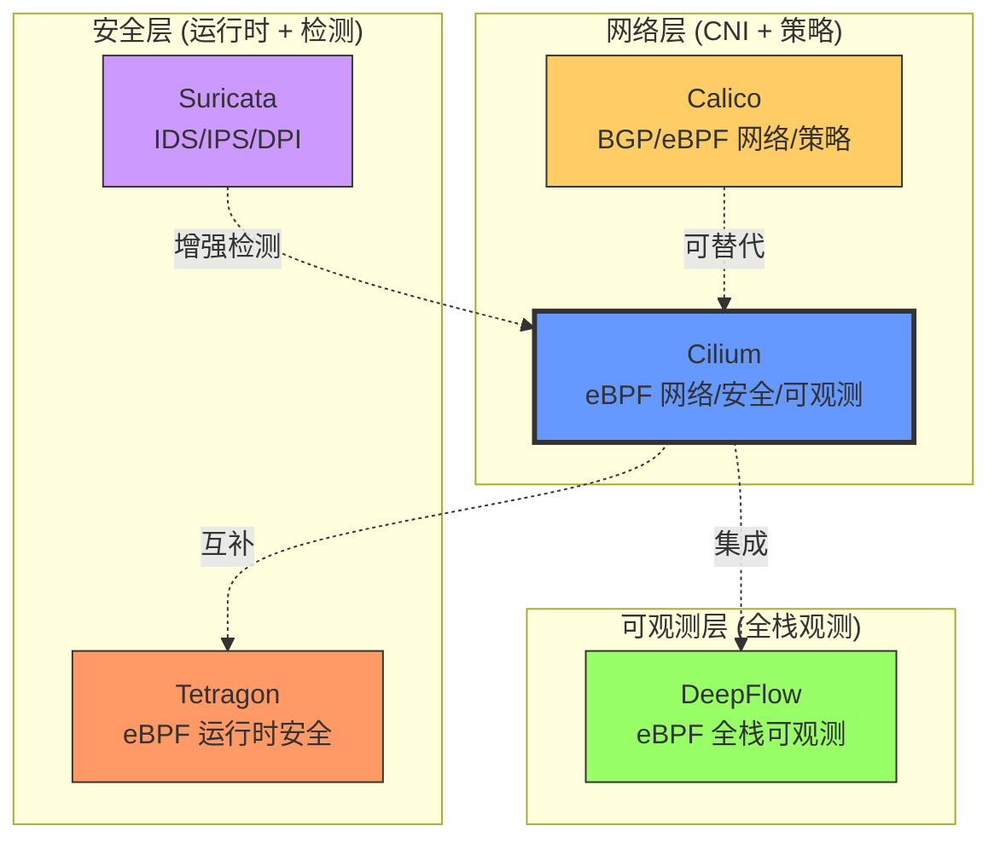
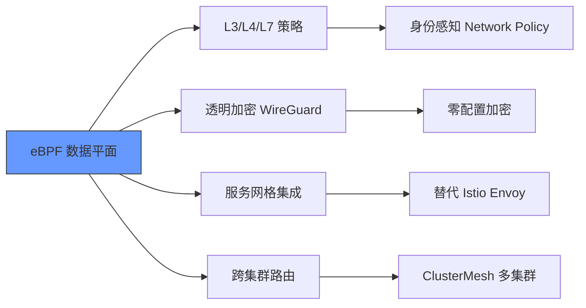
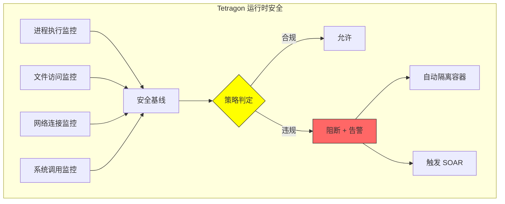
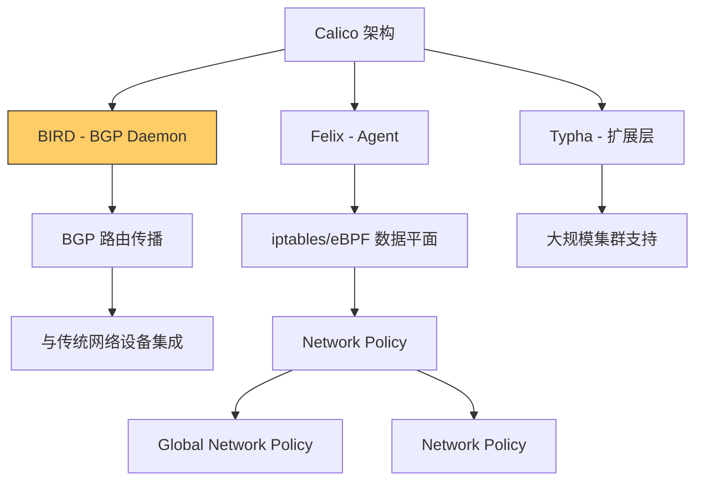
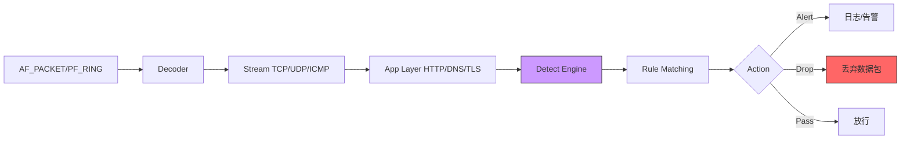
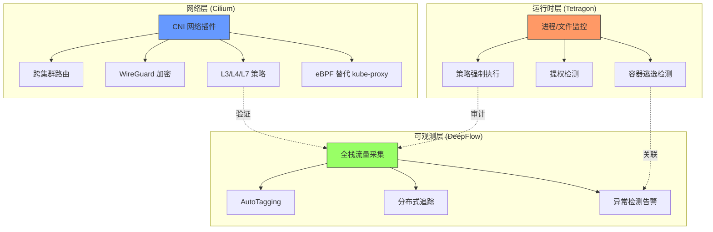
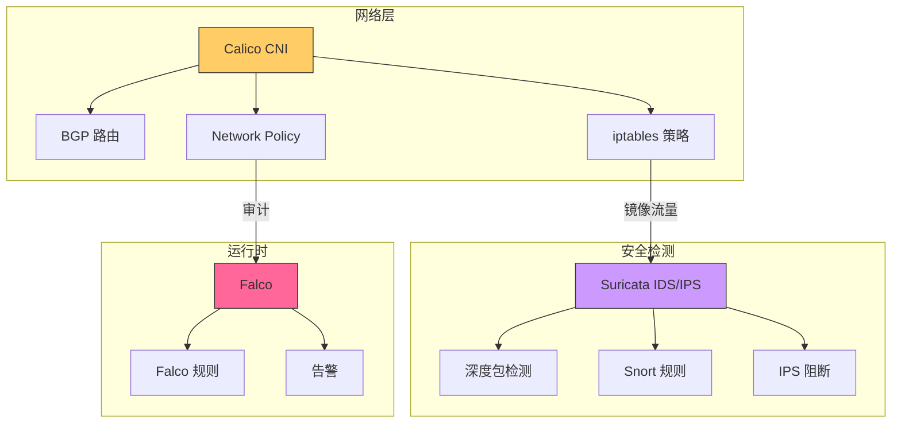
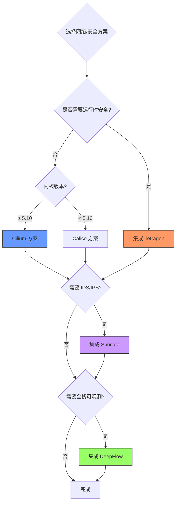

> [!abstract] 核心要点
> 本文深度对比五大云原生网络与安全技术在混合云场景下的能力矩阵：
>
> - **流向控制**：东西向/南北向流量路由与策略
> - **流量控制**：限流、QoS、负载均衡
> - **流量加密**：mTLS、IPSec、WireGuard
> - **内容检测**：DPI、协议解析、威胁识别
> - **权限检测**：RBAC、身份验证、访问控制
> - **安全检测**：异常行为、攻击识别、合规审计

## 1. 技术概览：五大核心引擎



### 1.1 技术定位对比

| 技术         | 核心定位                  | 技术栈             | 数据平面                | 成熟度 | 社区活跃度              |
| :----------- | :------------------------ | :----------------- | :---------------------- | :----- | :---------------------- |
| **Cilium**   | 全栈网络 + 安全 + 可观测  | Go + eBPF          | eBPF (必选)             | ★★★★★  | CNCF 毕业，Isovalent    |
| **Tetragon** | 运行时安全监控 + 强制执行 | C + eBPF           | eBPF                    | ★★★★☆  | Cilium 子项目，快速增长 |
| **DeepFlow** | 零侵入全栈可观测          | Rust + Go + eBPF   | eBPF + AF_PACKET        | ★★★★☆  | 中国原创，企业级        |
| **Calico**   | 成熟网络 CNI + 策略       | Go + iptables/eBPF | iptables 或 eBPF (可选) | ★★★★★  | CNCF 毕业，Tigera       |
| **Suricata** | IDS/IPS + DPI + NSM       | C + Rust           | AF_PACKET/PF_RING       | ★★★★★  | OISF，行业标准          |

---

## 2. 完整功能矩阵：5 × 6 能力对比

### 2.1 功能支持矩阵

| 功能维度     | **Cilium** | **Tetragon** | **DeepFlow** | **Calico** | **Suricata** |
| :----------- | :--------- | :----------- | :----------- | :--------- | :----------- |
| **流向控制** | ★★★★★      | ☆☆☆☆☆        | ★☆☆☆☆        | ★★★★★      | ★★☆☆☆        |
| **流量控制** | ★★★★☆      | ☆☆☆☆☆        | ★☆☆☆☆        | ★★★★☆      | ★★★☆☆        |
| **流量加密** | ★★★★★      | ☆☆☆☆☆        | ☆☆☆☆☆        | ★★☆☆☆      | ☆☆☆☆☆        |
| **内容检测** | ★★☆☆☆      | ★★★★☆        | ★★★☆☆        | ☆☆☆☆☆      | ★★★★★        |
| **权限检测** | ★★★★☆      | ★★★★★        | ★★★☆☆        | ★★★☆☆      | ★★☆☆☆        |
| **安全检测** | ★★★★☆      | ★★★★★        | ★★★★☆        | ★★☆☆☆      | ★★★★★        |

**评分说明**：

- ★★★★★：原生支持，功能完善
- ★★★★☆：支持良好，有限制
- ★★★☆☆：部分支持，需额外配置
- ★★☆☆☆：有限支持，非主要功能
- ★☆☆☆☆：极少支持或通过集成实现
- ☆☆☆☆☆：不支持

### 2.2 详细能力分解

#### 2.2.1 流向控制 (Traffic Routing & Policy)

| 技术         | 实现机制                | 能力范围                            | 限制                              |
| :----------- | :---------------------- | :---------------------------------- | :-------------------------------- |
| **Cilium**   | eBPF 程序挂载到 TC/XDP  | L3/L4/L7 策略、跨集群路由、服务网格 | 内核要求 4.19+，需替换 kube-proxy |
| **Calico**   | iptables 或 eBPF (可选) | L3/L4 策略、BGP 路由传播、网络隔离  | eBPF 模式功能少于 Cilium          |
| **DeepFlow** | 仅供观测，不控制        | -                                   | 无法实施策略                      |
| **Tetragon** | 仅观测系统调用          | -                                   | 不涉及网络路由                    |
| **Suricata** | 通过规则阻断 (IPS 模式) | 基于特征的阻断                      | 不适合做常规流量路由              |

**关键差异**：

- **Cilium**：L7 策略可基于 HTTP 路径、方法、头部的精细化控制
- **Calico**：BGP 能力最强，适合与传统网络设备集成
- **Suricata**：IPS 模式可阻断，但不是 CNI

#### 2.2.2 流量控制 (Rate Limiting & QoS)

| 技术         | 实现机制                   | 控制粒度            | 性能影响       |
| :----------- | :------------------------- | :------------------ | :------------- |
| **Cilium**   | eBPF Bandwidth Manager     | 按 Pod/Service 限流 | 低（内核级）   |
| **Calico**   | Linux TC (Traffic Control) | 按 Pod 限流         | 中（iptables） |
| **Suricata** | 规则匹配 + 流量限速        | 按规则限流          | 高（用户态）   |
| **DeepFlow** | 仅观测 QoS 指标            | -                   | -              |
| **Tetragon** | 不支持                     | -                   | -              |

**示例：Cilium 带宽限制**

```yaml
apiVersion: cilium.io/v2
kind: CiliumNetworkPolicy
metadata:
  name: bandwidth-limit
spec:
  endpointSelector:
    matchLabels:
      app: api-server
  egress:
    - toPorts:
        - ports:
            - port: "443"
          rules:
            bandwidth:
              # 限制出站带宽为 100 Mbps
              rate: "100M"
              # 允许突发流量
              burst: "10M"
```

#### 2.2.3 流量加密 (Encryption)

| 技术         | 加密方式             | 密钥管理 | 性能损耗       | 适用场景        |
| :----------- | :------------------- | :------- | :------------- | :-------------- |
| **Cilium**   | **WireGuard** (eBPF) | 自动轮换 | **极低** (<3%) | Pod-to-Pod 加密 |
| **Cilium**   | **IPSec**            | 手动配置 | 中等 (10-15%)  | 跨集群加密      |
| **Calico**   | WireGuard (实验性)   | 部分自动 | 低             | 节点间加密      |
| **Suricata** | 不支持加密           | -        | -              | -               |
| **DeepFlow** | 不支持加密           | -        | -              | -               |
| **Tetragon** | 不支持加密           | -        | -              | -               |

**Cilium WireGuard 优势**：

- **零配置**：启用即用，无需证书管理
- **内核级加密**：eBPF 在 TC 层加密，性能优于用户态 TLS
- **透明性**：应用层无需修改，对业务完全透明

```bash
# 启用 Cilium WireGuard 加密
cilium config set encryption enabled
cilium config set encryption-type wireguard
```

**限制**：

- 仅支持 IPv6 或 IPv4（不支持双栈同时加密）
- 需要内核 5.6+

#### 2.2.4 内容检测 (Deep Packet Inspection)

| 技术         | 检测深度                     | 协议支持  | 规则引擎                         | 误报率 |
| :----------- | :--------------------------- | :-------- | :------------------------------- | :----- |
| **Suricata** | **L2-L7 全栈**               | 300+ 协议 | **Snort/Suricata 规则** (最丰富) | ★★★☆☆  |
| **Tetragon** | 系统调用 + 文件 + 网络       | 应用行为  | 自定义 JSON 策略                 | ★★★★☆  |
| **Cilium**   | L7 HTTP/DNS/Kafka            | 有限      | L7 策略                          | ★★★★★  |
| **DeepFlow** | L7 协议解析 (HTTP/SQL/Redis) | 20+ 协议  | AutoTagging                      | ★★★★☆  |
| **Calico**   | 无 DPI 能力                  | -         | -                                | -      |

**Suricata 核心能力**：

```yaml
# 示例：检测 SQL 注入攻击
alert http any any -> any any (
msg:"SQL Injection Attempt";
flow:established,to_server;
content:"POST"; http_method;
content:"application/x-www-form-urlencoded"; http_header;
pcre:"/(\%27)|(\')|(\-\-)|(\%23)|(#)/i";
classtype:web-application-attack;
sid:1000001;
rev:1;
)
```

**关键对比**：

- **Suricata**：行业标准规则集（Emerging Threats），覆盖 CVE、恶意软件、APT
- **Tetragon**：运行时行为检测，识别异常进程、文件访问
- **DeepFlow**：被动观测协议内容，无主动阻断

#### 2.2.5 权限检测 (Access Control)

| 技术         | 检测维度                                  | 实施机制            | 审计能力     |
| :----------- | :---------------------------------------- | :------------------ | :----------- |
| **Tetragon** | **系统调用 + 文件 + 网络 + Capabilities** | eBPF 策略强制执行   | 实时审计日志 |
| **Cilium**   | 网络身份 (Identity-based)                 | eBPF Network Policy | 流日志       |
| **Calico**   | 网络层 RBAC                               | iptables/eBPF ACL   | 网络策略日志 |
| **Suricata** | 网络行为模式                              | 规则匹配            | 告警日志     |
| **DeepFlow** | 元数据标签                                | 仅观测              | 无强制执行   |

**Tetragon 策略示例**：

```yaml
apiVersion: cilium.io/v1alpha1
kind: TracingPolicy
metadata:
  name: "deny-process-execution"
spec:
  kprobes:
    - call: "sys_execve"
      return: true
      args:
        - index: 0
          type: "string"
      returnArg: 0
      returnArgAction: "Post"
      # 拒绝非白名单进程执行
      selectors:
        - matchPIDs:
            - operator: "NotIn"
              values:
                - 1 # init
                - 1001 # app-user
          matchArgs:
            - index: 0
              operator: "Equal"
              values:
                - "/usr/bin/app"
          matchActions:
            - action: "Override"
              argError: -1 # 返回权限错误
```

#### 2.2.6 安全检测 (Security Detection)

| 技术         | 检测范围                              | 检测方式          | 响应能力              | 场景     |
| :----------- | :------------------------------------ | :---------------- | :-------------------- | :------- |
| **Suricata** | **网络攻击、CVE、恶意软件、数据泄露** | 特征库 + 异常检测 | **阻断 (IPS)**        | 网络边界 |
| **Tetragon** | **容器逃逸、提权、异常进程**          | 行为基线 + 策略   | **阻断 + 隔离**       | 运行时   |
| **Cilium**   | 网络异常、策略违规                    | 流量分析 + 策略   | 阻断 (Network Policy) | 网络     |
| **DeepFlow** | 流量异常、性能问题                    | 统计分析 + ML     | 告警                  | 可观测   |
| **Calico**   | 网络策略违规                          | 流量日志          | 阻断 (Network Policy) | 网络     |

**检测能力对比**：

| 攻击类型      | Suricata | Tetragon | Cilium | DeepFlow |
| :------------ | :------- | :------- | :----- | :------- |
| **DDoS 攻击** | ★★★★★    | ☆☆☆☆☆    | ★★★☆☆  | ★★★★☆    |
| **SQL 注入**  | ★★★★★    | ★☆☆☆☆    | ★★☆☆☆  | ★★★☆☆    |
| **容器逃逸**  | ★☆☆☆☆    | ★★★★★    | ★★☆☆☆  | ★★☆☆☆    |
| **横向移动**  | ★★★★☆    | ★★★★☆    | ★★★★★  | ★★★★☆    |
| **数据泄露**  | ★★★★☆    | ★★★☆☆    | ★★☆☆☆  | ★★★★★    |
| **零日攻击**  | ★★☆☆☆    | ★★★★☆    | ★☆☆☆☆  | ★★★☆☆    |

---

## 3. 深度技术分析

### 3.1 Cilium：全栈网络 + 安全平台

**核心优势**：



**关键实现**：

1. **Identity-based Policy**：Pod 重启后 Identity 不变，策略自动生效
2. **L7 Policy**：无需 Sidecar，eBPF 直接解析 HTTP
   ```yaml
   apiVersion: cilium.io/v2
   kind: CiliumNetworkPolicy
   metadata:
     name: allow-get-only
   spec:
     endpointSelector:
       matchLabels:
         app: frontend
     egress:
       - toEndpoints:
           - matchLabels:
               app: api
         toPorts:
           - ports:
               - port: "8080"
             rules:
               http:
                 - method: "GET"
                   path: "/api/v1/.*"
   ```

**限制**：

- 内核要求高（推荐 5.10+）
- 学习曲线陡峭
- 大规模集群需调优

### 3.2 Tetragon：运行时安全专家

**核心价值**：



**关键能力**：

1. **内核级监控**：Hook 1000+ 系统调用
2. **Namespace 感知**：自动关联 Pod/Container
3. **实时阻断**：无需重启，立即生效

**容器逃逸检测示例**：

```yaml
apiVersion: cilium.io/v1alpha1
kind: TracingPolicy
metadata:
  name: detect-container-escape
spec:
  kprobes:
    # 检测特权容器挂载宿主机文件系统
    - call: "security_sb_mount"
      args:
        - index: 0
          type: "string" # dev_name
        - index: 1
          type: "string" # dir_name
      selectors:
        - matchArgs:
            - index: 1
              operator: "Prefix"
              values:
                - "/host"
                - "/root"
                - "/etc"
          matchActions:
            - action: "Sigkill"
```

**限制**：

- 仅 Linux
- 需要 CAP_SYS_ADMIN 权限
- 策略编写复杂

### 3.3 DeepFlow：零侵入全栈可观测

**核心优势**：

- **零侵入**：无需修改应用，无需 Sidecar
- **AutoTagging**：自动注入 K8s/云平台标签
- **全栈追踪**：从内核到应用层

**安全观测场景**：

```sql
-- DeepFlow SQL: 检测异常跨命名空间访问
SELECT
    namespace,
    target_namespace,
    service,
    count(*) as cross_ns_requests,
    avg(response_duration) as latency_ms
FROM l7_flow_log
WHERE
    time > now() - INTERVAL 5 MINUTE
    AND namespace != target_namespace
    AND response_code >= 400
GROUP BY namespace, target_namespace, service
HAVING cross_ns_requests > 100
ORDER BY cross_ns_requests DESC
```

**限制**：

- 仅观测，无控制能力
- 采样可能漏检
- 企业版费用高

### 3.4 Calico：成熟的网络策略专家

**核心优势**：



**BGP 能力（最强）**：

```yaml
apiVersion: projectcalico.org/v3
kind: BGPPeer
metadata:
  name: bgp-peer-to-router
spec:
  peerIP: 192.168.1.1
  asNumber: 64512
  # 将 Pod CIDR 通告给物理路由器
---
apiVersion: projectcalico.org/v3
kind: IPPool
metadata:
  name: default-pool
spec:
  cidr: 10.244.0.0/16
  # 禁用 NAT，实现 Pod IP 直接路由
  natOutgoing: false
```

**限制**：

- L7 能力弱（需 Tier 支持）
- eBPF 模式功能少于 Cilium
- 加密能力有限

### 3.5 Suricata：行业标准 IDS/IPS

**核心架构**：



**规则示例：检测 Kubernetes API 滥用**

```yaml
# Suricata 规则：检测未授权的 kubectl 访问
alert http any any -> any 6443 (
  msg:"Unauthorized Kubernetes API Access";
  flow:established,to_server;
  content:"GET"; http_method;
  content:"/api/v1/"; http_uri;
  content:"Bearer"; http_header; nocase;
  pcre:"/Bearer\s+[a-zA-Z0-9\-_\.]+/H";
  # 检查 Token 是否在黑名单中（需集成外部情报）
  metadata: former_category HUNTING;
  classtype: attempted-admin;
  sid:2026001;
  rev:1;
)
```

**Suricata 关键能力**：

1. **EVE JSON**：结构化日志，便于 SIEM 集成
2. **Lua 脚本**：自定义复杂检测逻辑
3. **文件提取**：自动提取传输文件并扫描
4. **TLS 解密**：配合解密中间件检测加密流量

**限制**：

- 性能开销大（建议专用节点）
- 加密流量检测困难
- 需持续更新规则库

---

## 4. 混合云场景最佳组合方案

### 4.1 组合方案矩阵

| 方案           | 组合技术                     | 覆盖能力         | 复杂度 | 成本 | 适用场景         |
| :------------- | :--------------------------- | :--------------- | :----- | :--- | :--------------- |
| **全栈方案**   | Cilium + Tetragon + DeepFlow | 6/6 全覆盖       | ★★★★★  | $$$  | 金融/政务/高安全 |
| **经典方案**   | Calico + Suricata + Falco    | 5/6 (加密弱)     | ★★★☆☆  | $$   | 传统企业/混合云  |
| **极简方案**   | Cilium (独立)                | 4/6 (内容检测弱) | ★★☆☆☆  | $    | 中小企业/云原生  |
| **观测优先**   | DeepFlow + Suricata          | 3/6 (无控制)     | ★★☆☆☆  | $$   | 安全合规审计     |
| **运行时优先** | Calico + Tetragon            | 4/6 (加密弱)     | ★★★☆☆  | $$   | 容器安全加固     |

### 4.2 推荐方案一：全栈云原生安全（Cilium + Tetragon + DeepFlow）

**架构图**：



**部署配置**：

```yaml
# 1. 安装 Cilium（启用所有功能）
helm install cilium cilium/cilium \
  --namespace kube-system \
  --set encryption.enabled=true \
  --set encryption.type=wireguard \
  --set kubeProxyReplacement=strict \
  --set hubble.enabled=true \
  --set hubble.relay.enabled=true

# 2. 安装 Tetragon（运行时安全）
helm install tetragon cilium/tetragon \
  --namespace kube-system \
  --set tetragon.extraArgs.enable-process-cred=true \
  --set tetragon.extraArgs.enable-process-exec=true

# 3. 安装 DeepFlow（可观测性）
helm install deepflow deepflow/deepflow \
  --namespace deepflow \
  --set deepflow-agent.config.controller-ips=deepflow-server
```

**覆盖能力**：

- ✅ 流向控制：Cilium (L3/L4/L7)
- ✅ 流量控制：Cilium Bandwidth Manager
- ✅ 流量加密：Cilium WireGuard
- ✅ 内容检测：Tetragon + Cilium L7
- ✅ 权限检测：Tetragon
- ✅ 安全检测：Cilium + Tetragon + DeepFlow

**优势**：

- **统一技术栈**：全部基于 eBPF，低开销
- **深度集成**：三者可共享 eBPF 程序，避免重复 Hook
- **全栈覆盖**：网络 + 运行时 + 可观测

**劣势**：

- **内核要求**：5.10+（推荐 5.15+）
- **学习成本**：三个系统都需要深入学习
- **资源消耗**：DeepFlow ClickHouse 集群

### 4.3 推荐方案二：传统混合云（Calico + Suricata + Falco）

**架构**：



**覆盖能力**：

- ✅ 流向控制：Calico (L3/L4)
- ✅ 流量控制：Calico TC
- ⚠️ 流量加密：Calico WireGuard（实验性）
- ✅ 内容检测：Suricata（最强）
- ✅ 权限检测：Falco
- ✅ 安全检测：Suricata + Falco

**优势**：

- **成熟稳定**：Calico 和 Suricata 都是行业标准
- **传统兼容**：BGP 可与物理网络设备无缝集成
- **规则丰富**：Suricata 拥有最丰富的威胁检测规则

**劣势**：

- **性能开销**：Suricata 需要镜像流量，iptables 性能不如 eBPF
- **L7 能力弱**：Calico 无法解析 HTTP 路径
- **三个独立系统**：集成复杂

### 4.4 功能缺失补全方案

如果选择某个单一技术，如何补全缺失功能？

| 基础技术            | 缺失功能     | 补全方案                            | 集成难度 |
| :------------------ | :----------- | :---------------------------------- | :------- |
| **Cilium (单用)**   | 深度内容检测 | 集成 Suricata（通过 TrafficMirror） | ★★★☆☆    |
| **Cilium (单用)**   | 运行时安全   | 启用 Tetragon（原生集成）           | ★☆☆☆☆    |
| **Calico (单用)**   | L7 策略      | 升级到 Calico + Tigera Enterprise   | ★★★★☆    |
| **Calico (单用)**   | 加密         | 手动配置 WireGuard                  | ★★★☆☆    |
| **DeepFlow (单用)** | 所有控制能力 | 必须配合 CNI (Cilium/Calico)        | ★★★★☆    |
| **Suricata (单用)** | 流向控制     | 配合 CNI，仅做检测                  | ★★☆☆☆    |

---

## 5. 实施建议与最佳实践

### 5.1 分阶段实施路线

**阶段一：基础网络 + 策略（1-2 个月）**

```yaml
# 第一步：选择 CNI
选择:
  - 云原生新项目: Cilium
  - 传统企业混合云: Calico
  - 性能极致场景: Cilium (eBPF 数据平面)

# 第二步：网络策略
实施:
  - 默认拒绝所有流量
  - 逐步放行必要通信
  - 使用命名空间隔离
```

**阶段二：加密 + 可观测（1-2 个月）**

```bash
# 启用 Cilium WireGuard
cilium config set encryption enabled
cilium config set encryption-type wireguard

# 部署 DeepFlow
helm install deepflow deepflow/deepflow
```

**阶段三：运行时安全（1 个月）**

```yaml
# 部署 Tetragon
helm install tetragon cilium/tetragon

# 导入 CIS Benchmark 策略
kubectl apply -f tetragon-policies/
```

**阶段四：深度检测（可选）**

```yaml
# 部署 Suricata（如需 IDS/IPS）
# 需要专用节点 + 流量镜像
apiVersion: apps/v1
kind: DaemonSet
metadata:
  name: suricata
spec:
  template:
    spec:
      containers:
        - name: suricata
          image: jasonish/suricata:latest
          securityContext:
            capabilities:
              add: ["NET_ADMIN", "SYS_ADMIN"]
          volumeMounts:
            - name: traffic-mirror
              mountPath: /var/run/suricata
```

### 5.2 性能调优建议

| 技术         | 关键配置                                         | 性能影响           |
| :----------- | :----------------------------------------------- | :----------------- |
| **Cilium**   | `--bpf-map-dynamic-size-ratio=0.0025`            | 减少 eBPF Map 内存 |
| **Tetragon** | `--enable-process-exec=false`（生产可关闭）      | 降低 CPU 5-10%     |
| **DeepFlow** | `l7_log_packet_size=512`                         | 降低内存和存储     |
| **Calico**   | `calicoctl ipam configure --strictaffinity=true` | 提升路由性能       |
| **Suricata** | `af-packet: ring-size: 65535`                    | 提升包处理能力     |

### 5.3 故障排查工具

```bash
# Cilium 状态检查
cilium status
cilium policy get

# Tetragon 日志
kubectl logs -n kube-system ds/tetragon -c export-stdout

# DeepFlow 查询
deepflow-ctl query "SELECT * FROM l7_flow_log LIMIT 10"

# Calico 策略检查
calicoctl get networkpolicy -o yaml

# Suricata 规则测试
suricata -c /etc/suricata/suricata.yaml -T
```

---

## 6. 总结与决策树

### 6.1 技术选型决策树



### 6.2 最终推荐

| 场景                     | 推荐组合                                | 理由                       |
| :----------------------- | :-------------------------------------- | :------------------------- |
| **金融/政务（高安全）**  | Cilium + Tetragon + DeepFlow + Suricata | 6/6 全覆盖，零信任         |
| **互联网公司（云原生）** | Cilium + Tetragon                       | 统一 eBPF 技术栈，性能最优 |
| **传统企业（混合云）**   | Calico + Suricata + Falco               | 成熟稳定，BGP 友好         |
| **中小企业（成本敏感）** | Cilium (独立)                           | 功能覆盖 4/6，零额外成本   |
| **合规审计（观测优先）** | DeepFlow + Suricata                     | 满足审计需求，无侵入       |

### 6.3 关键结论

1. **无单点解决方案**：没有任何一个技术能独立覆盖所有 6 大功能
2. **eBPF 是趋势**：Cilium/Tetragon/DeepFlow 都基于 eBPF，未来统一度高
3. **Suricata 不可替代**：在内容检测和安全检测方面，Suricata 的规则库最完善
4. **组合不可避免**：实际生产环境至少需要 2-3 个技术的组合

---

## 外部参考

- [Cilium 官方文档](https://docs.cilium.io/)
- [Tetragon GitHub](https://github.com/cilium/tetragon)
- [DeepFlow 官方文档](https://deepflow.io/docs/zh/)
- [Calico 官方文档](https://docs.projectcalico.org/)
- [Suricata 官方文档](https://suricata.readthedocs.io/)
- [Falco vs Tetragon 对比](https://medium.com/@mughal.asim/falco-vs-tetragon-a-runtime-security-showdown-for-kubernetes-a0e9fb9f30a0)
- [Cilium vs Calico 深度对比](https://www.tigera.io/learn/guides/cilium-vs-calico/)
- [eBPF 网络安全 2026 趋势](https://isovalent.com/blog/post/networking-and-ebpf-predictions-for-2026/)
