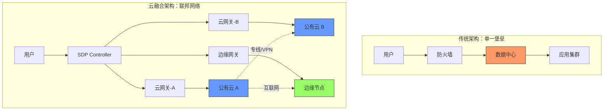
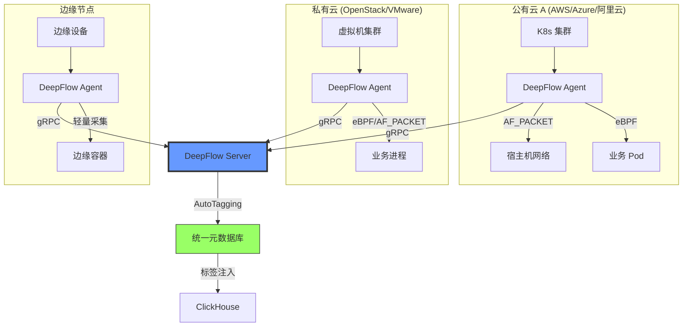
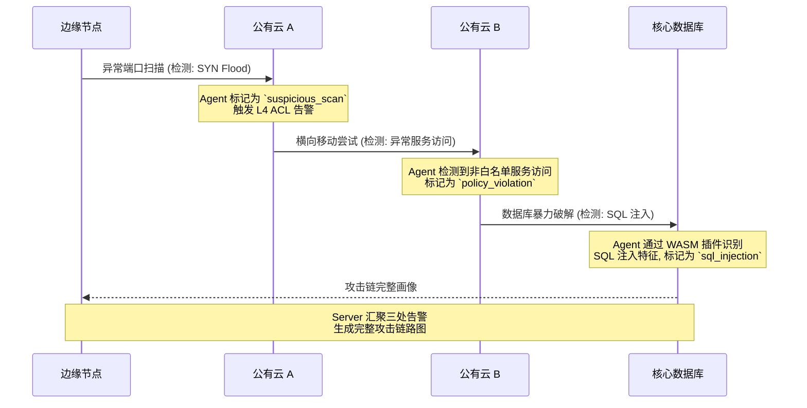
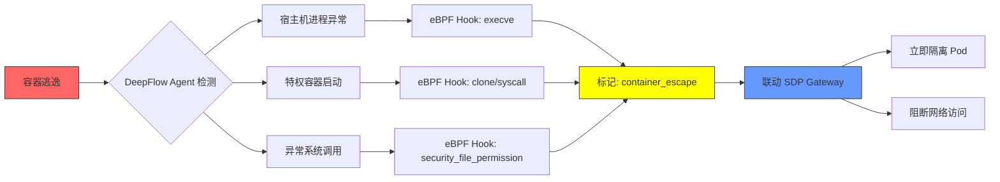
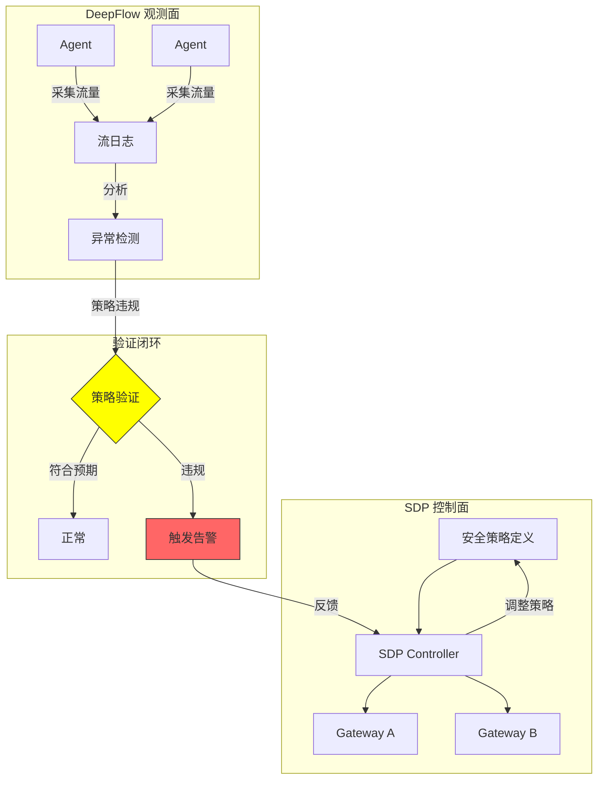
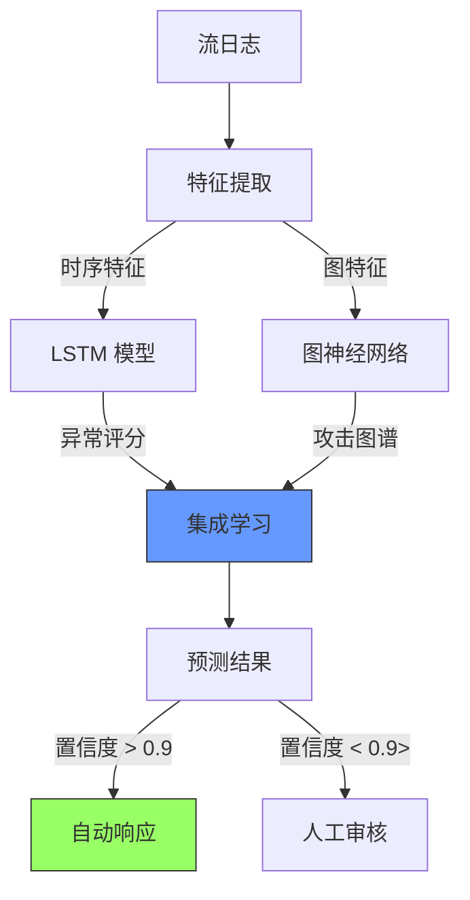

> [!abstract] DeepFlow 云融合安全系列
>
> - **[[2026-03-12-deepflow-cloud-hybrid-security-detection|云融合安全检测 (当前文章)]]**
> - [[2026-03-08-deepflow-detailed-analysis-report|架构分析报告]]
> - [[2026-03-08-deepflow-strategy-and-implementation|策略下发机制]]
> - [[2026-03-08-deepflow-traffic-capture-technology|流量采集技术]]

## 1. 云融合场景的安全困境

现代企业的基础设施已从"单一数据中心"演变为 **"混合云 + 多云 + 边缘节点"** 的复杂拓扑。这种异构环境带来了前所未有的安全挑战。

### 1.1 架构演进：从堡垒到联邦



### 1.2 三大核心挑战

| 挑战维度         | 问题描述                                 | 传统方案的局限                         |
| :--------------- | :--------------------------------------- | :------------------------------------- |
| **可见性碎片化** | 每朵云独立的监控系统，跨云流量成为"黑洞" | 只能看到本云内的流量，云间通信无法追踪 |
| **策略不一致**   | 不同云厂商的安全策略语言和执行机制各异   | 无法实现统一的安全基线，策略同步困难   |
| **攻击面扩大**   | 混合架构增加了网络边界和攻击路径         | 边界防火墙无法检测东西向流量           |

---

## 2. DeepFlow 的多云统一观测能力

DeepFlow 通过 **"重 Agent、中心化 Server"** 架构，在异构云环境中实现统一的安全观测。

### 2.1 部署模式：适配所有云环境



### 2.2 元数据自动同步机制

DeepFlow 的 **AutoTagging** 是实现跨云统一观测的核心：

| 云环境       | 元数据源                       | 自动注入的标签                                                     |
| :----------- | :----------------------------- | :----------------------------------------------------------------- |
| **公有云**   | 云厂商 API (AWS API/Azure API) | `cloud_provider`, `region`, `vpc_id`, `subnet_id`, `instance_type` |
| **K8s 集群** | K8s APIServer                  | `namespace`, `pod_name`, `service_name`, `deployment`, `node_name` |
| **私有云**   | OpenStack API / VMware vCenter | `tenant_id`, `vm_name`, `host_cluster`, `datacenter`               |
| **边缘节点** | 本地配置 + 中心同步            | `edge_site`, `device_type`, `geo_location`                         |

**关键价值**：

- **跨云拓扑自动构建**：Server 自动聚合所有 Agent 上报的元数据，构建全网资源拓扑。
- **统一查询语言**：无论流量经过多少朵云，都可通过统一的 SQL/PromQL 进行查询。

```sql
-- 示例：查询跨云异常流量
SELECT
    cloud_provider,
    region,
    service_name,
    count(*) as abnormal_flows
FROM l7_flow_log
WHERE
    response_code >= 500
    AND cloud_provider IN ('aws', 'azure', 'aliyun')
    AND time > now() - INTERVAL 5 MINUTE
GROUP BY cloud_provider, region, service_name
ORDER BY abnormal_flows DESC
```

---

## 3. 安全检测场景深度剖析

### 3.1 场景一：跨云攻击链追踪

**攻击场景**：攻击者攻破边缘节点，通过云间专线横向移动到核心数据库。

**传统方案盲点**：

- 边缘节点日志缺失
- 云间专线流量无法监控
- 攻击路径难以串联

**DeepFlow 检测逻辑**：



**实现要点**：

1. **L4 层检测**：利用 eBPF 监控 `tcp_retransmit_skb`，识别异常重传和端口扫描。
2. **L7 层检测**：通过 WASM 插件分析 SQL/HTTP 载荷，识别注入攻击。
3. **跨云关联**：Server 通过五元组和时间戳，自动将分散在三朵云的告警串联成攻击链。

### 3.2 场景二：云间数据泄露检测

**攻击场景**：恶意内部人员通过云间专线将敏感数据从私有云传输到公有云。

**检测机制**：

| 检测维度         | 技术手段          | 触发条件                             |
| :--------------- | :---------------- | :----------------------------------- |
| **流量基线异常** | 时序数据库分析    | 云间流量超过历史均值 3σ (3 倍标准差) |
| **敏感数据识别** | WASM 插件正则匹配 | HTTP Body 包含身份证/银行卡号模式    |
| **异常时间窗口** | 行为基线分析      | 凌晨 2-5 点的非工作时间大流量传输    |
| **未授权路径**   | SDP 策略校验      | 流量未经过 SDP Gateway 认证          |

**DeepFlow 策略配置示例**：

```yaml
# data_exfiltration_detection.yaml
policy_name: "云间数据泄露检测"
type: L7
rules:
  - name: "敏感数据传输检测"
    match:
      cloud_provider_source: "private_cloud"
      cloud_provider_dest: "public_cloud"
      time_window: "02:00-05:00"
      payload_patterns:
        - "身份证号正则"
        - "银行卡号正则"
    action:
      - tag: "potential_data_exfiltration"
      - pcap: true # 自动触发原始报文抓取
      - alert:
          severity: "critical"
          webhook: "https://security-team.example.com/alert"
```

### 3.3 场景三：多云环境下的容器逃逸检测

**攻击场景**：攻击者利用容器漏洞逃逸到宿主机，并在不同云环境的容器间横向移动。

**检测路径**：



**技术实现**：

1. **eBPF Security Hook**：DeepFlow Agent 挂载 `security_sb_mount`、`security_file_permission` 等 LSM (Linux Security Module) 钩子。
2. **行为基线建模**：学习正常容器的系统调用模式，当检测到 `mount /proc`、`modprobe` 等危险操作时触发告警。
3. **自动化响应**：通过与 [[2026-03-11-sdp-application-identity-mtls|SDP Gateway]] 联动，立即撤销容器的网络访问权限。

---

## 4. 与 SDP 零信任架构的深度集成

DeepFlow 不仅是观测工具，更是 SDP 策略的 **"实时验证引擎"**。

### 4.1 零信任策略验证闭环



### 4.2 集成场景示例

**场景**：SDP 策略规定"生产环境 Pod 只能访问只读数据库副本"。

**DeepFlow 验证逻辑**：

```sql
-- 实时监控：检测是否有生产 Pod 访问主库的写操作
SELECT
    pod_name,
    database_instance,
    sql_operation,
    count(*) as violation_count
FROM l7_flow_log
WHERE
    namespace = 'production'
    AND database_instance IN ('master-db-01', 'master-db-02')
    AND sql_operation IN ('INSERT', 'UPDATE', 'DELETE')
    AND time > now() - INTERVAL 1 MINUTE
GROUP BY pod_name, database_instance, sql_operation
HAVING violation_count > 0
```

**自动化响应**：

1. DeepFlow 检测到违规写操作，标记为 `sdp_policy_violation`。
2. 触发 Webhook 通知 SDP Controller。
3. SDP Controller 立即更新 Gateway ACL，阻断该 Pod 的数据库访问。
4. DeepFlow 持续监控，验证阻断是否生效。

---

## 5. 实施最佳实践

### 5.1 部署架构建议

| 环境规模               | 推荐架构                           | 关键配置                            |
| :--------------------- | :--------------------------------- | :---------------------------------- |
| **小型 (<50 节点)**    | 单体 Server + Agent DaemonSet      | ClickHouse 单节点, Agent 采样率 10% |
| **中型 (50-500 节点)** | Server 集群 + 专用 ClickHouse 集群 | ClickHouse 3 节点, Agent 采样率 5%  |
| **大型 (>500 节点)**   | 多地域 Server + 联邦 ClickHouse    | 每地域独立 Server, 跨地域查询联邦   |

### 5.2 安全检测性能优化

```yaml
# agent_config.yaml - 安全场景优化配置
performance:
  # 限制 CPU 使用,避免影响业务
  max_cpus: 1
  max_memory: 512MB

  # 系统负载熔断
  system_load_circuit_breaker_threshold: 1.0

security:
  # L7 载荷截断 - 平衡安全与性能
  l7_log_packet_size: 2048 # 安全场景建议增大到 2048

  # 协议黑白名单 - 仅解析必要协议
  l7_protocol_enabled:
    - http
    - mysql
    - redis
    - dns # DNS 流量对安全检测至关重要

  # 敏感数据检测
  sensitive_data_detection:
    enabled: true
    patterns:
      - "id_card_regex"
      - "credit_card_regex"
      - "api_key_regex"
```

### 5.3 告警分级与响应

| 告警级别      | 触发条件                         | 响应动作                       | MTTR 目标 |
| :------------ | :------------------------------- | :----------------------------- | :-------- |
| **P0 - 紧急** | 容器逃逸、数据泄露、SQL 注入成功 | 自动阻断 + 立即电话 + 自动隔离 | <5 分钟   |
| **P1 - 严重** | 跨云攻击链、DDoS 攻击、策略绕过  | 自动限流 + 短信通知 + 人工确认 | <15 分钟  |
| **P2 - 警告** | 异常端口扫描、可疑横向移动       | 记录日志 + 邮件通知            | <1 小时   |
| **P3 - 信息** | 基线偏离、性能异常               | Dashboard 展示                 | <24 小时  |

---

## 6. 未来演进：AI 驱动的自适应安全

DeepFlow 正在探索基于 **时序异常检测** 和 **图神经网络 (GNN)** 的下一代安全能力：

### 6.1 AI 模型集成架构



### 6.2 自适应安全策略

- **动态基线调整**：根据业务周期自动调整流量基线,减少误报。
- **攻击预测**：基于历史攻击模式,预测潜在攻击路径。
- **策略优化**：自动分析策略效果,推荐优化建议。

---

## 7. 总结与展望

DeepFlow 在云融合场景下的安全检测能力,为企业构建 **"零信任 + 全观测 + 自动化"** 的安全体系提供了坚实基础：

- **统一视图**：打破多云孤岛,实现全网流量可视。
- **深度检测**：从 L4 网络层到 L7 应用层的全栈安全分析。
- **策略验证**：作为 SDP 的"实时验证引擎",确保零信任策略有效落地。
- **自动响应**：从检测到阻断,实现分钟级的威胁响应。

**与 SDP 系列的关系**：

- 本文是 [[2026-03-11-sdp-zero-trust-overview|SDP 零信任概论]] 的观测层实现。
- 与 [[2026-03-11-sdp-application-identity-mtls|应用身份篇]] 结合,实现身份 + 行为的双重验证。
- 为 [[2026-03-11-sdp-advanced-threat-defense|高级威胁防御]] 提供检测能力支撑。

---

## 外部参考

- [DeepFlow 官方文档 - 多云部署](https://deepflow.io/docs/zh/ce-install/overview/)
- [NIST 零信任架构标准](https://www.nist.gov/publications/zero-trust-architecture)
- [Cilium 多集群网络策略](https://cilium.io/blog/2021/07/13/cilium-clustermesh/)
- [Cloud Security Alliance - SDP v2.0](https://cloudsecurityalliance.org/research/working-groups/software-defined-perimeter/)
