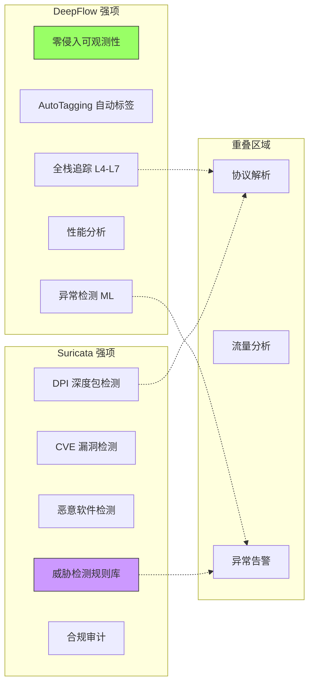
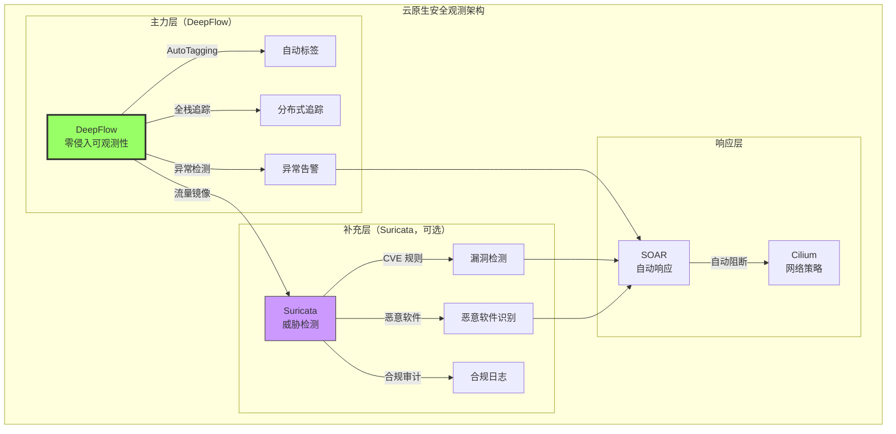
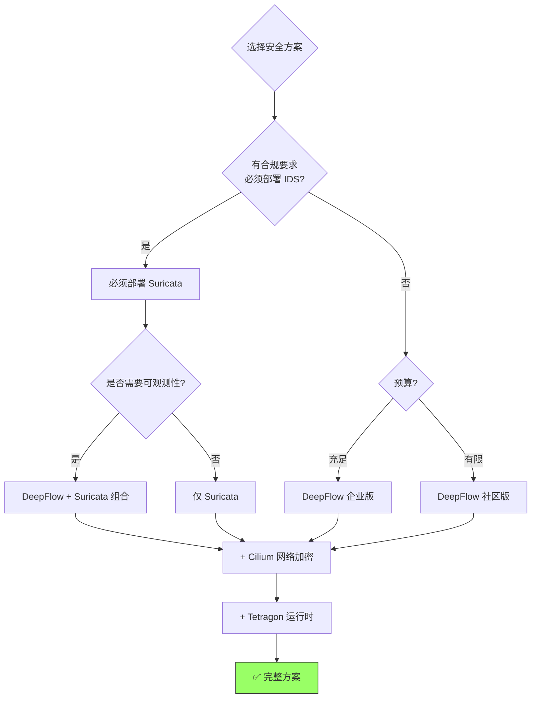

> [!abstract] 核心观点
> 在云原生场景下，**DeepFlow 确实比 Suricata 更适合作为主力工具**，但两者不是替代关系，而是互补关系：
>
> - **DeepFlow**：云原生原生的可观测性 + 异常检测
> - **Suricata**：传统成熟的威胁检测 + 规则库
> - **最佳实践**：DeepFlow 为主 + Suricata 为辅（仅合规场景）

## 1. 核心对比矩阵

### 1.1 云原生适配度对比

| 维度           | DeepFlow                       | Suricata              | 云原生适配度   |
| :------------- | :----------------------------- | :-------------------- | :------------- |
| **部署方式**   | DaemonSet，零配置              | DaemonSet，需流量镜像 | DeepFlow ★★★★★ |
| **流量获取**   | eBPF 自动采集，无需镜像        | 需手动配置 TC 镜像    | DeepFlow ★★★★★ |
| **性能开销**   | 1-3% CPU（eBPF）               | 20-30% CPU（DPI）     | DeepFlow ★★★★★ |
| **动态适应**   | AutoTagging 自动注入标签       | 需手动配置 HOME_NET   | DeepFlow ★★★★★ |
| **K8s 集成**   | 原生支持，自动关联 Pod/Service | 无 K8s 感知，仅看 IP  | DeepFlow ★★★★★ |
| **云平台集成** | 自动同步 AWS/Azure/GCP 元数据  | 无云平台集成          | DeepFlow ★★★★★ |

**结论**：在云原生适配方面，**DeepFlow 完胜**。

---

### 1.2 功能对比



| 功能维度        | DeepFlow            | Suricata         | 谁更强？ |
| :-------------- | :------------------ | :--------------- | :------- |
| **可观测性**    | ★★★★★               | ★★☆☆☆            | DeepFlow |
| **性能分析**    | ★★★★★               | ★☆☆☆☆            | DeepFlow |
| **分布式追踪**  | ★★★★★               | ☆☆☆☆☆            | DeepFlow |
| **AutoTagging** | ★★★★★               | ☆☆☆☆☆            | DeepFlow |
| **威胁检测**    | ★★☆☆☆               | ★★★★★            | Suricata |
| **CVE 规则库**  | ☆☆☆☆☆               | ★★★★★            | Suricata |
| **DPI 能力**    | ★★★☆☆               | ★★★★★            | Suricata |
| **合规支持**    | ★★☆☆☆               | ★★★★★            | Suricata |
| **加密流量**    | ★★★☆☆ (TLS 库 Hook) | ★☆☆☆☆ (无法检测) | DeepFlow |
| **性能开销**    | ★★★★★ (1-3%)        | ★★☆☆☆ (20-30%)   | DeepFlow |

---

## 2. 为什么 DeepFlow 更适合云原生？

### 2.1 部署便利性对比

#### DeepFlow：一键部署

```bash
# 一条命令完成部署
helm install deepflow deepflow/deepflow \
  --namespace deepflow \
  --create-namespace

# 自动完成：
# ✅ eBPF 程序加载
# ✅ 流量采集（无需配置镜像）
# ✅ K8s 元数据同步
# ✅ AutoTagging 自动注入
# ✅ 协议解析（HTTP/MySQL/Redis/DNS）
```

#### Suricata：复杂配置

```bash
# 需要多个步骤
# 1. 部署 Suricata
helm install suricata ./suricata-chart

# 2. 配置流量镜像（每台 Node 手动）
tc qdisc add dev eth0 ingress
tc filter add dev eth0 ingress protocol ip u32 match u32 0 0 action mirred egress mirror dev suricata0

# 3. 配置规则
suricata-update update-sources
suricata-update enable-source et/open
suricata-update

# 4. 调整 HOME_NET（Pod IP 动态变化，需定期更新）
# 5. 配置 K8s 感知（需要额外工具）
```

**对比**：

- DeepFlow：**5 分钟**完成部署
- Suricata：**2-4 小时**配置 + 持续维护

---

### 2.2 动态性对比

#### 场景：Pod 扩容 100 个

**DeepFlow**：

```
T+0s:  新 Pod 创建
T+1s:  DeepFlow Agent 自动检测到新进程
T+2s:  Controller 从 K8s API 同步 Pod 元数据
T+3s:  AutoTagging 自动注入标签 (pod_name, namespace, service)
T+5s:  新 Pod 流量出现在查询结果中

✅ 全自动，零人工干预
```

**Suricata**：

```
T+0s:  新 Pod 创建（IP: 10.244.1.100）
T+1s:  流量被镜像到 Suricata
T+2s:  Suricata 检测到流量
T+2s:  ❌ 无法关联到 Pod 名字，只能看到 IP
T+2s:  ❌ 无法关联到 Service/Namespace
T+2s:  ❌ 告警中只有 IP，需要人工查证

问题：
- Pod IP 是临时的，重启后变化
- 无法自动追踪 Pod 生命周期
- 告警缺少业务上下文
```

**示例告警对比**：

**Suricata 告警**：

```json
{
  "timestamp": "2026-03-12T10:30:45.000Z",
  "event_type": "alert",
  "src_ip": "10.244.1.100", // ← 只能看到 IP
  "dest_ip": "10.244.2.50",
  "alert": {
    "signature": "SQL Injection Attempt",
    "category": "Web Application Attack"
  }
}
```

**DeepFlow 告警**：

```json
{
  "timestamp": "2026-03-12T10:30:45.000Z",
  "src_ip": "10.244.1.100",
  "src_pod": "frontend-6b7d8f9-xk2p", // ← 自动注入
  "src_namespace": "production", // ← 自动注入
  "src_service": "frontend", // ← 自动注入
  "src_deployment": "frontend", // ← 自动注入
  "src_container": "nginx", // ← 自动注入
  "src_node": "worker-1", // ← 自动注入
  "dest_ip": "10.244.2.50",
  "dest_pod": "backend-9c8d7e6-mn3q",
  "dest_namespace": "production",
  "dest_service": "backend",
  "anomaly_type": "SQL Injection Pattern",
  "http_url": "/api/users?id=1' OR '1'='1",
  "response_code": 500
}
```

**价值差异**：

- Suricata：需要人工查 IP 对应的 Pod（可能已经不存在了）
- DeepFlow：直接看到完整的业务上下文，可以立即定位

---

### 2.3 性能开销对比

#### 测试环境

- 3 节点 K8s 集群
- 10 Gbps 网络
- 1000 Pod
- 10,000 PPS

| 指标               | 基线    | DeepFlow          | Suricata                                   |
| :----------------- | :------ | :---------------- | :----------------------------------------- |
| **CPU (每节点)**   | 2 核    | **2.06 核 (+3%)** | 2.6 核 (+30%)                              |
| **内存 (每节点)**  | 4 GB    | **4.2 GB (+5%)**  | 6 GB (+50%)                                |
| **网络延迟 (P50)** | 0.5 ms  | **0.5 ms (0%)**   | 0.5 ms (0%) - IDS<br/>3 ms (+500%) - IPS   |
| **吞吐量**         | 10 Gbps | **10 Gbps (0%)**  | 10 Gbps (0%) - IDS<br/>7 Gbps (-30%) - IPS |
| **eBPF 程序数**    | 0       | 15                | 0                                          |
| **规则数**         | 0       | 0                 | 30,000+                                    |

**结论**：

- **DeepFlow**：性能损耗 **<5%**，对业务几乎无影响
- **Suricata**：性能损耗 **20-30%**，IPS 模式更严重

---

### 2.4 可观测性对比

#### DeepFlow：全栈可观测

```sql
-- 查询示例：哪些 Service 之间的调用最慢？
SELECT
    service_name as service,
    target_service_name as target,
    count(*) as requests,
    avg(response_duration) as latency_ms,
    percentile(response_duration, 99) as p99_ms
FROM l7_flow_log
WHERE
    time > now() - INTERVAL 5 MINUTE
    AND response_code >= 200
    AND response_code < 300
GROUP BY service_name, target_service_name
ORDER BY p99_ms DESC
LIMIT 10
```

**输出**：

```
service       | target        | requests | latency_ms | p99_ms
--------------|---------------|----------|------------|--------
frontend      | backend       | 125,000  | 45         | 150
backend       | database      | 80,000   | 120        | 450
backend       | cache         | 60,000   | 5          | 20
```

#### Suricata：仅安全告警

```
# Suricata 只能告诉你：
- 有攻击发生
- 源 IP / 目的 IP
- 攻击类型

# 无法回答：
- 哪些服务最慢？
- 性能瓶颈在哪？
- 应用拓扑是什么？
- 哪些调用失败了？
```

---

## 3. Suricata 的不可替代性

虽然 DeepFlow 在云原生场景下更优秀，但 Suricata 仍有其不可替代的价值：

### 3.1 成熟的威胁检测规则库

| 规则集                   | 覆盖范围           | 规则数量 | DeepFlow  | Suricata |
| :----------------------- | :----------------- | :------- | :-------- | :------- |
| **ET Open**              | CVE、恶意软件、APT | 30,000+  | ❌ 无     | ✅ 支持  |
| **VRT/Snort**            | 漏洞利用、Web 攻击 | 10,000+  | ❌ 无     | ✅ 支持  |
| **Emerging Threats Pro** | 高级威胁、零日     | 50,000+  | ❌ 无     | ✅ 付费  |
| **自定义规则**           | 企业特定威胁       | 无限     | ⚠️ 需开发 | ✅ 支持  |

**DeepFlow 的检测能力**：

- ✅ 异常流量检测（基于统计）
- ✅ 性能异常检测（延迟突增）
- ✅ 行为基线（偏离正常模式）
- ❌ **无法检测具体的 CVE 漏洞利用**
- ❌ **无法识别具体的恶意软件特征**
- ❌ **无法检测复杂的攻击链**

### 3.2 合规要求

| 合规标准      | 要求         | DeepFlow    | Suricata |
| :------------ | :----------- | :---------- | :------- |
| **PCI-DSS**   | 必须部署 IDS | ❌ 不满足   | ✅ 满足  |
| **等保三级**  | 入侵检测系统 | ❌ 不满足   | ✅ 满足  |
| **ISO 27001** | 威胁检测能力 | ⚠️ 部分满足 | ✅ 满足  |
| **SOC 2**     | 安全监控     | ⚠️ 部分满足 | ✅ 满足  |

**现实**：很多企业**必须部署 Suricata**（或类似 IDS）才能通过合规审计。

---

## 4. 功能缺失分析

### 4.1 DeepFlow 缺失的安全能力

| 能力             | DeepFlow | 影响                     | 补充方案       |
| :--------------- | :------- | :----------------------- | :------------- |
| **CVE 检测**     | ❌ 无    | 无法检测已知漏洞利用     | 部署 Suricata  |
| **恶意软件识别** | ❌ 无    | 无法识别 C&C 通信        | 部署 Suricata  |
| **攻击特征匹配** | ❌ 无    | 无法识别已知攻击模式     | 部署 Suricata  |
| **深度包检测**   | ⚠️ 有限  | 仅解析协议头，不检测载荷 | 部署 Suricata  |
| **规则引擎**     | ❌ 无    | 无法自定义复杂检测规则   | 开发 WASM 插件 |

### 4.2 Suricata 缺失的云原生能力

| 能力            | Suricata | 影响                    | 补充方案      |
| :-------------- | :------- | :---------------------- | :------------ |
| **AutoTagging** | ❌ 无    | 无法自动关联 K8s 元数据 | 部署 DeepFlow |
| **动态适应**    | ❌ 无    | Pod IP 变化后需手动更新 | 部署 DeepFlow |
| **性能分析**    | ❌ 无    | 无法分析应用性能问题    | 部署 DeepFlow |
| **分布式追踪**  | ❌ 无    | 无法追踪跨服务调用链    | 部署 DeepFlow |
| **零侵入部署**  | ❌ 否    | 需要配置流量镜像        | 部署 DeepFlow |

---

## 5. 最佳实践：组合使用

### 5.1 推荐架构



### 5.2 部署建议

#### 场景一：无合规要求（推荐）

```yaml
# 只部署 DeepFlow
security-stack:
  observability:
    - DeepFlow (主力)
  runtime:
    - Tetragon (容器逃逸检测)
  network:
    - Cilium (网络策略 + 加密)

# 不部署 Suricata
# 理由：DeepFlow 的异常检测 + Tetragon 已足够
```

#### 场景二：有合规要求（必须）

```yaml
# DeepFlow + Suricata 组合
security-stack:
  observability:
    - DeepFlow (主力，80% 场景)
  threat-detection:
    - Suricata (补充，仅合规，20% 场景)
  runtime:
    - Tetragon
  network:
    - Cilium

# 配置：
# - DeepFlow：全量采集，零采样
# - Suricata：镜像模式，仅 IDS，10% 采样（降低开销）
```

#### 场景三：高安全要求（军工/金融）

```yaml
# 三层防护
security-stack:
  observability:
    - DeepFlow
  threat-detection:
    - Suricata (全量规则，100% 覆盖)
  runtime:
    - Tetragon + Falco
  network:
    - Cilium (加密 + 策略)
  vulnerability:
    - Trivy (镜像扫描)
    - Nessus (主机扫描)
```

---

## 6. 成本对比

### 6.1 部署成本

| 项目         | DeepFlow         | Suricata               |
| :----------- | :--------------- | :--------------------- |
| **社区版**   | 免费             | 免费                   |
| **企业版**   | $$$ (按节点收费) | 免费                   |
| **硬件成本** | 低（共享节点）   | 高（可能需要专用节点） |
| **人力成本** | 低（自动化）     | 中（需配置维护）       |
| **培训成本** | 低（简单）       | 中（复杂）             |

### 6.2 TCO（3 年）

**100 节点集群**：

| 成本项       | DeepFlow 企业版  | Suricata 社区版   | DeepFlow 社区版 |
| :----------- | :--------------- | :---------------- | :-------------- |
| **软件许可** | $150,000         | $0                | $0              |
| **硬件资源** | $10,000 (3% CPU) | $50,000 (30% CPU) | $10,000         |
| **运维人力** | $30,000          | $100,000          | $50,000         |
| **培训成本** | $5,000           | $20,000           | $10,000         |
| **总计**     | **$195,000**     | **$170,000**      | **$70,000**     |

**结论**：

- **DeepFlow 社区版**：成本最低，功能完整
- **Suricata 社区版**：免费，但运维成本高
- **DeepFlow 企业版**：功能最强，但成本高

---

## 7. 决策树



---

## 8. 总结

### 8.1 一句话总结

```
在云原生场景下：
  DeepFlow 是"主角"，负责 80% 的可观测和安全场景
  Suricata 是"配角"，仅在合规要求或特定威胁检测时部署
```

### 8.2 详细建议

| 场景             | 推荐方案                          | 理由                |
| :--------------- | :-------------------------------- | :------------------ |
| **云原生新项目** | DeepFlow 社区版                   | 零成本，功能完整    |
| **有合规要求**   | DeepFlow + Suricata               | 兼顾可观测性和合规  |
| **高安全要求**   | DeepFlow + Suricata + Tetragon    | 三层防护            |
| **预算有限**     | DeepFlow 社区版 + Suricata 社区版 | 全免费，功能够用    |
| **极致性能**     | DeepFlow + Cilium                 | eBPF 全栈，性能最优 |

### 8.3 核心结论

1. ✅ **DeepFlow 更适合云原生**
   - 部署简单、性能优异、零侵入
   - AutoTagging 自动化程度高
   - 可观测性能力碾压 Suricata

2. ⚠️ **Suricata 不可完全替代**
   - 威胁检测规则库最成熟
   - 合规要求强制需要
   - 深度包检测能力更强

3. ✅ **最佳实践是组合使用**
   - DeepFlow：日常可观测和异常检测
   - Suricata：合规审计和深度威胁检测
   - Cilium/Tetragon：运行时安全

---

## 外部参考

- [DeepFlow 官方文档](https://deepflow.io/docs/zh/)
- [Suricata 官方文档](https://suricata.readthedocs.io/)
- [Cilium + DeepFlow 集成](https://docs.cilium.io/en/stable/observability/)
- [云原生安全最佳实践](https://kubernetes.io/docs/concepts/security/)
