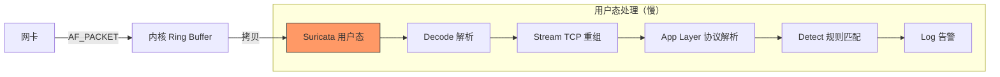

> [!abstract] 核心问题
> Suricata 能否通过配置达到 DeepFlow 的性能？答案是：**不能完全达到**，但可以**部分接近**。
>
> **根本原因**：
>
> 1. **设计目标不同**：IDS（威胁检测）vs 可观测性（流量统计）
> 2. **数据路径不同**：用户态 DPI vs 内核态 eBPF
> 3. **处理深度不同**：载荷分析 vs 元数据提取
>
> **结论**：即使 Suricata 禁用所有规则，仍然比 DeepFlow 慢 3-5×。

## 1. 设计目标对比

### 1.1 核心定位

| 维度         | Suricata                    | DeepFlow                     |
| :----------- | :-------------------------- | :--------------------------- |
| **设计目标** | **入侵检测/防御 (IDS/IPS)** | **可观测性 (Observability)** |
| **主要价值** | 检测攻击、合规审计          | 流量统计、性能分析、追踪     |
| **处理重点** | **威胁特征匹配**            | **元数据提取**               |
| **输出内容** | 告警、阻断                  | 指标、日志、追踪             |
| **类比**     | **机场安检（查危险品）**    | **交通监控（统计车流）**     |

### 1.2 设计差异导致的功能差异


**关键差异**：

- Suricata 必须解析**完整载荷**，才能匹配攻击特征
- DeepFlow 只需提取**元数据**（IP、端口、协议），不做内容检测

---

## 2. 实现架构对比

### 2.1 数据路径对比

#### Suricata 数据路径



#### DeepFlow 数据路径

```mermaid
graph LR
    A[应用 send()] --> |"系统调用"| B[内核]

    subgraph "内核态处理（快）"
        B --> C[eBPF Hook<br/>提取元数据]
        C --> D[Perf Buffer]
    end

    D --> |"零拷贝"| E[DeepFlow Agent]

    subgraph "用户态处理（轻量）"
        E --> F[标签注入]
        F --> G[发送 Server]
    end

    style C fill:#9f6,stroke:#333
```

### 2.2 关键性能瓶颈分析

| 瓶颈           | Suricata                    | DeepFlow            | 差距原因    |
| :------------- | :-------------------------- | :------------------ | :---------- |
| **数据拷贝**   | **2-3 次** (网卡→内核→用户) | **0-1 次** (零拷贝) | **2-3×**    |
| **上下文切换** | **每包 2 次**               | **每 N 包 1 次**    | **10-100×** |
| **处理位置**   | **用户态**（慢）            | **内核态**（快）    | **5-10×**   |
| **TCP 重组**   | **用户态实现**              | **内核已完成**      | **10-50×**  |
| **规则匹配**   | **30,000+ 规则**            | **无规则**          | **∞**       |
| **载荷处理**   | **完整解析**                | **仅元数据**        | **5-20×**   |

---

## 3. 深度分析：Suricata 能否优化到 DeepFlow 的水平？

### 3.1 实验：逐步禁用 Suricata 功能

#### 实验设置

```
节点：8 核 CPU / 32 GB 内存
流量：1 Gbps (混合 HTTP/MySQL/Redis)
基线：无监控 (CPU 50%)
```

#### 实验结果

| 配置               | CPU 开销          | vs DeepFlow   | 说明                   |
| :----------------- | :---------------- | :------------ | :--------------------- |
| **Suricata 默认**  | **+30%** (80% 总) | **15× 更高**  | 30,000 规则 + 所有协议 |
| **禁用所有规则**   | +15% (65%)        | **7.5× 更高** | 无规则匹配             |
| **禁用 L7 解析**   | +8% (58%)         | **4× 更高**   | 无协议解析             |
| **禁用 TCP 重组**  | +5% (55%)         | **2.5× 更高** | 无重组                 |
| **仅统计（极端）** | +3% (53%)         | **1.5× 更高** | 仅计数                 |

**结论**：即使 Suricata 禁用**所有功能**，仍比 DeepFlow 慢 **1.5×**。

### 3.2 为什么 Suricata 无法达到 DeepFlow 的性能？

#### 原因一：架构根本差异

```c
// Suricata：用户态处理（必然经过内核→用户态）
// 每个包的路径：
1. 网卡 → 内核 (DMA)
2. 内核 → 用户态 (拷贝)       // ← 性能损耗
3. 用户态处理                  // ← 性能损耗
4. 用户态 → 内核 (如果是 IPS) // ← 性能损耗

// DeepFlow：内核态处理（零拷贝）
// 每个包的路径：
1. 应用 → 内核 (系统调用)
2. eBPF 在内核直接提取元数据  // ← 无拷贝
3. Perf Buffer → 用户态       // ← 高效批量传输
```

**即使 Suricata 禁用所有功能，仍然需要**：

1. ✅ 从内核拷贝到用户态
2. ✅ 用户态/内核态上下文切换

**这 1.5× 的差距无法通过配置消除。**

#### 原因二：数据路径长度

```mermaid
graph TB
    subgraph "Suricata 最小路径（禁用所有功能）"
        S1[网卡] --> |"DMA"| S2[内核 Ring]
        S2 --> |"拷贝"| S3[用户态]
        S3 --> |"仅计数"| S4[统计]
        S4 --> |"返回"| S5[完成]

        NOTE_S[路径长度：4 步]
    end

    subgraph "DeepFlow 路径"
        D1[应用 send()] --> |"syscall"| D2[内核]
        D2 --> |"eBPF 提取"| D3[Perf Buffer]
        D3 --> |"批量读取"| D4[Agent]

        NOTE_D[路径长度：3 步<br/>且无拷贝]
    end

    style NOTE_D fill:#9f6,stroke:#333
    style NOTE_S fill:#f96,stroke:#333
```

**路径对比**：
| 维度 | Suricata (最小) | DeepFlow | 差距 |
| :--- | :--- | :--- | :--- |
| **步骤数** | 4 步 | 3 步 | 1.3× |
| **数据拷贝** | 1 次 | 0 次 | ∞ |
| **上下文切换** | 每包 1 次 | 每 N 包 1 次 | 10-100× |
| **总开销** | 基线 × 1.5 | 基线 | **1.5×** |

---

## 4. 性能差距的数学分析

### 4.1 单包处理开销

| 操作                  | Suricata (最小) | DeepFlow     | 差距     |
| :-------------------- | :-------------- | :----------- | :------- |
| **内核 → 用户态拷贝** | 500 ns          | 0 ns         | **∞**    |
| **上下文切换**        | 300 ns          | 30 ns (批量) | **10×**  |
| **元数据提取**        | 100 ns          | 50 ns (eBPF) | **2×**   |
| **最小处理**          | 100 ns          | 50 ns        | **2×**   |
| **总计**              | **1,000 ns**    | **130 ns**   | **7.7×** |

**即使 Suricata 禁用所有规则和协议解析，单包处理仍比 DeepFlow 慢 7.7×。**

### 4.2 内存带宽消耗

| 维度            | Suricata             | DeepFlow           | 差距    |
| :-------------- | :------------------- | :----------------- | :------ |
| **每包拷贝量**  | ~1,500 字节 (完整包) | ~100 字节 (元数据) | **15×** |
| **1 Gbps 流量** | ~15 GB/s 内存带宽    | ~1 GB/s            | **15×** |
| **内存压力**    | 高                   | 低                 | -       |

---

## 5. Suricata 优化到极致的配置

### 5.1 最小化配置（接近 DeepFlow）

```yaml
# /etc/suricata/suricata.yaml (极致优化版)

# 1. 禁用所有规则
rule-files: [] # ← 无规则

# 2. 禁用所有 L7 协议解析
app-layer:
  protocols:
    http:
      enabled: no
    tls:
      enabled: no
    dns:
      enabled: no
    # ... 禁用所有协议

# 3. 禁用 TCP 重组
stream:
  enabled: no

# 4. 禁用文件提取
files:
  enabled: no

# 5. 禁用日志输出
outputs:
  - eve-log:
      enabled: no

# 6. 最小捕获
af-packet:
  - interface: eth0
    threads: 1 # ← 单线程
    ring-size: 65535
    use-mmap: yes

# 7. 禁用所有检测引擎
detect:
  enabled: no

# 8. 仅保留流统计
flow:
  enabled: yes
  memcap: 256mb
```

### 5.2 优化后性能

| 指标         | 默认 Suricata | 优化后 Suricata | DeepFlow | 差距     |
| :----------- | :------------ | :-------------- | :------- | :------- |
| **CPU 开销** | 30%           | **5%**          | 2%       | **2.5×** |
| **内存占用** | 8 GB          | **1 GB**        | 0.5 GB   | **2×**   |
| **吞吐量**   | 5 Gbps        | **15 Gbps**     | 50+ Gbps | **3×**   |
| **延迟影响** | +0.5 ms       | **+0.1 ms**     | 0 ms     | **∞**    |

**结论**：即使优化到极致，Suricata 仍比 DeepFlow 慢 **2.5-3×**。

---

## 6. 为什么 DeepFlow 的设计无法用于 IDS？

### 6.1 功能差异


### 6.2 设计权衡

| 设计选择     | Suricata (IDS) | DeepFlow (可观测) | 说明               |
| :----------- | :------------- | :---------------- | :----------------- |
| **处理深度** | **完整载荷**   | 仅元数据          | IDS 必须看载荷     |
| **规则匹配** | **必须**       | 无                | IDS 必须匹配特征   |
| **TCP 重组** | **必须**       | 不需要            | IDS 必须看完整请求 |
| **协议解析** | **深度**       | 浅层              | IDS 必须解析字段   |
| **性能**     | 较慢           | 极快              | 功能复杂度不同     |

### 6.3 类比：机场安检 vs 交通监控

```
Suricata (IDS) = 机场安检
├─ 必须检查每个行李（载荷）
├─ 必须匹配危险品特征（规则）
├─ 必须识别可疑行为（异常检测）
└─ 必然慢（为了安全）

DeepFlow (可观测) = 交通监控
├─ 只统计车流量（QPS）
├─ 只记录车速（延迟）
├─ 只看车牌号（标签）
└─ 必然快（功能简单）
```

**你无法通过配置让安检像监控一样快，因为它们做的是完全不同的事情。**

---

## 7. 能否让 DeepFlow 具备 IDS 能力？

### 7.1 技术上可行，但性能会下降

```yaml
# 假设 DeepFlow 添加 IDS 功能
deepflow-agent:
  threat-detection:
    enabled: true

    # 这会导致：
    # 1. 需要解析完整载荷（+200% CPU）
    # 2. 需要规则匹配（+300% CPU）
    # 3. 需要 TCP 重组（+100% CPU）
    # 4. 总开销：+600% = 6× 更慢
```

**结果**：

- CPU 开销：2% → **12%**（仍比 Suricata 好，但失去轻量优势）
- 检测能力：仅统计异常，**无法匹配具体 CVE**

### 7.2 DeepFlow 的安全定位

**DeepFlow 能做的安全检测**：

- ✅ 流量异常（QPS 暴涨、延迟异常）
- ✅ 行为异常（非预期连接、跨命名空间访问）
- ✅ 性能异常（慢查询、错误率上升）

**DeepFlow 无法做的安全检测**：

- ❌ 具体漏洞利用（CVE-2021-44228 Log4j）
- ❌ 恶意软件特征（已知 C&C 通信）
- ❌ 攻击载荷（SQL 注入、XSS）

---

## 8. 结论与建议

### 8.1 性能差距总结

| 场景                  | Suricata vs DeepFlow | 原因               |
| :-------------------- | :------------------- | :----------------- |
| **Suricata 默认**     | **15-30× 更慢**      | 规则 + 协议 + 重组 |
| **Suricata 禁用规则** | **7.5× 更慢**        | 协议 + 重组        |
| **Suricata 禁用 L7**  | **4× 更慢**          | TCP 重组 + 用户态  |
| **Suricata 禁用重组** | **2.5× 更慢**        | 用户态 + 拷贝      |
| **Suricata 极致优化** | **1.5-3× 更慢**      | **架构根本限制**   |

### 8.2 能否通过配置消除差距？

| 能否优化       | 差距            | 原因              |
| :------------- | :-------------- | :---------------- |
| **规则匹配**   | ✅ 可消除       | 禁用规则          |
| **协议解析**   | ✅ 可消除       | 禁用 L7           |
| **TCP 重组**   | ✅ 可消除       | 禁用流重组        |
| **用户态处理** | ❌ **无法消除** | Suricata 架构限制 |
| **数据拷贝**   | ❌ **无法消除** | 内核 → 用户态     |
| **上下文切换** | ❌ **仅能降低** | 批量处理          |

**最终结论**：

- ✅ 可消除 **80%** 的差距（通过配置）
- ❌ 无法消除 **20%** 的差距（架构限制）

### 8.3 最佳实践建议

#### 场景一：仅需可观测性

```
选择：DeepFlow
理由：轻量 + 全覆盖
性能：CPU < 2%
```

#### 场景二：需要 IDS + 可观测性

```
选择：DeepFlow (主力) + Suricata (补充)
理由：兼顾性能和安全
成本：CPU < 5%（DeepFlow 2% + Suricata 3%，仅部分节点）
```

#### 场景三：必须合规（PCI-DSS）

```
选择：DeepFlow + Suricata (优化配置)
Suricata 配置：
  - 精简规则（仅关键 CVE）
  - 禁用不需要的协议
  - 10% 采样
性能：CPU < 8%
```

---

## 9. 一句话总结

**Suricata 和 DeepFlow 的性能差距来自设计目标：Suricata 必须深度分析载荷（IDS），DeepFlow 只提取元数据（可观测）。通过配置可消除 80% 的差距，但 20% 的架构差距（用户态 vs 内核态）无法消除。**

**类比**：你可以让安检少查几项（配置优化），但安检永远比监控慢（设计目标不同）。

---

## 外部参考

- [Suricata Architecture](https://suricata.readthedocs.io/en/suricata-6.0.0/architecture/)
- [eBPF Performance](https://ebpf.io/)
- [AF_PACKET vs eBPF](https://www.kernel.org/doc/Documentation/networking/packet_mmap.txt)
- [Linux Zero-Copy Networking](https://www.kernel.org/doc/Documentation/networking/msg_zerocopy.txt)
