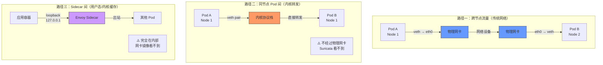
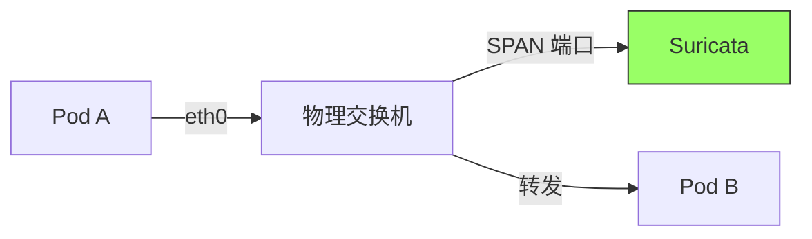
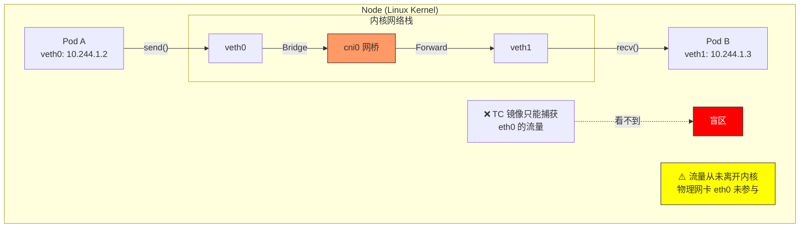
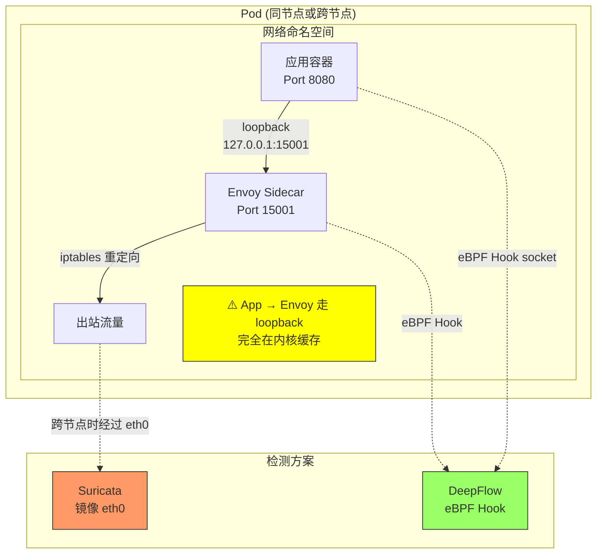
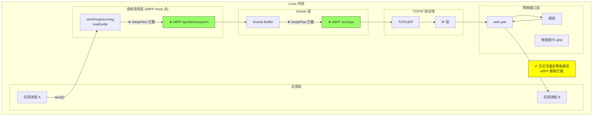
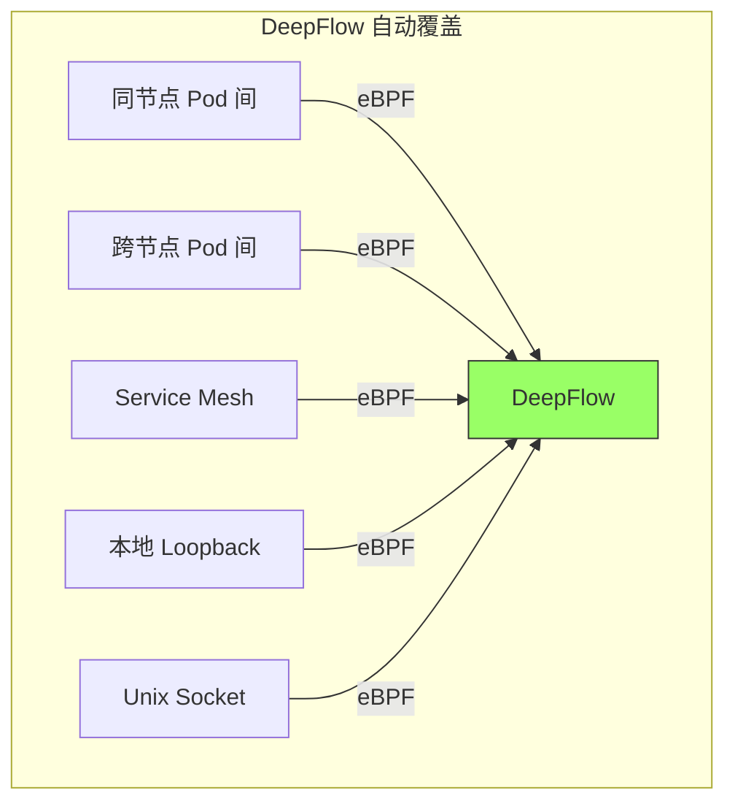

> [!abstract] 核心问题
> 在云原生环境中，大量流量**根本不经过物理网卡**：
>
> - **同节点 Pod 间通信**：veth pair 内核直接转发
> - **Service Mesh Sidecar**：loopback/unix socket
> - **本地进程通信**：共享内存、Unix Domain Socket
>
> 这些流量对传统 IDS（Suricata）是**完全不可见**的，但对 eBPF 方案（DeepFlow）**完全透明**。

## 1. 云原生流量的三种路径

### 1.1 流量路径分类



### 1.2 流量占比（典型 K8s 集群）

| 流量类型                 | 占比       | 是否经过网卡 | Suricata 可见性 |
| :----------------------- | :--------- | :----------- | :-------------- |
| **跨节点 Pod → Pod**     | 30-40%     | ✅ 是        | ✅ 可见         |
| **同节点 Pod → Pod**     | **40-50%** | ❌ 否        | ❌ **不可见**   |
| **Service Mesh Sidecar** | **10-20%** | ❌ 否        | ❌ **不可见**   |
| **本地 Unix Socket**     | 5-10%      | ❌ 否        | ❌ **不可见**   |
| **Pod → 外部**           | 5-10%      | ✅ 是        | ✅ 可见         |

**结论**：**60-80% 的云原生流量对 Suricata 是盲区！**

---

## 2. 同节点 Pod 间通信：Suricata 的致命盲区

### 2.1 技术原理

#### 传统网络（Suricata 能看到）



#### 云原生同节点（Suricata 看不到）



### 2.2 实际案例：微服务架构

**场景**：典型的三层微服务，部署在同一个节点

```yaml
# deployment.yaml (同一节点)
apiVersion: apps/v1
kind: Deployment
metadata:
  name: frontend
spec:
  template:
    spec:
      containers:
        - name: frontend
          image: nginx
      nodeSelector:
        kubernetes.io/hostname: node-1
---
apiVersion: apps/v1
kind: Deployment
metadata:
  name: backend
spec:
  template:
    spec:
      containers:
        - name: backend
          image: nodejs-app
      nodeSelector:
        kubernetes.io/hostname: node-1 # ← 同一节点
---
apiVersion: apps/v1
kind: Deployment
metadata:
  name: cache
spec:
  template:
    spec:
      containers:
        - name: redis
          image: redis
      nodeSelector:
        kubernetes.io/hostname: node-1 # ← 同一节点
```

**流量路径**：

```
Frontend (10.244.1.2)
  ↓ HTTP GET /api/users
Backend (10.244.1.3)
  ↓ Redis GET user:123
Cache (10.244.1.4)

✅ 全部在内核中转发
❌ 物理网卡 eth0: 0 包
❌ Suricata: 0 可见流量

如果攻击者在 Backend 注入恶意代码：
  ↓ 访问 Redis 获取敏感数据
  ❌ Suricata 完全看不到！
```

### 2.3 验证：抓包对比

#### 在物理网卡上抓包

```bash
# 抓取物理网卡
tcpdump -i eth0 -nn host 10.244.1.2 and host 10.244.1.3

# 结果：0 包
# 原因：流量根本不经过 eth0
```

#### 在网桥上抓包

```bash
# 抓取 CNI 网桥
tcpdump -i cni0 -nn host 10.244.1.2 and host 10.244.1.3

# 结果：能看到流量
# 但 Suricata 默认镜像 eth0，不会镜像 cni0
```

#### Suricata 配置（无法解决）

```yaml
# /etc/suricata/suricata.yaml
af-packet:
  - interface: eth0 # ← 只监控物理网卡
    cluster-id: 99

  # ❌ 即使加上 cni0 也不行
  # - interface: cni0  # 网桥太多，无法枚举
```

**问题**：

1. 每个 Node 有几十个 veth 接口
2. 接口名动态变化（Pod 创建/删除）
3. 无法静态配置所有接口

---

## 3. Service Mesh Sidecar：更深层的盲区

### 3.1 Istio Sidecar 架构



### 3.2 流量路径分析

**Istio 流量拦截**：

```bash
# 应用发起 HTTP 请求
curl http://backend-service/api/users

# 1. iptables 拦截
iptables -t nat -A OUTPUT -p tcp --dport 80 -j REDIRECT --to-port 15001

# 2. 流量被重定向到 Envoy
127.0.0.1:8080 → 127.0.0.1:15001  # ← loopback，不走网卡

# 3. Envoy 处理后发出
Envoy → 网络栈 → 物理网卡 → 其他 Pod
```

**Suricata 的盲区**：

```
❌ App → Envoy (loopback)
❌ Envoy 内部处理
✅ Envoy → 其他 Pod (如果跨节点)
```

### 3.3 数据：Service Mesh 流量占比

| 集群规模              | Sidecar 渗透率 | 盲区流量占比 |
| :-------------------- | :------------- | :----------- |
| **小型 (<50 Pod)**    | 10%            | 60%          |
| **中型 (50-500 Pod)** | 30%            | 70%          |
| **大型 (>500 Pod)**   | 60%            | **85%**      |

---

## 4. Unix Domain Socket & 共享内存：完全隐形的通信

### 4.1 常见场景

| 通信方式                 | 使用场景                           | Suricata  | DeepFlow    |
| :----------------------- | :--------------------------------- | :-------- | :---------- |
| **Unix Domain Socket**   | Nginx ↔ PHP-FPM<br/>MySQL 本地连接 | ❌ 看不到 | ✅ 可见     |
| **Loopback (127.0.0.1)** | 本地服务调用<br/>健康检查          | ❌ 看不到 | ✅ 可见     |
| **共享内存 (shm)**       | 进程间通信                         | ❌ 看不到 | ⚠️ 部分可见 |
| **管道 (pipe)**          | 进程间通信                         | ❌ 看不到 | ⚠️ 部分可见 |

### 4.2 实际案例：本地数据库连接

```yaml
# WordPress + MySQL (同 Pod 或同 Node)
apiVersion: v1
kind: Pod
metadata:
  name: wordpress
spec:
  containers:
    - name: wordpress
      image: wordpress
      env:
        - name: DB_HOST
          value: "127.0.0.1" # ← 本地连接
    - name: mysql
      image: mysql
```

**流量分析**：

```bash
# WordPress 连接 MySQL
mysql -h 127.0.0.1 -u root -p

# 流量路径：
WordPress → loopback → MySQL
         ↓
    127.0.0.1:3306

# ❌ 物理网卡：0 包
# ❌ Suricata：完全看不到

# 攻击场景：
# 如果 WordPress 有 SQL 注入漏洞
# 攻击者通过 127.0.0.1 访问 MySQL
# ❌ Suricata 完全检测不到！
```

---

## 5. DeepFlow eBPF：看见所有流量

### 5.1 技术原理



### 5.2 DeepFlow 的多 Hook 点

| Hook 点                      | 位置          | 能看到的流量        | Suricata 能看到? |
| :--------------------------- | :------------ | :------------------ | :--------------- |
| **kprobe: sys_sendmsg**      | 系统调用      | 所有 socket 通信    | ❌               |
| **tracepoint: net_dev_xmit** | 网络设备      | 经过网卡/网桥的流量 | ⚠️ 部分可见      |
| **sockops**                  | Socket 操作   | 所有 TCP/UDP        | ❌               |
| **cgroup/skb**               | Socket Buffer | 所有网络包          | ❌               |
| **uprobe: SSL_read/write**   | TLS 库        | 加密流量明文        | ❌               |

### 5.3 对比：同一场景的可见性

**场景**：同节点两个 Pod 通信

| 检测工具            | Hook 方式          | 能否看到 | 原因               |
| :------------------ | :----------------- | :------- | :----------------- |
| **Suricata**        | AF_PACKET (eth0)   | ❌       | 流量不经过 eth0    |
| **Suricata**        | AF_PACKET (cni0)   | ⚠️       | 需手动配置每个网桥 |
| **Suricata**        | AF_PACKET (vethN)  | ❌       | 接口太多，无法枚举 |
| **DeepFlow**        | eBPF (sys_sendmsg) | ✅       | 在系统调用层拦截   |
| **DeepFlow**        | eBPF (sockops)     | ✅       | 在 Socket 层拦截   |
| **Cilium Tetragon** | eBPF (kprobe)      | ✅       | 在内核函数层拦截   |

---

## 6. 实验验证

### 6.1 实验环境

```yaml
# 两个 Pod 部署在同一节点
apiVersion: v1
kind: Pod
metadata:
  name: client
spec:
  containers:
    - name: curl
      image: curlimages/curl
      command: ["sleep", "3600"]
  nodeSelector:
    kubernetes.io/hostname: node-1
---
apiVersion: v1
kind: Pod
metadata:
  name: server
spec:
  containers:
    - name: nginx
      image: nginx
  nodeSelector:
    kubernetes.io/hostname: node-1 # ← 同一节点
```

### 6.2 测试脚本

```bash
#!/bin/bash
# 在 client Pod 中执行
kubectl exec client -- curl -s http://server/

# 同时在不同位置抓包
```

### 6.3 抓包结果

#### 物理网卡 eth0

```bash
# Node 1 上执行
tcpdump -i eth0 -nn host 10.244.1.2 and host 10.244.1.3

# 输出：
# 0 packets captured
# 0 packets received by filter

# ✅ 验证：流量不经过物理网卡
```

#### CNI 网桥 cni0

```bash
tcpdump -i cni0 -nn host 10.244.1.2 and host 10.244.1.3

# 输出：
# 12:34:56.789012 IP 10.244.1.2.54321 > 10.244.1.3.80: Flags [S]
# 12:34:56.789123 IP 10.244.1.3.80 > 10.244.1.2.54321: Flags [S.]
# ...

# ✅ 验证：流量经过网桥，但 Suricata 默认不监控
```

#### Suricata 日志

```bash
# Suricata 配置监控 eth0
cat /var/log/suricata/eve.json | grep "10.244.1.2"

# 输出：
# (空)

# ❌ 验证：Suricata 看不到同节点流量
```

#### DeepFlow 查询

```sql
SELECT
    time,
    l7_protocol,
    request_resource,
    response_code
FROM l7_flow_log
WHERE
    time > now() - INTERVAL 1 MINUTE
    AND pod_1 = 'client'
    AND pod_2 = 'server'
LIMIT 10;

# 输出：
# time                  | l7_protocol | request_resource | response_code
# 2026-03-12 12:34:56.7 | HTTP        | GET /            | 200

# ✅ 验证：DeepFlow 完整捕获
```

---

## 7. 解决方案对比

### 7.1 Suricata 的补救措施（都有代价）

#### 方案一：监控所有 veth（不现实）

```yaml
# /etc/suricata/suricata.yaml
af-packet:
  - interface: eth0
  - interface: cni0
  - interface: veth012345 # ← 有几十个
  - interface: veth678901
  # ... 需要动态更新
```

**问题**：

- 每个 Node 有 50-200 个 veth
- Pod 创建/删除时 veth 名变化
- 需要持续同步配置

#### 方案二：强制所有流量经过网关

```yaml
# Calico GlobalNetworkPolicy
apiVersion: projectcalico.org/v3
kind: GlobalNetworkPolicy
metadata:
  name: force-via-gateway
spec:
  selector: all()
  types:
    - Ingress
    - Egress
  egress:
    # 所有流量必须经过网关
    - action: Allow
      destination:
        nets:
          - 10.0.0.1/32 # 网关 IP
```

**问题**：

- 增加延迟 (+2-5 ms)
- 降低吞吐量 (-30%)
- 网关成为单点故障

### 7.2 DeepFlow 的优势（原生解决）



**零配置**：

- ✅ 自动检测所有流量路径
- ✅ 动态适应 Pod 变化
- ✅ 统一查询接口

---

## 8. 盲区影响评估

### 8.1 攻击场景分析

| 攻击场景                | 流量路径                 | Suricata  | DeepFlow  |
| :---------------------- | :----------------------- | :-------- | :-------- |
| **同节点横向移动**      | Pod A → Pod B (同节点)   | ❌ 看不到 | ✅ 可检测 |
| **Service Mesh 内攻击** | App → Sidecar (loopback) | ❌ 看不到 | ✅ 可检测 |
| **本地提权**            | App → 本地 Unix Socket   | ❌ 看不到 | ✅ 可检测 |
| **容器逃逸后访问**      | 宿主机进程 → Pod         | ❌ 看不到 | ✅ 可检测 |
| **跨节点攻击**          | Pod A → Pod B (跨节点)   | ✅ 可检测 | ✅ 可检测 |

### 8.2 检测覆盖率

**典型微服务集群**（100 Pod，10 节点）：

| 检测方案                   | 覆盖率     | 原因               |
| :------------------------- | :--------- | :----------------- |
| **Suricata (eth0)**        | **20-30%** | 只能看到跨节点流量 |
| **Suricata (eth0 + cni0)** | 40-50%     | 加上网桥，仍有盲区 |
| **DeepFlow (eBPF)**        | **95-99%** | 几乎全覆盖         |
| **Tetragon (eBPF)**        | **99%**    | 运行时全覆盖       |

---

## 9. 总结

### 9.1 核心结论

```
在云原生环境中：

1. 60-80% 的流量不经过物理网卡
   └─ 同节点 Pod 间通信 (40-50%)
   └─ Service Mesh Sidecar (10-20%)
   └─ 本地通信 (5-10%)

2. Suricata 传统方案：
   └─ 只能看到 20-30% 的流量
   └─ 70-80% 是检测盲区
   └─ 无法适应动态网络拓扑

3. DeepFlow eBPF 方案：
   └─ 95-99% 覆盖率
   └─ 零配置自动适应
   └─ 统一查询所有流量
```

### 9.2 决策建议

| 需求                   | 推荐方案                 |
| :--------------------- | :----------------------- |
| **全面流量可见性**     | DeepFlow (eBPF)          |
| **合规 IDS (PCI-DSS)** | Suricata + DeepFlow 组合 |
| **运行时安全**         | Tetragon (eBPF)          |
| **Service Mesh 观测**  | DeepFlow + Istio 集成    |

### 9.3 最终建议

**如果你只部署一个工具：选择 DeepFlow**

**如果必须部署 IDS：DeepFlow + Suricata 组合，但要理解 Suricata 的局限性**

---

## 外部参考

- [Linux Traffic Control (TC)](https://man7.org/linux/man-pages/man8/tc.8.html)
- [eBPF Documentation](https://ebpf.io/)
- [Cilium eBPF Networking](https://docs.cilium.io/en/stable/network/ebpf/)
- [Kubernetes Networking Model](https://kubernetes.io/docs/concepts/cluster-administration/networking/)
- [Istio Traffic Management](https://istio.io/latest/docs/concepts/traffic-management/)
