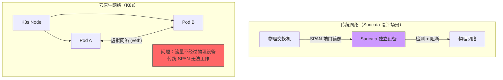
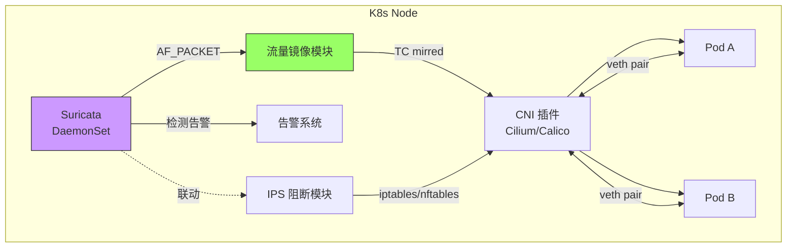
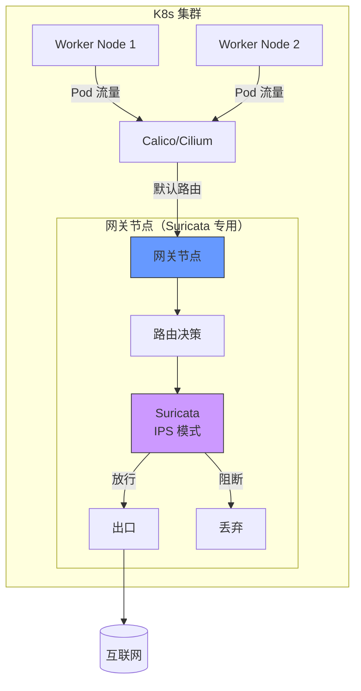
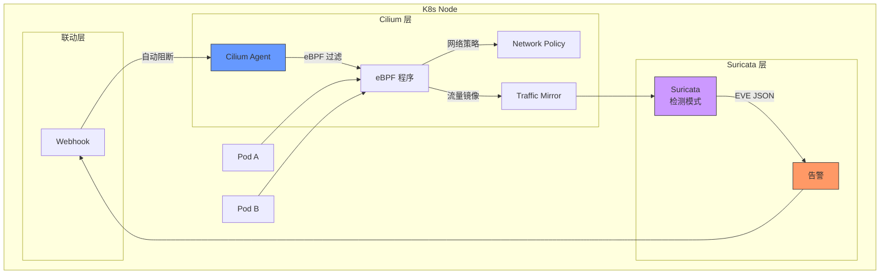
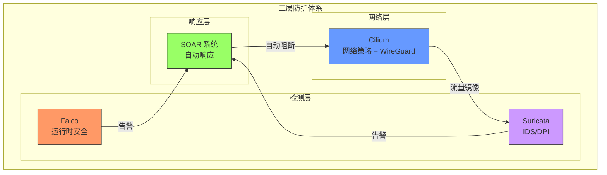
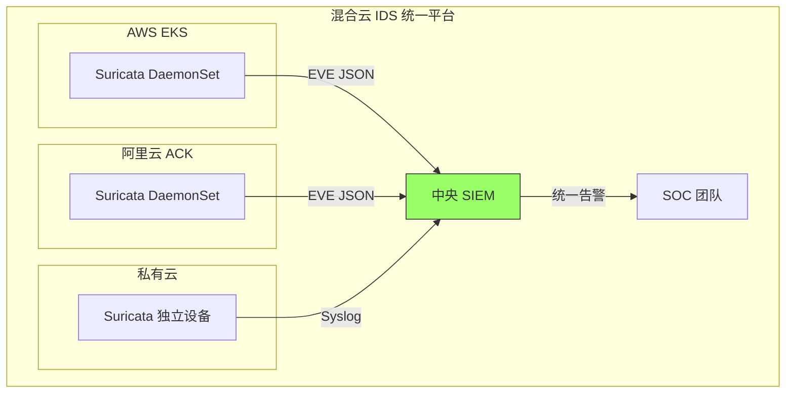
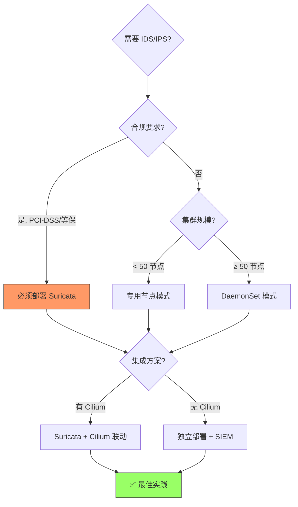

> [!abstract] 核心问题
> Suricata 是成熟的 IDS/IPS 系统，但云原生场景对其提出了新挑战：
>
> - **流量获取**：容器网络是虚拟的，如何让 Suricata 看到流量？
> - **部署模式**：DaemonSet 还是专用节点？
> - **性能开销**：DPI 密集计算，能否承受？
> - **规则管理**：动态环境如何快速更新规则？

## 1. Suricata 与云原生的"理念冲突"

### 1.1 架构对比



### 1.2 核心挑战

| 挑战           | 传统场景             | 云原生场景         | 解决难度 |
| :------------- | :------------------- | :----------------- | :------- |
| **流量可见性** | 物理交换机 SPAN 端口 | 容器网络是虚拟的   | ★★★★★    |
| **部署位置**   | 独立硬件设备         | DaemonSet/专用节点 | ★★★☆☆    |
| **动态性**     | 静态 IP              | Pod IP 随时变化    | ★★★★☆    |
| **性能开销**   | 专用设备             | 共享节点资源       | ★★★★☆    |
| **规则更新**   | 手动配置             | 需要动态更新       | ★★☆☆☆    |

---

## 2. 云原生部署模式

### 2.1 模式对比总览

| 部署模式                  | 流量获取方式   | 资源开销     | 检测覆盖   | 适用场景   |
| :------------------------ | :------------- | :----------- | :--------- | :--------- |
| **DaemonSet（镜像模式）** | 节点级流量镜像 | 高（每节点） | 全覆盖     | 高安全要求 |
| **专用节点（网关模式）**  | 所有流量经过   | 中（集中）   | 南北向     | 中小规模   |
| **Sidecar（不推荐）**     | Pod 内部镜像   | 极高         | 选择性     | 不推荐     |
| **主机网络（混合模式）**  | 主机网络镜像   | 低           | 仅主机流量 | 补充方案   |

### 2.2 模式一：DaemonSet + 流量镜像（推荐）

#### 架构图



#### 部署配置

```yaml
# suricata-daemonset.yaml
apiVersion: apps/v1
kind: DaemonSet
metadata:
  name: suricata
  namespace: security
  labels:
    app: suricata
spec:
  selector:
    matchLabels:
      app: suricata
  template:
    metadata:
      labels:
        app: suricata
    spec:
      # 关键：使用主机网络
      hostNetwork: true
      # 关键：特权容器
      securityContext:
        privileged: true
      containers:
        - name: suricata
          image: jasonish/suricata:7.0.0
          resources:
            limits:
              cpu: "2"
              memory: "4Gi"
            requests:
              cpu: "500m"
              memory: "1Gi"
          volumeMounts:
            # 配置文件
            - name: suricata-config
              mountPath: /etc/suricata
            # 规则文件
            - name: suricata-rules
              mountPath: /var/lib/suricata/rules
            # 日志输出
            - name: suricata-logs
              mountPath: /var/log/suricata
            # 关键：BPF 文件系统（用于流量镜像）
            - name: bpf-fs
              mountPath: /sys/fs/bpf
            # 关键：访问主机网络接口
            - name: run
              mountPath: /var/run
          env:
            # 启用 IPS 模式（可选）
            - name: SURICATA_RUNMODE
              value: "ips"
            # 使用 AF_PACKET 捕获
            - name: SURICATA_CAPTURE
              value: "af-packet"
      volumes:
        - name: suricata-config
          configMap:
            name: suricata-config
        - name: suricata-rules
          configMap:
            name: suricata-rules
            # 或使用 PVC 持久化
        - name: suricata-logs
          hostPath:
            path: /var/log/suricata
            type: DirectoryOrCreate
        - name: bpf-fs
          hostPath:
            path: /sys/fs/bpf
        - name: run
          hostPath:
            path: /var/run
      # 节点选择（可选：只在特定节点部署）
      nodeSelector:
        suricata: "enabled"
```

#### Suricata 配置

```yaml
# suricata-config.yaml (ConfigMap)
apiVersion: v1
kind: ConfigMap
metadata:
  name: suricata-config
  namespace: security
data:
  suricata.yaml: |
    # Suricata 配置
    vars:
      address-groups:
        HOME_NET: "any"  # K8s 环境，Pod IP 动态，设为 any
        EXTERNAL_NET: "any"
      port-groups:
        HTTP_PORTS: "80,8080,8000"
        HTTPS_PORTS: "443,8443"

    # AF_PACKET 捕获配置（高性能）
    af-packet:
      - interface: eth0  # 主机网络接口
        cluster-id: 99
        cluster-type: cluster_flow
        defrag: yes
        use-mmap: yes
        # 镜像模式（不影响原流量）
        copy-mode: ips
        copy-iface: none
        threads: auto
        ring-size: 65535

    # IPS 模式（需要 NFQ）
    # nfq:
    #   - mode: accept  # 或 reject

    # 日志配置
    outputs:
      - eve-log:
          enabled: yes
          filetype: regular
          filename: eve.json
          types:
            - alert:
                payload: yes
                payload-buffer-size: 4kb
                payload-printable: yes
            - http:
                extended: yes
            - dns:
                version: 2
            - tls:
                extended: yes
            - files:
                force-magic: no

    # 性能优化
    default-packet-size: 1500
    max-pending-packets: 1024
    runmode: workers
    autofp-scheduler: hash

    # 规则配置
    rule-files:
      - suricata.rules
      - custom.rules

    # 阈值配置（减少误报）
    threshold-file: /etc/suricata/threshold.config
```

#### 流量镜像配置（Cilium 方式）

```yaml
# 如果使用 Cilium，可以通过 TrafficMirror 镜像流量
apiVersion: cilium.io/v2
kind: CiliumNetworkPolicy
metadata:
  name: traffic-mirror-to-suricata
  namespace: default
spec:
  endpointSelector:
    matchLabels: {} # 所有 Pod
  ingress:
    - toPorts:
        - ports:
            - port: "0-65535" # 所有端口
          rules:
            # 镜像流量到 Suricata
            l7proto: traffic-mirror
            l7:
              - mirror_to: "suricata-endpoint"
---
apiVersion: cilium.io/v2
kind: CiliumLocalRedirectPolicy
metadata:
  name: suricata-mirror-target
  namespace: security
spec:
  redirectFrontend:
    addressMatcher:
      ip: "0.0.0.0"
      toPorts:
        - port: "514" # Suricata 监听端口
  redirectBackend:
    localEndpointSelector:
      matchLabels:
        app: suricata
    toPorts:
      - port: "514"
```

#### 流量镜像配置（手动 TC 方式）

```bash
#!/bin/bash
# 在每台 Node 上执行（或通过 DaemonSet 初始化容器）

# 获取主网络接口
IFACE="eth0"

# 启用流量镜像到 Suricata
tc qdisc add dev $IFACE ingress
tc filter add dev $IFACE ingress protocol ip \
  u32 match u32 0 0 action mirred egress mirror dev suricata0

# 如果没有 suricata0 接口，需要创建
ip link add name suricata0 type dummy
ip link set dev suricata0 up
```

---

### 2.3 模式二：专用节点 + 网关模式（中小规模推荐）

#### 架构图



#### 部署配置

```yaml
# 网关节点部署（单副本）
apiVersion: apps/v1
kind: Deployment
metadata:
  name: suricata-gateway
  namespace: security
spec:
  replicas: 1
  template:
    spec:
      # 节点选择：只在标记为网关的节点上部署
      nodeSelector:
        node-role.kubernetes.io/gateway: "true"
      hostNetwork: true
      securityContext:
        privileged: true
      containers:
        - name: suricata
          image: jasonish/suricata:7.0.0
          args:
            - "-c"
            - "/etc/suricata/suricata.yaml"
            - "-i"
            - "eth0"
            - "-q"
            - "0" # NFQ 模式（IPS）
          volumeMounts:
            - name: suricata-config
              mountPath: /etc/suricata
            - name: suricata-rules
              mountPath: /var/lib/suricata/rules
            - name: suricata-logs
              mountPath: /var/log/suricata
      volumes:
        - name: suricata-config
          configMap:
            name: suricata-config
        - name: suricata-rules
          persistentVolumeClaim:
            claimName: suricata-rules-pvc
        - name: suricata-logs
          hostPath:
            path: /var/log/suricata
```

#### 路由配置（将流量引导到网关）

```yaml
# Calico 配置：将所有出口流量路由到网关
apiVersion: projectcalico.org/v3
kind: GlobalNetworkPolicy
metadata:
  name: route-to-suricata
spec:
  order: 0
  selector: all()
  types:
    - Egress
  egress:
    # 所有出口流量先经过 Suricata 节点
    - action: Pass
      destination:
        nets:
          - 10.0.0.0/8 # 内网流量直通
    - action: Pass
      destination:
        notNets:
          - 10.0.0.0/8
        # 其他流量会被路由到网关节点
```

---

### 2.4 模式三：与 Cilium 集成（最佳实践）

#### 架构图



#### 集成配置

```yaml
# Suricata 配置：输出到 Webhook
apiVersion: v1
kind: ConfigMap
metadata:
  name: suricata-config
  namespace: security
data:
  suricata.yaml: |
    outputs:
      - eve-log:
          enabled: yes
          filetype: regular
          filename: eve.json
      # 添加自定义输出：Webhook
      - custom:
          enabled: yes
          command: /usr/local/bin/webhook-alert.sh
          # 脚本内容见下方
```

```bash
#!/bin/bash
# /usr/local/bin/webhook-alert.sh
# Suricata 告警 Webhook 脚本

while read line; do
    # 解析 EVE JSON
    ALERT=$(echo "$line" | jq -c 'select(.event_type == "alert")')

    if [ -n "$ALERT" ]; then
        # 提取源 IP
        SRC_IP=$(echo "$ALERT" | jq -r '.src_ip')
        DST_IP=$(echo "$ALERT" | jq -r '.dest_ip')
        ALERT_SIG=$(echo "$ALERT" | jq -r '.alert.signature')

        # 发送到 Cilium 策略 API
        curl -X POST http://localhost:8001/api/v2/policy \
            -H "Content-Type: application/json" \
            -d "{
                \"labelSelector\": \"any\",
                \"ingress\": [{
                    \"fromEndpoints\": [{
                        \"matchLabels\": {
                            \"ip\": \"$SRC_IP\"
                        }
                    }],
                    \"action\": \"DENY\"
                }]
            }"

        # 发送告警到 Slack/PagerDuty
        curl -X POST "$WEBHOOK_URL" \
            -H "Content-Type: application/json" \
            -d "{
                \"text\": \"Suricata Alert: $ALERT_SIG\",
                \"source_ip\": \"$SRC_IP\",
                \"dest_ip\": \"$DST_IP\"
            }"
    fi
done
```

---

## 3. 性能开销分析

### 3.1 资源消耗测试

| 指标                 | 无 Suricata | DaemonSet 模式 | 专用节点模式   |
| :------------------- | :---------- | :------------- | :------------- |
| **CPU (每节点)**     | 基线        | +20-30%        | 100% (专用)    |
| **内存 (每节点)**    | 基线        | +1-2 GB        | 4 GB           |
| **网络延迟**         | 0.5 ms      | +0.1 ms (镜像) | +2-5 ms (网关) |
| **吞吐量 (10 Gbps)** | 10 Gbps     | 9.5 Gbps       | 8 Gbps         |
| **规则数量**         | -           | 30,000+        | 30,000+        |

### 3.2 优化建议

```yaml
# Suricata 性能优化配置
suricata.yaml: |
  # 1. 使用多线程
  threading:
    set-cpu-affinity: yes
    cpu-affinity:
      - management-cpu-set:
          cpu: [0]
      - receive-cpu-set:
          cpu: [1]
      - worker-cpu-set:
          cpu: [2,3]
          mode: balanced

  # 2. 增加缓冲区
  af-packet:
    - interface: eth0
      ring-size: 65535
      use-mmap: yes
      tpacket-v3: yes

  # 3. 规则优化
  rule-reload: automatic
  rule-reload-delay: 10s

  # 4. 采样（可选，降低开销）
  packet-filter:
    bpf-filter: "tcp or udp"  # 只检测 TCP/UDP

  # 5. 限制载荷大小
  stream:
    reassembly:
      depth: 1mb  # 限制重组深度

  # 6. 禁用不需要的检测
  app-layer:
    protocols:
      http:
        enabled: yes
      dns:
        enabled: yes
      smb:
        enabled: no  # 禁用 SMB（K8s 通常不需要）
```

---

## 4. 规则管理

### 4.1 自动更新规则

```yaml
# CronJob 定期更新规则
apiVersion: batch/v1
kind: CronJob
metadata:
  name: suricata-rules-update
  namespace: security
spec:
  schedule: "0 */6 * * *" # 每 6 小时更新一次
  jobTemplate:
    spec:
      template:
        spec:
          containers:
            - name: rule-update
              image: jasonish/suricata:7.0.0
              command:
                - /bin/sh
                - -c
                - |
                  # 下载最新规则
                  suricata-update update-sources
                  suricata-update enable-source et/open
                  suricata-update enable-source oisf/trafficid
                  suricata-update

                  # 重启 Suricata（优雅）
                  kill -HUP $(pidof suricata)
              volumeMounts:
                - name: suricata-rules
                  mountPath: /var/lib/suricata/rules
          volumes:
            - name: suricata-rules
              persistentVolumeClaim:
                claimName: suricata-rules-pvc
```

### 4.2 自定义规则示例

```yaml
# 自定义 K8s 安全规则
apiVersion: v1
kind: ConfigMap
metadata:
  name: suricata-custom-rules
  namespace: security
data:
  custom.rules: |
    # 1. 检测未授权的 kubectl 访问
    alert http any any -> any 6443 (
      msg:"Unauthorized Kubernetes API Access";
      flow:established,to_server;
      content:"GET"; http_method;
      content:"/api/v1/"; http_uri;
      content:"Bearer"; http_header; nocase;
      classtype:attempted-admin;
      sid:2026001;
    )

    # 2. 检测容器逃逸尝试
    alert tcp any any -> any any (
      msg:"Possible Container Escape - Mount Host FS";
      flow:established;
      content:"mount";
      content:"/host";
      pcre:"/mount\s+.*\/host/i";
      classtype:attempted-admin;
      sid:2026002;
    )

    # 3. 检测敏感文件访问
    alert tcp any any -> any any (
      msg:"Sensitive File Access - /etc/shadow";
      flow:established;
      content:"/etc/shadow";
      classtype:attempted-user;
      sid:2026003;
    )

    # 4. 检测 DNS 隧道（常见数据泄露手段）
    alert dns any any -> any any (
      msg:"Possible DNS Tunneling - Large Query";
      dns.query; content:"|00|"; distance:30;
      classtype:trojan-activity;
      sid:2026004;
    )

    # 5. 检测 SQL 注入
    alert http any any -> any any (
      msg:"SQL Injection Attempt";
      flow:established,to_server;
      content:"POST"; http_method;
      http.uri; content:"' OR '1'='1";
      classtype:web-application-attack;
      sid:2026005;
    )
```

---

## 5. 与其他安全工具集成

### 5.1 Suricata + Falco + Cilium 组合



### 5.2 SIEM 集成（Elasticsearch）

```yaml
# Filebeat 采集 Suricata 日志
apiVersion: v1
kind: ConfigMap
metadata:
  name: filebeat-config
  namespace: security
data:
  filebeat.yml: |
    filebeat.inputs:
      - type: log
        enabled: true
        paths:
          - /var/log/suricata/eve.json
        json.keys_under_root: true
        json.add_error_key: true

    output.elasticsearch:
      hosts: ["http://elasticsearch:9200"]
      index: "suricata-%{+yyyy.MM.dd}"

    setup.template.name: "suricata"
    setup.template.pattern: "suricata-*"
```

---

## 6. 实际案例

### 案例 1：金融合规场景

**需求**：满足 PCI-DSS 合规，必须部署 IDS

**方案**：DaemonSet 模式 + 专用规则集

```yaml
# PCI-DSS 专用规则
custom.rules: |
  # 1. 检测信用卡号泄露
  alert tcp any any -> any any (
    msg:"PCI-DSS: Possible Credit Card Number Leak";
    pcre:"/\b(?:\d[ -]*?){13,16}\b/";
    classtype:sensitive-data;
    sid:3000001;
  )

  # 2. 检测未加密的支付数据
  alert http any any -> any any (
    msg:"PCI-DSS: Unencrypted Payment Data";
    flow:established;
    content:"card_number=";
    nocase;
    classtype:sensitive-data;
    sid:3000002;
  )
```

### 案例 2：混合云统一 IDS

**场景**：AWS EKS + 阿里云 ACK + 私有云



---

## 7. 是否适合云原生？结论

### 7.1 优势

| 优势             | 说明                                  |
| :--------------- | :------------------------------------ |
| **规则库最丰富** | Emerging Threats、VRT，覆盖 300+ 协议 |
| **检测能力强**   | CVE、恶意软件、APT、零日攻击特征      |
| **成熟稳定**     | 10+ 年发展，行业标准                  |
| **社区活跃**     | OISF 支持，规则持续更新               |
| **合规必需**     | PCI-DSS、等保等强制要求               |

### 7.2 劣势

| 劣势             | 说明               | 缓解方案               |
| :--------------- | :----------------- | :--------------------- |
| **性能开销大**   | DPI 密集计算       | 专用节点、规则优化     |
| **流量获取困难** | 容器网络虚拟化     | Cilium Traffic Mirror  |
| **动态性差**     | 规则基于静态 IP    | AutoTagging、标签匹配  |
| **部署复杂**     | 需要特权、镜像配置 | Helm Chart、Operator   |
| **无法加密检测** | TLS 流量黑盒       | MITM 代理、Session Key |

### 7.3 适用场景判断



### 7.4 替代方案对比

| 方案                | 检测能力 | 性能  | 云原生适配 | 推荐场景         |
| :------------------ | :------- | :---- | :--------- | :--------------- |
| **Suricata**        | ★★★★★    | ★★☆☆☆ | ★★★☆☆      | 合规、高安全要求 |
| **Cilium Tetragon** | ★★★★☆    | ★★★★★ | ★★★★★      | 云原生运行时     |
| **Falco**           | ★★★☆☆    | ★★★★☆ | ★★★★★      | 运行时行为       |
| **Cilium Hubble**   | ★★☆☆☆    | ★★★★★ | ★★★★★      | 可观测性         |
| **组合方案**        | ★★★★★    | ★★★☆☆ | ★★★★☆      | **最佳实践**     |

---

## 8. 最佳实践总结

### 8.1 推荐架构：Suricata + Cilium + Falco

```yaml
# 三位一体安全架构
security-stack:
  layer-1-network:
    tool: Cilium
    responsibility: "网络策略、WireGuard 加密、流量镜像"
    deployment: "DaemonSet"

  layer-2-detection:
    tool: Suricata
    responsibility: "IDS/DPI、CVE 检测、合规审计"
    deployment: "DaemonSet (镜像模式)"

  layer-3-runtime:
    tool: Falco (或 Tetragon)
    responsibility: "容器逃逸、异常进程、权限提升"
    deployment: "DaemonSet"

  integration:
    - "Cilium 镜像流量 → Suricata"
    - "Suricata 告警 → SOAR"
    - "Falco 告警 → SOAR"
    - "SOAR → Cilium 自动阻断"
```

### 8.2 实施路线图

1. **阶段一**：部署 Cilium（网络 + 加密）
2. **阶段二**：部署 Suricata（IDS 检测）
3. **阶段三**：部署 Falco（运行时）
4. **阶段四**：集成 SIEM/SOAR（统一响应）

---

## 外部参考

- [Suricata 官方文档](https://suricata.readthedocs.io/)
- [Suricata Kubernetes 部署指南](https://suricata.io/documentation/)
- [Cilium Traffic Mirroring](https://docs.cilium.io/en/stable/network/traffic-mirroring/)
- [Emerging Threats 规则集](https://rules.emergingthreats.net/)
- [PCI-DSS 合规要求](https://www.pcisecuritystandards.org/)
