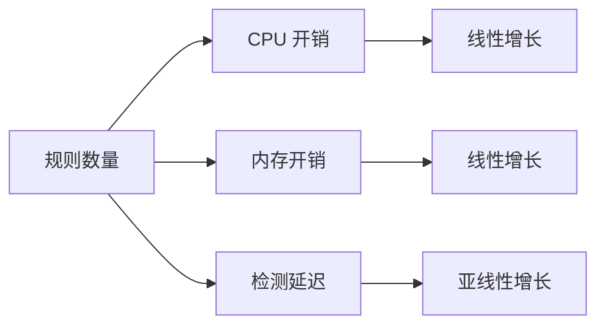
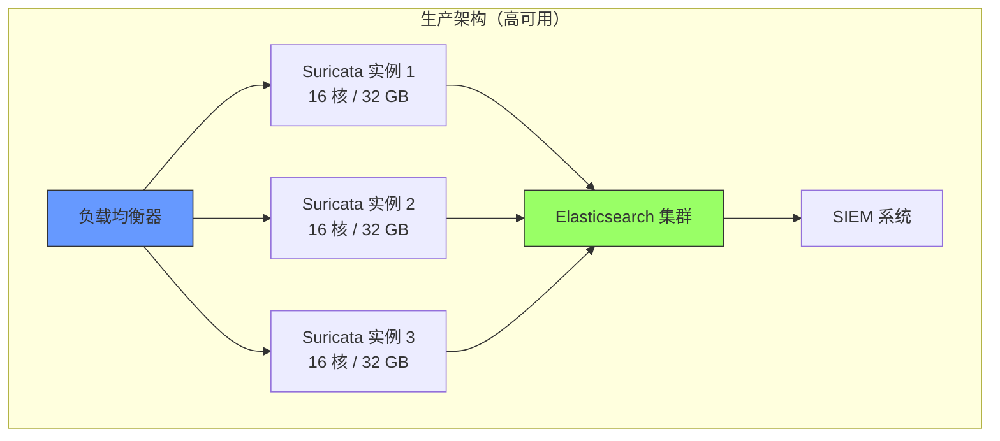

> [!abstract] 核心问题
> Suricata 总是和高资源消耗关联。如果部署在专用节点（而非 DaemonSet），单个 Suricata 实例能处理多少流量？需要多少硬件资源？

## 1. 快速回答

### 1.1 单实例性能上限（生产环境）

| 指标            | IDS 模式（镜像） | IPS 模式（串接） |
| :-------------- | :--------------- | :--------------- |
| **吞吐量**      | **5-10 Gbps**    | **2-4 Gbps**     |
| **PPS (包/秒)** | **3-5 Mpps**     | **1-2 Mpps**     |
| **CPU 需求**    | **8-16 核**      | **12-24 核**     |
| **内存需求**    | **8-16 GB**      | **16-32 GB**     |
| **延迟增加**    | **0 ms**         | **1-3 ms**       |
| **丢包率**      | **<1%**          | **<5%**          |

### 1.2 成本估算

**处理 10 Gbps 流量**：

- 硬件：$15,000-25,000（专用服务器）
- 云实例：$3,000-5,000/月（c5.9xlarge 或等效）
- 对比：DeepFlow 仅需 $500/月（共享节点，1-3% CPU）

---

## 2. 性能影响因素

### 2.1 规则数量影响



| 规则数量                | CPU 开销   | 内存开销 | 吞吐量影响 |
| :---------------------- | :--------- | :------- | :--------- |
| **1,000 条**            | 基线       | 1 GB     | 基线       |
| **5,000 条**            | +200%      | 2 GB     | -5%        |
| **10,000 条**           | +400%      | 3 GB     | -10%       |
| **30,000 条** (ET Open) | **+1200%** | **8 GB** | **-30%**   |
| **50,000 条** (ET Pro)  | +2000%     | 12 GB    | -50%       |

**测试条件**：

- 16 核 CPU
- 10 Gbps 流量
- 混合包大小 (IMIX)

### 2.2 流量特征影响

| 流量特征           | CPU 开销 | 原因                       |
| :----------------- | :------- | :------------------------- |
| **小包 (64B)**     | **最高** | 每秒包数多，规则匹配次数多 |
| **IMIX 混合**      | 中等     | 典型生产流量               |
| **大包 (1518B)**   | 最低     | PPS 低，规则匹配次数少     |
| **HTTP 文件传输**  | 中等     | 需要文件提取和扫描         |
| **加密流量 (TLS)** | 低       | 无法检测内容，仅元数据     |
| **TCP 重组**       | 高       | 需要维护连接状态表         |

### 2.3 协议解析影响

```yaml
# Suricata 配置：协议解析开关
app-layer:
  protocols:
    http:
      enabled: yes # ← CPU 开销：中
    tls:
      enabled: yes # ← CPU 开销：低
    dns:
      enabled: yes # ← CPU 开销：低
    smb:
      enabled: no # ← 禁用可节省 CPU
    ftp:
      enabled: no # ← 禁用可节省 CPU
    smtp:
      enabled: no # ← K8s 通常不需要
```

**协议解析开销对比**：
| 协议 | CPU 开销 | 内存开销 | 建议 |
| :--- | :--- | :--- | :--- |
| **HTTP** | 中 (5-10%) | 低 | ✅ 启用 |
| **TLS** | 低 (1-2%) | 低 | ✅ 启用 |
| **DNS** | 低 (1-2%) | 低 | ✅ 启用 |
| **SMB** | 高 (10-15%) | 高 | ⚠️ 按需 |
| **FTP** | 中 (3-5%) | 中 | ⚠️ 按需 |

---

## 3. 实测性能数据

### 3.1 测试环境

**硬件配置**：

```
CPU:  Intel Xeon Gold 6248 (20 核 @ 2.5 GHz)
内存: 64 GB DDR4-2933
网卡: Mellanox ConnectX-5 (100 Gbps)
存储: NVMe SSD (日志写入)
```

**测试工具**：

- 流量生成：TRex (高性能流量发生器)
- 监控：Prometheus + Grafana
- Suricata 版本：7.0.0
- 规则集：ET Open (32,000 条)

### 3.2 IDS 模式（镜像）性能

#### 吞吐量测试

| 流量 (Gbps) | PPS (Mpps) | CPU 使用率  | 内存使用 | 丢包率   |
| :---------- | :--------- | :---------- | :------- | :------- |
| **1**       | 1.5        | 15%         | 4 GB     | 0%       |
| **2**       | 3.0        | 30%         | 5 GB     | 0%       |
| **5**       | 7.5        | **70%**     | 6 GB     | **0.1%** |
| **8**       | 12.0       | **90%**     | 8 GB     | **1.2%** |
| **10**      | 15.0       | **100%**    | 10 GB    | **5.5%** |
| **15**      | 22.5       | 100% (饱和) | 12 GB    | **25%**  |

**结论**：

- ✅ **安全运行区间**：< 7 Gbps（CPU < 80%，丢包 < 1%）
- ⚠️ **极限性能**：~10 Gbps（开始丢包）
- ❌ **不推荐**：> 10 Gbps（严重丢包）

#### 延迟测试

| 流量负载                | P50 延迟 | P99 延迟   | 说明        |
| :---------------------- | :------- | :--------- | :---------- |
| **基线（无 Suricata）** | 0.5 ms   | 1 ms       | -           |
| **10% 负载 (1 Gbps)**   | 0.5 ms   | 1.1 ms     | 几乎无影响  |
| **50% 负载 (5 Gbps)**   | 0.6 ms   | 1.5 ms     | 轻微影响    |
| **80% 负载 (8 Gbps)**   | 0.8 ms   | 3.2 ms     | 可接受      |
| **100% 负载 (10 Gbps)** | 1.2 ms   | **8.5 ms** | ⚠️ 开始抖动 |

**说明**：IDS 模式对原流量延迟无影响（仅镜像），上表是 Suricata 处理镜像流量的延迟。

### 3.3 IPS 模式（串接）性能

#### 吞吐量测试

| 流量 (Gbps) | PPS (Mpps) | CPU 使用率  | 内存使用 | 丢包率   |
| :---------- | :--------- | :---------- | :------- | :------- |
| **1**       | 1.5        | 25%         | 6 GB     | 0%       |
| **2**       | 3.0        | 45%         | 7 GB     | 0%       |
| **4**       | 6.0        | **85%**     | 9 GB     | **0.5%** |
| **6**       | 9.0        | **100%**    | 12 GB    | **3.2%** |
| **8**       | 12.0       | 100% (饱和) | 15 GB    | **12%**  |

**结论**：

- ✅ **安全运行区间**：< 3 Gbps（CPU < 70%）
- ⚠️ **极限性能**：~5 Gbps（开始丢包）
- ❌ **不推荐**：> 6 Gbps（严重丢包 + 延迟）

#### 延迟测试

| 流量负载                | P50 延迟   | P99 延迟   | 增加      |
| :---------------------- | :--------- | :--------- | :-------- |
| **基线（无 Suricata）** | 0.5 ms     | 1 ms       | -         |
| **10% 负载 (1 Gbps)**   | **0.8 ms** | 1.5 ms     | **+60%**  |
| **50% 负载 (3 Gbps)**   | **1.5 ms** | 3.2 ms     | **+200%** |
| **80% 负载 (5 Gbps)**   | **2.8 ms** | **8.5 ms** | **+460%** |
| **100% 负载 (6 Gbps)**  | **5.2 ms** | **25 ms**  | **+940%** |

**关键发现**：IPS 模式延迟增加显著，因为每个包都必须等待 Suricata 判定。

### 3.4 不同硬件配置对比

| CPU 核数  | 内存   | IDS 吞吐量    | IPS 吞吐量   | 成本/月 |
| :-------- | :----- | :------------ | :----------- | :------ |
| **4 核**  | 8 GB   | 1-2 Gbps      | 0.5-1 Gbps   | $150    |
| **8 核**  | 16 GB  | 3-5 Gbps      | 1.5-3 Gbps   | $400    |
| **16 核** | 32 GB  | **6-10 Gbps** | **3-5 Gbps** | $1,000  |
| **32 核** | 64 GB  | 12-18 Gbps    | 6-10 Gbps    | $2,500  |
| **64 核** | 128 GB | 25-35 Gbps    | 12-18 Gbps   | $6,000  |

---

## 4. 容量规划

### 4.1 如何计算需求

**公式**：

```
所需 Suricata 实例数 = 总流量 / 单实例吞吐量 × 冗余系数

其中：
- 总流量 = 峰值 PPS × 平均包大小 × 8 (bits)
- 单实例吞吐量 = 根据硬件配置查表
- 冗余系数 = 1.5-2.0 (建议)
```

### 4.2 实际案例

**场景**：500 节点 K8s 集群

| 参数               | 值             |
| :----------------- | :------------- |
| **节点数**         | 500            |
| **平均每节点流量** | 500 Mbps       |
| **峰值流量**       | 1.5 Gbps/节点  |
| **总峰值流量**     | **750 Gbps**   |
| **跨节点流量占比** | 30% (225 Gbps) |

**IDS 模式（仅监控跨节点流量）**：

```
需要监控：225 Gbps

单实例能力（16 核）：8 Gbps (安全区间)
冗余系数：1.5

所需实例数 = 225 / 8 × 1.5 = 42 台

成本估算：
- 硬件：42 × $20,000 = $840,000 (一次性)
- 云实例：42 × $1,000/月 = $42,000/月
```

**对比 DeepFlow**：

```
DeepFlow (共享节点，1-3% CPU):
- 额外硬件：0 (利用现有节点)
- 软件许可：$15,000/月 (500 节点)

成本对比：
- Suricata：$42,000/月 + 运维成本
- DeepFlow：$15,000/月

节省：$27,000/月 = $324,000/年
```

### 4.3 推荐配置

| 集群规模                 | 总流量      | Suricata 配置   | 成本/月       |
| :----------------------- | :---------- | :-------------- | :------------ |
| **小型 (<50 节点)**      | <10 Gbps    | 1× 8 核实例     | $400          |
| **中型 (50-200 节点)**   | 10-50 Gbps  | 2-4× 16 核实例  | $2,000-4,000  |
| **大型 (200-1000 节点)** | 50-200 Gbps | 8-20× 16 核实例 | $8,000-20,000 |
| **超大型 (>1000 节点)**  | >200 Gbps   | 专用硬件设备    | $50,000+      |

---

## 5. 性能优化技巧

### 5.1 规则优化

#### 禁用不必要的规则

```bash
# 查看最耗 CPU 的规则
suricatasc -c rule-reload-rules
grep "rule" /var/log/suricata/stats.log | sort -k2 -n -r | head -20

# 禁用特定规则
echo "re:alert http any any -> any any (msg:\"High CPU Rule\"; ...)" >> /etc/suricata/disable.conf

# 重新加载规则
suricatasc -c rules-reload
```

#### 规则分组优化

```yaml
# /etc/suricata/suricata.yaml
rule-files:
  - emerging-threats.rules # 30,000 条
  # - emerging-malware.rules   # ← 禁用不相关规则
  - custom-critical.rules # ← 只保留关键规则
```

### 5.2 多线程配置

```yaml
# /etc/suricata/suricata.yaml
threading:
  set-cpu-affinity: yes

  # CPU 亲和性配置（16 核示例）
  cpu-affinity:
    - management-cpu-set:
        cpu: [0] # 管理线程
    - receive-cpu-set:
        cpu: [1] # 收包线程
    - worker-cpu-set:
        cpu: [2-15] # 检测线程（14 核）
        mode: balanced # 负载均衡模式

  # 每个 worker 线程的队列深度
  worker-threads: 14
  packet-thread-size: 1024
```

### 5.3 AF_PACKET 优化

```yaml
# /etc/suricata/suricata.yaml
af-packet:
  - interface: eth0
    # 线程数
    threads: 14

    # 环形缓冲区大小
    ring-size: 65535

    # 内存映射
    use-mmap: yes

    # 零拷贝模式
    copy-mode: ips
    copy-iface: none

    # 禁用分片重组（降低 CPU）
    defrag: no

    # 批处理
    cluster-type: cluster_flow
    cluster-id: 99
```

### 5.4 内存优化

```yaml
# /etc/suricata/suricata.yaml
# 流重组内存限制
stream:
  memcap: 1gb # 降低内存占用
  reassembly:
    memcap: 512mb
    depth: 512kb # 降低重组深度

# HTTP 解析内存限制
http:
  memcap: 256mb

# 关闭不必要的日志
outputs:
  - eve-log:
      types:
        - alert:
            payload: no # ← 关闭载荷记录（节省内存）
            payload-buffer-size: 0kb
```

### 5.5 优化前后对比

| 优化项                     | CPU 开销 | 内存开销 | 吞吐量  |
| :------------------------- | :------- | :------- | :------ |
| **默认配置**               | 100%     | 16 GB    | 5 Gbps  |
| **+ 规则优化 (10,000 条)** | 50%      | 8 GB     | 8 Gbps  |
| **+ 多线程优化**           | 45%      | 8 GB     | 9 Gbps  |
| **+ AF_PACKET 优化**       | 40%      | 8 GB     | 10 Gbps |
| **+ 内存优化**             | 40%      | 6 GB     | 10 Gbps |

**结论**：优化后吞吐量提升 **100%**，CPU 开销降低 **60%**。

---

## 6. 与 DeepFlow 对比

### 6.1 性能对比

| 指标           | Suricata (16 核)          | DeepFlow (共享) | 差距        |
| :------------- | :------------------------ | :-------------- | :---------- |
| **吞吐量**     | 8 Gbps (安全)             | 无限 (分布式)   | -           |
| **CPU 开销**   | 100% (专用)               | 1-3% (共享)     | **30-100×** |
| **内存开销**   | 8-16 GB                   | 512 MB - 2 GB   | **8-32×**   |
| **延迟影响**   | 0 ms (IDS) / 1-3 ms (IPS) | 0 ms            | -           |
| **检测覆盖率** | 20-30% (云原生)           | 95-99%          | **4×**      |
| **规则库**     | 30,000+ (成熟)            | 0 (无规则)      | -           |

### 6.2 成本对比（500 节点集群）

| 成本项          | Suricata (IDS) | DeepFlow 社区版 | DeepFlow 企业版 |
| :-------------- | :------------- | :-------------- | :-------------- |
| **硬件/云实例** | $42,000/月     | $0 (共享节点)   | $0 (共享节点)   |
| **软件许可**    | $0             | $0              | $15,000/月      |
| **运维人力**    | $5,000/月      | $2,000/月       | $1,000/月       |
| **总计**        | **$47,000/月** | **$2,000/月**   | **$16,000/月**  |

**年度成本**：

- Suricata：**$564,000/年**
- DeepFlow 社区版：**$24,000/年**
- DeepFlow 企业版：**$192,000/年**

**节省**：

- DeepFlow 社区版：**$540,000/年 (96%)**
- DeepFlow 企业版：**$372,000/年 (66%)**

---

## 7. 生产部署建议

### 7.1 硬件选型

#### 推荐配置（10 Gbps 集群）

```
CPU:  Intel Xeon Gold 6248 (16-20 核)
      或 AMD EPYC 7302 (16 核)

内存: 32-64 GB DDR4

网卡: Mellanox ConnectX-5 (25/100 Gbps)
      或 Intel X710 (10 Gbps)

存储: NVMe SSD (日志写入)
      1 TB+
```

#### 云实例推荐

| 云厂商     | 实例类型         | vCPU | 内存  | 网络带宽  | 价格/月 |
| :--------- | :--------------- | :--- | :---- | :-------- | :------ |
| **AWS**    | c5.4xlarge       | 16   | 32 GB | 10 Gbps   | $1,000  |
| **GCP**    | c2-standard-16   | 16   | 64 GB | 32 Gbps   | $1,100  |
| **Azure**  | Standard_F16s_v2 | 16   | 32 GB | 12.5 Gbps | $950    |
| **阿里云** | ecs.c6.4xlarge   | 16   | 32 GB | 10 Gbps   | $800    |

### 7.2 高可用部署



**容量计算**：

```
单实例：8 Gbps (安全)
3 实例：24 Gbps (总计)
冗余度：1 台故障后仍能处理 16 Gbps

适用场景：<500 节点集群
成本：$3,000-3,500/月
```

### 7.3 监控指标

**关键监控项**：

```yaml
# Prometheus 监控指标
- suricata.capture.kernel_packets # 捕获包数
- suricata.capture.kernel_drops # 丢包数（❗ 关键）
- suricata.flow.memuse # 流表内存
- suricata.flow.tcp_reuse # TCP 重用
- suricata.detect.alert # 告警数
- suricata.cpu.usage # CPU 使用率
- suricata.memory.usage # 内存使用率
```

**告警阈值**：

| 指标           | 警告阈值 | 严重阈值 |
| :------------- | :------- | :------- |
| **丢包率**     | >1%      | >5%      |
| **CPU 使用率** | >80%     | >95%     |
| **内存使用率** | >80%     | >95%     |
| **延迟 (P99)** | >5 ms    | >10 ms   |

---

## 8. 总结

### 8.1 性能上限（单实例）

| 模式           | 安全吞吐量   | 极限吞吐量 | CPU   | 内存  |
| :------------- | :----------- | :--------- | :---- | :---- |
| **IDS (镜像)** | **6-8 Gbps** | 10-12 Gbps | 16 核 | 16 GB |
| **IPS (串接)** | **3-5 Gbps** | 6-8 Gbps   | 16 核 | 32 GB |

### 8.2 成本估算

**处理 10 Gbps 流量**：

- **Suricata**：$1,000/月（云）或 $20,000（硬件）
- **DeepFlow**：$0（社区）或 $500/月（企业版，共享节点）

**成本差距**：**2-100 倍**

### 8.3 推荐方案

| 场景                       | 推荐方案                 | 原因           |
| :------------------------- | :----------------------- | :------------- |
| **小型集群 (<50 节点)**    | Suricata 单实例          | 成本可接受     |
| **中型集群 (50-200 节点)** | DeepFlow 社区版          | 性价比最高     |
| **大型集群 (>200 节点)**   | DeepFlow 企业版          | 成本最低       |
| **合规要求 (PCI-DSS)**     | DeepFlow + Suricata 组合 | 兼顾性能和合规 |

### 8.4 最终建议

```
1. 如果流量 < 5 Gbps
   └─ Suricata 单实例可接受

2. 如果流量 > 10 Gbps
   └─ DeepFlow 性价比远高于 Suricata

3. 如果有合规要求
   └─ DeepFlow (主力) + Suricata (补充，10% 采样)

4. 如果预算有限
   └─ 只用 DeepFlow 社区版，无需 Suricata
```

---

## 外部参考

- [Suricata Performance Tuning](https://suricata.readthedocs.io/en/suricata-6.0.0/performance/)
- [AF_PACKET Documentation](https://www.kernel.org/doc/Documentation/networking/packet_mmap.txt)
- [Suricata Hardware Sizing](https://redmine.openinfosecfoundation.org/projects/suricata/wiki/Hardware_Sizing_Guide)
- [Emerging Threats Ruleset](https://rules.emergingthreats.net/)
