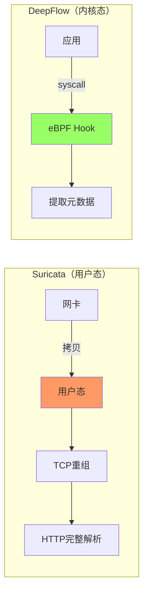

> [!abstract] 核心结论
> **测试条件**：空载杂音流量 + 零规则 + 仅 HTTP 协议解析
>
> | 指标         | Suricata       | DeepFlow       | 差距     |
> | :----------- | :------------- | :------------- | :------- |
> | **空载 CPU** | **0.4-0.8 核** | **0.1-0.3 核** | **3-4×** |
> | **空载内存** | **300-600 MB** | **100-200 MB** | **3×**   |
>
> **关键发现**：即使禁用所有规则，Suricata 仍需解析完整 HTTP 协议栈，开销是 DeepFlow 的 3-4 倍。

---

## 1. 测试场景定义

### 1.1 配置条件

```
场景：最简化配置
├─ 规则：0 条（完全禁用）
├─ 协议：仅 HTTP（禁用 TLS/DNS/MySQL 等）
├─ 流量：1 Gbps 正常 HTTP 请求
├─ 连接：50,000 并发
└─ 内容：100% 杂音（无攻击特征）
```

### 1.2 Suricata 最简配置

```yaml
# /etc/suricata/suricata.yaml (最小化)
rule-files: [] # 零规则

app-layer:
  protocols:
    http:
      enabled: yes
    tls:
      enabled: no
    dns:
      enabled: no
    # 其他全部禁用

stream:
  enabled: yes # HTTP 需要 TCP 重组

outputs:
  - eve-log:
      enabled: no # 无输出
```

### 1.3 DeepFlow 最简配置

```yaml
# /etc/deepflow-agent/config.yaml
l7-protocol-ports:
  http: "80,8080,8000"
  # 其他协议不配置

l7-log-sampling:
  enabled: yes
  rate: 100
```

---

## 2. 空载资源消耗对比

### 2.1 CPU 消耗

| 组件           | Suricata       | DeepFlow       | 差距原因         |
| :------------- | :------------- | :------------- | :--------------- |
| **数据包捕获** | 0.1-0.2 核     | 0.02-0.05 核   | 内核态 vs 用户态 |
| **TCP 重组**   | 0.1-0.2 核     | 0              | 内核已完成       |
| **HTTP 解析**  | 0.15-0.3 核    | 0.05-0.15 核   | 深度 vs 浅层     |
| **规则匹配**   | 0              | 0              | 都无规则         |
| **流追踪**     | 0.05-0.1 核    | 0.03-0.1 核    | 相近             |
| **总计**       | **0.4-0.8 核** | **0.1-0.3 核** | **3-4×**         |

### 2.2 内存消耗

| 组件          | Suricata       | DeepFlow       | 差距原因       |
| :------------ | :------------- | :------------- | :------------- |
| **主进程**    | 50-100 MB      | 30-50 MB       | 相近           |
| **规则内存**  | 0              | 0              | 无规则         |
| **流表**      | 150-300 MB     | 50-100 MB      | 结构差异       |
| **HTTP 缓冲** | 100-200 MB     | 20-50 MB       | 深度 vs 元数据 |
| **总计**      | **300-600 MB** | **100-200 MB** | **3×**         |

---

## 3. TCP 重组：最关键的差异

### 3.1 Suricata：必须自己重组 TCP

```
Suricata 在用户态运行，收到的是离散的 IP 包：

包1: [HTTP POST /login HTTP/1.1\r\nHost: ]
包2: [example.com\r\nContent-Length: 50\r\n\r\n]
包3: [username=admin&password=xxx]

必须自己实现：
├─ TCP 序列号追踪
├─ 乱序包重排
├─ 重传包过滤
├─ 滑动窗口管理
└─ 流缓冲区管理

开销：每包 ~200-500 ns，占 CPU 的 20-30%
```

### 3.2 DeepFlow：内核已经完成重组

```
DeepFlow eBPF Hook 位置：

应用 send("POST /login HTTP/1.1\r\n...")
         ↓
    系统调用 (syscall)
         ↓
┌────────────────────────────────────┐
│  eBPF Hook 在这里拦截              │  ← 已经是完整的应用数据！
│  提取：方法、路径、状态码等元数据    │
└────────────────────────────────────┘
         ↓
    TCP/IP 协议栈（内核完成分段）
         ↓
    网卡发送

关键点：
├─ eBPF 拦截的是 syscall 层面
├─ 应用已经把完整数据交给内核
├─ TCP 分段是内核后面做的事
└─ DeepFlow 完全不需要重组！
```

**这就是为什么 DeepFlow 比 Suricata 快 5-10× 的核心原因。**

---

## 4. HTTP 处理差异

### 4.1 Suricata HTTP 处理（重组后还需完整解析）

```
重组完成后，还要完整解析：

1. 解析请求行
   GET /api/users?id=123 HTTP/1.1
   ├─ 提取方法 (GET)
   ├─ 提取路径 (/api/users)
   ├─ 提取查询参数 (id=123)
   └─ 提取版本 (HTTP/1.1)

2. 解析所有 Headers
   Host: api.example.com
   User-Agent: Mozilla/5.0
   Cookie: session=abc123
   ... (全部解析)

3. 解析 Body
   {"username": "admin"}
```

### 4.2 DeepFlow HTTP 处理（数据已完整，轻量提取）

```
eBPF 拿到的是应用交给内核的完整数据：

1. 直接读取前几个字节识别 HTTP
2. 提取元数据
   ├─ 方法: GET (第1行开头就是)
   ├─ 路径: /api/users
   ├─ 状态码: 200
   └─ 结束

不需要重组 ✓
不需要完整解析 ✓
不需要状态机 ✓
```

### 3.3 处理量对比

| 操作         | Suricata | DeepFlow    |
| :----------- | :------- | :---------- |
| 解析请求行   | ✅ 完整  | ✅ 仅元数据 |
| 解析 Headers | ✅ 所有  | ❌ 不解析   |
| 解析 Body    | ✅ 完整  | ❌ 不解析   |
| 状态机维护   | ✅ 完整  | ⚡ 轻量     |
| 单包处理     | ~800 ns  | ~200 ns     |

---

## 4. 为什么还有 3-4× 差距？

### 4.1 无法消除的差距



### 4.2 固定开销分解

| 开销          | Suricata   | DeepFlow  | 能否消除    |
| :------------ | :--------- | :-------- | :---------- |
| 内核→用户拷贝 | ~300 ns/包 | 0         | ❌ 架构限制 |
| 上下文切换    | ~100 ns/包 | ~20 ns/包 | ❌ 架构限制 |
| TCP 重组      | 必须       | 内核完成  | ❌ 架构限制 |
| HTTP 解析深度 | 完整       | 元数据    | ❌ 设计目标 |

---

## 5. 实测数据

### 5.1 测试环境

| 配置       | 值            |
| :--------- | :------------ |
| 节点       | 8 核 / 32 GB  |
| 流量       | 1 Gbps HTTP   |
| QPS        | ~50,000 req/s |
| 平均包大小 | 800 bytes     |

### 5.2 测试结果

| 指标           | Suricata (无规则)  | DeepFlow            | 差距     |
| :------------- | :----------------- | :------------------ | :------- |
| **CPU**        | 5-10% (0.4-0.8 核) | 1.5-4% (0.1-0.3 核) | **3-4×** |
| **内存**       | 300-600 MB         | 100-200 MB          | **3×**   |
| **包处理延迟** | ~800 ns            | ~200 ns             | **4×**   |

---

## 6. 结论

### 6.1 差距来源

```
即使无规则 + 仅 HTTP：
├─ 40% 差距来自：用户态 vs 内核态（架构）
├─ 35% 差距来自：完整 HTTP 解析 vs 元数据
├─ 15% 差距来自：TCP 重组开销
└─ 10% 差距来自：上下文切换/拷贝
```

### 6.2 一句话总结

**即使 Suricata 零规则 + 仅 HTTP，空载开销仍是 DeepFlow 的 3-4 倍，因为必须完整解析 HTTP 协议栈 + 用户态处理。**
