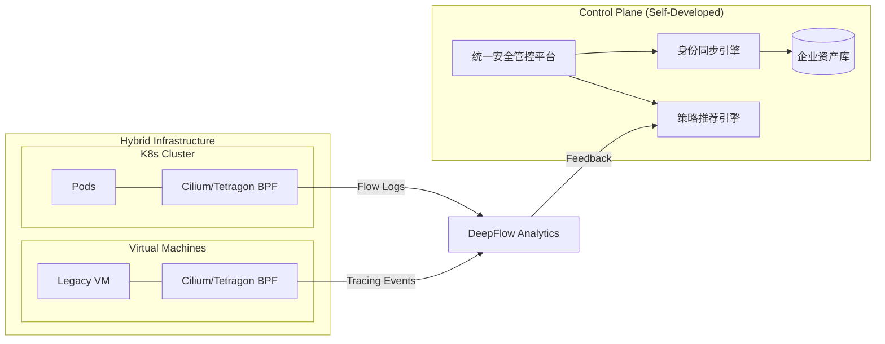

> [!abstract] 导读
> 在 K8s、VM、容器并存的混合架构中，安全边界已彻底从物理网段转向逻辑身份。本方案通过 **Cilium (网络执法)**、**Tetragon (内核安全)** 及 **DeepFlow (全栈观测)** 三位一体，构建一套覆盖 L3 到 L7、从内核到应用的纵深防御体系。

## 1. 深度架构：基于 eBPF 的统一数据面

混合环境下的核心挑战在于**内核版本不一**与**网络拓扑复杂**。我们通过 eBPF 实现对流量和系统调用的无损拦截。



---

## 2. 六大核心需求的技术实现路径

### 2.1 流向控制 (Flow Control)

- **技术核心**：利用 Cilium 的 **Identity-based Networking**。
- **VM 落地**：在 VM 部署 `cilium-agent`。自研 `ExternalWorkload` 控制器，将 VM 的 `HostName/AppGroup` 映射为 Cilium 安全标识。
- **策略实现**：
  - 使用 `CiliumNetworkPolicy` 取代传统的 Iptables。
  - **[[2026-03-11-sdp-zero-trust-overview|SDP 零信任架构]]** 应用：实现“未授权即不可见”，默认阻断所有跨段流量。

### 2.2 流量控制 (Traffic Control)

- **技术核心**：**eBPF EDT (Earliest Departure Time)**。
- **实现机制**：
  - 在网卡 `tc` 挂载点利用 BPF 程序计算报文发送时间戳，实现纳秒级限速。
  - **配置点**：开启 `bandwidthManager: true`。
  - **业务价值**：防止 VM 内的爬虫进程或大流量作业冲垮 K8s 内部微服务。

### 2.3 流量加密 (Traffic Encryption)

- **技术核心**：**WireGuard 节点透明加密**。
- **混合云挑战**：跨公有云 VPC 或混合云专线时，流量易被监听。
- **方案**：详见 **[[2026-03-12-cilium-hybrid-encryption-strategy|Cilium 混合加密策略]]**。在混合网关处自动协商密钥，确保流量在离开节点前已完成加密。

### 2.4 内容检测 (Content Inspection - DPI)

- **技术核心**：**DeepFlow eBPF 解析 + Cilium Envoy Go 扩展**。
- **实现路径**：
  - **观测层**：DeepFlow 在内核层提取 Socket Data，实时解析 HTTP/gRPC/SQL 协议头，记录非法的 API 调用。
  - **拦截层**：利用 Cilium 的 L7 Policy。对于敏感路径（如 `/admin`），强制重定向至自研的 Envoy 过滤器进行内容深度扫描（WAF 能力内嵌）。
  - 参考：**[[2026-03-08-deepflow-traffic-capture-technology|DeepFlow 流量采集技术]]**。

### 2.5 权限检测 (Permission Detection)

- **技术核心**：**Tetragon TracingPolicy**。
- **监控维度**：
  - **二进制完整性**：监控 `execve` 调用，只允许签名过的二进制文件运行。
  - **能力（Capability）检测**：检测是否有进程滥用 `CAP_NET_RAW` 发起嗅探。
  - **文件系统权限**：参考 **[[2026-03-11-sdp-kernel-path-deep-dive|SDP 内核路径深究]]**，对敏感配置文件（如 `/etc/kubernetes/pki`）进行实时权限审计。

### 2.6 安全检测 (Security Detection)

- **技术核心**：**运行时阻断 (Enforcement)**。
- **场景示例**：
  - **反弹 Shell**：Tetragon 监控 `sh/bash` 进程的 `fd` 变化。若 `stdin` 来自网络套接字，立即执行内核级 `SIGKILL`。
  - **特权逃逸**：监控 `setns` 系统调用，防止容器试图逃逸至宿主机命名空间。

---

## 3. 关键自研组件开发指南

### 3.1 混合云身份同步器 (The Identity Syncer)

> [!important] 开发重点
> 解决“非 K8s 资源”的身份化问题。

- **核心逻辑**：
  1.  监听 CMDB 变更事件。
  2.  调用 Cilium API 创建 `CiliumExternalWorkload` 资源。
  3.  为 VM 下发对应的 **Identity ID**。
- **逻辑伪代码**：
  ```go
  // 同步 VM 标签到 Cilium Identity
  func SyncVMToCilium(vmInfo VM) {
      labels := map[string]string{
          "app": vmInfo.AppName,
          "env": vmInfo.Env,
          "security-zone": vmInfo.Zone,
      }
      CreateCiliumExternalWorkload(vmInfo.IP, labels)
  }
  ```

### 3.2 统一策略编排引擎 (Unified Policy Engine)

- **目标**：解决“一种业务需求需要写三套 YAML”的问题。
- **功能**：用户在 Web UI 输入“允许 A 访问 B 的数据库”，引擎自动生成：
  1.  `CiliumNetworkPolicy` (网络流向)。
  2.  `TetragonTracingPolicy` (进程发起权限)。
  3.  `DeepFlow Annotation` (开启深度观测)。

### 3.3 自动化异常响应中心 (SOAR for eBPF)

- **联动闭环**：
  - **Input**：Tetragon 产生的安全告警。
  - **Process**：自研判定引擎结合 DeepFlow 的历史流量基线进行风险评估。
  - **Action**：自动调用 Cilium API 开启隔离模式，并触发 **[[2025-12-19-pwru-deep-dive|pwru 工具]]** 进行现场抓包存证。

---

## 4. 实施 SOP 与演进建议

### 4.1 第一阶段：观测先行 (Day 1)

- 部署 **DeepFlow** 到所有 K8s 节点和关键 VM。
- 开启全量流日志采集，建立业务通信拓扑基线。
- **[[2026-03-12-deepflow-vs-suricata-design-analysis|深度对比分析]]** 表明，此阶段可发现 80% 的非法跨段访问。

### 4.2 第二阶段：合规加固 (Day 30)

- 部署 **Tetragon**。下发默认安全基线（锁定 SSH 权限、敏感目录监控）。
- 启动**自研身份同步器**，为 VM 注入逻辑身份。

### 4.3 第三阶段：零信任转型 (Day 90)

- 开启 **Cilium 透明加密**。
- 实施“默认拒绝”策略，通过自研编排引擎下发精准的白名单。
- 引入 **[[2026-03-11-sdp-advanced-threat-defense|SDP 纵深防御进阶]]** 模块，实现自动化的安全闭环。

---

## 5. 外部参考与资源

- [Cilium eBPF Datapath Official Guide](https://docs.cilium.io/en/stable/network/ebpf/)
- [DeepFlow Zero-Code Observability Documentation](https://deepflow.io/docs/zh/about/intro/)
- [Tetragon Runtime Enforcement Reference](https://tetragon.io/docs/concepts/runtime-enforcement/)
- [Linux Kernel eBPF Infrastructure](https://ebpf.io/)
