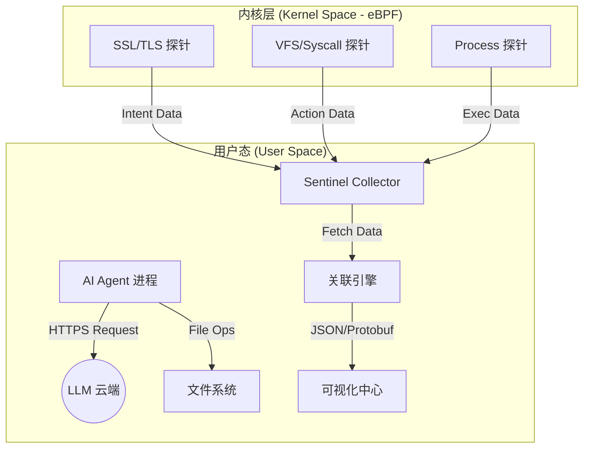

## 1. 背景与目标 (Introduction)

随着 AI 编程助手（如 Claude Code, GitHub Copilot, Cursor）从“代码补全”演进为“自动重构与 Bug 修复（Agentic Workflows）”，开发者面临一个巨大的黑盒挑战：**我不确定 AI 在我的工程里到底读了什么、改了什么、以及它是否真的跑过了测试。**

**AI-Code-Sentinel** 旨在利用 eBPF 的内核级可见性，为 AI 代码修改流程提供一套“全透明”的观测与审计方案。

## 2. 系统架构 (System Architecture)

系统由三个核心组件组成，运行在 Agent 所在的宿主机环境中。

## 3. eBPF 埋点与数据采集策略 (Instrumentation)

### 3.1 意图捕获层 (Intent Capture)
*   **挂载点:** `uprobes` 挂载至 `/usr/lib/libssl.so` 的 `SSL_read` 和 `SSL_write`。
*   **采集数据:** 
    *   捕获 LLM 返回的 JSON Payload。
    *   识别关键字段：`tool_calls`, `patch`, `diff`, `explanation`。
    *   **商业价值:** 记录 AI “想要做什么”，作为后续行为审计的基准。

### 3.2 行为执行层 (Action Monitoring)
*   **挂载点:** `kprobes` 挂载至 `sys_enter_openat`, `sys_enter_write`, `sys_enter_rename`。
*   **采集数据:** 
    *   被修改文件的绝对路径。
    *   写入的数据块大小及内容片段。
    *   **商业价值:** 确认 AI “实际做了什么”，防止其产生的幻觉导致非授权修改。

### 3.3 验证审计层 (Validation Audit)
*   **挂载点:** `tracepoints` 挂载至 `sched_process_exec` (即 `execve`)。
*   **采集数据:** 
    *   AI 进程启动的所有子进程命令行（如 `pytest`, `eslint`, `go test`）。
    *   子进程的退出状态码（Exit Code）。
    *   **商业价值:** 确保 AI 提交的代码是经过“物理验证”的，而非仅凭推理。

## 4. 关键技术：因果关联引擎 (Correlation Engine)

这是系统的核心算法，解决“如何证明这次文件写入是由刚才那个 LLM 指令触发的”问题。

*   **算法逻辑:**
    1.  **PID/TID 定位:** 识别 Agent 主进程及其线程池。
    2.  **时间窗口匹配:** 在 `SSL_read` 收到 Patch 指令后的 $N$ 毫秒内，该 PID 下所有的 `write` 操作被标记为“由 AI 触发”。
    3.  **上下文打标:** 为每一组 (Intent, Action, Validation) 分配一个唯一的 `Agent-Trace-ID`。

## 5. 可视化与交互设计 (UX Design)

### 5.1 AI 修改瀑布流 (Trace Waterfall)
展示一次修改的生命周期：
- `[0s]` **Request:** 发送代码片段至 LLM。
- `[2.5s]` **Intent:** 收到指令 `Replace Line 10-15 with NewLogic()`。
- `[2.6s]` **Action:** 内核记录文件 `db.go` 被写入 256 字节。
- `[3.0s]` **Validation:** 自动运行 `go test ./...` 耗时 2s，状态：Pass。

### 5.2 意图偏离热力图 (Alignment Heatmap)
*   **绿色:** 动作完全符合意图。
*   **黄色:** 意图不明的操作（如 AI 额外读取了无关的敏感文件）。
*   **红色:** 危险动作（如 AI 试图修改 `.env` 或执行 `rm -rf`）。

## 6. 商业化路径与价值 (Business Value)

### 6.1 影子修改预览 (Commercial Product A)
*   **功能:** 在 AI 修改真正落地磁盘前，在内核层拦截并生成虚拟预览。
*   **价值:** 允许企业在不中断流程的情况下，由人类专家进行“最后 10 厘米”的审核。

### 6.2 AI 效能审计报表 (Commercial Product B)
*   **功能:** 统计 AI 在不同模块上的修改成功率、测试通过率和回退频率。
*   **价值:** 为 CTO 提供量化的 AI 投资回报率（ROI）分析，决定是否续费昂贵的 AI 授权。

### 6.3 AI 安全网关 (Commercial Product C)
*   **功能:** 基于 eBPF 的实时拦截引擎。
*   **价值:** 防止 AI 被 Prompt 注入劫持后执行恶意删除或外传源码的行为。

## 7. B2B 场景下的本地执行防御策略 (Local Execution Defense for Service-Side AI)

针对“AI 大脑在云端（服务侧），Agent 在内网（执行侧）”的混合架构，系统提供超越传统防火墙的内核级防御能力。

### 7.1 “意图-外传”关联审计 (Exfiltration Prevention via Context)
*   **挑战:** AI 进程被注入后，可能通过“合法通道”（如 Git Push）外传敏感源码。
*   **eBPF 方案:** 建立“读-传”关联模型。如果检测到某个网络发送操作的数据来源于不久前读取的 `.env` 或关键源码文件，即使目标 IP 在防火墙白名单内，系统也将触发安全报警。

### 7.2 东西向流量微隔离 (Internal Network Micro-segmentation)
*   **挑战:** AI Agent 可能被指令扫描内网数据库或凭证中心。
*   **eBPF 方案:** 在内核层为 Agent 进程应用“最小权限原则”。限制该 PID 只能发起流向特定开发工具（如 GitLab/Jenkins）的 `connect()` 调用，彻底封锁其内网渗透路径。

### 7.3 加密流量的内容审计 (Zero-trust Content Audit)
*   **挑战:** HTTPS 流量是防火墙的审计盲区。
*   **eBPF 方案:** 利用 `uprobes` 在解密前捕获外发 Payload。无需配置证书卸载（SSL Offloading），即可实时检查 AI Agent 是否正在外传非预期的结构化资产。

### 7.4 内核级“熔断器” (Kernel-level Circuit Breaker)
*   **方案:** 当关联引擎检测到“高危偏离”（如 AI 试图执行 `rm -rf` 或修改系统 SSH 密钥），系统利用 eBPF 的 `bpf_override_return` 或进程信号机制直接熔断该物理操作，实现先于代码落地的实时拦截。

## 8. 实施路线图 (Roadmap)

1.  **Phase 1 (Prototype):** 在本地环境实现对简单 Python 脚本修改行为的 `openat/write` 追踪。
2.  **Phase 2 (Instrumentation):** 集成 OpenSSL uprobes，实现对常见 AI SDK 流量的解密观测。
3.  **Phase 3 (Visual):** 开发基于 Quartz 或 Grafana 的可视化面板，展示因果链路。
4.  **Phase 4 (Product):** 增加安全策略引擎，实现对敏感文件的内核级保护。

---

**结论:** AI-Code-Sentinel 将 AI 编程从“基于信任”提升到“基于验证”的新高度。在 AI 代理化的大趋势下，这种“全透明监控”将成为企业引入 AI 的必备基础设施。
