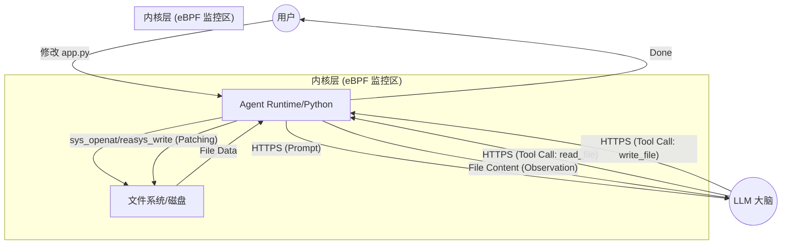

在 AI Agent 时代，大模型（LLM）不仅是对话框里的文字生成器，更是能够操作文件、调用 API 和执行代码的“执行体”。如何观察并审计 Agent 的执行全流程，成为可观测性领域的新挑战。eBPF 以其内核级的可见性和非侵入性，为 AI Agent 的流程追踪提供了完美的底层支撑。

## 1. AI Agent 流量特征分析

LLM 应用产生的网络流量与传统 Web 应用有显著差异：

- **SSE 流式传输 (Server-Sent Events):** 响应头通常包含 `Content-Type: text/event-stream`，表现为长连接中稳定的小包推送。
- **高度不对称性:** Input (Prompt) 包通常较小，而 Output (Completion) 在生成长文本或执行复杂任务时显著大于请求量。
- **心跳脉冲 (Inter-token Latency):** Token 之间的生成间隔具有极强的规律性，可用于模型推理性能定界。
- **TLS 指纹特征:** AI SDK (如 OpenAI Python SDK, LangChain) 发起请求时具有特定的 JA3/JA4 指纹，便于在加密流量中识别 Agent 行为。

## 2. Agent 执行“读取与修改”的全流程追踪

我们将 Agent 的一次任务执行拆解为“大脑决策 -> 环境分发 -> 物理执行 -> 结果反馈”四个阶段，并展示 eBPF 如何在每一层进行观测。

### 2.1 流程图解

### 2.2 eBPF 关键监控点

| 阶段        | 行为                       | eBPF 挂载点          | 捕获信息                                            |
| :---------- | :------------------------- | :------------------- | :-------------------------------------------------- |
| **决策**    | LLM 下达 Tool Call 指令    | `SSL_read` (uprobe)  | 解密后的 JSON，如 `{"tool": "read_file"}`           |
| **执行-读** | Agent 读取目标文件         | `sys_enter_openat`   | 目标路径 (如 `app.py`)，确认 Agent 正在“动”哪个文件 |
| **执行-写** | Agent 应用修改补丁         | `sys_enter_write`    | 写入的内容长度、文件描述符，甚至可以捕获 Diff 内容  |
| **反馈**    | Agent 将执行结果上报给 LLM | `SSL_write` (uprobe) | “读取成功”或“写入完成”的确认 Payload                |

## 3. 核心观测价值

### 3.1 意图与动作的因果关联 (Causality)

eBPF 的核心能力在于能够通过进程上下文（PID/TID）将不同层面的事件强关联：

- **Intent (意图):** 从 `SSL_read` 捕获 LLM 下发的指令。
- **Action (动作):** 从 `Syscalls` 捕获 Agent 进程紧接着发起的物理操作。
- **因果性:** 通过 PID 匹配，实现从“大脑决策”到“手脚执行”的全程闭环追踪。

### 3.2 多进程协作追踪 (Sub-process Tracking)

当 Agent 执行复杂任务（如“修复代码并运行测试”）时，通常会启动多个子进程：

1. Agent (Python) -> `fork/execve` -> Shell (`/bin/bash`)
2. Shell -> `fork/execve` -> Compiler (`go build`)
3. Shell -> `fork/execve` -> Test Runner (`pytest`)

**eBPF 的优势：** 通过监控 `sched_process_fork` 和 `sched_process_exec`，eBPF 可以维护一个完整的进程树关系。即使执行动作的是子进程（如编译器），eBPF 也能追根溯源，将其产生的资源消耗和系统调用归属到最初的 LLM 指令下。

## 4. 可视化落地建议

基于 eBPF 捕获的因果数据，推荐实现以下三种视图：

1. **统一瀑布流 (Unified Waterfall):** 将“云端 LLM 推理”与“本地工具执行（含子进程）”放在同一个 Timeline 下，精准定位性能瓶颈。
2. **大脑-执行拓扑 (Intent-Action Topology):** 实时展示 LLM 指令流与系统调用流的映射关系，让 Agent 的执行过程“全透明”。
3. **安全审计色块 (Security Heatmap):** 自动标记“无意图触发”的危险操作（如非授权的文件读取或异常外联），实现 AI 行为的实时风控。

## 5. 适用场景与局限性

### 5.1 适用场景 (The Sweet Spot)

- **本地/私有化 Agent:** 运行在受控 Linux 环境（如开发机、私有云 K8s）中的 Agent。
- **第三方 Agent 插件审计:** 当你需要运行一个闭源的 Agent 插件，且不信任其行为时，eBPF 是唯一的非侵入式安全审计手段。
- **本地编码助手:** 观测 IDE 插件或 CLI 工具与本地文件系统的交互。

### 5.2 局限性 (The Boundary)

- **纯 SaaS 托管环境:** 在完全托管的 AI 服务中（如 OpenAI Assistants），由于缺乏内核访问权，无法部署 eBPF 探针。
- **跨机通信透明度:** 如果 Agent 与工具（Tool）分布在不同的物理机，需要依赖分布式追踪（Distributed Tracing）或统一的网格观测。

## 6. 总结

eBPF 是 AI Agent 的“数字黑匣子”。通过对系统调用的实时监控与协议深度解析，我们不仅能看到 Agent “说了什么”，更能看清它“做了什么”。对于运行在 C 端或私有环境的 Agent 来说，eBPF 是构建可信、高性能 AI 应用的基石。
