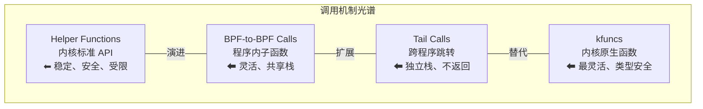
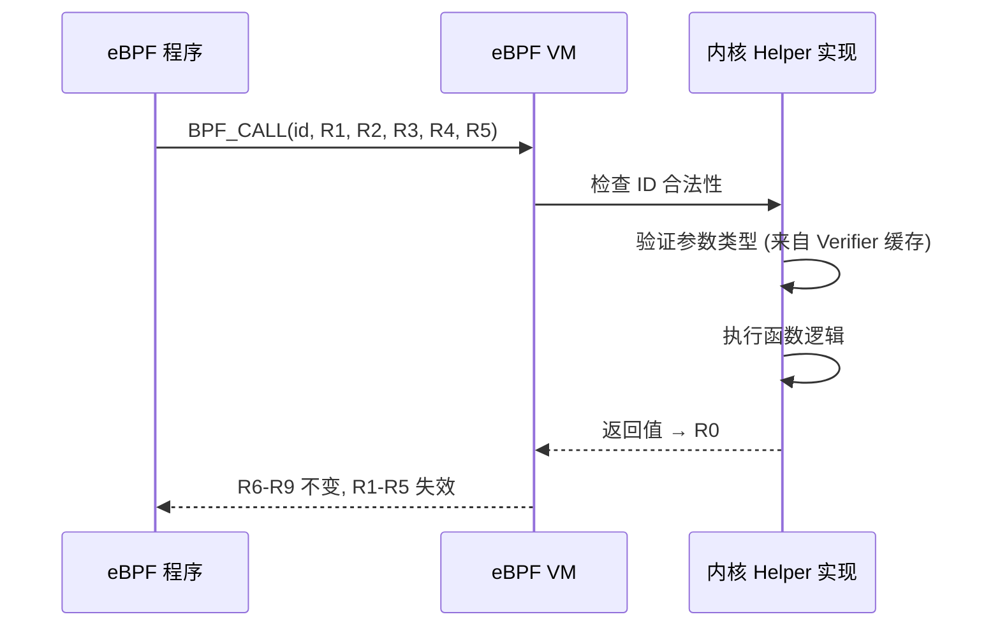
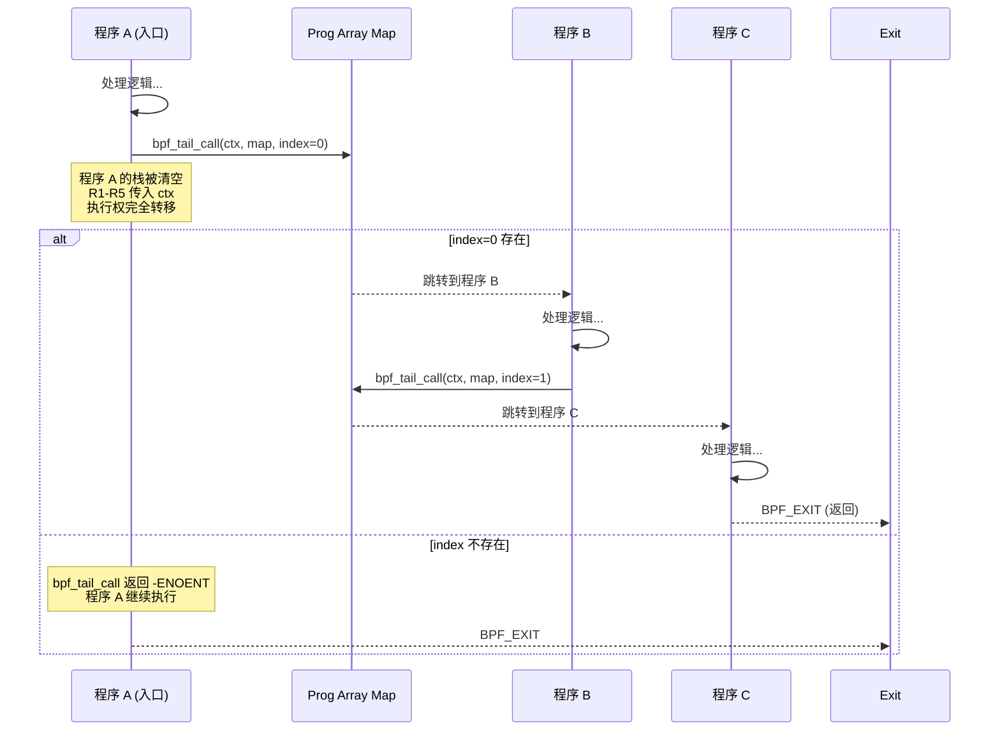
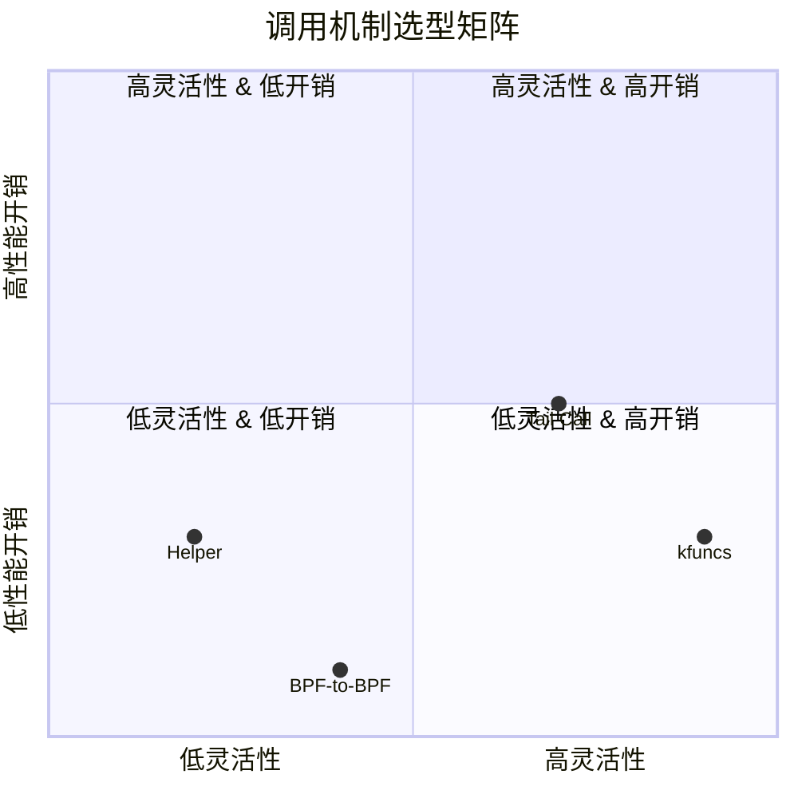
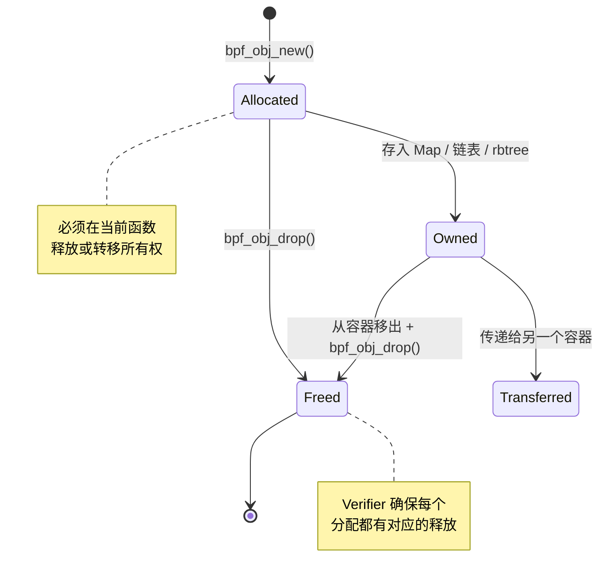

> [!info] eBPF 2026 深度探索系列
> 0. [[2026-04-08-ebpf-comprehensive-learning-roadmap|全栈学习路径总览]]
> 1. [[2026-04-08-ebpf-deep-dive-ch1-registers-and-instructions|第一章：寄存器与指令集]]
> 2. **第一.五章：四种函数调用与动态内存**
> 3. [[2026-04-08-ebpf-deep-dive-ch1-6-the-verifier|第一.六章：验证器 (Verifier) 的底层逻辑]]
> 4. [[2026-04-08-ebpf-deep-dive-ch2-maps-and-communication|第二章：Map 机制与跨空间通信]]
> 5. [[2026-04-08-ebpf-deep-dive-ch2-5-kptr-and-ownership|第二.五章：kptr (内核指针) 与内存所有权模型]]
> 6. [[2026-04-08-ebpf-deep-dive-ch3-core-and-btf|第三章：CO-RE 与 BTF 的跨版本魔法]]
> 7. [[2026-04-08-ebpf-deep-dive-ch4-tracing-hooks-and-security|第四章：从 kprobe 到 LSM 的追踪全图景]]
> 8. [[2026-04-08-ebpf-deep-dive-ch7-5-uprobes-dynamic-tracing|第七.五章：uprobe 用户态动态追踪原理]]
> 9. [[2026-04-08-ebpf-deep-dive-ch7-6-bpftime-user-runtime|第七.六章：bpftime 与用户态 eBPF 加速]]
> 10. [[2026-04-08-ebpf-deep-dive-ch18-bpftime-injection-mastery|第七.七章：bpftime 自动化注入与全量监控实战]]
> 11. [[2026-04-08-ebpf-deep-dive-ch7-8-uprobe-selection-guide|第七.八章：uprobe 选型指南：内核态 vs 用户态]]
> 12. [[2026-04-08-ebpf-deep-dive-ch5-xdp-networking-performance|第五章：XDP 极致网络性能与全栈架构]]
> 13. [[2026-04-08-ebpf-deep-dive-ch6-tc-traffic-control|第六章：TC (Traffic Control) 流量调度艺术]]
> 14. [[2026-04-08-ebpf-deep-dive-ch7-security-lsm-enforcement|第七章：LSM BPF 从可观测到安全执法]]
> 15. [[2026-04-08-ebpf-deep-dive-ch8-advanced-tuning-and-profiling|第八章：进阶实战与内核调优]]
> 16. [[2026-04-08-ebpf-deep-dive-ch9-af-xdp-zero-copy|第九章：AF_XDP 零拷贝与用户态协议栈]]
> 17. [[2026-04-08-ebpf-deep-dive-ch10-sched-ext-custom-scheduler|第十章：sched_ext 自定义 CPU 调度器]]
> 18. [[2026-04-08-ebpf-deep-dive-ch11-bpf-iterators|第十一章：BPF Iterators 内核对象迭代器]]
> 19. [[2026-04-08-ebpf-deep-dive-ch12-kfuncs-evolution|第十二章：kfuncs 下一代内核交互标准]]
> 20. [[2026-04-08-ebpf-deep-dive-ch13-usdt-tracing|第十三章：USDT 用户态静态定义追踪]]
> 21. [[2026-04-08-ebpf-deep-dive-ch14-ai-llm-inference-monitoring|第十四章：AI 推理与大模型监控前沿]]
> 22. [[2026-04-08-ebpf-deep-dive-ch15-container-isolation|第十五章：无感增强容器隔离性]]
> 23. [[2026-04-08-ebpf-deep-dive-ch16-ebpf-and-wasm|第十六章：eBPF 与 WebAssembly (WASM) 的共生架构]]
> 24. [[2026-04-08-ebpf-deep-dive-ch17-storage-and-filesystem|第十七章：存储与文件系统加速]]
> 25. [[2026-04-08-ebpf-deep-dive-ch18-lifecycle-and-links|第十八章：生命周期管理与 BPF Links]]
> 26. [[2026-04-08-ebpf-deep-dive-ch19-atomic-updates-and-hot-upgrade|第十九章：程序的原子更新与蓝绿部署]]
> 27. [[2026-04-08-ebpf-deep-dive-ch25-5-stack-trace-correlation|第二五.五章：调用栈与业务请求的深度绑定]]
> 28. [[2026-04-08-ebpf-deep-dive-ch20-edge-iot-acceleration|第二十章：边缘计算与工业协议加速]]
> 29. [[2026-04-08-ebpf-deep-dive-ch21-debugging-and-verifier|第二十一章：调试实战与验证器 (Verifier) 诊断]]
> 30. [[2026-04-08-ebpf-deep-dive-ch22-testing-and-ci-cd|第二十二章：测试与持续集成 (CI/CD) 实战]]
> 31. [[2026-04-08-ebpf-deep-dive-ch23-security-and-permissions|第二十三章：权限细分与 BPF 安全沙箱]]
> 32. [[2026-04-08-ebpf-deep-dive-ch24-meta-monitoring-and-self-healing|第二十四章：eBPF 程序的内核自愈与监控]]
> 33. [[2026-04-08-ebpf-deep-dive-ch25-full-stack-observability|第二十五章：全栈可观测性与端到端追踪]]
> 34. [[2026-04-08-ebpf-deep-dive-ch26-network-security-high-level|第二十六章：网络安全防御的高阶实战]]
> 35. [[2026-04-08-ebpf-deep-dive-ch27-agent-engineering-architecture|第二十七章：工业级模块化 Agent 架构演进]]
> 36. [[2026-04-08-ebpf-deep-dive-ch28-offensive-and-defensive|第二十八章：攻防博弈与 Rootkit 防御]]
> 37. [[2026-04-08-ebpf-deep-dive-ch29-networking-deep-dive|第二十九章：网络应用深水区——负载均衡、Sockmap 与拥塞控制]]
> 38. [[2026-04-08-ebpf-deep-dive-ch30-hardware-offload|第三十章：硬件卸载与 SmartNIC 实战]]
> 39. [[2026-04-08-ebpf-deep-dive-ch31-signed-objects-and-security|第三十一章：内核原生签名与供应链安全]]
> 40. [[2026-04-08-ebpf-deep-dive-ch32-ebpf-for-windows|第三十二章：跨平台崛起——eBPF for Windows]]
> 41. [[2026-04-08-ebpf-deep-dive-ch32-5-macos-status|第三十二.五章：macOS 的特殊路径]]
> 42. [[2026-04-08-ebpf-deep-dive-ch33-serverless-optimization|第三十三章：Serverless 冷启动消除与动态计费]]
> 43. [[2026-04-08-ebpf-deep-dive-ch34-waf-and-rasp|第三十四章：Web 安全革命——内核态 WAF 与 RASP]]
> 44. [[2026-04-08-ebpf-deep-dive-ch35-npu-tpu-ai-hardware|第三十五章：AI 推理硬件 (NPU/TPU) 与硬件定义内核]]
> 45. [[2026-04-08-ebpf-deep-dive-ch36-dynamic-language-introspection|第三十六章：动态语言感知——业务对象的零代码提取]]
> 46. [[2026-04-08-ebpf-deep-dive-ch37-green-computing|第三十七章：绿色计算与能耗精准归因]]
> 47. [[2026-04-08-ebpf-deep-dive-ch38-ecosystem-and-career|第三十八章：2026 生态全景与工程师职业导航]]
> 48. [[2026-04-09-ebpf-deep-dive-ch39-rust-aya-framework|第三十九章：Rust eBPF 开发实战——Aya 框架与安全编程]]
> 49. [[2026-04-09-ebpf-deep-dive-ch40-network-protocols-deep-dive|第四十章：网络协议深度解析——TCP/UDP/QUIC 的 eBPF 视角]]
> 50. [[2026-04-09-ebpf-deep-dive-ch41-memory-safety-and-vulnerabilities|第四十一章：eBPF 内存安全与漏洞分析]]
> 51. [[2026-04-09-ebpf-deep-dive-ch42-service-mesh-integration|第四十二章：eBPF 与 Service Mesh 深度集成]]

---

## 1. 概述：eBPF 程序如何"做事"？

eBPF 程序不能像普通用户态程序那样自由调用任意函数。它只能通过 **四种受控的调用机制** 与外部世界交互：

1. **Helper Functions** — 内核提供的标准 API
2. **BPF-to-BPF Calls** — 同一程序内的子函数调用
3. **Tail Calls** — 跨程序的跳转交接
4. **kfuncs** — 内核通过 BTF 导出的原生函数

这四种机制在设计哲学、性能特征和安全约束上差异巨大。选错调用方式不仅会导致性能下降，还可能直接被 Verifier 拒绝。



---

## 2. Helper Functions：内核的标准 API

### 2.1 工作原理

Helper Functions 是由内核核心代码预定义的一组函数，通过**整数 ID** 进行调用。调用时，函数编号编码在 eBPF 指令的 `imm` 字段中。

```
BPF_CALL_0(id)        // 0 个参数
BPF_CALL_1(id, arg1)  // 1 个参数
BPF_CALL_2(id, arg1, arg2)
BPF_CALL_3(id, arg1, arg2, arg3)
BPF_CALL_4(id, arg1, arg2, arg3, arg4)
BPF_CALL_5(id, arg1, arg2, arg3, arg4, arg5)
```

**调用流程：**



### 2.2 常用 Helper 分类

| 类别 | 代表 Helper | 说明 |
| :--- | :--- | :--- |
| **Map 操作** | `bpf_map_lookup_elem`, `bpf_map_update_elem`, `bpf_map_delete_elem` | 所有 Map 的 CRUD |
| **数据读取** | `bpf_probe_read_user`, `bpf_probe_read_kernel` | 安全读取用户态/内核态内存 |
| **网络操作** | `bpf_redirect`, `bpf_skb_vlan_push`, `bpf_csum_diff` | 网络包修改与重定向 |
| **时间获取** | `bpf_ktime_get_ns`, `bpf_jiffies64` | 获取纳秒级时间戳 |
| **打印调试** | `bpf_trace_printk` | 输出到 trace_pipe |
| **Per-CPU 操作** | `bpf_get_smp_processor_id`, `bpf_this_cpu_ptr` | 获取当前 CPU 信息 |
| **Spin Lock** | `bpf_spin_lock`, `bpf_spin_unlock` | Map 内的自旋锁 |

### 2.3 代码实战：Helper 调用详解

```c
#include <vmlinux.h>
#include <bpf/bpf_helpers.h>

// 定义一个 Hash Map
struct {
    __uint(type, BPF_MAP_TYPE_HASH);
    __uint(max_entries, 1024);
    __type(key, u32);
    __type(value, u64);
} packet_count SEC(".maps");

SEC("xdp")
int count_packets(struct xdp_md *ctx) {
    // --- Helper 调用 1: bpf_ktime_get_ns ---
    // 获取当前时间（纳秒），0 个参数
    u64 now = bpf_ktime_get_ns();

    // --- Helper 调用 2: bpf_get_prandom_u32 ---
    // 获取伪随机数（用于采样）
    u32 rand = bpf_get_prandom_u32();

    // 只处理 1% 的包（采样）
    if (rand % 100 != 0)
        return XDP_PASS;

    // --- Helper 调用 3: bpf_map_lookup_elem ---
    // 2 个参数：Map 指针, Key 指针
    u32 key = 0;  // 简单的计数器 Key
    u64 *count = bpf_map_lookup_elem(&packet_count, &key);

    if (count) {
        // --- Helper 调用 4: (隐式) __sync_fetch_and_add ---
        // 使用 clang 内建原子操作更新值
        __sync_fetch_and_add(count, 1);
    } else {
        // --- Helper 调用 5: bpf_map_update_elem ---
        // 4 个参数：Map, Key, Value, Flags
        u64 init_val = 1;
        bpf_map_update_elem(&packet_count, &key, &init_val, BPF_ANY);
    }

    // --- Helper 调用 6: bpf_trace_printk ---
    // 注意：最多 3 个参数，性能开销大，生产环境禁用
    bpf_trace_printk("packet sampled at %lld\n", now);

    return XDP_PASS;
}

char _license[] SEC("license") = "GPL";
```

### 2.4 Helper 的局限性

- **参数数量硬限制**：最多 5 个参数，无法扩展
- **新增流程重**：添加新 Helper 需要修改内核核心代码，经过完整的内核补丁审查流程
- **类型安全较弱**：早期 Helper 的参数类型在运行时才检查，而非编译时
- **返回值约定不统一**：不同 Helper 的错误返回值含义不同（有的返回 NULL，有的返回负数）

---

## 3. BPF-to-BPF Calls：程序内子函数

### 3.1 工作原理

BPF-to-BPF Call 是最接近传统函数调用的机制。你可以在同一个 C 源文件中定义多个 `static __always_inline` 或 `static` 函数，编译器会生成对应的 `BPF_CALL` 指令。

```c
// 子函数：解析以太网头
static __always_inline int parse_eth(struct xdp_md *ctx, struct ethhdr **out_eth) {
    void *data = (void *)(long)ctx->data;
    void *data_end = (void *)(long)ctx->data_end;

    struct ethhdr *eth = data;
    if ((void *)(eth + 1) > data_end)
        return -1;  // 越界

    *out_eth = eth;
    return 0;
}

// 子函数：解析 IP 头
static __always_inline int parse_ip(struct ethhdr *eth, struct iphdr **out_ip) {
    struct iphdr *ip = (void *)(eth + 1);
    // 边界检查...
    *out_ip = ip;
    return 0;
}

// 主函数：组合调用子函数
SEC("xdp")
int parse_packet(struct xdp_md *ctx) {
    struct ethhdr *eth;
    struct iphdr *ip;

    if (parse_eth(ctx, &eth) < 0)
        return XDP_DROP;
    if (parse_ip(eth, &ip) < 0)
        return XDP_DROP;

    return XDP_PASS;
}
```

### 3.2 inline vs 非inline：关键区别

| 特性 | `__always_inline` | `static` (非 inline) |
| :--- | :--- | :--- |
| **编译方式** | 编译器将函数体**直接展开**到调用处 | 生成独立的 `BPF_CALL` 指令 |
| **指令数** | 可能增加总指令数（重复展开） | 更少的总指令数（共享代码） |
| **Verifier** | 无跨函数分析，验证更快 | 需要跨过程分析，更慢 |
| **栈使用** | 每个调用处独立计算栈 | **共享 512 字节栈空间** |
| **适用场景** | 简短函数、性能关键路径 | 大型函数、代码复用 |

### 3.3 栈共享陷阱

这是 BPF-to-BPF Call 最容易踩的坑：

```c
// 主函数使用了 300 字节栈
static int main_func() {
    char buf[300];  // 300 字节
    return sub_func();
}

// 子函数也使用了 250 字节栈
static int sub_func() {
    char buf2[250];  // 250 字节
    return 0;
}

// Verifier 报错：combined stack size 550 exceeds 512 byte limit!
```

**解决方案：**

```c
// 方案 1：使用 Per-CPU Map 代替大栈变量
struct { __uint(type, BPF_MAP_TYPE_PERCPU_ARRAY); __uint(max_entries, 1);
    __type(key, u32); __type(value, struct big_buf); } tmpbuf SEC(".maps");

// 方案 2：将子函数标记为 __always_inline
// （但如果函数体很大，会增加指令数）

// 方案 3：重构以减少同时需要的栈变量
static int sub_func() {
    // 先处理完局部数据，再调用下一个子函数
    char buf2[250];
    // ... 处理 buf2 ...
    // buf2 的生命周期结束，栈空间被回收
    return deeper_func();  // 现在有空间了
}
```

---

## 4. Tail Calls：跨程序跳转

### 4.1 工作原理

Tail Call 是一种**不返回的函数跳转**。它将执行权从一个 eBPF 程序完全转移给另一个程序，类似于 Linux 进程的 `execve()` 系统调用。



### 4.2 代码实战：包处理管线

```c
#include <vmlinux.h>
#include <bpf/bpf_helpers.h>

// 定义程序数组 Map
struct {
    __uint(type, BPF_MAP_TYPE_PROG_ARRAY);
    __uint(max_entries, 3);
    __uint(key_size, sizeof(u32));
    __uint(value_size, sizeof(u32));
} jump_table SEC(".maps");

// 计数 Map
struct {
    __uint(type, BPF_MAP_TYPE_PERCPU_ARRAY);
    __uint(max_entries, 3);
    __type(key, u32);
    __type(value, u64);
} stage_stats SEC(".maps");

// === 阶段 0：L2 协议解析 ===
SEC("xdp/stage0")
int stage0_l2(struct xdp_md *ctx) {
    void *data = (void *)(long)ctx->data;
    void *data_end = (void *)(long)ctx->data_end;

    struct ethhdr *eth = data;
    if ((void *)(eth + 1) > data_end)
        return XDP_DROP;

    // 记录本阶段处理次数
    u32 key = 0;
    u64 *count = bpf_map_lookup_elem(&stage_stats, &key);
    if (count) __sync_fetch_and_add(count, 1);

    // 跳转到阶段 1
    bpf_tail_call(ctx, &jump_table, 1);

    // 如果跳转失败（程序不存在），走默认逻辑
    return XDP_PASS;
}

// === 阶段 1：L3 协议解析 ===
SEC("xdp/stage1")
int stage1_l3(struct xdp_md *ctx) {
    u32 key = 1;
    u64 *count = bpf_map_lookup_elem(&stage_stats, &key);
    if (count) __sync_fetch_and_add(count, 1);

    // 跳转到阶段 2
    bpf_tail_call(ctx, &jump_table, 2);

    return XDP_PASS;
}

// === 阶段 2：L4 策略执行 ===
SEC("xdp/stage2")
int stage2_l4(struct xdp_md *ctx) {
    u32 key = 2;
    u64 *count = bpf_map_lookup_elem(&stage_stats, &key);
    if (count) __sync_fetch_and_add(count, 1);

    // 最终决策
    return XDP_PASS;
}

char _license[] SEC("license") = "GPL";
```

### 4.3 Tail Call 的 33 层限制

内核将 Tail Call 的最大深度限制为 **33 层**（`BPF_MAX_TAIL_CALLS = 33`）。这个限制是为了防止恶意构造的无限跳转导致内核栈溢出。

**工程影响：**

- 33 层对于大多数网络处理管线来说绰绰有余（通常 3-5 层就够了）
- 如果接近限制，说明架构设计可能需要重新考虑——也许应该合并某些阶段
- 尾调用计数器存储在当前 CPU 的 per-CPU 变量中，每执行一次 `bpf_tail_call` 递增 1

### 4.4 Tail Call vs BPF-to-BPF Call 对比

| 特性 | BPF-to-BPF Call | Tail Call |
| :--- | :--- | :--- |
| **返回行为** | **会返回**到调用者 | **不返回**，执行权完全转移 |
| **栈** | 共享 512 字节（累加） | **独立栈**（清空重建） |
| **调用深度** | 无硬限制（受指令数限制） | 最多 33 层 |
| **跨程序** | 不支持（同一 .o 文件内） | 支持（不同 eBPF 程序间） |
| **数据传递** | 通过函数参数和返回值 | 只能通过 Map 传递 |
| **性能** | 函数调用开销（极小） | 稍高（需要查 Map + 重置栈） |

---

## 5. kfuncs：下一代内核交互标准

### 5.1 设计动机

Helper Functions 的核心问题在于**扩展性**：每新增一个 Helper 都需要修改内核核心代码。随着 eBPF 生态的爆发式增长，内核社区迫切需要一种更灵活的机制——这就是 **kfuncs (Kernel Functions)**。

### 5.2 kfuncs 的工作原理

kfuncs 利用 **BTF (BPF Type Format)** 元数据，允许内核子系统导出自己的函数给 eBPF 程序调用：

```c
// 内核代码中（以网络子系统为例）：
// net/core/dev.c

// 定义一个 kfunc
__diag_push();
__diag_ignore_all("-Wmissing-prototypes",
                  "kfuncs are defined via BTF");

// BTF 集合声明
BTF_SET8_START(bpf_kfunc_set_xdp)
BTF_ID_FLAGS(func, bpf_xdp_adjust_tail, KF_TRUSTED_ARGS | KF_MODIFY_RETURN)
BTF_ID_FLAGS(func, bpf_xdp_get_mac_addr, KF_TRUSTED_ARGS | KF_RET_NULL)
BTF_ID_FLAGS(func, bpf_xdp_redirect, KF_DESTRUCTIVE | KF_TRUSTED_ARGS)
BTF_SET8_END(bpf_kfunc_set_xdp)
```

### 5.3 kfuncs vs Helper Functions

| 特性 | Helper Functions | kfuncs |
| :--- | :--- | :--- |
| **定义位置** | 内核核心 (`kernel/bpf/`) | 任意内核子系统 |
| **注册方式** | 硬编码数组 | BTF SET 声明 |
| **新增流程** | 修改核心代码 + 内核补审查 | 子系统自行注册 |
| **类型安全** | 运行时检查 | **编译时 BTF 类型检查** |
| **参数标记** | 无 | `KF_TRUSTED_ARGS`, `KF_ACQUIRE` 等语义标记 |
| **版本兼容** | 需要用户态库适配 | **弱链接 (Weak Linking)** 自动处理 |

### 5.4 kfuncs 标志位

kfuncs 通过 BTF 标志位声明其行为约束，Verifier 利用这些信息进行更精确的安全检查：

| 标志 | 含义 | 示例 |
| :--- | :--- | :--- |
| `KF_ACQUIRE` | 返回一个**新获取的所有权指针** | `bpf_obj_new_impl` |
| `KF_RELEASE` | **释放**一个所有权指针 | `bpf_obj_drop_impl` |
| `KF_TRUSTED_ARGS` | 参数指针必须是 Verifier 信任的 | 大多数 kfuncs |
| `KF_RET_NULL` | 可能返回 NULL | `bpf_sk_lookup_tcp` |
| `KF_MODIFY_RETURN` | 可以修改调用者的返回值 | LSM 钩子 |
| `KF_DESTRUCTIVE` | 调用会销毁参数对象 | `bpf_kfree_skb` |

### 5.5 弱链接 (Weak Linking)

kfuncs 最重要的工程特性是**弱链接**。eBPF 程序可以调用一个在当前内核上可能不存在的 kfunc，程序仍然能加载成功——运行时如果 kfunc 不存在，调用会被静默跳过。

```c
// 声明一个可能不存在的 kfunc
extern void bpf_new_feature(struct sk_buff *skb) __weak;

SEC("tc")
int my_prog(struct __sk_buff *skb) {
    // 在新内核上会实际调用
    // 在老内核上会被静默跳过（等价于 NOP）
    bpf_new_feature(skb);
    return TC_ACT_OK;
}
```

这让 eBPF 程序可以**向前兼容**：在旧内核上运行时自动降级，在新内核上运行时自动使用新功能。

---

## 6. 综合对比与选型指南

### 6.1 四种机制全面对比



### 6.2 决策树

```
需要调用内核功能？
├── 是：需要跨子系统调用吗？
│   ├── 是：用 kfuncs（2026 年推荐）
│   └── 否：功能是否已有 Helper？
│       ├── 是：用 Helper（稳定、文档齐全）
│       └── 否：等待 kfuncs 或提交补丁
└── 否：需要拆分逻辑吗？
    ├── 需要独立栈（避免 512B 限制）：用 Tail Call
    └── 不需要独立栈：
        ├── 简短函数：__always_inline
        └── 大型函数：static 非 inline
```

### 6.3 寄存器状态迁移总结

| 调用类型 | R0 | R1-R5 | R6-R9 | R10 |
| :--- | :--- | :--- | :--- | :--- |
| **Helper Call** | 返回值（可能被覆盖） | **caller-saved**（失效） | **callee-saved**（不变） | 不变 |
| **BPF-to-BPF Call** | 返回值 | caller-saved | callee-saved | 不变 |
| **Tail Call** | 重置 | 传入新 ctx | 重置 | **重置**（新栈帧） |
| **kfunc Call** | 返回值（带 BTF 类型） | caller-saved | callee-saved | 不变 |

---

## 7. 代码实战：动态内存管理

### 7.1 bpf_obj_new 的核心价值

在 2024-2026 年的演进中，eBPF 引入了真正的动态内存分配能力。`bpf_obj_new` 本身就是一个 kfunc，它创建了一个由 Verifier **强制追踪所有权**的对象。

```c
// 定义一个可以在堆上分配的类型
struct node {
    u32 value;
    struct bpf_list_node node;  // 内置链表节点
};

// Map 中存储链表头
struct {
    __uint(type, BPF_MAP_TYPE_ARRAY);
    __uint(max_entries, 1);
    __type(key, u32);
    __type(value, struct bpf_list_head);
} list_head SEC(".maps");

// 分配并插入链表
SEC("kprobe/do_sys_open")
int trace_open(struct pt_regs *ctx) {
    u32 key = 0;
    struct bpf_list_head *head = bpf_map_lookup_elem(&list_head, &key);
    if (!head) return 0;

    // 动态分配一个 node 对象
    struct node *n = bpf_obj_new(typeof(*n));
    if (!n) return 0;  // 分配失败

    // 初始化
    n->value = bpf_get_prandom_u32();

    // 插入链表（所有权转移给链表）
    bpf_list_push_front(head, &n->node);

    // 注意：此时 n 的所有权已转移，不能再使用 n
    // Verifier 会拒绝: n = bpf_obj_new(...); bpf_list_push_front(...); n->value = 42; // ERROR!

    return 0;
}
```

### 7.2 所有权模型详解



所有权规则：
1. **每次 `bpf_obj_new` 必须有对应的 `bpf_obj_drop` 或转移操作**——否则 Verifier 拒绝
2. **转移所有权后不能再使用该指针**——Verifier 追踪所有权状态
3. **Per-CPU 对象的所有权在 CPU 间不可转移**——防止 ALOC (Acquire-Load, Ownership, Check) 违规

### 7.3 新旧方案对比

| 特性 | 2022 方案 (Per-CPU Map) | 2026 方案 (bpf_obj_new) |
| :--- | :--- | :--- |
| **内存分配** | 预分配固定空间 | 按需动态分配 |
| **灵活性** | 低（必须查 Map） | 极高（类似 C malloc） |
| **安全性** | 逻辑繁琐，容易泄漏 | **Verifier 强制追踪所有权** |
| **性能** | 存在查 Map 开销 | 原生堆指针访问 |
| **数据结构** | 只能是简单类型 | 支持链表、红黑树、图 |
| **适用内核** | 所有支持 eBPF 的内核 | 6.x+ (需 CONFIG_BPF_SYSCALL) |

---

## 8. 性能优化技巧

### 8.1 减少不必要的 Helper 调用

```c
// 低效：循环内重复调用
for (int i = 0; i < 100; i++) {
    u64 now = bpf_ktime_get_ns();  // 每次循环都调用！
    process(i, now);
}

// 高效：循环外调用一次
u64 now = bpf_ktime_get_ns();
for (int i = 0; i < 100; i++) {
    process(i, now);
}
```

### 8.2 Tail Call 的隐藏开销

每次 `bpf_tail_call` 执行时：
1. 查询 Prog Array Map（哈希查找）
2. 重置整个栈帧（清零 512 字节）
3. 跳转到新程序的入口

实测开销约 **20-50 纳秒**。对于 PPS 级别的网络处理来说可以忽略，但在微秒级延迟敏感场景中需要考虑。

### 8.3 kfuncs 的编译时类型检查优势

```c
// Helper: 参数类型在运行时检查
// 错误可能要到运行时才发现
long ret = bpf_map_lookup_elem(wrong_map, &wrong_key);  // 编译通过，运行时错误

// kfunc: 参数类型在编译时通过 BTF 检查
// 错误在编译时就能发现
struct sk_buff *skb = bpf_sk_lookup_tcp(wrong_ctx, &tuple, sizeof(tuple), 0);
// 编译器报错：expected pointer to bpf_sock_tuple but got ...
```

---

## 9. 常见问题 FAQ

**Q1: 为什么 Tail Call 不返回？如果需要在跳转后获取结果怎么办？**

Tail Call 的"不返回"设计是有意为之的——它避免了复杂的跨程序栈管理。如果需要在程序间传递数据，使用 **Map 作为通信通道**：跳转前的程序将数据写入 Map，跳转后的程序从 Map 读取。

**Q2: kfuncs 可以在任意内核版本上使用吗？**

不是。kfuncs 依赖于内核 BTF 中导出的函数签名。在旧内核上，你声明的 kfunc 可能不存在。通过 **弱链接** (`__weak`)，程序仍然可以加载，但运行时调用会被跳过。建议使用 `bpf_core_enum_value_exists()` 或 libbpf 的 `LIBBPF_OPTS` 机制进行运行时特性检测。

**Q3: BPF-to-BPF Call 中 __always_inline 和 static 不加 inline 有什么实际区别？**

`__always_inline` 让编译器将函数体直接展开到调用处，相当于宏替换。好处是没有函数调用开销和跨过程分析开销；坏处是增加总指令数。对于少于 20 行的函数，推荐 `__always_inline`；对于超过 50 行的函数，推荐用 `static` 让编译器决定。

**Q4: 如何调试 Tail Call 跳转失败的问题？**

Tail Call 跳转失败（返回 -ENOENT）的常见原因：
1. 目标程序未加载到 Map 中
2. Map 的 index 超出范围
3. 已达到 33 层深度限制
4. Map 类型不是 `BPF_MAP_TYPE_PROG_ARRAY`

```bash
# 检查 Prog Array Map 中的程序
bpftool map dump name jump_table

# 检查 Tail Call 计数器
bpftool prog show
```

**Q5: 2026 年新项目应该优先用 Helper 还是 kfuncs？**

优先使用 **kfuncs**。原因：
1. kfuncs 有编译时类型检查，更安全
2. kfuncs 支持弱链接，向前兼容性更好
3. 新的内核功能主要通过 kfuncs 暴露
4. kfuncs 的语义标记（KF_ACQUIRE 等）让 Verifier 能做更精确的安全检查

但也要注意：对于非常稳定的旧接口（如 Map 操作），Helper 仍然是更好的选择——文档更齐全，社区经验更丰富。
