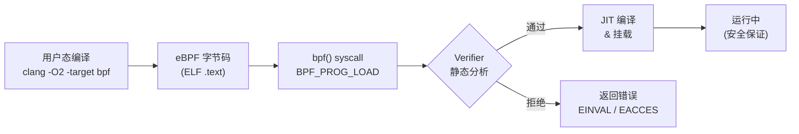
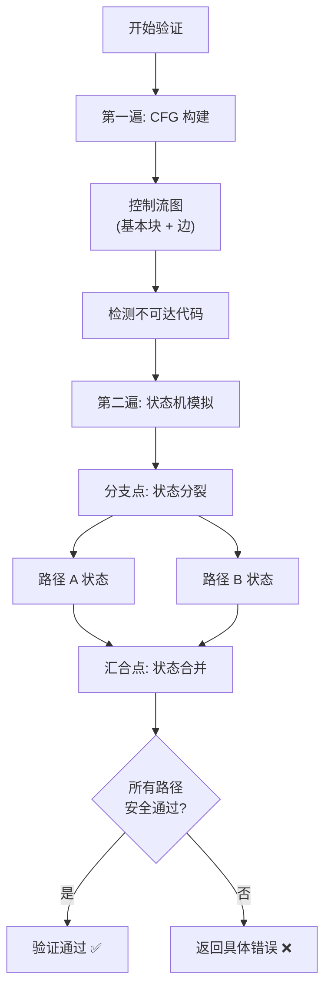
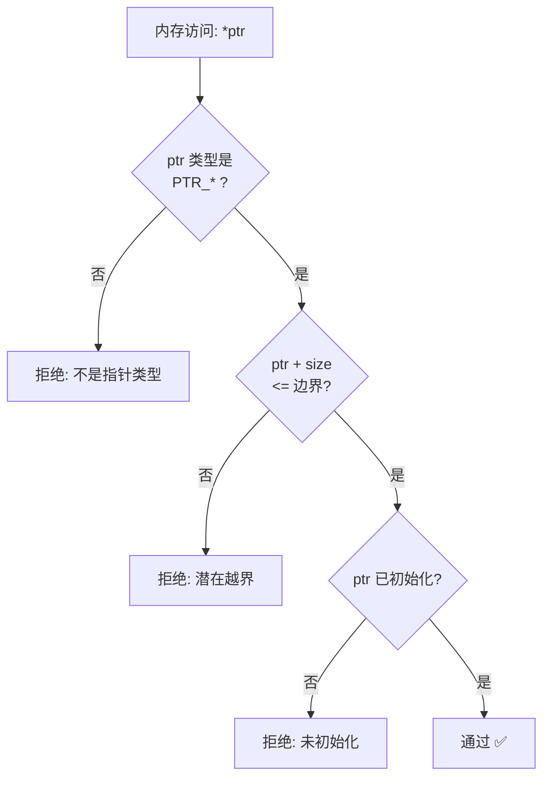

> [!info] eBPF 2026 深度探索系列
> 0. [[2026-04-08-ebpf-comprehensive-learning-roadmap|全栈学习路径总览]]
> 1. [[2026-04-08-ebpf-deep-dive-ch1-registers-and-instructions|第一章：寄存器与指令集]]
> 2. [[2026-04-08-ebpf-deep-dive-ch1-5-function-calls|第一.五章：四种函数调用与动态内存]]
> 3. **第一.六章：验证器 (Verifier) 的底层逻辑**
> 4. [[2026-04-08-ebpf-deep-dive-ch2-maps-and-communication|第二章：Map 机制与跨空间通信]]
> 5. [[2026-04-08-ebpf-deep-dive-ch2-5-kptr-and-ownership|第二.五章：kptr (内核指针) 与内存所有权模型]]
> 6. [[2026-04-08-ebpf-deep-dive-ch3-core-and-btf|第三章：CO-RE 与 BTF 的跨版本魔法]]
> 7. [[2026-04-08-ebpf-deep-dive-ch4-tracing-hooks-and-security|第四章：从 kprobe 到 LSM 的追踪全图景]]
> 8. [[2026-04-08-ebpf-deep-dive-ch7-5-uprobes-dynamic-tracing|第七.五章：uprobe 用户态动态追踪原理]]
> 9. [[2026-04-08-ebpf-deep-dive-ch7-6-bpftime-user-runtime|第七.六章：bpftime 与用户态 eBPF 加速]]
> 10. [[2026-04-08-ebpf-deep-dive-ch18-bpftime-injection-mastery|第七.七章：bpftime 自动化注入与全量监控实战]]
> 11. [[2026-04-08-ebpf-deep-dive-ch7-8-uprobe-selection-guide|第七.八章：uprobe 选型指南：内核态 vs 用户态]]
> 12. [[2026-04-08-ebpf-deep-dive-ch5-xdp-networking-performance|第五章：XDP 极致网络性能与全栈架构]]
> 13. [[2026-04-08-ebpf-deep-dive-ch6-tc-traffic-control|第六章：TC (Traffic Control) 流量调度艺术]]
> 14. [[2026-04-08-ebpf-deep-dive-ch7-security-lsm-enforcement|第七章：LSM BPF 从可观测到安全执法]]
> 15. [[2026-04-08-ebpf-deep-dive-ch8-advanced-tuning-and-profiling|第八章：进阶实战与内核调优]]
> 16. [[2026-04-08-ebpf-deep-dive-ch9-af-xdp-zero-copy|第九章：AF_XDP 零拷贝与用户态协议栈]]
> 17. [[2026-04-08-ebpf-deep-dive-ch10-sched-ext-custom-scheduler|第十章：sched_ext 自定义 CPU 调度器]]
> 18. [[2026-04-08-ebpf-deep-dive-ch11-bpf-iterators|第十一章：BPF Iterators 内核对象迭代器]]
> 19. [[2026-04-08-ebpf-deep-dive-ch12-kfuncs-evolution|第十二章：kfuncs 下一代内核交互标准]]
> 20. [[2026-04-08-ebpf-deep-dive-ch13-usdt-tracing|第十三章：USDT 用户态静态定义追踪]]
> 21. [[2026-04-08-ebpf-deep-dive-ch14-ai-llm-inference-monitoring|第十四章：AI 推理与大模型监控前沿]]
> 22. [[2026-04-08-ebpf-deep-dive-ch15-container-isolation|第十五章：无感增强容器隔离性]]
> 23. [[2026-04-08-ebpf-deep-dive-ch16-ebpf-and-wasm|第十六章：eBPF 与 WebAssembly (WASM) 的共生架构]]
> 24. [[2026-04-08-ebpf-deep-dive-ch17-storage-and-filesystem|第十七章：存储与文件系统加速]]
> 25. [[2026-04-08-ebpf-deep-dive-ch18-lifecycle-and-links|第十八章：生命周期管理与 BPF Links]]
> 26. [[2026-04-08-ebpf-deep-dive-ch19-atomic-updates-and-hot-upgrade|第十九章：程序的原子更新与蓝绿部署]]
> 27. [[2026-04-08-ebpf-deep-dive-ch25-5-stack-trace-correlation|第二五.五章：调用栈与业务请求的深度绑定]]
> 28. [[2026-04-08-ebpf-deep-dive-ch20-edge-iot-acceleration|第二十章：边缘计算与工业协议加速]]
> 29. [[2026-04-08-ebpf-deep-dive-ch21-debugging-and-verifier|第二十一章：调试实战与验证器 (Verifier) 诊断]]
> 30. [[2026-04-08-ebpf-deep-dive-ch22-testing-and-ci-cd|第二十二章：测试与持续集成 (CI/CD) 实战]]
> 31. [[2026-04-08-ebpf-deep-dive-ch23-security-and-permissions|第二十三章：权限细分与 BPF 安全沙箱]]
> 32. [[2026-04-08-ebpf-deep-dive-ch24-meta-monitoring-and-self-healing|第二十四章：eBPF 程序的内核自愈与监控]]
> 33. [[2026-04-08-ebpf-deep-dive-ch25-full-stack-observability|第二十五章：全栈可观测性与端到端追踪]]
> 34. [[2026-04-08-ebpf-deep-dive-ch26-network-security-high-level|第二十六章：网络安全防御的高阶实战]]
> 35. [[2026-04-08-ebpf-deep-dive-ch27-agent-engineering-architecture|第二十七章：工业级模块化 Agent 架构演进]]
> 36. [[2026-04-08-ebpf-deep-dive-ch28-offensive-and-defensive|第二十八章：攻防博弈与 Rootkit 防御]]
> 37. [[2026-04-08-ebpf-deep-dive-ch29-networking-deep-dive|第二十九章：网络应用深水区——负载均衡、Sockmap 与拥塞控制]]
> 38. [[2026-04-08-ebpf-deep-dive-ch30-hardware-offload|第三十章：硬件卸载与 SmartNIC 实战]]
> 39. [[2026-04-08-ebpf-deep-dive-ch31-signed-objects-and-security|第三十一章：内核原生签名与供应链安全]]
> 40. [[2026-04-08-ebpf-deep-dive-ch32-ebpf-for-windows|第三十二章：跨平台崛起——eBPF for Windows]]
> 41. [[2026-04-08-ebpf-deep-dive-ch32-5-macos-status|第三十二.五章：macOS 的特殊路径]]
> 42. [[2026-04-08-ebpf-deep-dive-ch33-serverless-optimization|第三十三章：Serverless 冷启动消除与动态计费]]
> 43. [[2026-04-08-ebpf-deep-dive-ch34-waf-and-rasp|第三十四章：Web 安全革命——内核态 WAF 与 RASP]]
> 44. [[2026-04-08-ebpf-deep-dive-ch35-npu-tpu-ai-hardware|第三十五章：AI 推理硬件 (NPU/TPU) 与硬件定义内核]]
> 45. [[2026-04-08-ebpf-deep-dive-ch36-dynamic-language-introspection|第三十六章：动态语言感知——业务对象的零代码提取]]
> 46. [[2026-04-08-ebpf-deep-dive-ch37-green-computing|第三十七章：绿色计算与能耗精准归因]]
> 47. [[2026-04-08-ebpf-deep-dive-ch38-ecosystem-and-career|第三十八章：2026 生态全景与工程师职业导航]]
> 48. [[2026-04-09-ebpf-deep-dive-ch39-rust-aya-framework|第三十九章：Rust eBPF 开发实战——Aya 框架与安全编程]]
> 49. [[2026-04-09-ebpf-deep-dive-ch40-network-protocols-deep-dive|第四十章：网络协议深度解析——TCP/UDP/QUIC 的 eBPF 视角]]
> 50. [[2026-04-09-ebpf-deep-dive-ch41-memory-safety-and-vulnerabilities|第四十一章：eBPF 内存安全与漏洞分析]]
> 51. [[2026-04-09-ebpf-deep-dive-ch42-service-mesh-integration|第四十二章：eBPF 与 Service Mesh 深度集成]]

---

## 1. 概述：内核的安全防火墙

验证器 (Verifier) 是 eBPF 的**核心竞争力**。它允许内核安全地运行来自用户态的"不可信代码"，同时保证：

1. **终止性 (Termination)**：程序一定会在有限步骤内退出，不会死循环
2. **内存安全 (Memory Safety)**：不会越界读/写内核内存
3. **类型安全 (Type Safety)**：不会将标量当指针解引用，不会传递错误类型的参数

没有验证器，eBPF 就不可能被合入 Linux 主线内核——内核社区绝不会允许任何可能引发内核崩溃的用户态代码。



### 1.1 历史演进

| 内核版本 | 里程碑 | 影响 |
| :--- | :--- | :--- |
| 3.18 (2015) | eBPF Verifier 诞生 | 仅支持基本寄存器追踪和简单边界检查 |
| 4.x | 扩展类型系统 | 引入 `PTR_TO_MAP_VALUE_OR_NULL` 等类型 |
| 5.2 | 指令上限提升 | 从 4096 提升到 100 万条 |
| 5.3 | 有界循环 (Bounded Loops) | 允许验证器能证明终止的循环 |
| 5.10+ | BTF-aware 验证 | 利用 BTF 进行跨内核版本的结构体验证 |
| 6.x | 所有权追踪 | `bpf_obj_new`/`bpf_obj_drop` 的引用计数验证 |
| 6.x | CFG-aware pruning | 基于控制流图的剪枝优化，减少路径爆炸 |

---

## 2. 验证流程总览

### 2.1 两遍扫描

Verifier 的验证过程分为**两遍 (Two Passes)**：

**第一遍 (First Pass)：构建控制流图 (CFG)**

- 遍历所有指令，记录跳转关系
- 检测不可达代码 (Dead Code)
- 确定前向引用的函数调用目标
- 基本错误检测（如无效指令、格式错误的立即数）

**第二遍 (Second Pass)：状态机模拟**

- 对 CFG 中的每条边（即每个基本块）进行寄存器状态模拟
- 在每个分支点分裂状态
- 在汇合点合并状态
- 检查内存访问的合法性、类型匹配等



### 2.2 状态合并 (State Merging)

当两条路径汇合时，Verifier 需要合并各自的寄存器状态。合并规则：

| 寄存器状态 - 路径 A | 寄存器状态 - 路径 B | 合并结果 |
| :--- | :--- | :--- |
| `SCALAR_VALUE [0,100]` | `SCALAR_VALUE [0,200]` | `SCALAR_VALUE [0,200]` (取并集) |
| `PTR_TO_CTX` | `PTR_TO_CTX` | `PTR_TO_CTX` (相同) |
| `PTR_TO_MAP_VALUE` | `SCALAR_VALUE` | `SCALAR_VALUE` (退化为标量) |
| `PTR_TO_MAP_VALUE_OR_NULL` | `PTR_TO_MAP_VALUE` | `PTR_TO_MAP_VALUE_OR_NULL` (保留未知性) |
| `NOT_INIT` | `SCALAR_VALUE` | `NOT_INIT` (未初始化不安全) |

> [!important] 为什么状态会"退化"？
> 当一个指针在某条路径上被修改为标量（或未初始化），合并后 Verifier 必须假设最坏情况——将两个状态合并为更保守的类型。这就是为什么在 `if/else` 分支中修改指针类型会导致 Verifier 报错。

---

## 3. 寄存器状态追踪

### 3.1 寄存器状态结构体

Verifier 为每个寄存器维护一个 `bpf_reg_state` 结构体（简化版）：

```c
// 内核源码: kernel/bpf/verifier.c
struct bpf_reg_state {
    enum bpf_reg_type type;    // 寄存器类型

    // 当 type == SCALAR_VALUE 时，追踪值的范围
    struct {
        u64 umin_value;        // 无符号最小值
        u64 umax_value;        // 无符号最大值
        s64 smin_value;        // 有符号最小值
        s64 smax_value;        // 有符号最大值
        u64 var_off;           // 位偏移（用于标记哪些位已知）
    };

    // 当 type 是指针类型时
    struct {
        u32 id;                // 对象 ID（用于追踪同一对象）
        u32 off;               // 偏移量
        u32 ref_obj_id;        // 引用的对象 ID
    };

    u32 live;                  // 寄存器是否活跃
    s32 subreg_def;            // 子寄存器定义（32-bit 子寄存器追踪）
    enum bpf_reg_liveness live_reg31; // 31-bit 寄存器活跃状态
};
```

### 3.2 完整类型枚举

| 类型 | 说明 | 能解引用？ | 能算术？ |
| :--- | :--- | :--- | :--- |
| `NOT_INIT` | 未初始化 | ❌ | ❌ |
| `SCALAR_VALUE` | 整数/常数 | ❌ | ✅ |
| `PTR_TO_CTX` | 指向 Context (如 `xdp_md`) | ✅ (有界) | ✅ (有界) |
| `PTR_TO_STACK` | 指向 eBPF 栈 | ✅ | ✅ (有界) |
| `PTR_TO_MAP_VALUE` | 指向 Map 值 | ✅ | ✅ (有界) |
| `PTR_TO_MAP_VALUE_OR_NULL` | 上述 + 可能为 NULL | ❌ (需先判空) | ❌ |
| `PTR_TO_PACKET` | 指向 XDP 包数据 | ✅ (有界) | ✅ (有界) |
| `PTR_TO_PACKET_END` | 指向包结束位置 | ❌ | ❌ |
| `PTR_TO_MEM` | 指向内核内存 (BTF) | ✅ | ✅ (有界) |
| `PTR_TO_BTF_ID` | 指向 BTF 类型对象 | ✅ | ✅ (受限) |
| `PTR_TO_BUF` | 指向缓冲区 | ✅ | ✅ (有界) |
| `CONST_PTR_TO_MAP` | 指向 Map 结构体 | ❌ | ❌ |
| `PTR_TO_TUNABLE` | 指向可调优参数 | ✅ | ❌ |

### 3.3 状态追踪示例

```c
SEC("xdp")
int example(struct xdp_md *ctx) {
    void *data     = (void *)(long)ctx->data;      // R1 = PTR_TO_CTX
    void *data_end = (void *)(long)ctx->data_end;  // R2 = PTR_TO_CTX (off=8)

    struct ethhdr *eth = data;
    // Verifier: eth = PTR_TO_PACKET, off=0, id=0
    // Verifier: 此时还不确定 eth+14 是否在合法范围内

    if ((void *)(eth + 1) > data_end)
        return XDP_DROP;
    // Verifier (true 分支): eth+14 <= data_end, 所以 eth+14 是安全的
    // Verifier (false 分支): 已 return, 不会继续分析

    u16 proto = eth->h_proto;
    // Verifier: mem access at eth+12 (4 bytes), checked: eth+14 <= data_end → OK ✅

    if (proto == bpf_htons(0x0800)) {
        struct iphdr *ip = (void *)(eth + 1);
        // Verifier: ip = PTR_TO_PACKET, off=14
        // Verifier: 已知 data_end 是安全边界
    }
    return XDP_PASS;
}
```

---

## 4. 内存安全检查

### 4.1 三层边界检查

Verifier 对每条内存访问指令执行三层检查：



**第一层：类型检查** — 目标操作数必须是指针类型（不能对 `SCALAR_VALUE` 解引用）

**第二层：边界检查** — `ptr + access_size` 必须小于等于已知的合法边界：
- 对于 `PTR_TO_PACKET`：边界是 `data_end`
- 对于 `PTR_TO_STACK`：边界是 `R10`（栈底）
- 对于 `PTR_TO_MAP_VALUE`：边界是 Map 值的大小

**第三层：初始化检查** — 指针必须已被赋值（不能使用 `NOT_INIT` 状态的寄存器）

### 4.2 指针算术限制

```c
// 合法：基于已知大小的偏移
struct ethhdr *eth = data;
struct iphdr *ip = (void *)(eth + sizeof(*eth));  // Verifier 知道 sizeof(ethhdr)=14

// 合法：边界检查后的固定偏移
if ((void *)(eth + 1) <= data_end) {
    __be16 *proto = (__be16 *)((void *)eth + 12);  // 12 + 2 = 14 <= 14 ✅
}

// 非法：运行时变量作为偏移
u32 offset = bpf_get_prandom_u32();
char *p = data + offset;  // ❌ Verifier 无法确定边界
*p = 'x';                  // ❌ 被拒绝

// 非法：对 ctx 指针进行算术
void *p = (void *)ctx + 100;  // ❌ 只有 Packet 和 Stack 指针允许算术
```

### 4.3 NULL 指针检查模式

这是最常见的 Verifier 编程模式：

```c
struct value *v = bpf_map_lookup_elem(&my_map, &key);
// 此时 v 的类型是 PTR_TO_MAP_VALUE_OR_NULL

// 必须先判空！
if (!v)
    return XDP_DROP;

// 判空后，v 的类型在 true 分支中"升级"为 PTR_TO_MAP_VALUE
// 现在可以安全地访问 v 的字段
v->counter += 1;  // ✅
```

---

## 5. 控制流验证

### 5.1 循环处理

从 Linux 5.3 开始，Verifier 支持**有界循环 (Bounded Loops)**。判定标准：

```c
// 合法：编译器已知循环上界
for (int i = 0; i < 64; i++) {  // 64 是编译时常量
    buf[i] = data[i];
}

// 合法：Verifier 能推断的范围
for (int i = 0; i < len && i < 64; i++) {  // 即使 len 是变量，i < 64 约束了上界
    buf[i] = data[i];
}

// 非法：无法确定上界
for (int i = 0; i < n; i++) {  // n 是运行时变量
    buf[i] = data[i];           // ❌ Verifier 无法证明终止性
}
```

### 5.2 路径爆炸问题

Verifier 的复杂度是**路径数的多项式**。过多的分支会导致路径组合爆炸：

```c
// 危险：5 层嵌套 if → 32 条路径
if (a) {
    if (b) {
        if (c) {
            if (d) {
                if (e) { ... }  // 2^5 = 32 条路径
            }
        }
    }
}
```

Verifier 有内置的路径数上限（约 100 万条路径）。超过后直接拒绝。

**解决方案：**

```c
// 方案 1：提前返回，减少嵌套
if (!a) return 0;
if (!b) return 0;
if (!c) return 0;
if (!d) return 0;
// 现在只剩 1 条路径
if (e) { ... }

// 方案 2：将复杂逻辑拆分到 BPF-to-BPF 子函数
// Verifier 对每个子函数独立验证，减少单函数的路径数
static int handle_complex_case(...) {
    // 复杂逻辑放在这里
}
```

---

## 6. 常见验证失败案例

### 6.1 案例一：NULL 解引用

```c
// ❌ 错误写法
struct value *v = bpf_map_lookup_elem(&map, &key);
v->counter += 1;  // Verifier: "register with unknown type" 或 "invalid mem access"

// ✅ 正确写法
struct value *v = bpf_map_lookup_elem(&map, &key);
if (!v) return 0;
v->counter += 1;
```

### 6.2 案例二：未初始化寄存器

```c
// ❌ 错误写法
u64 val;
// Verifier 不知道 val 的值
if (val > 100) { }  // "R? !read_ok"

// ✅ 正确写法
u64 val = 0;  // 必须初始化
if (val > 100) { }
```

### 6.3 案例三：越界访问

```c
// ❌ 错误写法
struct ethhdr *eth = data;
// 忘记边界检查
u16 proto = eth->h_proto;  // "invalid access to packet"

// ✅ 正确写法
struct ethhdr *eth = data;
if ((void *)(eth + 1) > data_end)
    return XDP_DROP;
u16 proto = eth->h_proto;
```

### 6.4 案例四：Helper 参数类型不匹配

```c
// ❌ 错误写法
u32 key = 0;
bpf_map_lookup_elem(&map, key);  // "R2 type=scalar expected=ptr"

// ✅ 正确写法
u32 key = 0;
bpf_map_lookup_elem(&map, &key);  // 传递指针
```

### 6.5 案例五：分支后寄存器状态丢失

```c
// ❌ 错误写法：在 else 分支中使用 if 分支中的指针
struct value *v = bpf_map_lookup_elem(&map, &key);
if (v) {
    v->field = 42;
} else {
    v->field = 0;  // ❌ Verifier: v 可能是 NULL（在 else 分支中）
}

// ✅ 正确写法
struct value *v = bpf_map_lookup_elem(&map, &key);
if (!v) return 0;
v->field = 42;  // 只在确认 v 非 NULL 后使用
```

---

## 7. 调试 Verifier 日志

### 7.1 获取日志的三种方式

**方式 1：bpftool（推荐）**

```bash
# 编译时启用 verbose 输出
# 在 C 代码中添加（或在 Makefile 中设置 CFLAGS）
// 或编译后直接 dump
bpftool prog dump xlated pinned /sys/fs/bpf/my_prog

# 带 verifier 日志重新加载
bpftool prog load xdp.o /sys/fs/bpf/my_prog \
    --verbose

# 查看 verifier 日志
bpftool prog dump xlated id 42
```

**方式 2：libbpf 日志**

```c
// 在代码中启用 libbpf 的详细日志
#define LIBBPF_DEBUG_LOG_LEVEL 2  // 0=off, 1=warn, 2=debug
#include <bpf/libbpf.h>

// 或通过环境变量
// LIBBPF_DEBUG_LOG_LEVEL=2 ./my_program
```

**方式 3：dmesg**

```bash
# Verifier 也会输出到内核日志
dmesg | grep bpf
```

### 7.2 日志格式解读

```
0: (bf) r1 = r10
1: (07) r1 += -8
2: (7b) *(u64 *)(r1 +0) = r2
3: (85) call bpf_map_lookup_elem#1
4: (bf) r4 = r0
5: (15) if r4 == 0x0 goto +2
6: (07) r4 += 1
7: (7b) *(u64 *)(r4 +0) = r6

VERIFIER LOG:
; R4_w=ptr_or_null_map_value(id=0,off=0,ks=4,vs=8)
; R6_w=scalar(id=0,umax=4294967295,var_off=(0x0; 0xffffffff))
7: (7b) R4_w=ptr_map_value()
; R4 pointer+offset is out of bounds
```

每行格式为 `指令偏移: (opcode) 助记符`。Verifier 日志中 `_w` 后缀表示**可写状态**（即该寄存器在当前指令之后的状态）。

### 7.3 错误速查表

| 错误信息 | 含义 | 解决方案 |
| :--- | :--- | :--- |
| `invalid mem access 'scalar'` | 对非指针值解引用 | 检查指针是否被正确赋值 |
| `unknown type` | 寄存器类型不确定 | 在使用前进行条件分支判空 |
| `R? !read_ok` | 寄存器未初始化 | 为变量提供初始值 |
| `pointer offset out of bounds` | 指针偏移越界 | 添加边界检查 `if (ptr + size > end)` |
| `math between ptr and scalar` | 对不可混合的类型做运算 | 检查是否在判空前使用了 Map 返回值 |
| `back-edge from insn X to Y` | 非法循环或跳转 | 确保循环有界或使用 `#pragma unroll` |
| `stack size XXX exceeds 512` | 栈溢出 | 使用 Per-CPU Map 或减少局部变量 |
| `misaligned access` | 非对齐内存访问 | 确保偏移量满足类型对齐要求 |
| `unbounded loop` | 循环无法证明终止 | 为循环添加可推断的上界 |
| `invalid indirect read from stack` | 从栈上读取未写入的区域 | 确保所有栈槽在使用前都已写入 |

---

## 8. Verifier 友好的编程模式

### 8.1 模式一：尽早判空

```c
// ✅ 推荐：在函数入口处立即判空
SEC("xdp")
int my_prog(struct xdp_md *ctx) {
    struct config *cfg = bpf_map_lookup_elem(&config_map, &key);
    if (!cfg) return XDP_PASS;
    // 后续代码中 cfg 一定是有效指针
    // Verifier 不再需要担心 NULL
}
```

### 8.2 模式二：边界检查先行

```c
// ✅ 推荐：先检查所有边界，再访问数据
struct ethhdr *eth = data;
struct iphdr *ip;
struct tcphdr *tcp;

if ((void *)(eth + 1) > data_end) goto drop;
ip = (void *)(eth + 1);
if ((void *)(ip + 1) > data_end) goto drop;
tcp = (void *)(ip + 1);
if ((void *)(tcp + 1) > data_end) goto drop;

// 现在可以自由访问 eth、ip、tcp 的所有字段
tcp->dest = bpf_htons(80);

drop:
    return XDP_DROP;
```

### 8.3 模式三：避免路径爆炸

```c
// ✅ 推荐：使用 early return 减少嵌套
SEC("tracepoint/syscalls/sys_enter_openat")
int trace_openat(struct trace_event_raw_sys_enter *ctx) {
    // 早期过滤，减少后续路径
    if (ctx->args[2] == 0) return 0;  // filename is NULL

    char filename[64];
    bpf_probe_read_user_str(filename, sizeof(filename), (void *)ctx->args[2]);

    // 简单的字符串过滤
    if (filename[0] != '/') return 0;

    // 复杂逻辑放在后面
    process_file(filename);
    return 0;
}
```

### 8.4 模式四：BPF-to-BPF 函数拆分

```c
// ✅ 推荐：将复杂逻辑拆分到子函数
// 每个子函数独立验证，路径数独立计算

// 子函数 1：解析 L2
static __always_inline int parse_l2(void *data, void *data_end, struct ethhdr **out) {
    // 5-10 条路径
}

// 子函数 2：解析 L3
static __always_inline int parse_l3(void *l3_data, void *data_end, struct iphdr **out) {
    // 5-10 条路径
}

// 子函数 3：解析 L4
static __always_inline int parse_l4(void *l4_data, void *data_end, struct tcphdr **out) {
    // 5-10 条路径
}

// 主函数：3 个子函数的路径数相乘远小于一个函数中的路径数
SEC("xdp")
int parse_all(struct xdp_md *ctx) {
    // 1 条路径
}
```

---

## 9. 2026 年 Verifier 的前沿演进

### 9.1 CFG-aware Pruning

传统的 Verifier 对所有路径独立分析。CFG-aware Pruning 通过分析控制流图的结构，识别**不可达路径**并在早期剪枝，大幅减少需要分析的实际路径数。


### 9.2 BTF-aware 验证

Verifier 利用 BTF (BPF Type Format) 信息进行更精确的类型检查：

```c
// Verifier 通过 BTF 知道 struct xdp_md 的确切布局
// 不需要硬编码偏移量
struct xdp_md *ctx;
void *data = (void *)(long)ctx->data;       // BTF: offset 0, size 8
void *data_end = (void *)(long)ctx->data_end; // BTF: offset 8, size 8
void *data_meta = (void *)(long)ctx->data_meta; // BTF: offset 16, size 8
```

### 9.3 所有权追踪

从 Linux 6.x 开始，Verifier 追踪 `bpf_obj_new` 分配的对象的所有权：

```c
struct node *n = bpf_obj_new(typeof(*n));  // 所有权: n
bpf_list_push_front(&head, &n->node);     // 所有权转移: head 拥有 n
// n 现在是 dangling pointer
n->value = 42;  // ❌ Verifier 拒绝: 使用已转移所有权的指针
```

---

## 10. 常见问题 FAQ

**Q1: Verifier 验证需要多长时间？**

简单程序（几百条指令）通常在 **1-5 毫秒** 内完成。复杂程序（嵌套循环、多分支）可能需要 **数百毫秒到数秒**。如果超过 5 秒，通常意味着存在路径爆炸问题——需要重构代码来减少分支嵌套。

**Q2: Verifier 日志中的 `_w` 和 `_r` 后缀是什么意思？**

`_w` 表示 "writable"（可写状态），即该指令**执行后**寄存器的状态。`_r` 表示 "readable"（可读状态），即该指令**执行前**寄存器的状态。例如 `R1_w=ptr_packet` 表示指令执行后 R1 是一个有效的包指针。

**Q3: 为什么有时候 Verifier 在老内核上通过、在新内核上拒绝？**

内核升级可能引入了更严格的验证规则。例如：
- Linux 5.3 开始要求循环有界
- Linux 6.x 开始要求 `bpf_obj_new` 的所有权必须正确释放
- 某些 Helper 函数的参数类型检查在新版本中更严格

使用 **libbpf 的 CO-RE (Compile Once - Run Everywhere)** 机制可以部分缓解这个问题。

**Q4: 如何绕过 "stack size exceeds 512" 限制？**

三种方案（按推荐顺序）：
1. **将大变量移到 Per-CPU Map**：`BPF_MAP_TYPE_PERCPU_ARRAY` 提供"虚拟大栈"
2. **减少同时存活的栈变量**：先处理完一个变量再声明下一个（C 作用域技巧）
3. **使用 `bpf_obj_new`**：在堆上分配，不受栈限制

**Q5: Verifier 能检测到数据竞争 (Data Race) 吗？**

不能直接检测。Verifier 是**静态分析器**，只分析单个程序的执行路径。但 Verifier 通过以下方式间接防止数据竞争：
- 要求 Map 访问使用 `__sync_fetch_and_add` 等原子操作
- 提供 `bpf_spin_lock` 用于 Map 内的互斥访问
- Per-CPU Map 天然避免了跨 CPU 的数据竞争
