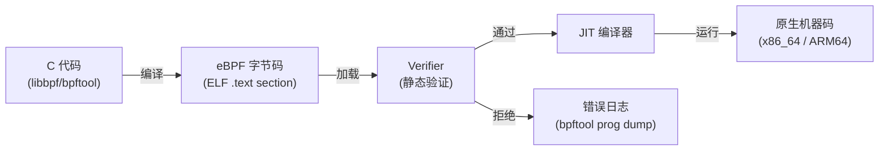
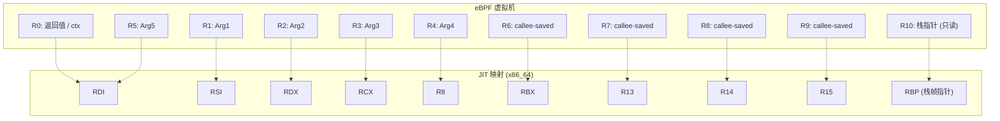
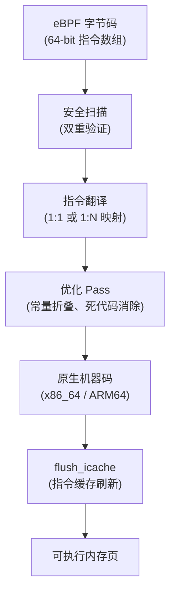

> [!info] eBPF 2026 深度探索系列
> 0. [[2026-04-08-ebpf-comprehensive-learning-roadmap|全栈学习路径总览]]
> 1. **第一章：寄存器与指令集**
> 2. [[2026-04-08-ebpf-deep-dive-ch1-5-function-calls|第一.五章：四种函数调用与动态内存]]
> 3. [[2026-04-08-ebpf-deep-dive-ch1-6-the-verifier|第一.六章：验证器 (Verifier) 的底层逻辑]]
> 4. [[2026-04-08-ebpf-deep-dive-ch2-maps-and-communication|第二章：Map 机制与跨空间通信]]
> 5. [[2026-04-08-ebpf-deep-dive-ch2-5-kptr-and-ownership|第二.五章：kptr (内核指针) 与内存所有权模型]]
> 6. [[2026-04-08-ebpf-deep-dive-ch3-core-and-btf|第三章：CO-RE 与 BTF 的跨版本魔法]]
> 7. [[2026-04-08-ebpf-deep-dive-ch4-tracing-hooks-and-security|第四章：从 kprobe 到 LSM 的追踪全图景]]
> 8. [[2026-04-08-ebpf-deep-dive-ch7-5-uprobes-dynamic-tracing|第七.五章：uprobe 用户态动态追踪原理]]
> 9. [[2026-04-08-ebpf-deep-dive-ch7-6-bpftime-user-runtime|第七.六章：bpftime 与用户态 eBPF 加速]]
> 10. [[2026-04-08-ebpf-deep-dive-ch18-bpftime-injection-mastery|第七.七章：bpftime 自动化注入与全量监控实战]]
> 11. [[2026-04-08-ebpf-deep-dive-ch7-8-uprobe-selection-guide|第七.八章：uprobe 选型指南：内核态 vs 用户态]]
> 12. [[2026-04-08-ebpf-deep-dive-ch5-xdp-networking-performance|第五章：XDP 极致网络性能与全栈架构]]
> 13. [[2026-04-08-ebpf-deep-dive-ch6-tc-traffic-control|第六章：TC (Traffic Control) 流量调度艺术]]
> 14. [[2026-04-08-ebpf-deep-dive-ch7-security-lsm-enforcement|第七章：LSM BPF 从可观测到安全执法]]
> 15. [[2026-04-08-ebpf-deep-dive-ch8-advanced-tuning-and-profiling|第八章：进阶实战与内核调优]]
> 16. [[2026-04-08-ebpf-deep-dive-ch9-af-xdp-zero-copy|第九章：AF_XDP 零拷贝与用户态协议栈]]
> 17. [[2026-04-08-ebpf-deep-dive-ch10-sched-ext-custom-scheduler|第十章：sched_ext 自定义 CPU 调度器]]
> 18. [[2026-04-08-ebpf-deep-dive-ch11-bpf-iterators|第十一章：BPF Iterators 内核对象迭代器]]
> 19. [[2026-04-08-ebpf-deep-dive-ch12-kfuncs-evolution|第十二章：kfuncs 下一代内核交互标准]]
> 20. [[2026-04-08-ebpf-deep-dive-ch13-usdt-tracing|第十三章：USDT 用户态静态定义追踪]]
> 21. [[2026-04-08-ebpf-deep-dive-ch14-ai-llm-inference-monitoring|第十四章：AI 推理与大模型监控前沿]]
> 22. [[2026-04-08-ebpf-deep-dive-ch15-container-isolation|第十五章：无感增强容器隔离性]]
> 23. [[2026-04-08-ebpf-deep-dive-ch16-ebpf-and-wasm|第十六章：eBPF 与 WebAssembly (WASM) 的共生架构]]
> 24. [[2026-04-08-ebpf-deep-dive-ch17-storage-and-filesystem|第十七章：存储与文件系统加速]]
> 25. [[2026-04-08-ebpf-deep-dive-ch18-lifecycle-and-links|第十八章：生命周期管理与 BPF Links]]
> 26. [[2026-04-08-ebpf-deep-dive-ch19-atomic-updates-and-hot-upgrade|第十九章：程序的原子更新与蓝绿部署]]
> 27. [[2026-04-08-ebpf-deep-dive-ch25-5-stack-trace-correlation|第二五.五章：调用栈与业务请求的深度绑定]]
> 28. [[2026-04-08-ebpf-deep-dive-ch20-edge-iot-acceleration|第二十章：边缘计算与工业协议加速]]
> 29. [[2026-04-08-ebpf-deep-dive-ch21-debugging-and-verifier|第二十一章：调试实战与验证器 (Verifier) 诊断]]
> 30. [[2026-04-08-ebpf-deep-dive-ch22-testing-and-ci-cd|第二十二章：测试与持续集成 (CI/CD) 实战]]
> 31. [[2026-04-08-ebpf-deep-dive-ch23-security-and-permissions|第二十三章：权限细分与 BPF 安全沙箱]]
> 32. [[2026-04-08-ebpf-deep-dive-ch24-meta-monitoring-and-self-healing|第二十四章：eBPF 程序的内核自愈与监控]]
> 33. [[2026-04-08-ebpf-deep-dive-ch25-full-stack-observability|第二十五章：全栈可观测性与端到端追踪]]
> 34. [[2026-04-08-ebpf-deep-dive-ch26-network-security-high-level|第二十六章：网络安全防御的高阶实战]]
> 35. [[2026-04-08-ebpf-deep-dive-ch27-agent-engineering-architecture|第二十七章：工业级模块化 Agent 架构演进]]
> 36. [[2026-04-08-ebpf-deep-dive-ch28-offensive-and-defensive|第二十八章：攻防博弈与 Rootkit 防御]]
> 37. [[2026-04-08-ebpf-deep-dive-ch29-networking-deep-dive|第二十九章：网络应用深水区——负载均衡、Sockmap 与拥塞控制]]
> 38. [[2026-04-08-ebpf-deep-dive-ch30-hardware-offload|第三十章：硬件卸载与 SmartNIC 实战]]
> 39. [[2026-04-08-ebpf-deep-dive-ch31-signed-objects-and-security|第三十一章：内核原生签名与供应链安全]]
> 40. [[2026-04-08-ebpf-deep-dive-ch32-ebpf-for-windows|第三十二章：跨平台崛起——eBPF for Windows]]
> 41. [[2026-04-08-ebpf-deep-dive-ch32-5-macos-status|第三十二.五章：macOS 的特殊路径]]
> 42. [[2026-04-08-ebpf-deep-dive-ch33-serverless-optimization|第三十三章：Serverless 冷启动消除与动态计费]]
> 43. [[2026-04-08-ebpf-deep-dive-ch34-waf-and-rasp|第三十四章：Web 安全革命——内核态 WAF 与 RASP]]
> 44. [[2026-04-08-ebpf-deep-dive-ch35-npu-tpu-ai-hardware|第三十五章：AI 推理硬件 (NPU/TPU) 与硬件定义内核]]
> 45. [[2026-04-08-ebpf-deep-dive-ch36-dynamic-language-introspection|第三十六章：动态语言感知——业务对象的零代码提取]]
> 46. [[2026-04-08-ebpf-deep-dive-ch37-green-computing|第三十七章：绿色计算与能耗精准归因]]
> 47. [[2026-04-08-ebpf-deep-dive-ch38-ecosystem-and-career|第三十八章：2026 生态全景与工程师职业导航]]
> 48. [[2026-04-09-ebpf-deep-dive-ch39-rust-aya-framework|第三十九章：Rust eBPF 开发实战——Aya 框架与安全编程]]
> 49. [[2026-04-09-ebpf-deep-dive-ch40-network-protocols-deep-dive|第四十章：网络协议深度解析——TCP/UDP/QUIC 的 eBPF 视角]]
> 50. [[2026-04-09-ebpf-deep-dive-ch41-memory-safety-and-vulnerabilities|第四十一章：eBPF 内存安全与漏洞分析]]
> 51. [[2026-04-09-ebpf-deep-dive-ch42-service-mesh-integration|第四十二章：eBPF 与 Service Mesh 深度集成]]

---

## 1. 概述：为什么需要理解 eBPF 的底层执行模型？

eBPF (Extended Berkeley Packet Filter) 是一个运行在 Linux 内核中的**寄存器虚拟机 (Register-based VM)**。与经典 BPF（基于 2 个累加器的栈机）完全不同，eBPF 采用了类似现代 CPU 的设计——10 个 64 位寄存器、定长指令、ALU 运算单元。

**为什么这个话题如此重要？**

1. **调试效率**：当你看到 Verifier 报错 `R1 type=ptr expected=scalar` 时，如果你不理解寄存器类型系统，就无法定位问题。
2. **性能优化**：eBPF 每一条指令都有开销。理解指令编码可以帮助你写出更少的指令、更快的程序。
3. **边界认知**：512 字节栈、5 个参数、100 万条指令——这些限制不是随意的，而是经过深思熟虑的工程权衡。理解它们的设计理由，才能在遇到瓶颈时找到正确的绕过方案。



上图展示了 eBPF 程序从 C 源码到原生执行的完整生命周期。本章聚焦的是中间的**字节码层**——即 eBPF 虚拟机的指令集架构 (ISA)。

---

## 2. eBPF 虚拟机架构

### 2.1 从经典 BPF 到 eBPF

| 特性 | 经典 BPF (cBPF) | eBPF |
| :--- | :--- | :--- |
| **架构** | 2-累加器栈机 (A + X) | 10-寄存器 RISC 机 |
| **寄存器** | 32-bit A, X, PC | 64-bit R0-R10 |
| **指令宽度** | 32-bit | 64-bit |
| **指令数** | ~30 条 | ~150+ 条 |
| **程序上限** | 4096 条指令 | 100 万条指令 |
| **辅助函数** | 极少 (~10) | 200+ (持续增长) |
| **应用场景** | 包过滤 (tcpdump) | 网络、安全、可观测、调度... |

经典 BPF 的 2 累加器模型导致编译器需要频繁地在累加器和内存之间搬运数据，产生大量冗余指令。eBPF 的 10 寄存器设计让编译器可以将中间值留在寄存器中，大幅减少内存访问次数。

### 2.2 寄存器详解

eBPF 拥有 **11 个 64 位通用寄存器**（R0-R10），每个都是 8 字节宽。它们各自有明确的角色分工：

| 寄存器 | 用途 | 调用前后行为 |
| :--- | :--- | :--- |
| **R0** | 返回值 / 隐式参数 | 函数返回时存放返回值；入口时存放 ctx 指针 |
| **R1** | 第 1 个参数 | 调用 Helper 时传递第 1 个参数；调用后 **caller-saved** |
| **R2** | 第 2 个参数 | 同上 |
| **R3** | 第 3 个参数 | 同上 |
| **R4** | 第 4 个参数 | 同上 |
| **R5** | 第 5 个参数 | 同上 |
| **R6-R9** | 被调用者保存 (callee-saved) | **调用 Helper 后值不变**，可用于跨调用保存临时值 |
| **R10** | 只读栈指针 (Frame Pointer) | 永远指向当前栈帧的栈底，**不可修改** |

#### 关键设计决策解读

**为什么 R6-R9 是 callee-saved？**

在内核开发中，当你调用一个辅助函数（如 `bpf_map_lookup_elem`）时，你可能需要保留某些中间计算结果。如果 R1-R5 在调用后会被覆盖，那你只能用栈来保存——但栈只有 512 字节。R6-R9 的 callee-saved 设计让编译器可以在寄存器中保存多达 4 个跨调用存活的值，大幅减少了栈压力。

**为什么 R10 是只读的？**

R10 始终指向当前栈帧的底部（最高地址）。如果允许修改 R10，程序可能通过 `R10 + N` 访问到栈帧之外的内存，造成内核栈溢出。只读设计让 Verifier 可以精确验证每条栈访问指令的合法性。

**为什么只有 5 个参数？**

这是一个跨架构兼容性的权衡：
- **x86_64 System V ABI**：前 6 个参数用寄存器传递 (RDI, RSI, RDX, RCX, R8)
- **ARM64 AAPCS64**：前 8 个参数用寄存器传递 (X0-X7)
- **RISC-V**：前 8 个参数用 a0-a7 传递

选择 5 个参数是所有主流架构的**最大公约数**。这样 JIT 编译器在翻译 eBPF 到原生指令时，不需要做栈传参（Stack Spilling），保证了跨架构的一致性能。



> [!tip] 实用提示
> 上图展示了 eBPF 寄存器到 x86_64 原生寄存器的 JIT 映射关系。注意 R0 和 R5 都映射到 RDI——因为它们不会同时被使用（R5 只在 Helper 调用前有效，R0 只在调用后有效）。

---

## 3. 指令集详解

### 3.1 指令编码格式

每一条 eBPF 指令都是固定 **64 位 (8 字节)** 长度。这种 RISC 风格的设计让指令解码极其简单高效：

```text
msb (bit 63)                                               lsb (bit 0)
+----------------+----------------+----------------+----------------+
|   imm (32bit)  |   off (16bit)  | src (4) | dst (4) | opcode (8)  |
+----------------+----------------+----------------+----------------+
```

| 字段 | 位数 | 说明 |
| :--- | :--- | :--- |
| **opcode** | 8 bit | 操作码，定义指令类别和具体操作 |
| **dst** | 4 bit | 目标寄存器索引 (0-10) |
| **src** | 4 bit | 源寄存器索引 (0-10) |
| **off** | 16 bit | 有符号偏移量（栈访问 / 相对跳转） |
| **imm** | 32 bit | 立即数（常量值） |

#### Opcode 编码结构

8 位 opcode 内部分为三个子字段：

```text
+---+---+---+---+---+---+---+---+
| 7 | 6 | 5 | 4 | 3 | 2 | 1 | 0 |
+---+---+---+---+---+---+---+---+
|  class  |  source   |   operation  |
+---+---+---+---+---+---+---+---+
```

- **bits [7:6] — 指令类别 (Instruction Class)**：
  - `00`：32-bit 操作 (BPF_LD, BPF_ST, etc.)
  - `01`：64-bit 操作 (BPF_ALU64, BPF_JMP64)
  - `10`：PC 相对跳转 (BPF_JMP)
  - `11`：末端指令 (BPF_JMP32)

### 3.2 指令分类

eBPF 指令可以分为以下几大类：

#### 3.2.1 ALU 运算指令 (算术逻辑单元)

| 指令 | 含义 | 示例 |
| :--- | :--- | :--- |
| `BPF_ADD` | 加法 | `BPF_ALU64_REG(BPF_ADD, R2, R3)` → `R2 += R3` |
| `BPF_SUB` | 减法 | `R2 -= R3` |
| `BPF_MUL` | 乘法 | `R2 *= R3` |
| `BPF_DIV` | 除法 | `R2 /= R3` |
| `BPF_OR` | 按位或 | `R2 \|= R3` |
| `BPF_AND` | 按位与 | `R2 &= R3` |
| `BPF_LSH` | 左移 | `R2 <<= R3` |
| `BPF_RSH` | 右移 | `R2 >>= R3` |
| `BPF_NEG` | 取反 | `R2 = -R2` |
| `BPF_MOD` | 取模 | `R2 %= R3` |
| `BPF_XOR` | 按位异或 | `R2 ^= R3` |
| `BPF_ARSH` | 算术右移 | `R2 >>= R3` (保留符号位) |
| `BPF_END` | 字节序转换 | `bswap16(R2)` / `bswap32(R2)` / `bswap64(R2)` |

每条 ALU 指令都区分 **寄存器版** (`_REG`，源操作数是寄存器) 和 **立即数版** (`_IMM`，源操作数是 `imm` 字段)：

```c
// 寄存器版：R2 += R3
BPF_ALU64_REG(BPF_ADD, BPF_REG_2, BPF_REG_3)

// 立即数版：R2 += 10
BPF_ALU64_IMM(BPF_ADD, BPF_REG_2, 10)
```

> [!warning] 32-bit vs 64-bit 的区别
> `BPF_ALU` 系列操作 32-bit 值，会**自动将结果零扩展到 64-bit**。`BPF_ALU64` 操作 64-bit 值。混用是 Verifier 报错的常见原因——比如对一个 64-bit 指针执行 32-bit 移位会丢失高位。

#### 3.2.2 内存访问指令

eBPF 只支持**寄存器到内存**的直接寻址模式：`[base_reg + offset]`。

```c
// 从 R1 偏移 8 字节处加载 4 字节到 R0
BPF_LDX_MEM(BPF_W, BPF_REG_0, BPF_REG_1, 8)

// 将 R0 的 8 字节存储到 [R10 - 16]
BPF_STX_MEM(BPF_DW, BPF_REG_10, BPF_REG_0, -16)

// 存储立即数到栈
BPF_ST_MEM(BPF_W, BPF_REG_10, -4, 0x12345678)
```

| 指令 | 含义 | 说明 |
| :--- | :--- | :--- |
| `BPF_LDX` | Load Memory | 从内存加载到寄存器 |
| `BPF_STX` | Store Memory (register) | 将寄存器值存储到内存 |
| `BPF_ST` | Store Memory (immediate) | 将立即数存储到内存 |

内存大小后缀：

| 后缀 | 大小 | C 类型 |
| :--- | :--- | :--- |
| `BPF_B` | 1 字节 | `u8` |
| `BPF_H` | 2 字节 | `u16` |
| `BPF_W` | 4 字节 | `u32` |
| `BPF_DW` | 8 字节 | `u64` |

#### 3.2.3 跳转指令

```c
// 无条件跳转 (向前跳 5 条)
BPF_JMP_IMM(BPF_JA, 0, 0, 5)

// 条件跳转：如果 R1 == R2 则跳过 2 条
BPF_JMP_REG(BPF_JEQ, BPF_REG_1, BPF_REG_2, 2)

// 条件跳转：如果 R1 < 10 则跳到 label
BPF_JMP_IMM(BPF_JLT, BPF_REG_1, 10, -1)  // -1 表示跳到下一条指令
```

| 条件码 | 含义 |
| :--- | :--- |
| `BPF_JA` | 无条件跳转 (Always) |
| `BPF_JEQ` | 等于 (Equal) |
| `BPF_JGT` | 大于 (Unsigned Greater Than) |
| `BPF_JGE` | 大于等于 (Unsigned Greater or Equal) |
| `BPF_JSET` | 位与不为零 (Any bits set) |
| `BPF_JNE` | 不等于 (Not Equal) |
| `BPF_JSGT` | 有符号大于 (Signed Greater Than) |
| `BPF_JSGE` | 有符号大于等于 |
| `BPF_JLT` | 无符号小于 |
| `BPF_JLE` | 无符号小于等于 |
| `BPF_JSLT` | 有符号小于 |
| `BPF_JSLE` | 有符号小于等于 |

#### 3.2.4 特殊指令

```c
// 调用 Helper 函数
BPF_EMIT_CALL(BPF_FUNC_map_lookup_elem)

// 返回值
BPF_EXIT_INSN()

// 终端打印（调试用）
BPF_EMIT_CALL(BPF_FUNC_trace_printk)
```

| 指令 | 含义 | 说明 |
| :--- | :--- | :--- |
| `BPF_CALL` | 调用辅助函数 | imm 字段存放 Helper 函数编号 |
| `BPF_EXIT` | 程序返回 | 返回 R0 中的值 |
| `BPF_LD_ABS/HDR` | 包数据加载 | 仅 cBPF 兼容模式，eBPF 中已废弃 |

### 3.3 查看实际字节码

使用 `bpftool` 可以查看编译后的字节码：

```bash
# 编译 eBPF 程序
clang -O2 -target bpf -c prog.c -o prog.o

# 反汇编查看字节码
bpftool prog dump xlated pinned /sys/fs/bpf/prog

# 输出示例：
# 0: (18) r1 = 0x00000000ffffc900
# 2: (61) r1 = *(u32 *)(r1 +0)
# 3: (67) r1 <<= 32
# 4: (77) r1 >>= 32
```

每行格式为 `偏移: (opcode) 指令`。括号中的数字是 opcode 的十进制值，后面是等价的汇编助记符。

---

## 4. 核心限制与设计哲学

eBPF 的限制不是缺陷，而是**在安全性和灵活性之间的精确权衡**。理解每个限制的设计理由，才能在遇到瓶颈时找到正确的解决方案。

### 4.1 栈空间限制：512 字节

eBPF 程序的局部栈空间被硬性限制在 **512 字节** 以内。

**为什么是 512 字节？**

eBPF 运行在内核上下文中，共享内核的调用栈。Linux 内核栈大小通常为 **8KB**（部分配置为 16KB）。内核本身已经使用了大量栈空间（中断处理、系统调用链等）。如果允许 eBPF 程序使用过大的栈，当调用链已经很深时，eBPF 程序的栈需求可能直接导致**内核栈溢出 → 系统崩溃**。

512 字节的限制确保了 eBPF 程序在任何调用深度下都不会成为内核栈溢出的元凶。

**绕过方案：**

```c
// 方案 1：Per-CPU Map 作为"虚拟栈"
struct {
    __uint(type, BPF_MAP_TYPE_PERCPU_ARRAY);
    __uint(max_entries, 1);
    __type(key, u32);
    __type(value, struct large_buffer);  // 可以是数 KB
} vstack SEC(".maps");

SEC("kprobe/do_sys_open")
int trace_open(struct pt_regs *ctx) {
    u32 key = 0;
    // 每个 CPU 独享一份 large_buffer，无锁竞争
    struct large_buffer *buf = bpf_map_lookup_elem(&vstack, &key);
    if (!buf) return 0;
    // 现在你可以使用 buf 中的大块空间了
    buf->data[4095] = 42;  // 远超 512 字节限制
    return 0;
}
```

```c
// 方案 2：BPF 局部 kptr（2026 年推荐）
// 利用 bpf_obj_new 在堆上分配内存
SEC("kprobe/vfs_read")
int trace_read(struct pt_regs *ctx) {
    // 堆分配，不受栈限制
    struct my_data *d = bpf_obj_new(typeof(*d));
    if (!d) return 0;
    // ... 使用 d ...
    bpf_obj_drop(d);  // 必须释放，否则泄漏
    return 0;
}
```

| 方案 | 优点 | 缺点 |
| :--- | :--- | :--- |
| Per-CPU Map | 简单、无 GC 开销 | 需要预先知道大小 |
| `bpf_obj_new` | 灵活动态分配 | 需要手动管理生命周期 |

### 4.2 参数限制：5 个

已在前文解释——跨架构兼容性的权衡。当你需要传递超过 5 个参数时：

```c
// 定义参数结构体
struct params {
    u64 field1;
    u32 field2;
    char name[16];
};

// 通过指针传递（只占 1 个寄存器）
long ret = bpf_helper(&my_params);
```

### 4.3 指令数限制：100 万条

从 Linux 5.2 开始，eBPF 程序的指令上限从 4096 提升到了 **100 万条**。

**为什么还需要限制？**

- **Verifier 性能**：Verifier 的时间复杂度与指令数大致成正比。无限指令会导致加载时间不可接受。
- **JIT 编译时间**：将 100 万条字节码编译为原生机器码需要数百毫秒。
- **内核安全**：防止恶意程序通过超长程序进行 DoS 攻击。

### 4.4 无循环限制（已部分解除）

早期 eBPF 完全不允许循环。从 Linux 5.3 开始，支持了**有界循环 (Bounded Loops)**：

```c
// 2026 年合法：有界循环（Verifier 能推断循环次数上限）
for (int i = 0; i < 64; i++) {
    // Verifier 会展开验证每一步
    buf[i] = data[i];
}

// 非法：无界循环
for (int i = 0; i < n; i++) {  // n 是运行时变量，Verifier 无法确定上限
    buf[i] = data[i];           // Verifier 拒绝！
}
```

> [!warning] 有界循环的工程代价
> 虽然有界循环合法，但 Verifier 需要对循环体进行**路径爆炸分析**。一个 64 次的循环，如果内部有 2 个分支，Verifier 需要分析 $2^{64}$ 条路径——当然实际中 Verifier 会对路径数做上限裁剪，但复杂循环仍然可能导致验证失败或极慢的加载时间。

### 4.5 无指针算术限制

eBPF 不允许对指针执行任意的算术运算，只能进行**受限的偏移量计算**：

```c
// 合法：已知大小的偏移
ptr += sizeof(struct ethhdr);   // OK，编译时已知
ptr = base + offsetof(struct iphdr, protocol);  // OK

// 非法：运行时值作为偏移
ptr += runtime_value;  // Verifier 拒绝！
```

这个限制防止了越界内存访问。Verifier 需要在编译时验证每条内存访问都在合法范围内。

---

## 5. 与内核的交互模型

### 5.1 Context：eBPF 程序的输入

每个 eBPF 程序类型都有一个特定的 Context 结构体作为输入参数（通过 R1 传递）：

| 程序类型 | Context | 说明 |
| :--- | :--- | :--- |
| XDP | `struct xdp_md` | 包含 data/data_end/data_meta 指针 |
| kprobe | `struct pt_regs` | 内核寄存器快照 |
| tc | `struct __sk_buff` | Socket Buffer 的只读视图 |
| tracepoint | 各类型 trace_event | 事件参数 |
| cgroup/skb | `struct __sk_buff` | 同 tc |
| perf_event | `struct bpf_perf_event_data` | 采样数据 |

```c
// XDP 程序通过 Context 访问原始包数据
SEC("xdp")
int parse_packet(struct xdp_md *ctx) {
    void *data = (void *)(long)ctx->data;      // 包起始
    void *data_end = (void *)(long)ctx->data_end;  // 包结束

    struct ethhdr *eth = data;
    // 必须检查边界！否则 Verifier 拒绝
    if ((void *)(eth + 1) > data_end)
        return XDP_DROP;

    return XDP_PASS;
}
```

> [!important] 边界检查是强制的
> Verifier 要求每条内存访问指令都必须有对应的边界检查。`if ((void *)(ptr + size) > data_end) return;` 是最常见的模式。忘记边界检查是 eBPF 新手最容易犯的错误。

### 5.2 Helper 函数调用

Helper 函数是 eBPF 与内核交互的主要方式。调用约定：

1. 参数通过 R1-R5 传递
2. 函数编号放在 `imm` 字段
3. 返回值放在 R0
4. R6-R9 在调用后保持不变

```c
// bpf_map_lookup_elem 的调用约定：
// R1 = map_fd (通过 BPF_CALL 中的 imm 映射)
// R2 = key 指针
// 返回值 R0 = value 指针 (或 NULL)
void *value = bpf_map_lookup_elem(&my_map, &key);
```

### 5.3 Map 访问

Map 是 eBPF 程序的持久化存储。所有 Map 操作都通过 Helper 函数完成：

```c
// 查找
struct value *v = bpf_map_lookup_elem(&my_hash, &key);

// 更新
bpf_map_update_elem(&my_hash, &key, &value, BPF_ANY);

// 删除
bpf_map_delete_elem(&my_hash, &key);
```

---

## 6. JIT 编译原理

### 6.1 为什么要 JIT？

解释执行 eBPF 字节码的性能约为原生代码的 1/10。JIT (Just-In-Time) 编译器将字节码翻译为 CPU 的原生机器码，消除了解释器开销。

### 6.2 JIT 编译流程



### 6.3 性能对比

| 执行模式 | 性能 (相对值) | 适用场景 |
| :--- | :--- | :--- |
| 解释执行 | 1x | 内核未启用 JIT 时 |
| JIT 编译 | ~10x | 生产环境（默认启用） |
| 硬件卸载 | ~100x+ | SmartNIC / FPGA |

### 6.4 JIT 调试

```bash
# 查看编译后的原生指令
bpftool prog dump jited pinned /sys/fs/bpf/prog

# 查看 JIT 统计
bpftool prog show

# 启用 JIT 即时编译器（默认已启用）
echo 1 > /proc/sys/net/core/bpf_jit_enable
```

---

## 7. 代码实战：手动编写 eBPF 汇编

以下示例展示了如何用原始 eBPF 汇编指令编写一个简单的包过滤程序。虽然实际开发中我们用 C + libbpf，但理解汇编有助于调试 Verifier 错误。

```c
// 文件: asm_example.c
// 这个程序用 BPF_ASM 宏直接编写 eBPF 汇编指令

#include <linux/bpf.h>
#include "bpf/bpf_helpers.h"

SEC("socket")
int bpf_asm_filter(struct __sk_buff *skb)
{
    // 手动编写 eBPF 汇编
    // 读取 IP 头中的 protocol 字段
    asm volatile(
        // 加载 skb->data 指针到 R0
        "r0 = *(u32 *)(r1 + %[offsetof_data]);"
        // 加载 skb->data_end 到 R1
        "r1 = *(u32 *)(r1 + %[offsetof_data_end]);"
        // 检查以太网头是否越界 (14 字节)
        "if r0 + 14 > r1 goto %l[drop];"
        // 读取以太网协议类型 (偏移 12)
        "r2 = *(u16 *)(r0 + 12);"
        // 检查是否为 IPv4 (0x0800, 注意网络字节序)
        "if r2 != 0x0008 goto %l[drop];"
        // 读取 IP 协议字段 (以太网头 14 + IP 协议偏移 9)
        "r3 = *(u8 *)(r0 + 23);"
        // 如果是 TCP (6)，放行
        "if r3 == 6 goto %l[pass];"
        // 如果是 UDP (17)，放行
        "if r3 == 17 goto %l[pass];"
        // 其他协议，丢弃
    "%l[drop]:"
        "r0 = 0;"
        "goto %l[out];"
    "%l[pass]:"
        "r0 = -1;"  // -1 表示放行 (SOCKET_FILTER 约定)
    "%l[out]:"
        :
        : [offsetof_data] "i"(offsetof(struct __sk_buff, data)),
          [offsetof_data_end] "i"(offsetof(struct __sk_buff, data_end))
        : "r0", "r1", "r2", "r3", "memory"
    );
    return 0;  // return value from r0 is used
}

char _license[] SEC("license") = "GPL";
```

> [!tip] 实际开发建议
> 虽然可以用内联汇编编写 eBPF 程序，但在 2026 年，几乎所有生产级 eBPF 程序都用 C + libbpf 编写。汇编主要用于：
> 1. 调试 Verifier 错误时对照字节码
> 2. 极端性能敏感场景下的手动优化
> 3. 编写 eBPF 教学工具

---

## 8. 性能优化技巧

### 8.1 减少内存访问

```c
// 低效：每次循环都从 Map 读取配置
for (int i = 0; i < n; i++) {
    struct config *cfg = bpf_map_lookup_elem(&config_map, &key);
    if (cfg && cfg->enabled)  // 两次 Map 查找！
        process(i, cfg->threshold);
}

// 高效：缓存到 callee-saved 寄存器
struct config *cfg = bpf_map_lookup_elem(&config_map, &key);
if (!cfg) return 0;
// 编译器会将 cfg 保持在 R6-R9 中，避免重复查找
for (int i = 0; i < n; i++) {
    if (cfg->enabled)
        process(i, cfg->threshold);
}
```

### 8.2 利用 BPF_END 进行字节序转换

```c
// 网络字节序 (big-endian) 到主机字节序的转换
u16 eth_type = bpf_ntohs(eth->h_proto);   // 编译为 BPF_END(16)
u32 ip_addr = bpf_ntohl(ip->saddr);       // 编译为 BPF_END(32)
```

### 8.3 避免不必要的边界检查

```c
// Verifier 足够聪明，一次检查可以覆盖后续多次访问
void *data = (void *)(long)ctx->data;
void *data_end = (void *)(long)ctx->data_end;

struct ethhdr *eth = data;
if ((void *)(eth + 1) > data_end)  // 这一次检查就够了
    return XDP_DROP;

struct iphdr *ip = (void *)(eth + 1);
// 不需要再次检查，Verifier 知道 eth+1 <= data_end
// 而 ip = eth + 14 < eth + sizeof(*eth) <= data_end
```

---

## 9. 常见问题 FAQ

**Q1: eBPF 程序能在用户态运行吗？**

可以。通过 [ubpf](https://github.com/iovisor/ubpf) 或 [bpftime](https://github.com/eunomia-bpf/bpftime) 等用户态运行时，eBPF 字节码可以在用户态解释执行或 JIT 编译。这也是 [第七.六章](/2026-04-08-ebpf-deep-dive-ch7-6-bpftime-user-runtime) 的主题。

**Q2: 为什么 eBPF 没有浮点运算指令？**

这是一个刻意的设计选择。浮点运算的精度行为在不同架构间不一致（x87 vs SSE vs ARM NEON），而 eBPF 的核心价值在于**跨内核版本的确定性执行**。如果引入浮点，同一程序在不同硬件上可能产生不同结果，破坏了 eBPF 的可移植性保证。2026 年的解决方案是通过 Helper 函数将浮点运算委托给用户态处理。

**Q3: R0 为什么既是返回值又是隐式参数？**

这取决于程序类型。对于程序入口函数，R0 的初始值是未定义的（Verifier 会确保你不会在赋值前使用它）。对于 Helper 函数调用，R0 存放返回值。在某些程序类型（如 cgroup/skb）中，R0 的初始值可能被设为特定的返回码（如 0 表示拒绝、1 表示放行）。

**Q4: 如何查看某个 Helper 函数的编号？**

```bash
# 列出所有可用的 Helper 函数及其编号
bpftool feature probe | grep helpers

# 或者在内核源码中查看
grep -r "BPF_FUNC_.*=" include/uapi/linux/bpf.h
```

**Q5: eBPF 的指令集未来会扩展吗？**

是的。近年来已新增了多个指令扩展：
- **BPF_JMP32** (Linux 5.1)：32-bit 子寄存器跳转
- **BPF_JA** 无条件跳转的 32-bit off 扩展
- **BPF_MOVSX** (Linux 6.x)：有符号扩展加载

这些扩展通过在 opcode 中使用新的 class 位实现，完全向后兼容。
