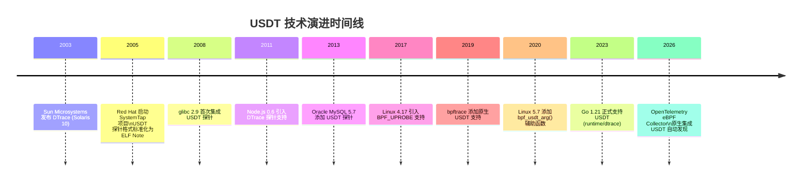
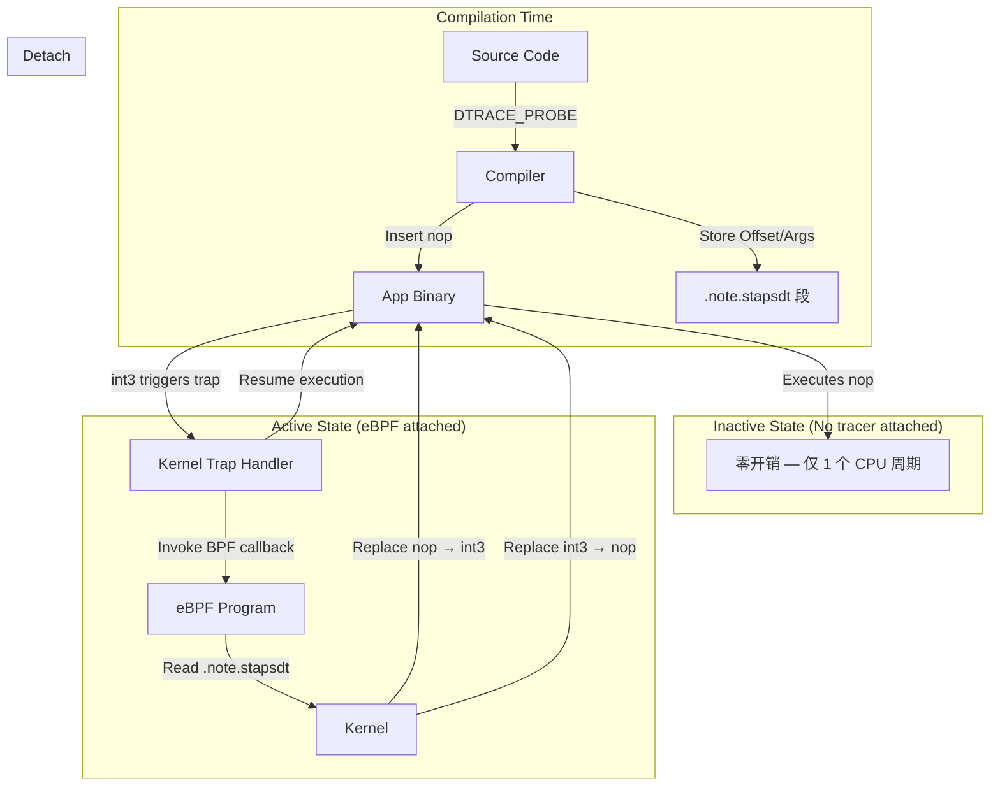
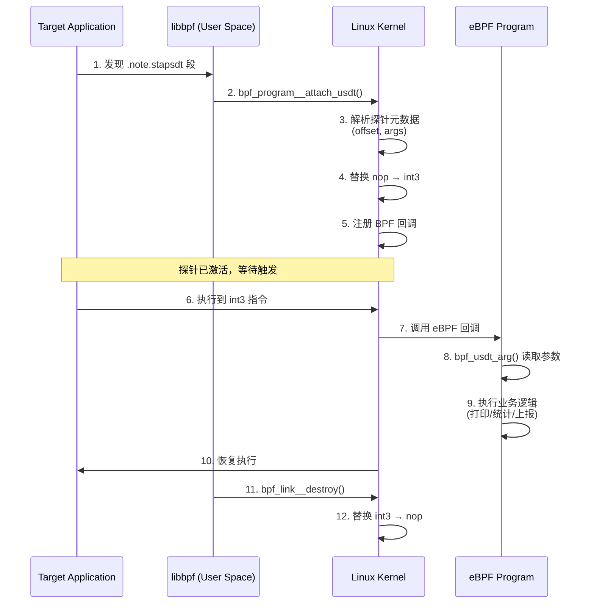
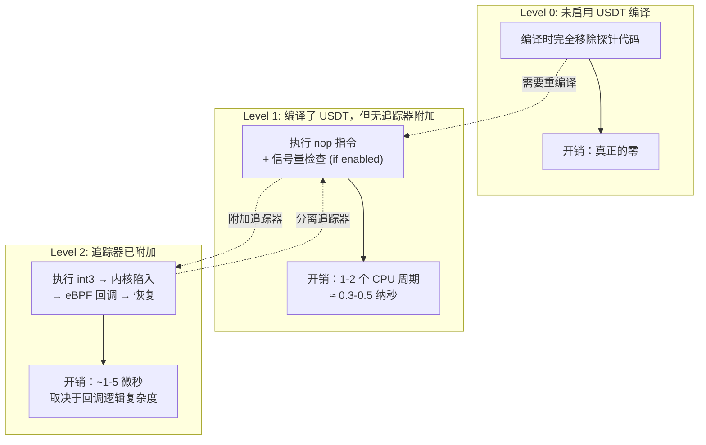

> [!info] eBPF 2026 深度探索系列
> 0. [[2026-04-08-ebpf-comprehensive-learning-roadmap|全栈学习路径总览]]
> 1. [[2026-04-08-ebpf-deep-dive-ch1-registers-and-instructions|第一章：寄存器与指令集]]
> 2. [[2026-04-08-ebpf-deep-dive-ch1-5-function-calls|第一.五章：四种函数调用与动态内存]]
> 3. [[2026-04-08-ebpf-deep-dive-ch1-6-the-verifier|第一.六章：验证器 (Verifier) 的底层逻辑]]
> 4. [[2026-04-08-ebpf-deep-dive-ch2-maps-and-communication|第二章：Map 机制与跨空间通信]]
> 5. [[2026-04-08-ebpf-deep-dive-ch2-5-kptr-and-ownership|第二.五章：kptr (内核指针) 与内存所有权模型]]
> 6. [[2026-04-08-ebpf-deep-dive-ch3-core-and-btf|第三章：CO-RE 与 BTF 的跨版本魔法]]
> 7. [[2026-04-08-ebpf-deep-dive-ch4-tracing-hooks-and-security|第四章：从 kprobe 到 LSM 的追踪全图景]]
> 8. [[2026-04-08-ebpf-deep-dive-ch7-5-uprobes-dynamic-tracing|第七.五章：uprobe 用户态动态追踪原理]]
> 9. [[2026-04-08-ebpf-deep-dive-ch7-6-bpftime-user-runtime|第七.六章：bpftime 与用户态 eBPF 加速]]
> 10. [[2026-04-08-ebpf-deep-dive-ch18-bpftime-injection-mastery|第七.七章：bpftime 自动化注入与全量监控实战]]
> 11. [[2026-04-08-ebpf-deep-dive-ch7-8-uprobe-selection-guide|第七.八章：uprobe 选型指南：内核态 vs 用户态]]
> 12. [[2026-04-08-ebpf-deep-dive-ch5-xdp-networking-performance|第五章：XDP 极致网络性能与全栈架构]]
> 13. [[2026-04-08-ebpf-deep-dive-ch6-tc-traffic-control|第六章：TC (Traffic Control) 流量调度艺术]]
> 14. [[2026-04-08-ebpf-deep-dive-ch7-security-lsm-enforcement|第七章：LSM BPF 从可观测到安全执法]]
> 15. [[2026-04-08-ebpf-deep-dive-ch8-advanced-tuning-and-profiling|第八章：进阶实战与内核调优]]
> 16. [[2026-04-08-ebpf-deep-dive-ch9-af-xdp-zero-copy|第九章：AF_XDP 零拷贝与用户态协议栈]]
> 17. [[2026-04-08-ebpf-deep-dive-ch10-sched-ext-custom-scheduler|第十章：sched_ext 自定义 CPU 调度器]]
> 18. [[2026-04-08-ebpf-deep-dive-ch11-bpf-iterators|第十一章：BPF Iterators 内核对象迭代器]]
> 19. [[2026-04-08-ebpf-deep-dive-ch12-kfuncs-evolution|第十二章：kfuncs 下一代内核交互标准]]
> 20. **第十三章：USDT 用户态静态定义追踪**
> 21. [[2026-04-08-ebpf-deep-dive-ch14-ai-llm-inference-monitoring|第十四章：AI 推理与大模型监控前沿]]
> 22. [[2026-04-08-ebpf-deep-dive-ch15-container-isolation|第十五章：无感增强容器隔离性]]
> 23. [[2026-04-08-ebpf-deep-dive-ch16-ebpf-and-wasm|第十六章：eBPF 与 WebAssembly (WASM) 的共生架构]]
> 24. [[2026-04-08-ebpf-deep-dive-ch17-storage-and-filesystem|第十七章：存储与文件系统加速]]
> 25. [[2026-04-08-ebpf-deep-dive-ch18-lifecycle-and-links|第十八章：生命周期管理与 BPF Links]]
> 26. [[2026-04-08-ebpf-deep-dive-ch19-atomic-updates-and-hot-upgrade|第十九章：程序的原子更新与蓝绿部署]]
> 27. [[2026-04-08-ebpf-deep-dive-ch25-5-stack-trace-correlation|第二五.五章：调用栈与业务请求的深度绑定]]
> 28. [[2026-04-08-ebpf-deep-dive-ch20-edge-iot-acceleration|第二十章：边缘计算与工业协议加速]]
> 29. [[2026-04-08-ebpf-deep-dive-ch21-debugging-and-verifier|第二十一章：调试实战与验证器 (Verifier) 诊断]]
> 30. [[2026-04-08-ebpf-deep-dive-ch22-testing-and-ci-cd|第二十二章：测试与持续集成 (CI/CD) 实战]]
> 31. [[2026-04-08-ebpf-deep-dive-ch23-security-and-permissions|第二十三章：权限细分与 BPF 安全沙箱]]
> 32. [[2026-04-08-ebpf-deep-dive-ch24-meta-monitoring-and-self-healing|第二十四章：eBPF 程序的内核自愈与监控]]
> 33. [[2026-04-08-ebpf-deep-dive-ch25-full-stack-observability|第二十五章：全栈可观测性与端到端追踪]]
> 34. [[2026-04-08-ebpf-deep-dive-ch26-network-security-high-level|第二十六章：网络安全防御的高阶实战]]
> 35. [[2026-04-08-ebpf-deep-dive-ch27-agent-engineering-architecture|第二十七章：工业级模块化 Agent 架构演进]]
> 36. [[2026-04-08-ebpf-deep-dive-ch28-offensive-and-defensive|第二十八章：攻防博弈与 Rootkit 防御]]
> 37. [[2026-04-08-ebpf-deep-dive-ch29-networking-deep-dive|第二十九章：网络应用深水区——负载均衡、Sockmap 与拥塞控制]]
> 38. [[2026-04-08-ebpf-deep-dive-ch30-hardware-offload|第三十章：硬件卸载与 SmartNIC 实战]]
> 39. [[2026-04-08-ebpf-deep-dive-ch31-signed-objects-and-security|第三十一章：内核原生签名与供应链安全]]
> 40. [[2026-04-08-ebpf-deep-dive-ch32-ebpf-for-windows|第三十二章：跨平台崛起——eBPF for Windows]]
> 41. [[2026-04-08-ebpf-deep-dive-ch32-5-macos-status|第三十二.五章：macOS 的特殊路径]]
> 42. [[2026-04-08-ebpf-deep-dive-ch33-serverless-optimization|第三十三章：Serverless 冷启动消除与动态计费]]
> 43. [[2026-04-08-ebpf-deep-dive-ch34-waf-and-rasp|第三十四章：Web 安全革命——内核态 WAF 与 RASP]]
> 44. [[2026-04-08-ebpf-deep-dive-ch35-npu-tpu-ai-hardware|第三十五章：AI 推理硬件 (NPU/TPU) 与硬件定义内核]]
> 45. [[2026-04-08-ebpf-deep-dive-ch36-dynamic-language-introspection|第三十六章：动态语言感知——业务对象的零代码提取]]
> 46. [[2026-04-08-ebpf-deep-dive-ch37-green-computing|第三十七章：绿色计算与能耗精准归因]]
> 47. [[2026-04-08-ebpf-deep-dive-ch38-ecosystem-and-career|第三十八章：2026 生态全景与工程师职业导航]]
> 48. [[2026-04-09-ebpf-deep-dive-ch39-rust-aya-framework|第三十九章：Rust eBPF 开发实战——Aya 框架与安全编程]]
> 49. [[2026-04-09-ebpf-deep-dive-ch40-network-protocols-deep-dive|第四十章：网络协议深度解析——TCP/UDP/QUIC 的 eBPF 视角]]
> 50. [[2026-04-09-ebpf-deep-dive-ch41-memory-safety-and-vulnerabilities|第四十一章：eBPF 内存安全与漏洞分析]]
> 51. [[2026-04-09-ebpf-deep-dive-ch42-service-mesh-integration|第四十二章：eBPF 与 Service Mesh 深度集成]]
---

## 1. 什么是 USDT？

**USDT (User-Space Statically Defined Tracing)** 是一种在应用程序中预定义的埋点技术。不同于 `uprobe` 这种"侵入式"的动态改写，USDT 是由应用开发者显式在源码中留下的监控接口。

### 1.1 为什么它在 2026 年依然重要？

- **接口稳定性**：即使软件内部函数被重构，USDT 的埋点名称和参数顺序通常保持不变。
- **极致低开销**：在未被激活时，USDT 的开销仅仅是一条 `nop` 指令。
- **上帝视角**：eBPF 能够跨越内核与用户态的壁垒，直接捕获如"数据库查询语句"、"垃圾回收耗时"等业务级指标。

---

## 2. USDT 的历史渊源：从 DTrace 到 Linux

### 2.1 DTrace 的诞生

USDT 的技术根源可以追溯到 2003 年 Sun Microsystems 开发的 **DTrace (Dynamic Tracing)**。DTrace 是 Bryan Cantrill、Mike Shapiro 和 Adam Leventhal 在 Solaris 10 中创造的革命性追踪框架。其核心设计理念是：

1. **在生产环境中安全使用**：追踪工具不应引入不可接受的性能开销。
2. **静态 + 动态结合**：既支持开发者预埋的静态探针 (USDT)，也支持运行时动态插桩。
3. **结构化输出**：探针携带类型化的参数，而非原始字节流。

DTrace 原生使用 D 语言编写追踪脚本，其语法简洁而强大：

```d
// DTrace D 语言示例：追踪进程执行 execve 系统调用
syscall::exec:return
{
    printf("%s called exec(%s)\n", execname, curpsinfo->pr_psargs);
}
```

### 2.2 SystemTap 与 USDT 的 Linux 移植

2005 年，Red Hat 启动了 **SystemTap** 项目，目标是把 DTrace 的理念引入 Linux 内核。SystemTap 采用了一种不同的技术路线：它将脚本编译为内核模块 (kernel module) 加载执行，而不是依赖内核原生的追踪基础设施。

在 SystemTap 的推广过程中，USDT 探针的格式被标准化为 ELF Note 段 (`SHT_NOTE`)，这就是今天我们在 Linux 上看到的 USDT 探针的格式来源。SystemTap 定义了 `DTRACE_PROBE` 系列宏，后来被 glibc、MySQL、Node.js 等众多项目广泛采用。

### 2.3 eBPF 时代的 USDT 复兴

随着 eBPF 在 Linux 内核中的成熟 (Linux 5.x+)，USDT 获得了第二次生命。eBPF 程序可以安全地在内核中运行，天然适合作为 USDT 探针的消费者。Linux 5.7+ 内核引入了原生的 USDT attach 机制 (`BPF_PROG_TYPE_UPROBE` 配合 `bpf_usdt_arg` 辅助函数)，使得 eBPF 程序可以：

- 通过解析 ELF Note 段自动发现 USDT 探针
- 读取类型化的探针参数
- 将 USDT 事件与内核事件关联，实现全栈追踪



---

## 3. USDT 的底层魔法：nop 指令与 ELF Notes

USDT 的实现逻辑非常巧妙，它通过二进制文件的特殊段进行协作。

### 3.1 编译时注入：nop 指令

当开发者在源码中使用 `DTRACE_PROBE` 宏时，编译器会在对应位置插入一条 **nop 指令** (No-Operation)。在 x86-64 架构上，这是一条单字节的 `0x90` 指令；在 aarch64 上则是 `nop` (编码为 `0xd503201f`)。

这条 nop 指令的存在确保了：当没有追踪器附加时，CPU 只是跳过一个时钟周期，几乎没有任何开销。

### 3.2 元数据存储：ELF Note 段

除了插入 nop 指令外，编译器还会将探针的元数据写入 ELF 文件的 `.note.stapsdt` 段 (或 `.note.gnu.build-attr`，取决于工具链版本)。每个 USDT 探针的元数据包含：

| 字段 | 说明 | 示例 |
|:---|:---|:---|
| Provider | 探针提供者名称 | `mysql` |
| Name | 探针名称 | `query__start` |
| Location | nop 指令在二进制中的偏移量 | `0x1a3f0` |
| Semaphore | 信号量地址 (可选，用于 is-enabled 检查) | `0x2b100` |
| Arguments | 参数类型和位置描述 | `char *, int` |

### 3.3 运行时激活：int3 断点替换

当 eBPF 程序附加到一个 USDT 探针时，内核会将对应位置的 `nop` 指令替换为 `int3` (x86) 或 `brk` (aarch64) 断点指令。当程序执行到该位置时，CPU 触发一个陷阱 (trap)，内核的断点处理程序接管，调用已注册的 eBPF 回调函数，执行完毕后再恢复原始指令让程序继续运行。

### 3.4 完整运行原理图解



---

## 4. USDT 探针定义语法

### 4.1 基础宏：DTRACE_PROBE

最简单的 USDT 探针使用 `DTRACE_PROBE` 宏，它不携带任何参数：

```c
#include <sys/sdt.h>

// 定义一个无参数的 USDT 探针
// Provider: myapp, Name: request_start
DTRACE_PROBE(myapp, request_start);

void handle_request(void) {
    DTRACE_PROBE(myapp, request_start);
    // ... 处理请求 ...
    DTRACE_PROBE(myapp, request_done);
}
```

### 4.2 带参数的宏：DTRACE_PROBE1 ~ DTRACE_PROBE12

数字后缀表示携带的参数个数 (最多 12 个)：

```c
#include <sys/sdt.h>

void process_order(int order_id, const char *product, double amount) {
    // 3 个参数：order_id (int), product (string), amount (double)
    DTRACE_PROBE3(myapp, order_processed, order_id, product, amount);

    // 执行业务逻辑
    fulfill_order(order_id);
}
```

### 4.3 带类型声明的宏：DTRACE_PROBE_DEFINE 系列

为了提供更强的类型安全，可以使用带类型声明的版本：

```c
// 在头文件中声明探针 (供外部发现)
DTRACE_PROBE_DECLARE(myapp, cache_hit);
DTRACE_PROBE_DECLARE1(myapp, cache_lookup, const char *);

// 在源文件中定义探针
DTRACE_PROBE_DEFINE(myapp, cache_hit);
DTRACE_PROBE_DEFINE1(myapp, cache_lookup, const char *);
```

### 4.4 is-enabled 检查：避免不必要的参数求值

如果探针的参数计算开销很大 (如格式化字符串)，可以使用 `DTRACE_ENABLED` 宏来避免在探针未激活时浪费计算：

```c
void expensive_logging(const char *format, ...) {
    if (DTRACE_ENABLED(myapp, detailed_log)) {
        // 仅在探针被激活时才执行昂贵的参数计算
        char buf[4096];
        vsnprintf(buf, sizeof(buf), format, /* ... */);
        DTRACE_PROBE1(myapp, detailed_log, buf);
    }
}
```

### 4.5 信号量 (Semaphore) 优化

在编译时通过 `-DSTAP_SDT_V2` 启用信号量机制后，每个探针会关联一个全局计数器。内核在附加探针时递增信号量，在分离时递减。`DTRACE_ENABLED` 宏实际上就是检查这个计数器是否为正，比每次陷入内核检查的开销更低。

---

## 5. eBPF 附加 USDT 探针

### 5.1 SEC 宏声明

在 eBPF 程序中，使用 `SEC("usdt")` 来声明一个 USDT 探针处理函数：

```c
#include <vmlinux.h>
#include <bpf/bpf_helpers.h>
#include <bpf/usdt.bpf.h>

// 格式：SEC("usdt/<binary_path>:<provider>:<probe_name>")
SEC("usdt//usr/bin/my_app:myapp:order_processed")
int BPF_PROG(trace_order, struct pt_regs *ctx) {
    int order_id;
    const char *product;
    double amount;

    // 读取 USDT 参数 (索引从 0 开始)
    bpf_usdt_arg(ctx, 0, &order_id);
    bpf_usdt_arg(ctx, 1, &product);
    bpf_usdt_arg(ctx, 2, &amount);

    bpf_printk("Order %d: %s, $%.2f", order_id, product, amount);
    return 0;
}

char LICENSE[] SEC("license") = "GPL";
```

### 5.2 用户态加载器

使用 libbpf 在用户态加载和附加 USDT 程序：

```c
#include <bpf/libbpf.h>
#include <bpf/bpf.h>
#include <stdio.h>
#include <stdlib.h>

int main(int argc, char **argv) {
    struct bpf_object *obj;
    struct bpf_program *prog;
    struct bpf_link *link;
    int err;

    // 1. 打开编译好的 BPF ELF 文件
    obj = bpf_object__open_file("trace_order.bpf.o", NULL);
    if (libbpf_get_error(obj)) {
        fprintf(stderr, "Failed to open BPF object\n");
        return 1;
    }

    // 2. 加载 BPF 程序到内核
    err = bpf_object__load(obj);
    if (err) {
        fprintf(stderr, "Failed to load BPF object: %d\n", err);
        return 1;
    }

    // 3. 查找 USDT 程序
    prog = bpf_object__find_program_by_name(obj, "trace_order");
    if (!prog) {
        fprintf(stderr, "Program not found\n");
        return 1;
    }

    // 4. 附加到目标进程的 USDT 探针
    //    pid: -1 表示附加到所有匹配的进程
    link = bpf_program__attach_usdt(prog, -1,
                                      "/usr/bin/my_app",
                                      "myapp", "order_processed");
    if (libbpf_get_error(link)) {
        fprintf(stderr, "Failed to attach USDT probe\n");
        return 1;
    }

    printf("USDT probe attached. Press Ctrl+C to exit...\n");

    // 5. 等待用户中断
    for (;;) {
        sleep(1);
    }

    // 6. 清理
    bpf_link__destroy(link);
    bpf_object__close(obj);
    return 0;
}
```

### 5.3 使用 bpftrace 快速探索

对于快速原型验证，`bpftrace` 提供了最简洁的 USDT 探索方式：

```bash
# 列出目标进程的所有 USDT 探针
bpftrace -l 'usdt:/usr/bin/node:*'

# 追踪 Node.js HTTP 服务器请求
bpftrace -e 'usdt:/usr/bin/node:node:http__server__request { printf("request: %s\n", str(arg0)); }'

# 追踪特定 PID 的 MySQL 查询
bpftrace -e 'usdt:pid:1234:mysql:query__start { printf("SQL: %s\n", str(arg0)); }'

# 统计 Go runtime 调度延迟分布
bpftrace -e 'usdt:/usr/local/bin/mygo:runtime:sched_wait { @latency = hist(nsecs - arg0); }'
```

### 5.4 附加流程全景



---

## 6. USDT 参数访问机制

### 6.1 参数传递约定

USDT 探针的参数通过 CPU 寄存器和栈传递。eBPF 的 `bpf_usdt_arg()` 辅助函数自动处理了这些底层细节，但了解其机制有助于调试：

| 架构 | 参数 0 | 参数 1 | 参数 2 | 参数 3 | 参数 4 | 参数 5+ |
|:---|:---|:---|:---|:---|:---|:---|
| x86-64 | `rdi` | `rsi` | `rdx` | `rcx` | `r8` | `r9`, 然后栈 |
| aarch64 | `x0` | `x1` | `x2` | `x3` | `x4` | `x5`-`x7`, 然后栈 |

### 6.2 bpf_usdt_arg 的工作原理

`bpf_usdt_arg()` 函数内部会根据 `.note.stapsdt` 段中的参数位置描述，从正确的寄存器或栈偏移处读取数据：

```c
// eBPF 程序中读取 USDT 参数
SEC("usdt//usr/bin/my_app:myapp:order_processed")
int BPF_PROG(trace_order, struct pt_regs *ctx) {
    int order_id;
    const char *product;
    double amount;
    long timestamp;

    // 按索引读取参数
    bpf_usdt_arg(ctx, 0, &order_id);    // int: 直接从寄存器读取
    bpf_usdt_arg(ctx, 1, &product);     // char *: 读取指针，然后 bpf_probe_read_user_string()
    bpf_usdt_arg(ctx, 2, &amount);      // double: 读取 8 字节浮点数

    // 对于字符串参数，需要额外读取用户态内存
    char product_buf[64] = {};
    bpf_probe_read_user_str(product_buf, sizeof(product_buf), product);

    bpf_printk("Order: id=%d, product=%s, amount=%.2f", order_id, product_buf, amount);
    return 0;
}
```

### 6.3 字符串和结构体参数的注意事项

- **字符串参数**：USDT 探针传递的是用户态指针。eBPF 程序必须使用 `bpf_probe_read_user_str()` 或 `bpf_probe_read_user()` 读取指针指向的内容，不能直接解引用。
- **结构体参数**：同样需要逐字段读取，或使用 `bpf_probe_read_user()` 一次性读取整个结构体到 BPF 栈上的本地副本。
- **参数大小限制**：`bpf_usdt_arg()` 最多读取 `sizeof(u64)` (8 字节)。对于大于 8 字节的参数，需要使用对应的指针版本。

---

## 7. 常见运行时的 USDT 探针

### 7.1 glibc (GNU C Library)

glibc 从 2.9 版本开始集成 USDT 探针，覆盖内存分配、线程、I/O 等核心操作：

```bash
# 列出 glibc 的 USDT 探针
readelf -n /lib/x86_64-linux-gnu/libc.so.6 | grep -A5 stapsdt
```

| Provider | Probe | 参数 | 用途 |
|:---|:---|:---|:---|
| `libc` | `memory__malloc__start` | `size_t size` | 追踪 malloc 调用 |
| `libc` | `memory__malloc__done` | `void *ptr, size_t size` | 记录分配结果 |
| `libc` | `memory__free__start` | `void *ptr` | 追踪 free 调用 |
| `libc` | `memory__realloc__start` | `void *ptr, size_t size` | 追踪 realloc 调用 |
| `libc` | `pthread__start` | `pthread_t *thread` | 线程创建 |
| `libc` | `pthread__attr_set*` | 各种属性 | 线程属性变更 |

**实战示例：追踪进程的内存分配热点**

```bash
bpftrace -e '
usdt:/lib/x86_64-linux-gnu/libc.so.6:libc:memory__malloc__start
{
    @alloc_sizes = hist(arg0);
    @total_alloc += arg0;
    @alloc_count++;
}
'
```

### 7.2 Java (HotSpot JVM)

HotSpot JVM 通过 `-XX:+ExtendedDTraceProbes` (JDK 8) 或默认启用 (JDK 11+) 提供 USDT 探针：

| Provider | Probe | 参数 | 用途 |
|:---|:---|:---|:---|
| `hotspot` | `gc__begin` | `boolean full` | GC 开始事件 |
| `hotspot` | `gc__end` | `boolean full` | GC 结束事件 |
| `hotspot` | `thread__start` | `char *name` | 线程启动 |
| `hotspot` | `thread__stop` | `char *name` | 线程终止 |
| `hotspot` | `class__loaded` | `char *name` | 类加载 |
| `hotspot` | `method__entry` | `char *method` | 方法进入 |
| `hotspot` | `object__alloc` | `size_t size` | 对象分配 |

**实战示例：追踪 GC 停顿时间**

```bash
bpftrace -e '
usdt:/usr/lib/jvm/java-17-openjdk/lib/server/libjvm.so:hotspot:gc__begin
{
    @gc_start[tid] = nsecs;
}

usdt:/usr/lib/jvm/java-17-openjdk/lib/server/libjvm.so:hotspot:gc__end
/@gc_start[tid]/
{
    $latency = nsecs - @gc_start[tid];
    @gc_latency = hist($latency / 1000000);
    delete(@gc_start[tid]);
}
'
```

### 7.3 Python (CPython)

Python 从 3.11 开始默认启用 USDT 探针，覆盖函数调用、行执行、垃圾回收等：

| Provider | Probe | 参数 | 用途 |
|:---|:---|:---|:---|
| `python` | `function__entry` | `char *filename, int lineno, char *funcname` | 函数进入 |
| `python` | `function__return` | `char *filename, int lineno, char *funcname` | 函数返回 |
| `python` | `line` | `char *filename, int lineno` | 行执行追踪 |
| `python` | `gc__start` | `int generation` | GC 开始 |
| `python` | `import__find__module__start` | `char *module` | 模块导入 |

**注意**：Python 3.11 以下版本需要在编译时使用 `--with-dtrace` 选项启用。

**实战示例：追踪 Python 函数调用延迟**

```bash
bpftrace -e '
usdt:/usr/bin/python3.12:python:function__entry
{
    @func_start[tid] = nsecs;
}

usdt:/usr/bin/python3.12:python:function__return
/@func_start[tid]/
{
    $latency = nsecs - @func_start[tid];
    @func_latency[ustr(arg2)] = hist($latency / 1000);
    delete(@func_start[tid]);
}
'
```

### 7.4 Node.js

Node.js 从 0.6 版本开始支持 DTrace/USDT 探针，是所有主流运行时中 USDT 支持最完善的：

| Provider | Probe | 参数 | 用途 |
|:---|:---|:---|:---|
| `node` | `http__server__request` | `char *url, char *method` | HTTP 请求 |
| `node` | `http__server__response` | `char *url, int status` | HTTP 响应 |
| `node` | `net__server__connection` | `char *remote_ip, int port` | TCP 连接 |
| `node` | `gc__start` | `int gc_type` | GC 开始 |
| `node` | `fs__sync__start` | `char *path` | 同步文件操作 |
| `node` | `dns__lookup` | `char *hostname` | DNS 查询 |

**实战示例：追踪 Node.js HTTP 请求路径分布**

```bash
bpftrace -e '
usdt:/usr/bin/node:node:http__server__request
{
    @url_paths[str(arg0)] = count();
}

usdt:/usr/bin/node:node:http__server__response
{
    @status_codes[arg1] = count();
}

interval:s:5
{
    printf("=== HTTP Stats ===\n");
    print(@url_paths);
    print(@status_codes);
}
'
```

### 7.5 Go

Go 从 1.21 版本开始正式支持 USDT 探针 (通过 `runtime/dtrace` 包)：

| Provider | Probe | 参数 | 用途 |
|:---|:---|:---|:---|
| `runtime` | `runtime:sched_wait` | `int64 wait_start` | Goroutine 调度等待 |
| `runtime` | `runtime:gc_start` | `int gc_type` | GC 开始 |
| `runtime` | `runtime:gc_done` | `int64 duration_ns` | GC 结束 |
| `runtime` | `runtime:goroutine_create` | `int goid` | Goroutine 创建 |

**注意**：Go 的 USDT 探针需要在编译时添加 `-tags usdt` 标志，且仅支持 Linux 和 macOS。

**实战示例：追踪 Go GC 暂停时间**

```bash
# 编译时启用 USDT
go build -tags usdt -o myapp ./cmd/myapp

# 追踪 GC 事件
bpftrace -e '
usdt:./myapp:runtime:gc_done
{
    @gc_pause = hist(arg0 / 1000000);
}
'
```

---

## 8. 零开销设计的深度解析

### 8.1 三层开销分析

USDT 的"零开销"设计分为三个层次：



### 8.2 为什么 nop 不是"完全的零"？

严格来说，即使是一个 nop 指令也存在微小的开销：

1. **指令缓存占用**：nop 指令占据 I-Cache 的一行，可能挤占其他有用指令的缓存空间。
2. **分支预测影响**：在紧凑的循环中，额外的 nop 可能打断指令流水线的预取节奏。
3. **代码大小增加**：每个探针增加 1 字节 (nop) + 信号量 (4 字节)，对于嵌入式场景可能有影响。

但在实际生产环境中，这些开销完全可以忽略不计。一个典型的 Web 服务器每秒处理数万次请求，即使每个请求触发 10 个 nop 指令，累积开销也不到 0.01% 的 CPU 时间。

### 8.3 与 uprobe 的开销对比

| 指标 | USDT (未附加) | USDT (已附加) | uprobe (已附加) |
|:---|:---|:---|:---|
| CPU 开销 | ~0.3 ns (1 nop) | ~1-5 us | ~1-10 us |
| 内存开销 | 几十字节 (ELF Note) | +BPF 程序内存 | +BPF 程序内存 |
| 启动延迟 | 无 | 毫秒级 (int3 替换) | 毫秒级 (int3 替换) |
| 对目标影响 | 无 | 中断目标线程 | 中断目标线程 |
| ABI 稳定性 | 高 (开发者承诺) | 高 | 低 (依赖内部函数名) |

---

## 9. 2026 生产环境常用埋点总览

| 应用 | 提供者 (Provider) | 典型埋点 | 监控价值 |
|:---|:---|:---|:---|
| **MySQL** | `mysql` | `query__start`, `query__done` | 数据库 SQL 执行分布分析 |
| **PostgreSQL** | `postgres` | `query__start`, `transaction__start` | 慢查询与事务监控 |
| **Node.js** | `node` | `http__server__request` | Web 请求实时吞吐量监控 |
| **Java** | `hotspot` | `thread__start`, `gc__begin` | JVM 运行时性能诊断 |
| **Python** | `python` | `function__entry`, `line` | 零侵入的 Python 脚本画像 |
| **Go** | `runtime` | `gc__done`, `sched_wait` | Goroutine 调度与 GC 延迟分析 |
| **glibc** | `libc` | `memory__malloc__start` | 全局内存分配热点定位 |
| **Redis** | `redis` | `command__processed` | Redis 命令延迟与吞吐统计 |
| **Nginx** | `nginx` | `http__request__done` | 请求延迟与错误率监控 |
| **Ruby** | `ruby` | `method__entry`, `gc__start` | Rails 应用性能分析 |
| **PHP** | `php` | `function__entry`, `request__shutdown` | PHP-FPM 请求生命周期追踪 |

---

## 10. 完整实战：构建一个 USDT 监控程序

### 10.1 场景描述

我们为一个 C 语言编写的 Web 服务器添加 USDT 探针，然后用 eBPF 程序实时监控 HTTP 请求的延迟分布。

### 10.2 目标应用：带 USDT 探针的 Web 服务器

```c
// server.c - 一个简单的 HTTP 服务器，带有 USDT 探针
#include <stdio.h>
#include <stdlib.h>
#include <string.h>
#include <unistd.h>
#include <sys/socket.h>
#include <netinet/in.h>
#include <sys/sdt.h>  // USDT 头文件

#define PORT 8080

void handle_http_request(int client_fd) {
    char buf[4096];
    char method[16] = {0};
    char path[256] = {0};
    char response[512];

    // 探针 1：请求开始
    DTRACE_PROBE2(webserver, http_request_start, client_fd, "unknown");

    // 读取请求
    ssize_t n = read(client_fd, buf, sizeof(buf) - 1);
    if (n > 0) {
        buf[n] = '\0';
        sscanf(buf, "%15s %255s", method, path);

        // 探针 2：解析完成，携带方法和路径
        DTRACE_PROBE2(webserver, http_request_parsed, method, path);

        // 模拟处理
        snprintf(response, sizeof(response),
            "HTTP/1.1 200 OK\r\n"
            "Content-Type: text/plain\r\n"
            "Content-Length: 13\r\n"
            "\r\n"
            "Hello, World!");
        write(client_fd, response, strlen(response));
    }

    // 探针 3：请求完成
    DTRACE_PROBE3(webserver, http_request_done, client_fd, method, path);

    close(client_fd);
}

int main(void) {
    int server_fd = socket(AF_INET, SOCK_STREAM, 0);
    int opt = 1;
    setsockopt(server_fd, SOL_SOCKET, SO_REUSEADDR, &opt, sizeof(opt));

    struct sockaddr_in addr = {
        .sin_family = AF_INET,
        .sin_addr.s_addr = INADDR_ANY,
        .sin_port = htons(PORT)
    };
    bind(server_fd, (struct sockaddr *)&addr, sizeof(addr));
    listen(server_fd, 10);

    printf("Web server listening on port %d\n", PORT);
    printf("USDT provider: webserver\n");

    for (;;) {
        int client_fd = accept(server_fd, NULL, NULL);
        if (client_fd >= 0) {
            handle_http_request(client_fd);
        }
    }

    return 0;
}
```

### 10.3 编译并验证 USDT 探针

```bash
# 编译 (需要 sys/sdt.h，通常在 systemtap-sdt-dev 包中)
gcc -O2 -o webserver server.c

# 验证 USDT 探针是否存在于二进制中
readelf -n ./webserver | grep -A4 stapsdt
```

预期输出：

```
  stapsdt              0x00000055   NT_STAPSDT (SystemTap probe descriptors)
    Provider: webserver
    Name: http_request_start
    Location: 0x0000000000001234, Base: 0x0000000000000000, Semaphore: 0x0000000000000000
    Arguments: -4@%rdi -4@%rsi

  stapsdt              0x00000088   NT_STAPSDT (SystemTap probe descriptors)
    Provider: webserver
    Name: http_request_parsed
    Location: 0x0000000000001290, Base: 0x0000000000000000, Semaphore: 0x0000000000000000
    Arguments: 8@%rdi 8@%rsi
```

### 10.4 eBPF 追踪程序

```c
// trace_http.bpf.c
#include <vmlinux.h>
#include <bpf/bpf_helpers.h>
#include <bpf/usdt.bpf.h>

// 定义直方图 Map，按请求路径分类
struct {
    __uint(type, BPF_MAP_TYPE_HASH);
    __uint(max_entries, 1024);
    __type(key, u32);       // slot index for hist
    __type(value, u64);     // count
} http_latency SEC(".maps");

// 使用 per-CPU array 实现直方图
struct {
    __uint(type, BPF_MAP_TYPE_PERCPU_ARRAY);
    __uint(key_size, sizeof(u32));
    __uint(value_size, sizeof(u64));
    __uint(max_entries, 128);
} latency_hist SEC(".maps");

// 记录请求开始时间
struct {
    __uint(type, BPF_MAP_TYPE_HASH);
    __uint(max_entries, 65536);
    __type(key, u32);       // client_fd
    __type(value, u64);     // start timestamp (ns)
} request_start SEC(".maps");

// 追踪请求开始
SEC("usdt/./webserver:webserver:http_request_parsed")
int BPF_PROG(on_request_start, struct pt_regs *ctx) {
    const char *method = NULL;
    const char *path = NULL;
    u64 now = bpf_ktime_get_ns();

    bpf_usdt_arg(ctx, 0, &method);
    bpf_usdt_arg(ctx, 1, &path);

    // 我们用 bpf_get_current_pid_tgid() 的低 32 位作为 key
    u32 pid_tgid = bpf_get_current_pid_tgid();
    bpf_map_update_elem(&request_start, &pid_tgid, &now, BPF_ANY);

    bpf_printk("HTTP Request: %s %s", method, path);
    return 0;
}

// 追踪请求完成
SEC("usdt/./webserver:webserver:http_request_done")
int BPF_PROG(on_request_done, struct pt_regs *ctx) {
    u64 *start_time;
    u32 pid_tgid = bpf_get_current_pid_tgid();

    start_time = bpf_map_lookup_elem(&request_start, &pid_tgid);
    if (!start_time) {
        return 0;  // 未找到对应的开始时间
    }

    u64 latency = bpf_ktime_get_ns() - *start_time;

    // 将延迟转换为微秒，然后映射到直方图槽位
    u32 slot;
    if (latency < 1000) {
        slot = 0;           // < 1 us
    } else if (latency < 10000) {
        slot = 1;           // 1-10 us
    } else if (latency < 100000) {
        slot = 2;           // 10-100 us
    } else if (latency < 1000000) {
        slot = 3;           // 100 us - 1 ms
    } else if (latency < 10000000) {
        slot = 4;           // 1-10 ms
    } else {
        slot = 5;           // > 10 ms
    }

    u64 *count = bpf_map_lookup_elem(&latency_hist, &slot);
    if (count) {
        *count += 1;
    }

    // 清理开始时间
    bpf_map_delete_elem(&request_start, &pid_tgid);
    return 0;
}

char LICENSE[] SEC("license") = "GPL";
```

### 10.5 用户态加载与输出程序

```c
// trace_http.c
#include <bpf/libbpf.h>
#include <bpf/bpf.h>
#include <stdio.h>
#include <stdlib.h>
#include <unistd.h>
#include <signal.h>

static volatile bool running = true;

void sig_handler(int sig) {
    running = false;
}

int main(void) {
    struct bpf_object *obj;
    struct bpf_program *prog;
    struct bpf_link *link1 = NULL, *link2 = NULL;
    int err;

    signal(SIGINT, sig_handler);
    signal(SIGTERM, sig_handler);

    obj = bpf_object__open_file("trace_http.bpf.o", NULL);
    err = libbpf_get_error(obj);
    if (err) {
        fprintf(stderr, "Failed to open BPF object: %d\n", err);
        return 1;
    }

    err = bpf_object__load(obj);
    if (err) {
        fprintf(stderr, "Failed to load BPF object: %d\n", err);
        return 1;
    }

    // 附加第一个探针：请求开始
    prog = bpf_object__find_program_by_name(obj, "on_request_start");
    if (!prog) {
        fprintf(stderr, "on_request_start not found\n");
        return 1;
    }
    link1 = bpf_program__attach_usdt(prog, -1, "./webserver",
                                       "webserver", "http_request_parsed");
    if (libbpf_get_error(link1)) {
        fprintf(stderr, "Failed to attach http_request_parsed\n");
        link1 = NULL;
    }

    // 附加第二个探针：请求完成
    prog = bpf_object__find_program_by_name(obj, "on_request_done");
    if (!prog) {
        fprintf(stderr, "on_request_done not found\n");
        return 1;
    }
    link2 = bpf_program__attach_usdt(prog, -1, "./webserver",
                                       "webserver", "http_request_done");
    if (libbpf_get_error(link2)) {
        fprintf(stderr, "Failed to attach http_request_done\n");
        link2 = NULL;
    }

    printf("USDT tracing active. Monitoring webserver...\n");

    // 每秒打印一次延迟统计
    while (running) {
        sleep(1);

        // 读取延迟直方图并打印
        printf("\n--- HTTP Request Latency (us) ---\n");
        const char *labels[] = {"<1", "1-10", "10-100", "100-1K", "1K-10K", ">10K"};
        for (int i = 0; i < 6; i++) {
            u64 count = 0;
            bpf_map_lookup_elem(bpf_map__fd(
                bpf_object__find_map_by_name(obj, "latency_hist")),
                &i, &count);
            printf("  %-10s us: %llu\n", labels[i], count);
        }
    }

    printf("\nDetaching...\n");
    if (link1) bpf_link__destroy(link1);
    if (link2) bpf_link__destroy(link2);
    bpf_object__close(obj);
    return 0;
}
```

---

## 11. 性能诊断：USDT vs uprobe

| 特性 | uprobe | USDT |
|:---|:---|:---|
| **决定权** | 监控者决定 (任意函数) | **开发者决定 (预埋点)** |
| **维护成本** | 高 (需匹配符号表) | **低 (ABI 稳定)** |
| **运行时开销 (激活时)** | 较高 | 较高 |
| **运行时开销 (静默时)** | 零 | **零 (仅一个 nop)** |
| **参数类型** | 需要手动解析寄存器/栈 | **自动类型化** |
| **跨版本兼容** | 差 (函数签名可能变化) | **好 (开发者承诺稳定)** |
| **覆盖范围** | 任意函数入口 | **仅预埋点位置** |
| **发现难度** | 需要 readelf + nm 手动查找 | **工具自动发现** |

---

## 12. 常见问题 (FAQ)

### FAQ 1: USDT 和 uprobe 应该选哪个？

**答**：遵循"静态优先"原则。如果目标应用已经提供了 USDT 探针，优先使用 USDT，因为它的接口更稳定、参数有类型声明。只有当 USDT 探针不满足需求 (比如需要追踪一个没有埋点的内部函数) 时，才回退到 uprobe。在实际生产环境中，推荐将 USDT 作为长期监控的基础，uprobe 作为临时调试的补充。

### FAQ 2: 如何在 Go 程序中添加自定义 USDT 探针？

**答**：Go 1.21+ 通过 `runtime/dtrace` 包提供原生支持。你需要在代码中导入 `runtime/dtrace` 并调用 `dtrace.NewProvider()` 创建探针提供者，然后调用 `provider.AddProbe()` 添加具体探针。编译时需要添加 `-tags usdt` 标志。注意 Go 的 USDT 探针目前仅支持 Linux 和 macOS，且仅传递整数和指针类型参数，不支持浮点数。

### FAQ 3: 在容器环境中使用 USDT 有什么限制？

**答**：主要限制来自权限和文件系统可见性。eBPF 需要 `CAP_BPF` 或 `CAP_SYS_ADMIN` 权限，容器必须以特权模式运行或使用支持 eBPF 的容器运行时 (如 Cilium)。此外，USDT 探针依赖目标二进制文件的 ELF Note 段，如果容器使用精简的基础镜像 (如 `distroless` 或 `scratch`)，可能需要确保二进制文件在编译时启用了 USDT。对于共享库 (如 glibc) 的 USDT 探针，需要确保容器内挂载了完整的库文件。

### FAQ 4: USDT 探针的最大参数数量和类型限制是什么？

**答**：USDT 标准支持最多 12 个参数 (`DTRACE_PROBE12`)。参数类型支持整数类型 (int, long, size_t)、指针类型 (char *, void *) 和浮点类型 (double)。但在 eBPF 中，`bpf_usdt_arg()` 每次最多读取 8 字节，浮点数需要特殊处理 (因为 eBPF 硬件不支持浮点运算)。对于字符串参数，传递的是用户态指针，需要使用 `bpf_probe_read_user_str()` 读取内容。结构体参数建议拆分为多个标量参数传递。

### FAQ 5: 如何调试 USDT 探针不触发的问题？

**答**：按照以下步骤排查：

1. **确认探针存在**：使用 `readelf -n <binary>` 检查 `.note.stapsdt` 段，确认探针的 provider、name 和 offset 是否正确。
2. **确认 PID 匹配**：如果指定了 PID，确认目标进程正在运行且 PID 正确。
3. **检查权限**：eBPF 需要 `CAP_BPF` 或 root 权限，确认运行权限足够。
4. **查看内核日志**：`dmesg | grep bpf` 或 `journalctl -k` 查看内核是否有错误信息。
5. **使用 bpftrace 验证**：先用 `bpftrace -l 'usdt:<binary>:<provider>:<name>'` 确认探针可见，再用 `bpftrace -e 'usdt:<binary>:<provider>:<name> { printf("hit\n"); }'` 验证触发。
6. **确认库路径**：对于共享库的 USDT 探针 (如 glibc、JVM)，确保指定的路径指向正确的 .so 文件。

---

## 13. 总结

USDT 代表了可观测性领域中"协作式追踪"的最佳实践。它与 eBPF 的结合，使得 Linux 系统的深度追踪从"黑盒探测"进化为"白盒协作"。

在 2026 年的现代可观测性架构中 (如 OpenTelemetry + eBPF)，USDT 扮演着不可替代的角色：

- **开发者承诺的稳定接口**：与 kprobe/uprobe 的脆弱性形成鲜明对比
- **零成本的生产环境部署**：未激活时几乎零开销，可以默认编译进生产二进制
- **跨语言生态支持**：从 glibc 到 Node.js，从 Java 到 Go，几乎所有主流运行时都提供 USDT 探针
- **与 eBPF 的深度集成**：libbpf 提供了完善的 USDT 附加 API，bpftrace 提供了快速探索能力

掌握 USDT，意味着你拥有了在不修改目标应用代码的前提下，以最低成本获取最高质量可观测性数据的能力。这是每一位 eBPF 工程师和 SRE 必备的核心技能。
