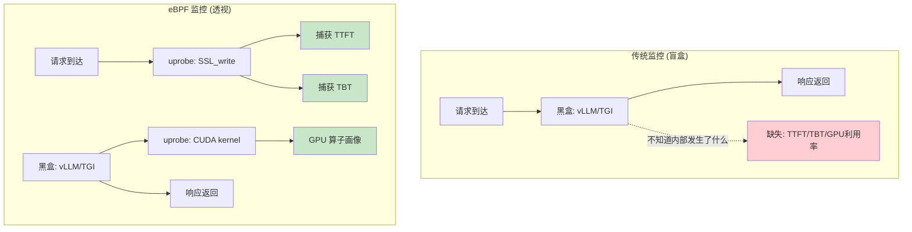
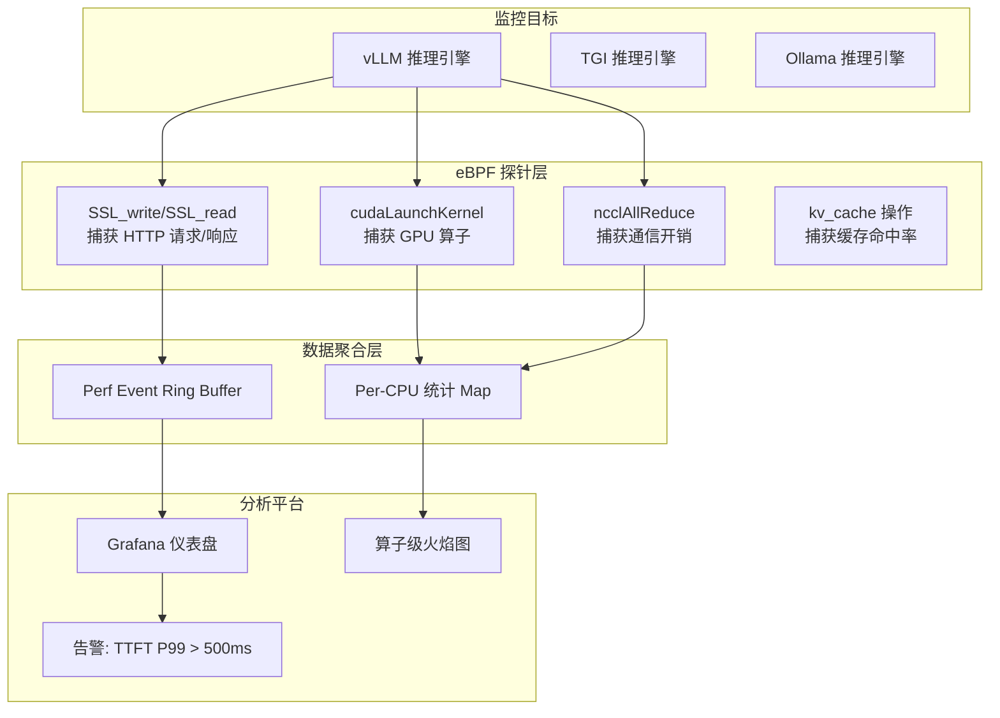
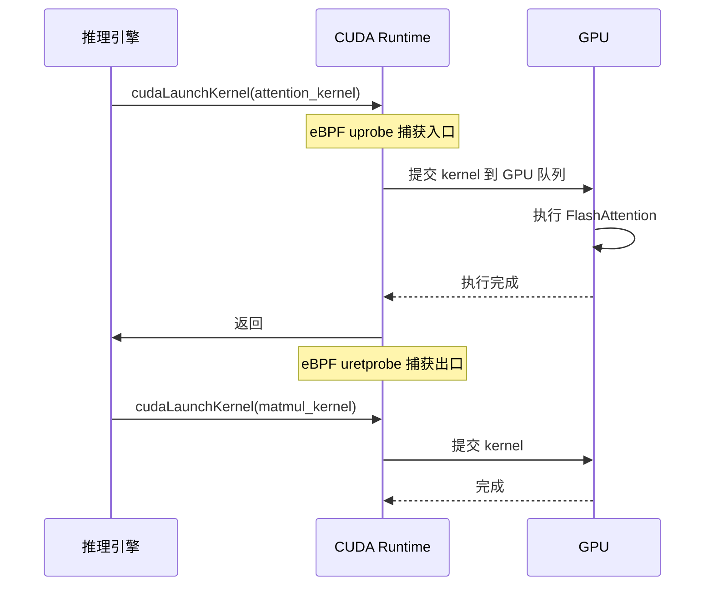
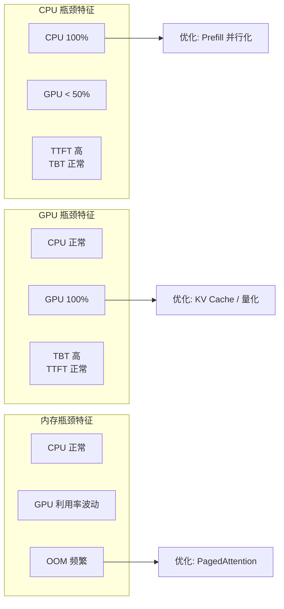
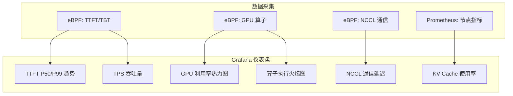

> [!info] eBPF 2026 深度探索系列 0. [[2026-04-08-ebpf-comprehensive-learning-roadmap|全栈学习路径总览]]
>
> 1. [[2026-04-08-ebpf-deep-dive-ch1-registers-and-instructions|第一章：寄存器与指令集]]
> 2. [[2026-04-08-ebpf-deep-dive-ch1-5-function-calls|第一.五章：四种函数调用与动态内存]]
> 3. [[2026-04-08-ebpf-deep-dive-ch1-6-the-verifier|第一.六章：验证器 (Verifier) 的底层逻辑]]
> 4. [[2026-04-08-ebpf-deep-dive-ch2-maps-and-communication|第二章：Map 机制与跨空间通信]]
> 5. [[2026-04-08-ebpf-deep-dive-ch2-5-kptr-and-ownership|第二.五章：kptr (内核指针) 与内存所有权模型]]
> 6. [[2026-04-08-ebpf-deep-dive-ch3-core-and-btf|第三章：CO-RE 与 BTF 的跨版本魔法]]
> 7. [[2026-04-08-ebpf-deep-dive-ch4-tracing-hooks-and-security|第四章：从 kprobe 到 LSM 的追踪全图景]]
> 8. [[2026-04-08-ebpf-deep-dive-ch7-5-uprobes-dynamic-tracing|第七.五章：uprobe 用户态动态追踪原理]]
> 9. [[2026-04-08-ebpf-deep-dive-ch7-6-bpftime-user-runtime|第七.六章：bpftime 与用户态 eBPF 加速]]
> 10. [[2026-04-08-ebpf-deep-dive-ch18-bpftime-injection-mastery|第七.七章：bpftime 自动化注入与全量监控实战]]
> 11. [[2026-04-08-ebpf-deep-dive-ch7-8-uprobe-selection-guide|第七.八章：uprobe 选型指南：内核态 vs 用户态]]
> 12. [[2026-04-08-ebpf-deep-dive-ch5-xdp-networking-performance|第五章：XDP 极致网络性能与全栈架构]]
> 13. [[2026-04-08-ebpf-deep-dive-ch6-tc-traffic-control|第六章：TC (Traffic Control) 流量调度艺术]]
> 14. [[2026-04-08-ebpf-deep-dive-ch7-security-lsm-enforcement|第七章：LSM BPF 从可观测到安全执法]]
> 15. [[2026-04-08-ebpf-deep-dive-ch8-advanced-tuning-and-profiling|第八章：进阶实战与内核调优]]
> 16. [[2026-04-08-ebpf-deep-dive-ch9-af-xdp-zero-copy|第九章：AF_XDP 零拷贝与用户态协议栈]]
> 17. [[2026-04-08-ebpf-deep-dive-ch10-sched-ext-custom-scheduler|第十章：sched_ext 自定义 CPU 调度器]]
> 18. [[2026-04-08-ebpf-deep-dive-ch11-bpf-iterators|第十一章：BPF Iterators 内核对象迭代器]]
> 19. [[2026-04-08-ebpf-deep-dive-ch12-kfuncs-evolution|第十二章：kfuncs 下一代内核交互标准]]
> 20. [[2026-04-08-ebpf-deep-dive-ch13-usdt-tracing|第十三章：USDT 用户态静态定义追踪]]
> 21. **第十四章：AI 推理与大模型监控前沿**
> 22. [[2026-04-08-ebpf-deep-dive-ch15-container-isolation|第十五章：无感增强容器隔离性]]
> 23. [[2026-04-08-ebpf-deep-dive-ch16-ebpf-and-wasm|第十六章：eBPF 与 WebAssembly (WASM) 的共生架构]]
> 24. [[2026-04-08-ebpf-deep-dive-ch17-storage-and-filesystem|第十七章：存储与文件系统加速]]
> 25. [[2026-04-08-ebpf-deep-dive-ch18-lifecycle-and-links|第十八章：生命周期管理与 BPF Links]]
> 26. [[2026-04-08-ebpf-deep-dive-ch19-atomic-updates-and-hot-upgrade|第十九章：程序的原子更新与蓝绿部署]]
> 27. [[2026-04-08-ebpf-deep-dive-ch25-5-stack-trace-correlation|第二五.五章：调用栈与业务请求的深度绑定]]
> 28. [[2026-04-08-ebpf-deep-dive-ch20-edge-iot-acceleration|第二十章：边缘计算与工业协议加速]]
> 29. [[2026-04-08-ebpf-deep-dive-ch21-debugging-and-verifier|第二十一章：调试实战与验证器 (Verifier) 诊断]]
> 30. [[2026-04-08-ebpf-deep-dive-ch22-testing-and-ci-cd|第二十二章：测试与持续集成 (CI/CD) 实战]]
> 31. [[2026-04-08-ebpf-deep-dive-ch23-security-and-permissions|第二十三章：权限细分与 BPF 安全沙箱]]
> 32. [[2026-04-08-ebpf-deep-dive-ch24-meta-monitoring-and-self-healing|第二十四章：eBPF 程序的内核自愈与监控]]
> 33. [[2026-04-08-ebpf-deep-dive-ch25-full-stack-observability|第二十五章：全栈可观测性与端到端追踪]]
> 34. [[2026-04-08-ebpf-deep-dive-ch26-network-security-high-level|第二十六章：网络安全防御的高阶实战]]
> 35. [[2026-04-08-ebpf-deep-dive-ch27-agent-engineering-architecture|第二十七章：工业级模块化 Agent 架构演进]]
> 36. [[2026-04-08-ebpf-deep-dive-ch28-offensive-and-defensive|第二十八章：攻防博弈与 Rootkit 防御]]
> 37. [[2026-04-08-ebpf-deep-dive-ch29-networking-deep-dive|第二十九章：网络应用深水区——负载均衡、Sockmap 与拥塞控制]]
> 38. [[2026-04-08-ebpf-deep-dive-ch30-hardware-offload|第三十章：硬件卸载与 SmartNIC 实战]]
> 39. [[2026-04-08-ebpf-deep-dive-ch31-signed-objects-and-security|第三十一章：内核原生签名与供应链安全]]
> 40. [[2026-04-08-ebpf-deep-dive-ch32-ebpf-for-windows|第三十二章：跨平台崛起——eBPF for Windows]]
> 41. [[2026-04-08-ebpf-deep-dive-ch32-5-macos-status|第三十二.五章：macOS 的特殊路径]]
> 42. [[2026-04-08-ebpf-deep-dive-ch33-serverless-optimization|第三十三章：Serverless 冷启动消除与动态计费]]
> 43. [[2026-04-08-ebpf-deep-dive-ch34-waf-and-rasp|第三十四章：Web 安全革命——内核态 WAF 与 RASP]]
> 44. [[2026-04-08-ebpf-deep-dive-ch35-npu-tpu-ai-hardware|第三十五章：AI 推理硬件 (NPU/TPU) 与硬件定义内核]]
> 45. [[2026-04-08-ebpf-deep-dive-ch36-dynamic-language-introspection|第三十六章：动态语言感知——业务对象的零代码提取]]
> 46. [[2026-04-08-ebpf-deep-dive-ch37-green-computing|第三十七章：绿色计算与能耗精准归因]]
> 47. [[2026-04-08-ebpf-deep-dive-ch38-ecosystem-and-career|第三十八章：2026 生态全景与工程师职业导航]]
> 48. [[2026-04-09-ebpf-deep-dive-ch39-rust-aya-framework|第三十九章：Rust eBPF 开发实战——Aya 框架与安全编程]]
> 49. [[2026-04-09-ebpf-deep-dive-ch40-network-protocols-deep-dive|第四十章：网络协议深度解析——TCP/UDP/QUIC 的 eBPF 视角]]
> 50. [[2026-04-09-ebpf-deep-dive-ch41-memory-safety-and-vulnerabilities|第四十一章：eBPF 内存安全与漏洞分析]]
> 51. [[2026-04-09-ebpf-deep-dive-ch42-service-mesh-integration|第四十二章：eBPF 与 Service Mesh 深度集成]]

---

# 第十四章：AI 推理与大模型监控前沿

## 1. 核心痛点：大模型监控的"盲盒"

大语言模型（LLM）的推理交互采用流式输出（Streaming）。传统的 APM 工具由于只关注请求级别的起始与结束，无法透视大模型服务最为关键的指标：

- **TTFT (Time To First Token)**：首字延迟，直接影响用户感知
- **TBT (Time Between Tokens)**：Token 间输出延迟，影响流式体验
- **TPS (Tokens Per Second)**：吞吐率，决定推理效率
- **Prefill vs Decode**：预填充阶段和生成阶段的资源争用

如果在业务代码（如 vLLM/Ollama）中埋点抓取，不仅侵入性高，还会拖慢本身就极度紧张的推理性能。



---

## 2. 破局之道：eBPF Token 流截获

### 2.1 监控架构全景



### 2.2 代码实战：捕获流式输出的 TTFT

```c
#include "vmlinux.h"
#include <bpf/bpf_helpers.h>
#include <bpf/bpf_tracing.h>

// 存储请求开始时间：PID_TGID -> timestamp
struct {
    __uint(type, BPF_MAP_TYPE_HASH);
    __uint(max_entries, 10240);
    __type(key, u64);
    __type(value, u64);
} req_start_map SEC(".maps");

// TTFT 统计
struct ttft_event {
    u32 pid;
    u64 ttft_ns;
    u64 timestamp;
    char comm[16];
};

struct {
    __uint(type, BPF_MAP_TYPE_RINGBUF);
    __uint(max_entries, 256 * 1024);
} events SEC(".maps");

// 匹配 POST /v1/chat/completions 请求，记录起始时间
SEC("uprobe//usr/lib/x86_64-linux-gnu/libssl.so.3:SSL_write")
int BPF_UPROBE(trace_ai_request, void *ssl, const void *buf, int num) {
    u64 id = bpf_get_current_pid_tgid();
    u64 now = bpf_ktime_get_ns();

    char chunk[64];
    bpf_probe_read_user(&chunk, sizeof(chunk), buf);

    // 匹配 OpenAI 兼容 API 的 POST 请求
    if (bpf_strncmp(chunk, 16, "POST /v1/chat") == 0) {
        bpf_map_update_elem(&req_start_map, &id, &now, BPF_ANY);
    }
    return 0;
}

// 匹配 SSE 流式响应的首个 data: 事件，计算 TTFT
SEC("uprobe//usr/lib/x86_64-linux-gnu/libssl.so.3:SSL_read")
int BPF_UPROBE(trace_ai_ttft, void *ssl, const void *buf, int *num) {
    u64 id = bpf_get_current_pid_tgid();
    u64 now = bpf_ktime_get_ns();

    char chunk[32];
    int len = *num;
    if (len > 32) len = 32;
    bpf_probe_read_user(&chunk, len, buf);

    // 匹配 SSE "data: " 起始标记
    if (bpf_strncmp(chunk, 6, "data: ") == 0) {
        u64 *start_time = bpf_map_lookup_elem(&req_start_map, &id);

        if (start_time && *start_time != 0) {
            u64 ttft_ns = now - *start_time;

            struct ttft_event *e = bpf_ringbuf_reserve(&events,
                                                        sizeof(*e), 0);
            if (e) {
                e->pid = id >> 32;
                e->ttft_ns = ttft_ns;
                e->timestamp = now;
                bpf_get_current_comm(&e->comm, sizeof(e->comm));
                bpf_ringbuf_submit(e, 0);
            }

            bpf_map_delete_elem(&req_start_map, &id);
        }
    }
    return 0;
}
```

### 2.3 TBT (Token 间延迟) 捕获

```c
// 记录上一个 Token 的时间戳
struct {
    __uint(type, BPF_MAP_TYPE_HASH);
    __uint(max_entries, 10240);
    __type(key, u64);
    __type(value, u64);
} last_token_map SEC(".maps");

struct tbt_event {
    u32 pid;
    u64 tbt_ns;
    u32 token_seq;
};

SEC("uprobe//usr/lib/x86_64-linux-gnu/libssl.so.3:SSL_write")
int BPF_UPROBE(trace_ai_tbt, void *ssl, const void *buf, int num) {
    u64 id = bpf_get_current_pid_tgid();
    u64 now = bpf_ktime_get_ns();

    char chunk[64];
    int len = num < 64 ? num : 64;
    bpf_probe_read_user(&chunk, len, buf);

    // 匹配 SSE data: 行（排除 [DONE]）
    if (bpf_strncmp(chunk, 6, "data: ") == 0 &&
        bpf_strncmp(chunk + 6, 6, "[DONE]") != 0) {

        u64 *last_ts = bpf_map_lookup_elem(&last_token_map, &id);
        if (last_ts) {
            struct tbt_event *e = bpf_ringbuf_reserve(&events,
                                                       sizeof(*e), 0);
            if (e) {
                e->pid = id >> 32;
                e->tbt_ns = now - *last_ts;
                bpf_ringbuf_submit(e, 0);
            }
        }
        bpf_map_update_elem(&last_token_map, &id, &now, BPF_ANY);
    }

    // 检测流结束
    if (bpf_strncmp(chunk, 6, "data: ") == 0 &&
        bpf_strncmp(chunk + 6, 6, "[DONE]") == 0) {
        bpf_map_delete_elem(&last_token_map, &id);
    }

    return 0;
}
```

---

## 3. 深入硬件：GPU 指令画像

### 3.1 CUDA Runtime 拦截

当 TTFT 过高时，原因往往出在 GPU 层面的算子执行调度上。通过 `uprobe` 拦截 `libcudart.so`（CUDA 运行时库），eBPF 可以剖析大模型的微观执行过程。



### 3.2 GPU 算子监控代码

```c
struct cuda_launch_event {
    u32 pid;
    u64 func_addr;
    u32 grid_x, grid_y, grid_z;
    u32 block_x, block_y, block_z;
    u64 launch_ns;
    u64 duration_ns;
};

struct {
    __uint(type, BPF_MAP_TYPE_RINGBUF);
    __uint(max_entries, 1024 * 1024);
} cuda_events SEC(".maps");

// 入口：记录 kernel 启动时间
SEC("uprobe//usr/local/cuda/lib64/libcudart.so:cudaLaunchKernel")
int BPF_UPROBE(cuda_launch_entry, void *func,
               struct dim3 gridDim, struct dim3 blockDim,
               void *args, u64 sharedMem) {
    u32 pid = bpf_get_current_pid_tgid() >> 32;

    struct cuda_launch_event *e = bpf_ringbuf_reserve(&cuda_events,
                                                       sizeof(*e), 0);
    if (e) {
        e->pid = pid;
        e->func_addr = (u64)func;
        e->grid_x = gridDim.x;
        e->grid_y = gridDim.y;
        e->grid_z = gridDim.z;
        e->block_x = blockDim.x;
        e->block_y = blockDim.y;
        e->block_z = blockDim.z;
        e->launch_ns = bpf_ktime_get_ns();
        e->duration_ns = 0;  // 出口时填充
        bpf_ringbuf_submit(e, 0);
    }
    return 0;
}

// 出口：cudaLaunchKernel 是同步的，返回时 kernel 已完成
SEC("uretprobe//usr/local/cuda/lib64/libcudart.so:cudaLaunchKernel")
int BPF_URETPROBE(cuda_launch_exit) {
    // 注意：同步 launch 返回时 kernel 已执行完成
    // 但异步 launch (<<<>>>) 需要用 cudaStreamSynchronize 来捕获
    return 0;
}
```

### 3.3 GPU 利用率 vs CPU 利用率



---

## 4. KV Cache 监控与优化

### 4.1 KV Cache 状态追踪

vLLM 等 PagedAttention 引擎使用 KV Cache 管理注意力机制的中间结果。eBPF 可以监控缓存的使用和淘汰情况：

```c
// 追踪 KV Cache 的分配和释放
SEC("uprobe/./vllm:allocate_cached_kv_block")
int BPF_UPROBE(kv_alloc, void *block_id, u32 num_blocks) {
    u32 pid = bpf_get_current_pid_tgid() >> 32;
    bpf_printk("KV_ALLOC: pid=%d blocks=%d", pid, num_blocks);

    // 更新统计 Map
    u32 key = pid;
    u64 *count = bpf_map_lookup_elem(&kv_alloc_map, &key);
    if (count) {
        __sync_fetch_and_add(count, num_blocks);
    }
    return 0;
}
```

### 4.2 KV Cache 利用率仪表盘指标

| 指标                        | 说明              | 告警阈值             |
| :-------------------------- | :---------------- | :------------------- |
| `kv_cache_usage_ratio`      | 已用缓存 / 总缓存 | > 90%                |
| `kv_cache_blocks_allocated` | 累计分配块数      | 持续增长             |
| `kv_cache_hit_rate`         | 缓存命中率        | < 70%                |
| `avg_prefix_length`         | 平均前缀长度      | > 模型上下文窗口 80% |

---

## 5. 分布式推理监控

### 5.1 NCCL 通信追踪

多 GPU 推理（如 Tensor Parallelism）使用 NCCL 进行 GPU 间通信。eBPF 可以追踪通信开销：

```c
// 追踪 NCCL AllReduce 通信延迟
SEC("uprobe//usr/local/cuda/lib64/libnccl.so:ncclAllReduce")
int BPF_UPROBE(nccl_allreduce_entry, void *sendbuf, void *recvbuf,
                size_t count, int datatype, int op, int comm,
                void *stream) {
    u32 pid = bpf_get_current_pid_tgid() >> 32;
    u64 now = bpf_ktime_get_ns();

    u64 key = (u64)pid << 32;
    bpf_map_update_elem(&nccl_start_map, &key, &now, BPF_ANY);
    return 0;
}

SEC("uretprobe//usr/local/cuda/lib64/libnccl.so:ncclAllReduce")
int BPF_URETPROBE(nccl_allreduce_exit) {
    u32 pid = bpf_get_current_pid_tgid() >> 32;
    u64 now = bpf_ktime_get_ns();

    u64 key = (u64)pid << 32;
    u64 *start = bpf_map_lookup_elem(&nccl_start_map, &key);
    if (start) {
        u64 latency = now - *start;
        // 通信延迟 > 1ms 需要关注
        if (latency > 1000000) {
            bpf_printk("NCCL_SLOW: pid=%d latency=%llums",
                       pid, latency / 1000000);
        }
        bpf_map_delete_elem(&nccl_start_map, &key);
    }
    return 0;
}
```

### 5.2 推理服务全景仪表盘



---

## 6. 推理框架适配指南

### 6.1 主流推理框架探针点

| 框架                  | 探针目标                                                  | 可捕获指标                    |
| :-------------------- | :-------------------------------------------------------- | :---------------------------- |
| **vLLM**              | `SSL_write/read`, `cudaLaunchKernel`, `allocate_kv_block` | TTFT, TBT, GPU 算子, KV Cache |
| **TGI (HuggingFace)** | `SSL_write/read`, `onnxruntime::Run`                      | TTFT, TBT, ONNX 算子延迟      |
| **Ollama**            | `llama_decode_internal`, `ggml_mul_mat`                   | Token 生成延迟, GGML 算子     |
| **Triton Inference**  | `TRITONBACKEND_Execute`, `cudaLaunchKernel`               | 模型推理延迟, GPU 算子        |
| **TensorRT-LLM**      | `nvinfer1::execute`, `cudaLaunchKernel`                   | 推理延迟, GPU 算子            |

### 6.2 Ollama (llama.cpp) 追踪

```c
// 追踪 llama.cpp 的 decode 调用
SEC("uprobe/./ollama:llama_decode_internal")
int BPF_UPROBE(llama_decode, struct llama_context *ctx,
               struct llama_batch *batch) {
    u64 now = bpf_ktime_get_ns();
    u32 pid = bpf_get_current_pid_tgid() >> 32;

    // 记录 decode 开始时间
    u64 key = (u64)pid;
    bpf_map_update_elem(&decode_map, &key, &now, BPF_ANY);

    bpf_printk("LLAMA_DECODE: pid=%d n_tokens=%d",
               pid, batch->n_tokens);
    return 0;
}

SEC("uretprobe/./ollama:llama_decode_internal")
int BPF_URETPROBE(llama_decode_ret, int ret) {
    u32 pid = bpf_get_current_pid_tgid() >> 32;
    u64 now = bpf_ktime_get_ns();

    u64 key = (u64)pid;
    u64 *start = bpf_map_lookup_elem(&decode_map, &key);
    if (start) {
        u64 latency_ms = (now - *start) / 1000000;
        bpf_printk("LLAMA_DECODE_DONE: pid=%d latency=%llums",
                   pid, latency_ms);
        bpf_map_delete_elem(&decode_map, &key);
    }
    return 0;
}
```

---

## 7. 性能影响评估

### 7.1 探针对推理吞吐的影响

| 探针组合           | TPS 影响 | CPU 开销 | 适用场景       |
| :----------------- | :------- | :------- | :------------- |
| 仅 SSL_write/read  | <1%      | <2%      | 生产环境       |
| + cudaLaunchKernel | <3%      | <5%      | 性能调优       |
| + NCCL 通信        | <5%      | <8%      | 多 GPU 诊断    |
| 全量探针           | <8%      | <12%     | 深度 profiling |

### 7.2 降低开销的策略

```c
// 策略 1: 采样（每 N 个事件才处理一次）
static inline bool should_sample(u64 *counter, u32 rate) {
    (*counter)++;
    return (*counter % rate) == 0;
}

// 策略 2: PID 过滤（只监控特定进程）
const volatile u32 target_pid;

// 策略 3: 时间窗口（只在特定时间段开启）
const volatile u64 profiling_start_ns;
const volatile u64 profiling_end_ns;
```

---

## 8. 常见问题 FAQ

**Q1：eBPF 监控会影响 GPU 推理性能吗？**

A：eBPF 探针本身运行在 CPU 上，不直接占用 GPU 资源。主要开销是 CPU 侧的事件处理。通过采样（如每 100 个 Token 记录一次 TBT）和 PID 过滤，可以将 CPU 开销控制在 2% 以内。对于 GPU 密集型推理（如 Llama 70B），这个开销可以忽略不计。

**Q2：如何区分 Prefill 阶段和 Decode 阶段？**

A：通过观察 Token 生成模式：Prefill 阶段会一次性处理大量输入 Token（通常 >100），表现为长时间无输出后突然一批输出。Decode 阶段逐个生成 Token，TBT 稳定。可以在用户态通过检测 `data: ` 事件的时间间隔来区分：间隔 > 100ms 的大概率是 Prefill→Decode 的切换点。

**Q3：CUDA uprobe 能捕获异步 kernel 吗？**

A：`cudaLaunchKernel` 的 uprobe 只捕获 API 调用时刻，无法知道异步 kernel 何时实际在 GPU 上执行。要获取真实执行时间，需要追踪 `cudaStreamSynchronize` 或 `cudaEventSynchronize`。另一种方案是使用 NVIDIA Nsight Systems 的 eBPF 集成（NVTX 标记），它提供了 GPU 时间线数据。

**Q4：在 Kubernetes 中部署 AI 监控探针的最佳实践？**

A：推荐使用 DaemonSet 部署 eBPF Agent，通过 `hostPID: true` 访问宿主机进程。由于 GPU 通常以 `nvidia.com/gpu` 资源分配给 Pod，需要 Agent 能够发现 GPU Pod 并附加探针。建议使用 NVIDIA GPU Operator 的监控扩展，或自定义 Admission Webhook 自动注入 sidecar。

**Q5：如何将 eBPF 监控数据接入 Prometheus？**

A：用户态读取 Ring Buffer 的程序可以作为 Prometheus exporter，暴露 `ai_inference_ttft_seconds`、`ai_inference_tbt_seconds`、`ai_gpu_kernel_duration_seconds` 等指标。使用 `prometheus-client` 库的 Histogram 类型，自动计算 P50/P95/P99 分位数。
