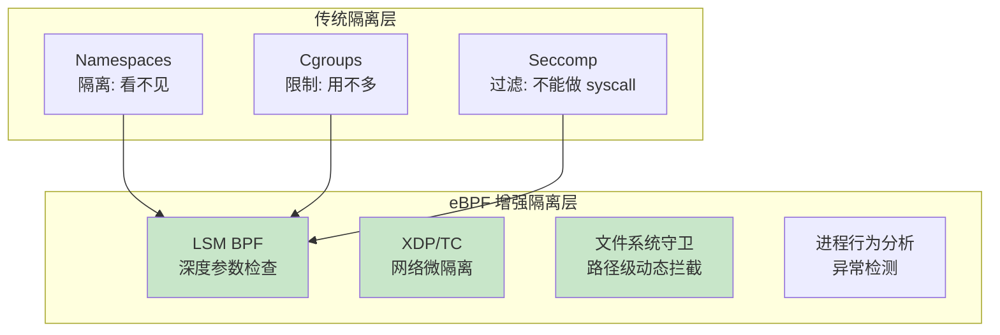
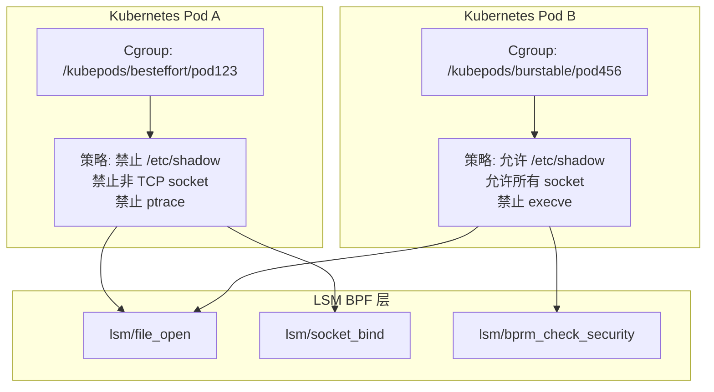
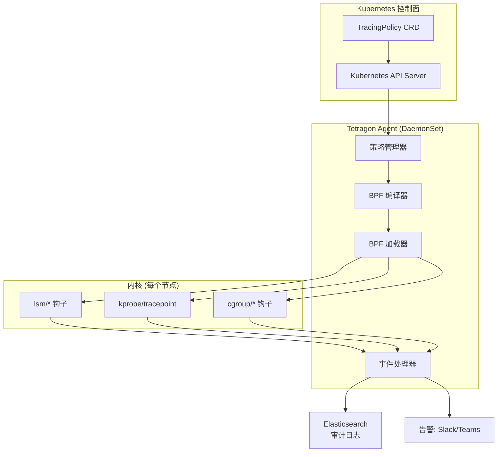

> [!info] eBPF 2026 深度探索系列
> 0. [[2026-04-08-ebpf-comprehensive-learning-roadmap|全栈学习路径总览]]
> 1. [[2026-04-08-ebpf-deep-dive-ch1-registers-and-instructions|第一章：寄存器与指令集]]
> 2. [[2026-04-08-ebpf-deep-dive-ch1-5-function-calls|第一.五章：四种函数调用与动态内存]]
> 3. [[2026-04-08-ebpf-deep-dive-ch1-6-the-verifier|第一.六章：验证器 (Verifier) 的底层逻辑]]
> 4. [[2026-04-08-ebpf-deep-dive-ch2-maps-and-communication|第二章：Map 机制与跨空间通信]]
> 5. [[2026-04-08-ebpf-deep-dive-ch2-5-kptr-and-ownership|第二.五章：kptr (内核指针) 与内存所有权模型]]
> 6. [[2026-04-08-ebpf-deep-dive-ch3-core-and-btf|第三章：CO-RE 与 BTF 的跨版本魔法]]
> 7. [[2026-04-08-ebpf-deep-dive-ch4-tracing-hooks-and-security|第四章：从 kprobe 到 LSM 的追踪全图景]]
> 8. [[2026-04-08-ebpf-deep-dive-ch7-5-uprobes-dynamic-tracing|第七.五章：uprobe 用户态动态追踪原理]]
> 9. [[2026-04-08-ebpf-deep-dive-ch7-6-bpftime-user-runtime|第七.六章：bpftime 与用户态 eBPF 加速]]
> 10. [[2026-04-08-ebpf-deep-dive-ch18-bpftime-injection-mastery|第七.七章：bpftime 自动化注入与全量监控实战]]
> 11. [[2026-04-08-ebpf-deep-dive-ch7-8-uprobe-selection-guide|第七.八章：uprobe 选型指南：内核态 vs 用户态]]
> 12. [[2026-04-08-ebpf-deep-dive-ch5-xdp-networking-performance|第五章：XDP 极致网络性能与全栈架构]]
> 13. [[2026-04-08-ebpf-deep-dive-ch6-tc-traffic-control|第六章：TC (Traffic Control) 流量调度艺术]]
> 14. [[2026-04-08-ebpf-deep-dive-ch7-security-lsm-enforcement|第七章：LSM BPF 从可观测到安全执法]]
> 15. [[2026-04-08-ebpf-deep-dive-ch8-advanced-tuning-and-profiling|第八章：进阶实战与内核调优]]
> 16. [[2026-04-08-ebpf-deep-dive-ch9-af-xdp-zero-copy|第九章：AF_XDP 零拷贝与用户态协议栈]]
> 17. [[2026-04-08-ebpf-deep-dive-ch10-sched-ext-custom-scheduler|第十章：sched_ext 自定义 CPU 调度器]]
> 18. [[2026-04-08-ebpf-deep-dive-ch11-bpf-iterators|第十一章：BPF Iterators 内核对象迭代器]]
> 19. [[2026-04-08-ebpf-deep-dive-ch12-kfuncs-evolution|第十二章：kfuncs 下一代内核交互标准]]
> 20. [[2026-04-08-ebpf-deep-dive-ch13-usdt-tracing|第十三章：USDT 用户态静态定义追踪]]
> 21. [[2026-04-08-ebpf-deep-dive-ch14-ai-llm-inference-monitoring|第十四章：AI 推理与大模型监控前沿]]
> 22. **第十五章：无感增强容器隔离性**
> 23. [[2026-04-08-ebpf-deep-dive-ch16-ebpf-and-wasm|第十六章：eBPF 与 WebAssembly (WASM) 的共生架构]]
> 24. [[2026-04-08-ebpf-deep-dive-ch17-storage-and-filesystem|第十七章：存储与文件系统加速]]
> 25. [[2026-04-08-ebpf-deep-dive-ch18-lifecycle-and-links|第十八章：生命周期管理与 BPF Links]]
> 26. [[2026-04-08-ebpf-deep-dive-ch19-atomic-updates-and-hot-upgrade|第十九章：程序的原子更新与蓝绿部署]]
> 27. [[2026-04-08-ebpf-deep-dive-ch25-5-stack-trace-correlation|第二五.五章：调用栈与业务请求的深度绑定]]
> 28. [[2026-04-08-ebpf-deep-dive-ch20-edge-iot-acceleration|第二十章：边缘计算与工业协议加速]]
> 29. [[2026-04-08-ebpf-deep-dive-ch21-debugging-and-verifier|第二十一章：调试实战与验证器 (Verifier) 诊断]]
> 30. [[2026-04-08-ebpf-deep-dive-ch22-testing-and-ci-cd|第二十二章：测试与持续集成 (CI/CD) 实战]]
> 31. [[2026-04-08-ebpf-deep-dive-ch23-security-and-permissions|第二十三章：权限细分与 BPF 安全沙箱]]
> 32. [[2026-04-08-ebpf-deep-dive-ch24-meta-monitoring-and-self-healing|第二十四章：eBPF 程序的内核自愈与监控]]
> 33. [[2026-04-08-ebpf-deep-dive-ch25-full-stack-observability|第二十五章：全栈可观测性与端到端追踪]]
> 34. [[2026-04-08-ebpf-deep-dive-ch26-network-security-high-level|第二十六章：网络安全防御的高阶实战]]
> 35. [[2026-04-08-ebpf-deep-dive-ch27-agent-engineering-architecture|第二十七章：工业级模块化 Agent 架构演进]]
> 36. [[2026-04-08-ebpf-deep-dive-ch28-offensive-and-defensive|第二十八章：攻防博弈与 Rootkit 防御]]
> 37. [[2026-04-08-ebpf-deep-dive-ch29-networking-deep-dive|第二十九章：网络应用深水区——负载均衡、Sockmap 与拥塞控制]]
> 38. [[2026-04-08-ebpf-deep-dive-ch30-hardware-offload|第三十章：硬件卸载与 SmartNIC 实战]]
> 39. [[2026-04-08-ebpf-deep-dive-ch31-signed-objects-and-security|第三十一章：内核原生签名与供应链安全]]
> 40. [[2026-04-08-ebpf-deep-dive-ch32-ebpf-for-windows|第三十二章：跨平台崛起——eBPF for Windows]]
> 41. [[2026-04-08-ebpf-deep-dive-ch32-5-macos-status|第三十二.五章：macOS 的特殊路径]]
> 42. [[2026-04-08-ebpf-deep-dive-ch33-serverless-optimization|第三十三章：Serverless 冷启动消除与动态计费]]
> 43. [[2026-04-08-ebpf-deep-dive-ch34-waf-and-rasp|第三十四章：Web 安全革命——内核态 WAF 与 RASP]]
> 44. [[2026-04-08-ebpf-deep-dive-ch35-npu-tpu-ai-hardware|第三十五章：AI 推理硬件 (NPU/TPU) 与硬件定义内核]]
> 45. [[2026-04-08-ebpf-deep-dive-ch36-dynamic-language-introspection|第三十六章：动态语言感知——业务对象的零代码提取]]
> 46. [[2026-04-08-ebpf-deep-dive-ch37-green-computing|第三十七章：绿色计算与能耗精准归因]]
> 47. [[2026-04-08-ebpf-deep-dive-ch38-ecosystem-and-career|第三十八章：2026 生态全景与工程师职业导航]]
> 48. [[2026-04-09-ebpf-deep-dive-ch39-rust-aya-framework|第三十九章：Rust eBPF 开发实战——Aya 框架与安全编程]]
> 49. [[2026-04-09-ebpf-deep-dive-ch40-network-protocols-deep-dive|第四十章：网络协议深度解析——TCP/UDP/QUIC 的 eBPF 视角]]
> 50. [[2026-04-09-ebpf-deep-dive-ch41-memory-safety-and-vulnerabilities|第四十一章：eBPF 内存安全与漏洞分析]]
> 51. [[2026-04-09-ebpf-deep-dive-ch42-service-mesh-integration|第四十二章：eBPF 与 Service Mesh 深度集成]]
---

# 第十五章：无感增强容器隔离性

## 1. 概述：超越 Namespaces 的安全防线

容器的本质是宿主机上的一个受限进程。传统的隔离手段（Namespaces, Cgroups）主要解决的是"看不见"和"用不多"的问题，但在"不能做"层面（细粒度权限控制）存在先天不足。



### 1.1 容器逃逸攻击面

| 攻击路径 | 传统防御 | eBPF 防御 |
|:---|:---|:---|
| `/proc` 信息泄露 | `hidepid=2`（不完善） | LSM BPF 拦截 `/proc` 读取 |
| 内核漏洞利用 (CVE) | 无 | LSM BPF 限制敏感 syscall |
| 挂载逃逸 | `--privileged` 限制 | LSM BPF 拦截 `mount` 系统调用 |
| 网络嗅探 | NetworkPolicy | XDP + TC 实现微隔离 |
| 容器间通信 | NetworkPolicy | eBPF 网络策略引擎（Cilium） |
| 敏感文件读取 | 只读挂载 | LSM BPF 路径级拦截 |

---

## 2. eBPF 增强隔离的核心技术

### 2.1 路径级动态拦截 (Dynamic Path Enforcement)

利用 `lsm/file_open` 钩子，在内核决策是否允许打开文件之前进行二次校验。可以根据进程所属的 **Cgroup ID** 动态决定其是否有权访问 `/etc/shadow` 或宿主机的 `/sys` 路径。

### 2.2 参数级 Seccomp

传统的 Seccomp 只能基于系统调用号（Syscall Number）进行拦截。eBPF 允许对系统调用的参数（如 `openat` 的文件名、`socket` 的目标 IP）进行深度解包检查，实现真正的"最小特权原则"。

### 2.3 Cgroup LSM BPF

Linux 5.7+ 引入了 cgroup-level LSM BPF，允许为不同的 cgroup（即不同的容器）附加不同的安全策略：



---

## 3. 代码实战：容器敏感文件保护

### 3.1 基于 Cgroup ID 的文件访问控制

```c
#include "vmlinux.h"
#include <bpf/bpf_helpers.h>
#include <bpf/bpf_tracing.h>

char _license[] SEC("license") = "GPL";

// 存储需要严格监控的容器 Cgroup ID
struct {
    __uint(type, BPF_MAP_TYPE_HASH);
    __uint(max_entries, 1024);
    __type(key, u64);
    __type(value, u32);
} restricted_containers SEC(".maps");

// 敏感路径关键字
static const char SENSITIVE_PATHS[][16] = {
    "shadow",
    "passwd",
    "ssh",
    "credentials",
};

// 审计日志事件
struct audit_event {
    u64 cgroup_id;
    u32 pid;
    u32 uid;
    char comm[16];
    char path[64];
    u64 timestamp;
};

struct {
    __uint(type, BPF_MAP_TYPE_RINGBUF);
    __uint(max_entries, 256 * 1024);
} audit_buf SEC(".maps");

// 判断路径是否为敏感路径
static inline bool is_sensitive_path(const char *name, int len) {
#pragma unroll
    for (int i = 0; i < 4; i++) {
        int slen = 0;
        while (slen < 16 && SENSITIVE_PATHS[i][slen]) slen++;
        if (bpf_strncmp(name, slen, SENSITIVE_PATHS[i]) == 0)
            return true;
    }
    return false;
}

SEC("lsm/file_open")
int BPF_PROG(container_file_shield, struct file *file, int mask) {
    u64 cg_id = bpf_get_current_cgroup_id();

    // 仅对受控容器应用策略
    if (!bpf_map_lookup_elem(&restricted_containers, &cg_id))
        return 0;

    // 读取文件路径
    struct path fpath = BPF_CORE_READ(file, f_path);
    struct dentry *dentry = BPF_CORE_READ(fpath.dentry);
    struct qstr d_name = BPF_CORE_READ(dentry, d_name);

    char name[16];
    bpf_probe_read_kernel_str(name, sizeof(name), d_name.name);

    if (is_sensitive_path(name, sizeof(name))) {
        // 记录审计日志
        struct audit_event *e = bpf_ringbuf_reserve(&audit_buf,
                                                      sizeof(*e), 0);
        if (e) {
            e->cgroup_id = cg_id;
            e->pid = bpf_get_current_pid_tgid() >> 32;
            e->uid = bpf_get_current_uid_gid() & 0xFFFFFFFF;
            e->timestamp = bpf_ktime_get_ns();
            bpf_get_current_comm(&e->comm, sizeof(e->comm));
            bpf_probe_read_kernel_str(&e->path, sizeof(e->path),
                                       d_name.name);
            bpf_ringbuf_submit(e, 0);
        }
        return -EPERM;
    }
    return 0;
}
```

### 3.2 网络微隔离

```c
// 基于 cgroup ID 的容器网络策略
struct {
    __uint(type, BPF_MAP_TYPE_HASH);
    __uint(max_entries, 1024);
    __type(key, u64);   // src_cgroup_id
    __type(value, u32); // allowed_dst_port bitmap
} network_policy SEC(".maps");

SEC("cgroup/connect4")
int BPF_PROG(container_network_policy,
             struct sockaddr *addr, int addr_len) {
    u64 cg_id = bpf_get_current_cgroup_id();
    struct sockaddr_in *sin = (struct sockaddr_in *)addr;

    if (sin->sin_family != AF_INET)
        return 0;

    u16 dst_port = __bpf_ntohs(sin->sin_port);
    u32 *allowed = bpf_map_lookup_elem(&network_policy, &cg_id);

    if (!allowed) {
        // 无策略 = 默认拒绝
        bpf_printk("BLOCK: cgroup=%llu port=%d (no policy)",
                   cg_id, dst_port);
        return -EACCES;
    }

    // 检查目标端口是否在允许列表中
    if (!(1 << (dst_port & 0x1F)) & *allowed) {
        bpf_printk("BLOCK: cgroup=%llu port=%d (not allowed)",
                   cg_id, dst_port);
        return -EACCES;
    }

    return 1; // 允许
}
```

### 3.3 进程执行控制

```c
// 限制容器内可执行的二进制
struct {
    __uint(type, BPF_MAP_TYPE_HASH);
    __uint(max_entries, 512);
    __type(key, u64);   // cgroup_id
    __type(value, u32); // policy flags
} exec_policy SEC(".maps");

#define EXEC_DENY_ALL      0
#define EXEC_ALLOW_BIN     1  // 仅允许 /usr/bin
#define EXEC_ALLOW_SBIN    2  // 允许 /usr/sbin
#define EXEC_ALLOW_TMP     4  // 允许 /tmp

SEC("lsm/bprm_check_security")
int BPF_PROG(container_exec_policy, struct linux_binprm *bprm) {
    u64 cg_id = bpf_get_current_cgroup_id();
    u32 *policy = bpf_map_lookup_elem(&exec_policy, &cg_id);

    if (!policy || *policy == EXEC_DENY_ALL) {
        // 检查是否为容器内进程（通过 cgroup 层级判断）
        char cgroup_path[128];
        bpf_get_current_cgroup_id();  // 触发 cgroup 路径获取

        // 拒绝所有非白名单执行
        return -EPERM;
    }

    // 读取要执行的文件路径
    struct file *file = BPF_CORE_READ(bprm, file);
    struct path fpath = BPF_CORE_READ(file, f_path);
    // ... 路径匹配逻辑 ...

    return 0;
}
```

---

## 4. 2026 工业级实现：Tetragon

### 4.1 Tetragon 架构

在大规模生产环境中，安全团队不再手动编写 C 代码，而是使用基于 eBPF 的安全引擎（如 **Cilium Tetragon**）。



### 4.2 TracingPolicy 示例

```yaml
apiVersion: cilium.io/v1alpha1
kind: TracingPolicy
metadata:
  name: container-file-shield
spec:
  kprobes:
  - call: "security_file_permission"
    syscall: false
    args:
    - index: 0
      type: "file"
    selectors:
    - matchNamespaces:
      - namespace: Mnt
        operator: NotIn
        values:
        - "host_mnt_ns"  # 不是宿主机的 mount namespace
      matchArgs:
      - index: 0
        operator: "Prefix"
        values:
        - "/etc/shadow"
        - "/etc/passwd"
        - "/root/.ssh"
      matchActions:
      - action: Follow
        argError: -13  # EACCES
```

### 4.3 Tetragon vs 传统方案对比

| 维度 | Seccomp | AppArmor | Tetragon (eBPF) |
|:---|:---|:---|:---|
| **策略粒度** | Syscall 号 | 路径+权限 | Syscall 参数深度检查 |
| **动态更新** | 需重启容器 | 需重新加载 | 热更新（秒级） |
| **审计能力** | 仅计数 | 日志 | 完整事件上下文 |
| **跨容器追踪** | 无 | 无 | 支持（cgroup ID） |
| **性能开销** | ~1% | ~2% | ~3-5% |
| **Kubernetes 集成** | Pod spec | Pod annotation | CRD 原生 |

---

## 5. 容器逃逸检测

### 5.1 逃逸行为特征

```c
// 检测容器逃逸行为
SEC("lsm/sb_mount")
int BPF_PROG(detect_mount_escape, const char *dev_name,
              const char *path, const char *type,
              unsigned long flags, void *data) {
    u64 cg_id = bpf_get_current_cgroup_id();

    // 检测挂载宿主机文件系统
    char dev[32], mnt[64], tp[32];
    bpf_probe_read_kernel_str(dev, sizeof(dev), dev_name);
    bpf_probe_read_kernel_str(mnt, sizeof(mnt), path);
    bpf_probe_read_kernel_str(tp, sizeof(tp), type);

    // 挂载 /proc 或 /sys 到容器内部（常见逃逸手法）
    if (bpf_strncmp(mnt, 5, "/proc") == 0 ||
        bpf_strncmp(mnt, 4, "/sys") == 0) {
        bpf_printk("ESCAPE_DETECT: container=%llu mount=%s type=%s",
                   cg_id, mnt, tp);

        // 发送告警事件
        struct escape_event *e = bpf_ringbuf_reserve(&alert_buf,
                                                      sizeof(*e), 0);
        if (e) {
            e->cgroup_id = cg_id;
            e->pid = bpf_get_current_pid_tgid() >> 32;
            e->type = ESCAPE_MOUNT_SENSITIVE;
            e->timestamp = bpf_ktime_get_ns();
            bpf_ringbuf_submit(e, 0);
        }
    }

    return 0;
}
```

### 5.2 常见逃逸手法与检测

| 逃逸手法 | 原理 | eBPF 检测方式 |
|:---|:---|:---|
| `--privileged` + `mount` | 挂载宿主机文件系统 | `lsm/sb_mount` 检测敏感路径挂载 |
| `nsenter` | 进入宿主机 namespace | `lsm/ns_setns` 检测 namespace 切换 |
| `CVE-2022-0185` | 内核 unshare 漏洞 | 监控 `unshare` 系统调用的参数 |
| Docker Socket 挂载 | 通过 API 创建特权容器 | `lsm/file_open` 检测 `/var/run/docker.sock` |
| `/proc` 信息泄露 | 读取宿主机进程信息 | LSM BPF 过滤 `/proc` 读取 |

---

## 6. 性能影响与优化

### 6.1 开销分析

| 安全策略组合 | CPU 开销 | 内存开销 | 延迟影响 |
|:---|:---|:---|:---|
| 无策略（基准） | 0% | 0 | 0ns |
| 文件访问控制 | ~1.5% | ~10MB | ~200ns/op |
| 网络微隔离 | ~2% | ~15MB | ~150ns/conn |
| 进程执行控制 | ~1% | ~5MB | ~100ns/exec |
| 全量策略 | ~4-5% | ~30MB | ~500ns/op |

### 6.2 优化策略

```c
// 优化 1: 使用 cgroup ID 前缀匹配替代全路径比较
// 优化 2: Per-CPU Map 缓存热点决策
struct {
    __uint(type, BPF_MAP_TYPE_PERCPU_ARRAY);
    __uint(max_entries, 1);
    __type(key, u32);
    __type(value, u64);
} decision_cache SEC(".maps");

// 优化 3: 使用 BPF_LRU 缓存最近决策
struct {
    __uint(type, BPF_MAP_TYPE_LRU_HASH);
    __uint(max_entries, 4096);
    __type(key, u64);  // cgroup_id << 32 | inode
    __type(value, u32); // cached decision
} policy_cache SEC(".maps");
```

---

## 7. 常见问题 FAQ

**Q1：eBPF 安全策略会影响容器正常功能吗？**

A：如果策略配置不当，确实可能导致容器无法正常工作。建议：1) 先在测试环境验证策略；2) 使用 Tetragon 的 `action: Follow`（仅记录不拦截）模式进行灰度；3) 对关键业务容器设置白名单。

**Q2：eBPF LSM 和 AppArmor 可以同时使用吗？**

A：可以。Linux 内核的 LSM 框架采用"AND"逻辑——所有注册的 LSM 模块都必须通过，操作才会被允许。这意味着 eBPF LSM 和 AppArmor 是互补的，可以同时生效。但要注意，eBPF LSM 返回 `-EPERM` 时，即使 AppArmor 允许，操作也会被拒绝。

**Q3：如何处理容器重建后 cgroup ID 变化的问题？**

A：Cgroup ID 在容器重建后会变化。解决方案：1) 使用 Kubernetes Label Selector 将策略绑定到 Pod 而非 cgroup ID；2) Tetragon 通过监听 Kubernetes API 自动维护 Pod label → cgroup ID 的映射；3) 对于非 K8s 环境，使用容器的 cgroup 路径前缀（如 `/docker/`）作为标识。

**Q4：eBPF 安全策略能在不重启容器的情况下更新吗？**

A：可以。这是 eBPF 安全的核心优势。通过替换 BPF 程序或更新 BPF Map 中的策略数据，可以在不重启任何容器的情况下实时更新安全策略。Tetragon 的 TracingPolicy CRD 更新后通常在 1-2 秒内生效。

**Q5：eBPF 安全策略能否防御内核漏洞（如 CVE）？**

A：eBPF LSM 可以降低内核漏洞的利用成功率，但不能完全防御。例如，如果漏洞允许绕过所有 LSM 检查（如直接修改内核内存），eBPF 也无法阻止。但 eBPF 可以：1) 限制漏洞触发条件（如禁止敏感 syscall）；2) 提供实时告警（检测异常行为模式）；3) 通过最小权限原则减少攻击面。
