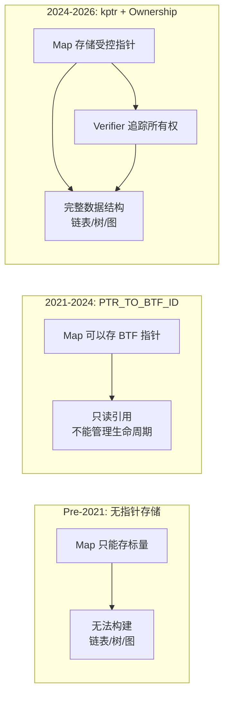
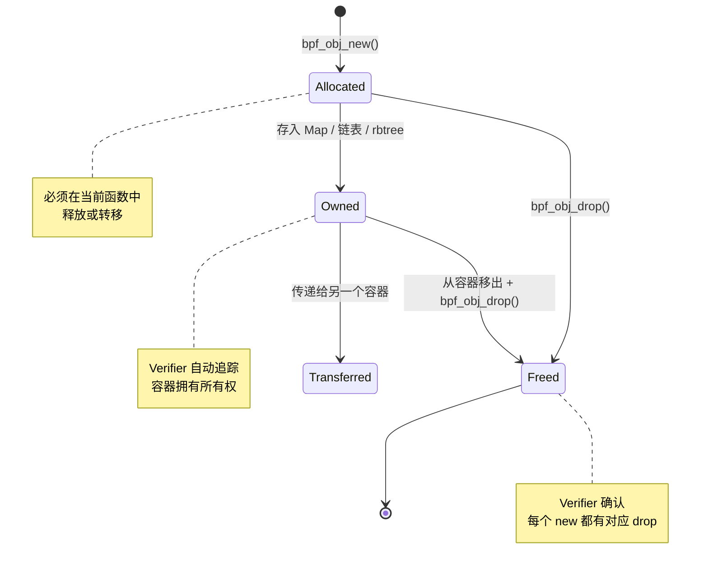
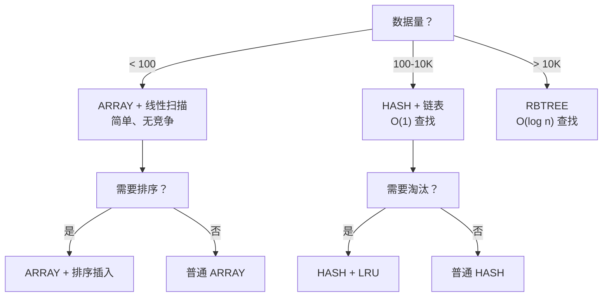
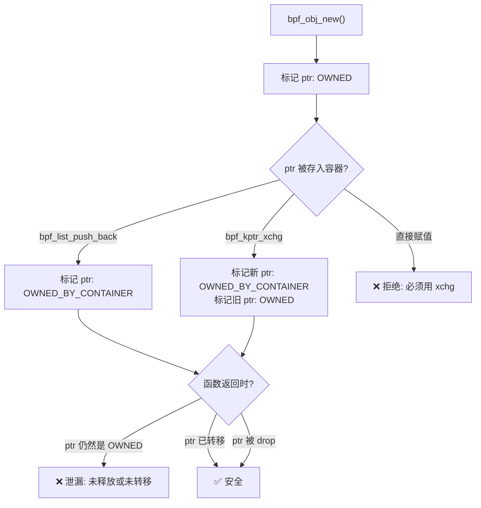

> [!info] eBPF 2026 深度探索系列
> 0. [[2026-04-08-ebpf-comprehensive-learning-roadmap|全栈学习路径总览]]
> 1. [[2026-04-08-ebpf-deep-dive-ch1-registers-and-instructions|第一章：寄存器与指令集]]
> 2. [[2026-04-08-ebpf-deep-dive-ch1-5-function-calls|第一.五章：四种函数调用与动态内存]]
> 3. [[2026-04-08-ebpf-deep-dive-ch1-6-the-verifier|第一.六章：验证器 (Verifier) 的底层逻辑]]
> 4. [[2026-04-08-ebpf-deep-dive-ch2-maps-and-communication|第二章：Map 机制与跨空间通信]]
> 5. **第二.五章：kptr (内核指针) 与内存所有权模型**
> 6. [[2026-04-08-ebpf-deep-dive-ch3-core-and-btf|第三章：CO-RE 与 BTF 的跨版本魔法]]
> 7. [[2026-04-08-ebpf-deep-dive-ch4-tracing-hooks-and-security|第四章：从 kprobe 到 LSM 的追踪全图景]]
> 8. [[2026-04-08-ebpf-deep-dive-ch7-5-uprobes-dynamic-tracing|第七.五章：uprobe 用户态动态追踪原理]]
> 9. [[2026-04-08-ebpf-deep-dive-ch7-6-bpftime-user-runtime|第七.六章：bpftime 与用户态 eBPF 加速]]
> 10. [[2026-04-08-ebpf-deep-dive-ch18-bpftime-injection-mastery|第七.七章：bpftime 自动化注入与全量监控实战]]
> 11. [[2026-04-08-ebpf-deep-dive-ch7-8-uprobe-selection-guide|第七.八章：uprobe 选型指南：内核态 vs 用户态]]
> 12. [[2026-04-08-ebpf-deep-dive-ch5-xdp-networking-performance|第五章：XDP 极致网络性能与全栈架构]]
> 13. [[2026-04-08-ebpf-deep-dive-ch6-tc-traffic-control|第六章：TC (Traffic Control) 流量调度艺术]]
> 14. [[2026-04-08-ebpf-deep-dive-ch7-security-lsm-enforcement|第七章：LSM BPF 从可观测到安全执法]]
> 15. [[2026-04-08-ebpf-deep-dive-ch8-advanced-tuning-and-profiling|第八章：进阶实战与内核调优]]
> 16. [[2026-04-08-ebpf-deep-dive-ch9-af-xdp-zero-copy|第九章：AF_XDP 零拷贝与用户态协议栈]]
> 17. [[2026-04-08-ebpf-deep-dive-ch10-sched-ext-custom-scheduler|第十章：sched_ext 自定义 CPU 调度器]]
> 18. [[2026-04-08-ebpf-deep-dive-ch11-bpf-iterators|第十一章：BPF Iterators 内核对象迭代器]]
> 19. [[2026-04-08-ebpf-deep-dive-ch12-kfuncs-evolution|第十二章：kfuncs 下一代内核交互标准]]
> 20. [[2026-04-08-ebpf-deep-dive-ch13-usdt-tracing|第十三章：USDT 用户态静态定义追踪]]
> 21. [[2026-04-08-ebpf-deep-dive-ch14-ai-llm-inference-monitoring|第十四章：AI 推理与大模型监控前沿]]
> 22. [[2026-04-08-ebpf-deep-dive-ch15-container-isolation|第十五章：无感增强容器隔离性]]
> 23. [[2026-04-08-ebpf-deep-dive-ch16-ebpf-and-wasm|第十六章：eBPF 与 WebAssembly (WASM) 的共生架构]]
> 24. [[2026-04-08-ebpf-deep-dive-ch17-storage-and-filesystem|第十七章：存储与文件系统加速]]
> 25. [[2026-04-08-ebpf-deep-dive-ch18-lifecycle-and-links|第十八章：生命周期管理与 BPF Links]]
> 26. [[2026-04-08-ebpf-deep-dive-ch19-atomic-updates-and-hot-upgrade|第十九章：程序的原子更新与蓝绿部署]]
> 27. [[2026-04-08-ebpf-deep-dive-ch25-5-stack-trace-correlation|第二五.五章：调用栈与业务请求的深度绑定]]
> 28. [[2026-04-08-ebpf-deep-dive-ch20-edge-iot-acceleration|第二十章：边缘计算与工业协议加速]]
> 29. [[2026-04-08-ebpf-deep-dive-ch21-debugging-and-verifier|第二十一章：调试实战与验证器 (Verifier) 诊断]]
> 30. [[2026-04-08-ebpf-deep-dive-ch22-testing-and-ci-cd|第二十二章：测试与持续集成 (CI/CD) 实战]]
> 31. [[2026-04-08-ebpf-deep-dive-ch23-security-and-permissions|第二十三章：权限细分与 BPF 安全沙箱]]
> 32. [[2026-04-08-ebpf-deep-dive-ch24-meta-monitoring-and-self-healing|第二十四章：eBPF 程序的内核自愈与监控]]
> 33. [[2026-04-08-ebpf-deep-dive-ch25-full-stack-observability|第二十五章：全栈可观测性与端到端追踪]]
> 34. [[2026-04-08-ebpf-deep-dive-ch26-network-security-high-level|第二十六章：网络安全防御的高阶实战]]
> 35. [[2026-04-08-ebpf-deep-dive-ch27-agent-engineering-architecture|第二十七章：工业级模块化 Agent 架构演进]]
> 36. [[2026-04-08-ebpf-deep-dive-ch28-offensive-and-defensive|第二十八章：攻防博弈与 Rootkit 防御]]
> 37. [[2026-04-08-ebpf-deep-dive-ch29-networking-deep-dive|第二十九章：网络应用深水区——负载均衡、Sockmap 与拥塞控制]]
> 38. [[2026-04-08-ebpf-deep-dive-ch30-hardware-offload|第三十章：硬件卸载与 SmartNIC 实战]]
> 39. [[2026-04-08-ebpf-deep-dive-ch31-signed-objects-and-security|第三十一章：内核原生签名与供应链安全]]
> 40. [[2026-04-08-ebpf-deep-dive-ch32-ebpf-for-windows|第三十二章：跨平台崛起——eBPF for Windows]]
> 41. [[2026-04-08-ebpf-deep-dive-ch32-5-macos-status|第三十二.五章：macOS 的特殊路径]]
> 42. [[2026-04-08-ebpf-deep-dive-ch33-serverless-optimization|第三十三章：Serverless 冷启动消除与动态计费]]
> 43. [[2026-04-08-ebpf-deep-dive-ch34-waf-and-rasp|第三十四章：Web 安全革命——内核态 WAF 与 RASP]]
> 44. [[2026-04-08-ebpf-deep-dive-ch35-npu-tpu-ai-hardware|第三十五章：AI 推理硬件 (NPU/TPU) 与硬件定义内核]]
> 45. [[2026-04-08-ebpf-deep-dive-ch36-dynamic-language-introspection|第三十六章：动态语言感知——业务对象的零代码提取]]
> 46. [[2026-04-08-ebpf-deep-dive-ch37-green-computing|第三十七章：绿色计算与能耗精准归因]]
> 47. [[2026-04-08-ebpf-deep-dive-ch38-ecosystem-and-career|第三十八章：2026 生态全景与工程师职业导航]]
> 48. [[2026-04-09-ebpf-deep-dive-ch39-rust-aya-framework|第三十九章：Rust eBPF 开发实战——Aya 框架与安全编程]]
> 49. [[2026-04-09-ebpf-deep-dive-ch40-network-protocols-deep-dive|第四十章：网络协议深度解析——TCP/UDP/QUIC 的 eBPF 视角]]
> 50. [[2026-04-09-ebpf-deep-dive-ch41-memory-safety-and-vulnerabilities|第四十一章：eBPF 内存安全与漏洞分析]]
> 51. [[2026-04-09-ebpf-deep-dive-ch42-service-mesh-integration|第四十二章：eBPF 与 Service Mesh 深度集成]]

---

## 1. 概述：eBPF 内存安全的演进

在 eBPF 的早期设计中，Map 只能存储**纯数据（标量值）**。这是一个巨大的限制——你无法在 Map 中存储指向其他内核对象的指针，这意味着无法构建链表、树、图等复杂数据结构。

**为什么禁止存指针？**

1. **Use-After-Free 风险**：程序 A 将一个指针存入 Map，程序 B 读取并使用它，但此时该内存可能已被内核释放 → 系统崩溃
2. **指针丢失导致泄漏**：多个 CPU 同时写入同一个 Map 位置的指针，后者覆盖前者，导致前一个指针指向的内存无法释放 → 内存泄漏
3. **类型混淆**：一个 CPU 存入 `struct task_struct *`，另一个 CPU 读取后当作 `struct file *` 使用 → 类型安全 violation

**kptr (Kernel Pointer)** 的引入解决了这些问题。它通过 BTF 元数据让 Verifier 感知指针的存在，并强制执行**所有权追踪**和**原子交换**规则。



---

## 2. 指针类型系统

### 2.1 三种指针类型对比

eBPF 的指针类型经历了三个阶段的演进：

| 类型 | 引入版本 | 生命周期管理 | 可存入 Map | 可修改 |
| :--- | :--- | :--- | :--- | :--- |
| **PTR_TO_BTF_ID** | Linux 5.x | **无**（只读引用） | ✅ (有限) | ❌ 只读 |
| **Unreferenced kptr** | Linux 6.1 | **不管理**（指向内核对象） | ✅ | 需 RCU 保护 |
| **Referenced kptr** | Linux 6.1 | **Verifier 强制追踪** | ✅ | 通过 `bpf_kptr_xchg` |

### 2.2 PTR_TO_BTF_ID：只读 BTF 指针

最原始的"指针存 Map"方案。Verifier 知道这个指针指向某种 BTF 类型，但不追踪所有权。

```c
struct {
    __uint(type, BPF_MAP_TYPE_HASH);
    __type(key, u32);
    __type(value, struct task_struct *);  // BTF 指针
} task_map SEC(".maps");

// 只能读取，不能修改或释放
struct task_struct *task = bpf_map_lookup_elem(&task_map, &pid);
if (task) {
    u32 tgid = task->tgid;  // ✅ 可以读
    task->pid = 0;          // ❌ 不能修改（非你分配的）
}
```

**局限**：你无法保证指针指向的对象在你使用时仍然存活（可能被内核回收）。

### 2.3 Referenced kptr：所有权追踪

通过 BTF 标记 `__kptr_ref` 声明，Verifier 强制追踪对象的生命周期。

```c
struct map_value {
    struct my_data __kptr *ptr;  // ❌ 普通 kptr
    struct my_data __kptr_ref *ptr;  // ✅ 受引用 kptr
};
```

### 2.4 Unreferenced kptr：非受控引用

通过 BTF 标记 `__kptr`（不带 `_ref`）声明。用于指向内核已有对象（如 `task_struct`、`struct file`），不需要管理生命周期，但需要 RCU 锁保护。

```c
struct map_value {
    struct task_struct __kptr *task;  // Unreferenced kptr
};
```

---

## 3. bpf_obj_new / bpf_obj_drop：堆分配 API

### 3.1 核心机制

`bpf_obj_new` 和 `bpf_obj_drop` 是 kfuncs，实现了类似 C 语言 `malloc`/`free` 的功能，但带有 Verifier 强制执行的生命周期管理。

```c
// 分配：返回一个指向新对象的指针
// Verifier 标记该指针为 "owned"
struct my_data *p = bpf_obj_new(typeof(*p));

// 释放：将对象归还给内核分配器
// Verifier 检查：必须对 "owned" 指针调用 drop
bpf_obj_drop(p);
```

### 3.2 所有权状态机



### 3.3 与 C malloc 的对比

| 特性 | C `malloc/free` | `bpf_obj_new/drop` |
| :--- | :--- | :--- |
| **泄漏检测** | 运行时工具 (valgrind) | **编译时 Verifier** |
| **Double Free** | 运行时崩溃 | **编译时拒绝** |
| **类型安全** | 无 | BTF 类型检查 |
| **内存位置** | 内核堆 (kmalloc) | 内核 BPF 对象分配器 |
| **最大大小** | 无限制 | 受 `BPF_OBJ_ALLOC_SIZE_MAX` 限制 |
| **使用条件** | 需要 `CAP_SYS_ADMIN` | 需要 `CAP_BPF` |

---

## 4. bpf_kptr_xchg：原子交换

### 4.1 为什么不能直接赋值？

```c
// ❌ 非法：直接赋值指针
v->data_ptr = p;  // Verifier 拒绝！
```

原因：如果直接赋值，原来 `v->data_ptr` 指向的对象就"丢失"了——没有任何代码负责释放它，造成内存泄漏。同时，在多核环境下，两个 CPU 可能同时赋值，导致其中一个指针永远丢失。

### 4.2 原子交换的语义

```c
// ✅ 合法：原子交换
struct my_data *old_p = bpf_kptr_xchg(&v->data_ptr, p);
```

操作是原子的（硬件 CAS 指令级别），语义等价于：

```
old_value = *(&v->data_ptr)
*(&v->data_ptr) = p
return old_value
```

**关键保证：**
1. **不泄漏**：旧指针被返回给调用者，调用者必须处理它
2. **原子性**：多核同时交换不会丢失任何指针
3. **所有权转移**：新指针 p 的所有权转移给 Map，旧指针 old_p 的所有权转移给调用者

### 4.3 代码实战：连接跟踪器

```c
// 连接信息
struct conn {
    u32 src_ip;
    u32 dst_ip;
    u16 src_port;
    u16 dst_port;
    u64 last_seen;
};

// Map 值：包含一个 kptr
struct map_value {
    struct bpf_spin_lock lock;
    struct conn __kptr_ref *conn_ptr;
};

struct {
    __uint(type, BPF_MAP_TYPE_HASH);
    __uint(max_entries, 65536);
    __type(key, struct conn_key);
    __type(value, struct map_value);
} conntrack SEC(".maps");

SEC("xdp")
int update_conntrack(struct xdp_md *ctx) {
    struct conn_key key = extract_conn_key(ctx);

    // 分配新连接对象
    struct conn *new_conn = bpf_obj_new(typeof(*new_conn));
    if (!new_conn)
        return XDP_PASS;

    new_conn->src_ip = extract_src_ip(ctx);
    new_conn->dst_ip = extract_dst_ip(ctx);
    new_conn->last_seen = bpf_ktime_get_ns();

    struct map_value *v = bpf_map_lookup_elem(&conntrack, &key);
    if (!v) {
        // Map 中没有该 key，直接释放
        bpf_obj_drop(new_conn);
        return XDP_PASS;
    }

    // 加锁 + 原子交换 + 解锁
    bpf_spin_lock(&v->lock);
    struct conn *old_conn = bpf_kptr_xchg(&v->conn_ptr, new_conn);
    bpf_spin_unlock(&v->lock);

    // 必须处理旧连接！
    if (old_conn) {
        bpf_obj_drop(old_conn);
    }

    return XDP_PASS;
}
```

---

## 5. 在数据结构中使用 kptr

### 5.1 链表

```c
struct node {
    u32 value;
    struct bpf_list_node node;  // 内置链表节点
};

struct {
    __uint(type, BPF_MAP_TYPE_ARRAY);
    __uint(max_entries, 1);
    __type(key, u32);
    __type(value, struct bpf_list_head);
} list_head SEC(".maps");

SEC("kprobe/do_sys_open")
int add_to_list(struct pt_regs *ctx) {
    u32 key = 0;
    struct bpf_list_head *head = bpf_map_lookup_elem(&list_head, &key);
    if (!head) return 0;

    struct node *n = bpf_obj_new(typeof(*n));
    if (!n) return 0;

    n->value = bpf_get_prandom_u32();

    // push_back 将 n 的所有权转移给链表
    bpf_list_push_back(head, &n->node);
    // 此时 n 的所有权已转移，不能再直接使用 n

    return 0;
}
```

### 5.2 红黑树

```c
struct node {
    u32 key;
    u64 value;
    struct bpf_rb_node node;
};

struct {
    __uint(type, BPF_MAP_TYPE_ARRAY);
    __uint(max_entries, 1);
    __type(key, u32);
    __type(value, struct bpf_rb_root);
} rb_root SEC(".maps");

SEC("kprobe")
int add_to_tree(struct pt_regs *ctx) {
    u32 key = 0;
    struct bpf_rb_root *root = bpf_map_lookup_elem(&rb_root, &key);
    if (!root) return 0;

    struct node *n = bpf_obj_new(typeof(*n));
    if (!n) return 0;
    n->key = bpf_get_prandom_u32();

    struct bpf_rb_node *old = bpf_rbtree_add(root, &n->node);
    // 如果 key 已存在，返回旧节点（需要释放）
    if (old) {
        struct node *old_n = container_of(old, struct node, node);
        bpf_obj_drop(old_n);
    }

    return 0;
}
```

### 5.3 数据结构选型



---

## 6. 局部 kptr 与 RCU

### 6.1 局部 kptr（栈上的 kptr）

```c
// 栈上也可以声明 kptr
struct local_data {
    struct my_data __kptr_ref *ptr;
};

SEC("kprobe")
int use_local_kptr(struct pt_regs *ctx) {
    struct local_data local = {};

    // 分配对象，所有权交给 local.ptr
    local.ptr = bpf_obj_new(typeof(*local.ptr));
    if (!local.ptr)
        return 0;

    // 使用对象
    local.ptr->value = 42;

    // 函数返回前必须释放（或转移）
    bpf_obj_drop(local.ptr);
    return 0;
}
```

### 6.2 与 RCU 的配合

当使用 **Unreferenced kptr**（指向内核已有对象）时，必须配合 RCU 锁：

```c
struct {
    __uint(type, BPF_MAP_TYPE_HASH);
    __type(key, u32);
    __type(value, struct task_struct __kptr *);
} task_map SEC(".maps");

SEC("kprobe")
int get_task(struct pt_regs *ctx) {
    u32 pid = bpf_get_current_pid_tgid() >> 32;
    struct task_struct __kptr **task_ptr;

    // 通过 bpf_task_acquire 获取带引用的 task 指针
    struct task_struct *task = bpf_task_from_pid(pid);
    if (!task) return 0;

    struct map_value *v = bpf_map_lookup_elem(&task_map, &pid);
    if (v) {
        bpf_spin_lock(&v->lock);
        // 存入时通过 bpf_kptr_xchg 替换旧引用
        struct task_struct *old = bpf_kptr_xchg(&v->task, task);
        if (old) bpf_task_release(old);  // 释放旧引用
        bpf_spin_unlock(&v->lock);
    } else {
        bpf_task_release(task);
    }

    return 0;
}
```

> [!important] Referenced vs Unreferenced 的核心区别
> - **Referenced kptr (`__kptr_ref`)**：对象由 eBPF 分配，Verifier 追踪所有权。释放用 `bpf_obj_drop`。
> - **Unreferenced kptr (`__kptr`)**：对象由内核管理，eBPF 只是"借用"。获取用 `bpf_task_acquire`，释放用 `bpf_task_release`。

---

## 7. 验证器检查逻辑

### 7.1 所有权追踪算法



### 7.2 常见错误信息

| 错误信息 | 含义 | 解决方案 |
| :--- | :--- | :--- |
| `Unreleased reference` | 分配的对象未释放或未转移 | 在函数返回前 `bpf_obj_drop` 或存入容器 |
| `invalid kptr access` | 对非所有权指针执行非法操作 | 使用 `bpf_kptr_xchg` 而非直接赋值 |
| `R1 type=ptr expected=percpu_ptr` | kptr 类型与 Map 类型不匹配 | 检查 BTF 声明是否匹配 |
| `cannot store referenced kptr into local` | 局部变量不支持受引用 kptr | 使用容器 (list_head/rb_root) |

---

## 8. 常见问题 FAQ

**Q1: kptr 与 Rust 的所有权模型有什么关系？**

概念上非常相似。eBPF 的 kptr 所有权模型借鉴了 Rust 的核心理念：
- **唯一所有权 (Unique Ownership)**：每个 `bpf_obj_new` 的结果只有一个 owner
- **移动语义 (Move Semantics)**：`bpf_kptr_xchg` 是一次所有权"移动"
- **编译时检查**：Verifier 在加载时（而非运行时）确保所有权规则

但 eBPF 的所有权比 Rust 更简单——没有借用 (Borrowing) 的概念，只有"拥有"或"不拥有"两种状态。

**Q2: bpf_obj_new 分配的对象最大多大？**

受 `BPF_OBJ_ALLOC_SIZE_MAX` 限制，通常是 16KB（可调）。这比 eBPF 的 512 字节栈空间大得多，但仍不适合分配巨型结构。对于超大对象，仍需使用 Per-CPU Map 方案。

**Q3: 可以在多个 Map 之间共享同一个 kptr 吗？**

不能直接共享。一个 kptr 在同一时间只能被一个容器"拥有"。要实现共享，你需要：
1. 从容器 A 中 `bpf_kptr_xchg` 取出
2. 存入容器 B
3. 所有操作必须在同一个 spin_lock 保护下完成

**Q4: kptr 功能需要什么内核版本？**

- `PTR_TO_BTF_ID`：Linux 5.x+
- Unreferenced kptr + `bpf_kptr_xchg`：Linux 6.1+
- Referenced kptr + `bpf_obj_new`/`bpf_obj_drop`：Linux 6.3+
- `bpf_list_push_*` / `bpf_rbtree_add`：Linux 6.8+

**Q5: 性能如何？**

- `bpf_obj_new`：约 50-200 纳秒（内核堆分配 + 初始化）
- `bpf_obj_drop`：约 20-50 纳秒
- `bpf_kptr_xchg`：约 10-30 纳秒（单条 CAS 指令）

对于 XDP 等纳秒级场景，这些开销不可忽略。建议在数据路径上使用**对象池**——预先分配一批对象存入 Map，需要时取出用完归还，避免频繁分配/释放。
