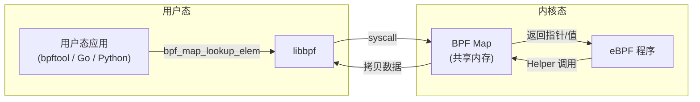
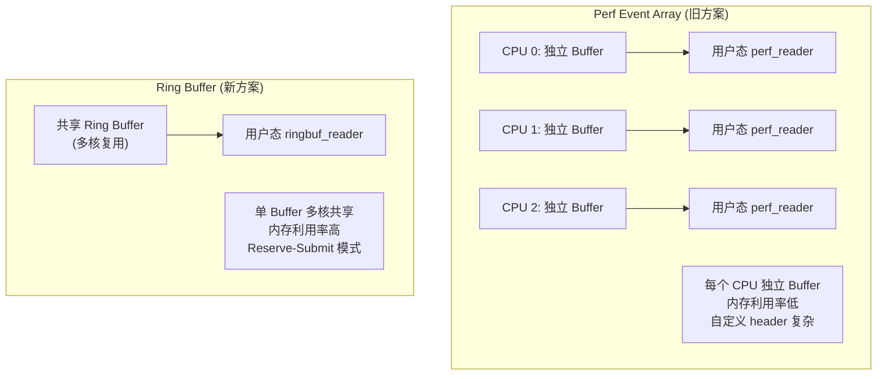
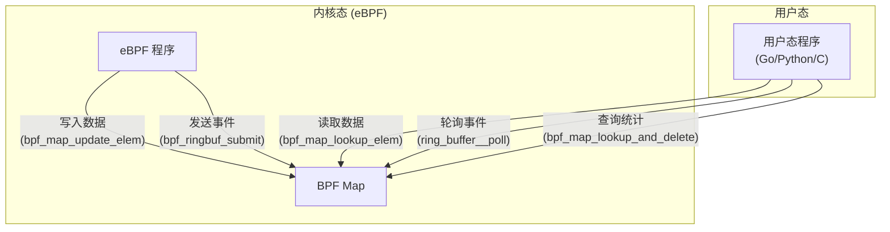
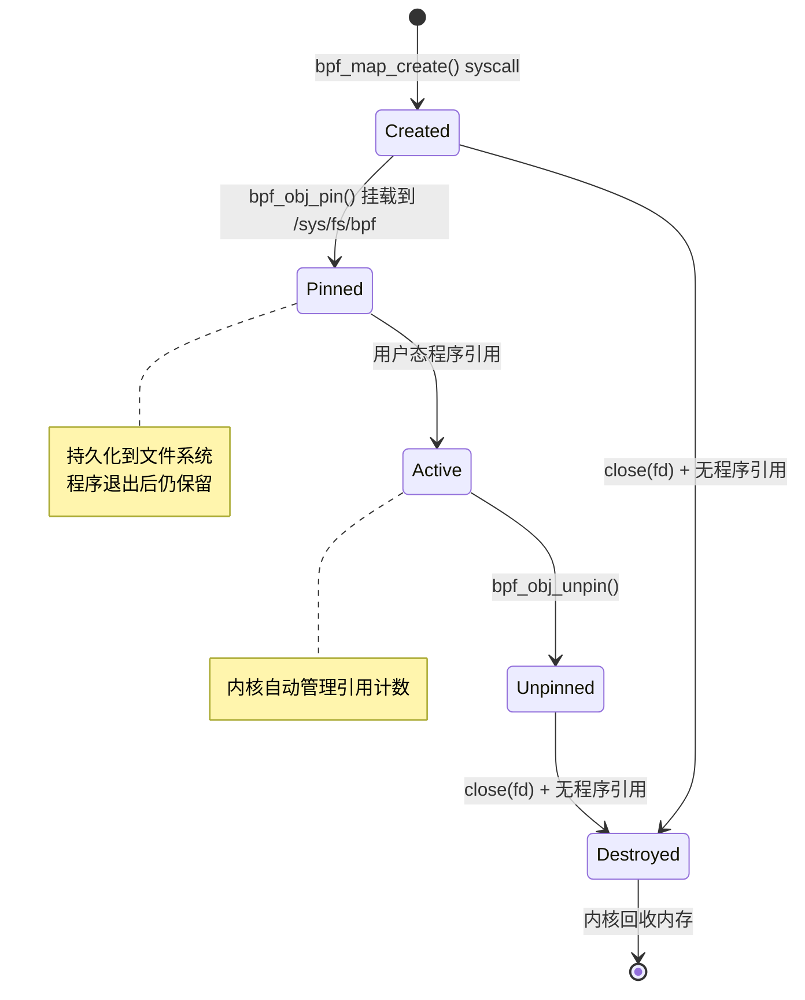

> [!info] eBPF 2026 深度探索系列
> 0. [[2026-04-08-ebpf-comprehensive-learning-roadmap|全栈学习路径总览]]
> 1. [[2026-04-08-ebpf-deep-dive-ch1-registers-and-instructions|第一章：寄存器与指令集]]
> 2. [[2026-04-08-ebpf-deep-dive-ch1-5-function-calls|第一.五章：四种函数调用与动态内存]]
> 3. [[2026-04-08-ebpf-deep-dive-ch1-6-the-verifier|第一.六章：验证器 (Verifier) 的底层逻辑]]
> 4. **第二章：Map 机制与跨空间通信**
> 5. [[2026-04-08-ebpf-deep-dive-ch2-5-kptr-and-ownership|第二.五章：kptr (内核指针) 与内存所有权模型]]
> 6. [[2026-04-08-ebpf-deep-dive-ch3-core-and-btf|第三章：CO-RE 与 BTF 的跨版本魔法]]
> 7. [[2026-04-08-ebpf-deep-dive-ch4-tracing-hooks-and-security|第四章：从 kprobe 到 LSM 的追踪全图景]]
> 8. [[2026-04-08-ebpf-deep-dive-ch7-5-uprobes-dynamic-tracing|第七.五章：uprobe 用户态动态追踪原理]]
> 9. [[2026-04-08-ebpf-deep-dive-ch7-6-bpftime-user-runtime|第七.六章：bpftime 与用户态 eBPF 加速]]
> 10. [[2026-04-08-ebpf-deep-dive-ch18-bpftime-injection-mastery|第七.七章：bpftime 自动化注入与全量监控实战]]
> 11. [[2026-04-08-ebpf-deep-dive-ch7-8-uprobe-selection-guide|第七.八章：uprobe 选型指南：内核态 vs 用户态]]
> 12. [[2026-04-08-ebpf-deep-dive-ch5-xdp-networking-performance|第五章：XDP 极致网络性能与全栈架构]]
> 13. [[2026-04-08-ebpf-deep-dive-ch6-tc-traffic-control|第六章：TC (Traffic Control) 流量调度艺术]]
> 14. [[2026-04-08-ebpf-deep-dive-ch7-security-lsm-enforcement|第七章：LSM BPF 从可观测到安全执法]]
> 15. [[2026-04-08-ebpf-deep-dive-ch8-advanced-tuning-and-profiling|第八章：进阶实战与内核调优]]
> 16. [[2026-04-08-ebpf-deep-dive-ch9-af-xdp-zero-copy|第九章：AF_XDP 零拷贝与用户态协议栈]]
> 17. [[2026-04-08-ebpf-deep-dive-ch10-sched-ext-custom-scheduler|第十章：sched_ext 自定义 CPU 调度器]]
> 18. [[2026-04-08-ebpf-deep-dive-ch11-bpf-iterators|第十一章：BPF Iterators 内核对象迭代器]]
> 19. [[2026-04-08-ebpf-deep-dive-ch12-kfuncs-evolution|第十二章：kfuncs 下一代内核交互标准]]
> 20. [[2026-04-08-ebpf-deep-dive-ch13-usdt-tracing|第十三章：USDT 用户态静态定义追踪]]
> 21. [[2026-04-08-ebpf-deep-dive-ch14-ai-llm-inference-monitoring|第十四章：AI 推理与大模型监控前沿]]
> 22. [[2026-04-08-ebpf-deep-dive-ch15-container-isolation|第十五章：无感增强容器隔离性]]
> 23. [[2026-04-08-ebpf-deep-dive-ch16-ebpf-and-wasm|第十六章：eBPF 与 WebAssembly (WASM) 的共生架构]]
> 24. [[2026-04-08-ebpf-deep-dive-ch17-storage-and-filesystem|第十七章：存储与文件系统加速]]
> 25. [[2026-04-08-ebpf-deep-dive-ch18-lifecycle-and-links|第十八章：生命周期管理与 BPF Links]]
> 26. [[2026-04-08-ebpf-deep-dive-ch19-atomic-updates-and-hot-upgrade|第十九章：程序的原子更新与蓝绿部署]]
> 27. [[2026-04-08-ebpf-deep-dive-ch25-5-stack-trace-correlation|第二五.五章：调用栈与业务请求的深度绑定]]
> 28. [[2026-04-08-ebpf-deep-dive-ch20-edge-iot-acceleration|第二十章：边缘计算与工业协议加速]]
> 29. [[2026-04-08-ebpf-deep-dive-ch21-debugging-and-verifier|第二十一章：调试实战与验证器 (Verifier) 诊断]]
> 30. [[2026-04-08-ebpf-deep-dive-ch22-testing-and-ci-cd|第二十二章：测试与持续集成 (CI/CD) 实战]]
> 31. [[2026-04-08-ebpf-deep-dive-ch23-security-and-permissions|第二十三章：权限细分与 BPF 安全沙箱]]
> 32. [[2026-04-08-ebpf-deep-dive-ch24-meta-monitoring-and-self-healing|第二十四章：eBPF 程序的内核自愈与监控]]
> 33. [[2026-04-08-ebpf-deep-dive-ch25-full-stack-observability|第二十五章：全栈可观测性与端到端追踪]]
> 34. [[2026-04-08-ebpf-deep-dive-ch26-network-security-high-level|第二十六章：网络安全防御的高阶实战]]
> 35. [[2026-04-08-ebpf-deep-dive-ch27-agent-engineering-architecture|第二十七章：工业级模块化 Agent 架构演进]]
> 36. [[2026-04-08-ebpf-deep-dive-ch28-offensive-and-defensive|第二十八章：攻防博弈与 Rootkit 防御]]
> 37. [[2026-04-08-ebpf-deep-dive-ch29-networking-deep-dive|第二十九章：网络应用深水区——负载均衡、Sockmap 与拥塞控制]]
> 38. [[2026-04-08-ebpf-deep-dive-ch30-hardware-offload|第三十章：硬件卸载与 SmartNIC 实战]]
> 39. [[2026-04-08-ebpf-deep-dive-ch31-signed-objects-and-security|第三十一章：内核原生签名与供应链安全]]
> 40. [[2026-04-08-ebpf-deep-dive-ch32-ebpf-for-windows|第三十二章：跨平台崛起——eBPF for Windows]]
> 41. [[2026-04-08-ebpf-deep-dive-ch32-5-macos-status|第三十二.五章：macOS 的特殊路径]]
> 42. [[2026-04-08-ebpf-deep-dive-ch33-serverless-optimization|第三十三章：Serverless 冷启动消除与动态计费]]
> 43. [[2026-04-08-ebpf-deep-dive-ch34-waf-and-rasp|第三十四章：Web 安全革命——内核态 WAF 与 RASP]]
> 44. [[2026-04-08-ebpf-deep-dive-ch35-npu-tpu-ai-hardware|第三十五章：AI 推理硬件 (NPU/TPU) 与硬件定义内核]]
> 45. [[2026-04-08-ebpf-deep-dive-ch36-dynamic-language-introspection|第三十六章：动态语言感知——业务对象的零代码提取]]
> 46. [[2026-04-08-ebpf-deep-dive-ch37-green-computing|第三十七章：绿色计算与能耗精准归因]]
> 47. [[2026-04-08-ebpf-deep-dive-ch38-ecosystem-and-career|第三十八章：2026 生态全景与工程师职业导航]]
> 48. [[2026-04-09-ebpf-deep-dive-ch39-rust-aya-framework|第三十九章：Rust eBPF 开发实战——Aya 框架与安全编程]]
> 49. [[2026-04-09-ebpf-deep-dive-ch40-network-protocols-deep-dive|第四十章：网络协议深度解析——TCP/UDP/QUIC 的 eBPF 视角]]
> 50. [[2026-04-09-ebpf-deep-dive-ch41-memory-safety-and-vulnerabilities|第四十一章：eBPF 内存安全与漏洞分析]]
> 51. [[2026-04-09-ebpf-deep-dive-ch42-service-mesh-integration|第四十二章：eBPF 与 Service Mesh 深度集成]]

---

## 1. 概述：eBPF 的共享存储基石

eBPF 程序不能像普通程序那样自由使用全局变量或调用 `malloc`。所有**持久化状态**和**跨空间通信**都必须通过 **Map** 完成。

Map 是内核中一段被 BPF 子系统管理的特殊内存区域，具有以下核心特征：

- **键值对存储**：通过 Key 进行 O(1) 级别的查找
- **内核态/用户态双向访问**：eBPF 程序和用户态程序可以同时读写
- **生命周期独立**：Map 可以比创建它的程序活得更久
- **类型安全**：通过 BTF 定义 Key/Value 的精确类型



---

## 2. Map 类型全景

### 2.1 分类总览

```mermaid
graph TD
    Map["BPF Map"] --> KV["键值对存储"]
    Map --> Queue["队列/栈"]
    Map --> Buf["事件缓冲"]
    Map --> Special["特殊用途"]

    KV --> Hash["HASH<br>哈希表"]
    KV --> Array["ARRAY<br>数组"]
    KV --> LRU["LRU_HASH/LRU_PERCPU_HASH<br>最近最少使用"]
    KV --> Bloom["BLOOM_FILTER<br>布隆过滤器"]

    Queue --> Stack["STACK<br>栈"]
    Queue --> PQ["QUEUE<br>队列"]

    Buf --> RingBuf["RINGBUF<br>环形缓冲区"]
    Buf --> PerfArr["PERF_EVENT_ARRAY<br>性能事件数组"]

    Special --> ProgArr["PROG_ARRAY<br>程序数组"]
    Special --> CgrpArr["CGROUP_ARRAY<br>控制组数组"]
    Special --> DevMap["DEVMAP/DEVMAP_HASH<br>设备重定向"]
    Special --> SockMap["SOCKMAP/SOCKHASH<br>Socket 映射"]
    Special --> XSK["XSKMAP/XSKMAP_PROG<br>AF_XDP Socket"]
    Special --> SpinLock["SPIN_LOCK<br>自旋锁"]
    Special --> RBTree["RB_TREE<br>红黑树"]
    Special --> CgrpStorage["CGROUP_STORAGE<br>控制组存储"]
```



### 2.2 核心类型对比

| 类型 | 查找复杂度 | 支持删除 | 线程安全 | 典型用途 |
| :--- | :--- | :--- | :--- | :--- |
| `HASH` | O(1) 平均 | ✅ | 需要 `BPF_F_LOCK` | 通用键值存储 |
| `ARRAY` | O(1) | ❌ | 需要 `BPF_F_LOCK` | 固定索引配置 |
| `PERCPU_HASH` | O(1) 平均 | ✅ | **天然安全** | 高频计数器 |
| `PERCPU_ARRAY` | O(1) | ❌ | **天然安全** | 高频配置/临时缓冲 |
| `LRU_HASH` | O(1) 平均 | ✅ 自动淘汰 | 需要 `BPF_F_LOCK` | 连接跟踪、会话缓存 |
| `RINGBUF` | N/A | N/A | 多生产者安全 | 事件上报 |
| `PERF_EVENT_ARRAY` | N/A | N/A | 每核独立 | 事件上报（旧方案） |
| `STACK` | O(1) | ✅ | 需要 `BPF_F_LOCK` | LIFO 任务队列 |
| `PROG_ARRAY` | O(1) | ✅ | N/A | Tail Call 分发 |
| `SOCKMAP` | O(1) | ✅ | N/A | Socket 重定向 |
| `BLOOM_FILTER` | O(k) | ❌ | 天然安全 | 快速成员检测 |

---

## 3. Hash Map 深度剖析

### 3.1 内部实现

内核的 BPF Hash Map 基于 **链地址法 (Separate Chaining)** 处理哈希冲突：

```text
Hash Table (bucket array):
+---+---+---+---+---+---+---+---+
| 0 | 1 | 2 | 3 | 4 | 5 | 6 | 7 |  ... (2^n buckets)
+---+---+---+---+---+---+---+---+
  |       |               |
  v       v               v
[K1,V1] [K3,V3]         [K5,V5]
  |       |               |
  v       v               v
[K2,V2] [K4,V4]         [K6,V6]
```

**关键实现细节：**

1. **预分配 (Pre-allocation)**：默认使用 `BPF_F_NO_PREALLOC` 的反向——内核在创建 Map 时预分配所有 bucket 的内存。这确保了 eBPF 程序在 NMI (Non-Maskable Interrupt) 上下文中调用 `bpf_map_lookup_elem` 时不会触发内存分配（否则可能导致死锁）。

2. **哈希函数**：使用内核的 `jhash2` 算法，对 Key 的字节进行混合计算。

3. **扩容策略**：创建时指定 `max_entries`，**运行时不会自动扩容**。如果元素数量超过限制，插入会失败（返回 `-E2BIG`）。这是有意为之的设计——避免运行时分配导致的延迟不可预测。

### 3.2 代码实战

```c
#include <vmlinux.h>
#include <bpf/bpf_helpers.h>

// 定义一个 Hash Map：PID -> 进程信息
struct process_info {
    u32 pid;
    u32 ppid;
    char comm[16];
    u64 start_time;
};

struct {
    __uint(type, BPF_MAP_TYPE_HASH);
    __uint(max_entries, 10240);
    __type(key, u32);               // Key: PID
    __type(value, struct process_info); // Value: 进程信息
    __uint(key_size, sizeof(u32));
    __uint(value_size, sizeof(struct process_info));
} process_map SEC(".maps");

SEC("tracepoint/sched/sched_process_exec")
int on_exec(struct trace_event_raw_sched_process_exec *ctx) {
    u32 pid = bpf_get_current_pid_tgid() >> 32;

    struct process_info info = {};
    info.pid = pid;
    info.ppid = bpf_get_current_pid_tgid();
    info.start_time = bpf_ktime_get_ns();
    bpf_get_current_comm(&info.comm, sizeof(info.comm));

    // 更新或插入
    long err = bpf_map_update_elem(&process_map, &pid, &info, BPF_ANY);
    if (err) {
        bpf_printk("map update failed: %ld\n", err);
    }

    return 0;
}

// 查找示例
SEC("tracepoint/syscalls/sys_enter_openat")
int on_open(struct trace_event_raw_sys_enter *ctx) {
    u32 pid = bpf_get_current_pid_tgid() >> 32;
    struct process_info *info = bpf_map_lookup_elem(&process_map, &pid);

    if (info) {
        // info 是指向 Map 内部值的指针
        // 可以直接读取，修改需要原子操作或 spin_lock
        bpf_printk("pid=%d comm=%s\n", info->pid, info->comm);
    }

    return 0;
}

char _license[] SEC("license") = "GPL";
```

---

## 4. Array Map 与 Per-CPU 变体

### 4.1 Array Map

Array Map 使用连续物理内存，通过整数索引直接寻址：

```c
struct {
    __uint(type, BPF_MAP_TYPE_ARRAY);
    __uint(max_entries, 1);
    __type(key, u32);
    __type(value, struct config);
} config_map SEC(".maps");

// 查找
u32 key = 0;
struct config *cfg = bpf_map_lookup_elem(&config_map, &key);
```

**特点：**
- 查找速度最快（直接计算偏移，无哈希计算）
- 不支持删除（不能释放某个槽位）
- 索引必须是连续的非负整数

### 4.2 Per-CPU Map：无锁并发的秘密

Per-CPU Map 是 eBPF 高性能的基石。它为每个 CPU 核心分配一份独立的副本：

```text
CPU 0: [value_0] [value_1] [value_2] ...
CPU 1: [value_0] [value_1] [value_2] ...
CPU 2: [value_0] [value_1] [value_2] ...
CPU 3: [value_0] [value_1] [value_2] ...
```

**为什么这么快？**

```mermaid
sequenceDiagram
    participant C0 as CPU 0
    participant C1 as CPU 1
    participant M as 普通 Hash Map

    Note over C0,C1: 普通 Map: 必须竞争同一把锁
    C0->>M: lock(); update(); unlock();
    M-->>C0: done (cache line bouncing!)
    C1->>M: lock(); update(); unlock();
    M-->>C1: done

    Note over C0,C1: Per-CPU Map: 各写各的
    Note over C0: CPU 0 写自己的副本 (无锁!)
    Note over C1: CPU 1 写自己的副本 (无锁!)
```

**性能对比实测（XDP 场景，PPS 级别）：**

| 方案 | 吞吐量 | 延迟 (P99) |
| :--- | :--- | :--- |
| 普通 Hash Map + `__sync_fetch_and_add` | ~15 Mpps | ~800 ns |
| Per-CPU Hash Map (直接写入) | **~30 Mpps** | **~300 ns** |
| Per-CPU Array Map (直接写入) | **~35 Mpps** | **~250 ns** |

### 4.3 Per-CPU Map 代码实战

```c
// Per-CPU 计数器
struct {
    __uint(type, BPF_MAP_TYPE_PERCPU_ARRAY);
    __uint(max_entries, 256);  // 最多 256 个协议类型
    __type(key, u32);           // 协议类型 (0-255)
    __type(value, u64);         // 包计数
} proto_counter SEC(".maps");

SEC("xdp")
int count_proto(struct xdp_md *ctx) {
    void *data = (void *)(long)ctx->data;
    void *data_end = (void *)(long)ctx->data_end;

    struct ethhdr *eth = data;
    if ((void *)(eth + 1) > data_end)
        return XDP_PASS;

    // 获取协议类型
    u32 proto = 0;
    if (eth->h_proto == bpf_htons(ETH_P_IP)) {
        struct iphdr *ip = (void *)(eth + 1);
        if ((void *)(ip + 1) <= data_end)
            proto = ip->protocol;
    }

    // Per-CPU 原子递增（无需锁！）
    u64 *count = bpf_map_lookup_elem(&proto_counter, &proto);
    if (count)
        *count += 1;

    return XDP_PASS;
}
```

> [!warning] 用户态读取 Per-CPU Map 的注意事项
> 用户态读取 Per-CPU Map 时，需要遍历所有 CPU 核心并聚合结果：
> ```c
> // 用户态代码 (C/libbpf)
> for (int cpu = 0; cpu < num_cpus; cpu++) {
>     u64 *val = bpf_map_lookup_percpu_elem(map_fd, &key, cpu);
>     if (val) total += *val;
> }
> ```

---

## 5. Ring Buffer vs Perf Event Array

### 5.1 为什么需要事件缓冲？

eBPF 程序运行在内核态，需要一种机制将数据**异步上报**到用户态。两种主要方案：

### 5.2 架构对比



### 5.3 详细对比

| 特性 | Perf Event Array | Ring Buffer |
| :--- | :--- | :--- |
| **引入版本** | Linux 4.4 | Linux 5.8 |
| **内存模型** | 每 CPU 独立 Buffer | 全局共享 Buffer |
| **内存利用率** | 低（按最大 CPU 数预分配） | **高**（按需使用） |
| **写入方式** | 一次性写入整条记录 | **Reserve → 填充 → Submit** |
| **读取方式** | perf_event_open + mmap | ring_buffer__consume |
| **数据丢失** | 满时丢弃整条记录 | 满时丢弃整条记录 |
| **自定义 Header** | 需要手动构建 | 内建支持 |
| **多生产者** | 每 CPU 独立（天然隔离） | **多核安全**（原子操作） |
| **推荐程度** | 旧项目兼容 | **2026 年首选** |

### 5.4 Ring Buffer 代码实战

**内核态（写入端）：**

```c
// 定义事件结构
struct event {
    u32 pid;
    u64 timestamp;
    u8 comm[16];
    u32 data_len;
    u8 data[0];  // 柔性数组
};

struct {
    __uint(type, BPF_MAP_TYPE_RINGBUF);
    __uint(max_entries, 256 * 1024);  // 256 KB
} events SEC(".maps");

SEC("tracepoint/syscalls/sys_enter_openat")
int on_open(struct trace_event_raw_sys_enter *ctx) {
    // Reserve 空间（非阻塞）
    struct event *e = bpf_ringbuf_reserve(&events, sizeof(*e) + 64, 0);
    if (!e)
        return 0;  // Buffer 满，丢弃

    e->pid = bpf_get_current_pid_tgid() >> 32;
    e->timestamp = bpf_ktime_get_ns();
    bpf_get_current_comm(&e->comm, sizeof(e->comm));

    // 读取文件名
    const char *filename = (const char *)ctx->args[1];
    long len = bpf_probe_read_user_str(e->data, 64, filename);
    e->data_len = len > 0 ? len : 0;

    // Submit 提交（让用户态可以读取）
    bpf_ringbuf_submit(e, 0);
    return 0;
}
```

**用户态（读取端）：**

```c
// C (libbpf)
#include <bpf/libbpf.h>
#include <bpf/bpf.h>

static int handle_event(void *ctx, void *data, size_t len) {
    struct event *e = data;
    printf("pid=%u comm=%s file=%.*s\n",
           e->pid, e->comm, e->data_len, e->data);
    return 0;
}

int main() {
    struct ring_buffer *rb = ring_buffer__new(bpf_map__fd(
        skel->maps.events), handle_event, NULL, NULL);

    while (1) {
        ring_buffer__poll(rb, -1);  // 阻塞等待
    }
}
```

---

## 6. 高级 Map 类型

### 6.1 LRU Hash Map

```c
struct {
    __uint(type, BPF_MAP_TYPE_LRU_HASH);
    __uint(max_entries, 10000);
    __type(key, struct conn_key);
    __type(value, struct conn_value);
} conntrack SEC(".maps");

// 自动淘汰最久未访问的条目
// 适用于连接跟踪、会话缓存等场景
```

**淘汰策略**：当 Map 满时，新插入的条目会挤掉最久未被 `bpf_map_lookup_elem` 或 `bpf_map_update_elem` 访问的条目。

### 6.2 Bloom Filter

```c
struct {
    __uint(type, BPF_MAP_TYPE_BLOOM_FILTER);
    __uint(max_entries, 10000);   // 预期元素数
    __type(key, u32);
} evil_ips SEC(".maps");

SEC("xdp")
int check_ip(struct xdp_md *ctx) {
    u32 ip = extract_ip(ctx);

    // O(1) 检查，可能有假阳性但不会有假阴性
    int may_exist = bpf_map_peek_elem(&evil_ips, &ip);
    if (may_exist == 0) {
        // 确定不在黑名单中
        return XDP_PASS;
    }
    // 可能在黑名单中（也可能是误报）
    // 需要进一步精确检查
    return XDP_DROP;
}
```

### 6.3 Prog Array (Tail Call 分发)

```c
struct {
    __uint(type, BPF_MAP_TYPE_PROG_ARRAY);
    __uint(max_entries, 10);
    __type(key, u32);
    __type(value, u32);
} jumps SEC(".maps");

// Tail Call 跳转到指定程序
bpf_tail_call(ctx, &jumps, stage_index);
```

### 6.4 Sockmap / Sockhash

```c
struct {
    __uint(type, BPF_MAP_TYPE_SOCKMAP);
    __uint(max_entries, 65535);
    __type(key, u32);
    __type(value, u64);
} sock_map SEC(".maps");

// 将 Socket 重定向到 eBPF 程序处理
// 绕过内核协议栈的部分路径
bpf_sk_redirect_map(skb, &sock_map, key, 0);
```

---

## 7. 内核态-用户态通信模式

### 7.1 通信架构



### 7.2 四种通信模式

| 模式 | 方向 | 延迟 | 适用场景 |
| :--- | :--- | :--- | :--- |
| **Map 读写** | 双向 | 极低 (~100ns) | 配置下发、统计聚合 |
| **Ring Buffer 事件** | 内核→用户 | 中等 (~1μs) | 日志上报、事件流 |
| **Map 事件通知** | 内核→用户 | 低 | 简单通知 |
| **Perf Event** | 内核→用户 | 中等 | 采样数据（旧方案） |

### 7.3 批量操作

```c
// 批量删除（用户态）
// BPF_MAP_LOOKUP_AND_DELETE_ELEM 一次读取并删除
// 适用于"拉取式"通信模式

// 批量更新（内核态）
// bpf_for_each_map_elem (Linux 5.13+) 遍历 Map 中所有元素
// 注意：有回调函数限制，不能在回调中调用所有 Helper
```

---

## 8. Map 生命周期管理

### 8.1 创建与销毁



**引用计数规则：**
1. 每个 `bpf()` syscall 中的 `map_fd` 增加一个引用
2. 每次 `close(map_fd)` 减少一个引用
3. 当引用计数降为 0 时，内核回收内存
4. 挂载到 `/sys/fs/bpf` 增加一个引用

### 8.2 持久化到 BPF 文件系统

```bash
# 程序退出后 Map 仍然存在
bpftool prog load xdp.o /sys/fs/bpf/my_prog

# 查看已挂载的 Map
bpftool map list
bpftool map show pinned /sys/fs/bpf/my_map

# 跨程序共享 Map
bpftool map pin id 42 /sys/fs/bpf/shared_config
```

---

## 9. 性能优化技巧

### 9.1 选择正确的 Map 类型

```
需要键值查找？
├── Key 是连续整数 → ARRAY (最快)
├── Key 是任意值 → HASH
├── 需要自动淘汰 → LRU_HASH
└── 只需判断存在性 → BLOOM_FILTER

需要事件上报？
├── 2026 年新项目 → RINGBUF (推荐)
└── 兼容旧内核 → PERF_EVENT_ARRAY

需要高频计数？
└── PERCPU_ARRAY 或 PERCPU_HASH (无锁)

需要跨程序通信？
├── 函数跳转 → PROG_ARRAY
└── Socket 处理 → SOCKMAP
```

### 9.2 减少 Map 查找次数

```c
// ❌ 低效：循环内重复查找
for (int i = 0; i < n; i++) {
    struct config *c = bpf_map_lookup_elem(&config, &key);
    if (c) process(c->threshold);
}

// ✅ 高效：循环外缓存
struct config *c = bpf_map_lookup_elem(&config, &key);
if (!c) return 0;
for (int i = 0; i < n; i++) {
    process(c->threshold);  // c 保持在寄存器中
}
```

### 9.3 合理规划 Map 大小

```c
// ❌ 过大：浪费内存
__uint(max_entries, 1000000);  // 100 万条，但实际只用 100 条

// ✅ 合理：根据实际使用量设置，预留 2-4x 余量
__uint(max_entries, 4096);  // 预期 1000 条，4x 余量
```

### 9.4 使用 BPF_F_LOCK 的 spin_lock

```c
struct value_with_lock {
    struct bpf_spin_lock lock;
    u64 counter;
    u32 flags;
};

struct {
    __uint(type, BPF_MAP_TYPE_HASH);
    __uint(max_entries, 1024);
    __type(key, u32);
    __type(value, struct value_with_lock);
} locked_map SEC(".maps");

SEC("kprobe/do_sys_open")
int update_counter(struct pt_regs *ctx) {
    u32 key = 0;
    struct value_with_lock *v = bpf_map_lookup_elem(&locked_map, &key);
    if (!v) return 0;

    // 获取自旋锁
    bpf_spin_lock(&v->lock);
    v->counter += 1;
    v->flags |= 0x1;
    bpf_spin_unlock(&v->lock);

    return 0;
}
```

> [!warning] Spin Lock 使用限制
> 1. 必须在同一个 CPU 上 lock 和 unlock（不能跨 CPU 传递锁）
> 2. 持锁期间不能调用任何可能睡眠的 Helper
> 3. 持锁期间不能调用 `bpf_map_lookup_elem`（可能导致死锁）

---

## 10. 常见问题 FAQ

**Q1: Map 的 Key/Value 大小有限制吗？**

有限制。Key 最大 480 字节，Value 最大约 48KB（取决于内核版本）。但实际建议 Key 控制在 64 字节以内，Value 控制在 4KB 以内——过大的 Key/Value 会降低哈希计算效率。

**Q2: 可以在 eBPF 程序中动态创建 Map 吗？**

不可以。所有 Map 必须在程序加载前通过 libbpf 定义好。这是 Verifier 的要求——它需要在编译时就知道所有 Map 的类型和大小。

**Q3: Map 数据会持久化到磁盘吗？**

默认不会。程序退出后 Map 被销毁。如果需要持久化，可以：
1. 使用 `bpftool map pin` 挂载到 `/sys/fs/bpf`
2. 在用户态定期将 Map 数据写回文件
3. 使用 `BTF_MAP_TYPE_ARENA`（实验性）进行持久化

**Q4: Per-CPU Map 在容器环境中会怎样？**

Per-CPU Map 的大小取决于**运行时可见的 CPU 数量**。在容器中，如果 `cpuset` 限制了可用的 CPU 核心数，Per-CPU Map 的内存会按限制后的 CPU 数分配。迁移到另一个节点时（如果 CPU 数不同），Map 大小可能不匹配，导致程序加载失败。CO-RE 机制无法解决此问题。

**Q5: Ring Buffer 和 Perf Event Array 可以共存吗？**

可以。同一个 eBPF 程序可以同时使用两种 Buffer。实际上很多生产系统会同时使用 Ring Buffer（用于高频事件流）和普通 Map（用于配置和聚合统计）。选择哪种取决于数据特性：
- **高频、小数据、允许丢失**：Ring Buffer
- **低频、大数据、需要可靠传输**：Map + 轮询
