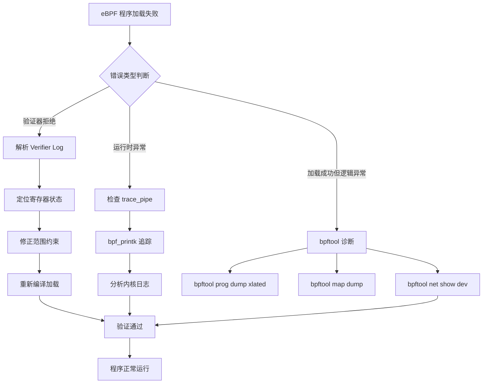
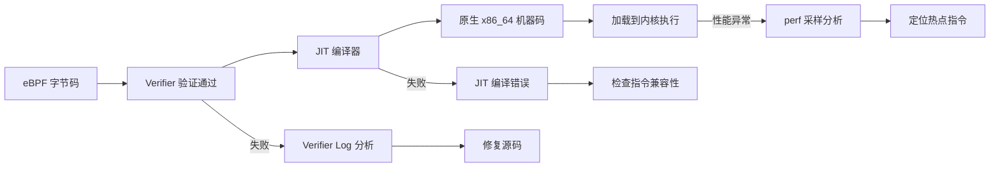
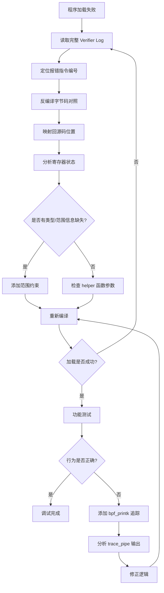

> [!info] eBPF 2026 深度探索系列
> 0. [[2026-04-08-ebpf-comprehensive-learning-roadmap|全栈学习路径总览]]
> 1. [[2026-04-08-ebpf-deep-dive-ch1-registers-and-instructions|第一章：寄存器与指令集]]
> 2. [[2026-04-08-ebpf-deep-dive-ch1-5-function-calls|第一.五章：四种函数调用与动态内存]]
> 3. [[2026-04-08-ebpf-deep-dive-ch1-6-the-verifier|第一.六章：验证器 (Verifier) 的底层逻辑]]
> 4. [[2026-04-08-ebpf-deep-dive-ch2-maps-and-communication|第二章：Map 机制与跨空间通信]]
> 5. [[2026-04-08-ebpf-deep-dive-ch2-5-kptr-and-ownership|第二.五章：kptr (内核指针) 与内存所有权模型]]
> 6. [[2026-04-08-ebpf-deep-dive-ch3-core-and-btf|第三章：CO-RE 与 BTF 的跨版本魔法]]
> 7. [[2026-04-08-ebpf-deep-dive-ch4-tracing-hooks-and-security|第四章：从 kprobe 到 LSM 的追踪全图景]]
> 8. [[2026-04-08-ebpf-deep-dive-ch7-5-uprobes-dynamic-tracing|第七.五章：uprobe 用户态动态追踪原理]]
> 9. [[2026-04-08-ebpf-deep-dive-ch7-6-bpftime-user-runtime|第七.六章：bpftime 与用户态 eBPF 加速]]
> 10. [[2026-04-08-ebpf-deep-dive-ch18-bpftime-injection-mastery|第七.七章：bpftime 自动化注入与全量监控实战]]
> 11. [[2026-04-08-ebpf-deep-dive-ch7-8-uprobe-selection-guide|第七.八章：uprobe 选型指南：内核态 vs 用户态]]
> 12. [[2026-04-08-ebpf-deep-dive-ch5-xdp-networking-performance|第五章：XDP 极致网络性能与全栈架构]]
> 13. [[2026-04-08-ebpf-deep-dive-ch6-tc-traffic-control|第六章：TC (Traffic Control) 流量调度艺术]]
> 14. [[2026-04-08-ebpf-deep-dive-ch7-security-lsm-enforcement|第七章：LSM BPF 从可观测到安全执法]]
> 15. [[2026-04-08-ebpf-deep-dive-ch8-advanced-tuning-and-profiling|第八章：进阶实战与内核调优]]
> 16. [[2026-04-08-ebpf-deep-dive-ch9-af-xdp-zero-copy|第九章：AF_XDP 零拷贝与用户态协议栈]]
> 17. [[2026-04-08-ebpf-deep-dive-ch10-sched-ext-custom-scheduler|第十章：sched_ext 自定义 CPU 调度器]]
> 18. [[2026-04-08-ebpf-deep-dive-ch11-bpf-iterators|第十一章：BPF Iterators 内核对象迭代器]]
> 19. [[2026-04-08-ebpf-deep-dive-ch12-kfuncs-evolution|第十二章：kfuncs 下一代内核交互标准]]
> 20. [[2026-04-08-ebpf-deep-dive-ch13-usdt-tracing|第十三章：USDT 用户态静态定义追踪]]
> 21. [[2026-04-08-ebpf-deep-dive-ch14-ai-llm-inference-monitoring|第十四章：AI 推理与大模型监控前沿]]
> 22. [[2026-04-08-ebpf-deep-dive-ch15-container-isolation|第十五章：无感增强容器隔离性]]
> 23. [[2026-04-08-ebpf-deep-dive-ch16-ebpf-and-wasm|第十六章：eBPF 与 WebAssembly (WASM) 的共生架构]]
> 24. [[2026-04-08-ebpf-deep-dive-ch17-storage-and-filesystem|第十七章：存储与文件系统加速]]
> 25. [[2026-04-08-ebpf-deep-dive-ch18-lifecycle-and-links|第十八章：生命周期管理与 BPF Links]]
> 26. [[2026-04-08-ebpf-deep-dive-ch19-atomic-updates-and-hot-upgrade|第十九章：程序的原子更新与蓝绿部署]]
> 27. [[2026-04-08-ebpf-deep-dive-ch25-5-stack-trace-correlation|第二五.五章：调用栈与业务请求的深度绑定]]
> 28. [[2026-04-08-ebpf-deep-dive-ch20-edge-iot-acceleration|第二十章：边缘计算与工业协议加速]]
> 29. **第二十一章：调试实战与验证器 (Verifier) 诊断**
> 30. [[2026-04-08-ebpf-deep-dive-ch22-testing-and-ci-cd|第二十二章：测试与持续集成 (CI/CD) 实战]]
> 31. [[2026-04-08-ebpf-deep-dive-ch23-security-and-permissions|第二十三章：权限细分与 BPF 安全沙箱]]
> 32. [[2026-04-08-ebpf-deep-dive-ch24-meta-monitoring-and-self-healing|第二十四章：eBPF 程序的内核自愈与监控]]
> 33. [[2026-04-08-ebpf-deep-dive-ch25-full-stack-observability|第二十五章：全栈可观测性与端到端追踪]]
> 34. [[2026-04-08-ebpf-deep-dive-ch26-network-security-high-level|第二十六章：网络安全防御的高阶实战]]
> 35. [[2026-04-08-ebpf-deep-dive-ch27-agent-engineering-architecture|第二十七章：工业级模块化 Agent 架构演进]]
> 36. [[2026-04-08-ebpf-deep-dive-ch28-offensive-and-defensive|第二十八章：攻防博弈与 Rootkit 防御]]
> 37. [[2026-04-08-ebpf-deep-dive-ch29-networking-deep-dive|第二十九章：网络应用深水区——负载均衡、Sockmap 与拥塞控制]]
> 38. [[2026-04-08-ebpf-deep-dive-ch30-hardware-offload|第三十章：硬件卸载与 SmartNIC 实战]]
> 39. [[2026-04-08-ebpf-deep-dive-ch31-signed-objects-and-security|第三十一章：内核原生签名与供应链安全]]
> 40. [[2026-04-08-ebpf-deep-dive-ch32-ebpf-for-windows|第三十二章：跨平台崛起——eBPF for Windows]]
> 41. [[2026-04-08-ebpf-deep-dive-ch32-5-macos-status|第三十二.五章：macOS 的特殊路径]]
> 42. [[2026-04-08-ebpf-deep-dive-ch33-serverless-optimization|第三十三章：Serverless 冷启动消除与动态计费]]
> 43. [[2026-04-08-ebpf-deep-dive-ch34-waf-and-rasp|第三十四章：Web 安全革命——内核态 WAF 与 RASP]]
> 44. [[2026-04-08-ebpf-deep-dive-ch35-npu-tpu-ai-hardware|第三十五章：AI 推理硬件 (NPU/TPU) 与硬件定义内核]]
> 45. [[2026-04-08-ebpf-deep-dive-ch36-dynamic-language-introspection|第三十六章：动态语言感知——业务对象的零代码提取]]
> 46. [[2026-04-08-ebpf-deep-dive-ch37-green-computing|第三十七章：绿色计算与能耗精准归因]]
> 47. [[2026-04-08-ebpf-deep-dive-ch38-ecosystem-and-career|第三十八章：2026 生态全景与工程师职业导航]]
> 48. [[2026-04-09-ebpf-deep-dive-ch39-rust-aya-framework|第三十九章：Rust eBPF 开发实战——Aya 框架与安全编程]]
> 49. [[2026-04-09-ebpf-deep-dive-ch40-network-protocols-deep-dive|第四十章：网络协议深度解析——TCP/UDP/QUIC 的 eBPF 视角]]
> 50. [[2026-04-09-ebpf-deep-dive-ch41-memory-safety-and-vulnerabilities|第四十一章：eBPF 内存安全与漏洞分析]]
> 51. [[2026-04-09-ebpf-deep-dive-ch42-service-mesh-integration|第四十二章：eBPF 与 Service Mesh 深度集成]]
---

## 1. 概述：当内核拒绝你的代码

eBPF 开发中最具挑战性的环节通常不是逻辑实现，而是如何通过验证器（Verifier）的安全性审查。验证器报错往往意味着你的程序在某种极端执行路径下存在崩溃风险。

验证器本质上是一个**静态分析引擎**，它会模拟 eBPF 指令的每一条可能执行路径，追踪寄存器类型和值的范围，确保程序不会：

- 访问越界内存
- 解引用空指针
- 泄露内核地址
- 产生无限循环
- 调用不合法的辅助函数

在 2026 年，掌握一套系统化的调试方法论，是高效开发 eBPF 程序的先决条件。本章将覆盖从**验证器日志解读**到**JIT 调试**的完整调试链路。

### 调试流程总览



---

## 2. 验证器日志深度解析

当加载失败时，内核会输出一段汇编级的执行路径模拟日志。这些日志是理解验证器拒绝原因的核心线索。

### 2.1 开启详细验证器日志

默认情况下，验证器日志可能被截断。开启完整日志的方法：

```bash
# 方法 1：通过 sysctl 临时开启（推荐调试时使用）
sudo sysctl -w kernel.bpf_stats_enabled=1

# 方法 2：增加 bpf verifier log 的缓冲区大小
# 在加载程序时，libbpf 会自动尝试分配足够大的日志缓冲区
# 也可以手动指定：
sudo bpftool prog load my_prog.bpf.o /sys/fs/bpf/my_prog \
    verifier-log-size 16777216  # 16MB 日志缓冲区

# 方法 3：查看 dmesg 中的验证器输出
sudo dmesg | grep -A 50 'bpf:'
```

### 2.2 日志结构解读

验证器日志的典型结构分为三个阶段：

```
; func#0 @0
0: R1=ctx(off=0,imm=0) R10=fp0
; if (skb->protocol == ETH_P_IP)
1: (18) r1 = 0xffff000000000000   ; 常量加载
2: (61) r1 = *(u32 *)(r10 -4)     ; 从栈上读取
3: (15) if r1 == 0x8 commit 4     ; 条件分支
4: R1=inv(id=0,umax_value=4294967295,var_off=(0x0; 0xffffffff))
```

每行的含义：

| 字段 | 含义 |
|------|------|
| 行号 (如 `0:`, `1:`) | 指令在程序中的位置 |
| 括号内数字 (如 `(18)`) | eBPF 指令 opcode |
| `R1=ctx` | R1 寄存器类型为 context |
| `R10=fp0` | R10 为帧指针（frame pointer），偏移为 0 |
| `inv(id=0,umax_value=...)` | 寄存器为不可知标量（invalid），包含值域范围 |
| `commit N` | 条件跳转的目标指令号 |

### 2.3 典型报错：空指针异常

**C 代码：**
```c
struct val *v = bpf_map_lookup_elem(&map, &key);
u32 data = v->data; // ❌ 未检查 v 是否为 NULL
```

**验证器日志：**
```
R0=map_value_or_null(map=...,off=0)
access to map_value_or_null ptr 'R0' without null check
```

**诊断**：验证器将 `bpf_map_lookup_elem` 的返回寄存器 R0 标记为 `map_value_or_null` 类型。在通过 `if (v)` 检查前，禁止一切偏移访问。验证器在每条执行路径上都要求空指针被显式检查。

**修复：**
```c
struct val *v = bpf_map_lookup_elem(&map, &key);
if (!v)
    return TC_ACT_OK; // ✅ 显式空指针检查
u32 data = v->data;
```

### 2.4 典型报错：标量运算与指针混淆

```
R1 type=inv expected=ptr
math between pointer and scalar
```

**原因**：你尝试对一个指针增加一个"来源不明"的变量，验证器无法确定运算结果是否仍在合法内存范围内。

**修复对策**：使用掩码操作显式约束变量范围：
```c
// ❌ 错误：offset 来源不明确
void *ptr = base + offset;
u8 val = *(u8 *)ptr;

// ✅ 正确：通过掩码约束 offset 范围
u32 bounded_offset = offset & 0xFF;  // 最大 255
void *ptr = base + bounded_offset;
if (bounded_offset >= MAX_SIZE)
    return 0;
u8 val = *(u8 *)ptr;
```

### 2.5 典型报错：栈读取越界

```
invalid read from stack off=-8 size=8
```

**原因**：eBPF 栈大小为 512 字节，且只能以 1/2/4/8 字节对齐的方式访问。访问偏移量超过 512 或未对齐时会被拒绝。

**修复：**
```c
// ❌ 错误：偏移超出栈范围
bpf_probe_read_kernel(buf, 256, (void *)addr);  // buf 占 256 字节
u64 extra;  // 可能把栈撑爆

// ✅ 正确：使用 map 存储大数据
struct bpf_map_def SEC(".maps") tmp_map = {
    .type = BPF_MAP_TYPE_ARRAY,
    .key_size = sizeof(u32),
    .value_size = 1024,
    .max_entries = 1,
};
```

### 2.6 典型报错：环路复杂度超限

```
BPF program is too large. Processed X insn, Y last insn
complexity limit reached
```

**原因**：验证器的时间复杂度约为 O(instrs^2)。当指令数超过 ~100 万条（由验证器探索的路径数决定）时，会触发复杂度上限。

**修复策略**：
1. 使用 `static __noinline` 拆分函数为子程序
2. 减少嵌套循环和深层条件分支
3. 提前返回，减少探索路径数

---

## 3. bpftool 诊断命令大全

`bpftool` 是 eBPF 调试的核心瑞士军刀，提供从程序反汇编到 Map 状态查询的完整诊断能力。

### 3.1 反编译与字节码查看

```bash
# 查看已加载程序的汇编指令（经过编译器优化后的真实指令）
bpftool prog dump xlated id <ID>

# 带行号信息反汇编（需要编译时保留 debug 信息）
bpftool prog dump xlated id <ID> linum

# 查看 JIT 编译后的原生机器码
bpftool prog dump jited id <ID>

# 查看 JIT 编译后的机器码（带反汇编注释）
bpftool prog dump jited id <ID> opcodes

# 查看程序的 BTF 类型信息
bpftool prog dump xlated id <ID> visual
```

### 3.2 程序状态查询

```bash
# 列出系统中所有已加载的 eBPF 程序
bpftool prog list

# 查看指定程序的详细信息
bpftool prog show id <ID>

# 查看程序的运行时统计（需要内核 bpf_stats_enabled=1）
bpftool prog show id <ID> --json | jq '.'

# 查看 XDP 程序的网络设备绑定
bpftool net show dev eth0
```

### 3.3 Map 诊断

```bash
# 列出所有 Map
bpftool map list

# 导出 Map 全部内容
bpftool map dump id <MAP_ID>

# 导出 Map 单个 key 的值
bpftool map lookup id <MAP_ID> key <KEY_HEX>

# 查看 Map 的详细元信息（类型、键值大小、条目数等）
bpftool map show id <MAP_ID>

# 更新 Map 条目（调试时手动修改状态）
bpftool map update id <MAP_ID> key <KEY_HEX> value <VALUE_HEX>

# 查看 Map 的关联程序
bpftool map show pinned /sys/fs/bpf/my_map
```

### 3.4 链路与挂载点诊断

```bash
# 查看 cgroup attach 的 BPF 程序
bpftool cgroup list /sys/fs/cgroup/

# 查看 perf event 关联的程序
bpftool perf list

# 查看所有 BPF Links
bpftool link list

# 查看 BTF 信息
bpftool btf list
bpftool btf dump id <BTF_ID>
```

### 3.5 特定场景诊断命令速查

```bash
# XDP 调试：查看网卡的 XDP 程序
bpftool net show dev eth0 type xdp

# TC 调试：查看 tc-filter 绑定的程序
tc filter show dev eth0 ingress
tc filter show dev eth0 egress

# Tracing 调试：查看已挂载的 kprobe/uprobe
bpftool prog list | grep -i trace
bpftool perf show

# LSM 调试：查看 LSM BPF 程序
bpftool prog list | grep -i lsm
```

---

## 4. bpftrace / BCC 调试技巧

bpftrace 和 BCC 是快速原型开发和动态调试的利器，适用于不需要预编译的临时调试场景。

### 4.1 bpftrace 快速调试

bpftrace 提供 awk 风格的单行命令，可以快速挂载探针并打印信息：

```bash
# 追踪函数调用参数
sudo bpftrace -e 'kprobe:vfs_read { printf("pid=%d comm=%s count=%d\n", pid, comm, arg2); }'

# 追踪函数返回值
sudo bpftrace -e 'kretprobe:vfs_read /retval < 0/ { printf("read error: %d\n", retval); }'

# 追踪特定 PID 的所有内核函数调用
sudo bpftrace -e 'kprobe:* /pid == 1234/ { printf("%s\n", comm); }'

# 统计函数调用频率（类似 top）
sudo bpftrace -e 'tracepoint:sched:sched_switch { @switches[comm] = count(); }'

# 追踪 uprobe（用户态函数）
sudo bpftrace -e 'uprobe:/usr/lib/x86_64-linux-gnu/libc.so.6:malloc { printf("malloc size=%d\n", arg0); }'

# 追踪 USDT 探针
sudo bpftrace -e 'usdt:/usr/bin/python3:function__entry { printf("entry: %s\n", arg0); }'
```

### 4.2 bpftrace 内置变量

| 变量 | 含义 |
|------|------|
| `pid` | 当前进程 PID |
| `tid` | 当前线程 TID |
| `comm` | 进程名 |
| `nsecs` | 纳秒级时间戳 |
| `cpu` | 当前 CPU 编号 |
| `retval` | 返回值（kretprobe） |
| `arg0` ~ `arg5` | 函数参数 |
| `curtask` | 当前 task_struct 指针 |
| `rand` | 随机数（用于采样） |

### 4.3 BCC 工具集常用命令

BCC 提供了大量预构建的工具，可以直接用于系统级调试：

```bash
# execsnoop：追踪新进程创建
sudo execsnoop-bpfcc

# opensnoop：追踪文件打开操作
sudo opensnoop-bpfcc

# biolatency：统计块设备 I/O 延迟
sudo biolatency-bpfcc

# tcplife：追踪 TCP 连接生命周期
sudo tcplife-bpfcc

# trace：通用函数追踪（类似 bpftrace 但更灵活）
sudo trace-bpfcc 'do_sys_open "%s", arg2'

# argdist：函数参数分布统计
sudo argdist-bpfcc 'p:c:sock_alloc_file() #count()'

# killsnoop：追踪进程被 kill 的事件
sudo killsnoop-bpfcc
```

### 4.4 bpftrace 与 BCC 的对比选择

| 维度 | bpftrace | BCC |
|------|----------|-----|
| 上手难度 | 低（单行命令） | 中（需写 Python/C） |
| 灵活性 | 中（受限的表达式） | 高（完整编程语言） |
| 性能开销 | 略高（运行时编译） | 较低（可预编译） |
| 适用场景 | 快速原型、临时调试 | 生产级工具开发 |
| 数据聚合 | 内置 map 统计 | 需手动实现 |
| 复杂逻辑 | 不支持复杂控制流 | 支持完整 C 逻辑 |

---

## 5. 常见验证器拒绝原因与修复方案

以下总结了 2026 年 eBPF 开发中遇到频率最高的验证器拒绝场景及其修复方法。

### 5.1 未约束的变量范围

这是验证器拒绝的头号原因。当程序从外部数据（报文、Map、用户空间）读取一个值后，直接用它做内存访问或指针运算，验证器无法确认安全性。

```c
// ❌ 报错：R0 unbounded memory access
u32 offset = data->offset;
u8 *ptr = base + offset;
u8 val = *ptr;

// ✅ 修复方案 1：显式边界检查
u32 offset = data->offset;
if (offset >= MAX_BUF_SIZE)
    return -EINVAL;
u8 *ptr = base + offset;
u8 val = *ptr;

// ✅ 修复方案 2：掩码约束
u32 offset = data->offset & 0xFFF;  // 约束到 0-4095
u8 *ptr = base + offset;
u8 val = *ptr;
```

### 5.2 Helper 函数参数类型错误

```c
// ❌ 报错：invalid indirect read from stack
char buf[64];
bpf_probe_read_user(buf, 64, (void *)addr);
bpf_get_current_comm(buf, 64);  // 第二个参数应为任务名缓冲区大小
```

**诊断**：某些 helper 函数要求参数来自特定来源（如必须从 `ctx` 派生），传入栈变量会触发类型不匹配。

### 5.3 Context 字段访问权限问题

```c
// ❌ 报错：cannot read field from ctx
SEC("xdp")
int my_prog(struct xdp_md *ctx) {
    void *data_end = (void *)(long)ctx->data_end;
    void *data = (void *)(long)ctx->data;
    struct ethhdr *eth = data;  // ❌ 未检查边界
    u16 proto = eth->h_proto;   // 可能越界
}

// ✅ 修复：先做边界检查
SEC("xdp")
int my_prog(struct xdp_md *ctx) {
    void *data_end = (void *)(long)ctx->data_end;
    void *data = (void *)(long)ctx->data;
    struct ethhdr *eth = data;
    if ((void *)(eth + 1) > data_end)  // ✅ 确保结构体在合法范围内
        return XDP_DROP;
    u16 proto = eth->h_proto;
    // ...
}
```

### 5.4 Map 值类型不一致

```c
// ❌ 报错：invalid access to map value
struct value_a { u32 x; };
struct value_b { u64 y; };

struct value_a *a = bpf_map_lookup_elem(&map, &key);
struct value_b *b = (struct value_b *)a;  // ❌ 类型不匹配
u64 val = b->y;
```

**修复**：始终确保 Map 的值类型与定义时一致。如果需要存储不同类型的数据，使用联合体（union）：

```c
union val {
    struct value_a a;
    struct value_b b;
};
```

### 5.5 32 位子寄存器截断问题

eBPF 是 64 位架构，但某些操作只修改 32 位子寄存器。验证器会追踪完整 64 位状态：

```c
// ❌ 报错：寄存器高 32 位状态未知
u32 val = *(u32 *)ptr;
u64 full = val;  // 高 32 位为零，但验证器可能在复杂路径上丢失此信息

// ✅ 修复：显式清零高 32 位
u64 full = (u64)*(u32 *)ptr;  // 强制转换确保高 32 位为零
```

### 5.6 未初始化的栈变量

```c
// ❌ 报错：read from uninitialized stack
u8 buf[64];
// 忘记初始化 buf
bpf_skb_store_bytes(skb, 0, buf, 64, 0);  // buf 内容未定义
```

**修复**：始终用 `__builtin_memset` 或 `memset` 初始化栈缓冲区：

```c
u8 buf[64];
__builtin_memset(buf, 0, sizeof(buf));  // ✅ 显式初始化
```

### 5.7 验证器拒绝原因速查表

| 报错信息 | 根因 | 修复方向 |
|----------|------|----------|
| `R0 invalid mem access 'map_value_or_null'` | 未做空指针检查 | 添加 `if (!ptr) return;` |
| `math between pointer and scalar` | 指针运算中的偏移未约束 | 掩码或范围检查 |
| `invalid read from stack off=X size=Y` | 栈访问越界或未对齐 | 检查偏移和对齐 |
| `BPF program is too large` | 验证复杂度超限 | `__noinline` 拆分函数 |
| `unknown func` | Helper 函数不存在或版本不兼容 | 检查内核版本与 BTF |
| `invalid access to map value` | Map 值类型不匹配 | 统一类型定义 |
| `R1 type=inv expected=ptr` | 参数类型不是指针 | 检查参数来源 |
| `call to unknown helper` | 程序类型不允许该 helper | 检查 prog_type 约束 |
| `unbounded memory access` | 内存访问偏移未约束 | 添加边界检查 |
| `misaligned stack access` | 栈访问未按 1/2/4/8 对齐 | 调整偏移量对齐 |

---

## 6. JIT 调试

eBPF 程序在通过验证器后会被 JIT（Just-In-Time）编译器翻译为原生机器码。JIT 编译本身也可能引入问题，或者你需要验证 JIT 生成的代码是否符合预期。

### 6.1 查看 JIT 编译结果

```bash
# 查看原生机器码（十六进制 + 反汇编）
bpftool prog dump jited id <ID> opcodes

# 输出示例：
# f3 0f 1e fa           endbr64
# 31 c0                 xor eax, eax
# ...

# 查看带符号的 JIT 反汇编
bpftool prog dump jited id <ID> | llvm-objdump -d -b binary -m x86-64 -
```

### 6.2 JIT 调试流程



### 6.3 JIT 编译模式

```bash
# 查看当前 JIT 模式
cat /proc/sys/net/core/bpf_jit_enable
# 0 = 解释执行（纯 eBPF VM）
# 1 = JIT 编译（默认）
# 2 = JIT 编译 + 记录编译信息

# 开启 JIT 调试记录（需要内核编译时开启 CONFIG_BPF_JIT_ALWAYS_ON）
sudo sysctl -w net.core.bpf_jit_enable=2

# 查看 JIT 编译日志
sudo cat /proc/kallsyms | grep bpf_jit
```

### 6.4 JIT 性能分析

当 eBPF 程序运行缓慢时，可能需要分析 JIT 生成的机器码质量：

```bash
# 使用 perf 分析 eBPF 程序的热点
sudo perf record -e cycles:k -a -- sleep 5
sudo perf report

# 查看特定 BPF 程序的指令统计
bpftool prog show id <ID>
# 输出中的 run_cnt / run_time_ns 可以计算每条调用的平均耗时

# 内核 6.x+ 支持 bpf_prog_test_run 进行用户态基准测试
bpftool prog run id <ID> data_in <hex_data> data_out <out_file> repeat 10000
```

### 6.5 常见 JIT 问题

**问题 1：JIT 编译后性能反而下降**

某些 eBPF 指令序列在 JIT 后生成的机器码效率不如预期。常见原因：
- 验证器强制插入的安全边界检查增加了开销
- 指令调度不利于 CPU 流水线
- 分支预测失败率高

**排查方法**：
```bash
# 对比字节码和 JIT 机器码的指令数量
bpftool prog dump xlated id <ID> | wc -l
bpftool prog dump jited id <ID> | wc -l

# 如果 JIT 指令数远多于 eBPF 指令数，说明有大量边界检查展开
```

**问题 2：特定架构上 JIT 失败**

```bash
# 检查架构是否支持 JIT
cat /sys/kernel/debug/tracing/available_filter_functions | head
# 如果 eBPF 程序使用了特定于某个架构的指令，在其他架构上可能 JIT 失败
```

---

## 7. 高级调试场景

### 7.1 跨内核版本兼容性调试

CO-RE（Compile Once, Run Everywhere）的核心理念是编译一次、到处运行，但实际中仍然会遇到兼容性问题。

```bash
# 检查目标内核的 BTF 信息
bpftool btf dump file /sys/kernel/btf/vmlinux format c > vmlinux.h

# 检查字段偏移差异
bpftool btf dump file /sys/kernel/btf/vmlinux | grep 'struct task_struct'

# 使用 libbpf 的 CO-RE 重定位日志
BPF_LOG_LEVEL=debug sudo ./my_bpf_tool 2>&1 | grep -i reloc
```

### 7.2 内存泄漏调试

eBPF 程序中的内存泄漏通常表现为 Map 条目无限增长：

```bash
# 监控 Map 条目数变化
watch -n 1 'bpftool map show id <MAP_ID>'

# 使用 bpf_iter 遍历 Map 内容
bpftool map dump id <MAP_ID> | wc -l

# 诊断脚本：定期检查 Map 增长速率
while true; do
    echo "$(date): $(bpftool map show id <MAP_ID> -j | jq '.[0].entries')"
    sleep 5
done
```

### 7.3 竞态条件调试

多 CPU 并发访问共享 Map 时可能出现竞态条件：

```bash
# 启用 BPF 统计
sudo sysctl -w kernel.bpf_stats_enabled=1

# 查看每个 CPU 上的程序运行次数
bpftool prog show id <ID> --json | jq '.run_cnt, .run_time_ns'

# 使用 bpf_spin_lock 保护共享数据
# 在 C 代码中：
struct shared_data {
    struct bpf_spin_lock lock;
    u64 counter;
};
```

---

## 8. 调试工作流最佳实践

### 8.1 系统化调试流程



### 8.2 开发环境配置建议

```bash
# /etc/sysctl.d/99-bpf-debug.conf
# eBPF 调试相关内核参数
kernel.bpf_stats_enabled = 1           # 启用程序运行统计
kernel.kptr_restrict = 0               # 允许非 root 查看内核指针（调试用）
kernel.unprivileged_bpf_disabled = 0   # 允许非特权用户加载 BPF（仅开发环境）

# 应用配置
sudo sysctl --system
```

### 8.3 VS Code / IDE 调试集成

推荐的 eBPF 开发环境配置：

1. **clangd**：通过 `compile_commands.json` 提供 eBPF 代码补全和语法检查
2. **BPF CO-RE snippets**：VS Code 扩展，提供 eBPF 代码模板
3. **llvm-bpf-verify**：编译后自动运行验证器检查

```json
// .vscode/settings.json
{
    "clangd.arguments": [
        "--query-driver=/usr/bin/clang"
    ],
    "files.associations": {
        "*.bpf.c": "c"
    }
}
```

---

## 9. 常见问题 FAQ

### Q1：验证器说 "too many instructions" 但我的代码明明不到 100 万条指令？

验证器的复杂度是按**探索路径数**计算的，不是按源代码指令数。每一条条件分支都会让路径数翻倍。例如 20 层嵌套的 `if-else` 就会产生 2^20 = ~100 万条路径。解决方法是用 `static __noinline` 拆分函数，或减少深层嵌套。

### Q2：为什么在内核 5.x 上能加载的程序在 6.x 上被拒绝？

内核版本升级会带来验证器策略的收紧。常见变化包括：
- **6.1+**：更严格的 kptr 引用计数检查
- **6.3+**：加强了 `bpf_probe_read_kernel` 的内存边界验证
- **6.5+**：新的 `bpf_kptr` 子系统改变了 Map 指针的安全模型

建议在目标内核版本上使用 `bpftool btf dump` 导出精确的类型定义，确保 CO-RE 编译目标匹配。

### Q3：bpf_printk 的输出为什么会丢失或乱序？

`bpf_printk` 底层使用 per-CPU 的环形缓冲区，在多 CPU 并发场景下：
- 不同 CPU 上的输出顺序取决于调度时序
- 缓冲区满时新日志会覆盖旧日志
- 高频调用时日志可能来不及消费

建议使用 `bpf_ringbuf` 替代 `bpf_printk` 进行高吞吐量调试，它提供更大缓冲区和用户态感知的提交/消费语义。

### Q4：如何调试加载成功但完全不触发的程序？

这种情况通常是挂载点配置错误：

```bash
# 检查 XDP 挂载
bpftool net show dev eth0

# 检查 TC filter
tc filter show dev eth0 ingress
tc filter show dev eth0 egress

# 检查 kprobe 符号是否存在
sudo cat /sys/kernel/debug/kprobes/blacklist | grep <symbol>
sudo cat /proc/kallsyms | grep <symbol>

# 检查程序是否被加载但挂载失败
bpftool prog list  # 查看是否有 detached 的程序
bpftool link list  # 查看 link 状态
```

### Q5：生产环境中如何安全地调试 eBPF 程序？

生产环境调试需要遵循以下原则：

1. **关闭 `bpf_printk`**：替换为 `bpf_ringbuf` 输出，减少内核路径阻塞
2. **使用 `bpf_stats_enabled`**：监控程序运行时间和调用频率，设置告警阈值
3. **蓝绿部署**：使用 `BPF_F_REPLACE` 标志原子替换旧程序（参见[[2026-04-08-ebpf-deep-dive-ch19-atomic-updates-and-hot-upgrade|第十九章]]）
4. **回滚机制**：保留旧程序的 pinned 文件，出问题时快速恢复
5. **资源限制**：设置 Map 最大条目数，防止内存泄漏导致 OOM

```c
// 生产安全的日志输出示例
struct event {
    u64 timestamp;
    u32 pid;
    u8 event_type;
    char comm[16];
};

struct {
    __uint(type, BPF_MAP_TYPE_RINGBUF);
    __uint(max_entries, 256 * 1024);  // 256KB 环形缓冲区
} events SEC(".maps");

SEC("kprobe/do_sys_open")
int trace_open(struct pt_regs *ctx) {
    struct event *e = bpf_ringbuf_reserve(&events, sizeof(*e), 0);
    if (!e)
        return 0;  // 缓冲区满时静默丢弃，不影响业务
    e->timestamp = bpf_ktime_get_ns();
    e->pid = bpf_get_current_pid_tgid() >> 32;
    e->event_type = EVENT_OPEN;
    bpf_get_current_comm(&e->comm, sizeof(e->comm));
    bpf_ringbuf_submit(e, 0);
    return 0;
}
```

### Q6：如何诊断 "permission denied" 加载失败？

```bash
# 检查 BPF 权限配置
cat /proc/sys/kernel/unprivileged_bpf_disabled
# 0 = 允许非特权加载
# 1 = 禁止非特权加载
# 2 = 禁止且不可修改

# 检查 capabilities
capsh --print | grep bpf
# 需要 CAP_BPF + CAP_PERFMON + CAP_SYS_ADMIN（取决于程序类型）

# 检查 SELinux/AppArmor 是否阻止
sudo getenforce  # SELinux
sudo aa-status   # AppArmor

# 使用 bpffs 挂载点权限
ls -la /sys/fs/bpf/
```

---

## 10. 总结

调试 eBPF 程序的本质是**向验证器证明你的代码是无害的**。通过理解验证器的工作原理、善用 `bpftool` 诊断命令、掌握 `bpftrace`/`BCC` 快速调试技巧，开发者可以将"对抗验证器"的过程转化为"完善代码鲁棒性"的契机。

### 调试工具链选型指南

| 场景 | 推荐工具 | 理由 |
|------|----------|------|
| 验证器报错分析 | `bpftool` + Verifier Log | 查看真实字节码和寄存器状态 |
| 快速原型验证 | `bpftrace` 单行命令 | 无需编译，秒级启动 |
| 生产级追踪 | `bpf_ringbuf` + libbpf | 高性能、可结构化输出 |
| 性能分析 | `perf` + `bpftool prog show` | 指令级热点定位 |
| 跨版本兼容 | `bpftool btf dump` + CO-RE | BTF 类型对比 |
| CI/CD 集成 | `bpftool prog load` 自动化 | 非交互式加载验证 |

在 2026 年的 eBPF 生态中，调试工具已经非常成熟。关键不是"用什么工具"，而是建立**系统化的调试思维**：先理解验证器的视角，再定位问题根源，最后用最小化的修改通过安全审查。这套方法论将在后续的[[2026-04-08-ebpf-deep-dive-ch22-testing-and-ci-cd|第二十二章：测试与 CI/CD 实战]]中得到进一步的工程化升华。