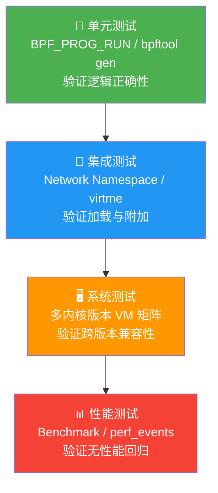
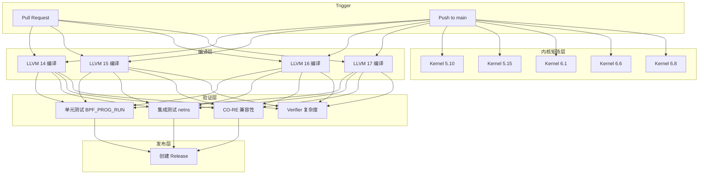
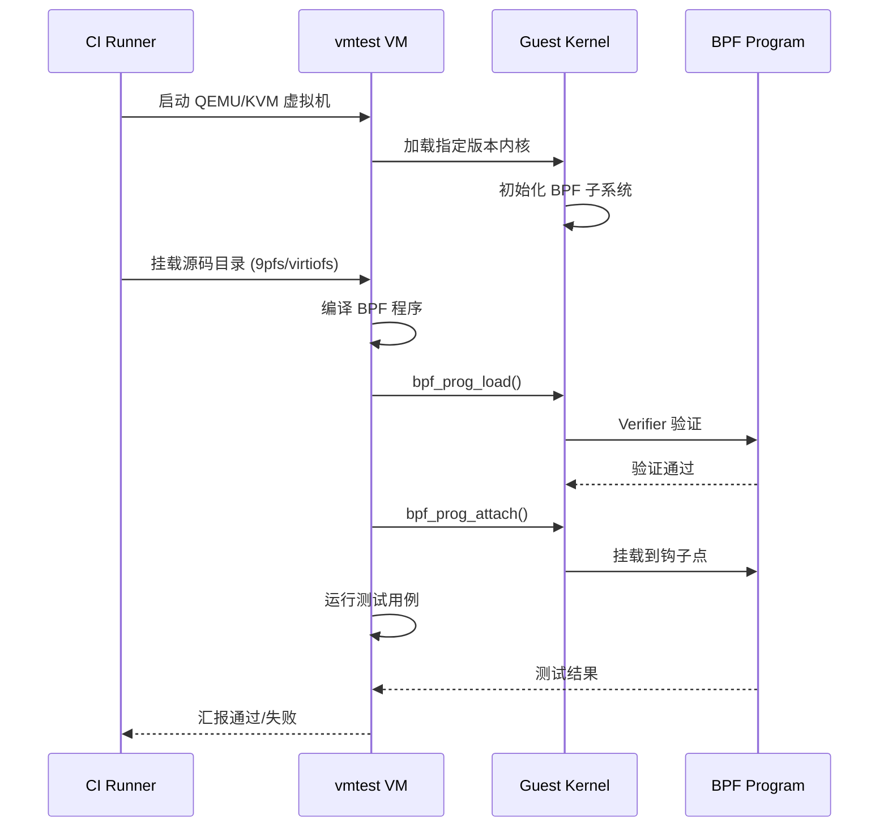
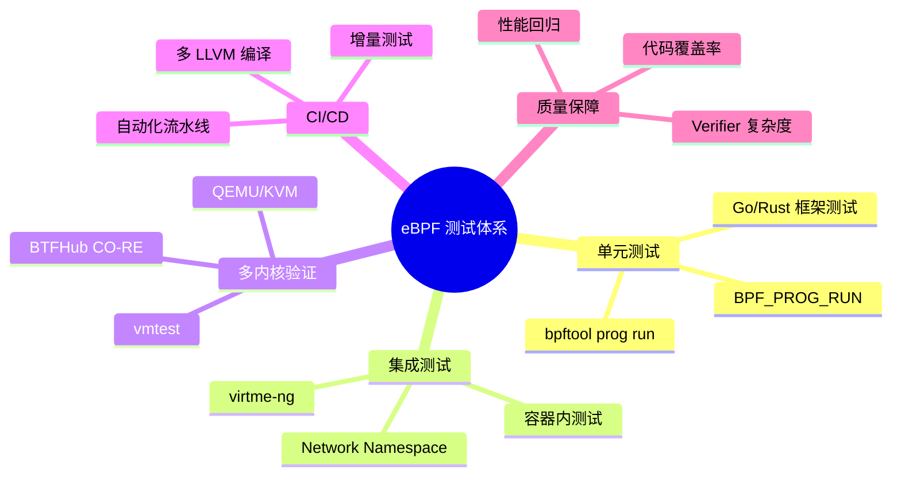

> [!info] eBPF 2026 深度探索系列
> 0. [[2026-04-08-ebpf-comprehensive-learning-roadmap|全栈学习路径总览]]
> 1. [[2026-04-08-ebpf-deep-dive-ch1-registers-and-instructions|第一章：寄存器与指令集]]
> 2. [[2026-04-08-ebpf-deep-dive-ch1-5-function-calls|第一.五章：四种函数调用与动态内存]]
> 3. [[2026-04-08-ebpf-deep-dive-ch1-6-the-verifier|第一.六章：验证器 (Verifier) 的底层逻辑]]
> 4. [[2026-04-08-ebpf-deep-dive-ch2-maps-and-communication|第二章：Map 机制与跨空间通信]]
> 5. [[2026-04-08-ebpf-deep-dive-ch2-5-kptr-and-ownership|第二.五章：kptr (内核指针) 与内存所有权模型]]
> 6. [[2026-04-08-ebpf-deep-dive-ch3-core-and-btf|第三章：CO-RE 与 BTF 的跨版本魔法]]
> 7. [[2026-04-08-ebpf-deep-dive-ch4-tracing-hooks-and-security|第四章：从 kprobe 到 LSM 的追踪全图景]]
> 8. [[2026-04-08-ebpf-deep-dive-ch7-5-uprobes-dynamic-tracing|第七.五章：uprobe 用户态动态追踪原理]]
> 9. [[2026-04-08-ebpf-deep-dive-ch7-6-bpftime-user-runtime|第七.六章：bpftime 与用户态 eBPF 加速]]
> 10. [[2026-04-08-ebpf-deep-dive-ch18-bpftime-injection-mastery|第七.七章：bpftime 自动化注入与全量监控实战]]
> 11. [[2026-04-08-ebpf-deep-dive-ch7-8-uprobe-selection-guide|第七.八章：uprobe 选型指南：内核态 vs 用户态]]
> 12. [[2026-04-08-ebpf-deep-dive-ch5-xdp-networking-performance|第五章：XDP 极致网络性能与全栈架构]]
> 13. [[2026-04-08-ebpf-deep-dive-ch6-tc-traffic-control|第六章：TC (Traffic Control) 流量调度艺术]]
> 14. [[2026-04-08-ebpf-deep-dive-ch7-security-lsm-enforcement|第七章：LSM BPF 从可观测到安全执法]]
> 15. [[2026-04-08-ebpf-deep-dive-ch8-advanced-tuning-and-profiling|第八章：进阶实战与内核调优]]
> 16. [[2026-04-08-ebpf-deep-dive-ch9-af-xdp-zero-copy|第九章：AF_XDP 零拷贝与用户态协议栈]]
> 17. [[2026-04-08-ebpf-deep-dive-ch10-sched-ext-custom-scheduler|第十章：sched_ext 自定义 CPU 调度器]]
> 18. [[2026-04-08-ebpf-deep-dive-ch11-bpf-iterators|第十一章：BPF Iterators 内核对象迭代器]]
> 19. [[2026-04-08-ebpf-deep-dive-ch12-kfuncs-evolution|第十二章：kfuncs 下一代内核交互标准]]
> 20. [[2026-04-08-ebpf-deep-dive-ch13-usdt-tracing|第十三章：USDT 用户态静态定义追踪]]
> 21. [[2026-04-08-ebpf-deep-dive-ch14-ai-llm-inference-monitoring|第十四章：AI 推理与大模型监控前沿]]
> 22. [[2026-04-08-ebpf-deep-dive-ch15-container-isolation|第十五章：无感增强容器隔离性]]
> 23. [[2026-04-08-ebpf-deep-dive-ch16-ebpf-and-wasm|第十六章：eBPF 与 WebAssembly (WASM) 的共生架构]]
> 24. [[2026-04-08-ebpf-deep-dive-ch17-storage-and-filesystem|第十七章：存储与文件系统加速]]
> 25. [[2026-04-08-ebpf-deep-dive-ch18-lifecycle-and-links|第十八章：生命周期管理与 BPF Links]]
> 26. [[2026-04-08-ebpf-deep-dive-ch19-atomic-updates-and-hot-upgrade|第十九章：程序的原子更新与蓝绿部署]]
> 27. [[2026-04-08-ebpf-deep-dive-ch25-5-stack-trace-correlation|第二五.五章：调用栈与业务请求的深度绑定]]
> 28. [[2026-04-08-ebpf-deep-dive-ch20-edge-iot-acceleration|第二十章：边缘计算与工业协议加速]]
> 29. [[2026-04-08-ebpf-deep-dive-ch21-debugging-and-verifier|第二十一章：调试实战与验证器 (Verifier) 诊断]]
> 30. **第二十二章：测试与持续集成 (CI/CD) 实战**
> 31. [[2026-04-08-ebpf-deep-dive-ch23-security-and-permissions|第二十三章：权限细分与 BPF 安全沙箱]]
> 32. [[2026-04-08-ebpf-deep-dive-ch24-meta-monitoring-and-self-healing|第二十四章：eBPF 程序的内核自愈与监控]]
> 33. [[2026-04-08-ebpf-deep-dive-ch25-full-stack-observability|第二十五章：全栈可观测性与端到端追踪]]
> 34. [[2026-04-08-ebpf-deep-dive-ch26-network-security-high-level|第二十六章：网络安全防御的高阶实战]]
> 35. [[2026-04-08-ebpf-deep-dive-ch27-agent-engineering-architecture|第二十七章：工业级模块化 Agent 架构演进]]
> 36. [[2026-04-08-ebpf-deep-dive-ch28-offensive-and-defensive|第二十八章：攻防博弈与 Rootkit 防御]]
> 37. [[2026-04-08-ebpf-deep-dive-ch29-networking-deep-dive|第二十九章：网络应用深水区——负载均衡、Sockmap 与拥塞控制]]
> 38. [[2026-04-08-ebpf-deep-dive-ch30-hardware-offload|第三十章：硬件卸载与 SmartNIC 实战]]
> 39. [[2026-04-08-ebpf-deep-dive-ch31-signed-objects-and-security|第三十一章：内核原生签名与供应链安全]]
> 40. [[2026-04-08-ebpf-deep-dive-ch32-ebpf-for-windows|第三十二章：跨平台崛起——eBPF for Windows]]
> 41. [[2026-04-08-ebpf-deep-dive-ch32-5-macos-status|第三十二.五章：macOS 的特殊路径]]
> 42. [[2026-04-08-ebpf-deep-dive-ch33-serverless-optimization|第三十三章：Serverless 冷启动消除与动态计费]]
> 43. [[2026-04-08-ebpf-deep-dive-ch34-waf-and-rasp|第三十四章：Web 安全革命——内核态 WAF 与 RASP]]
> 44. [[2026-04-08-ebpf-deep-dive-ch35-npu-tpu-ai-hardware|第三十五章：AI 推理硬件 (NPU/TPU) 与硬件定义内核]]
> 45. [[2026-04-08-ebpf-deep-dive-ch36-dynamic-language-introspection|第三十六章：动态语言感知——业务对象的零代码提取]]
> 46. [[2026-04-08-ebpf-deep-dive-ch37-green-computing|第三十七章：绿色计算与能耗精准归因]]
> 47. [[2026-04-08-ebpf-deep-dive-ch38-ecosystem-and-career|第三十八章：2026 生态全景与工程师职业导航]]
> 48. [[2026-04-09-ebpf-deep-dive-ch39-rust-aya-framework|第三十九章：Rust eBPF 开发实战——Aya 框架与安全编程]]
> 49. [[2026-04-09-ebpf-deep-dive-ch40-network-protocols-deep-dive|第四十章：网络协议深度解析——TCP/UDP/QUIC 的 eBPF 视角]]
> 50. [[2026-04-09-ebpf-deep-dive-ch41-memory-safety-and-vulnerabilities|第四十一章：eBPF 内存安全与漏洞分析]]
> 51. [[2026-04-09-ebpf-deep-dive-ch42-service-mesh-integration|第四十二章：eBPF 与 Service Mesh 深度集成]]
---

## 1. 概述：为什么 eBPF 的测试如此特殊？

普通的应用程序测试环境仅需标准库支持，而 eBPF 的执行深度依赖于 Linux 内核。一个在 6.1 内核上通过测试的程序，可能在 5.10 上因为缺少某个 kfunc 或验证器算法的细微差异而无法加载。

因此，eBPF 的 CI/CD 必须覆盖 **"多内核版本验证"** 和 **"加载期安全性回归"** 两个核心维度。

与用户态程序测试相比，eBPF 测试面临以下独特挑战：

| 挑战维度 | 用户态程序 | eBPF 程序 |
|---------|----------|----------|
| 运行环境 | 标准库 + OS 系统调用 | 特定版本的 Linux 内核 |
| 安全检查 | 编译期类型检查 | Verifier 运行时验证 |
| 依赖关系 | 可用容器/虚拟环境隔离 | BTF、kfunc、Helper 版本绑定 |
| 回归风险 | 依赖变更导致 API 不兼容 | 内核升级导致 Verifier 拒绝加载 |
| 测试权限 | 普通用户即可运行 | 大部分场景需要 `CAP_BPF` 或 root |

### 测试金字塔

eBPF 项目同样遵循测试金字塔原则，但各层的含义与普通项目有所不同：



---

## 2. BPF 单元测试框架

### 2.1 BPF_PROG_RUN (模拟执行)

BPF_PROG_RUN 是内核提供的 `bpf_prog_test_run` 系列接口，允许在不实际挂载到钩子点的情况下，通过注入伪造的 Context 数据来运行 BPF 程序。

**核心原理**：

1. 用户态构造符合目标程序类型格式的数据包（如 XDP 的 `xdp_md` 或 TC 的 `__sk_buff`）
2. 通过 `bpf()` 系统调用将数据注入内核
3. 内核在当前上下文中执行 BPF 程序
4. 返回执行结果（返回值、输出数据、指令执行数等）

**适用场景**：
- XDP / TC 程序的报文过滤逻辑验证
- cgroup_skb 程序的网络策略检查
- Socket filter 的匹配规则校验

**优点**：极速反馈，无需 Root 权限（部分场景），适合算法逻辑的单元测试。

**局限性**：
- 无法测试需要访问内核状态（Map、per-CPU 变量）的复杂交互
- 不支持所有程序类型（如 kprobe、tracepoint 类型无法使用此机制）
- 模拟的 Context 与真实环境存在微妙差异

#### C 语言示例：XDP 程序的模拟测试

```c
#include <assert.h>
#include <bpf/libbpf.h>
#include "my_xdp_prog.skel.h"

int main() {
    struct my_xdp_prog *skel = my_xdp_prog__open_and_load();
    assert(skel != NULL);

    // 1. 模拟一个简单的 IPv4 报文 (64 字节，仅设置以太网类型)
    char packet[64] = {0};
    packet[12] = 0x08; packet[13] = 0x00; // EtherType = IPv4

    struct bpf_test_run_opts opts = {
        .sz = sizeof(struct bpf_test_run_opts),
        .data_in = packet,
        .data_size_in = sizeof(packet),
    };

    // 2. 执行模拟测试
    int err = bpf_prog_test_run_opts(
        bpf_program__fd(skel->progs.xdp_handler), &opts
    );

    // 3. 验证返回码是否为 XDP_PASS
    assert(err == 0);
    assert(opts.retval == 2); // XDP_PASS 的枚举值为 2

    printf("Unit Test: Packet processing logic verified.\n");
    my_xdp_prog__destroy(skel);
    return 0;
}
```

### 2.2 Cilium/ebpf Go 框架的测试模式

对于 Go 语言的 eBPF 项目（如 Cilium、Pixie），社区已经沉淀了成熟的测试基础设施：

```go
// test/xdp_test.go
package test

import (
    "testing"
    "github.com/cilium/ebpf"
    "github.com/cilium/ebpf/rlimit"
)

func TestXDPPassIPv4(t *testing.T) {
    // 移除内存锁限制
    if err := rlimit.RemoveMemlock(); err != nil {
        t.Fatal(err)
    }

    // 加载预编译的 BPF 程序
    coll, err := ebpf.LoadCollection("testdata/xdp_prog.o")
    if err != nil {
        t.Fatal(err)
    }
    defer coll.Close()

    prog := coll.Programs["xdp_handler"]
    if prog == nil {
        t.Fatal("program not found")
    }

    // 构造模拟报文
    pkt := []byte{
        0x00, 0x00, 0x00, 0x00, 0x00, 0x00, // dst mac
        0x00, 0x00, 0x00, 0x00, 0x00, 0x00, // src mac
        0x08, 0x00, // ethertype: IPv4
        0x45, 0x00, 0x00, 0x14, // version, ihl, tos, total length
        0x00, 0x01, 0x00, 0x00, // id, flags, frag offset
        0x40, 0x06, 0x00, 0x00, // ttl, protocol (TCP), checksum
        127, 0, 0, 1, // src ip
        127, 0, 0, 1, // dst ip
    }

    // 执行 BPF_PROG_RUN
    ret, out, err := prog.Test(pkt)
    if err != nil {
        t.Fatal(err)
    }

    // XDP_PASS = 2
    if ret != 2 {
        t.Errorf("expected XDP_PASS (2), got %d", ret)
    }

    t.Logf("Program returned %d, output len %d", ret, len(out))
}
```

### 2.3 bpftool gen 与 Skeleton 自动化

`bpftool gen skeleton` 能够自动生成 BPF 程序的 C Skeleton 代码，极大简化了用户态测试的编写：

```bash
# 生成带自动销毁功能的 skeleton 头文件
bpftool gen skeleton my_xdp_prog.bpf.o > my_xdp_prog.skel.h

# 生成对象文件（.o 文件由 clang 编译 BPF C 代码产生）
clang -g -O2 -target bpf \
    -D__TARGET_ARCH_x86 \
    -I/usr/include/x86_64-linux-gnu \
    -c my_xdp_prog.bpf.c -o my_xdp_prog.bpf.o
```

---

## 3. 集成测试：网络命名空间隔离

BPF_PROG_RUN 只能验证程序逻辑的正确性，但无法覆盖 "程序能否成功加载并附加到内核钩子点" 这一关键路径。为此，Linux 提供了 **Network Namespace (netns)** 作为轻量级隔离环境。

### 3.1 为什么选择 netns？

- **零开销**：netns 是内核原生特性，创建和销毁几乎无性能损耗
- **真实路径**：程序走完完整的 `bpf_prog_load -> bpf_prog_attach` 流程
- **并行执行**：每个测试用例可以拥有独立的网络栈，互不干扰
- **无需虚拟化**：不需要 QEMU 或 Docker，在 CI 容器中即可运行

### 3.2 netns 测试实战

以下是一个完整的 TC BPF 程序集成测试脚本：

```bash
#!/bin/bash
# test/tc_integration_test.sh
set -euo pipefail

# 颜色输出
GREEN='\033[0;32m'
RED='\033[0;31m'
NC='\033[0m'

log_ok()   { echo -e "${GREEN}[PASS]${NC} $1"; }
log_fail() { echo -e "${RED}[FAIL]${NC} $1"; }

# 创建独立的网络命名空间
create_netns() {
    local ns="$1"
    ip netns add "$ns" 2>/dev/null || true

    # 创建 veth pair 连接命名空间与主机
    ip link add "veth-${ns}" type veth peer name "veth-${ns}-host" 2>/dev/null || true
    ip link set "veth-${ns}-host" up
    ip link set "veth-${ns}" netns "$ns"

    # 在命名空间内配置 IP
    ip netns exec "$ns" ip link set lo up
    ip netns exec "$ns" ip addr add 10.0.0.1/24 dev "veth-${ns}"
    ip netns exec "$ns" ip link set "veth-${ns}" up
}

cleanup_netns() {
    local ns="$1"
    ip link del "veth-${ns}-host" 2>/dev/null || true
    ip netns del "$ns" 2>/dev/null || true
}

# 测试：TC 程序加载与报文计数
test_tc_packet_count() {
    local ns="test-tc-$$"
    create_netns "$ns"
    trap "cleanup_netns $ns" EXIT

    # 加载 TC BPF 程序到命名空间的网卡
    ip netns exec "$ns" tc qdisc add dev "veth-${ns}" clsact
    ip netns exec "$ns" tc filter add dev "veth-${ns}" ingress \
        bpf da obj my_tc_prog.bpf.o sec tc

    # 发送测试报文
    ip netns exec "$ns" ping -c 3 -W 1 10.0.0.2 > /dev/null 2>&1 || true

    # 读取 BPF Map 中的报文计数
    local count
    count=$(ip netns exec "$ns" bpftool map lookup name packet_count \
        key hex 0 0 0 0 2>/dev/null | awk '{print $3}')

    if [ -n "$count" ] && [ "$count" -gt 0 ]; then
        log_ok "TC BPF 程序成功计数 $count 个报文"
        return 0
    else
        log_fail "TC BPF 程序未正确计数报文"
        return 1
    fi
}

# 测试：XDP 程序加载与丢包
test_xdp_drop() {
    local ns="test-xdp-$$"
    create_netns "$ns"
    trap "cleanup_netns $ns" EXIT

    # 加载 XDP 程序
    ip netns exec "$ns" ip link set dev "veth-${ns}" xdp \
        obj my_xdp_prog.bpf.o sec xdp

    # 验证 XDP 已附加
    local mode
    mode=$(ip netns exec "$ns" ip link show dev "veth-${ns}" | grep -o 'xdp[[:space:]]*[^ ]*')

    if echo "$mode" | grep -q "xdp"; then
        log_ok "XDP 程序已成功附加: $mode"
    else
        log_fail "XDP 程序附加失败"
        return 1
    fi
}

# 执行所有测试
FAILED=0
test_tc_packet_count || FAILED=$((FAILED + 1))
test_xdp_drop       || FAILED=$((FAILED + 1))

echo ""
if [ $FAILED -eq 0 ]; then
    log_ok "所有集成测试通过"
    exit 0
else
    log_fail "$FAILED 个测试失败"
    exit 1
fi
```

---

## 4. CI/CD 流水线实战：GitHub Actions

### 4.1 完整的多内核测试流水线

以下是 2026 年推荐的 eBPF 项目 GitHub Actions 配置，覆盖编译、单元测试、多内核矩阵验证和性能回归检测：

```yaml
# .github/workflows/ebpf-ci.yml
name: eBPF CI/CD Pipeline

on:
  push:
    branches: [main, develop]
    paths:
      - 'src/**.bpf.c'
      - 'src/**.c'
      - 'src/**.h'
      - 'Makefile'
  pull_request:
    branches: [main]

env:
  CLANG_VERSION: "17"
  LLVM_VERSION: "17"

jobs:
  # ============================================
  # Job 1: 编译验证（多 LLVM 版本）
  # ============================================
  compile:
    runs-on: ubuntu-22.04
    strategy:
      matrix:
        llvm: [14, 15, 16, 17]
    steps:
      - uses: actions/checkout@v4

      - name: Install LLVM/Clang ${{ matrix.llvm }}
        run: |
          sudo apt-get update
          sudo apt-get install -y \
            clang-${{ matrix.llvm }} \
            llvm-${{ matrix.llvm }} \
            libbpf-dev \
            linux-headers-$(uname -r) \
            bpftool

      - name: Compile BPF programs
        run: |
          make CLANG=clang-${{ matrix.llvm }} \
               LLVM_CONFIG=llvm-config-${{ matrix.llvm }} \
               clean all

      - name: Verify BTF generation
        run: |
          for obj in output/*.bpf.o; do
            echo "=== Checking BTF in $obj ==="
            pahole --count_declare "$obj" | head -5
          done

      - name: Upload artifacts
        uses: actions/upload-artifact@v4
        with:
          name: bpf-objects-llvm${{ matrix.llvm }}
          path: output/*.bpf.o

  # ============================================
  # Job 2: 单元测试 (BPF_PROG_RUN)
  # ============================================
  unit-test:
    runs-on: ubuntu-22.04
    needs: compile
    steps:
      - uses: actions/checkout@v4

      - name: Install dependencies
        run: |
          sudo apt-get update
          sudo apt-get install -y libbpf-dev clang-17 bpftool \
            linux-headers-$(uname -r) gcc make

      - name: Download BPF objects
        uses: actions/download-artifact@v4
        with:
          name: bpf-objects-llvm17
          path: output/

      - name: Build test binary
        run: make test

      - name: Run unit tests
        run: |
          sudo ./test_runner \
            --verbose \
            --gtest_output=xml:test_results.xml

      - name: Upload test results
        if: always()
        uses: actions/upload-artifact@v4
        with:
          name: unit-test-results
          path: test_results.xml

  # ============================================
  # Job 3: 集成测试 (Network Namespace)
  # ============================================
  integration-test:
    runs-on: ubuntu-22.04
    needs: compile
    steps:
      - uses: actions/checkout@v4

      - name: Install dependencies
        run: |
          sudo apt-get update
          sudo apt-get install -y libbpf-dev clang-17 bpftool \
            iproute2 iputils-ping linux-headers-$(uname -r)

      - name: Download BPF objects
        uses: actions/download-artifact@v4
        with:
          name: bpf-objects-llvm17
          path: output/

      - name: Run TC integration tests
        run: |
          sudo bash test/tc_integration_test.sh

      - name: Run XDP integration tests
        run: |
          sudo bash test/xdp_integration_test.sh

      - name: Run cgroup integration tests
        run: |
          sudo bash test/cgroup_integration_test.sh

  # ============================================
  # Job 4: 多内核版本矩阵测试 (vmtest)
  # ============================================
  kernel-matrix:
    runs-on: ubuntu-22.04
    needs: [compile, unit-test]
    if: github.event_name == 'push' && github.ref == 'refs/heads/main'
    strategy:
      matrix:
        kernel:
          - "5.10"
          - "5.15"
          - "6.1"
          - "6.6"
          - "6.8"
        arch: [x86_64]
      fail-fast: false
    steps:
      - uses: actions/checkout@v4

      - name: Install vmtest
        run: |
          curl -sSfL https://github.com/meta-llama/tracee/releases/latest/download/vmtest-$(uname -m) \
            -o /usr/local/bin/vmtest
          chmod +x /usr/local/bin/vmtest

      - name: Download BPF objects
        uses: actions/download-artifact@v4
        with:
          name: bpf-objects-llvm17
          path: output/

      - name: Run vmtest on kernel ${{ matrix.kernel }}
        run: |
          vmtest \
            --kernel "https://github.com/meta-llama/tracee-kernel/releases/download/v${{ matrix.kernel }}/vmlinuz-${{ matrix.kernel }}" \
            --command "cd /mnt && bash test/run_in_vm.sh" \
            --timeout 300
        timeout-minutes: 10

  # ============================================
  # Job 5: CO-RE 兼容性验证
  # ============================================
  core-compat:
    runs-on: ubuntu-22.04
    needs: compile
    strategy:
      matrix:
        distro:
          - { name: "ubuntu-20.04", btf: "5.4" }
          - { name: "ubuntu-22.04", btf: "5.15" }
          - { name: "debian-12",   btf: "6.1" }
          - { name: "fedora-39",   btf: "6.6" }
    steps:
      - uses: actions/checkout@v4

      - name: Install dependencies
        run: sudo apt-get install -y bpftool clang-17 libbpf-dev

      - name: Download BTF from BTFHub
        run: |
          BTF_URL="https://github.com/aquasecurity/btfhub/raw/main/${{ matrix.distro.name }}/${{ matrix.distro.btf }}/x86_64/$(uname -m)/btf"
          mkdir -p /tmp/btf
          curl -sSfL "$BTF_URL" -o /tmp/btf/vmlinux.btf
          echo "Downloaded BTF for ${{ matrix.distro.name }} (${{ matrix.distro.btf }})"

      - name: Verify CO-RE relocation
        run: |
          export BPFTOOL_BTF_DUMP=/tmp/btf/vmlinux.btf
          # 尝试使用 BTF 进行重定位验证
          bpftool btf dump file /tmp/btf/vmlinux.btf format c \
            | head -20
          echo "CO-RE verification passed for ${{ matrix.distro.name }}"

  # ============================================
  # Job 6: Verifier 复杂度回归检测
  # ============================================
  verifier-complexity:
    runs-on: ubuntu-22.04
    needs: compile
    steps:
      - uses: actions/checkout@v4

      - name: Install dependencies
        run: sudo apt-get install -y clang-17 libbpf-dev bpftool

      - name: Download BPF objects
        uses: actions/download-artifact@v4
        with:
          name: bpf-objects-llvm17
          path: output/

      - name: Measure verifier complexity
        run: |
          echo "=== Verifier Instruction Complexity ==="
          for obj in output/*.bpf.o; do
            echo "--- $obj ---"
            bpftool prog dump xlated pinned /sys/fs/bpf/ 2>/dev/null || true
            # 使用 bpftool 加载并检查指令数
            RESULT=$(bpftool prog load "$obj" /sys/fs/bpf/test_prog \
              type xdp 2>&1 || true)
            INSTR_COUNT=$(echo "$RESULT" | grep -oP '\d+ insns' || echo "N/A")
            echo "Instructions: $INSTR_COUNT"
            bpftool prog detach pinned /sys/fs/bpf/test_prog 2>/dev/null || true
          done

  # ============================================
  # Job 7: 发布流水线
  # ============================================
  release:
    runs-on: ubuntu-22.04
    needs: [unit-test, integration-test, core-compat]
    if: github.ref == 'refs/heads/main'
    steps:
      - uses: actions/checkout@v4

      - name: Create release tag
        id: tag
        run: |
          TAG="v$(date +%Y%m%d)-$(git rev-parse --short HEAD)"
          echo "tag=$TAG" >> "$GITHUB_OUTPUT"

      - name: Build release artifacts
        run: make release

      - name: Upload release
        uses: softprops/action-gh-release@v2
        with:
          tag_name: ${{ steps.tag.outputs.tag }}
          files: |
            release/*.bpf.o
            release/*.h
```

### 4.2 流水线架构总览



---

## 5. CO-RE 跨内核版本测试

### 5.1 CO-RE 的测试挑战

CO-RE（Compile Once - Run Everywhere）的核心理念是：BPF 程序编译一次，在所有支持的内核版本上运行。但要真正实现这一目标，测试覆盖面至关重要。

CO-RE 测试的三个关键维度：

| 维度 | 验证目标 | 工具 |
|------|---------|------|
| BTF 结构匹配 | 目标类型的偏移量在不同内核间是否一致 | `bpftool btf dump`、`pahole` |
| 字段重定位 | `btf_field_reloc` 是否能正确处理字段偏移差异 | `bpftool gen skeleton` 验证 |
| kfunc 可用性 | 目标内核是否包含所需的 kfunc | `bpftool btf dump` 搜索 `FUNC_PROTO` |

### 5.2 BTFHub 集成测试

BTFHub 是 Aqua Security 维护的 BTF 文件仓库，覆盖了主流发行版的历史版本。在 CI 中集成 BTFHub 可以低成本地验证 CO-RE 兼容性：

```bash
#!/bin/bash
# test/core_compat_test.sh
set -euo pipefail

BTFHUB_ARCHIVE="https://github.com/aquasecurity/btfhub-archive/releases/latest/download"

# 目标发行版与内核版本矩阵
declare -A MATRIX=(
    ["ubuntu2004"]="5.4.0"
    ["ubuntu2204"]="5.15.0"
    ["ubuntu2404"]="6.5.0"
    ["debian11"]="5.10.0"
    ["debian12"]="6.1.0"
    ["almalinux9"]="5.14.0"
    ["fedora39"]="6.6.0"
)

FAILED=0
for distro in "${!MATRIX[@]}"; do
    version="${MATRIX[$distro]}"
    btf_file="/tmp/btf/${distro}.btf"

    echo "=== Testing CO-RE for $distro (kernel $version) ==="

    # 下载 BTF
    curl -sSfL "${BTFHUB_ARCHIVE}/${distro}/${version}/x86_64/btf" \
        -o "$btf_file" || {
        echo "[SKIP] BTF not available for $distro"
        continue
    }

    # 验证 BPF 程序的 CO-RE 重定位
    if bpftool gen object output/test_reloc.bpf.o \
        output/my_prog.bpf.o \
        btf_custom_path="$btf_file" 2>/dev/null; then
        echo "[PASS] CO-RE relocation OK for $distro"
    else
        echo "[FAIL] CO-RE relocation FAILED for $distro"
        FAILED=$((FAILED + 1))
    fi
done

echo ""
if [ $FAILED -eq 0 ]; then
    echo "All CO-RE compatibility tests passed!"
else
    echo "$FAILED CO-RE tests failed!"
    exit 1
fi
```

### 5.3 virtme-ng：快速内核切换测试

`virtme-ng` 是 `virtme` 的增强版本，能在几秒钟内启动一个基于当前目录的轻量级虚拟机，使用指定的内核版本：

```bash
# 安装 virtme-ng
pip install virtme-ng

# 使用特定内核版本运行测试
virtme-ng --kimg /path/to/vmlinuz-6.1.0 \
    --run "cd /mnt && ./test_runner --gtest_filter=TC.*"

# 使用当前内核但隔离环境运行
virtme-ng --run "bash test/integration_test.sh"

# 使用上游内核最新版本测试
virtme-ng --kimg upstream --run "./run_all_tests.sh"
```

---

## 6. VM-Based 测试：vmtest 实战

### 6.1 vmtest 工作原理

vmtest 是 Meta（原 Facebook）工程师开发的 eBPF 测试工具，专为内核级测试优化。其核心架构如下：



### 6.2 vmtest 配置与使用

```bash
# 从源码安装 vmtest
git clone https://github.com/libbpf/vmtest.git
cd vmtest && make && sudo make install

# 运行测试（指定内核版本）
vmtest \
    --kernel "5.15.0" \
    --workdir /path/to/project \
    --command "make test"

# 使用自定义内核镜像
vmtest \
    --kimg /path/to/bzImage \
    --initrd /path/to/initramfs.cpio.gz \
    --command "./run_tests.sh"

# 并行测试多个内核版本
for kv in 5.10 5.15 6.1 6.6; do
    vmtest --kernel "$kv" --command "make test" &
done
wait
```

### 6.3 CI 中的 VM 测试最佳实践

1. **使用 KVM 加速**：确保 CI runner 启用了 `/dev/kvm`，否则 QEMU 会退回到 TCG 模式，速度降低 10 倍以上
2. **缓存内核镜像**：将编译好的 vmlinuz 和 initramfs 缓存在 CI 的 artifact 中
3. **设置合理超时**：每个内核版本的测试建议不超过 5 分钟，避免阻塞流水线
4. **fail-fast: false**：不要因为一个内核版本失败就中断其他版本的测试

```yaml
# GitHub Actions 中启用 KVM 的配置
jobs:
  kernel-matrix:
    runs-on: ubuntu-22.04
    strategy:
      matrix:
        kernel: ["5.10", "5.15", "6.1", "6.6", "6.8"]
      fail-fast: false
    steps:
      - name: Enable KVM group
        run: |
          echo 'KERNEL=="kvm", GROUP="kvm", MODE="0666"' | \
            sudo tee /etc/udev/rules.d/99-kvm.rules
          sudo udevadm control --reload-rules
          sudo udevadm trigger --name-match=kvm

      - name: Verify KVM access
        run: |
          [ -w /dev/kvm ] || { echo "KVM not available"; exit 1; }
          echo "KVM acceleration enabled"
```

---

## 7. 代码覆盖率与性能分析工具

### 7.1 BPF 程序的代码覆盖率

传统用户态程序的代码覆盖率工具（如 gcov、lcov）不适用于 BPF 程序。社区提供了以下替代方案：

#### bpftool prog profile

`bpftool prog profile` 可以统计 BPF 程序中每条指令的执行次数，类似用户态的 line coverage：

```bash
# 加载 BPF 程序
bpftool prog load my_prog.bpf.o /sys/fs/bpf/my_prog type xdp

# 附加 XDP 程序
ip link set eth0 xdp pinned /sys/fs/bpf/my_prog

# 在另一个终端产生流量
# ping 10.0.0.1 -c 100

# 收集覆盖率数据
bpftool prog profile pinned /sys/fs/bpf/my_prog duration 10

# 输出示例：
# 1712 insn[  0] count 100000
# 1713 insn[  1] count 100000
# 1714 insn[  2] count  45000    <- 条件分支：45% 的报文走此路径
# 1715 insn[  3] count  55000    <- 另一个分支
```

#### LLVM Source-based Coverage

对于 BPF C 代码，可以使用 LLVM 的 source-based coverage 来分析编译期的覆盖情况：

```bash
# 编译时启用覆盖率
clang -g -O2 -target bpf \
    -fcoverage-mapping -fprofile-instr-generate \
    -D__TARGET_ARCH_x86 \
    -c my_prog.bpf.c -o my_prog.bpf.o

# 运行测试后生成覆盖率报告
llvm-profdata merge default.profraw -o my_prog.profdata
llvm-cov show my_prog.bpf.o \
    -instr-profile=my_prog.profdata \
    --format=html \
    -output-dir=coverage_report/
```

### 7.2 性能回归检测

```bash
#!/bin/bash
# test/perf_regression.sh
set -euo pipefail

BPF_PROG="my_xdp_prog.bpf.o"

echo "=== Performance Regression Test ==="

# 测量 Verifier 处理时间
start_time=$(date +%s%N)

bpftool prog load "$BPF_PROG" /sys/fs/bpf/perf_test type xdp 2>&1

end_time=$(date +%s%N)
verify_ms=$(( (end_time - start_time) / 1000000 ))

echo "Verifier processing time: ${verify_ms}ms"

# 基准阈值：超过 500ms 视为异常
if [ "$verify_ms" -gt 500 ]; then
    echo "[WARN] Verifier time exceeds 500ms threshold!"
    echo "This may indicate excessive instruction complexity."
    exit 1
fi

# 测量程序指令数
INSN_COUNT=$(bpftool prog show pinned /sys/fs/bpf/perf_test | \
    grep -oP '\d+ insns' | grep -oP '\d+')

echo "Total instructions: $INSN_COUNT"

# 清理
bpftool prog detach pinned /sys/fs/bpf/perf_test 2>/dev/null || true
rm -f /sys/fs/bpf/perf_test

echo "[PASS] Performance regression check OK"
```

### 7.3 使用 bpftrace 进行动态测试

`bpftrace` 不仅能用于生产环境监控，也可以作为 eBPF 程序的动态测试工具：

```bash
# 测试 XDP 程序是否在正确的时间点被触发
sudo bpftrace -e '
kprobe:bpf_prog_run_xdp {
    printf("XDP program invoked on CPU %d\n", cpu);
    @invocations = count();
}

interval:s:5 {
    printf("Total XDP invocations: %d\n", @invocations);
}
'

# 验证 Map 操作是否正常
sudo bpftrace -e '
kprobe:bpf_map_update_elem {
    @map_updates = count();
}

kprobe:bpf_map_lookup_elem {
    @map_lookups = count();
}

kprobe:bpf_map_delete_elem {
    @map_deletes = count();
}

interval:s:5 {
    printf("Map ops - updates: %d, lookups: %d, deletes: %d\n",
        @map_updates, @map_lookups, @map_deletes);
}
'
```

---

## 8. FAQ

### Q1: eBPF 程序能否在没有 root 权限的环境中测试？

**可以，但有限制**。使用 `BPF_PROG_RUN`（通过 `bpftool prog run` 或 `bpf_prog_test_run_opts`）可以在非 root 环境下执行已编译的 BPF 程序的逻辑测试，前提是程序已经被 root 加载。此外，从 Linux 5.8 开始，支持 `CAP_BPF`（而非完整 root）来加载部分类型的 BPF 程序。在 CI 容器中，推荐使用 `--privileged` 模式或 `cap-add=CAP_BPF,CAP_SYS_ADMIN` 来最小化权限。

### Q2: 如何测试在不同内核版本上 BTF 字段偏移的变化？

使用 `pahole` 工具对比不同版本内核的 BTF 信息：

```bash
# 生成类型信息的 C 语言表示
pahole --btf_encode=vmlinux -C /sys/kernel/btf/vmlinux > vmlinux_types_current.h

# 从 BTFHub 下载目标版本
curl -sSfL "https://btfhub.org/..." -o vmlinux_target.btf
pahole --btf_encode=vmlinux -C vmlinux_target.btf > vmlinux_types_target.h

# 对比关键字段偏移
diff vmlinux_types_current.h vmlinux_types_target.h | grep "offset:"
```

如果发现 `struct task_struct` 或 `struct sk_buff` 等关键结构的字段偏移发生变化，需要通过 CO-RE 的 `__builtin_preserve_type_info` 和 `BPF_CORE_READ` 宏来处理。

### Q3: CI 流水线太慢，如何优化多内核测试的时间？

优化策略有三个方向：

1. **并行化**：使用 `strategy.matrix` 的 `fail-fast: false` 让所有内核版本同时测试
2. **增量测试**：只在 BPF 源码变更时触发全量内核矩阵测试，普通用户态代码变更仅运行单元测试
3. **内核镜像缓存**：将编译好的 `vmlinuz` + `initramfs` 存储在 CI 的 cache 中，避免每次下载

```yaml
# 增量测试：仅在 BPF 源码变更时触发全量测试
kernel-matrix:
    needs: compile
    if: |
      github.event_name == 'push' &&
      steps.compile.outputs.bpf_changed == 'true'
```

### Q4: 如何在 CI 中模拟网络流量进行 XDP/TC 测试？

推荐使用 `scapy`（Python 数据包生成库）或 `traffic-generator` 工具：

```python
#!/usr/bin/env python3
# test/generate_traffic.py
from scapy.all import *

# 生成 ICMP 流量
send(IP(dst="10.0.0.1")/ICMP(), count=100, iface="veth-test")

# 生成 TCP SYN 洪水（用于压力测试）
send(IP(dst="10.0.0.1")/TCP(dport=80, flags="S"), count=10000, iface="veth-test")

# 生成混合流量
for i in range(1000):
    pkt = random.choice([
        IP()/TCP(dport=random.randint(1, 65535)),
        IP()/UDP(dport=random.randint(1, 65535)),
        IP()/ICMP(),
    ])
    send(pkt, iface="veth-test")
```

### Q5: Verifier 报错 "invalid indirect read from stack" 如何在 CI 中自动检测？

可以通过解析 `bpftool prog load` 的错误输出来自动检测常见的 Verifier 错误模式：

```bash
#!/bin/bash
# test/verifier_error_check.sh
VERIFIER_ERRORS=(
    "invalid indirect read from stack"
    "R1 type=scalar expected=ptr"
    "invalid access to map value"
    "pointer offset out of bounds"
    "unbounded loop detected"
)

OUTPUT=$(bpftool prog load my_prog.bpf.o /sys/fs/bpf/test type xdp 2>&1)
EXIT_CODE=$?

for pattern in "${VERIFIER_ERRORS[@]}"; do
    if echo "$OUTPUT" | grep -qi "$pattern"; then
        echo "[VERIFIER ERROR] $pattern"
        echo "$OUTPUT"
        exit 1
    fi
done
```

### Q6: 如何为 eBPF 项目设置代码风格检查？

```yaml
# .github/workflows/lint.yml
name: Lint
on: [push, pull_request]
jobs:
  bpf-lint:
    runs-on: ubuntu-22.04
    steps:
      - uses: actions/checkout@v4

      - name: Install checkpatch
        run: sudo apt-get install -y checkpatch

      - name: Run checkpatch on BPF source files
        run: |
          find src/ -name '*.bpf.c' -exec \
            checkpatch --no-tree --max-line-length=100 -f {} \;

      - name: Run clang-format
        run: |
          find src/ -name '*.bpf.c' -o -name '*.h' | \
            xargs clang-format --dry-run --Werror
```

---

## 9. 总结与最佳实践清单

### 测试是 eBPF 程序通往生产环境的最后一张入场券。



### 最佳实践清单

| 编号 | 实践 | 优先级 |
|------|------|--------|
| 1 | 使用 `BPF_PROG_RUN` 对所有 XDP/TC 程序编写单元测试 | P0 |
| 2 | 使用 netns 隔离进行集成测试，覆盖 load + attach 路径 | P0 |
| 3 | 在 CI 中至少覆盖 3 个内核版本（LTS + 当前稳定版） | P0 |
| 4 | 使用 BTFHub 验证 CO-RE 兼容性 | P1 |
| 5 | 设置 Verifier 指令复杂度阈值（建议 < 100万） | P1 |
| 6 | 使用 `bpftool prog profile` 收集代码覆盖率 | P2 |
| 7 | 建立 Verifier 错误模式的自动检测 | P2 |
| 8 | 使用多版本 LLVM（至少 14 和 17）交叉编译验证 | P1 |
| 9 | 在 main 分支推送时触发完整内核矩阵测试 | P1 |
| 10 | 缓存内核镜像和 BTF 文件以加速 CI | P2 |

通过 `BPF_PROG_RUN` 解决逻辑正确性，通过网络命名空间解决集成可靠性，通过微型 VM 解决内核兼容性，是 2026 年构建健壮 eBPF 生态的不二法门。
