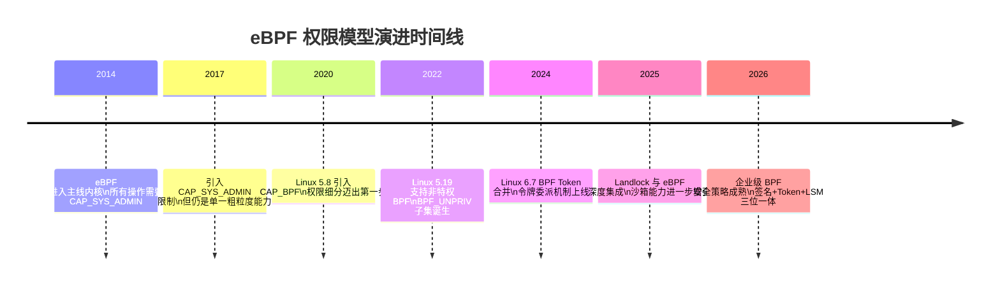
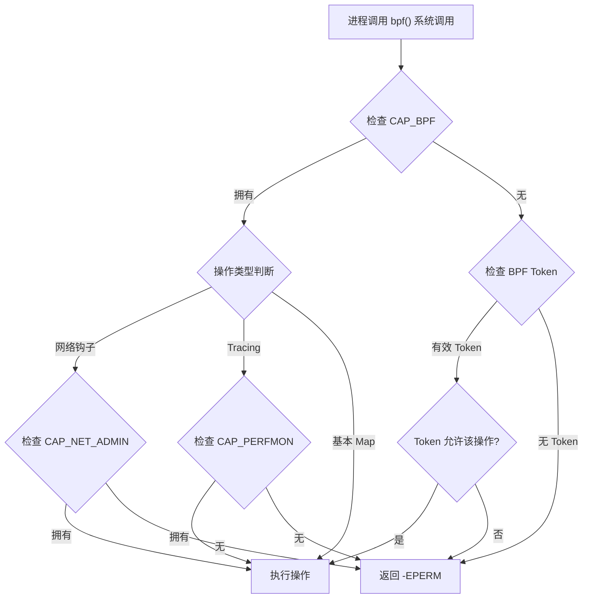
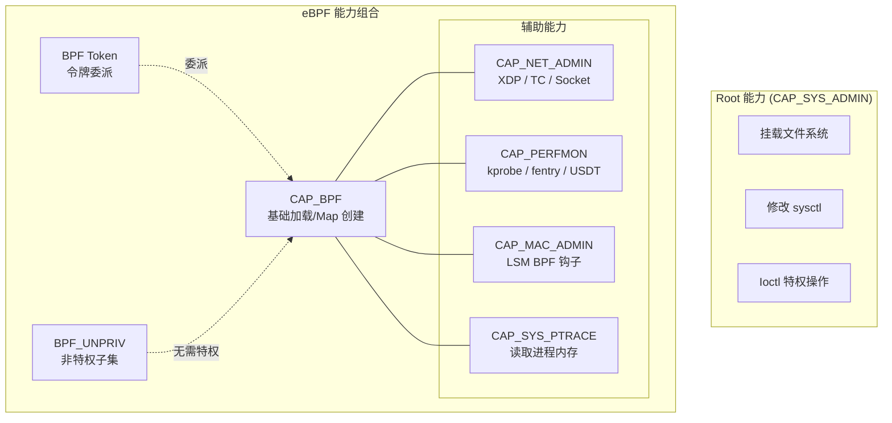
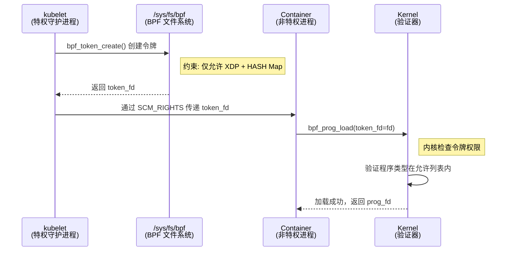
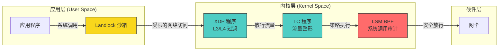
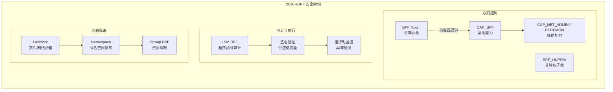

> [!info] eBPF 2026 深度探索系列
> 0. [[2026-04-08-ebpf-comprehensive-learning-roadmap|全栈学习路径总览]]
> 1. [[2026-04-08-ebpf-deep-dive-ch1-registers-and-instructions|第一章：寄存器与指令集]]
> 2. [[2026-04-08-ebpf-deep-dive-ch1-5-function-calls|第一.五章：四种函数调用与动态内存]]
> 3. [[2026-04-08-ebpf-deep-dive-ch1-6-the-verifier|第一.六章：验证器 (Verifier) 的底层逻辑]]
> 4. [[2026-04-08-ebpf-deep-dive-ch2-maps-and-communication|第二章：Map 机制与跨空间通信]]
> 5. [[2026-04-08-ebpf-deep-dive-ch2-5-kptr-and-ownership|第二.五章：kptr (内核指针) 与内存所有权模型]]
> 6. [[2026-04-08-ebpf-deep-dive-ch3-core-and-btf|第三章：CO-RE 与 BTF 的跨版本魔法]]
> 7. [[2026-04-08-ebpf-deep-dive-ch4-tracing-hooks-and-security|第四章：从 kprobe 到 LSM 的追踪全图景]]
> 8. [[2026-04-08-ebpf-deep-dive-ch7-5-uprobes-dynamic-tracing|第七.五章：uprobe 用户态动态追踪原理]]
> 9. [[2026-04-08-ebpf-deep-dive-ch7-6-bpftime-user-runtime|第七.六章：bpftime 与用户态 eBPF 加速]]
> 10. [[2026-04-08-ebpf-deep-dive-ch18-bpftime-injection-mastery|第七.七章：bpftime 自动化注入与全量监控实战]]
> 11. [[2026-04-08-ebpf-deep-dive-ch7-8-uprobe-selection-guide|第七.八章：uprobe 选型指南：内核态 vs 用户态]]
> 12. [[2026-04-08-ebpf-deep-dive-ch5-xdp-networking-performance|第五章：XDP 极致网络性能与全栈架构]]
> 13. [[2026-04-08-ebpf-deep-dive-ch6-tc-traffic-control|第六章：TC (Traffic Control) 流量调度艺术]]
> 14. [[2026-04-08-ebpf-deep-dive-ch7-security-lsm-enforcement|第七章：LSM BPF 从可观测到安全执法]]
> 15. [[2026-04-08-ebpf-deep-dive-ch8-advanced-tuning-and-profiling|第八章：进阶实战与内核调优]]
> 16. [[2026-04-08-ebpf-deep-dive-ch9-af-xdp-zero-copy|第九章：AF_XDP 零拷贝与用户态协议栈]]
> 17. [[2026-04-08-ebpf-deep-dive-ch10-sched-ext-custom-scheduler|第十章：sched_ext 自定义 CPU 调度器]]
> 18. [[2026-04-08-ebpf-deep-dive-ch11-bpf-iterators|第十一章：BPF Iterators 内核对象迭代器]]
> 19. [[2026-04-08-ebpf-deep-dive-ch12-kfuncs-evolution|第十二章：kfuncs 下一代内核交互标准]]
> 20. [[2026-04-08-ebpf-deep-dive-ch13-usdt-tracing|第十三章：USDT 用户态静态定义追踪]]
> 21. [[2026-04-08-ebpf-deep-dive-ch14-ai-llm-inference-monitoring|第十四章：AI 推理与大模型监控前沿]]
> 22. [[2026-04-08-ebpf-deep-dive-ch15-container-isolation|第十五章：无感增强容器隔离性]]
> 23. [[2026-04-08-ebpf-deep-dive-ch16-ebpf-and-wasm|第十六章：eBPF 与 WebAssembly (WASM) 的共生架构]]
> 24. [[2026-04-08-ebpf-deep-dive-ch17-storage-and-filesystem|第十七章：存储与文件系统加速]]
> 25. [[2026-04-08-ebpf-deep-dive-ch18-lifecycle-and-links|第十八章：生命周期管理与 BPF Links]]
> 26. [[2026-04-08-ebpf-deep-dive-ch19-atomic-updates-and-hot-upgrade|第十九章：程序的原子更新与蓝绿部署]]
> 27. [[2026-04-08-ebpf-deep-dive-ch25-5-stack-trace-correlation|第二五.五章：调用栈与业务请求的深度绑定]]
> 28. [[2026-04-08-ebpf-deep-dive-ch20-edge-iot-acceleration|第二十章：边缘计算与工业协议加速]]
> 29. [[2026-04-08-ebpf-deep-dive-ch21-debugging-and-verifier|第二十一章：调试实战与验证器 (Verifier) 诊断]]
> 30. [[2026-04-08-ebpf-deep-dive-ch22-testing-and-ci-cd|第二十二章：测试与持续集成 (CI/CD) 实战]]
> 31. **第二十三章：权限细分与 BPF 安全沙箱**
> 32. [[2026-04-08-ebpf-deep-dive-ch24-meta-monitoring-and-self-healing|第二十四章：eBPF 程序的内核自愈与监控]]
> 33. [[2026-04-08-ebpf-deep-dive-ch25-full-stack-observability|第二十五章：全栈可观测性与端到端追踪]]
> 34. [[2026-04-08-ebpf-deep-dive-ch26-network-security-high-level|第二十六章：网络安全防御的高阶实战]]
> 35. [[2026-04-08-ebpf-deep-dive-ch27-agent-engineering-architecture|第二十七章：工业级模块化 Agent 架构演进]]
> 36. [[2026-04-08-ebpf-deep-dive-ch28-offensive-and-defensive|第二十八章：攻防博弈与 Rootkit 防御]]
> 37. [[2026-04-08-ebpf-deep-dive-ch29-networking-deep-dive|第二十九章：网络应用深水区——负载均衡、Sockmap 与拥塞控制]]
> 38. [[2026-04-08-ebpf-deep-dive-ch30-hardware-offload|第三十章：硬件卸载与 SmartNIC 实战]]
> 39. [[2026-04-08-ebpf-deep-dive-ch31-signed-objects-and-security|第三十一章：内核原生签名与供应链安全]]
> 40. [[2026-04-08-ebpf-deep-dive-ch32-ebpf-for-windows|第三十二章：跨平台崛起——eBPF for Windows]]
> 41. [[2026-04-08-ebpf-deep-dive-ch32-5-macos-status|第三十二.五章：macOS 的特殊路径]]
> 42. [[2026-04-08-ebpf-deep-dive-ch33-serverless-optimization|第三十三章：Serverless 冷启动消除与动态计费]]
> 43. [[2026-04-08-ebpf-deep-dive-ch34-waf-and-rasp|第三十四章：Web 安全革命——内核态 WAF 与 RASP]]
> 44. [[2026-04-08-ebpf-deep-dive-ch35-npu-tpu-ai-hardware|第三十五章：AI 推理硬件 (NPU/TPU) 与硬件定义内核]]
> 45. [[2026-04-08-ebpf-deep-dive-ch36-dynamic-language-introspection|第三十六章：动态语言感知——业务对象的零代码提取]]
> 46. [[2026-04-08-ebpf-deep-dive-ch37-green-computing|第三十七章：绿色计算与能耗精准归因]]
> 47. [[2026-04-08-ebpf-deep-dive-ch38-ecosystem-and-career|第三十八章：2026 生态全景与工程师职业导航]]
> 48. [[2026-04-09-ebpf-deep-dive-ch39-rust-aya-framework|第三十九章：Rust eBPF 开发实战——Aya 框架与安全编程]]
> 49. [[2026-04-09-ebpf-deep-dive-ch40-network-protocols-deep-dive|第四十章：网络协议深度解析——TCP/UDP/QUIC 的 eBPF 视角]]
> 50. [[2026-04-09-ebpf-deep-dive-ch41-memory-safety-and-vulnerabilities|第四十一章：eBPF 内存安全与漏洞分析]]
> 51. [[2026-04-09-ebpf-deep-dive-ch42-service-mesh-integration|第四十二章：eBPF 与 Service Mesh 深度集成]]
---

## 1. 概述：告别 Root 时代

在 eBPF 的早期阶段，加载程序几乎等同于交付了内核的"最高指挥权"。一个简单的 `bpf()` 系统调用，配合 `CAP_SYS_ADMIN` 权限，就能让任意代码在内核态执行。这种"一刀切"的权限模型在单机开发时代勉强可用，但在多租户云原生环境中却成为了一颗定时炸弹。

2026 年的权限体系致力于实现两个核心目标：

1. **最小特权原则 (Principle of Least Privilege)**：根据程序的实际需求分配最窄的权限。一个只做网络包过滤的 XDP 程序，不应该拥有读取内核任意内存地址的能力。
2. **主动拦截机制 (Proactive Interception)**：利用 BPF 自身的能力来审计和阻断恶意的 BPF 操作——即"用 BPF 保护 BPF"。

本章将深入剖析 Linux 内核 6.8~6.14 版本中引入的权限细分机制，包括 `CAP_BPF` 能力、BPF Token 令牌授权、非特权 BPF 子集、以及 Landlock 等新一代安全框架的集成。



---

## 2. CAP_BPF vs CAP_SYS_ADMIN：权限拆分的原理

### 2.1 CAP_SYS_ADMIN 的历史包袱

`CAP_SYS_ADMIN` 被戏称为"上帝模式"（God Mode），它是 Linux 中覆盖面最广的能力之一。拥有此能力的进程可以：

- 挂载/卸载文件系统
- 修改内核参数（`sysctl`）
- 执行 `ioctl` 中的特权操作
- **加载和操作 eBPF 程序**

在 eBPF 诞生初期，内核开发团队没有为它设计独立的能力，而是直接复用了 `CAP_SYS_ADMIN`。这意味着一个仅仅想加载网络过滤器的运维工具，却获得了与系统管理员同等的基础权限——严重违反了最小特权原则。

### 2.2 CAP_BPF 的诞生

Linux 5.8（2020 年）引入了 `CAP_BPF`，这是 eBPF 权限拆分的里程碑。但 `CAP_BPF` 并非一个完全独立的能力，它需要配合其他细粒度能力协同工作。

**`CAP_BPF` 的核心权限范围**：

| 权限项 | 说明 | 典型场景 |
|--------|------|----------|
| 加载 BPF 程序 | 允许 `bpf(BPF_PROG_LOAD)` 系统调用 | 所有类型的 BPF 程序加载 |
| 创建 BPF Map | 允许 `bpf(BPF_MAP_CREATE)` 系统调用 | 数据面配置存储 |
| BPF Observe | 允许使用 bpf_probe_read 等观测类 helper | Tracing 程序的核心能力 |
| 使用 BTF | 访问内核 BTF 信息 | CO-RE 程序的运行基础 |

### 2.3 权限决策流程

内核在处理 `bpf()` 系统调用时，会按照以下层级进行权限检查：



### 2.4 CAP_BPF + CAP_PERFMON：Tracing 的专用权限路径

对于可观测性场景，Linux 5.8 引入了 `CAP_PERFMON` 作为 `CAP_SYS_ADMIN` 的替代。其权限矩阵如下：

| 场景 | 旧方案 | 新方案（最小特权） |
|------|--------|-------------------|
| 加载 XDP 程序 | `CAP_SYS_ADMIN` | `CAP_BPF` + `CAP_NET_ADMIN` |
| 加载 kprobe 程序 | `CAP_SYS_ADMIN` | `CAP_BPF` + `CAP_PERFMON` |
| 加载 LSM 钩子 | `CAP_SYS_ADMIN` | `CAP_BPF` + `CAP_MAC_ADMIN` |
| 加载 cgroup 程序 | `CAP_SYS_ADMIN` | `CAP_BPF` |
| 创建基本 Map | `CAP_SYS_ADMIN` | `CAP_BPF` |

> [!tip] 实践建议
> 在部署 eBPF 程序时，**永远不要使用 `CAP_SYS_ADMIN`**。即使是测试环境，也应该使用对应的细分能力组合，以便在开发阶段就暴露出潜在的权限越界问题。

---

## 3. BPF Capability 权限层级详解

### 3.1 完整的能力层级图



### 3.2 各能力的详细语义

**CAP_BPF**：这是 eBPF 的"地基能力"。拥有它意味着进程可以通过验证器的基本检查，加载安全的 BPF 字节码。但仅凭 `CAP_BPF` 无法挂载到任何需要额外权限的钩子点。

**CAP_NET_ADMIN**：控制网络命名空间级别的操作。对于 eBPF 而言，它授权程序挂载到：
- XDP（eXpress Data Path）
- TC（Traffic Control）ingress/egress
- Socket filter 和 sock_ops
- cgroup 网络分类器

**CAP_PERFMON**：性能监控专用能力。覆盖：
- kprobe / kretprobe
- fentry / fexit
- tracepoint
- perf_event 的创建和管理

**CAP_MAC_ADMIN**：强制访问控制（MAC）管理。在 eBPF 上下文中，它专门授权 LSM BPF 程序的加载。LSM BPF 可以拦截系统调用、文件操作、进程创建等安全敏感事件，因此需要独立的高权限能力。

### 3.3 权限继承与 Namespace 隔离

Linux Namespace 机制与 eBPF 权限存在重要的交互关系：

```c
// 在不同的 Namespace 中，同一能力具有不同的语义
// 宿主机的 CAP_NET_ADMIN 和容器内的 CAP_NET_ADMIN 是隔离的

// 检查当前进程在 Network Namespace 中的能力
bool has_net_admin_in_ns = capable_in_ns(CAP_NET_ADMIN, current->nsproxy->net_ns);

// 检查 User Namespace 中的能力映射
// 容器中的 root (uid 0) 可能并不等于宿主机的 root
bool is_real_root = ns_capable(current_user_ns(), CAP_BPF);
```

> [!warning] 常见陷阱
> 在 Kubernetes Pod 中设置 `securityContext.capabilities.add: ["NET_ADMIN"]` 时，该能力仅在该 Pod 的 Network Namespace 内有效。Pod 内的 eBPF 程序无法通过 XDP 影响同一节点上其他 Pod 的网络流量（除非宿主机侧有额外配置）。

---

## 4. 非特权 BPF (BPF_UNPRIV)

### 4.1 设计哲学

非特权 BPF 是内核社区为"零权限"场景设计的子集。其核心思想是：**即使进程没有任何特殊能力，也可以加载和运行经过严格限制的 BPF 程序**。

这个机制通过 `/proc/sys/kernel/unprivileged_bpf_disabled` 控制：

```bash
# 查看非特权 BPF 状态
cat /proc/sys/kernel/unprivileged_bpf_disabled
# 0 = 允许非特权用户加载 BPF 程序（默认）
# 1 = 禁止，只有具备 CAP_BPF 的进程才能加载
# 2 = 永久禁止，无法再改回 0

# 禁止非特权 BPF（安全加固）
echo 1 | sudo tee /proc/sys/kernel/unprivileged_bpf_disabled

# 永久禁止（启动时设置）
sudo sysctl -w kernel.unprivileged_bpf_disabled=2
```

### 4.2 非特权 BPF 的限制范围

| 限制项 | 说明 | 原因 |
|--------|------|------|
| 可用 Helper 函数 | 仅限安全子集（约 30 个） | 防止通过 helper 绕过安全检查 |
| 程序类型 | 仅限 `BPF_PROG_TYPE_SOCKET_FILTER`、`BPF_PROG_TYPE_CGROUP_SKB` | 限制程序可挂载的钩子 |
| Map 类型 | 仅限 `BPF_MAP_TYPE_HASH`、`BPF_MAP_TYPE_ARRAY` 等基础类型 | 防止使用 per-CPU Map 泄露内核数据 |
| 指针操作 | 禁止 `bpf_probe_read_kernel()` | 防止读取内核内存 |
| 字节码大小 | 受 `bpf_max_insns` 限制 | 防止 DoS 攻击（验证器资源耗尽） |
| 尾调用 | 限制尾调用深度 | 防止栈溢出 |

### 4.3 非特权 BPF 的典型应用场景

非特权 BPF 虽然限制严格，但在以下场景中仍然非常有价值：

```c
// 示例：非特权 Socket Filter —— 进程级别的网络包过滤
// 无需任何特殊能力即可运行
SEC("socket")
int packet_counter(struct __sk_buff *skb) {
    // 只能访问 skb 的有限字段
    __u32 proto = skb->protocol;
    __u32 len = skb->len;

    // 更新计数器（使用非特权可用的 Map）
    struct value_t *val;
    val = bpf_map_lookup_elem(&stats_map, &proto);
    if (val) {
        __sync_fetch_and_add(&val->packets, 1);
        __sync_fetch_and_add(&val->bytes, len);
    }
    return 0; // 不做过滤，只统计
}
```

```c
// 示例：cgroup skb 程序 —— 容器出站流量统计
// 需要 cgroup 管理权限，但不需要 CAP_BPF
SEC("cgroup_skb/egress")
int count_egress(struct __sk_buff *skb) {
    struct pkt_count *count;
    count = bpf_map_lookup_elem(&egress_stats, &skb->ifindex);
    if (count) {
        __sync_fetch_and_add(&count->pkts, 1);
        __sync_fetch_and_add(&count->bytes, skb->len);
    }
    return 1; // 允许通过
}
```

### 4.4 安全加固建议

在生产环境中，建议根据安全需求选择非特权 BPF 的策略：

```bash
# 严格模式：完全禁止非特权 BPF
# 适用于多租户环境、高安全等级系统
echo 2 > /proc/sys/kernel/unprivileged_bpf_disabled

# 宽松模式：允许非特权 BPF
# 适用于开发者工作站、单租户环境
echo 0 > /proc/sys/kernel/unprivileged_bpf_disabled

# 中间模式：允许但增加审计
# 配合 auditd 记录所有 BPF 系统调用
auditctl -a always,exit -F arch=b64 -S bpf -F auid>=1000 -F auid!=4294967295 -k bpf_audit
```

---

## 5. BPF Token：令牌授权机制

### 5.1 设计动机

在容器化和 Kubernetes 环境中，eBPF 的权限困境尤为突出：

- **安全性要求**：不应向容器授予 `CAP_BPF`（更不用说 `CAP_SYS_ADMIN`）
- **功能性需求**：容器内的服务（如 Cilium、Istio sidecar）需要加载 eBPF 程序

传统的解决方案存在明显缺陷：
- 授予容器完整 `CAP_BPF`：违反最小特权原则，容器可能加载 Tracing 程序窃取宿主机信息
- 在宿主机侧代为加载：增加架构复杂度，破坏了 Pod 的自治性

BPF Token 机制优雅地解决了这个矛盾：**由特权进程创建受限令牌，非特权进程持令牌即可执行被授权的操作**。

### 5.2 BPF Token 的工作原理



### 5.3 创建 BPF Token 的代码示例

```c
// 特权侧：守护进程创建受限令牌
#include <bpf/bpf.h>
#include <linux/bpf.h>

int create_restricted_token(void) {
    LIBBPF_OPTS(bpf_token_create_opts, opts);

    // 方式一：通过位掩码指定允许的程序类型
    opts.prog_type_mask = (1ULL << BPF_PROG_TYPE_XDP) |
                          (1ULL << BPF_PROG_TYPE_CGROUP_SKB);

    // 方式二：通过位掩码指定允许的 Map 类型
    opts.map_type_mask = (1ULL << BPF_MAP_TYPE_HASH) |
                         (1ULL << BPF_MAP_TYPE_ARRAY) |
                         (1ULL << BPF_MAP_TYPE_PERCPU_HASH);

    // 方式三：限制辅助函数集合（仅允许安全的网络类 helper）
    opts.helper_id_mask = 0;  // 0 表示使用默认安全子集

    // 方式四：绑定到特定的 BPF 文件系统路径
    // 令牌的作用域限制在该 mount 命名空间内
    int token_fd = bpf_token_create("/sys/fs/bpf", &opts);
    if (token_fd < 0) {
        fprintf(stderr, "Failed to create BPF token: %s\n", strerror(errno));
        return -1;
    }

    // 通过 Unix Domain Socket SCM_RIGHTS 发送给容器
    send_token_to_container(token_fd);
    return 0;
}
```

### 5.4 使用 BPF Token 加载程序

```c
// 非特权侧：容器内使用令牌加载 BPF 程序
#include <bpf/libbpf.h>

int load_with_token(int token_fd) {
    struct bpf_object *obj = NULL;
    struct bpf_object_open_opts open_opts = {};
    struct bpf_object_load_opts load_opts = {};

    // 在 libbpf 中使用令牌
    LIBBPF_OPTS(bpf_object_open_opts, opts);
    opts.token_fd = token_fd;

    // 打开 BPF 对象文件
    obj = bpf_object__open_file("xdp_filter.o", &opts);
    if (libbpf_get_error(obj)) {
        fprintf(stderr, "Failed to open BPF object\n");
        return -1;
    }

    // 加载程序（内部会使用 token_fd 进行权限检查）
    LIBBPF_OPTS(bpf_object_load_opts, l_opts);
    l_opts.token_fd = token_fd;

    int err = bpf_object__load(obj);
    if (err) {
        fprintf(stderr, "Failed to load BPF object: %s\n",
                strerror(-err));
        bpf_object__close(obj);
        return -1;
    }

    // 加载成功，获取程序 fd
    struct bpf_program *prog = bpf_object__find_program_by_name(obj, "xdp_filter");
    int prog_fd = bpf_program__fd(prog);

    printf("Program loaded with token! prog_fd=%d\n", prog_fd);
    bpf_object__close(obj);
    return 0;
}
```

### 5.5 BPF Token 与 Kubernetes 集成

在 Kubernetes 1.32+ 中，Cilium 等 CNI 插件已经支持 BPF Token：

```yaml
# Kubernetes Pod 注解方式申请 BPF Token
apiVersion: v1
kind: Pod
metadata:
  name: network-monitor
  annotations:
    bpf.token/cilium.io: "xdp-only"
    bpf.token/allowed-maps: "hash,array"
spec:
  containers:
    - name: monitor
      image: my-network-monitor:latest
      securityContext:
        # 不需要 CAP_BPF！
        capabilities:
          drop:
            - ALL
  # CNI 插件自动注入 BPF Token
```

---

## 6. Landlock 与 eBPF 的集成

### 6.1 Landlock 简介

Landlock 是 Linux 5.13 引入的沙箱机制，它允许任何进程（无需特殊能力）为自己创建一个受限的执行环境。Landlock 通过**文件系统访问规则**和**网络访问规则**来限制进程的能力。

与传统沙箱（如 seccomp-bpf）不同，Landlock 的关键优势在于：
- **无需特权**：任何进程都可以使用
- **声明式策略**：通过规则描述"允许做什么"，而非"禁止做什么"
- **不可逆转**：一旦激活，无法被同一进程解除（防止提权后绕过）

### 6.2 Landlock 网络规则与 eBPF 的协作

Linux 6.2+ 的 Landlock 引入了网络访问限制，可以与 eBPF 网络程序形成互补：

```c
// Landlock 侧：限制进程的网络访问范围
#include <linux/landlock.h>

int apply_landlock_network_sandbox(void) {
    struct landlock_ruleset_attr attr = {
        .handled_access_net = LANDLOCK_ACCESS_NET_BIND_TCP |
                             LANDLOCK_ACCESS_NET_CONNECT_TCP,
    };

    int ruleset_fd = landlock_create_ruleset(&attr, sizeof(attr), 0);
    if (ruleset_fd < 0) return -1;

    // 仅允许绑定到 8080 端口
    struct landlock_net_service_attr service = {
        .allowed_access = LANDLOCK_ACCESS_NET_BIND_TCP,
        .port = 8080,
    };
    landlock_add_rule(ruleset_fd, LANDLOCK_RULE_NET_SERVICE, &service, 0);

    // 允许连接到特定的内部服务 IP
    struct landlock_net_port_attr port = {
        .allowed_access = LANDLOCK_ACCESS_NET_CONNECT_TCP,
        .port = 6379,  // Redis
    };
    landlock_add_rule(ruleset_fd, LANDLOCK_RULE_NET_PORT, &port, 0);

    // 激活沙箱 —— 不可逆转
    landlock_restrict_self(ruleset_fd, 0);
    close(ruleset_fd);
    return 0;
}
```

### 6.3 eBPF + Landlock：多层防御架构



**防御层级说明**：

| 层级 | 技术 | 保护范围 | 可被谁部署 |
|------|------|----------|-----------|
| L1：网络入口 | XDP | 包过滤、DDoS 防御 | 宿主机特权进程 |
| L2：流量控制 | TC | 带宽限制、流量整形 | 宿主机或持有 Token 的容器 |
| L3：系统调用 | LSM BPF | 文件访问、进程创建审计 | 宿主机特权进程 |
| L4：进程沙箱 | Landlock | 文件系统/网络访问限制 | 应用自身（无需特权） |

---

## 7. LSM BPF：用 BPF 审计 BPF

这是 2026 年企业级安全的终极形态：**利用 LSM BPF 实现内核层的准入控制**。

### 7.1 拦截程序加载

通过挂载到 `lsm/bpf_prog_load` 钩子，安全程序可以对每一个入库的 BPF 字节码进行"政审"：

- **指纹校验**：仅允许已知的、合法的 BPF 程序 ID 加载。
- **类型限制**：禁止特定业务核心加载带有 Tracing 能力的程序，防止内部信息泄露。
- **来源验证**：结合签名机制，只允许经过审批的 BPF 程序进入内核。

### 7.2 代码示例：禁止非特权加载网络探针

```c
// LSM BPF 程序：审计所有 BPF 程序加载请求
SEC("lsm/bpf_prog_load")
int BPF_PROG(audit_bpf_load, union bpf_attr *attr, struct bpf_prog *prog) {
    // 如果程序尝试挂载 XDP 这种高敏感点位
    if (attr->prog_type == BPF_PROG_TYPE_XDP) {
        if (!bpf_capable(CAP_SYS_ADMIN)) {
            bpf_printk("SECURITY ALERT: Unprivileged attempt to load XDP blocked!");
            return -EPERM; // 拒绝
        }
    }

    // 阻止未经授权的 LSM BPF 加载
    if (attr->prog_type == BPF_PROG_TYPE_LSM) {
        char comm[16];
        bpf_get_current_comm(comm, sizeof(comm));
        // 只允许名为 "bpf-auditor" 的进程加载 LSM 程序
        if (bpf_strncmp(comm, 12, "bpf-auditor") != 0) {
            bpf_printk("BLOCKED: Unauthorized LSM BPF from %s", comm);
            return -EPERM;
        }
    }

    // 记录所有 BPF 加载事件到审计 Map
    struct audit_event event = {
        .pid = bpf_get_current_pid_tgid() >> 32,
        .prog_type = attr->prog_type,
        .insns_cnt = attr->insn_cnt,
    };
    bpf_get_current_comm(event.comm, sizeof(event.comm));
    long ret = bpf_map_push_elem(&audit_log, &event, BPF_ANY);

    return 0; // 放行
}
```

### 7.3 高级审计策略：基于签名的白名单

```c
// 结合 BPF 签名机制的审计程序
SEC("lsm/bpf_prog_load")
int BPF_PROG(signed_bpf_audit, union bpf_attr *attr, struct bpf_prog *prog) {
    struct bpf_prog_info info = {};
    __u32 info_len = sizeof(info);

    // 获取程序的签名信息
    if (bpf_prog_get_info_by_fd(prog_fd, &info, &info_len) == 0) {
        // 检查是否为已知的签名密钥
        if (info.sig != TRUSTED_SIGNER_ID) {
            // 在严格模式下，拒绝所有未签名程序
            if (strict_mode) {
                bpf_printk("REJECTED: Unsigned BPF program from pid %d",
                           bpf_get_current_pid_tgid() >> 32);
                return -EPERM;
            }
            // 在宽松模式下，仅记录告警
            bpf_printk("WARNING: Unsigned BPF program loaded");
        }
    }

    return 0;
}
```

### 7.4 Map 访问审计

除了程序加载，LSM BPF 还可以审计 BPF Map 的访问模式：

```c
// 审计 BPF Map 的查找操作，检测可疑的数据访问模式
SEC("lsm/bpf_map")
int BPF_PROG(audit_map_access, struct bpf_map *map, fmode_t fmode) {
    __u32 map_id = map->id;

    // 检查是否为敏感 Map（如包含进程信息的 Map）
    if (is_sensitive_map(map_id)) {
        struct access_record rec = {
            .pid = bpf_get_current_pid_tgid() >> 32,
            .map_id = map_id,
            .access_type = fmode,
            .timestamp = bpf_ktime_get_ns(),
        };
        bpf_map_push_elem(&map_access_log, &rec, BPF_ANY);
    }

    return 0; // 仅审计，不拦截
}
```

---

## 8. 安全最佳实践

### 8.1 权限最小化清单

在部署 eBPF 程序时，请遵循以下清单：

1. **绝不使用 `CAP_SYS_ADMIN`**：始终使用细分能力替代。
2. **优先使用 BPF Token**：在容器环境中，通过令牌委派代替直接授权。
3. **启用非特权 BPF 限制**：在生产集群中将 `unprivileged_bpf_disabled` 设为 1 或 2。
4. **部署 LSM BPF 审计程序**：对所有 BPF 加载操作进行准入控制。
5. **对 BPF 字节码进行签名**：确保只有经过审批的程序可以加载。

### 8.2 容器环境中的权限配置

```yaml
# Kubernetes Pod 安全配置示例
apiVersion: v1
kind: Pod
metadata:
  name: bpf-network-agent
spec:
  securityContext:
    # 方案一：使用最小能力集合
    capabilities:
      add: ["CAP_BPF", "CAP_NET_ADMIN"]
      drop: ["ALL"]

    # 方案二（推荐）：使用 BPF Token，完全不需要能力
    # capabilities:
    #   drop: ["ALL"]
    # annotations:
    #   bpf.token/enabled: "true"
    #   bpf.token/allowed-progs: "xdp,tc"
    #   bpf.token/allowed-maps: "hash,array,percpu_hash"
  containers:
    - name: agent
      image: bpf-network-agent:latest
      securityContext:
        allowPrivilegeEscalation: false
        readOnlyRootFilesystem: true
```

### 8.3 二进制签名 (Signed BPF Objects)

在大厂内部，所有 `.o` 字节码文件必须经过私钥签名，内核加载器在重定位前会校验签名指纹：

```bash
# 使用 OpenSSL 对 BPF 对象文件进行签名
openssl dgst -sha256 -sign private_key.pem \
    -out xdp_filter.o.sig xdp_filter.o

# 在加载时验证签名（bpftool 或 libbpf 支持）
bpftool prog load xdp_filter.o \
    --pin /sys/fs/bpf/xdp_filter \
    --verify-sig xdp_filter.o.sig \
    --pubkey public_key.pem
```

### 8.4 Map 只读保护

通过 `BPF_F_RDONLY_PROG` 标志创建 Map，确保程序只能读取配置而无法篡改关键内核参数：

```c
// 创建只读 Map —— 程序只能读取，不能更新或删除
LIBBPF_OPTS(bpf_map_create_opts, map_opts);
map_opts.map_flags = BPF_F_RDONLY_PROG | BPF_F_WRONLY_PROG;

int config_fd = bpf_map_create(BPF_MAP_TYPE_ARRAY, "allowed_ports",
                                sizeof(__u32), sizeof(__u8), 256, &map_opts);

// 从用户空间写入配置（这是允许的）
__u8 allowed = 1;
bpf_map_update_elem(config_fd, &port, &allowed, BPF_ANY);

// BPF 程序中只能读取（写入会导致验证器拒绝）
SEC("xdp")
int port_filter(struct xdp_md *ctx) {
    __u32 key = ctx->data[2] << 8 | ctx->data[3]; // 目标端口
    __u8 *allowed = bpf_map_lookup_elem(&allowed_ports, &key);
    if (!allowed || !*allowed) {
        return XDP_DROP;
    }
    return XDP_PASS;
}
```

### 8.5 运行时安全监控

```c
// 实时监控 BPF 系统调用频率，检测异常加载行为
SEC("tracepoint/syscalls/sys_enter_bpf")
int monitor_bpf_syscalls(struct trace_event_raw_sys_enter *ctx) {
    __u64 pid_tgid = bpf_get_current_pid_tgid();
    __u32 pid = pid_tgid >> 32;
    __u32 tid = pid_tgid;

    struct bpf_stats *stats;
    stats = bpf_map_lookup_elem(&pid_stats, &pid);
    if (!stats) {
        struct bpf_stats new_stats = {};
        bpf_map_update_elem(&pid_stats, &pid, &new_stats, BPF_NOEXIST);
        stats = bpf_map_lookup_elem(&pid_stats, &pid);
        if (!stats) return 0;
    }

    __sync_fetch_and_add(&stats->bpf_calls, 1);

    // 如果同一进程在短时间内发起大量 BPF 调用，触发告警
    if (stats->bpf_calls > BPF_CALL_THRESHOLD) {
        char comm[16];
        bpf_get_current_comm(comm, sizeof(comm));
        bpf_printk("ALERT: PID %d (%s) made %d BPF calls!",
                   pid, comm, stats->bpf_calls);
    }

    return 0;
}
```

---

## 9. FAQ

### Q1: CAP_BPF 能否完全替代 CAP_SYS_ADMIN？

**不能。** `CAP_BPF` 仅覆盖 eBPF 相关操作。`CAP_SYS_ADMIN` 还控制着大量非 BPF 操作（文件系统挂载、IPC 管理等）。但在 eBPF 领域内，`CAP_BPF` 配合辅助能力（`CAP_NET_ADMIN`、`CAP_PERFMON`、`CAP_MAC_ADMIN`）已经可以完全替代对 `CAP_SYS_ADMIN` 的依赖。如果你的系统只需要 eBPF 功能，可以安全地移除 `CAP_SYS_ADMIN`。

### Q2: BPF Token 在跨节点场景下如何工作？

**BPF Token 是节点本地的。** 令牌与创建它的 BPF 文件系统实例绑定，无法跨节点传递。在 Kubernetes 集群中，每个节点上的 CNI 守护进程需要独立创建和管理令牌。如果需要跨节点的令牌分发，需要借助 Kubernetes API（如 CRD）由中央控制器协调各节点上的令牌创建。

### Q3: 非特权 BPF 是否存在安全风险？

**存在，但可控。** 非特权 BPF 的主要风险在于：
- **验证器资源消耗**：恶意用户可以通过反复提交复杂的 BPF 字节码来消耗内核验证器的 CPU 时间。内核通过 `bpf_max_insns` 和速率限制来缓解此风险。
- **信息泄露**：即使在受限的 helper 集合中，某些组合仍可能泄露内核内存布局信息（如通过 `bpf_get_current_task()` 获取 task_struct 地址）。建议在高安全环境设置 `unprivileged_bpf_disabled=2`。

### Q4: Landlock 和 seccomp-bpf 应该如何选择？

**两者互补，不互斥。** Landlock 专注于文件系统和网络访问的沙箱化，它的 API 更高层、更声明式；seccomp-bpf 可以过滤任意系统调用，粒度更细但配置更复杂。推荐组合使用：用 Landlock 处理文件/网络沙箱，用 seccomp-bpf 处理其他系统调用的限制。eBPF 程序（如 XDP、TC）在更底层提供网络过滤能力。

### Q5: 如何检测系统中是否有未授权的 BPF 程序？

**多种方法组合使用：**

```bash
# 方法一：列出所有已加载的 BPF 程序
bpftool prog list

# 方法二：使用 auditd 审计 BPF 系统调用
auditctl -a always,exit -F arch=b64 -S bpf -k bpf_audit
ausearch -k bpf_audit

# 方法三：部署 LSM BPF 审计程序（参考 7.2 节）

# 方法四：检查 BPF 文件系统中的固定对象
mount | grep bpf
ls -la /sys/fs/bpf/

# 方法五：使用 BPF Iterator 列出所有 Map 和程序
bpftool prog list -j | jq '.[].id'
bpftool map list -j | jq '.[].id'
```

### Q6: eBPF 安全机制对性能的影响有多大？

**影响极小，通常在 1% 以内。** 具体分析：
- **权限检查**：`capable()` 调用是 O(1) 的位测试操作，开销可忽略。
- **BPF Token 验证**：在程序加载时进行一次性验证，不影响运行时性能。
- **LSM BPF 审计**：每个 BPF 程序加载时会触发一次审计程序执行，开销在微秒级。
- **签名验证**：仅在加载时进行，使用内核已有的公钥基础设施，不影响数据面性能。
- **非特权 BPF**：验证器的额外限制实际上可能减少验证时间（更少的 helper 意味着更快的状态机遍历）。

---

## 10. 总结

2026 年的 eBPF 已经从"狂野西部"进化到了"受控工业区"。权限模型的发展经历了三个关键阶段：

1. **单一能力时代**（2014-2019）：所有 eBPF 操作都需要 `CAP_SYS_ADMIN`，权限粗放、安全隐患巨大。
2. **能力拆分时代**（2020-2024）：`CAP_BPF`、`CAP_PERFMON`、`CAP_NET_ADMIN` 的引入实现了最小特权原则；`BPF_UNPRIV` 为零权限场景开辟了道路。
3. **令牌与审计时代**（2024-2026）：BPF Token 实现了安全的权力委派；LSM BPF 使内核具备了自我审计能力；Landlock 集成形成了从用户态到内核态的多层防御。



作为 eBPF 工程师，理解并正确使用这些安全机制不仅是技术要求，更是职业素养的体现。在下一章中，我们将探讨 eBPF 程序的**内核自愈与监控**——当安全机制被绕过或程序出现异常时，如何实现自动化的检测和恢复。
