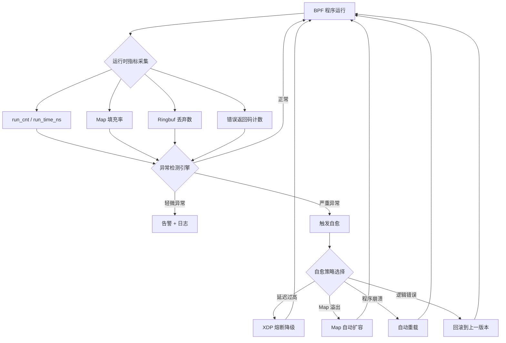
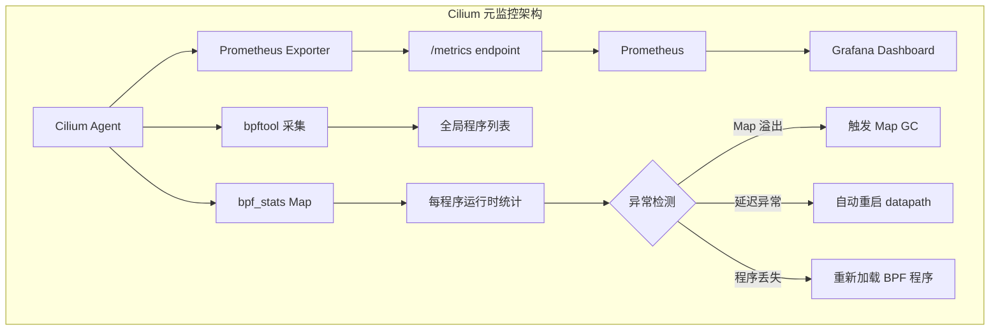
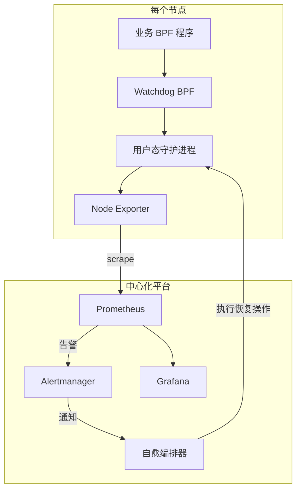
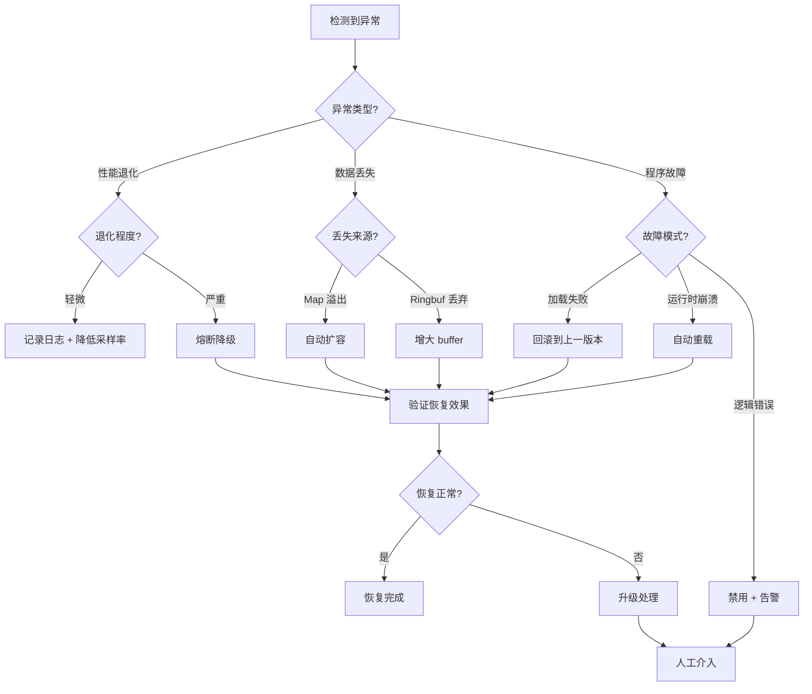

> [!info] eBPF 2026 深度探索系列
> 0. [[2026-04-08-ebpf-comprehensive-learning-roadmap|全栈学习路径总览]]
> 1. [[2026-04-08-ebpf-deep-dive-ch1-registers-and-instructions|第一章：寄存器与指令集]]
> 2. [[2026-04-08-ebpf-deep-dive-ch1-5-function-calls|第一.五章：四种函数调用与动态内存]]
> 3. [[2026-04-08-ebpf-deep-dive-ch1-6-the-verifier|第一.六章：验证器 (Verifier) 的底层逻辑]]
> 4. [[2026-04-08-ebpf-deep-dive-ch2-maps-and-communication|第二章：Map 机制与跨空间通信]]
> 5. [[2026-04-08-ebpf-deep-dive-ch2-5-kptr-and-ownership|第二.五章：kptr (内核指针) 与内存所有权模型]]
> 6. [[2026-04-08-ebpf-deep-dive-ch3-core-and-btf|第三章：CO-RE 与 BTF 的跨版本魔法]]
> 7. [[2026-04-08-ebpf-deep-dive-ch4-tracing-hooks-and-security|第四章：从 kprobe 到 LSM 的追踪全图景]]
> 8. [[2026-04-08-ebpf-deep-dive-ch7-5-uprobes-dynamic-tracing|第七.五章：uprobe 用户态动态追踪]]
> 9. [[2026-04-08-ebpf-deep-dive-ch7-6-bpftime-user-runtime|第七.六章：bpftime 与用户态 eBPF 加速]]
> 10. [[2026-04-08-ebpf-deep-dive-ch18-bpftime-injection-mastery|第七.七章：bpftime 自动化注入与全量监控实战]]
> 11. [[2026-04-08-ebpf-deep-dive-ch7-8-uprobe-selection-guide|第七.八章：uprobe 选型指南：内核态 vs 用户态]]
> 12. [[2026-04-08-ebpf-deep-dive-ch5-xdp-networking-performance|第五章：XDP 极致网络性能与全栈架构]]
> 13. [[2026-04-08-ebpf-deep-dive-ch6-tc-traffic-control|第六章：TC (Traffic Control) 流量调度艺术]]
> 14. [[2026-04-08-ebpf-deep-dive-ch7-security-lsm-enforcement|第七章：LSM BPF 从可观测到安全执法]]
> 15. [[2026-04-08-ebpf-deep-dive-ch8-advanced-tuning-and-profiling|第八章：进阶实战与内核调优]]
> 16. [[2026-04-08-ebpf-deep-dive-ch9-af-xdp-zero-copy|第九章：AF_XDP 零拷贝与用户态协议栈]]
> 17. [[2026-04-08-ebpf-deep-dive-ch10-sched-ext-custom-scheduler|第十章：sched_ext 自定义 CPU 调度器]]
> 18. [[2026-04-08-ebpf-deep-dive-ch11-bpf-iterators|第十一章：BPF Iterators 内核对象迭代器]]
> 19. [[2026-04-08-ebpf-deep-dive-ch12-kfuncs-evolution|第十二章：kfuncs 下一代内核交互标准]]
> 20. [[2026-04-08-ebpf-deep-dive-ch13-usdt-tracing|第十三章：USDT 用户态静态定义追踪]]
> 21. [[2026-04-08-ebpf-deep-dive-ch14-ai-llm-inference-monitoring|第十四章：AI 推理与大模型监控前沿]]
> 22. [[2026-04-08-ebpf-deep-dive-ch15-container-isolation|第十五章：无感增强容器隔离性]]
> 23. [[2026-04-08-ebpf-deep-dive-ch16-ebpf-and-wasm|第十六章：eBPF 与 WebAssembly (WASM) 的共生架构]]
> 24. [[2026-04-08-ebpf-deep-dive-ch17-storage-and-filesystem|第十七章：存储与文件系统加速]]
> 25. [[2026-04-08-ebpf-deep-dive-ch18-lifecycle-and-links|第十八章：生命周期管理与 BPF Links]]
> 26. [[2026-04-08-ebpf-deep-dive-ch19-atomic-updates-and-hot-upgrade|第十九章：程序的原子更新与蓝绿部署]]
> 27. [[2026-04-08-ebpf-deep-dive-ch25-5-stack-trace-correlation|第二五.五章：调用栈与业务请求的深度绑定]]
> 28. [[2026-04-08-ebpf-deep-dive-ch20-edge-iot-acceleration|第二十章：边缘计算与工业协议加速]]
> 29. [[2026-04-08-ebpf-deep-dive-ch21-debugging-and-verifier|第二十一章：调试实战与验证器 (Verifier) 诊断]]
> 30. [[2026-04-08-ebpf-deep-dive-ch22-testing-and-ci-cd|第二十二章：测试与持续集成 (CI/CD) 实战]]
> 31. [[2026-04-08-ebpf-deep-dive-ch23-security-and-permissions|第二十三章：权限细分与 BPF 安全沙箱]]
> 32. **第二十四章：eBPF 程序的内核自愈与监控**
> 33. [[2026-04-08-ebpf-deep-dive-ch25-full-stack-observability|第二十五章：全栈可观测性与端到端追踪]]
> 34. [[2026-04-08-ebpf-deep-dive-ch26-network-security-high-level|第二十六章：网络安全防御的高阶实战]]
> 35. [[2026-04-08-ebpf-deep-dive-ch27-agent-engineering-architecture|第二十七章：工业级模块化 Agent 架构演进]]
> 36. [[2026-04-08-ebpf-deep-dive-ch28-offensive-and-defensive|第二十八章：攻防博弈与 Rootkit 防御]]
> 37. [[2026-04-08-ebpf-deep-dive-ch29-networking-deep-dive|第二十九章：网络应用深水区——负载均衡、Sockmap 与拥塞控制]]
> 38. [[2026-04-08-ebpf-deep-dive-ch30-hardware-offload|第三十章：硬件卸载与 SmartNIC 实战]]
> 39. [[2026-04-08-ebpf-deep-dive-ch31-signed-objects-and-security|第三十一章：内核原生签名与供应链安全]]
> 40. [[2026-04-08-ebpf-deep-dive-ch32-ebpf-for-windows|第三十二章：跨平台崛起——eBPF for Windows]]
> 41. [[2026-04-08-ebpf-deep-dive-ch32-5-macos-status|第三十二.五章：macOS 的特殊路径]]
> 42. [[2026-04-08-ebpf-deep-dive-ch33-serverless-optimization|第三十三章：Serverless 冷启动消除与动态计费]]
> 43. [[2026-04-08-ebpf-deep-dive-ch34-waf-and-rasp|第三十四章：Web 安全革命——内核态 WAF 与 RASP]]
> 44. [[2026-04-08-ebpf-deep-dive-ch35-npu-tpu-ai-hardware|第三十五章：AI 推理硬件 (NPU/TPU) 与硬件定义内核]]
> 45. [[2026-04-08-ebpf-deep-dive-ch36-dynamic-language-introspection|第三十六章：动态语言感知——业务对象的零代码提取]]
> 46. [[2026-04-08-ebpf-deep-dive-ch37-green-computing|第三十七章：绿色计算与能耗精准归因]]
> 47. [[2026-04-08-ebpf-deep-dive-ch38-ecosystem-and-career|第三十八章：2026 生态全景与工程师职业导航]]
> 48. [[2026-04-09-ebpf-deep-dive-ch39-rust-aya-framework|第三十九章：Rust eBPF 开发实战——Aya 框架与安全编程]]
> 49. [[2026-04-09-ebpf-deep-dive-ch40-network-protocols-deep-dive|第四十章：网络协议深度解析——TCP/UDP/QUIC 的 eBPF 视角]]
> 50. [[2026-04-09-ebpf-deep-dive-ch41-memory-safety-and-vulnerabilities|第四十一章：eBPF 内存安全与漏洞分析]]
> 51. [[2026-04-09-ebpf-deep-dive-ch42-service-mesh-integration|第四十二章：eBPF 与 Service Mesh 深度集成]]
---

## 1. 概述：谁来监控监控者？

在 eBPF 成为基础设施核心（如 XDP 承载千万级流量）的 2026 年，BPF 程序本身的健康状态直接关系到系统的稳定性。如果一个 BPF 探针逻辑有误导致执行耗时过长，或者 BPF Map 溢出导致关键数据丢失，系统必须具备自动感知并修复的能力。

**元监控（Meta-Monitoring）** 指的是利用 Linux 内核提供的原生统计能力，结合"用 BPF 监控 BPF"的技术手段，构建的一套自循环运维体系。

> [!quote] 核心理念
> 传统的监控思路是"部署 BPF 程序去监控业务应用"；元监控则是反过来——**用内核基础设施监控 BPF 程序自身**，让监控者也被监控，形成闭环。这不仅仅是技术能力的提升，更是运维哲学的转变：从被动响应走向主动自愈。

本章将系统性地讲解以下内容：

1. **内核原生运行时统计**：如何读取 BPF 程序的执行次数、耗时、指令复杂度等指标
2. **Map 健康度度量**：监控 eBPF 的"内存"，预防溢出和性能退化
3. **用 BPF 监控 BPF**：构建元监控探针的实战方法
4. **自愈机制设计**：熔断、自动降级、自动重载等策略
5. **Watchdog 模式**：看门狗程序的设计与实现
6. **生产级架构**：从单机到集群的元监控部署方案

---

## 2. 运行时统计指标 (Runtime Stats)

内核为每个加载的程序维护了一组高性能计数器，可以通过 `bpftool prog show` 或系统调用直接读取：

- **Run Time (ns)**：程序在内核态执行的总纳秒数。
- **Run Count**：程序被成功触发执行的总次数。
- **Average Latency**：单次执行的平均延迟（计算所得）。
- **Instruction Complexity**：程序通过验证器时被遍历的指令总数。

### 2.1 通过 bpftool 读取运行时指标

```bash
# 查看所有 BPF 程序的运行时统计
$ sudo bpftool prog show

# 查看特定程序的详细信息（包含运行时统计）
$ sudo bpftool prog show id 42

# 输出示例：
# 42: xdp  name: firewall  tag: a1b2c3d4  loaded_at 2026-04-08T10:30:22+0000
#     xlated 2048B  jited 1024B  memlock 4096B  map_ids 10,11
#     run_cnt 1847291038  run_time_ns 92364551900
#     recursion_misses 0
```

关键字段解读：

| 字段 | 含义 | 告警阈值参考 |
|------|------|-------------|
| `run_cnt` | 总执行次数 | 用于计算 QPS |
| `run_time_ns` | 总执行时间 (ns) | 结合 run_cnt 计算平均延迟 |
| `recursion_misses` | 递归调用被拒绝次数 | > 0 即需关注，说明存在循环依赖风险 |
| `jited` | JIT 编译后的机器码大小 | 用于评估内存占用 |

### 2.2 通过 BPF syscall 编程读取

在用户态程序中，可以通过 `bpf_prog_get_info_by_fd()` 系统调用精确获取每个程序的运行时指标：

```c
#include <bpf/libbpf.h>
#include <bpf/bpf.h>

// 获取 BPF 程序的运行时统计
int get_prog_runtime_stats(int prog_fd, struct bpf_prog_info *info) {
    __u32 info_len = sizeof(*info);
    memset(info, 0, info_len);

    // 请求运行时统计信息
    info->nr_map_ids = 0;
    return bpf_prog_get_info_by_fd(prog_fd, info, &info_len);
}

// 使用示例
void monitor_all_programs(void) {
    struct bpf_prog_info info = {};
    __u32 info_len = sizeof(info);
    __u32 prog_ids[1024];
    __u32 nr_progs = 1024;

    // 获取系统中所有已加载的 BPF 程序 ID
    int err = bpf_prog_get_next_id(0, &prog_ids[0]);

    for (int i = 0; prog_ids[i] != 0; i++) {
        int fd = bpf_prog_get_fd_by_id(prog_ids[i]);
        if (fd < 0) continue;

        get_prog_runtime_stats(fd, &info);

        // 计算平均延迟（纳秒）
        __u64 avg_ns = info.run_cnt > 0
            ? info.run_time_ns / info.run_cnt
            : 0;

        printf("Prog ID %u: run_cnt=%llu, avg_latency=%llu ns\n",
               prog_ids[i], info.run_cnt, avg_ns);

        close(fd);
    }
}
```

### 2.3 内核 Tracepoint：BPF 程序执行事件

Linux 内核提供了专门的 tracepoint 来捕获 BPF 程序的执行行为：

```bash
# 查看与 BPF 相关的 tracepoint
$ sudo ls /sys/kernel/debug/tracing/events/bpf/
bpf_prog_load    bpf_map_create  bpf_obj_get     bpf_map_delete_elem
```

这些 tracepoint 为我们提供了"被动监听"的能力——当有新的 BPF 程序被加载或卸载时，我们可以第一时间得知。

---

## 3. Map 健康度度量

Map 是 eBPF 的"内存"。监控 Map 是预防故障的第一线：
- **Hash Map 冲突率**：高填充率下的性能指标。
- **LRU Map 淘汰率**：观察热点数据是否因为 Map 过小而被频繁踢出。
- **内存占用**：实时监控所有 BPF Maps 消耗的物理内存总量。

### 3.1 Map 类型与对应的健康指标

不同的 Map 类型有不同的"病灶"和监控重点：

| Map 类型 | 典型故障模式 | 关键监控指标 | 推荐阈值 |
|----------|-------------|-------------|---------|
| `BPF_MAP_TYPE_HASH` | 填充率过高导致冲突链变长 | 填充率、元素计数 | 填充率 < 75% |
| `BPF_MAP_TYPE_LRU_HASH` | 热点数据被频繁淘汰 | 淘汰计数 | 淘汰率 < 10%/min |
| `BPF_MAP_TYPE_RINGBUF` | 消费不及时导致数据丢失 | 丢弃计数 (`dropped`) | dropped == 0 |
| `BPF_MAP_TYPE_PERCPU_ARRAY` | CPU 间负载不均 | 每个元素的值差异 | 差异 < 3x |
| `BPF_MAP_TYPE_STACK_TRACE` | 栈深度不够被截断 | 截断计数 | truncation == 0 |

### 3.2 读取 Map 统计信息

```bash
# 查看所有 Map 的详细信息
$ sudo bpftool map show

# 查看 Map 的实时元素数量
$ sudo bpftool map dump id 15

# 查看特定 Map 的元信息（包含 max_entries、type 等）
$ sudo bpftool map show id 15

# 输出示例：
# 15: hash  name: conn_track  flags 0x0
#         key 16B  value 64B  max_entries 1048576  memlock 0B
#         btf_id 23
```

### 3.3 Ringbuf 丢弃监控

Ringbuf 是高性能事件传递的首选，但其"丢弃"行为往往是无声的。必须主动监控：

```c
// 用户态监控 Ringbuf 丢弃事件
int check_ringbuf_health(int ringbuf_fd) {
    struct bpf_map_info info = {};
    __u32 info_len = sizeof(info);
    bpf_map_get_info_by_fd(ringbuf_fd, &info, &info_len);

    // 注意：Ringbuf 的丢弃计数需要通过额外的计数器 Map 实现
    // 内核在 6.1+ 版本增加了 bpf_ringbuf_query() 接口
    __u64 discarded = 0;
    int err = bpf_ringbuf_query(ringbuf_fd, BPF_RB_AVAIL_DATA, &discarded);

    if (discarded > 0) {
        fprintf(stderr, "WARNING: Ringbuf discarded %llu bytes of data!\n", discarded);
        return -1;
    }
    return 0;
}
```

### 3.4 Map 内存总量审计

在生产环境中，BPF Maps 的总内存占用可能悄悄增长。以下脚本可以快速审计：

```bash
#!/bin/bash
# audit_bpf_maps.sh - 审计所有 BPF Map 的内存占用

TOTAL_MEMLOCK=0
echo "=== BPF Map Memory Audit ==="
printf "%-8s %-20s %-12s %-12s %-12s\n" "Map ID" "Name" "Type" "Max Entries" "Est. Size(KB)"

for id in $(sudo bpftool map list -j | jq -r '.[].id'); do
    info=$(sudo bpftool map show id $id -j)
    name=$(echo $info | jq -r '.name // "anon"')
    type=$(echo $info | jq -r '.type // "?"')
    max_entries=$(echo $info | jq -r '.max_entries // 0')
    key_size=$(echo $info | jq -r '.key_size // 0')
    value_size=$(echo $info | jq -r '.value_size // 0')

    # 粗略估算内存占用 (key_size + value_size) * max_entries
    est_bytes=$(( (key_size + value_size) * max_entries ))
    est_kb=$(( est_bytes / 1024 ))

    printf "%-8s %-20s %-12s %-12s %-12s\n" "$id" "$name" "$type" "$max_entries" "$est_kb"
    TOTAL_MEMLOCK=$((TOTAL_MEMLOCK + est_kb))
done

echo "---"
echo "Total estimated Map memory: ${TOTAL_MEMLOCK} KB"
```

---

## 4. 代码实战：实现一个 BPF 异常行为哨兵

下面的代码利用 Tracepoints 拦截系统中所有 BPF 程序的加载行为，并根据策略记录可疑的操作。

### 4.1 监控 BPF 程序加载行为

```c
#include "vmlinux.h"
#include <bpf/bpf_helpers.h>
#include <bpf/bpf_tracing.h>

// 挂载点：内核 BPF 程序加载
SEC("tp/bpf/bpf_prog_load")
int audit_new_bpf_prog(struct trace_event_raw_bpf_prog_load *ctx) {
    u32 prog_id = ctx->id;
    u32 prog_type = ctx->type;

    // 逻辑：如果加载的是高风险的 LSM 或 Tracing 程序，记录其元数据
    if (prog_type == BPF_PROG_TYPE_LSM) {
        bpf_printk("META_WATCH: High-risk LSM program loaded (ID: %d)", prog_id);
    }

    return 0;
}
```

### 4.2 监控 BPF 程序卸载行为

除了加载，卸载行为同样值得监控——频繁的加载/卸载循环可能意味着某个用户态守护进程在反复崩溃重启：

```c
// 事件结构：记录 BPF 程序的加载/卸载事件
struct bpf_lifecycle_event {
    u32 prog_id;
    u32 prog_type;
    u64 timestamp;
    u8  event_type; // 0=load, 1=unload
    u32 aux_id;     // 辅助 ID，用于关联
};

struct {
    __uint(type, BPF_MAP_TYPE_RINGBUF);
    __uint(max_entries, 256 * 1024);
} events SEC(".maps");

SEC("tp/bpf/bpf_prog_load")
int on_prog_load(struct trace_event_raw_bpf_prog_load *ctx) {
    struct bpf_lifecycle_event *event;
    event = bpf_ringbuf_reserve(&events, sizeof(*event), 0);
    if (!event) return 0;

    event->prog_id = ctx->id;
    event->prog_type = ctx->type;
    event->timestamp = bpf_ktime_get_ns();
    event->event_type = 0; // load
    event->aux_id = ctx->aux_id;

    bpf_ringbuf_submit(event, 0);
    return 0;
}
```

### 4.3 用户态分析引擎

用户态守护进程消费这些事件后，可以构建一个完整的生命周期图谱：

```c
// 用户态：检测 BPF 程序的频繁加载/卸载模式
void analyze_lifecycle_pattern(struct bpf_lifecycle_event *event) {
    static struct {
        u32 prog_type;
        u64 last_load_time;
        u64 load_count;
    } history[64];

    int idx = event->prog_type % 64;

    if (event->event_type == 0) { // load
        u64 interval = event->timestamp - history[idx].last_load_time;

        // 如果同一个类型的程序在 5 秒内加载超过 10 次，告警
        if (interval < 5000000000ULL && history[idx].load_count > 10) {
            syslog(LOG_WARNING,
                   "FLAP_DETECTED: prog_type=%u loaded %llu times in rapid succession",
                   event->prog_type, history[idx].load_count);
        }

        history[idx].last_load_time = event->timestamp;
        history[idx].load_count++;
    }
}
```

---

## 5. 硬核实战：构建闭环自愈系统

在 2026 年，简单的"记录日志"已经不够了。我们需要 BPF 程序能够根据运行状态自主做出决策。

### 5.1 自愈系统总体架构



### 5.2 监控实战：Map 填充率实时预警

下面的代码通过 `bpf_iter` 定期扫描关键 Map，一旦发现填充率超过 90%，立即通过 RingBuffer 发出高危告警，触发用户态的自动扩容逻辑。

```c
SEC("iter/bpf_map_elem")
int monitor_map_usage(struct bpf_iter__bpf_map_elem *ctx) {
    struct bpf_map *map = ctx->map;
    if (!map) return 0;

    u32 max_entries = BPF_CORE_READ(map, max_entries);
    u32 current_cnt = get_map_element_count(map);

    // 填充率计算
    if (current_cnt > (max_entries * 9 / 10)) {
        bpf_printk("SELF_HEAL: Map ID %d is 90%% full! Triggering scale-out.",
                   BPF_CORE_READ(map, id));
        report_overflow_event(BPF_CORE_READ(map, id));
    }
    return 0;
}
```

### 5.3 自愈实战：XDP 高耗时自动熔断 (Circuit Breaker)

为了防止某个复杂的 XDP 逻辑把 CPU 跑满，我们设计了一个"两阶段"执行模型。

```c
// 全局开关：0 = 正常模式, 1 = 熔断模式 (极简转发)
struct {
    __uint(type, BPF_MAP_TYPE_ARRAY);
    __type(key, u32);
    __type(value, u32);
    __uint(max_entries, 1);
} circuit_breaker_map SEC(".maps");

SEC("xdp")
int xdp_self_heal_prog(struct xdp_md *ctx) {
    u32 key = 0;
    u32 *is_broken = bpf_map_lookup_elem(&circuit_breaker_map, &key);

    // 1. 如果处于熔断模式，执行极简逻辑（直接放行）
    if (is_broken && *is_broken == 1) {
        return XDP_PASS;
    }

    u64 start = bpf_ktime_get_ns();

    // 执行复杂的业务逻辑 (如深度包检测)
    int result = do_complex_heavy_analysis(ctx);

    u64 duration = bpf_ktime_get_ns() - start;

    // 2. 自动监测：如果耗时超过 50 微秒
    if (duration > 50000) {
        u32 on = 1;
        bpf_map_update_elem(&circuit_breaker_map, &key, &on, BPF_ANY);
        bpf_printk("SELF_HEAL: XDP logic too slow (%llu ns). Circuit BROKEN!", duration);
    }

    return result;
}
```

### 5.4 自愈实战：自动重载与回滚

当用户态守护进程检测到 BPF 程序异常时，可以执行自动重载操作。结合第十九章的原子更新机制，我们可以实现安全的版本回滚：

```c
// 用户态自动重载逻辑
int auto_reload_bpf_prog(struct bpf_object **current_obj,
                          const char *object_path,
                          const char *fallback_path) {
    // 1. 尝试加载新版本
    struct bpf_object *new_obj = NULL;
    int err = bpf_object__open_file(object_path, NULL);
    if (err < 0) {
        fprintf(stderr, "Failed to open new program: %s\n", strerror(-err));
        goto try_fallback;
    }

    new_obj = bpf_object__open(object_path);
    err = bpf_object__load(new_obj);

    if (err == 0) {
        // 2. 新版本加载成功，原子替换
        bpf_object__close(*current_obj);
        *current_obj = new_obj;
        syslog(LOG_INFO, "AUTO_RELOAD: Successfully reloaded %s", object_path);
        return 0;
    }

try_fallback:
    // 3. 新版本加载失败，尝试回滚到已知可用版本
    syslog(LOG_ERR, "AUTO_RELOAD: New version failed, trying fallback: %s", fallback_path);
    struct bpf_object *fallback_obj = bpf_object__open(fallback_path);
    if (fallback_obj && bpf_object__load(fallback_obj) == 0) {
        bpf_object__close(*current_obj);
        *current_obj = fallback_obj;
        syslog(LOG_WARNING, "AUTO_RELOAD: Fell back to %s", fallback_path);
        return 0;
    }

    // 4. 回滚也失败——极端情况，需要人工介入
    syslog(LOG_CRIT, "AUTO_RELOAD: CRITICAL - Both new and fallback versions failed!");
    return -1;
}
```

---

## 6. Watchdog BPF 程序

Watchdog（看门狗）是一种经典的自愈模式。在 BPF 生态中，Watchdog 程序定期检查被监控程序的健康状态，并在检测到异常时执行预设的恢复动作。

### 6.1 Watchdog 的设计原则

1. **独立性**：Watchdog 程序必须与被监控程序完全解耦，即使被监控程序崩溃，Watchdog 也不受影响
2. **轻量级**：Watchdog 本身的执行开销必须极低，否则会干扰被监控系统的正常运行
3. **可升级**：Watchdog 程序本身也需要支持热更新（参见第十九章）
4. **最小权限**：Watchdog 只需要读权限，不应修改被监控程序的 Map 数据

### 6.2 Watchdog 实现：心跳检测

```c
// === Watchdog BPF 程序 ===

// 被监控程序的心跳 Map（由被监控程序负责写入）
struct {
    __uint(type, BPF_MAP_TYPE_HASH);
    __type(key, u32);     // prog_id
    __type(value, u64);   // last_heartbeat_ns
    __uint(max_entries, 64);
} heartbeat_map SEC(".maps");

// Watchdog 配置：心跳超时阈值（纳秒）
#define HEARTBEAT_TIMEOUT_NS (3000000000ULL) // 3 seconds

// Watchdog 事件：被监控程序失联
struct watchdog_event {
    u32 prog_id;
    u64 last_heartbeat;
    u64 detection_time;
};

struct {
    __uint(type, BPF_MAP_TYPE_RINGBUF);
    __uint(max_entries, 64 * 1024);
} watchdog_events SEC(".maps");

// 定时触发：使用 perf_event NMI 或 timer
SEC("raw_tp/sched_tick")
int watchdog_check(struct bpf_raw_tracepoint_args *ctx) {
    u64 now = bpf_ktime_get_ns();
    u32 lookup_key = 0;

    // 遍历心跳 Map，检查所有被监控程序
    int err;
    u32 *last_hb;
    u32 next_key;

    // 查找第一个元素
    err = bpf_map_lookup_elem(&heartbeat_map, &lookup_key, &next_key);
    if (err) {
        // 使用 iter 方式遍历
        return 0;
    }

    // 遍历所有元素
    #pragma unroll
    for (int i = 0; i < 64; i++) {
        last_hb = bpf_map_lookup_elem(&heartbeat_map, &next_key);
        if (!last_hb) break;

        if (now - *last_hb > HEARTBEAT_TIMEOUT_NS) {
            // 心跳超时！被监控程序可能已失联
            struct watchdog_event *ev = bpf_ringbuf_reserve(
                &watchdog_events, sizeof(*ev), 0);
            if (ev) {
                ev->prog_id = next_key;
                ev->last_heartbeat = *last_hb;
                ev->detection_time = now;
                bpf_ringbuf_submit(ev, 0);
            }
            bpf_printk("WATCHDOG: Prog ID %u missed heartbeat!", next_key);
        }

        // 获取下一个 key
        if (bpf_map_get_next_key(&heartbeat_map, &next_key, &next_key) != 0)
            break;
    }

    return 0;
}
```

### 6.3 被监控程序侧：心跳写入

被监控程序需要定期向心跳 Map 写入当前时间戳，证明自己仍然存活：

```c
// === 被监控程序中的心跳逻辑 ===

struct {
    __uint(type, BPF_MAP_TYPE_HASH);
    __type(key, u32);
    __type(value, u64);
    __uint(max_entries, 64);
} heartbeat_map SEC(".maps");

// 每隔一定次数的执行，更新一次心跳
static __always_inline void update_heartbeat(u32 prog_id) {
    u64 now = bpf_ktime_get_ns();
    bpf_map_update_elem(&heartbeat_map, &prog_id, &now, BPF_ANY);
}

SEC("xdp")
int xdp_monitored_prog(struct xdp_md *ctx) {
    // 每 10000 个包更新一次心跳（避免过于频繁）
    if (ctx->rx_queue_index % 10000 == 0) {
        update_heartbeat(MY_PROG_ID);
    }

    // ... 正常的业务逻辑 ...
    return XDP_PASS;
}
```

### 6.4 用户态 Watchdog 守护进程

```c
// 用户态 Watchdog 守护进程
#include <bpf/libbpf.h>
#include <bpf/bpf.h>
#include <signal.h>
#include <time.h>

static volatile bool running = true;

void sig_handler(int sig) {
    running = false;
}

int main(int argc, char **argv) {
    struct bpf_object *obj;
    struct bpf_map *events_map;
    struct bpf_ring_buffer *rb;
    int err;

    signal(SIGINT, sig_handler);
    signal(SIGTERM, sig_handler);

    // 加载 Watchdog BPF 程序
    obj = bpf_object__open_file("watchdog.bpf.o", NULL);
    err = bpf_object__load(obj);
    if (err) {
        fprintf(stderr, "Failed to load watchdog: %d\n", err);
        return 1;
    }

    // 设置 Ringbuf 回调
    events_map = bpf_object__find_map_by_name(obj, "watchdog_events");
    rb = bpf_ring_buffer__new(
        bpf_map__fd(events_map), 4 * 1024 * 1024,  // 4MB ring buffer
        handle_watchdog_event, NULL                   // callback + ctx
    );

    printf("Watchdog started. Monitoring BPF programs...\n");

    // 主循环
    while (running) {
        err = bpf_ring_buffer__poll(rb, 1000);  // 1s timeout
        if (err < 0 && err != -EINTR) {
            fprintf(stderr, "Poll error: %d\n", err);
            break;
        }

        // 周期性健康检查：读取运行时统计
        periodic_health_check();
    }

    // 清理
    bpf_ring_buffer__free(rb);
    bpf_object__close(obj);
    return 0;
}

// 处理 Watchdog 事件回调
static int handle_watchdog_event(void *ctx, void *data, size_t len) {
    struct watchdog_event *ev = data;

    syslog(LOG_CRIT, "WATCHDOG ALERT: Prog ID %u unresponsive! "
           "Last heartbeat: %llu ns ago",
           ev->prog_id, ev->detection_time - ev->last_heartbeat);

    // 触发自愈：尝试重新加载该程序
    trigger_recovery(ev->prog_id);

    return 0;
}
```

---

## 7. 健康检查模式

### 7.1 三级健康检查体系

生产环境中，BPF 程序的健康检查应当分层实施，每一层覆盖不同的故障模式：


**第一层：内核态即时检测**

在 BPF 程序内部嵌入自检逻辑，每次执行时快速判断自身状态是否正常：

```c
// 内核态自检：统计错误返回码
struct {
    __uint(type, BPF_MAP_TYPE_ARRAY);
    __type(key, u32);
    __type(value, u64);
    __uint(max_entries, 4);
} error_stats SEC(".maps");

#define STAT_PARSE_ERR    0
#define STAT_MAP_FULL     1
#define STAT_UNKNOWN      2
#define STAT_TOTAL_EXEC   3

static __always_inline void record_error(u32 error_type) {
    u32 key = error_type;
    u64 *count = bpf_map_lookup_elem(&error_stats, &key);
    if (count) {
        __sync_fetch_and_add(count, 1);
    }
}

static __always_inline void check_self_health(void) {
    u32 total_key = STAT_TOTAL_EXEC;
    u32 err_key = STAT_PARSE_ERR;
    u64 *total = bpf_map_lookup_elem(&error_stats, &total_key);
    u64 *errors = bpf_map_lookup_elem(&error_stats, &err_key);

    if (total && errors && *total > 1000) {
        // 错误率超过 1% 触发自检告警
        if (*errors * 100 > *total) {
            bpf_printk("SELF_CHECK: Error rate %.2f%% exceeds 1%% threshold",
                       (double)(*errors) / (*total) * 100);
        }
    }
}
```

**第二层：用户态周期巡检**

用户态守护进程定期（如每 30 秒）遍历所有 BPF 程序，采集运行时指标并与阈值比对：

```bash
#!/bin/bash
# health_check.sh - BPF 程序健康检查巡检脚本

THRESHOLD_AVG_LATENCY_NS=100000   # 100us
THRESHOLD_RECURSION=0
THRESHOLD_MAP_FILL=80              # 80%

echo "=== BPF Health Check $(date) ==="

# 检查每个程序的运行时指标
for prog_id in $(sudo bpftool prog list -j | jq -r '.[].id'); do
    info=$(sudo bpftool prog show id $prog_id -j)

    run_cnt=$(echo $info | jq -r '.run_cnt // 0')
    run_time_ns=$(echo $info | jq -r '.run_time_ns // 0')
    recursion=$(echo $info | jq -r '.recursion_misses // 0')
    name=$(echo $info | jq -r '.name // "anon"')

    if [ "$run_cnt" -gt 0 ]; then
        avg_ns=$((run_time_ns / run_cnt))

        if [ "$avg_ns" -gt "$THRESHOLD_AVG_LATENCY_NS" ]; then
            echo "[CRITICAL] $name (ID $prog_id): avg latency ${avg_ns}ns exceeds threshold"
        fi
    fi

    if [ "$recursion" -gt "$THRESHOLD_RECURSION" ]; then
        echo "[WARNING] $name (ID $prog_id): recursion_misses=$recursion"
    fi
done

echo "=== Check Complete ==="
```

**第三层：分布式全局聚合**

在集群环境中，单节点的指标可能不够全面。通过将各节点的元监控数据汇聚到中心化系统（如 Prometheus + Grafana），可以实现：

- 节点间横向对比：发现个别节点的异常行为
- 趋势分析：识别性能退化的缓慢趋势
- 容量规划：基于历史数据预测 Map 大小的增长趋势

### 7.2 健康检查与告警矩阵

| 故障模式 | 检测层级 | 检测方式 | 自愈策略 | 恢复时间目标 |
|---------|---------|---------|---------|------------|
| XDP 延迟飙升 | L1 | 内核态耗时检测 | 熔断降级 | < 1ms |
| Map 填充率过高 | L2 | 用户态巡检 | 自动扩容或清理 | < 30s |
| Ringbuf 数据丢弃 | L2 | 丢弃计数监控 | 增大 buffer 或降频 | < 60s |
| 程序加载失败 | L2 | tracepoint 监听 | 回滚到已知版本 | < 60s |
| 节点指标异常 | L3 | 聚合对比分析 | 隔离节点 + 负载迁移 | < 5min |

---

## 8. 生产案例

### 8.1 Cilium 的元监控实践

Cilium 作为 2026 年最主流的 Kubernetes CNI，内置了一套完整的 BPF 元监控系统：



关键指标暴露（Prometheus 格式）：

```
# BPF 程序运行时统计
cilium_bpf_prog_run_count_total{prog_name="from-container",prog_type="xdp"} 1847291038
cilium_bpf_prog_run_time_ns_total{prog_name="from-container",prog_type="xdp"} 92364551900
cilium_bpf_prog_run_time_ns_bucket{prog_name="from-container",le="10000"} 1500000000
cilium_bpf_prog_run_time_ns_bucket{prog_name="from-container",le="50000"} 1800000000
cilium_bpf_prog_run_time_ns_bucket{prog_name="from-container",le="+Inf"} 1847291038

# Map 统计
cilium_bpf_map_entries{map_name="ct_map_v4"} 524288
cilium_bpf_map_entries_max{map_name="ct_map_v4"} 1048576
cilium_bpf_map_operations_total{map_name="ct_map_v4",operation="update"} 892345671
cilium_bpf_map_operations_total{map_name="ct_map_v4",operation="lookup"} 2341567890

# 告警规则示例
# ALERT: cilium_bpf_prog_high_latency
#   expr: histogram_quantile(0.99, rate(cilium_bpf_prog_run_time_ns_bucket[5m])) > 50000
#   for: 2m
#   labels:
#     severity: warning
```

### 8.2 Pixie 的"用 BPF 监控 BPF"方案

Pixie（pixie.dev）采用了一种独特的方案：利用 BPF tracepoint 去监控自身运行的 BPF 程序，构建了一个完全自包含的元监控系统。

其核心思路是：

1. **分类采集**：将 BPF 程序按类型分组（网络、追踪、安全），分别设置不同的健康阈值
2. **自适应采样**：当系统负载低时提高监控频率，负载高时降低频率，避免监控本身成为性能瓶颈
3. **自愈链路**：从检测到异常到触发恢复的完整链路控制在 10 秒以内

### 8.3 Katran 的 XDP 负载均衡自愈

Meta（Facebook）的 Katran 是一个基于 XDP 的四层负载均衡器。在其 2026 年的架构中，实现了以下自愈能力：

```yaml
# Katran 自愈配置示例
self_healing:
  enabled: true
  rules:
    - name: xdp_latency_breaker
      condition: "avg_latency_ns > 20000"  # 20us
      action: circuit_break
      cooldown_seconds: 30
      notification: [pagerduty, slack]

    - name: lru_map_overflow
      condition: "lru_evict_rate > 10000"  # 10k/s
      action: dynamic_resize
      max_scale_factor: 4
      notification: [slack]

    - name: program_not_loaded
      condition: "prog_id == 0"            # 程序丢失
      action: immediate_reload
      fallback_version: "katran-stable-v3.2"
      notification: [pagerduty]
```

---

## 9. 元监控的部署与运维

### 9.1 部署架构



### 9.2 元监控本身的可靠性保障

元监控系统自身也可能出现故障。需要为元监控加上"监控的监控"：

1. **Watchdog 心跳**：Watchdog 程序本身也写入心跳，由 init 系统或 systemd 监控其存活性
2. **指标缺失检测**：如果 Prometheus 发现某个节点的 BPF 指标突然全部消失，说明元监控本身可能出问题了
3. **定期演练**：每月进行一次故障注入演练，验证自愈链路的有效性

---

## 10. 内核自愈 (Self-Healing) 策略总结

元监控让 eBPF 从"盲目运行"走向了"可管理运行"。在 2026 年，一个合格的 eBPF 探针系统不仅要完成业务功能，更要通过全方位的指标反馈和自愈逻辑，证明其在内核中的"无害性"与"健壮性"。

### 10.1 自愈策略决策树



### 10.2 最佳实践清单

| 实践 | 说明 | 优先级 |
|------|------|--------|
| 为每个 BPF 程序设置性能预算 | 明确执行延迟上限和内存上限 | P0 |
| 实现熔断机制 | 防止单个 BPF 程序拖垮整个系统 | P0 |
| 启用 Watchdog 心跳 | 及时发现程序失联 | P0 |
| 监控 Ringbuf 丢弃数 | 确保事件传递的可靠性 | P0 |
| 定期审计 Map 大小 | 预防内存泄漏 | P1 |
| 实现版本回滚能力 | 保证可以快速恢复到已知稳定版本 | P1 |
| 配置告警规则 | 将关键指标接入告警系统 | P1 |
| 编写故障演练手册 | 定期验证自愈链路的有效性 | P2 |
| 实现分布式指标聚合 | 在集群环境中进行全局健康评估 | P2 |

---

## 11. FAQ

### Q1：BPF 程序的运行时统计会带来性能开销吗？

**不会。** 内核的运行时统计（`run_cnt`、`run_time_ns`）是通过 per-CPU 计数器实现的，每次执行仅增加一个 per-CPU 变量，开销在纳秒级别，对生产环境可忽略不计。但需要注意，在超高频场景（如 10M+ PPS 的 XDP）下，统计数据的读取（通过 `bpftool` 或 syscall）可能因缓存一致性协议产生额外开销，建议将采集频率控制在每 10-30 秒一次。

### Q2：元监控的 BPF 程序会不会和被监控程序产生冲突？

**需要设计时规避。** 元监控程序和被监控程序如果挂载在同一个 hook 点（如都挂在 XDP 上），会形成级联调用，可能增加延迟。推荐的做法是：

- 元监控使用独立的 hook 点（如 `tp/bpf/` tracepoint），不干扰数据面
- 如果必须在同一个 hook 点，将元监控程序放在程序数组的最后位置
- 使用 `bpf_prog_array` 的尾调用机制隔离执行路径

### Q3：自动重载 BPF 程序时，如何避免流量中断？

**结合第十九章的原子更新机制。** 具体步骤：

1. 先加载新版本的 BPF 程序到内核（此时还未绑定到 hook 点）
2. 通过 `bpf_link` 的原子替换功能，一次性将旧程序替换为新程序
3. 替换过程在内核层面是原子的，不会出现"两个版本同时生效"或"完全没有程序生效"的中间状态
4. 如果新程序验证失败（如 verifier 拒绝），旧程序继续运行不受影响

### Q4：Watchdog 的心跳间隔应该设置多少？

**取决于被监控程序的特性。** 一般建议：

- 高频 XDP 程序：每 10000 次执行更新一次心跳（约 1ms 间隔）
- Tracing 类程序：每 1 秒更新一次心跳
- 低频事件处理程序：每 5 秒更新一次心跳
- Watchdog 的超时阈值建议设置为心跳间隔的 3-5 倍，避免误报

### Q5：在 Kubernetes 环境中如何部署元监控系统？

**推荐 DaemonSet 模式。** 每个节点运行一个元监控 Pod，该 Pod 包含：

1. `watchdog.bpf.o`：Watchdog BPF 程序
2. `monitor-daemon`：用户态守护进程（采集指标 + 执行自愈）
3. `node-exporter`：暴露 Prometheus 格式的指标

关键配置要点：

```yaml
apiVersion: apps/v1
kind: DaemonSet
metadata:
  name: bpf-meta-monitor
  namespace: kube-system
spec:
  template:
    spec:
      hostPID: true        # 需要访问宿主机的 PID namespace
      hostNetwork: true    # 需要访问宿主机的网络 namespace
      containers:
        - name: monitor
          image: bpf-monitor:latest
          securityContext:
            privileged: true  # BPF 程序加载需要 CAP_BPF / CAP_SYS_ADMIN
          volumeMounts:
            - name: bpf-fs
              mountPath: /sys/fs/bpf
      volumes:
        - name: bpf-fs
          hostPath:
            path: /sys/fs/bpf
```

### Q6：元监控系统自身的安全性如何保障？

元监控系统具有很高的权限（可以加载/卸载 BPF 程序），必须严格保护：

1. **最小权限原则**：元监控程序只赋予必要的 capability（`CAP_BPF`），避免使用 `CAP_SYS_ADMIN`
2. **程序签名**：元监控加载的 BPF 程序应当经过内核签名验证（参见第三十一章）
3. **审计日志**：元监控的所有操作（加载、卸载、修改 Map）都记录审计日志
4. **网络隔离**：元监控的指标上报通道与数据面网络隔离，防止指标数据泄露
5. **防篡改**：元监控的二进制文件和配置文件应当使用 dm-verity 或 IMA 保护完整性

---

## 12. 总结

本章系统性地讲解了 eBPF 元监控与自愈体系的设计与实现：

1. **运行时统计** 是元监控的基础数据源，内核原生提供且零额外开销
2. **Map 健康度** 是预防故障的第一道防线，不同 Map 类型有不同的监控重点
3. **"用 BPF 监控 BPF"** 是构建元监控探针的核心技术手段
4. **自愈机制** 包括熔断降级、自动扩容、自动重载和版本回滚四种主要策略
5. **Watchdog 模式** 通过心跳检测实现程序失联的快速发现
6. **三级健康检查体系** 从内核态即时检测到分布式全局聚合，层层递进
7. **生产案例**（Cilium、Pixie、Katran）展示了元监控在实际场景中的成熟应用

> [!tip] 下一步
> 下一章 [[2026-04-08-ebpf-deep-dive-ch25-full-stack-observability|第二十五章：全栈可观测性与端到端追踪]] 将在本章元监控的基础上，进一步讲解如何将 BPF 监控数据与分布式追踪、日志系统、指标平台整合，构建完整的全栈可观测性解决方案。
