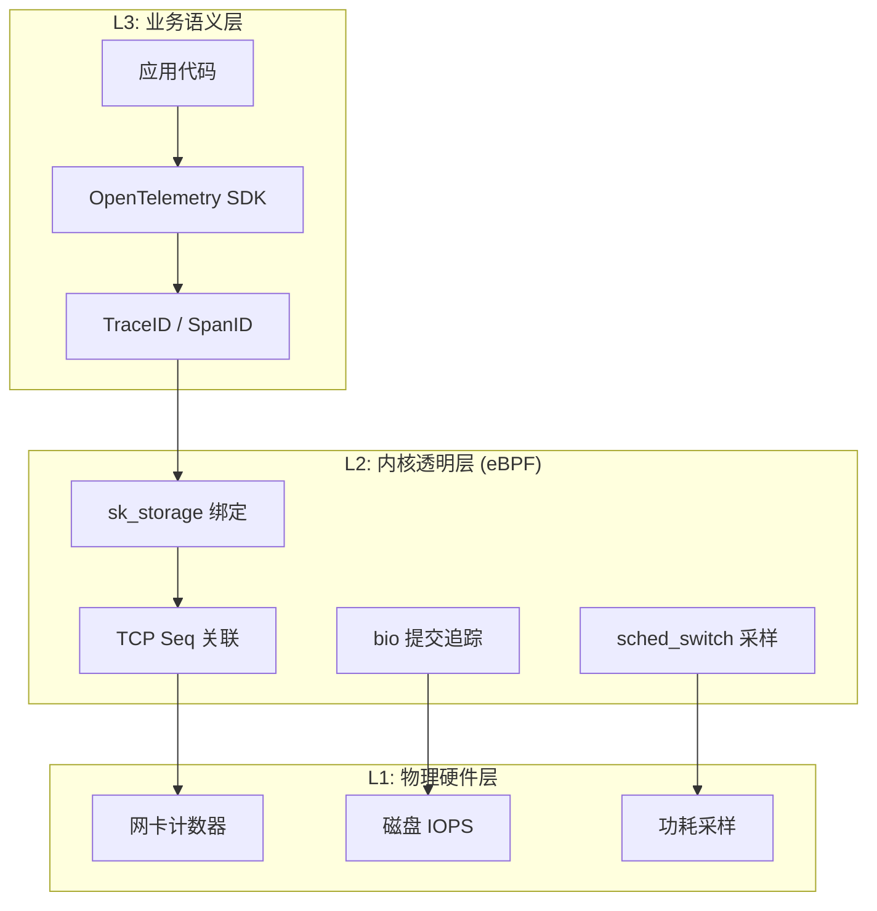
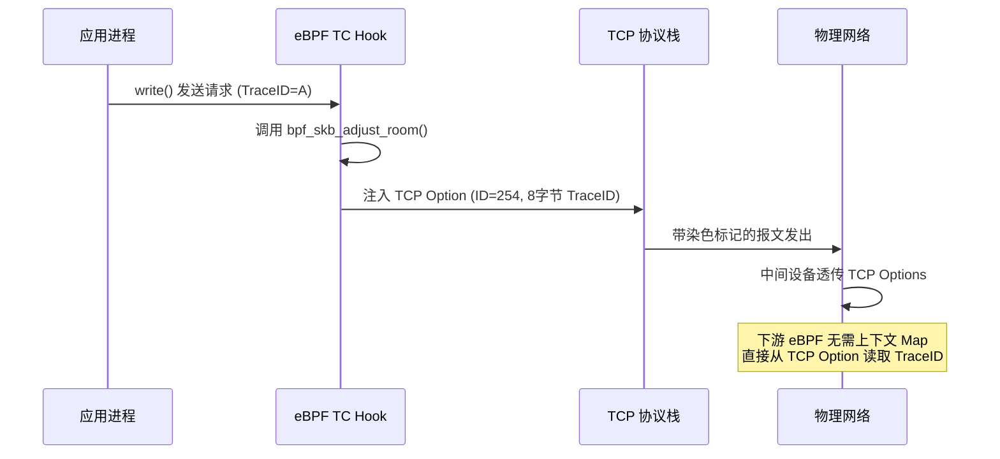
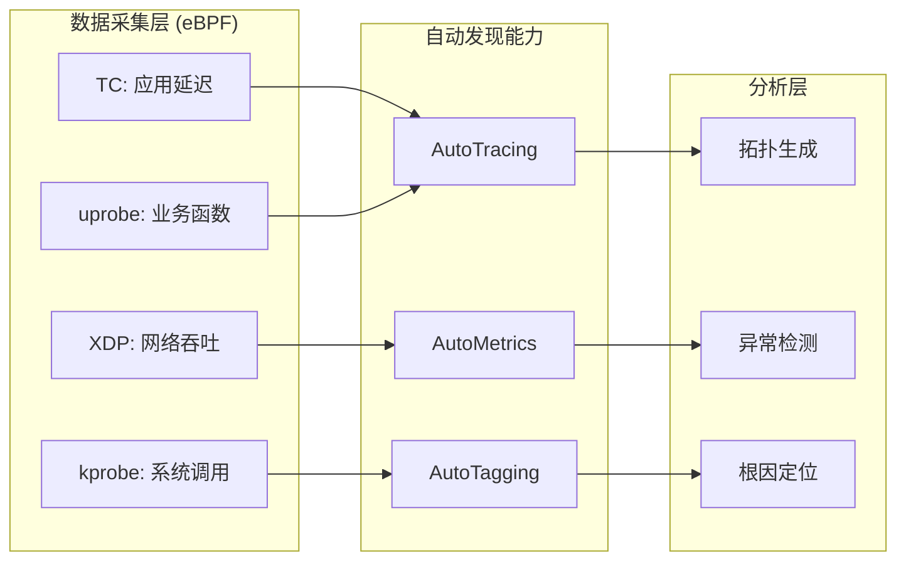

> [!info] eBPF 2026 深度探索系列 0. [[2026-04-08-ebpf-comprehensive-learning-roadmap|全栈学习路径总览]]
>
> 1. [[2026-04-08-ebpf-deep-dive-ch1-registers-and-instructions|第一章：寄存器与指令集]]
> 2. [[2026-04-08-ebpf-deep-dive-ch1-5-function-calls|第一.五章：四种函数调用与动态内存]]
> 3. [[2026-04-08-ebpf-deep-dive-ch1-6-the-verifier|第一.六章：验证器 (Verifier) 的底层逻辑]]
> 4. [[2026-04-08-ebpf-deep-dive-ch2-maps-and-communication|第二章：Map 机制与跨空间通信]]
> 5. [[2026-04-08-ebpf-deep-dive-ch2-5-kptr-and-ownership|第二.五章：kptr (内核指针) 与内存所有权模型]]
> 6. [[2026-04-08-ebpf-deep-dive-ch3-core-and-btf|第三章：CO-RE 与 BTF 的跨版本魔法]]
> 7. [[2026-04-08-ebpf-deep-dive-ch4-tracing-hooks-and-security|第四章：从 kprobe 到 LSM 的追踪全图景]]
> 8. [[2026-04-08-ebpf-deep-dive-ch7-5-uprobes-dynamic-tracing|第七.五章：uprobe 用户态动态追踪原理]]
> 9. [[2026-04-08-ebpf-deep-dive-ch7-6-bpftime-user-runtime|第七.六章：bpftime 与用户态 eBPF 加速]]
> 10. [[2026-04-08-ebpf-deep-dive-ch18-bpftime-injection-mastery|第七.七章：bpftime 自动化注入与全量监控实战]]
> 11. [[2026-04-08-ebpf-deep-dive-ch7-8-uprobe-selection-guide|第七.八章：uprobe 选型指南：内核态 vs 用户态]]
> 12. [[2026-04-08-ebpf-deep-dive-ch5-xdp-networking-performance|第五章：XDP 极致网络性能与全栈架构]]
> 13. [[2026-04-08-ebpf-deep-dive-ch6-tc-traffic-control|第六章：TC (Traffic Control) 流量调度艺术]]
> 14. [[2026-04-08-ebpf-deep-dive-ch7-security-lsm-enforcement|第七章：LSM BPF 从可观测到安全执法]]
> 15. [[2026-04-08-ebpf-deep-dive-ch8-advanced-tuning-and-profiling|第八章：进阶实战与内核调优]]
> 16. [[2026-04-08-ebpf-deep-dive-ch9-af-xdp-zero-copy|第九章：AF_XDP 零拷贝与用户态协议栈]]
> 17. [[2026-04-08-ebpf-deep-dive-ch10-sched-ext-custom-scheduler|第十章：sched_ext 自定义 CPU 调度器]]
> 18. [[2026-04-08-ebpf-deep-dive-ch11-bpf-iterators|第十一章：BPF Iterators 内核对象迭代器]]
> 19. [[2026-04-08-ebpf-deep-dive-ch12-kfuncs-evolution|第十二章：kfuncs 下一代内核交互标准]]
> 20. [[2026-04-08-ebpf-deep-dive-ch13-usdt-tracing|第十三章：USDT 用户态静态定义追踪]]
> 21. [[2026-04-08-ebpf-deep-dive-ch14-ai-llm-inference-monitoring|第十四章：AI 推理与大模型监控前沿]]
> 22. [[2026-04-08-ebpf-deep-dive-ch15-container-isolation|第十五章：无感增强容器隔离性]]
> 23. [[2026-04-08-ebpf-deep-dive-ch16-ebpf-and-wasm|第十六章：eBPF 与 WebAssembly (WASM) 的共生架构]]
> 24. [[2026-04-08-ebpf-deep-dive-ch17-storage-and-filesystem|第十七章：存储与文件系统加速]]
> 25. [[2026-04-08-ebpf-deep-dive-ch18-lifecycle-and-links|第十八章：生命周期管理与 BPF Links]]
> 26. [[2026-04-08-ebpf-deep-dive-ch19-atomic-updates-and-hot-upgrade|第十九章：程序的原子更新与蓝绿部署]]
> 27. [[2026-04-08-ebpf-deep-dive-ch25-5-stack-trace-correlation|第二五.五章：调用栈与业务请求的深度绑定]]
> 28. [[2026-04-08-ebpf-deep-dive-ch20-edge-iot-acceleration|第二十章：边缘计算与工业协议加速]]
> 29. [[2026-04-08-ebpf-deep-dive-ch21-debugging-and-verifier|第二十一章：调试实战与验证器 (Verifier) 诊断]]
> 30. [[2026-04-08-ebpf-deep-dive-ch22-testing-and-ci-cd|第二十二章：测试与持续集成 (CI/CD) 实战]]
> 31. [[2026-04-08-ebpf-deep-dive-ch23-security-and-permissions|第二十三章：权限细分与 BPF 安全沙箱]]
> 32. [[2026-04-08-ebpf-deep-dive-ch24-meta-monitoring-and-self-healing|第二十四章：eBPF 程序的内核自愈与监控]]
> 33. **第二十五章：全栈可观测性与端到端追踪**
> 34. [[2026-04-08-ebpf-deep-dive-ch26-network-security-high-level|第二十六章：网络安全防御的高阶实战]]
> 35. [[2026-04-08-ebpf-deep-dive-ch27-agent-engineering-architecture|第二十七章：工业级模块化 Agent 架构演进]]
> 36. [[2026-04-08-ebpf-deep-dive-ch28-offensive-and-defensive|第二十八章：攻防博弈与 Rootkit 防御]]
> 37. [[2026-04-08-ebpf-deep-dive-ch29-networking-deep-dive|第二十九章：网络应用深水区——负载均衡、Sockmap 与拥塞控制]]
> 38. [[2026-04-08-ebpf-deep-dive-ch30-hardware-offload|第三十章：硬件卸载与 SmartNIC 实战]]
> 39. [[2026-04-08-ebpf-deep-dive-ch31-signed-objects-and-security|第三十一章：内核原生签名与供应链安全]]
> 40. [[2026-04-08-ebpf-deep-dive-ch32-ebpf-for-windows|第三十二章：跨平台崛起——eBPF for Windows]]
> 41. [[2026-04-08-ebpf-deep-dive-ch32-5-macos-status|第三十二.五章：macOS 的特殊路径]]
> 42. [[2026-04-08-ebpf-deep-dive-ch33-serverless-optimization|第三十三章：Serverless 冷启动消除与动态计费]]
> 43. [[2026-04-08-ebpf-deep-dive-ch34-waf-and-rasp|第三十四章：Web 安全革命——内核态 WAF 与 RASP]]
> 44. [[2026-04-08-ebpf-deep-dive-ch35-npu-tpu-ai-hardware|第三十五章：AI 推理硬件 (NPU/TPU) 与硬件定义内核]]
> 45. [[2026-04-08-ebpf-deep-dive-ch36-dynamic-language-introspection|第三十六章：动态语言感知——业务对象的零代码提取]]
> 46. [[2026-04-08-ebpf-deep-dive-ch37-green-computing|第三十七章：绿色计算与能耗精准归因]]
> 47. [[2026-04-08-ebpf-deep-dive-ch38-ecosystem-and-career|第三十八章：2026 生态全景与工程师职业导航]]
> 48. [[2026-04-09-ebpf-deep-dive-ch39-rust-aya-framework|第三十九章：Rust eBPF 开发实战——Aya 框架与安全编程]]
> 49. [[2026-04-09-ebpf-deep-dive-ch40-network-protocols-deep-dive|第四十章：网络协议深度解析——TCP/UDP/QUIC 的 eBPF 视角]]
> 50. [[2026-04-09-ebpf-deep-dive-ch41-memory-safety-and-vulnerabilities|第四十一章：eBPF 内存安全与漏洞分析]]
> 51. [[2026-04-09-ebpf-deep-dive-ch42-service-mesh-integration|第四十二章：eBPF 与 Service Mesh 深度集成]]

---

## 1. 概述：打通"上帝视角"的最后一公里

在 2026 年，可观测性的定义已经从单纯的日志和指标进化为**全链路全息透视**。传统的分布式追踪（如 OpenTelemetry）虽然能展示微服务间的调用关系，但一旦涉及到内核协议栈丢包、磁盘 I/O 抖动或进程调度延迟，便会产生巨大的盲区。

**eBPF** 的整合价值在于：通过在内核态实时关联 **Trace ID** 与 **内核对象（Socket, PID, Bio）**，实现了从业务代码到物理硬件的端到端画像。

### 1.1 可观测性三层模型

全栈可观测性在 2026 年形成了成熟的三层架构模型：



| 层级          | 关注点             | 传统方案                | eBPF 方案               |
| :------------ | :----------------- | :---------------------- | :---------------------- |
| **L3 业务层** | 请求链路、错误率   | OTel SDK 手动埋点       | uprobe 自动提取 TraceID |
| **L2 内核层** | 网络延迟、调度抖动 | ftrace / perf（开销大） | eBPF 低开销实时采样     |
| **L1 硬件层** | 网卡丢包、磁盘 I/O | SNMP / smartctl         | XDP 统计 + perf_event   |

---

## 2. 核心技术：基于 sk_storage 的强关联

在 2026 年的工程实践中，依靠 PID/TID 的"进程级关联"已不再足够。为了实现精准到物理包的追踪，我们利用 **`sk_storage` (套接字存储)** 技术，将业务上下文直接"烙印"在内核的 Socket 对象上。

### 2.1 TraceID 的"物理绑定"

1. **注入阶段**：当应用层发起请求时，eBPF 程序拦截 `TraceID`，并将其存入当前 Socket 的 `sk_storage` 中。
2. **包提取阶段**：在 TC 或 XDP 钩子中，eBPF 能够直接从 `skb->sk` 访问关联的存储。
3. **Seq 关联**：读取 TCP 头部中的 **Sequence Number (Seq)**。此时，我们便建立了一个不可篡改的映射关系：**业务请求 ID $\leftrightarrow$ 物理报文序列号**。

### 2.2 sk_storage 的内核实现原理

`BPF_MAP_TYPE_SK_STORAGE` 在内核中并非普通的 HashMap，它利用了 `struct sock` 内置的扩展存储机制：

```c
// 内核结构（简化）
struct sock {
    // ... 标准 sock 字段 ...
    struct bpf_local_storage __rcu *sk_bpf_storage;
};

struct bpf_local_storage {
    struct bpf_local_storage_elem *slist;
    struct rcu_head rcu;
};
```

**关键特性**：

- **生命周期绑定**：存储随 Socket 创建而分配，随 Socket 销毁而自动释放，无需手动清理
- **零拷贝访问**：TC/XDP 钩子中通过 `skb->sk` 直接获取指针，无额外内存拷贝
- **并发安全**：内核使用 RCU（Read-Copy-Update）机制保护并发读写

---

## 3. 架构思辨：为什么五元组与 PID 还不够？

一个常见的疑问是：既然我们已经有了五元组（IP/Port）和进程 PID，难道不足以定位问题吗？在 2026 年的复杂环境下，答案是**否定**的。

### 3.1 长连接多路复用的挑战

现代协议（gRPC, HTTP/2）普遍采用长连接。一个固定的五元组管道内，可能在数分钟内承载成千上万个不同的业务请求（TraceID）。

- **粒度缺失**：仅靠 PID，你只能定位到"连接"级别。当发生网络抖动时，你无法得知是哪个具体的 TraceID 受到了影响。
- **字节级定位**：TCP Seq 序列号提供了流内部的"绝对坐标"。通过将 TraceID 映射到特定的 Seq 区间，eBPF 实现了对**请求级**网络质量的精准度量。

### 3.2 跨设备观测的唯一语言

报文一旦离开主机，PID 信息便不复存在。

- **统一标识**：Seq 序列号是 TCP 头部原生携带的字段。无论是中间路径的交换机，还是对端服务器，都能通过 Seq 识别出该报文的业务身份。这使得**全路径（End-to-End）**的延迟分析成为可能。

### 3.3 关联精度对比表

| 标识维度    | 粒度      | 跨主机       | 区分多路复用 | 适用场景             |
| :---------- | :-------- | :----------- | :----------- | :------------------- |
| PID/TID     | 进程/线程 | 否           | 否           | 进程级资源统计       |
| 五元组      | 连接      | 是           | 否           | 防火墙策略、流量统计 |
| TCP Seq     | 报文      | 是           | 是           | 请求级延迟追踪       |
| TraceID+Seq | 业务请求  | 是（需染色） | 是           | 全链路端到端追踪     |

---

## 4. 代码实战：将 TraceID 与 TCP Seq 进行强绑定

下面的示例演示了如何通过 `sk_storage` 跨越层级传递上下文，并最终关联到 TCP 序列号。

```c
#include "vmlinux.h"
#include <bpf/bpf_helpers.h>
#include <bpf/bpf_tracing.h>
#include <bpf/bpf_endian.h>

// 定义 Socket 级的存储结构
struct socket_ctx {
    u64 trace_id;
};

struct {
    __uint(type, BPF_MAP_TYPE_SK_STORAGE);
    __uint(map_flags, BPF_F_NO_PREALLOC);
    __type(key, int);
    __type(value, struct socket_ctx);
} sk_ctx_map SEC(".maps");

// 1. 在应用发送层拦截并绑定 TraceID 到 Socket
SEC("uprobe//usr/bin/python3:send_http_request")
int BPF_UPROBE(on_request, u64 trace_id) {
    // 获取当前进程的 Socket 对象
    struct sock *sk = bpf_get_socket_from_current();
    if (!sk) return 0;

    // 创建或获取存储空间
    struct socket_ctx *ctx = bpf_sk_storage_get(&sk_ctx_map, sk, 0, BPF_LOCAL_STORAGE_GET_F_CREATE);
    if (ctx) {
        ctx->trace_id = trace_id;
    }
    return 0;
}

// 2. 在网络层（TC）关联物理包 Seq 与业务 TraceID
SEC("tc")
int tc_seq_trace(struct __sk_buff *skb) {
    struct sock *sk = skb->sk;
    if (!sk) return TC_ACT_OK;

    // 检查是否有关联的 TraceID
    struct socket_ctx *ctx = bpf_sk_storage_get(&sk_ctx_map, sk, 0, 0);
    if (!ctx) return TC_ACT_OK;

    // 解析 TCP 头部获取 Seq 序列号
    void *data = (void *)(long)skb->data;
    void *data_end = (void *)(long)skb->data_end;
    struct tcphdr *tcp = (void *)(data + 34); // 简化逻辑：Eth(14)+IP(20)

    if ((void *)(tcp + 1) > data_end) return TC_ACT_OK;

    u32 tcp_seq = bpf_ntohl(tcp->seq);

    // 最终关联：TraceID <-> TCP Seq
    bpf_printk("FULLSTACK: TraceID %llu linked to TCP Seq %u", ctx->trace_id, tcp_seq);

    return TC_ACT_OK;
}
```

---

## 5. 深度挑战：解决 TCP 序列号的冲突与回绕

在 100G 高速网络中，32 位的 TCP Seq 仅需数秒就会发生回绕。如果仅依靠 Seq 进行全局关联，会出现严重的错位。

### 5.1 多维指纹匹配 (Multi-dimensional Key)

在 2026 年的生产实践中，我们采用复合唯一标识：

`Key = { 源IP:Port, 目的IP:Port, TCP_Seq, 纳秒时间戳 }`

这种组合确保了即使序列号重复，也能通过五元组和时间区间进行物理隔离。

### 5.2 终极方案：TCP Options 物理染色

针对跨机房、跨设备的极致追踪需求，eBPF 提供了一种"物理染色"技术：



**实现要点**：

1. **Header 扩展**：利用 eBPF 在 TC Egress 钩子处调用 `bpf_skb_adjust_room` 动态增加 TCP 头部长度
2. **TraceID 注入**：在 TCP Options（通常使用私有实验 ID 254）中直接写入 8 字节的业务 TraceID
3. **收益**：报文从此自带身份证明。下游设备无需任何上下文 Map 即可实现 100% 精准关联，彻底消除了冲突风险

### 5.3 染色方案的代码实现

```c
// TCP Option 染色核心逻辑
SEC("tc/egress")
int tc_stain_trace(struct __sk_buff *skb) {
    struct sock *sk = skb->sk;
    if (!sk) return TC_ACT_OK;

    struct socket_ctx *ctx = bpf_sk_storage_get(&sk_ctx_map, sk, 0, 0);
    if (!ctx) return TC_ACT_OK;

    // 扩展 skb 空间以容纳 TCP Option
    int opt_len = 10; // Kind(1) + Len(1) + 8字节 TraceID
    int ret = bpf_skb_adjust_room(skb, opt_len, BPF_ADJ_ROOM_MAC,
                                  BPF_F_ADJ_ROOM_ENCAP_L3_IPV4 |
                                  BPF_F_ADJ_ROOM_ENCAP_L4_TCP);
    if (ret) return TC_ACT_OK;

    // 重新解析头部（adjust_room 后偏移量可能变化）
    void *data = (void *)(long)skb->data;
    void *data_end = (void *)(long)skb->data_end;

    struct ethhdr *eth = data;
    if ((void *)(eth + 1) > data_end) return TC_ACT_OK;

    struct iphdr *iph = (void *)(eth + 1);
    if ((void *)(iph + 1) > data_end) return TC_ACT_OK;

    struct tcphdr *tcp = (void *)iph + (iph->ihl * 4);
    if ((void *)(tcp + 1) > data_end) return TC_ACT_OK;

    // 在 TCP Options 末尾写入 TraceID
    int tcp_hdr_len = tcp->doff * 4;
    void *opt_end = (void *)tcp + tcp_hdr_len;

    // 写入 Option: Kind=254, Len=10, Data=TraceID(u64)
    if ((void *)(opt_end + 10) <= data_end) {
        __u8 *opt = opt_end;
        opt[0] = 254;  // 实验性 Kind
        opt[1] = 10;   // 总长度
        __builtin_memcpy(opt + 2, &ctx->trace_id, 8);
    }

    return TC_ACT_OK;
}
```

---

## 6. 实战进阶：如何判定请求对应的 Seq 区间？

TCP 是面向字节流的协议，一个大的业务请求会被拆分为多个物理包。判定"请求 A 占据 Seq 100-500"的技术核心在于：**捕捉应用层写入动作与内核序列号的同步。**

### 6.1 边界追踪算法

1. **拦截写入**：利用 `uprobe` 拦截应用的 `write()` 或 `send()` 系统调用
2. **同步内核状态**：在调用发生的瞬间，eBPF 程序通过 BTF 访问当前 Socket 的 `struct tcp_sock`，提取 `write_seq` 变量（即内核准备发送的下一个字节序号）
3. **建立区间映射**：
   - 起点：`start_seq = sk->write_seq`
   - 终点：`end_seq = start_seq + 写入长度`
4. **流式判定**：随后在 TC 层发出的每一个包，只需判断其 `tcp->seq` 是否落在 `[start_seq, end_seq)` 闭开区间内，即可确认为该请求的组成部分

### 6.2 协作流程图

```mermaid
graph TD
    App[应用进程] -- "write(400字节)" --> Syscall[系统调用层]
    Syscall -- "uprobe拦截" --> BPF_U[BPF: 记录 write_seq=100]
    BPF_U -- "存储区间" --> Map[[[100, 500) -> TraceID_A]]

    Syscall -- "TCP分段" --> TCP_Layer[TCP 协议栈]
    TCP_Layer -- "发送包1 Seq=100" --> TC_Hook[TC BPF Hook]
    TC_Hook -- "查询区间Map" --> Match[关联 TraceID_A]
    TCP_Layer -- "发送包2 Seq=250" --> TC_Hook
    TCP_Layer -- "发送包3 Seq=450" --> TC_Hook
    TC_Hook -- "Seq不在区间" --> Pass[不关联]
```

### 6.3 区间追踪代码

```c
// Seq 区间映射结构
struct seq_range {
    u32 start_seq;
    u32 end_seq;
    u64 trace_id;
    u64 timestamp_ns;
};

struct {
    __uint(type, BPF_MAP_TYPE_LRU_HASH);
    __uint(max_entries, 65536);
    __type(key, struct sock *);
    __type(value, struct seq_range);
} seq_range_map SEC(".maps");

// 拦截 write() 调用，记录 Seq 区间
SEC("kprobe/__x64_sys_write")
int BPF_PROG(on_write_entry, struct pt_regs *regs) {
    struct sock *sk = bpf_get_socket_from_current();
    if (!sk) return 0;

    // 通过 BTF 读取 tcp_sock->write_seq
    struct tcp_sock *tp = (struct tcp_sock *)sk;
    u32 write_seq = 0;
    bpf_probe_read_kernel(&write_seq, sizeof(write_seq), &tp->write_seq);

    ssize_t count = 0;
    bpf_probe_read_kernel(&count, sizeof(count), &regs->si);

    struct seq_range range = {
        .start_seq = write_seq,
        .end_seq = write_seq + count,
        .trace_id = bpf_ktime_get_ns(),  // 简化：实际应从 uprobe 获取
        .timestamp_ns = bpf_ktime_get_ns(),
    };

    bpf_map_update_elem(&seq_range_map, &sk, &range, BPF_ANY);
    return 0;
}
```

---

## 7. 磁盘 I/O 与调度延迟的关联

全栈可观测性不仅关注网络层，还需要将 TraceID 延伸到磁盘 I/O 和 CPU 调度领域。

### 7.1 I/O 延迟归因

当一个请求因磁盘读取而阻塞时，eBPF 可以精确度量 I/O 等待时间并归因到 TraceID：

```c
// I/O 延迟追踪：将 bio 请求关联到当前进程
struct {
    __uint(type, BPF_MAP_TYPE_HASH);
    __uint(max_entries, 10240);
    __type(key, u32);     // pid
    __type(value, u64);   // io_start_ns
} io_latency_map SEC(".maps");

SEC("tp/block/block_rq_issue")
int on_io_start(struct trace_event_raw_block_rq *ctx) {
    u32 pid = bpf_get_current_pid_tgid() >> 32;
    u64 now = bpf_ktime_get_ns();
    bpf_map_update_elem(&io_latency_map, &pid, &now, BPF_ANY);
    return 0;
}

SEC("tp/block/block_rq_complete")
int on_io_complete(struct trace_event_raw_block_rq *ctx) {
    u32 pid = bpf_get_current_pid_tgid() >> 32;
    u64 *start = bpf_map_lookup_elem(&io_latency_map, &pid);
    if (start) {
        u64 latency_us = (bpf_ktime_get_ns() - *start) / 1000;
        if (latency_us > 1000) {  // 超过 1ms 的 I/O 才上报
            bpf_printk("IO_SLOW: pid=%d latency=%llu us", pid, latency_us);
        }
        bpf_map_delete_elem(&io_latency_map, &pid);
    }
    return 0;
}
```

### 7.2 调度延迟检测

进程因 CPU 争用而被调度出去（Deschedule）导致的延迟，是 P99 抖动的常见原因：

```c
// 调度延迟追踪
struct {
    __uint(type, BPF_MAP_TYPE_HASH);
    __uint(max_entries, 10240);
    __type(key, u32);
    __type(value, u64);  // dequeue_time_ns
} sched_latency_map SEC(".maps");

SEC("tp/sched/sched_wakeup")
int on_wakeup(struct trace_event_raw_sched_wakeup *ctx) {
    u32 pid = ctx->pid;
    u64 now = bpf_ktime_get_ns();
    bpf_map_update_elem(&sched_latency_map, &pid, &now, BPF_ANY);
    return 0;
}

SEC("tp/sched/sched_switch")
int on_switch(struct trace_event_raw_sched_switch *ctx) {
    u32 pid = ctx->next_pid;
    u64 *wakeup_time = bpf_map_lookup_elem(&sched_latency_map, &pid);
    if (wakeup_time) {
        u64 wait_us = (bpf_ktime_get_ns() - *wakeup_time) / 1000;
        if (wait_us > 500) {
            bpf_printk("SCHED_DELAY: pid=%d waited=%llu us", pid, wait_us);
        }
        bpf_map_delete_elem(&sched_latency_map, &pid);
    }
    return 0;
}
```

---

## 8. 2026 年的杀手锏：全链路拓扑自动生成

利用上述技术，现代监控平台（如 DeepFlow）能够实现：



**核心能力**：

1. **零埋点拓扑**：无需任何应用代码修改，自动发现微服务间的流量方向和依赖关系
2. **时延精细拆解**：将请求总延迟分解为网络传输、内核处理、应用执行、磁盘 I/O 等多个维度
3. **智能告警关联**：当 P99 延迟升高时，自动关联到具体是哪个微服务的哪个操作导致的

---

## 9. OpenTelemetry 与 eBPF 的融合方案

### 9.1 架构对比

| 维度           | 纯 OTel SDK       | eBPF Auto-Instrument | 融合方案            |
| :------------- | :---------------- | :------------------- | :------------------ |
| **应用侵入**   | 高（需修改代码）  | 零侵入               | 仅需 OTel Agent     |
| **业务语义**   | 丰富（Span 属性） | 有限（需推断）       | OTel 提供业务上下文 |
| **内核可见性** | 无                | 完整                 | eBPF 补充内核指标   |
| **多语言支持** | 每语言需 SDK      | 统一                 | eBPF 统一内核层     |
| **性能开销**   | 低~中             | 极低                 | 低                  |

### 9.2 融合实现：OTel → eBPF 桥接

```c
// 从 OTel TraceContext Header 中提取 TraceID
// OTel 使用 W3C Trace Context: traceparent=00-{trace_id}-{span_id}-01
SEC("tc/ingress")
int extract_otel_traceid(struct __sk_buff *skb) {
    void *data = (void *)(long)skb->data;
    void *data_end = (void *)(long)skb->data_end;

    // 搜索 HTTP Header "traceparent"
    const char header[] = "traceparent=00-";
    int hdr_len = sizeof(header) - 1;

    // 使用 bpf_mem_search 在 payload 中搜索
    int pos = bpf_mem_search(data, data_end - data, header, hdr_len, 0);
    if (pos < 0) return TC_ACT_OK;

    // 提取 32 字符 hex TraceID（跳过前缀）
    unsigned char *trace_start = (unsigned char *)data + pos + hdr_len;
    if (trace_start + 16 > (unsigned char *)data_end) return TC_ACT_OK;

    u64 trace_id_high, trace_id_low;
    bpf_probe_read_user(&trace_id_high, 8, trace_start);
    bpf_probe_read_user(&trace_id_low, 8, trace_start + 8);

    // 绑定到 Socket 存储
    struct sock *sk = skb->sk;
    if (!sk) return TC_ACT_OK;

    struct socket_ctx *ctx = bpf_sk_storage_get(&sk_ctx_map, sk, 0,
                                                  BPF_LOCAL_STORAGE_GET_F_CREATE);
    if (ctx) {
        ctx->trace_id = trace_id_high ^ trace_id_low;  // 简化哈希
    }

    return TC_ACT_OK;
}
```

---

## 10. 生产环境部署最佳实践

### 10.1 采样策略

在高 QPS 环境下，全量追踪的开销不可忽视。推荐的分层采样策略：

| 流量层级     | 采样率   | 说明                 |
| :----------- | :------- | :------------------- |
| 正常流量     | 1% ~ 10% | 统计分析用           |
| 慢请求 (P99) | 100%     | 超过阈值自动全量采集 |
| 错误请求     | 100%     | 5xx / 4xx 全量采集   |
| 金丝雀流量   | 100%     | 新版本发布验证期     |

### 10.2 性能开销控制

```c
// 基于概率的采样器
struct {
    __uint(type, BPF_MAP_TYPE_ARRAY);
    __uint(max_entries, 1);
    __type(key, u32);
    __type(value, u64);
} sample_rate SEC(".maps");

SEC("tc")
int sampled_trace(struct __sk_buff *skb) {
    u32 key = 0;
    u64 *rate = bpf_map_lookup_elem(&sample_rate, &key);
    if (!rate) return TC_ACT_OK;

    // 每 100 个包采样 1 个
    if (bpf_get_prandom_u32() % 100 >= *rate) return TC_ACT_OK;

    // ... 执行追踪逻辑 ...
    return TC_ACT_OK;
}
```

### 10.3 常见陷阱

| 陷阱                        | 现象                    | 解决方案                        |
| :-------------------------- | :---------------------- | :------------------------------ |
| sk_storage Map 满载         | 新连接无法绑定上下文    | 使用 LRU Map 或增大 max_entries |
| TCP Seq 回绕导致关联错乱    | 高吞吐下 TraceID 混乱   | 加入时间戳作为复合 Key          |
| 大包分片导致 Seq 不连续     | UDP 或 GRO 场景关联失败 | 使用 IP ID 或自定义标记         |
| 用户态读取 Ring Buffer 阻塞 | 数据丢失                | 多消费者 + 大 Ring Buffer       |

---

## 11. FAQ

**Q1：eBPF 全栈追踪和传统的 Jaeger/Zipkin 有什么本质区别？**

A：Jaeger/Zipkin 追踪的是应用层 Span（需要 SDK 埋点），只能看到"微服务 A 调用微服务 B 花了 50ms"。eBPF 全栈追踪在内核层运行，能看到这 50ms 中"网络传输 5ms + TCP 重传 20ms + 应用处理 25ms"，粒度深入到协议栈和硬件层。两者是互补关系，不是替代关系。

**Q2：sk_storage 的性能开销有多大？**

A：sk_storage 的读取操作是 O(1) 的指针解引用，延迟约 10-20ns。写入（首次绑定）需要内存分配，约 100-200ns。在 10Gbps 网络下（~150 万 pps），总 CPU 开销通常低于 2%。

**Q3：TCP Options 染色会影响中间网络设备吗？**

A：大多数中间设备（路由器、交换机）会透传未知的 TCP Options。但某些老旧的防火墙或 NAT 设备可能会剥离非标准 Options。建议在内网环境使用，或在出口网关部署支持 Option 透传的设备。

**Q4：如何处理 gRPC/HTTP2 多路复用场景？**

A：gRPC 使用 HTTP2 框架，一个 TCP 连接承载多个 Stream。追踪策略是：1) uprobe 拦截 gRPC 的 `grpc_call_start_batch` 提取 Stream ID；2) 将 Stream ID 与 TraceID 绑定存入 sk_storage；3) TC 层解析 HTTP2 帧头，通过 Stream ID 反查 TraceID。这需要额外的 HTTP2 解析逻辑。

**Q5：eBPF 追踪能否覆盖 Service Mesh（如 Istio）场景？**

A：完全可以。eBPF 追踪工作在内核层，对应用完全透明，自然不受 Service Mesh 影响。实际上，Istio 的 Ambient Mesh 模式（ztunnel）本身就基于 eBPF 实现，两者天然融合。eBPF 能看到 ztunnel 转发的每一个包的延迟，是 Mesh 可观测性的最佳补充。

**Q6：全栈追踪数据量巨大，如何控制存储成本？**

A：推荐三级存储策略：1) 热数据（最近 1 小时）：全量存储在内存中，用于实时告警；2) 温数据（最近 7 天）：聚合后的统计指标（P50/P95/P99），存入 Prometheus；3) 冷数据（历史）：采样后的原始 Trace，存入对象存储（S3），仅用于深度排查。配合分层采样策略，存储成本可控制在传统方案的 30% 以内。
