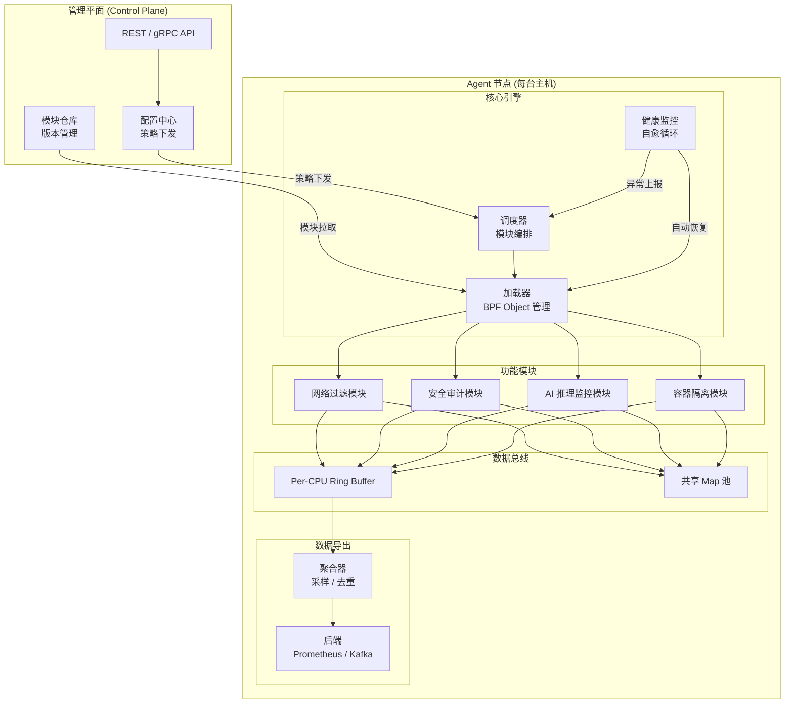
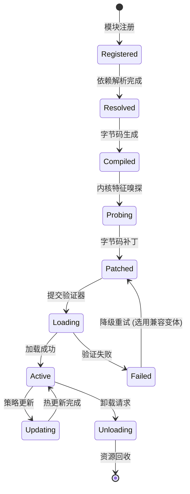
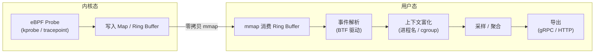
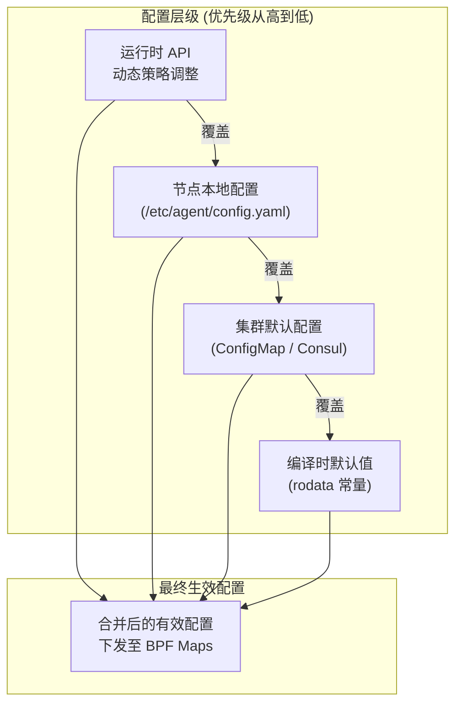
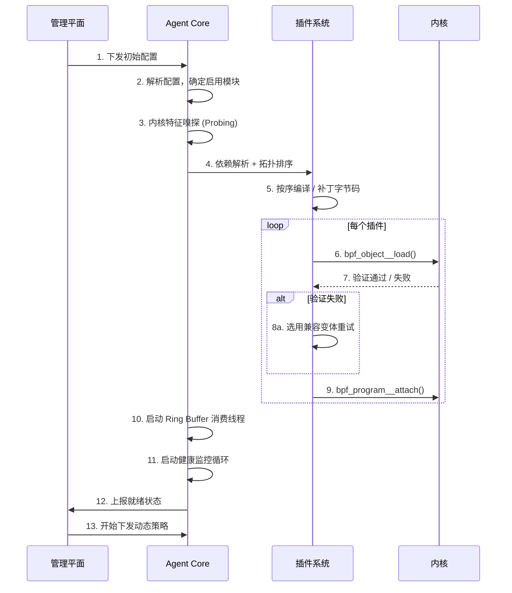

> [!info] eBPF 2026 深度探索系列
> 0. [[2026-04-08-ebpf-comprehensive-learning-roadmap|全栈学习路径总览]]
> 1. [[2026-04-08-ebpf-deep-dive-ch1-registers-and-instructions|第一章：寄存器与指令集]]
> 2. [[2026-04-08-ebpf-deep-dive-ch1-5-function-calls|第一.五章：四种函数调用与动态内存]]
> 3. [[2026-04-08-ebpf-deep-dive-ch1-6-the-verifier|第一.六章：验证器 (Verifier) 的底层逻辑]]
> 4. [[2026-04-08-ebpf-deep-dive-ch2-maps-and-communication|第二章：Map 机制与跨空间通信]]
> 5. [[2026-04-08-ebpf-deep-dive-ch2-5-kptr-and-ownership|第二.五章：kptr (内核指针) 与内存所有权模型]]
> 6. [[2026-04-08-ebpf-deep-dive-ch3-core-and-btf|第三章：CO-RE 与 BTF 的跨版本魔法]]
> 7. [[2026-04-08-ebpf-deep-dive-ch4-tracing-hooks-and-security|第四章：从 kprobe 到 LSM 的追踪全图景]]
> 8. [[2026-04-08-ebpf-deep-dive-ch7-5-uprobes-dynamic-tracing|第七.五章：uprobe 用户态动态追踪原理]]
> 9. [[2026-04-08-ebpf-deep-dive-ch7-6-bpftime-user-runtime|第七.六章：bpftime 与用户态 eBPF 加速]]
> 10. [[2026-04-08-ebpf-deep-dive-ch18-bpftime-injection-mastery|第七.七章：bpftime 自动化注入与全量监控实战]]
> 11. [[2026-04-08-ebpf-deep-dive-ch7-8-uprobe-selection-guide|第七.八章：uprobe 选型指南：内核态 vs 用户态]]
> 12. [[2026-04-08-ebpf-deep-dive-ch5-xdp-networking-performance|第五章：XDP 极致网络性能与全栈架构]]
> 13. [[2026-04-08-ebpf-deep-dive-ch6-tc-traffic-control|第六章：TC (Traffic Control) 流量调度艺术]]
> 14. [[2026-04-08-ebpf-deep-dive-ch7-security-lsm-enforcement|第七章：LSM BPF 从可观测到安全执法]]
> 15. [[2026-04-08-ebpf-deep-dive-ch8-advanced-tuning-and-profiling|第八章：进阶实战与内核调优]]
> 16. [[2026-04-08-ebpf-deep-dive-ch9-af-xdp-zero-copy|第九章：AF_XDP 零拷贝与用户态协议栈]]
> 17. [[2026-04-08-ebpf-deep-dive-ch10-sched-ext-custom-scheduler|第十章：sched_ext 自定义 CPU 调度器]]
> 18. [[2026-04-08-ebpf-deep-dive-ch11-bpf-iterators|第十一章：BPF Iterators 内核对象迭代器]]
> 19. [[2026-04-08-ebpf-deep-dive-ch12-kfuncs-evolution|第十二章：kfuncs 下一代内核交互标准]]
> 20. [[2026-04-08-ebpf-deep-dive-ch13-usdt-tracing|第十三章：USDT 用户态静态定义追踪]]
> 21. [[2026-04-08-ebpf-deep-dive-ch14-ai-llm-inference-monitoring|第十四章：AI 推理与大模型监控前沿]]
> 22. [[2026-04-08-ebpf-deep-dive-ch15-container-isolation|第十五章：无感增强容器隔离性]]
> 23. [[2026-04-08-ebpf-deep-dive-ch16-ebpf-and-wasm|第十六章：eBPF 与 WebAssembly (WASM) 的共生架构]]
> 24. [[2026-04-08-ebpf-deep-dive-ch17-storage-and-filesystem|第十七章：存储与文件系统加速]]
> 25. [[2026-04-08-ebpf-deep-dive-ch18-lifecycle-and-links|第十八章：生命周期管理与 BPF Links]]
> 26. [[2026-04-08-ebpf-deep-dive-ch19-atomic-updates-and-hot-upgrade|第十九章：程序的原子更新与蓝绿部署]]
> 27. [[2026-04-08-ebpf-deep-dive-ch25-5-stack-trace-correlation|第二五.五章：调用栈与业务请求的深度绑定]]
> 28. [[2026-04-08-ebpf-deep-dive-ch20-edge-iot-acceleration|第二十章：边缘计算与工业协议加速]]
> 29. [[2026-04-08-ebpf-deep-dive-ch21-debugging-and-verifier|第二十一章：调试实战与验证器 (Verifier) 诊断]]
> 30. [[2026-04-08-ebpf-deep-dive-ch22-testing-and-ci-cd|第二十二章：测试与持续集成 (CI/CD) 实战]]
> 31. [[2026-04-08-ebpf-deep-dive-ch23-security-and-permissions|第二十三章：权限细分与 BPF 安全沙箱]]
> 32. [[2026-04-08-ebpf-deep-dive-ch24-meta-monitoring-and-self-healing|第二十四章：eBPF 程序的内核自愈与监控]]
> 33. [[2026-04-08-ebpf-deep-dive-ch25-full-stack-observability|第二十五章：全栈可观测性与端到端追踪]]
> 34. [[2026-04-08-ebpf-deep-dive-ch26-network-security-high-level|第二十六章：网络安全防御的高阶实战]]
> 35. **第二十七章：工业级模块化 Agent 架构演进**
> 36. [[2026-04-08-ebpf-deep-dive-ch28-offensive-and-defensive|第二十八章：攻防博弈与 Rootkit 防御]]
> 37. [[2026-04-08-ebpf-deep-dive-ch29-networking-deep-dive|第二十九章：网络应用深水区——负载均衡、Sockmap 与拥塞控制]]
> 38. [[2026-04-08-ebpf-deep-dive-ch30-hardware-offload|第三十章：硬件卸载与 SmartNIC 实战]]
> 39. [[2026-04-08-ebpf-deep-dive-ch31-signed-objects-and-security|第三十一章：内核原生签名与供应链安全]]
> 40. [[2026-04-08-ebpf-deep-dive-ch32-ebpf-for-windows|第三十二章：跨平台崛起——eBPF for Windows]]
> 41. [[2026-04-08-ebpf-deep-dive-ch32-5-macos-status|第三十二.五章：macOS 的特殊路径]]
> 42. [[2026-04-08-ebpf-deep-dive-ch33-serverless-optimization|第三十三章：Serverless 冷启动消除与动态计费]]
> 43. [[2026-04-08-ebpf-deep-dive-ch34-waf-and-rasp|第三十四章：Web 安全革命——内核态 WAF 与 RASP]]
> 44. [[2026-04-08-ebpf-deep-dive-ch35-npu-tpu-ai-hardware|第三十五章：AI 推理硬件 (NPU/TPU) 与硬件定义内核]]
> 45. [[2026-04-08-ebpf-deep-dive-ch36-dynamic-language-introspection|第三十六章：动态语言感知——业务对象的零代码提取]]
> 46. [[2026-04-08-ebpf-deep-dive-ch37-green-computing|第三十七章：绿色计算与能耗精准归因]]
> 47. [[2026-04-08-ebpf-deep-dive-ch38-ecosystem-and-career|第三十八章：2026 生态全景与工程师职业导航]]
> 48. [[2026-04-09-ebpf-deep-dive-ch39-rust-aya-framework|第三十九章：Rust eBPF 开发实战——Aya 框架与安全编程]]
> 49. [[2026-04-09-ebpf-deep-dive-ch40-network-protocols-deep-dive|第四十章：网络协议深度解析——TCP/UDP/QUIC 的 eBPF 视角]]
> 50. [[2026-04-09-ebpf-deep-dive-ch41-memory-safety-and-vulnerabilities|第四十一章：eBPF 内存安全与漏洞分析]]
> 51. [[2026-04-09-ebpf-deep-dive-ch42-service-mesh-integration|第四十二章：eBPF 与 Service Mesh 深度集成]]
---

## 1. 概述：从实验室玩具到工业级组件

当 eBPF 程序走出个人实验脚本，进入支撑成千上万个节点的企业级系统（如 EDR、Service Mesh）时，单纯的"加载并运行"已无法满足需求。工程化的核心挑战在于：如何在保证内核稳定性的前提下，实现功能的快速解耦、动态加载与平滑更新。

2026 年的工程模式已全面转向 **"微探针 + 统一管理平面"** 的模块化 Agent 架构。

---

## 2. 模块化 Agent 的四大迹象：它长什么样？

如果一个 eBPF 项目只是简单地加载几个脚本，那不叫架构。真正的"工业级模块化 Agent"在 2026 年具有以下明确的技术特征：

### 2.1 迹象一：目录结构的"解耦化"

模块化 Agent 的源码树通常如下，每个功能都是一个独立的微型项目：

```text
/src
  /core          # 框架核心：负责 Map 钉住、Link 管理、权限处理
  /modules
    /net_filter  # 独立编译为 net.o，负责 L4 拦截
    /sec_audit   # 独立编译为 sec.o，负责文件/进程审计
    /ai_profile  # 独立编译为 ai.o，负责 GPU 算子追踪
  /shared        # 跨模块共享的头文件和 Map 定义
```

### 2.2 迹象二：利用"全局变量"实现逻辑热插拔

Agent 并不是通过 `if/else` 在运行时切换功能（那样太慢），而是利用 **BPF 静态常量重定位**。

- **BPF 侧**：定义 `const volatile bool ENABLE_LSM = false;`。
- **管理侧**：在加载前通过 `skel->rodata->ENABLE_LSM = true` 强行改写。
- **内核侧**：验证器感知到这是常量，会直接利用"死代码消除"技术将未开启的功能抹除，实现零开销的模块化。

### 2.3 迹象三：基于"外部 Map"的数据总线

不同模块通过**引用外部 Map** 实现协作。

- **场景**：网络模块发现攻击者 IP，写入共享的 `blacklist_map`。
- **协作**：安全模块无需与网络模块通信，它只需要 `extern` 引用该 Map，即可自动获得拦截能力。

---

## 3. 核心工程技术：动态重定位与特征嗅探

模块化架构的灵魂在于其**对内核环境的兼容性处理**。

### 3.1 运行时特征嗅探 (Probing)

Agent 启动时会执行一系列微型测试：

1. **指令支持测试**：内核是否支持 `bpf_loop`？
2. **函数存在测试**：目标内核是否有 `bpf_get_socket_cookie` 这个 kfunc？
3. **决策**：根据测试结果，Agent 从模块库中挑选最优的字节码变体（Variants）进行加载。

### 3.2 字节码动态拼接

对于复杂的防火墙规则，2026 年的高阶 Agent 不再查询 Map，而是直接在内存中修改 BPF 指令的立即数（Immediate Value），将规则硬编码进指令流，然后提交验证。这种方式比 Map 查找快 **3-5 倍**。

### 3.3 指令补丁与热更新的"无损接力"

字节码动态拼接技术与 [第十九章：热更新]([[2026-04-08-ebpf-deep-dive-ch19-atomic-updates-and-hot-upgrade]]) 具有强耦合关系。在 2026 年的高阶实践中，两者共同构成了逻辑演进的闭环：

1. **指令改写**：Agent 在用户态克隆字节码模板，将原本用于查找 Map 的逻辑直接替换为带常数的操作码（如将 `LD_MAP_FD` 替换为 `MOV R2, <Target_Value>`）。
2. **影子加载**：在后台将新程序提交至内核验证并加载，此时旧逻辑仍在生产路径上运行。
3. **原子切换**：利用 `bpf_link_update` 在微秒内完成 Hook 点的指针跳转。

#### 技术对标：Map 查找 vs 指令硬编码

| 维度 | Map 模式 (动态数据) | 指令补丁模式 (静态逻辑) |
| :--- | :--- | :--- |
| **性能开销** | 存在哈希计算与内存访问 | **零额外开销 (CPU 立即数比对)** |
| **生效延迟** | **极低 (只需写 Map)** | 中 (需重载程序并通过验证) |
| **适用频率** | 规则秒级变动场景 | 配置分钟级变动场景 |
| **运维友好度** | 高 | 复杂 (需管理多版本 Link) |

---

## 4. Agent 架构全景图

一个完整的工业级 eBPF Agent 通常由以下层次组成。下图展示了 2026 年主流 Agent 的参考架构：



### 架构关键设计决策

| 决策点 | 方案 | 权衡理由 |
| :--- | :--- | :--- |
| 进程模型 | 单进程多线程 | Map fd 共享零成本；避免 IPC 序列化开销 |
| 模块通信 | 共享 BPF Map + Ring Buffer | 内核态零拷贝；用户态通过 mmap 读取 |
| 配置下发 | gRPC 双向流 | 支持 Agent 主动上报状态，低延迟推送 |
| 模块隔离 | 独立 BPF Object | 故障域隔离，单个模块崩溃不影响其他模块 |
| 数据导出 | 异步批量聚合 | 避免高频事件阻塞 BPF 侧处理路径 |

---

## 5. 插件系统设计

### 5.1 插件生命周期

每个 eBPF 模块作为一个独立插件，经历完整的生命周期：



### 5.2 插件注册与依赖管理

在模块化架构中，插件之间可能存在依赖关系。例如，AI 监控模块依赖容器隔离模块提供的 cgroup ID 映射。下面的代码展示了一个基于结构体的插件注册框架：

```c
// plugins/plugin_registry.h

#define MAX_DEPS 8
#define MAX_PLUGINS 64

struct plugin_dependency {
    const char *name;           // 依赖的插件名
    const char *min_version;    // 最低版本要求
};

struct plugin_descriptor {
    const char *name;
    const char *version;
    const char *description;
    const char *bpf_obj_path;   // BPF 字节码路径
    int (*init)(void *ctx);     // 初始化回调
    void (*destroy)(void *ctx); // 销毁回调
    int (*on_config)(void *ctx, const char *json); // 配置变更回调
    struct plugin_dependency deps[MAX_DEPS];
    int dep_count;
    bool loaded;
};

// 插件注册宏
#define REGISTER_PLUGIN(desc)                                     \
    __attribute__((constructor))                                  \
    static void __register_##desc(void) {                         \
        plugin_registry_add(&desc);                               \
    }
```

### 5.3 依赖解析与拓扑排序

Agent 启动时需要对所有注册的插件进行拓扑排序，确保依赖先于被依赖者加载：

```c
// core/loader.c

int resolve_and_load_plugins(struct plugin_descriptor *plugins, int count) {
    int order[MAX_PLUGINS];
    int sorted = 0;

    // Kahn 算法进行拓扑排序
    while (sorted < count) {
        bool progress = false;
        for (int i = 0; i < count; i++) {
            if (plugins[i].loaded) continue;

            bool deps_met = true;
            for (int d = 0; d < plugins[i].dep_count; d++) {
                if (!plugin_is_loaded(plugins[i].deps[d].name)) {
                    deps_met = false;
                    break;
                }
            }

            if (deps_met) {
                load_plugin(&plugins[i]);
                order[sorted++] = i;
                progress = true;
            }
        }
        if (!progress) {
            fprintf(stderr, "Circular dependency detected!\n");
            return -EINVAL;
        }
    }
    return 0;
}
```

---

## 6. 数据管道架构

### 6.1 从内核到用户态的数据流

eBPF Agent 的数据管道是连接内核态探针与用户态业务逻辑的桥梁。2026 年的主流方案采用 **Ring Buffer 为主、Per-CPU Array 为辅** 的混合管道：



### 6.2 高性能事件消费实现

Ring Buffer 的消费需要处理数据竞争与 CPU 亲和性问题。以下是基于 libbpf 的推荐模式：

```c
// core/ringbuf_consumer.c

struct event_ctx {
    struct ring_buffer *rb;
    struct bpf_map *events_map;
    pthread_t consumer_threads[MAX_CPUS];
    atomic_long_t dropped_events;
};

// 每个事件的处理回调
int handle_event(void *ctx, void *data, size_t len) {
    struct event_header *hdr = data;

    // BTF 驱动的动态解析
    if (hdr->type == EVENT_TYPE_NETWORK) {
        struct net_event *ev = (struct net_event *)(hdr + 1);
        // 上下文富化：添加进程信息
        enrich_with_pid_context(ev);
        enqueue_for_export(ev);
    }

    return 0;
}

// 消费者线程入口
void *consumer_thread(void *arg) {
    struct event_ctx *ctx = arg;
    int err = ring_buffer__poll(ctx->rb, 100 /* timeout_ms */);
    if (err < 0 && err != -EINTR) {
        atomic_long_add(&ctx->dropped_events, 1);
    }
    return NULL;
}

// 启动多线程消费
int start_consumers(struct event_ctx *ctx) {
    for (int i = 0; i < get_num_possible_cpus(); i++) {
        cpu_set_t cpuset;
        CPU_ZERO(&cpuset);
        CPU_SET(i, &cpuset);

        pthread_create(&ctx->consumer_threads[i], NULL,
                       consumer_thread, ctx);
        pthread_setaffinity_np(ctx->consumer_threads[i],
                               sizeof(cpuset), &cpuset);
    }
    return 0;
}
```

### 6.3 背压控制与丢包策略

当数据产生速率超过消费速率时，Agent 必须有明确的背压策略：

| 策略 | 实现方式 | 适用场景 |
| :--- | :--- | :--- |
| **丢弃最旧** | Ring Buffer 自动覆盖 | 实时监控，旧数据价值低 |
| **采样丢弃** | BPF 侧 `bpf_random_u32() < threshold` | 高吞吐日志，允许精度损失 |
| **Per-CPU 限速** | 每个 CPU 独立计数器 | 防止单核热点导致全局阻塞 |
| **动态降级** | 自动关闭低优先级探针 | 资源紧张时的自我保护 |

```c
// BPF 侧动态采样示例
SEC("tracepoint/sched/sched_process_exec")
int trace_exec(struct trace_event_raw_sched_process_exec *ctx) {
    // 动态采样率：从配置 Map 读取
    u32 sampling_rate = 0;
    bpf_map_lookup_elem(&config_map, &sampling_rate);

    if (sampling_rate > 0) {
        u32 rand = bpf_get_prandom_u32();
        if (rand % 100 >= sampling_rate) {
            return 0; // 丢弃此事件
        }
    }

    // 正常处理逻辑
    struct event *e = reserve_event();
    if (!e) return 0;
    collect_exec_info(ctx, e);
    submit_event(e);
    return 0;
}
```

---

## 7. 配置管理体系

### 7.1 分层配置架构

工业级 Agent 的配置不是单一文件，而是多层叠加的体系：



### 7.2 配置热更新实现

通过 BPF 的 `.rodata` 段和 `.data` 段，Agent 可以在无需重载程序的情况下更新配置：

```c
// shared/config.bpf.h

// 只读配置：加载时设置，运行时不可变
struct {
    __uint(type, BPF_MAP_TYPE_ARRAY);
    __uint(max_entries, 1);
    __type(key, __u32);
    __type(value, struct ro_config);
} rodata SEC(".maps");

struct ro_config {
    __u32 log_level;
    __u32 sampling_rate;
    bool enable_network_module;
    bool enable_security_module;
};

// 可读写配置：运行时通过 API 动态修改
struct {
    __uint(type, BPF_MAP_TYPE_HASH);
    __uint(max_entries, 1024);
    __type(key, __u32);   // 配置项 ID
    __type(value, __u64); // 配置值
} runtime_config SEC(".maps");
```

用户态配置更新代码：

```c
// core/config_manager.c

int update_runtime_config(int map_fd, uint32_t key, uint64_t value) {
    return bpf_map_update_elem(map_fd, &key, &value, BPF_ANY);
}

// 批量配置更新示例
int apply_policy(struct policy *p) {
    // 1. 更新运行时可变配置
    update_runtime_config(rt_cfg_fd, CFG_THRESHOLD, p->threshold);
    update_runtime_config(rt_cfg_fd, CFG_TIMEOUT, p->timeout_ms);

    // 2. 如果涉及结构性变更（如新增模块），触发重载
    if (p->modules_changed) {
        trigger_module_reload(p);
    }

    // 3. 记录配置变更审计日志
    audit_log("policy applied: threshold=%u timeout=%u",
              p->threshold, p->timeout_ms);
    return 0;
}
```

---

## 8. 多租户隔离

### 8.1 隔离维度与实现策略

当一台主机上运行多个租户的容器时，eBPF Agent 必须确保租户之间的数据与逻辑隔离：

| 隔离维度 | 实现方案 | 内核版本要求 |
| :--- | :--- | :--- |
| **数据隔离** | BPF Map 按 cgroup ID / netns ID 分区 | 5.8+ |
| **执行隔离** | 每个 cgroup 独立的 BPF 程序实例 | 5.15+ |
| **资源隔离** | Per-cgroup Map 大小配额 + 内存限制 | 6.0+ |
| **可见性隔离** | cgroup-aware 过滤，仅暴露本租户事件 | 5.8+ |

### 8.2 基于 cgroup 的租户分区

```c
// shared/tenant.bpf.h

// 租户元数据 Map
struct {
    __uint(type, BPF_MAP_TYPE_HASH);
    __uint(max_entries, 4096);
    __type(key, __u64);           // cgroup_id
    __type(value, struct tenant); // 租户信息
} tenant_map SEC(".maps");

struct tenant {
    __u32 tenant_id;
    __u32 quota_events_per_sec;
    __u32 priority;
    bool is_privileged;
};

SEC("tracepoint/syscalls/sys_enter_connect")
int trace_connect(struct trace_event_raw_sys_enter *ctx) {
    __u64 cgid = bpf_get_current_cgroup_id();

    struct tenant *t = bpf_map_lookup_elem(&tenant_map, &cgid);
    if (!t) {
        // 未知租户：默认放行但记录
        return 0;
    }

    // 配额检查
    __u64 now = bpf_ktime_get_ns();
    if (should_rate_limit(t->tenant_id, now, t->quota_events_per_sec)) {
        // 超出配额：丢弃事件
        return 0;
    }

    struct conn_event *e = reserve_event();
    if (!e) return 0;
    e->tenant_id = t->tenant_id;
    e->timestamp = now;
    e->pid = bpf_get_current_pid_tgid() >> 32;
    submit_event(e);
    return 0;
}
```

### 8.3 资源配额执行

```c
// core/tenant_manager.c

// 为新租户分配资源
int register_tenant(uint64_t cgroup_id, struct tenant_config *cfg) {
    struct tenant t = {
        .tenant_id = cfg->id,
        .quota_events_per_sec = cfg->quota,
        .priority = cfg->priority,
        .is_privileged = cfg->privileged,
    };

    // 分配专属 Map 空间
    int data_map_fd = create_tenant_data_map(cgroup_id, cfg->map_size);
    if (data_map_fd < 0) {
        return data_map_fd;
    }

    // 注册租户元数据
    int err = bpf_map_update_elem(tenant_map_fd, &cgroup_id, &t, BPF_NOEXIST);
    if (err) {
        close(data_map_fd);
        return err;
    }

    // 设置 Map 大小配额
    set_map_quota(data_map_fd, cfg->map_size);
    return 0;
}
```

---

## 9. 完整 Agent 启动流程

以下是一个生产级 Agent 的完整启动序列，展示了所有组件如何协同工作：



---

## 10. 实战：设计一个插件化的加载器框架

下面的伪代码展示了如何利用 **libbpf-bootstrap** 的思想，构建一个动态插件系统：

```c
// 统一的模块注册结构
struct bpf_module {
    const char *name;
    const char *obj_path;
    struct bpf_object *obj;
    struct bpf_link *active_link;
};

// 动态加载逻辑
int load_feature(struct bpf_module *mod) {
    // 1. 打开并初始化 BPF 对象
    mod->obj = bpf_object__open_file(mod->obj_path, NULL);

    // 2. 根据内核特性动态调整变量
    if (kernel_supports_kfunc()) {
        set_module_config(mod->obj, "use_kfunc", 1);
    }

    // 3. 加载到内核并挂载
    bpf_object__load(mod->obj);
    mod->active_link = bpf_program__attach(
        bpf_object__find_program_by_name(mod->obj, "main"));

    return 0;
}
```

---

## 11. 生产级健康检查与自愈

### 11.1 健康指标采集

Agent 需要持续监控自身与内核模块的运行状态：

```c
// core/health_checker.c

struct health_report {
    // 资源使用
    uint64_t map_memory_bytes;
    uint64_t ringbuf_dropped;
    uint32_t active_programs;

    // 运行时异常
    uint32_t verifier_errors;
    uint32_t load_failures;
    uint32_t runtime_exceptions;

    // 性能指标
    uint64_t events_per_second;
    double   avg_event_latency_us;
};

int collect_health(struct agent_state *state, struct health_report *r) {
    // 1. 遍历所有已加载 BPF Object
    bpf_object__for_each_map(map, state->root_obj) {
        int fd = bpf_map__fd(map);
        struct bpf_map_info info = {};
        uint32_t info_len = sizeof(info);
        bpf_obj_get_info_by_fd(fd, &info, &info_len);

        r->map_memory_bytes += info.value_size * info.max_entries;
        r->active_programs++;
    }

    // 2. 检查 Ring Buffer 丢包率
    r->ringbuf_dropped = ring_buffer__epoll_fd(state->ringbuf);

    // 3. 评估整体健康度
    double drop_rate = (double)r->ringbuf_dropped /
                       (r->events_per_second + 1);
    if (drop_rate > 0.01) {
        trigger_escalation("ringbuf_drop_rate_high", drop_rate);
    }

    return 0;
}
```

### 11.2 自动自愈策略

```c
// core/self_heal.c

void self_heal_loop(struct agent_state *state) {
    while (state->running) {
        struct health_report report = {};
        collect_health(state, &report);

        // 策略 1：Ring Buffer 丢包过高 → 增大缓冲区或降低采样率
        if (report.ringbuf_dropped > THRESHOLD_DROP) {
            increase_ringbuf_size(state);
            reduce_sampling_rate(state);
        }

        // 策略 2：单个程序异常 → 隔离并重载
        if (report.load_failures > 0) {
            quarantine_and_reload_failed(state);
        }

        // 策略 3：内存超限 → 淘汰低优先级模块
        if (report.map_memory_bytes > state->memory_limit) {
            evict_low_priority_modules(state);
        }

        sleep(HEALTH_CHECK_INTERVAL_SEC);
    }
}
```

---

## 12. FAQ

### Q1：模块化 Agent 是否会增加整体性能开销？

**A：** 视架构设计而定。如果模块间通过 BPF Map 共享数据（零拷贝），额外开销主要来自 Map 查找的哈希计算（通常 < 100ns）。如果模块间需要用户态中转，则会引入上下文切换与序列化开销。2026 年的最佳实践是：**内核态协作走 Map，用户态聚合走 Ring Buffer**，将跨模块通信的开销控制在可忽略范围。

### Q2：如何处理不同内核版本之间的 BTF 兼容性？

**A：** Agent 应采用 CO-RE（Compile Once, Run Everywhere）技术栈，所有 BPF 程序基于 vmlinux BTF 编译。对于目标内核缺失特定字段的情况，使用 `__builtin_preserve_type_info` 与 `bpf_core_field_exists()` 进行编译时重定位。运行时通过特征嗅探（Probing）确认内核能力后，选择最优的字节码变体加载。详见 [第三章：CO-RE 与 BTF]([[2026-04-08-ebpf-deep-dive-ch3-core-and-btf]])。

### Q3：多租户场景下，如何防止一个租户的 BPF 程序影响其他租户？

**A：** 核心隔离手段有三层：(1) **cgroup 级程序挂载**，每个 cgroup 有独立的 BPF 程序实例，互不干扰；(2) **Map 资源配额**，通过 `bpf_map_get_info_by_fd` 监控每个租户的 Map 内存占用，超出配额时拒绝写入；(3) **事件速率限制**，在 BPF 侧通过 Per-CPU 计数器实现每租户的 QPS 上限。内核 6.2+ 还支持 BPF 内存 cgroup 统计，可以实现更精细的 OOM 保护。

### Q4：Agent 升级时如何保证业务不中断？

**A：** 采用 [第十九章]([[2026-04-08-ebpf-deep-dive-ch19-atomic-updates-and-hot-upgrade]]) 描述的蓝绿部署策略：(1) 新版本 Agent 以"影子模式"启动，加载所有 BPF 程序但不挂载 Hook 点；(2) 通过 `bpf_link_update` 原子切换所有 Hook 点到新程序；(3) 观察健康指标，确认无异常后卸载旧版本程序；(4) 如果异常，立即回滚到旧版本 Link。整个过程在毫秒级完成，对业务完全透明。

### Q5：eBPF Agent 在 Kubernetes 环境中如何部署？

**A：** 2026 年的主流方案是 **DaemonSet + Init Container** 模式：(1) Init Container 负责内核特征嗅探和 BTF 文件准备；(2) 主 Container 运行 Agent Core，通过 Kubernetes API Watch Pod 事件以自动维护 cgroup-to-tenant 映射；(3) 配置通过 CRD（Custom Resource Definition）下发，Agent 通过 Informer 机制实时监听配置变更。对于特权需求，建议使用 `bpf capabilities`（CAP_BPF, CAP_PERFMON）替代完整的 `privileged: true`。

### Q6：插件系统的安全模型如何设计？如何防止恶意模块？

**A：** 多层防护体系：(1) **签名验证**，所有 BPF 字节码必须经过 ECDSA 签名，Agent 在加载前验证签名（参见 [第三十一章：内核原生签名]([[2026-04-08-ebpf-deep-dive-ch31-signed-objects-and-security]])）；(2) **Capability 细分**，不同模块声明所需的最小权限集（网络模块仅申请 CAP_NET_ADMIN，审计模块仅申请 CAP_SYS_PTRACE）；(3) **验证器沙箱**，BPF 验证器本身就是最强的安全防线，确保程序无法越界访问内存或调用未授权的 kfunc；(4) **运行时审计**，Agent 记录所有 BPF 系统调用，定期审计是否有模块尝试执行超出其权限范围的操作。

---

## 13. 总结：未来的 Agent 形态

2026 年的工业级 eBPF Agent 已经不再是一个简单的二进制文件，而是一个**"动态逻辑织入器"**。它能够根据内核环境、硬件特性和业务策略，在毫秒级内拼接、优化并热加载最适合当前的内核代码。

回顾本章的核心技术栈：

| 技术领域 | 核心方案 | 关键优势 |
| :--- | :--- | :--- |
| **模块化** | 独立 BPF Object + 依赖拓扑排序 | 故障域隔离，独立演进 |
| **数据管道** | Ring Buffer + BTF 驱动解析 | 零拷贝，类型安全 |
| **配置管理** | 分层配置 + 运行时 Map 更新 | 灵活下发，零停机生效 |
| **多租户** | cgroup 分区 + 资源配额 | 安全隔离，公平调度 |
| **热更新** | 蓝绿部署 + `bpf_link_update` | 毫秒级切换，业务无感 |
| **自愈** | 健康监控 + 自动降级 | 无人值守，高可用 |

这种极致的灵活性，正是 eBPF 统治现代基础软件的工程学基石。随着 [WASM 共生架构]([[2026-04-08-ebpf-deep-dive-ch16-ebpf-and-wasm]]) 的成熟，未来的 Agent 将进一步支持在用户态通过安全沙箱运行自定义处理逻辑，真正实现"内核态探针 + 用户态插件"的全栈可编程。
