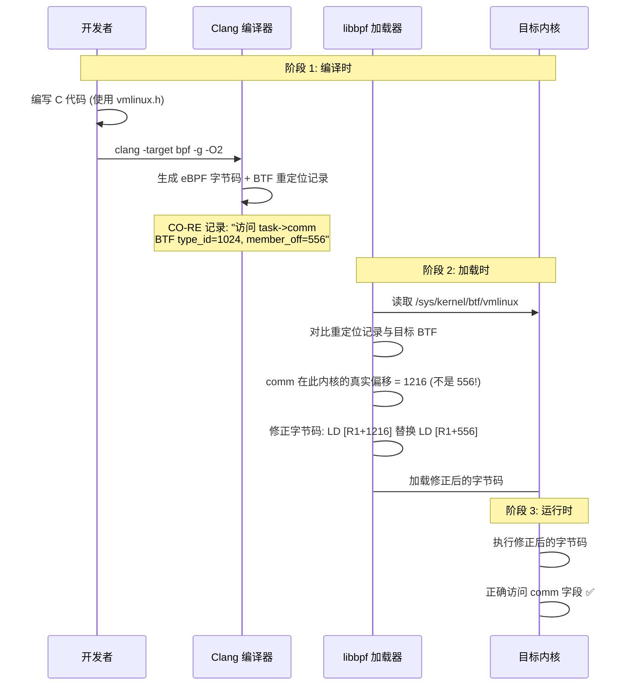

> [!info] eBPF 2026 深度探索系列
> 0. [[2026-04-08-ebpf-comprehensive-learning-roadmap|全栈学习路径总览]]
> 1. [[2026-04-08-ebpf-deep-dive-ch1-registers-and-instructions|第一章：寄存器与指令集]]
> 2. [[2026-04-08-ebpf-deep-dive-ch1-5-function-calls|第一.五章：四种函数调用与动态内存]]
> 3. [[2026-04-08-ebpf-deep-dive-ch1-6-the-verifier|第一.六章：验证器 (Verifier) 的底层逻辑]]
> 4. [[2026-04-08-ebpf-deep-dive-ch2-maps-and-communication|第二章：Map 机制与跨空间通信]]
> 5. [[2026-04-08-ebpf-deep-dive-ch2-5-kptr-and-ownership|第二.五章：kptr (内核指针) 与内存所有权模型]]
> 6. **第三章：CO-RE 与 BTF 的跨版本魔法**
> 7. [[2026-04-08-ebpf-deep-dive-ch4-tracing-hooks-and-security|第四章：从 kprobe 到 LSM 的追踪全图景]]
> 8. [[2026-04-08-ebpf-deep-dive-ch7-5-uprobes-dynamic-tracing|第七.五章：uprobe 用户态动态追踪原理]]
> 9. [[2026-04-08-ebpf-deep-dive-ch7-6-bpftime-user-runtime|第七.六章：bpftime 与用户态 eBPF 加速]]
> 10. [[2026-04-08-ebpf-deep-dive-ch18-bpftime-injection-mastery|第七.七章：bpftime 自动化注入与全量监控实战]]
> 11. [[2026-04-08-ebpf-deep-dive-ch7-8-uprobe-selection-guide|第七.八章：uprobe 选型指南：内核态 vs 用户态]]
> 12. [[2026-04-08-ebpf-deep-dive-ch5-xdp-networking-performance|第五章：XDP 极致网络性能与全栈架构]]
> 13. [[2026-04-08-ebpf-deep-dive-ch6-tc-traffic-control|第六章：TC (Traffic Control) 流量调度艺术]]
> 14. [[2026-04-08-ebpf-deep-dive-ch7-security-lsm-enforcement|第七章：LSM BPF 从可观测到安全执法]]
> 15. [[2026-04-08-ebpf-deep-dive-ch8-advanced-tuning-and-profiling|第八章：进阶实战与内核调优]]
> 16. [[2026-04-08-ebpf-deep-dive-ch9-af-xdp-zero-copy|第九章：AF_XDP 零拷贝与用户态协议栈]]
> 17. [[2026-04-08-ebpf-deep-dive-ch10-sched-ext-custom-scheduler|第十章：sched_ext 自定义 CPU 调度器]]
> 18. [[2026-04-08-ebpf-deep-dive-ch11-bpf-iterators|第十一章：BPF Iterators 内核对象迭代器]]
> 19. [[2026-04-08-ebpf-deep-dive-ch12-kfuncs-evolution|第十二章：kfuncs 下一代内核交互标准]]
> 20. [[2026-04-08-ebpf-deep-dive-ch13-usdt-tracing|第十三章：USDT 用户态静态定义追踪]]
> 21. [[2026-04-08-ebpf-deep-dive-ch14-ai-llm-inference-monitoring|第十四章：AI 推理与大模型监控前沿]]
> 22. [[2026-04-08-ebpf-deep-dive-ch15-container-isolation|第十五章：无感增强容器隔离性]]
> 23. [[2026-04-08-ebpf-deep-dive-ch16-ebpf-and-wasm|第十六章：eBPF 与 WebAssembly (WASM) 的共生架构]]
> 24. [[2026-04-08-ebpf-deep-dive-ch17-storage-and-filesystem|第十七章：存储与文件系统加速]]
> 25. [[2026-04-08-ebpf-deep-dive-ch18-lifecycle-and-links|第十八章：生命周期管理与 BPF Links]]
> 26. [[2026-04-08-ebpf-deep-dive-ch19-atomic-updates-and-hot-upgrade|第十九章：程序的原子更新与蓝绿部署]]
> 27. [[2026-04-08-ebpf-deep-dive-ch25-5-stack-trace-correlation|第二五.五章：调用栈与业务请求的深度绑定]]
> 28. [[2026-04-08-ebpf-deep-dive-ch20-edge-iot-acceleration|第二十章：边缘计算与工业协议加速]]
> 29. [[2026-04-08-ebpf-deep-dive-ch21-debugging-and-verifier|第二十一章：调试实战与验证器 (Verifier) 诊断]]
> 30. [[2026-04-08-ebpf-deep-dive-ch22-testing-and-ci-cd|第二十二章：测试与持续集成 (CI/CD) 实战]]
> 31. [[2026-04-08-ebpf-deep-dive-ch23-security-and-permissions|第二十三章：权限细分与 BPF 安全沙箱]]
> 32. [[2026-04-08-ebpf-deep-dive-ch24-meta-monitoring-and-self-healing|第二十四章：eBPF 程序的内核自愈与监控]]
> 33. [[2026-04-08-ebpf-deep-dive-ch25-full-stack-observability|第二十五章：全栈可观测性与端到端追踪]]
> 34. [[2026-04-08-ebpf-deep-dive-ch26-network-security-high-level|第二十六章：网络安全防御的高阶实战]]
> 35. [[2026-04-08-ebpf-deep-dive-ch27-agent-engineering-architecture|第二十七章：工业级模块化 Agent 架构演进]]
> 36. [[2026-04-08-ebpf-deep-dive-ch28-offensive-and-defensive|第二十八章：攻防博弈与 Rootkit 防御]]
> 37. [[2026-04-08-ebpf-deep-dive-ch29-networking-deep-dive|第二十九章：网络应用深水区——负载均衡、Sockmap 与拥塞控制]]
> 38. [[2026-04-08-ebpf-deep-dive-ch30-hardware-offload|第三十章：硬件卸载与 SmartNIC 实战]]
> 39. [[2026-04-08-ebpf-deep-dive-ch31-signed-objects-and-security|第三十一章：内核原生签名与供应链安全]]
> 40. [[2026-04-08-ebpf-deep-dive-ch32-ebpf-for-windows|第三十二章：跨平台崛起——eBPF for Windows]]
> 41. [[2026-04-08-ebpf-deep-dive-ch32-5-macos-status|第三十二.五章：macOS 的特殊路径]]
> 42. [[2026-04-08-ebpf-deep-dive-ch33-serverless-optimization|第三十三章：Serverless 冷启动消除与动态计费]]
> 43. [[2026-04-08-ebpf-deep-dive-ch34-waf-and-rasp|第三十四章：Web 安全革命——内核态 WAF 与 RASP]]
> 44. [[2026-04-08-ebpf-deep-dive-ch35-npu-tpu-ai-hardware|第三十五章：AI 推理硬件 (NPU/TPU) 与硬件定义内核]]
> 45. [[2026-04-08-ebpf-deep-dive-ch36-dynamic-language-introspection|第三十六章：动态语言感知——业务对象的零代码提取]]
> 46. [[2026-04-08-ebpf-deep-dive-ch37-green-computing|第三十七章：绿色计算与能耗精准归因]]
> 47. [[2026-04-08-ebpf-deep-dive-ch38-ecosystem-and-career|第三十八章：2026 生态全景与工程师职业导航]]
> 48. [[2026-04-09-ebpf-deep-dive-ch39-rust-aya-framework|第三十九章：Rust eBPF 开发实战——Aya 框架与安全编程]]
> 49. [[2026-04-09-ebpf-deep-dive-ch40-network-protocols-deep-dive|第四十章：网络协议深度解析——TCP/UDP/QUIC 的 eBPF 视角]]
> 50. [[2026-04-09-ebpf-deep-dive-ch41-memory-safety-and-vulnerabilities|第四十一章：eBPF 内存安全与漏洞分析]]
> 51. [[2026-04-09-ebpf-deep-dive-ch42-service-mesh-integration|第四十二章：eBPF 与 Service Mesh 深度集成]]

---

## 1. 概述：跨版本兼容的核心难题

eBPF 程序运行在内核态，直接访问内核数据结构。但内核结构体在不同版本间频繁变更——字段被添加、删除、重命名、调整顺序，偏移量也随之改变。

**没有 CO-RE 的世界：**

```
// 开发环境 (Ubuntu 22.04, kernel 5.15)
struct task_struct {
    // comm 在偏移量 556 处
    char comm[16];  // offset 556
};

// 生产环境 (RHEL 9, kernel 5.14)
struct task_struct {
    // comm 在偏移量 552 处（内核补丁调整了布局）
    char comm[16];  // offset 552
};
```

如果 eBPF 程序硬编码了偏移量 `556`，在 5.14 内核上就会读到错误数据。更糟糕的是，在某些内核版本中，`comm` 字段的位置完全不同，或者字段名被重命名了。

**CO-RE (Compile Once – Run Everywhere)** 解决了这个问题：编译一次，在所有支持 BTF 的内核上运行。

---

## 2. BTF (BPF Type Format) 深度解析

### 2.1 什么是 BTF？

BTF 是一种紧凑的二进制格式，完整描述了 C 类型的布局信息：

```text
BTF 二进制格式 (简化):

[Header]
  magic = 0xEB9F
  version = 1
  hdr_len = 24
  type_off = 24
  str_off = 1024
  type_len = 1000
  str_len = 500

[Type Section] (紧凑的二进制编码)
  INT(4)         → int 类型, 4 字节
  INT(8)         → long 类型, 8 字节
  PTR(1024)      → pointer, 指向 type id 1024
  STRUCT(2048) {
    "task_struct"
    field 0: "comm" → type: INT(16), offset: 556
    field 1: "pid"  → type: INT(4), offset: 944
    field 2: "tgid" → type: INT(4), offset: 948
    ...
  }

[String Section]
  "task_struct\0comm\0pid\0tgid\0..."
```

### 2.2 BTF vs DWARF

| 特性 | BTF | DWARF |
| :--- | :--- | :--- |
| **体积** | 2-10 MB | 200-500 MB |
| **加载方式** | 单次 mmap | 逐段解析 |
| **覆盖范围** | 仅类型布局 | 类型 + 调试信息 + 行号 |
| **内核内置** | ✅ `/sys/kernel/btf/vmlinux` | ❌ 需要单独安装 |
| **解析速度** | 极快（毫秒级） | 慢（秒级） |

BTF 之所以能做到如此紧凑，是因为它**只记录类型布局信息**（结构体成员、偏移量、大小），丢弃了 DWARF 中庞大的调试信息（行号、局部变量、优化信息）。

### 2.3 查看当前内核的 BTF

```bash
# 查看 BTF 信息大小
ls -lh /sys/kernel/btf/vmlinux
# -rw-r--r-- 1 root root 4.2M /sys/kernel/btf/vmlinux

# 列出所有结构体类型
bpftool btf dump file /sys/kernel/btf/vmlinux | grep STRUCT

# 生成 vmlinux.h (CO-RE 头文件)
bpftool btf dump file /sys/kernel/btf/vmlinux format c > vmlinux.h
wc -l vmlinux.h
# 通常 50,000 - 100,000 行

# 查看 task_struct 的字段布局
bpftool btf dump file /sys/kernel/btf/vmlinux | grep -A 50 "STRUCT task_struct"
```

### 2.4 BTF 的内部编码

每个类型在 Type Section 中有一个唯一的递增整数 ID（type_id），从 0 开始。BTF 定义了多种类型 kind：INT、PTR、ARRAY、STRUCT、UNION、ENUM、FWD、TYPEDEF、VOLATILE、CONST、RESTRICT、FUNC、FUNC_PROTO 等。

先看两条最基础的记录（`bpftool btf dump` 输出）：

```text
[1] INT 'long unsigned int' size=8 bits_offset=0 nr_bits=64 encoding=(none)
[2] CONST '(anon)' type_id=1
```

逐字段解读：

| 字段 | [1] INT | [2] CONST | 含义 |
| :--- | :--- | :--- | :--- |
| `[N]` | `[1]` | `[2]` | type_id，递增整数，全局唯一 |
| kind | `INT` | `CONST` | 类型种类：基础整数 / const 修饰符 |
| name | `'long unsigned int'` | `'(anon)'` | 类型名，修饰符类无名字 |
| size | `8` | — | 占 8 字节（仅 INT/STRUCT 等有意义的类型） |
| nr_bits | `64` | — | 64 位（8 × 8） |
| encoding | `(none)` | — | 编码方式：SIGNED / CHAR / BOOL / none |
| type_id | — | `1` | 指向被修饰的基础类型 → [1] long unsigned int |

[2] 合起来就是 `const long unsigned int`。CONST 不重新定义完整的类型信息，只记录一个 `type_id=1` 的引用。内核中几百个 `const unsigned long` 字段都指向同一条记录——这就是 ID 引用的去重效果。

再举几个 kind 的例子：

```text
[3] PTR '(anon)' type_id=1          // pointer → long unsigned int *
[4] STRUCT 'task_struct' size=2912   // 结构体，2912 字节
    'pid' type_id=5 offset=944       //   成员 pid，类型 ID=5，偏移 944
    'comm' type_id=6 offset=2120     //   成员 comm，类型 ID=6，偏移 2120
[5] TYPEDEF 'pid_t' type_id=1        // typedef → long unsigned int
[6] ARRAY '(anon)' type_id=7         // 数组
    index_type_id=1 nr_elems=16      //   long unsigned int[16]
```

type_id 的核心价值不仅是去重，更是 **CO-RE 重定位的基础**。重定位记录中存储 `type_id + field_name`，libbpf 据此在目标内核 BTF 中定位同一个结构体的同一个字段，获取真实偏移量后修正字节码。

---

## 3. CO-RE 的工作原理

### 3.1 三阶段流程



### 3.2 Clang 如何生成 CO-RE 记录

当使用 `-g` 编译时，Clang 会为每个结构体字段访问生成一条 **BTF 重定位记录 (CO-RE relocation)**：

```text
// 源代码
u32 pid = task->pid;

// Clang 生成的重定位记录
.rela.bpf CO-RE {
    .offset = 指令偏移量,
    .type = BTF_KIND_FIELD,
    .field_off = 944,       // 编译时内核中 pid 的偏移
    .type_id = 1024,        // task_struct 的 BTF type ID
    .sz = 4,               // 字段大小
    .access_size = 4,
    .flags = BPF_CORE_FIELD_BYTE_SIZE | BPF_CORE_FIELD Signed
}
```

### 3.3 libbpf 如何执行重定位

```c
// libbpf 内部流程 (简化)
int bpf_object__relocate_data(struct bpf_object *obj, const struct btf *target_btf) {
    for (each relocation record in obj->reloc_sect) {
        // 在目标内核的 BTF 中查找相同的 type_id + field
        struct btf_member *field = find_member(target_btf, reloc.type_id, reloc.field_name);

        if (!field) {
            // 字段不存在！
            if (reloc.kind == BPF_CORE_FIELD_EXISTENCE) {
                // 这是一个 "字段是否存在" 的检查
                patch_insn(reloc.offset, 0);  // 替换为常量 0
                continue;
            }
            return -ENOENT;  // 字段不存在，加载失败
        }

        // 计算目标内核中的真实偏移
        u32 real_offset = field->offset;

        if (reloc.kind == BPF_CORE_FIELD_BYTE_OFFSET) {
            // 修正字节码中的偏移量
            patch_insn_offset(reloc.offset, real_offset);
        }
    }
    return 0;
}
```

---

## 4. BTF_CORE_READ 与 CO-RE 编程 API

### 4.1 核心宏

```c
#include <bpf/bpf_core_read.h>

// 单字段读取
u32 pid = BPF_CORE_READ(task, pid);
u64 tgid = BPF_CORE_READ(task, tgid);

// 链式读取（深入嵌套字段）
// 等价于: task->real_parent->pid
u32 ppid = BPF_CORE_READ(task, real_parent, pid);

// 读取数组字段
// 等价于: task->cpus_ptr[0]
u32 cpu = BPF_CORE_READ(task, cpus_ptr[0]);
```

### 4.2 字段存在性检查

```c
// 检查字段是否存在（编译时生成重定位，加载时决定结果）
if (bpf_core_field_exists("comm")) {
    // 这个分支在 5.15+ 内核上会保留
    bpf_printk("comm: %s\n", task->comm);
}

if (bpf_core_field_exists("cgroup")) {
    // 这个分支在 5.15+ 内核上会保留
    // 在 5.10 及更早内核上会被 JIT 编译为死代码
    bpf_printk("cgroup: %s\n", task->cgroup);
}

// 检查类型是否存在
if (bpf_core_type_exists("struct cgroup")) {
    // 类型存在，可以安全使用
}
```

### 4.3 零运行时开销的原理

`bpf_core_field_exists` 看起来像运行时函数调用，但实际上是**编译时标记 + 加载时 Patch + JIT 死代码消除**的三步优化：

```text
编译时:
    if (bpf_core_field_exists("new_field")) {  → 记录 CO-RE relocation
        do_something_with_new_field();
    }

加载时 (libbpf):
    if (new_field 在目标 BTF 中存在):
        patch: if (1) {           → 常量 true
            do_something_with_new_field();
        }
    else:
        patch: if (0) {           → 常量 false
            do_something_with_new_field();  → 变成死代码
        }

JIT 编译:
    if (1) { do_something_with_new_field(); }  → 保留
    if (0) { ... }                              → 完全消除，0 条指令
```

**最终结果：生成的机器码中完全没有"判断逻辑"，只有针对当前内核优化后的"纯净"执行路径。运行时零额外开销。**

### 4.4 枚举值兼容

```c
// 不同内核版本中，枚举值可能不同
// 例如 TCP 状态在某个版本中重新编号了
// bpf_core_enum_value_exists() 可以检查

if (bpf_core_enum_value_exists("tcp_state", TCP_ESTABLISHED)) {
    // TCP_ESTABLISHED 在当前内核中存在该值
}

// 直接读取枚举值（自动重定位）
enum tcp_state state = BPF_CORE_READ(skb, tcp_state);
```

---

## 5. vmlinux.h 的生成与使用

### 5.1 生成 vmlinux.h

```bash
# 从当前运行内核生成
bpftool btf dump file /sys/kernel/btf/vmlinux format c > vmlinux.h

# 指定目标内核 BTF 文件（交叉编译场景）
bpftool btf dump file /path/to/target.btf format c > vmlinux.h
```

### 5.2 vmlinux.h 的特点

```c
// vmlinux.h 中的类型定义（自动生成，不建议手动编辑）
// 没有 #include 头文件依赖
// 没有 __attribute__、__extension__ 等编译器扩展
// 纯 C 类型和常量定义

struct task_struct {
    const volatile unsigned long state;
    int prio;
    int static_prio;
    struct pid *pids;
    // ... 几百个字段 ...
    char comm[16];
    // ... 更多字段 ...
} __attribute__((preserve_access_index, preserve_access_index));
```

> [!warning] 不要修改 vmlinux.h
> vmlinux.h 是自动生成的，每次内核升级后应重新生成。手动修改会在下次重新生成时丢失。如果需要自定义类型，请在单独的头文件中定义，然后在 vmlinux.h 之后 include。

### 5.3 在 Makefile 中集成

```makefile
# 生成 vmlinux.h（首次构建时）
VMLINUX_H := vmlinux.h
$(VMLINUX_H):
	bpftool btf dump file /sys/kernel/btf/vmlinux format c > $(VMLINUX_H)

# 编译 eBPF 程序
CLANG_BPF_FLAGS := -g -O2 -target bpf -D__TARGET_ARCH_x86
CLANG_BPF_FLAGS += -I$(VMLINUX_H:.)
CLANG_BPF_FLAGS += -I$(LIBBPF_INCLUDE)

%.o: %.c $(VMLINUX_H)
	$(CLANG) $(CLANG_BPF_FLAGS) -c $< -o $@
```

---

## 6. CO-RE 的限制与边界

### 6.1 不支持的场景

| 场景 | 原因 | 替代方案 |
| :--- | :--- | :--- |
| **指针类型变更** | BTF 只记录布局，不记录指针语义 | `bpf_core_type_id_matches` 检查 |
| **函数签名变更** | Helper 参数数量/类型改变 | `bpf_helper_func_id_matches` 检查 |
| **新增字段在中间** | 结构体布局变化太复杂 | 逐字段检查 + 降级逻辑 |
| **Union 类型内部变更** | Union 成员偏移重排 | `bpf_core_field_exists` + 分支 |
| **BTF 不可用** | 老内核 (< 5.4) 不生成 BTF | 回退到手动偏移 + 条件编译 |

### 6.2 CO-RE 兼容性策略

```c
// 策略 1：字段存在性检查
if (bpf_core_field_exists("new_feature_field")) {
    // 新内核：使用新特性
    use_new_feature();
} else {
    // 旧内核：降级处理
    use_fallback();
}

// 策略 2：读取带默认值
u32 value = 0;
if (bpf_core_field_exists("some_field")) {
    value = BPF_CORE_READ(obj, some_field);
}
// value 在新内核上有正确值，旧内核上保持默认值 0

// 策略 3：Helper 存在性检查
if (bpf_helper_func_id_exists("bpf_new_helper")) {
    bpf_new_helper();
}
```

### 6.3 多版本支持矩阵

| 内核版本 | BTF | CO-RE | kptr | Ring Buffer | 有界循环 |
| :--- | :--- | :--- | :--- | :--- | :--- |
| 5.4 | ✅ | ✅ | ❌ | ❌ | ❌ |
| 5.8 | ✅ | ✅ | ❌ | ✅ | ❌ |
| 5.10 | ✅ | ✅ | ❌ | ✅ | ❌ |
| 5.13 | ✅ | ✅ | ❌ | ✅ | ❌ |
| 6.1 | ✅ | ✅ | ✅ | ✅ | ✅ |
| 6.3 | ✅ | ✅ | ✅ | ✅ | ✅ |
| 6.8 | ✅ | ✅ | ✅ | ✅ | ✅ |

```c
// 在代码中根据内核版本做条件编译
#if LIBBPF_VERSION >= LIBBPF_VERSION(0, 8, 0)
    // 6.1+ 特性
    struct node *n = bpf_obj_new(typeof(*n));
#endif
```

### 6.4 字段名被 rename：手动结构体兼容

#### 6.4.1 问题场景

CO-RE 按 `type_id + field_name` 定位字段，内核将某个字段 rename 后，BTF 中旧名字消失了，CO-RE 无法完成重定位：

```text
// 场景：内核将 struct net 的某个字段 rename
// 旧版本 (kernel 5.x)
struct net {
    ...
    struct in_device __rcu *ipv4;      // 名字: ipv4
    ...
};

// 新版本 (kernel 6.x)  // 内核开发者把它改成了:
struct net {
    ...
    struct in_device __rcu *dev;       // 名字: dev（语义相同）
    ...
};

// CO-RE 按 "net.ipv4" 找 → BTF 里没有这个名字 → 重定位失败 ❌
```

这类 rename 在内核开发中**并非罕见**：
- `struct task_struct.comm` 历史上叫过 `tcomm`
- `struct sock.sk_sndmsg_*` 在某个版本被重组
- `struct net_device` 的字段在 5.12+ 的网络命名空间重构中被大量 rename

字段被 rename 后，`bpf_core_field_exists()` 也返回 false（按名字查找，找不到就认为不存在），即使偏移量完全没变。

#### 6.4.2 解决方案：手动写旧版本结构体

思路是**为旧内核维护一份手动结构体定义**，用 `__attribute__((preserve_access_index))` 标记，让 eBPF 验证器按偏移量访问：

```c
// ============================================================
// compat_structs.h — 手动维护的旧版本结构体兼容层
// ============================================================

/* task_struct 的兼容版本（kernel 5.10 之前）
 * 当内核将 "pneigh" rename 为 "pneigh_entry" 时使用
 * 只写你关心的字段，偏移量通过pahole或bpftool确认 */
struct task_struct_compat {
    unsigned long state;
    int prio;
    int static_prio;
    int normal_prio;
    /* 线程组 ID（tgid）和进程 ID（pid）历史上在不同偏移 */
    /* 这里手写确保与旧内核一致 */
    __u32 pid;
    __u32 tgid;
    /* comm 字段在 5.10 之前偏移量固定为 2120 */
    char comm[16];
    /* pneigh / pneigh_entry 字段（视内核版本而定） */
    void    *pneigh_entry;   /* 旧内核: 5.10 之前叫 pneigh */
} __attribute__((preserve_access_index));

/* struct net 的兼容版本（kernel 5.x vs 6.x 字段名差异） */
struct net_compat {
    /* 通用头部长度 */
    unsigned long data_len;
    unsigned int flags;
    /* ipv4 vs dev：手动兼容 */
    void *inet_dev;          /* 5.x: ipv4  6.x: dev */
    /* 命名空间指针 */
    void *netns;
} __attribute__((preserve_access_index));

/* struct sock 的兼容版本（处理 sk_sndmsg_* 字段 rename） */
struct sock_compat {
    __u16 sk_family;
    __u16 sk_type;
    __u32 sk_flags;
    /* sk_sndbuf 在某版本被拆成 sk_sndbuf 和 sk_wmem_queued */
    __u32 sk_sndbuf;         /* 通用发送缓冲区大小 */
} __attribute__((preserve_access_index));
```

#### 6.4.3 使用方式

```c
// ============================================================
// trace_pneigh.c — 使用兼容结构体的 eBPF 程序
// ============================================================
#include <vmlinux.h>                    // 新内核：用自动生成的
#include "compat_structs.h"             // 旧内核：用手动维护的
#include <bpf/bpf_helpers.h>

struct {
    __uint(type, BPF_MAP_TYPE_HASH);
    __uint(max_entries, 10240);
    __type(key, __u32);          // PID
    __type(value, __u64);        // timestamp
} events SEC(".maps");

/* 通过pahole获取目标内核的真实偏移量（下面以task_struct为例）
 * $ pahole -C task_struct /boot/vmlinuz-$(uname -r)
 * （或者用 bpftool btf dump 查 BTF，然后对照历史版本） */

/* ============================================================
 * 兼容策略 1：运行时按字段名检测
 * ============================================================ */
SEC("tracepoint/net/netif_receive_skb")
int on_netif_rx(struct trace_event_raw_netif_rx *ctx)
{
    struct net *net = (struct net *)ctx->skb->dev->nd_net.net;

    /* 策略：优先用 CO-RE 访问 ipv4（kernel 6.x），
     * 如果找不到，再用手动结构体访问 inet_dev（旧内核 5.x） */

#if LINUX_VERSION_CODE >= KERNEL_VERSION(6, 0, 0)
    /* 新内核：字段名叫 "dev"，直接用 CO-RE */
    struct in_device *indev = BPF_CORE_READ(net, dev);
#else
    /* 旧内核：字段名叫 "ipv4"，或已被 rename → 用手动结构体 */
    struct net_compat *net_compat = (struct net_compat *)net;
    struct in_device *indev = (struct in_device *)net_compat->inet_dev;
#endif

    if (!indev)
        return 0;

    /* ... 后续处理 ... */
    return 0;
}

/* ============================================================
 * 兼容策略 2：始终使用手动结构体（不需要版本检测）
 * 适用于字段偏移量稳定、但名字在各版本不一致的情况
 * ============================================================ */
SEC("tracepoint/sched/sched_switch")
int on_sched_switch(struct trace_event_raw_sched_switch *ctx)
{
    __u64 id = bpf_get_current_pid_tgid();
    __u32 pid = id >> 32;
    __u64 ts = bpf_涛_获取纳秒();

    /* task_struct 在所有内核版本中偏移量稳定（即使字段名变），
     * 所以可以用同一个手动结构体访问 */
    struct task_struct_compat *task_compat =
        (struct task_struct_compat *)ctx->prev_task;

    /* 通过手动结构体的固定偏移读取（验证器按偏移访问，不按名字） */
    __u32 tgid = BPF_CORE_READ(task_compat, tgid);
    __u32 prev_pid = BPF_CORE_READ(task_compat, pid);

    bpf_map_update_elem(&events, &prev_pid, &ts, BPF_ANY);
    return 0;
}

/* ============================================================
 * 兼容策略 3：结合字段存在性检查 + 手动结构体降级
 * 最完整的写法
 * ============================================================ */
SEC("tracepoint/net/net_dev_xmit")
int on_net_dev_xmit(struct trace_event_raw_net_dev_xmit *ctx)
{
    void *ptr = (void *)ctx->skb;

    __u32 pid = 0;
    if (bpf_core_field_exists(ptr, "skb->sk)) {
        /* 用 CO-RE（字段名一致的内核版本） */
        struct sock *sk = BPF_CORE_READ(ptr, sk);
        pid = BPF_CORE_READ(sk, sk_pid);
    } else {
        /* 字段被 rename → 用手动结构体
         * 注意：这种情况下指针本身偏移也可能变，
         * 手动结构体里的字段定义需要与目标内核严格对应 */
        struct skb_compat *skb_c = (struct skb_compat *)ptr;
        pid = BPF_CORE_READ(skb_c, sk_pid);
    }

    bpf_printk("pid=%d\n", pid);
    return 0;
}
```

#### 6.4.4 手动结构体的维护

手动结构体的核心是**固定偏移量**，所以维护的关键是确认目标内核的真实偏移：

```bash
# 方法 1：pahole 工具直接查看
pahole -C task_struct /boot/vmlinuz-$(uname -r)
# 输出：
# struct task_struct {
#     ...
#     int                      prio;                 /*   120     4 */
#     int                      static_prio;         /*   124     4 */
#     int                      normal_prio;         /*   128     4 */
#     __u32                    pid;                  /*   944     4 */
#     __u32                    tgid;                 /*   948     4 */
#     ...
#     char                     comm[16];             /*  2120    16 */
#     ...
# };

# 方法 2：bpftool + 内核源码交叉验证
bpftool btf dump file /sys/kernel/btf/vmlinux format c | grep -A 200 "struct task_struct "

# 方法 3：从内核源码确认字段名变更历史
git log --oneline --all -- 'net/core/net_namespace.c' | grep -i rename
# 或者查 changelog:
# https://www.kernel.org/doc/html/latest/networking/net_namespace.html
```

手动结构体维护的**最佳实践**：

| 原则 | 说明 |
|------|------|
| **只写关心的字段** | 不需要完整定义，只有关心的字段有偏移即可 |
| **注释版本范围** | 明确标注目录结构体适用于哪个内核版本区间 |
| **版本条件编译** | 用 `#if LINUX_VERSION_CODE` 或 `bpf_core_field_exists` 分支 |
| **提交到版本控制** | compat 结构体随项目走，不要每次现场手写 |
| **优先 BTF 验证** | 加载时用 `bpftool prog load` 带 `--verbose` 确认偏移是否正确 |

#### 6.4.5 何时用这个方法

```
能用 CO-RE 自动处理  ←→  字段存在，名字没变
        ↓
用手动结构体兜底    ←→  字段存在，但名字变了（rename）
        ↓
用 BTFGen 生成 BTF  ←→  字段本身不存在（老内核无此字段）
        ↓
条件编译 + 回退    ←→  Helper 不存在 / 功能完全不可用
```

---

## 7. 代码实战：跨内核版本的网络追踪

```c
#include <vmlinux.h>
#include <bpf/bpf_helpers.h>
#include <bpf/bpf_tracing.h>

// 追踪结果
struct event {
    u32 pid;
    u32 uid;
    u32 gid;
    char comm[16];
    u16 sport;
    u16 dport;
    u32 saddr;
    u32 daddr;
    u64 timestamp;
};

struct {
    __uint(type, BPF_MAP_TYPE_RINGBUF);
    __uint(max_entries, 256 * 1024);
} events SEC(".maps");

SEC("tracepoint/sock/inet_sock_set_state")
int on_tcp_state(struct trace_event_raw_inet_sock_set_state *ctx) {
    struct sock *sk = (struct sock *)ctx->skaddr;
    struct event *e;

    if (bpf_core_field_exists("inet_sock_set_state", "sk"))
        sk = (struct sock *)ctx->skaddr;

    e = bpf_ringbuf_reserve(&events, sizeof(*e), 0);
    if (!e) return 0;

    e->timestamp = bpf_ktime_get_ns();

    // CO-RE 读取：自动适配不同内核的 struct sock 布局
    e->saddr = BPF_CORE_READ(sk, __sk_common.skc_rcv_saddr);
    e->daddr = BPF_CORE_READ(sk, __sk_common.skc_daddr);
    e->sport = bpf_ntohs(BPF_CORE_READ(sk, __sk_common.skc_num));
    e->dport = bpf_ntohs(BPF_CORE_READ(sk, __sk_common.skc_dport));

    // 读取 socket 关联的进程信息
    // 不同内核中 inode 字段的位置可能不同
    if (bpf_core_field_exists("sock", "sk_socket")) {
        struct socket *sock = BPF_CORE_READ(sk, sk_socket);
        struct inode *inode = BPF_CORE_READ(sock, sk->sk_inode);

        e->uid = BPF_CORE_READ(inode, i_uid.val);
        e->gid = BPF_CORE_READ(inode, i_gid.val);
    }

    bpf_ringbuf_submit(e, 0);
    return 0;
}

char _license[] SEC("license") = "Dual BSD/GPL";
```

---

## 8. BTFGen：为旧内核生成 BTF 支持

### 8.1 问题

CO-RE 依赖目标内核提供 BTF。对于 5.4 之前的内核（不生成 BTF）或自定义内核（没有 BTF），CO-RE 无法工作。

### 8.2 BTFGen 解决方案

```bash
# BTFGen 为旧内核生成 BTF
bpftool gen btf /sys/kernel/btf/vmlinux \
    file /path/to/custom/btf/raw_btf \
    base /path/to/base/btf

# 或从 System.map 生成
bpftool gen btf /path/to/System.map \
    base /path/to/base/btf
```

BTFGen 通过对比两个版本的内核映像或 System.map，推断出新增的类型和偏移变化，生成一份近似的 BTF 文件。

### 8.3 使用自定义 BTF

```bash
# 指定自定义 BTF 文件
bpftool prog load prog.o \
    /sys/fs/bpf/prog \
    btf /path/to/custom/btf

# libbpf 代码中指定
LIBBPF_OPTS(bpf_object__open_file(prog.o, &opts))
```

---

## 9. 性能分析：CO-RE 的开销

### 9.1 各阶段开销

| 阶段 | 操作 | 典型耗时 |
| :--- | :--- | :--- |
| **编译时** | 生成重定位记录 | +50ms（相比非 CO-RE） |
| **加载时** | BTF 解析 + 重定位 | +1-10ms（取决于重定位数量） |
| **运行时** | 零额外开销 | 0 ns |

**结论**：CO-RE 的所有额外工作都发生在程序加载阶段。一旦加载完成，运行时性能与手动编码偏移量完全相同。

### 9.2 重定位数量的影响

```bash
# 查看程序的重定位数量
bpftool prog dump xlated id 42 | grep core_relo
```

重定位数量直接影响加载时间：
- 少于 100 条：加载时间 < 1ms（几乎无感）
- 100-1000 条：加载时间 1-10ms
- 超过 1000 条：加载时间可能达到 100ms+

对于启动时不频繁加载的程序，这完全不是问题。但对于热加载/热卸载场景（如 Cilium 策略更新），过多的重定位可能导致短暂的流量中断。

---

## 10. 常见问题 FAQ

**Q1: vmlinux.h 太大了（10 万行），会影响编译速度吗？**

会，但影响可控。vmlinux.h 通常 50-100K 行。几个优化建议：
1. **只生成需要的类型**：`bpftool btf dump file ... format c` 只输出所有类型，你可以手动提取需要的子集
2. **使用 pahole**：`pahole --compile_commands=compile_commands.json` 只提取项目实际用到的类型
3. **增量生成**：将 vmlinux.h 提交到版本控制，只在内核升级时重新生成

**Q2: CO-RE 能处理函数指针字段吗？**

不能直接处理。BTF 只记录数据布局，不记录"这个字段是一个指向函数的指针"。如果你需要根据内核版本选择不同的 Helper 调用，使用 `bpf_helper_func_id_matches()`。

**Q3: 多个 eBPF 程序可以共享同一个 BTF 重定位逻辑吗？**

是的。libbpf 的 CO-RE 逻辑是通用实现，所有通过 libbpf 加载的 eBPF 程序自动获得 CO-RE 能力。

**Q4: 如何调试 CO-RE 重定位失败？**

```bash
# 开启 libbpf 调试日志
LIBBPF_DEBUG_LOG_LEVEL=2 ./my_program

# 常见错误信息：
# libbpf: failed to find field 'new_field' in target BTF
# → 该字段在目标内核的 BTF 中不存在，需要添加字段存在性检查

# libbpf: relocation failed: cannot find candidate with matching type_id
# → 类型 ID 不匹配，可能是内核 ABI 变更
```

**Q5: 在容器中 CO-RE 有什么特殊注意事项？**

容器通常运行宿主内核，BTF 文件位于宿主机的 `/sys/kernel/btf/vmlinux`。需要确保：
1. 容器挂载了 `/sys/kernel/btf/vmlinux`（需要 `CAP_SYS_ADMIN` 或 `SYS_ADMIN` capability）
2. libbpf 可以访问到 BTF 文件
3. 如果容器使用不同内核版本（如 kata-containers），可能需要将宿主 BTF 拷贝到容器中
