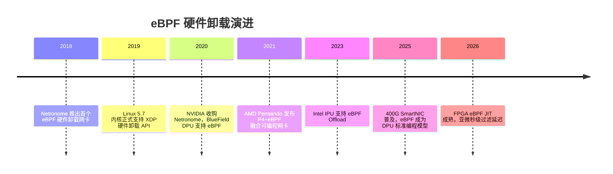
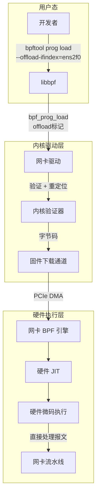
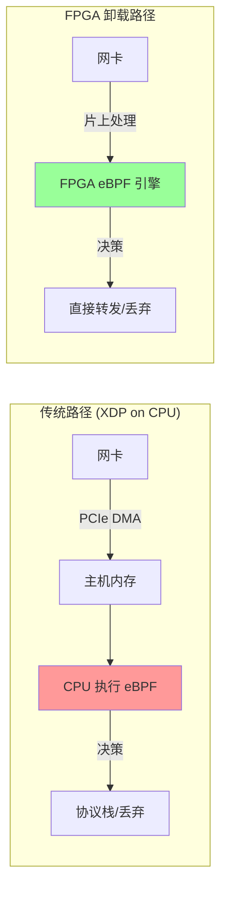
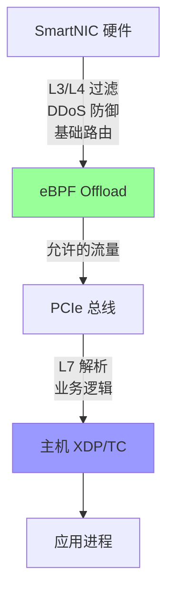
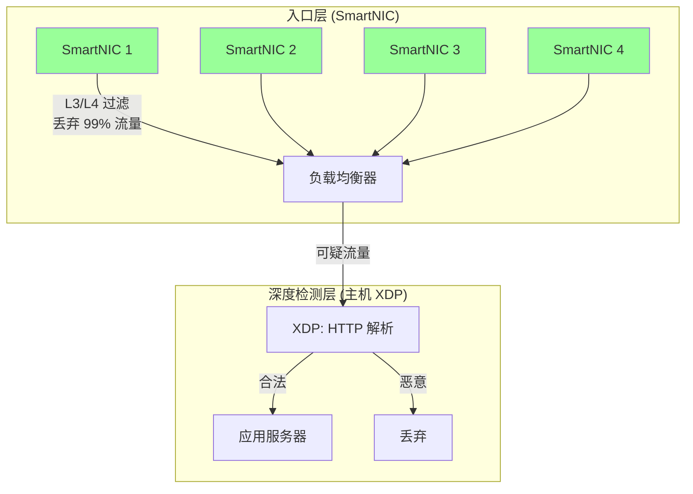

> [!info] eBPF 2026 深度探索系列 0. [[2026-04-08-ebpf-comprehensive-learning-roadmap|全栈学习路径总览]]
>
> 1. [[2026-04-08-ebpf-deep-dive-ch1-registers-and-instructions|第一章：寄存器与指令集]]
> 2. [[2026-04-08-ebpf-deep-dive-ch1-5-function-calls|第一.五章：四种函数调用与动态内存]]
> 3. [[2026-04-08-ebpf-deep-dive-ch1-6-the-verifier|第一.六章：验证器 (Verifier) 的底层逻辑]]
> 4. [[2026-04-08-ebpf-deep-dive-ch2-maps-and-communication|第二章：Map 机制与跨空间通信]]
> 5. [[2026-04-08-ebpf-deep-dive-ch2-5-kptr-and-ownership|第二.五章：kptr (内核指针) 与内存所有权模型]]
> 6. [[2026-04-08-ebpf-deep-dive-ch3-core-and-btf|第三章：CO-RE 与 BTF 的跨版本魔法]]
> 7. [[2026-04-08-ebpf-deep-dive-ch4-tracing-hooks-and-security|第四章：从 kprobe 到 LSM 的追踪全图景]]
> 8. [[2026-04-08-ebpf-deep-dive-ch7-5-uprobes-dynamic-tracing|第七.五章：uprobe 用户态动态追踪原理]]
> 9. [[2026-04-08-ebpf-deep-dive-ch7-6-bpftime-user-runtime|第七.六章：bpftime 与用户态 eBPF 加速]]
> 10. [[2026-04-08-ebpf-deep-dive-ch18-bpftime-injection-mastery|第七.七章：bpftime 自动化注入与全量监控实战]]
> 11. [[2026-04-08-ebpf-deep-dive-ch7-8-uprobe-selection-guide|第七.八章：uprobe 选型指南：内核态 vs 用户态]]
> 12. [[2026-04-08-ebpf-deep-dive-ch5-xdp-networking-performance|第五章：XDP 极致网络性能与全栈架构]]
> 13. [[2026-04-08-ebpf-deep-dive-ch6-tc-traffic-control|第六章：TC (Traffic Control) 流量调度艺术]]
> 14. [[2026-04-08-ebpf-deep-dive-ch7-security-lsm-enforcement|第七章：LSM BPF 从可观测到安全执法]]
> 15. [[2026-04-08-ebpf-deep-dive-ch8-advanced-tuning-and-profiling|第八章：进阶实战与内核调优]]
> 16. [[2026-04-08-ebpf-deep-dive-ch9-af-xdp-zero-copy|第九章：AF_XDP 零拷贝与用户态协议栈]]
> 17. [[2026-04-08-ebpf-deep-dive-ch10-sched-ext-custom-scheduler|第十章：sched_ext 自定义 CPU 调度器]]
> 18. [[2026-04-08-ebpf-deep-dive-ch11-bpf-iterators|第十一章：BPF Iterators 内核对象迭代器]]
> 19. [[2026-04-08-ebpf-deep-dive-ch12-kfuncs-evolution|第十二章：kfuncs 下一代内核交互标准]]
> 20. [[2026-04-08-ebpf-deep-dive-ch13-usdt-tracing|第十三章：USDT 用户态静态定义追踪]]
> 21. [[2026-04-08-ebpf-deep-dive-ch14-ai-llm-inference-monitoring|第十四章：AI 推理与大模型监控前沿]]
> 22. [[2026-04-08-ebpf-deep-dive-ch15-container-isolation|第十五章：无感增强容器隔离性]]
> 23. [[2026-04-08-ebpf-deep-dive-ch16-ebpf-and-wasm|第十六章：eBPF 与 WebAssembly (WASM) 的共生架构]]
> 24. [[2026-04-08-ebpf-deep-dive-ch17-storage-and-filesystem|第十七章：存储与文件系统加速]]
> 25. [[2026-04-08-ebpf-deep-dive-ch18-lifecycle-and-links|第十八章：生命周期管理与 BPF Links]]
> 26. [[2026-04-08-ebpf-deep-dive-ch19-atomic-updates-and-hot-upgrade|第十九章：程序的原子更新与蓝绿部署]]
> 27. [[2026-04-08-ebpf-deep-dive-ch25-5-stack-trace-correlation|第二五.五章：调用栈与业务请求的深度绑定]]
> 28. [[2026-04-08-ebpf-deep-dive-ch20-edge-iot-acceleration|第二十章：边缘计算与工业协议加速]]
> 29. [[2026-04-08-ebpf-deep-dive-ch21-debugging-and-verifier|第二十一章：调试实战与验证器 (Verifier) 诊断]]
> 30. [[2026-04-08-ebpf-deep-dive-ch22-testing-and-ci-cd|第二十二章：测试与持续集成 (CI/CD) 实战]]
> 31. [[2026-04-08-ebpf-deep-dive-ch23-security-and-permissions|第二十三章：权限细分与 BPF 安全沙箱]]
> 32. [[2026-04-08-ebpf-deep-dive-ch24-meta-monitoring-and-self-healing|第二十四章：eBPF 程序的内核自愈与监控]]
> 33. [[2026-04-08-ebpf-deep-dive-ch25-full-stack-observability|第二十五章：全栈可观测性与端到端追踪]]
> 34. [[2026-04-08-ebpf-deep-dive-ch26-network-security-high-level|第二十六章：网络安全防御的高阶实战]]
> 35. [[2026-04-08-ebpf-deep-dive-ch27-agent-engineering-architecture|第二十七章：工业级模块化 Agent 架构演进]]
> 36. [[2026-04-08-ebpf-deep-dive-ch28-offensive-and-defensive|第二十八章：攻防博弈与 Rootkit 防御]]
> 37. [[2026-04-08-ebpf-deep-dive-ch29-networking-deep-dive|第二十九章：网络应用深水区——负载均衡、Sockmap 与拥塞控制]]
> 38. **第三十章：硬件卸载与 SmartNIC 实战**
> 39. [[2026-04-08-ebpf-deep-dive-ch31-signed-objects-and-security|第三十一章：内核原生签名与供应链安全]]
> 40. [[2026-04-08-ebpf-deep-dive-ch32-ebpf-for-windows|第三十二章：跨平台崛起——eBPF for Windows]]
> 41. [[2026-04-08-ebpf-deep-dive-ch32-5-macos-status|第三十二.五章：macOS 的特殊路径]]
> 42. [[2026-04-08-ebpf-deep-dive-ch33-serverless-optimization|第三十三章：Serverless 冷启动消除与动态计费]]
> 43. [[2026-04-08-ebpf-deep-dive-ch34-waf-and-rasp|第三十四章：Web 安全革命——内核态 WAF 与 RASP]]
> 44. [[2026-04-08-ebpf-deep-dive-ch35-npu-tpu-ai-hardware|第三十五章：AI 推理硬件 (NPU/TPU) 与硬件定义内核]]
> 45. [[2026-04-08-ebpf-deep-dive-ch36-dynamic-language-introspection|第三十六章：动态语言感知——业务对象的零代码提取]]
> 46. [[2026-04-08-ebpf-deep-dive-ch37-green-computing|第三十七章：绿色计算与能耗精准归因]]
> 47. [[2026-04-08-ebpf-deep-dive-ch38-ecosystem-and-career|第三十八章：2026 生态全景与工程师职业导航]]
> 48. [[2026-04-09-ebpf-deep-dive-ch39-rust-aya-framework|第三十九章：Rust eBPF 开发实战——Aya 框架与安全编程]]
> 49. [[2026-04-09-ebpf-deep-dive-ch40-network-protocols-deep-dive|第四十章：网络协议深度解析——TCP/UDP/QUIC 的 eBPF 视角]]
> 50. [[2026-04-09-ebpf-deep-dive-ch41-memory-safety-and-vulnerabilities|第四十一章：eBPF 内存安全与漏洞分析]]
> 51. [[2026-04-09-ebpf-deep-dive-ch42-service-mesh-integration|第四十二章：eBPF 与 Service Mesh 深度集成]]

---

## 1. 概述：突破 400G 网络的瓶颈

随着数据中心网络向 100G/400G 快速迈进，基于主机 CPU 的网络处理（即使是 XDP）也开始面临巨大的压力。**硬件卸载 (Hardware Offload)** 允许将 eBPF 程序直接注入到智能网卡 (SmartNIC) 或 FPGA 中，在报文进入主机内存之前完成处理。

其核心价值在于：**零 CPU 损耗** 和 **微秒级确定性延迟**。

### 1.1 为什么需要硬件卸载？

在 400Gbps 线速下，每秒处理约 6000 万个小包（64 字节）。即使 eBPF 的 XDP 路径已极度优化，主机 CPU 仍需消耗 4-8 个核心来处理纯网络逻辑。对于 AI 推理集群等计算密集型场景，这是不可接受的浪费。

| 方案                   | CPU 占用 | 延迟          | 吞吐上限 |
| :--------------------- | :------- | :------------ | :------- |
| 传统内核协议栈         | 8-16 核  | 10-50μs       | ~50Mpps  |
| XDP (Native)           | 2-4 核   | 1-5μs         | ~100Mpps |
| XDP (Hardware Offload) | **0 核** | **0.1-0.5μs** | **线速** |

### 1.2 硬件卸载的演进历程



---

## 2. 硬件卸载的工作原理

### 2.1 三层执行架构



**执行流程详解**：

1. **用户态**：开发者通过 `bpftool` 的特定参数（`--offload-ifindex`）发起加载请求
2. **内核驱动层**：驱动程序识别卸载标记，将 eBPF 字节码通过供应商特定的二进制接口发往网卡
3. **硬件执行层**：网卡内置的 BPF 引擎（SoC 或专用协处理器）将字节码 JIT 编译为硬件微码，直接在硬件流水线上运行

### 2.2 卸载模式的局限性

硬件资源（如 SRAM、逻辑单元）远比 CPU 珍贵，因此卸载程序必须遵循更严格的约束：

| 约束维度        | 主机 eBPF            | 硬件卸载 eBPF               |
| :-------------- | :------------------- | :-------------------------- |
| **指令数量**    | ~100 万条            | 通常 512-4096 条            |
| **Map 类型**    | 全量 (30+ 种)        | Hash, Array, Cgroup Storage |
| **Helper 函数** | 200+                 | < 20 种基础函数             |
| **循环**        | 有界循环支持         | 通常不支持循环              |
| **栈大小**      | 512 字节             | 128-256 字节                |
| **程序类型**    | XDP/TC/LSM/kprobe... | 仅 XDP                      |

### 2.3 硬件验证器的特殊规则

硬件验证器在标准内核验证器的基础上增加了额外的安全检查：

```c
// 硬件验证器的额外检查项
// 1. 指令数量限制检查
if (insn_cnt > dev->offload_max_insns)
    return -E2BIG;

// 2. 不支持的 Map 类型
if (map->map_type != BPF_MAP_TYPE_HASH &&
    map->map_type != BPF_MAP_TYPE_ARRAY)
    return -EINVAL;

// 3. 硬件不支持 bpf_loop 和复杂 helper
// 4. 栈访问深度限制（通常 64 字节以内）
```

---

## 3. 代码实战：极致精简的硬件防火墙

在卸载模式下，每一行代码都要精打细算。

```c
#include <vmlinux.h>
#include <bpf/bpf_helpers.h>

// 定义一个硬件兼容的统计 Map
struct {
    __uint(type, BPF_MAP_TYPE_HASH);
    __uint(max_entries, 512); // 限制大小以适应硬件 SRAM
    __type(key, u32);         // src_ip
    __type(value, u64);       // count
} block_list_map SEC(".maps");

SEC("xdp")
int xdp_hw_offload_prog(struct xdp_md *ctx) {
    void *data = (void *)(long)ctx->data;
    void *data_end = (void *)(long)ctx->data_end;

    struct ethhdr *eth = data;
    if ((void *)(eth + 1) > data_end) return XDP_PASS;

    // 仅处理 IPv4 流量
    if (eth->h_proto != bpf_htons(ETH_P_IP)) return XDP_PASS;

    struct iphdr *iph = (void *)(eth + 1);
    if ((void *)(iph + 1) > data_end) return XDP_PASS;

    u32 src_ip = iph->saddr;
    u64 *cnt = bpf_map_lookup_elem(&block_list_map, &src_ip);

    if (cnt) {
        // 在网卡硬件级别丢弃报文，报文完全不占用 PCIe 带宽
        __sync_fetch_and_add(cnt, 1);
        return XDP_DROP;
    }

    return XDP_PASS;
}
```

### 3.1 加载到硬件的完整命令

```bash
# 1. 确认网卡支持 offload
bpftool net show dev ens2f0

# 2. 编译 eBPF 程序（需要目标硬件的 BTF）
clang -target bpf -g -O2 -c xdp_hw_firewall.c -o xdp_hw_firewall.o

# 3. 加载到硬件（注意 --offload-ifindex 参数）
bpftool prog load xdp_hw_firewall.o \
    /sys/fs/bpf/xdp_hw \
    type xdp \
    --offload-ifindex $(cat /sys/class/net/ens2f0/ifindex)

# 4. 挂载到网卡
ip link set ens2f0 xdp obj xdp_hw_firewall.o sec xdp

# 5. 验证程序运行位置
bpftool prog show | grep -A5 "xdp_hw"
# 预期输出中会显示 "offloaded_to: ens2f0"
```

---

## 4. 进阶实战：硬件级 DDoS 防御

### 4.1 多层限速器

在硬件中实现令牌桶限速，将攻击流量在网卡层面直接丢弃：

```c
// 硬件限速器：每个 /24 子网独立的速率限制
struct rate_limit {
    u64 tokens;
    u64 last_update;
};

struct {
    __uint(type, BPF_MAP_TYPE_HASH);
    __uint(max_entries, 256);  // 仅跟踪 256 个子网
    __type(key, u32);           // /24 子网前缀
    __type(value, struct rate_limit);
} rate_map SEC(".maps");

#define RATE_LIMIT_PPS 10000     // 每子网每秒 10000 包
#define TOKENS_PER_NS 10         // 每纳秒补充的令牌数

SEC("xdp")
int xdp_hw_ratelimit(struct xdp_md *ctx) {
    void *data = (void *)(long)ctx->data;
    void *data_end = (void *)(long)ctx->data_end;

    struct ethhdr *eth = data;
    if ((void *)(eth + 1) > data_end) return XDP_PASS;
    if (eth->h_proto != bpf_htons(ETH_P_IP)) return XDP_PASS;

    struct iphdr *iph = (void *)(eth + 1);
    if ((void *)(iph + 1) > data_end) return XDP_PASS;

    // 提取 /24 子网前缀
    u32 subnet = iph->saddr & bpf_htonl(0xFFFFFF00);

    struct rate_limit *rl = bpf_map_lookup_elem(&rate_map, &subnet);
    if (!rl) return XDP_PASS;

    u64 now = bpf_ktime_get_ns();
    u64 elapsed = now - rl->last_update;

    // 补充令牌
    if (elapsed > 0) {
        rl->tokens += elapsed * TOKENS_PER_NS;
        if (rl->tokens > RATE_LIMIT_PPS * 1000000000ULL)
            rl->tokens = RATE_LIMIT_PPS * 1000000000ULL;
        rl->last_update = now;
    }

    // 消耗令牌
    if (rl->tokens == 0) return XDP_DROP;
    rl->tokens -= 1000000000ULL / RATE_LIMIT_PPS;

    return XDP_PASS;
}
```

### 4.2 用户态管理程序

```c
// 用户态：动态更新硬件防火墙黑名单
#include <bpf/libbpf.h>
#include <bpf/bpf.h>

int main() {
    int map_fd = bpf_obj_get("/sys/fs/bpf/xdp_hw/block_list_map");
    if (map_fd < 0) {
        fprintf(stderr, "Failed to open map\n");
        return 1;
    }

    // 添加新的黑名单 IP
    u32 block_ip = inet_addr("203.0.113.50");
    u64 count = 0;
    bpf_map_update_elem(map_fd, &block_ip, &count, BPF_ANY);

    // 查看当前统计
    u32 lookup_ip = inet_addr("198.51.100.1");
    u64 *val = bpf_map_lookup_elem(map_fd, &lookup_ip);
    if (val) {
        printf("IP %s blocked %llu packets\n", "198.51.100.1", *val);
    }

    return 0;
}
```

---

## 5. 2026 年的硬件生态

### 5.1 主流 SmartNIC 平台对比

| 平台                    | 处理器架构              | eBPF 支持度       | 特色能力               | 典型应用             |
| :---------------------- | :---------------------- | :---------------- | :--------------------- | :------------------- |
| **NVIDIA BlueField-3**  | ARM Cortex + 流量处理器 | 完整 XDP offload  | DOCA SDK、NVLink       | 存储网络、GPU Direct |
| **AMD Pensando DPU**    | P4 + eBPF 融合引擎      | XDP + 自定义 Map  | 分布式防火墙、零信任   | 零信任网络、微分段   |
| **Intel IPU E2100**     | Xeon-D + FPGA           | XDP offload       | SR-IOV + OVS 卸载      | 电信 NFV、5G UPF     |
| **FPGA (Xilinx/Intel)** | 可编程逻辑              | eBPF→Verilog 综合 | 亚微秒延迟、可定制管线 | 高频交易、国防       |
| **华为鲲鹏智能网卡**    | ARM + 自研 NPU          | XDP + 自研扩展    | 国产化替代、RDMA       | 金融、政务云         |

### 5.2 FPGA 模式的特殊优势

通过将 eBPF 指令集映射为逻辑门，FPGA 实现了**亚微秒级**的极致过滤延迟：



**FPGA eBPF 综合流程**：

1. **前端**：标准 LLVM 编译 eBPF C 代码为 eBPF 字节码
2. **中端**：自定义 Pass 将 eBPF 指令映射为数据流图（DFG）
3. **后端**：FPGA 综合工具将 DFG 转换为 Verilog/HDL
4. **烧录**：比特流通过 PCIe 写入 FPGA 配置存储器

---

## 6. 硬件卸载的调试与诊断

### 6.1 常见问题诊断表

| 现象                 | 可能原因           | 诊断命令                                  |
| :------------------- | :----------------- | :---------------------------------------- |
| `bpftool load` 失败  | 指令数超限         | `readelf -S prog.o` 查看段大小            |
| 程序加载成功但不生效 | 驱动不支持 offload | `ethtool -k ens2f0 \| grep hw-tc-offload` |
| 报文未被过滤         | Map 未同步到硬件   | `bpftool map dump` 对比硬件统计           |
| 性能未提升           | PCIe 瓶颈          | `lspci -vvv` 检查 PCIe 链路宽度           |

### 6.2 硬件计数器读取

```bash
# 读取硬件 BPF 程序的运行时统计
bpftool prog show id 42

# 输出示例：
# 42: xdp name xdp_hw_offload  tag a1b2c3d4
#     loaded_at 2026-04-01T10:00:00+0000  uid 0
#     xlated 256B  jited 128B  memlock 0B  map_ids 10
#     offloaded_to ens2f0
#     run_cnt 123456789  run_time_ns 456789012
#     run_cnt_enqueued 0
```

---

## 7. 硬件与主机 eBPF 的混合部署

在实际生产中，并非所有逻辑都适合卸载到硬件。推荐的混合部署策略：



**分流原则**：

- **硬件层**：状态无关的快速路径（ACL、限速、基础路由）
- **主机层**：需要访问用户态状态或复杂解析的逻辑（HTTP 解析、gRPC 路由）
- **Map 同步**：硬件和主机通过共享 Map（或用户态同步）保持策略一致

---

## 9. 案例研究：400G DDoS 防护集群

### 9.1 部署架构

某大型互联网公司的 DDoS 防护集群采用 eBPF 硬件卸载方案：



**部署效果**：

- 总带宽：400Gbps × 4 = 1.6Tbps
- SmartNIC 层过滤：99.5% 的攻击流量（SYN Flood、UDP Flood）
- 主机 XDP 层过滤：剩余 0.5% 中的 80%（HTTP 异常）
- 最终到达应用层的攻击流量：< 0.1%

### 9.2 成本分析

| 项目         | 传统方案                | eBPF 硬件卸载        |
| :----------- | :---------------------- | :------------------- |
| 防御带宽     | 100Gbps (硬件防火墙)    | 1.6Tbps (SmartNIC)   |
| 设备成本     | $200K (专用防火墙 × 16) | $80K (SmartNIC × 40) |
| CPU 占用     | 32 核 (4 核/100G)       | 0 核                 |
| 年电费       | $50K                    | $5K                  |
| 总 TCO (3年) | $1.1M                   | $0.5M                |

---

## 10. 硬件卸载的调试与故障排查

### 10.1 卸载状态诊断工具

```bash
# 1. 检查网卡是否支持硬件卸载
ethtool -k eth0 | grep -E "hw-tc-offload|rx-hashing|rx-vlan-filter"

# 2. 检查 BPF 程序是否真正卸载到硬件
bpftool net show dev eth0
# 输出中的 "hw_offload" 字段指示是否已卸载

# 3. 查看硬件卸载的统计信息
tc filter show dev eth0 ingress
tc -s filter show dev eth0 ingress

# 4. 查看网卡硬件流表规则
# Mellanox
mlxlink -m port_info
# Pensando
p4rtctl get-flow-table

# 5. 检查卸载失败的详细原因
dmesg | grep -i "offload\|hw_bpf\|tc_offload"
```

### 10.2 常见卸载失败原因与解决方案

| 失败现象                         | 可能原因                       | 解决方案                              |
| :------------------------------- | :----------------------------- | :------------------------------------ |
| `bpftool net show` 无 hw_offload | 网卡未开启硬件卸载             | `ethtool -K eth0 hw-tc-offload on`    |
| 程序加载成功但无流量命中         | 流量未进入硬件管线             | 检查 RSS 队列映射和 steering 模式     |
| Map 查找返回全零                 | 硬件 Map 未同步                | 手动调用 `bpftool map update` 同步    |
| 特定 Helper 报错                 | 硬件不支持该 Helper            | 查阅网卡厂商的 BPF 能力矩阵           |
| 性能无提升                       | 程序未被卸载（fallback 到 SW） | 使用 `bpftool prog show` 确认运行位置 |

### 10.3 性能基准测试方法

```bash
# XDP 硬件卸载 vs 主机 XDP 性能对比
# 使用 pktgen 生成测试流量

# 主机 XDP (软件)
ip link set eth0 xdp obj xdp_prog.o sec xdp
./run_test.sh --pps 10M --duration 60

# 硬件 XDP (卸载)
ip link set eth0 xdp offload obj xdp_prog.o sec xdp
./run_test.sh --pps 10M --duration 60

# 对比指标
# - PPS (packets per second)
# - CPU 占用率 (mpstat -P ALL 1)
# - 延迟分布 (使用 cyclictest 或 sockperf)
```

---

## 11. FAQ

**Q1：所有网卡都支持 eBPF 硬件卸载吗？**

A：不是。只有 SmartNIC/DPU 类网卡支持，普通网卡（如 Intel E810 以外的型号）不支持。购买前需确认网卡是否支持 `hw-tc-offload` 和 `xdp-hw-offload`。Mellanox ConnectX-6 Dx 及以上、NVIDIA BlueField 系列、AMD Pensando 系列均支持。

**Q2：硬件卸载的 Map 能被主机上的 eBPF 程序访问吗？**

A：取决于实现。NVIDIA BlueField 支持通过特定 API 在主机和 DPU 之间共享 Map；Pensando 使用独立的 Map 空间，需要用户态程序同步。2026 年正在推动的 `BPF_MAP_TYPE_HW` 标准旨在统一这一接口。

**Q3：硬件卸载程序的热更新会影响流量吗？**

A：大多数 SmartNIC 支持原子程序替换，类似主机上的 `bpf_prog_update`。在替换瞬间，网卡会使用"双缓冲"机制——旧程序处理已进入管线的报文，新程序处理新到达的报文，确保零丢包。

**Q4：硬件 eBPF 的 JIT 编译需要多长时间？**

A：通常在 10-100ms 之间，取决于程序复杂度和硬件平台。FPGA 综合则可能需要数分钟到数小时（但只需要一次综合，后续可重用比特流）。建议在部署阶段预编译，避免运行时编译。

**Q5：硬件卸载能处理 VXLAN/Geneve 等隧道流量吗？**

A：可以，但需要硬件支持内层报文解析。NVIDIA ConnectX 和 Pensando DPU 支持硬件隧道终结（Tunnel Termination），eBPF 程序可以直接看到内层报文。对于不支持硬件终结的场景，需要在 eBPF 中手动解析外层 UDP 头和隧道头。

**Q6：如何评估硬件卸载的投入产出比（ROI）？**

A：核心计算公式：`ROI = (节省的 CPU 核心数 × 单核年成本) - (SmartNIC 采购成本 + 开发维护成本)`。经验法则：当单台服务器的网络 CPU 开销超过 4 核，且年化 CPU 成本超过 SmartNIC 差价时，硬件卸载就有正向 ROI。AI 训练/推理集群通常满足此条件。

**Q7：如何排查硬件卸载程序不生效的问题？**

A：排查清单：1) `ethtool -k <iface> | grep hw-tc-offload` 确认网卡开启了硬件卸载；2) `dmesg | grep -i bpf` 查看内核日志中的卸载相关信息；3) `bpftool net show` 确认程序确实被卸载而非运行在主机上；4) 检查程序是否使用了硬件不支持的 Map 类型或 Helper 函数。

**Q8：硬件卸载环境下如何进行性能调优？**

A：关键调优点：1) 减少 Map 查找次数（硬件 SRAM 访问虽然快但仍有限）；2) 使用 Per-CPU Map 避免锁竞争；3) 将大规则集拆分为多个小程序并行匹配；4) 利用硬件的 RSS (Receive Side Scaling) 将流量分散到多个队列，每个队列运行独立的 BPF 程序。
