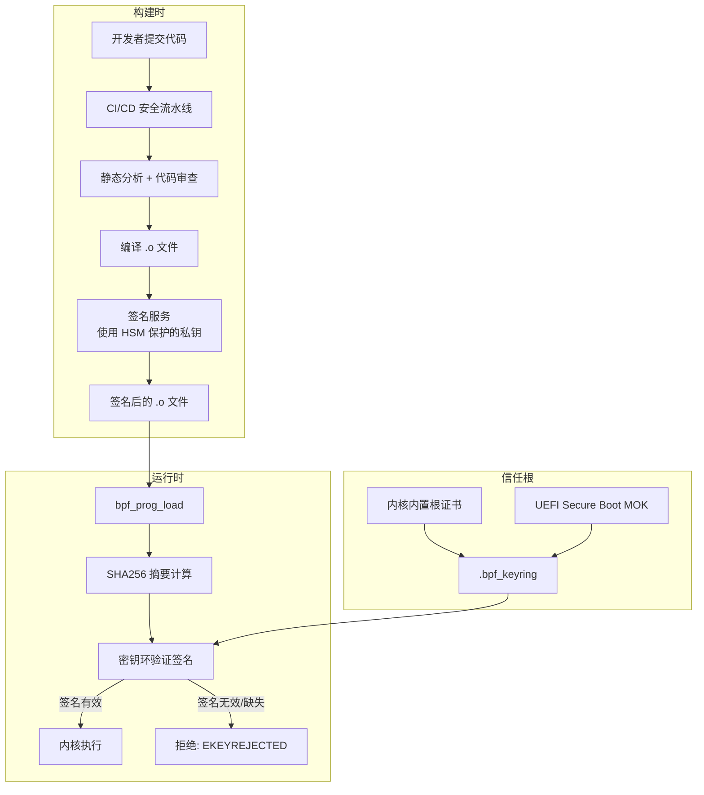
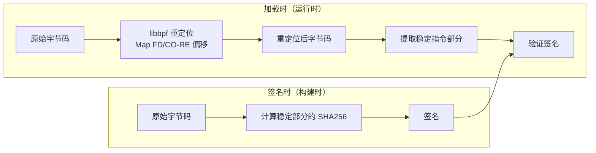
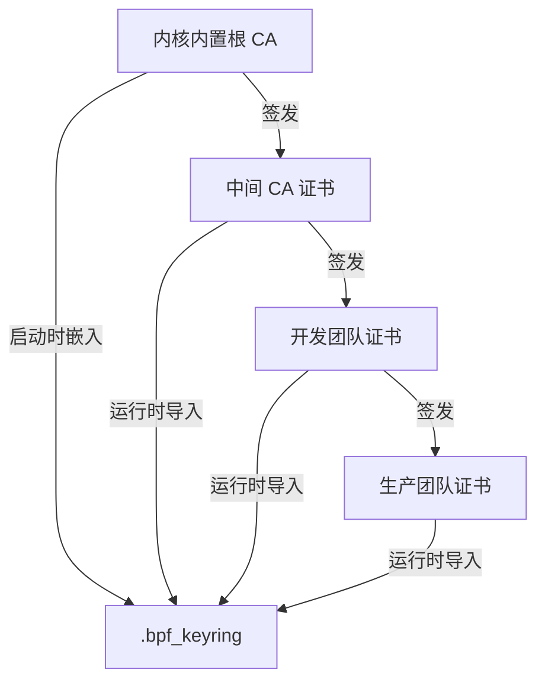
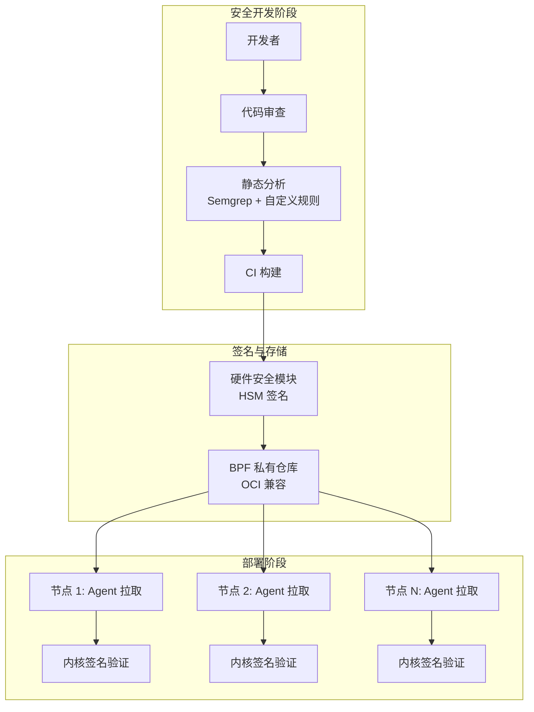
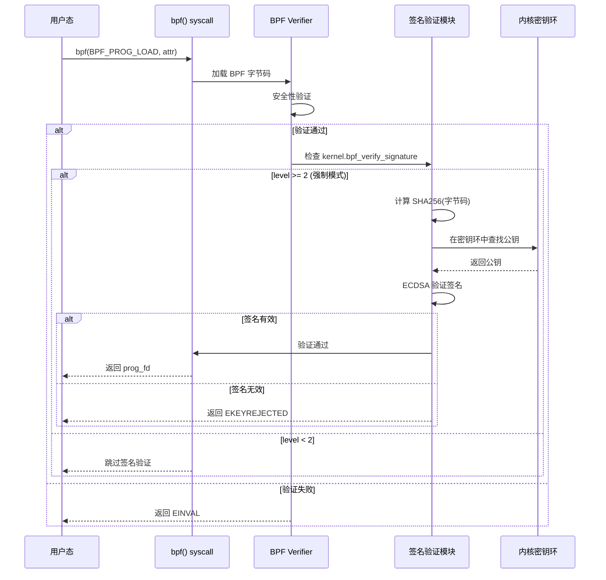

> [!info] eBPF 2026 深度探索系列 0. [[2026-04-08-ebpf-comprehensive-learning-roadmap|全栈学习路径总览]]
>
> 1. [[2026-04-08-ebpf-deep-dive-ch1-registers-and-instructions|第一章：寄存器与指令集]]
> 2. [[2026-04-08-ebpf-deep-dive-ch1-5-function-calls|第一.五章：四种函数调用与动态内存]]
> 3. [[2026-04-08-ebpf-deep-dive-ch1-6-the-verifier|第一.六章：验证器 (Verifier) 的底层逻辑]]
> 4. [[2026-04-08-ebpf-deep-dive-ch2-maps-and-communication|第二章：Map 机制与跨空间通信]]
> 5. [[2026-04-08-ebpf-deep-dive-ch2-5-kptr-and-ownership|第二.五章：kptr (内核指针) 与内存所有权模型]]
> 6. [[2026-04-08-ebpf-deep-dive-ch3-core-and-btf|第三章：CO-RE 与 BTF 的跨版本魔法]]
> 7. [[2026-04-08-ebpf-deep-dive-ch4-tracing-hooks-and-security|第四章：从 kprobe 到 LSM 的追踪全图景]]
> 8. [[2026-04-08-ebpf-deep-dive-ch7-5-uprobes-dynamic-tracing|第七.五章：uprobe 用户态动态追踪原理]]
> 9. [[2026-04-08-ebpf-deep-dive-ch7-6-bpftime-user-runtime|第七.六章：bpftime 与用户态 eBPF 加速]]
> 10. [[2026-04-08-ebpf-deep-dive-ch18-bpftime-injection-mastery|第七.七章：bpftime 自动化注入与全量监控实战]]
> 11. [[2026-04-08-ebpf-deep-dive-ch7-8-uprobe-selection-guide|第七.八章：uprobe 选型指南：内核态 vs 用户态]]
> 12. [[2026-04-08-ebpf-deep-dive-ch5-xdp-networking-performance|第五章：XDP 极致网络性能与全栈架构]]
> 13. [[2026-04-08-ebpf-deep-dive-ch6-tc-traffic-control|第六章：TC (Traffic Control) 流量调度艺术]]
> 14. [[2026-04-08-ebpf-deep-dive-ch7-security-lsm-enforcement|第七章：LSM BPF 从可观测到安全执法]]
> 15. [[2026-04-08-ebpf-deep-dive-ch8-advanced-tuning-and-profiling|第八章：进阶实战与内核调优]]
> 16. [[2026-04-08-ebpf-deep-dive-ch9-af-xdp-zero-copy|第九章：AF_XDP 零拷贝与用户态协议栈]]
> 17. [[2026-04-08-ebpf-deep-dive-ch10-sched-ext-custom-scheduler|第十章：sched_ext 自定义 CPU 调度器]]
> 18. [[2026-04-08-ebpf-deep-dive-ch11-bpf-iterators|第十一章：BPF Iterators 内核对象迭代器]]
> 19. [[2026-04-08-ebpf-deep-dive-ch12-kfuncs-evolution|第十二章：kfuncs 下一代内核交互标准]]
> 20. [[2026-04-08-ebpf-deep-dive-ch13-usdt-tracing|第十三章：USDT 用户态静态定义追踪]]
> 21. [[2026-04-08-ebpf-deep-dive-ch14-ai-llm-inference-monitoring|第十四章：AI 推理与大模型监控前沿]]
> 22. [[2026-04-08-ebpf-deep-dive-ch15-container-isolation|第十五章：无感增强容器隔离性]]
> 23. [[2026-04-08-ebpf-deep-dive-ch16-ebpf-and-wasm|第十六章：eBPF 与 WebAssembly (WASM) 的共生架构]]
> 24. [[2026-04-08-ebpf-deep-dive-ch17-storage-and-filesystem|第十八章：生命周期管理与 BPF Links]]
> 25. [[2026-04-08-ebpf-deep-dive-ch18-lifecycle-and-links|第十八章：生命周期管理与 BPF Links]]
> 26. [[2026-04-08-ebpf-deep-dive-ch19-atomic-updates-and-hot-upgrade|第十九章：程序的原子更新与蓝绿部署]]
> 27. [[2026-04-08-ebpf-deep-dive-ch25-5-stack-trace-correlation|第二五.五章：调用栈与业务请求的深度绑定]]
> 28. [[2026-04-08-ebpf-deep-dive-ch20-edge-iot-acceleration|第二十章：边缘计算与工业协议加速]]
> 29. [[2026-04-08-ebpf-deep-dive-ch21-debugging-and-verifier|第二十一章：调试实战与验证器 (Verifier) 诊断]]
> 30. [[2026-04-08-ebpf-deep-dive-ch22-testing-and-ci-cd|第二十二章：测试与持续集成 (CI/CD) 实战]]
> 31. [[2026-04-08-ebpf-deep-dive-ch23-security-and-permissions|第二十三章：权限细分与 BPF 安全沙箱]]
> 32. [[2026-04-08-ebpf-deep-dive-ch24-meta-monitoring-and-self-healing|第二十四章：eBPF 程序的内核自愈与监控]]
> 33. [[2026-04-08-ebpf-deep-dive-ch25-full-stack-observability|第二十五章：全栈可观测性与端到端追踪]]
> 34. [[2026-04-08-ebpf-deep-dive-ch26-network-security-high-level|第二十六章：网络安全防御的高阶实战]]
> 35. [[2026-04-08-ebpf-deep-dive-ch27-agent-engineering-architecture|第二十七章：工业级模块化 Agent 架构演进]]
> 36. [[2026-04-08-ebpf-deep-dive-ch28-offensive-and-defensive|第二十八章：攻防博弈与 Rootkit 防御]]
> 37. [[2026-04-08-ebpf-deep-dive-ch29-networking-deep-dive|第二十九章：网络应用深水区——负载均衡、Sockmap 与拥塞控制]]
> 38. [[2026-04-08-ebpf-deep-dive-ch30-hardware-offload|第三十章：硬件卸载与 SmartNIC 实战]]
> 39. **第三十一章：内核原生签名与供应链安全**
> 40. [[2026-04-08-ebpf-deep-dive-ch32-ebpf-for-windows|第三十二章：跨平台崛起——eBPF for Windows]]
> 41. [[2026-04-08-ebpf-deep-dive-ch32-5-macos-status|第三十二.五章：macOS 的特殊路径]]
> 42. [[2026-04-08-ebpf-deep-dive-ch33-serverless-optimization|第三十三章：Serverless 冷启动消除与动态计费]]
> 43. [[2026-04-08-ebpf-deep-dive-ch34-waf-and-rasp|第三十四章：Web 安全革命——内核态 WAF 与 RASP]]
> 44. [[2026-04-08-ebpf-deep-dive-ch35-npu-tpu-ai-hardware|第三十五章：AI 推理硬件 (NPU/TPU) 与硬件定义内核]]
> 45. [[2026-04-08-ebpf-deep-dive-ch36-dynamic-language-introspection|第三十六章：动态语言感知——业务对象的零代码提取]]
> 46. [[2026-04-08-ebpf-deep-dive-ch37-green-computing|第三十七章：绿色计算与能耗精准归因]]
> 47. [[2026-04-08-ebpf-deep-dive-ch38-ecosystem-and-career|第三十八章：2026 生态全景与工程师职业导航]]
> 48. [[2026-04-09-ebpf-deep-dive-ch39-rust-aya-framework|第三十九章：Rust eBPF 开发实战——Aya 框架与安全编程]]
> 49. [[2026-04-09-ebpf-deep-dive-ch40-network-protocols-deep-dive|第四十章：网络协议深度解析——TCP/UDP/QUIC 的 eBPF 视角]]
> 50. [[2026-04-09-ebpf-deep-dive-ch41-memory-safety-and-vulnerabilities|第四十一章：eBPF 内存安全与漏洞分析]]
> 51. [[2026-04-09-ebpf-deep-dive-ch42-service-mesh-integration|第四十二章：eBPF 与 Service Mesh 深度集成]]

---

## 1. 概述：防御"身份不明"的字节码

在 eBPF 的高级应用阶段，内核不再仅仅是一个执行引擎，而是一个需要严格准入控制的受限区域。随着 eBPF Rootkit 和恶意探针的出现，单纯依靠特权位（CAP_BPF）已不足以保证系统安全。

**BPF 签名机制** 实现了字节码的"数字身份证明"，确保只有经过审核、签名的代码才能进入内核。

### 1.1 威胁模型分析

| 威胁类型         | 攻击向量                   | 传统防御     | 签名防御         |
| :--------------- | :------------------------- | :----------- | :--------------- |
| **恶意 Rootkit** | 注入未授权的 eBPF 程序     | CAP_BPF 检查 | 签名校验拒绝     |
| **供应链投毒**   | CI/CD 被入侵，替换 .o 文件 | 代码审查     | 密钥持有者验证   |
| **开发环境泄露** | 开发者本地构建恶意版本     | 信任开发者   | 私钥不出 CI 环境 |
| **运行时篡改**   | 修改已加载的字节码         | 内存保护     | 内核完整性校验   |

### 1.2 签名机制的信任链



---

## 2. 内核校验机制：钩子与密钥环

在 2026 年，BPF 签名校验已深度集成于内核的系统调用路径中，而非简单的用户态检查。

### 2.1 内核侧执行路径

当应用发起 `bpf_prog_load` 系统调用时，内核会触发 `security_bpf_prog_load()` 钩子：

1. **摘要计算**：内核实时对传入的字节码流计算 SHA256 指纹
2. **段解析**：从 ELF 结构中提取嵌入的 `.signature` 信息
3. **密钥环验证**：内核从受保护的 `.bpf_keyring` 中检索公钥，解密签名并与计算出的指纹比对
4. **决策**：若 Hash 不一致或无签名，内核直接拒绝执行，报错 `EKEYREJECTED`

### 2.2 签名校验的内核代码路径

```c
// 内核中的签名校验流程（简化）
// security/bpf/signature.c

int bpf_verify_signature(struct bpf_prog *prog) {
    // 1. 计算字节码的 SHA256
    u8 digest[SHA256_DIGEST_SIZE];
    sha256(prog->insns, prog->insns_cnt * sizeof(struct bpf_insn),
           digest);

    // 2. 从 ELF 中提取签名
    const void *sig = bpf_prog_get_signature(prog);
    size_t sig_len = bpf_prog_get_signature_len(prog);

    // 3. 在 .bpf_keyring 中查找公钥
    struct key *trusted_key;
    trusted_key = find_asymmetric_key(".bpf_keyring", sig, sig_len);

    if (!trusted_key)
        return -EKEYREJECTED;

    // 4. 执行 RSA/ECDSA 签名验证
    int ret = verify_signature(trusted_key, sig, sig_len, digest);
    return ret;
}
```

### 2.3 重定位与签名的"兼容性"难题

由于 eBPF 程序在加载前需由 `libbpf` 进行 **重定位 (Relocation)**（如修改 Map FD 或结构体偏移），这会改变字节码内容导致签名失效。

- **2026 解决方案**：内核支持"逻辑签名"机制。签名针对的是重定向前后的**稳定指令序列**和 **BTF 符号映射表**。内核验证器在校验签名时，能够感知并允许合法的重定位操作

**重定位感知签名的原理**：



---

## 3. 生产环境配置指南

要实现强制签名校验，必须完成从编译到运行的三位一体配置。

### 3.1 内核编译选项 (Kconfig)

确保内核配置了以下核心参数：

```bash
# /boot/config-$(uname -r) 中应包含：
CONFIG_BPF_SIGNATURE=y        # 启用 BPF 签名支持
CONFIG_KEYS=y                  # 内核密钥管理框架
CONFIG_SYSTEM_TRUSTED_KEYS="bpf-corp-x509.crt"  # 嵌入企业根证书
CONFIG_ASYMMETRIC_PUBLIC_KEY_SUBTYPE=y  # 非对称密钥支持
CONFIG_INTEGRITY_SIGNATURE=y   # 完整性签名基础设施
```

### 3.2 密钥环初始化 (Keyring Setup)

系统管理员在设备启动阶段，将企业证书导入受信任链：

```bash
# 1. 查看当前 BPF 密钥环状态
keyctl show @bpf_keyring

# 2. 将企业公钥导入 .bpf 专有密钥环
keyctl padd asymmetric "bpf_corp_signer" %:.bpf_keyring < bpf_enterprise.pub

# 3. 验证密钥已导入
keyctl list %:.bpf_keyring

# 4. 可选：从 UEFI MOK 同步密钥（Secure Boot 环境）
# 内核启动时自动将 MOK 列表中的密钥同步至 .bpf_keyring
```

### 3.3 策略锁死 (Enforcement)

通过 sysctl 控制校验强度：

```bash
# 0: 禁用签名校验（开发环境）
sysctl -w kernel.bpf_verify_signature=0

# 1: 审计模式：校验签名但不拦截（灰度发布）
sysctl -w kernel.bpf_verify_signature=1

# 2: 强制拦截模式（生产标准）
sysctl -w kernel.bpf_verify_signature=2

# 持久化配置
echo "kernel.bpf_verify_signature=2" >> /etc/sysctl.d/99-bpf-security.conf
```

---

## 4. 实战：建立 BPF 签名流水线

### 4.1 生成签名密钥对

```bash
# 1. 生成企业级 ECDSA P-256 密钥对
openssl ecparam -genkey -name prime256v1 -noout -out bpf_prod_private.pem
openssl ec -in bpf_prod_private.pem -pubout -out bpf_prod_public.pem

# 2. 将私钥导入 HSM（生产环境推荐）
pkcs11-tool --write-object bpf_prod_private.pem --type privkey --label "bpf_prod_signer"

# 3. 转换公钥为内核可识别的 X.509 格式
openssl req -new -x509 -key bpf_prod_private.pem \
    -out bpf_prod_cert.der -outform DER \
    -days 3650 -subj "/CN=BPF Production Signer/O=MyCorp"

# 4. 将证书嵌入内核（编译时）
cp bpf_prod_cert.der certs/bpf-corp-x509.crt
```

### 4.2 CI/CD 签名流水线

```yaml
# .github/workflows/bpf-sign.yml
name: BPF Build & Sign

on: [push, pull_request]

jobs:
  build-and-sign:
    runs-on: self-hosted # 必须在安全环境中运行
    steps:
      - uses: actions/checkout@v4

      - name: Compile BPF programs
        run: |
          make -C bpf-progs/

      - name: Sign BPF objects
        env:
          BPF_SIGNING_KEY: ${{ secrets.BPF_SIGNING_KEY }}
        run: |
          for obj in bpf-progs/*.o; do
            # 使用 HSM 中的私钥签名
            bpftool gen sign $BPF_SIGNING_KEY "$obj"
            echo "Signed: $obj"
          done

      - name: Verify signatures
        run: |
          for obj in bpf-progs/*.o; do
            bpftool gen verify "$obj" --trusted-key bpf_prod_public.pem
          done

      - name: Deploy to production
        if: github.ref == 'refs/heads/main'
        run: |
          ./deploy.sh --verify-signature --enforce
```

### 4.3 签名验证失败的处理

```bash
# 手动验证签名
bpftool prog load xdp_firewall.o /sys/fs/bpf/test \
    --verify-signature

# 预期成功输出：
# Program loaded successfully, signature verified by key: bpf_corp_signer

# 预期失败输出：
# ERROR: EKEYREJECTED - Program signature verification failed
# HINT: Ensure the signing key is in .bpf_keyring
```

---

## 5. 信任链管理：从静态根到动态授权

一个核心的运维问题是：`.bpf_keyring` 中的密钥是死的吗？2026 年的内核采用了分层的信任模型。

### 5.1 构建时根证书 (Root of Trust)

在内核编译阶段，通过 `CONFIG_SYSTEM_TRUSTED_KEYS` 将企业的根 CA 证书直接嵌入内核镜像。这是信任的终极起点，确保了即使在应用层被攻破时，攻击者也无法篡改这个根基。

### 5.2 运行时动态委派 (Delegated Signing)

为了避免频繁更换内核，系统支持在不重启的情况下导入新密钥：



**动态委派的关键操作**：

1. **以信引信**：使用 `keyctl` 导入新公钥时，内核会校验该公钥是否由已内置的"根证书"签名
2. **引导集成**：在开启 UEFI Secure Boot 的机器上，存放在 **MOK (Machine Owner Key)** 列表中的密钥会在启动时被自动同步至 BPF 密钥环

这种设计实现了**"核心静态、业务动态"**的平衡：内核只需识别极少数根证书，而具体的 BPF 签名权可以安全地委派给不同业务线的发布证书。

### 5.3 密钥轮换策略

```bash
# 1. 导入新的签名密钥（由根 CA 签发的新证书）
keyctl padd asymmetric "bpf_prod_signer_v2" %:.bpf_keyring < bpf_prod_v2.pub

# 2. 验证新密钥
keyctl list %:.bpf_keyring

# 3. 灰度期：同时接受新旧密钥签名的程序
# （sysctl = 1 审计模式）

# 4. 重新签名所有 BPF 程序（使用新密钥）
bpftool gen sign bpf_prod_v2.key xdp_firewall.o

# 5. 确认所有节点已更新后，删除旧密钥
keyctl unlink %:.bpf_keyring "bpf_prod_signer_v1"

# 6. 切换到强制模式
sysctl -w kernel.bpf_verify_signature=2
```

---

## 6. 2026 供应链安全架构：BPF 私有仓库

顶级 SRE 团队通常采用以下架构来保证供应链安全：



**关键安全措施**：

1. **安全审计**：BPF 源码在合并前经过严格的静态漏洞扫描（SAST）
2. **中心化签名**：在受保护的 CI 环境中完成编译与签名，严禁开发人员在本地签名
3. **分布式同步**：公钥通过集群管理系统（如 Kubernetes Secret）分发至各节点密钥环
4. **SBOM 生成**：每个 BPF 程序生成软件物料清单（SBOM），追踪依赖链

---

## 7. 签名机制的性能与安全权衡分析

### 7.1 签名算法性能对比

| 算法            | 密钥大小 | 签名速度      | 验证速度    | 安全级别 | 推荐场景   |
| :-------------- | :------- | :------------ | :---------- | :------- | :--------- |
| **Ed25519**     | 256 bit  | 极快 (~1μs)   | 极快 (~1μs) | 128-bit  | 高频热更新 |
| **ECDSA P-256** | 256 bit  | 快 (~5μs)     | 快 (~10μs)  | 128-bit  | 通用推荐   |
| **ECDSA P-384** | 384 bit  | 中 (~20μs)    | 中 (~30μs)  | 192-bit  | 高安全要求 |
| **RSA-2048**    | 2048 bit | 慢 (~50μs)    | 快 (~5μs)   | 112-bit  | 兼容旧系统 |
| **RSA-4096**    | 4096 bit | 很慢 (~200μs) | 中 (~20μs)  | 128-bit  | 不推荐     |

**推荐**：2026 年新部署应默认使用 **Ed25519**（性能最优）或 **ECDSA P-256**（兼容性最佳）。

### 7.2 签名体系的安全威胁模型

| 威胁                  | 风险级别 | 签名机制防护           | 额外防护措施            |
| :-------------------- | :------- | :--------------------- | :---------------------- |
| **恶意 BPF 程序注入** | 高       | 签名验证拒绝未授权程序 | 配合 LSM BPF 策略       |
| **签名密钥泄露**      | 极高     | 无法防护（需要轮换）   | HSM 存储、密钥轮换策略  |
| **重放攻击**          | 中       | 签名包含程序哈希       | 程序版本号校验          |
| **供应链污染**        | 高       | 信任链验证             | SBOM + 二进制审计       |
| **内核漏洞绕过**      | 极高     | 无法防护               | HVCI + KASLR + 内核更新 |
| **侧信道攻击**        | 低       | 不适用                 | 常量时间签名实现        |

### 7.3 签名验证的内核代码路径



### 7.4 生产环境签名最佳实践清单

```bash
# 1. 签名密钥管理最佳实践
# 使用 HSM (Hardware Security Module) 保护私钥
# 示例：使用 PKCS#11 接口访问 HSM

# 2. 密钥轮换脚本
#!/bin/bash
# rotate_key.sh — BPF 签名密钥轮换

OLD_KEY_ID=$(keyctl describe @bpf | awk '{print $3}')
NEW_KEY_ID=$(keyctl add user bpf_sign_new "$(cat /secure/new_pub.der)" @bpf)

# 重新签名所有已加载的 BPF 程序
for prog in $(bpftool prog list -j | jq -r '.[].id'); do
    bpftool prog dump xlated id $prog > /tmp/prog_$prog.bin
    bpf_sign /tmp/prog_$prog.bin /secure/new_priv.pem /tmp/prog_${prog}_signed.bin
    bpftool prog load /tmp/prog_${prog}_signed.bin /sys/fs/bpf/rotated_$prog
done

# 更新密钥环：同时信任新旧密钥（过渡期）
keyctl update $OLD_KEY_ID "old_key_backup"

echo "Key rotation complete. Old key: $OLD_KEY_ID, New key: $NEW_KEY_ID"
```

---

## 8. FAQ

**Q1：BPF 签名会影响程序加载性能吗？**

A：签名验证是一次性的操作，发生在 `bpf_prog_load` 时。SHA256 计算和 ECDSA 验证通常在 1ms 以内完成，对于热更新场景（秒级频率）完全可以忽略。对于高频的 Map 更新操作，不涉及签名验证。

**Q2：如何处理内核版本差异导致的 BTF 变化？**

A：CO-RE 编译的 BPF 程序天然支持跨版本兼容。签名机制基于"稳定指令序列"而非字节码的精确匹配，因此 CO-RE 重定位不会破坏签名。但如果修改了程序的业务逻辑（如增加一个 `if` 分支），则需要重新签名。

**Q3：忘记签名密钥怎么办？**

A：如果丢失了签名私钥，必须生成新的密钥对。由于旧密钥签名的程序无法更新（除非保留旧公钥在密钥环中），建议：1) 始终使用 HSM 保护私钥；2) 定期备份加密的私钥到离线存储；3) 实施密钥轮换策略，避免长期依赖单一密钥。

**Q4：容器中的 eBPF 程序也需要签名吗？**

A：取决于宿主机的策略。如果 `kernel.bpf_verify_signature=2`，则所有加载到内核的 BPF 程序（无论来自容器还是宿主机）都需要签名。容器运行时（如 Cilium）通常在安装时预签名所有 BPF 程序。

**Q5：签名机制能否防止内核态的 BPF 程序被修改？**

A：签名验证发生在加载时。一旦程序加载到内核，运行时的内存保护由内核的内存管理机制保证（W^X：不可写且可执行）。如果攻击者获得了内核态执行权限（如通过内核漏洞），签名机制无法阻止其修改已加载的 BPF 程序——这是更广泛的内核安全问题，需要配合 HVCI、KASLR 等技术共同防御。

**Q6：如何从审计模式平滑过渡到强制模式？**

A：推荐三步走：1) 先开启审计模式（level=1），收集所有被拒绝的程序的审计日志；2) 分析日志，确保所有合法程序都已签名；3) 逐步扩大强制模式的范围——先在测试集群启用，确认无影响后再推广到生产环境。通常建议灰度期不少于 2 周。

**Q7：签名验证对冷启动（首次程序加载）的延迟有多大影响？**

A：签名验证是 CPU 密集型操作。ECDSA P-256 签名验证约 0.5-1ms，RSA-2048 约 1-3ms。对于服务启动时的一次性加载，这个延迟可忽略。但如果使用 `bpf_prog_load` 频繁加载/卸载（如每秒数十次的热更新场景），累积延迟可能达到数十毫秒，此时建议使用较轻量的签名算法（如 Ed25519）。

**Q8：多租户 K8s 环境中如何管理签名密钥？**

A：推荐分层密钥架构：1) 集群管理员持有根 CA 证书，嵌入所有节点内核；2) 每个命名空间可委派子 CA（通过 Kubernetes CSR API 签发）；3) 开发者使用子 CA 签名自己的 BPF 程序；4) 节点上的 BPF 密钥环同时信任根 CA 和所有有效子 CA。这样既保证了安全性，又允许了灵活的委派。
