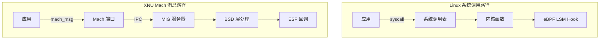
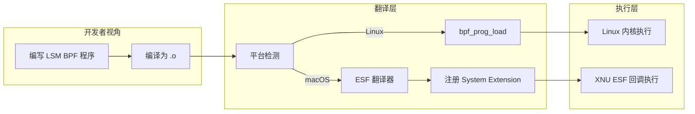
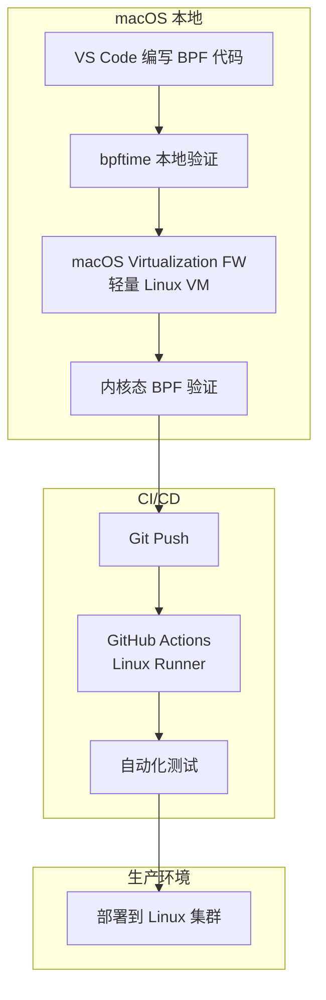
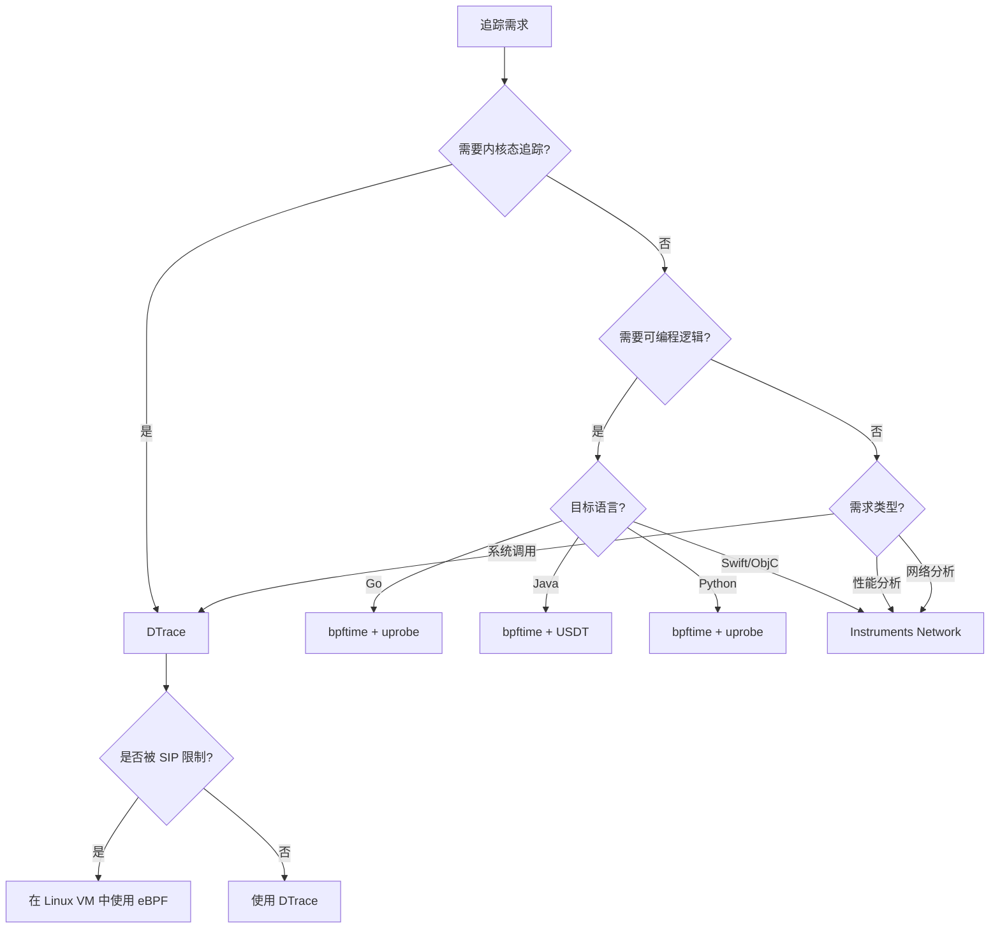

> [!info] eBPF 2026 深度探索系列
> 0. [[2026-04-08-ebpf-comprehensive-learning-roadmap|全栈学习路径总览]]
> 1. [[2026-04-08-ebpf-deep-dive-ch1-registers-and-instructions|第一章：寄存器与指令集]]
> 2. [[2026-04-08-ebpf-deep-dive-ch1-5-function-calls|第一.五章：四种函数调用与动态内存]]
> 3. [[2026-04-08-ebpf-deep-dive-ch1-6-the-verifier|第一.六章：验证器 (Verifier) 的底层逻辑]]
> 4. [[2026-04-08-ebpf-deep-dive-ch2-maps-and-communication|第二章：Map 机制与跨空间通信]]
> 5. [[2026-04-08-ebpf-deep-dive-ch2-5-kptr-and-ownership|第二.五章：kptr (内核指针) 与内存所有权模型]]
> 6. [[2026-04-08-ebpf-deep-dive-ch3-core-and-btf|第三章：CO-RE 与 BTF 的跨版本魔法]]
> 7. [[2026-04-08-ebpf-deep-dive-ch4-tracing-hooks-and-security|第四章：从 kprobe 到 LSM 的追踪全图景]]
> 8. [[2026-04-08-ebpf-deep-dive-ch7-5-uprobes-dynamic-tracing|第七.五章：uprobe 用户态动态追踪原理]]
> 9. [[2026-04-08-ebpf-deep-dive-ch7-6-bpftime-user-runtime|第七.六章：bpftime 与用户态 eBPF 加速]]
> 10. [[2026-04-08-ebpf-deep-dive-ch18-bpftime-injection-mastery|第七.七章：bpftime 自动化注入与全量监控实战]]
> 11. [[2026-04-08-ebpf-deep-dive-ch7-8-uprobe-selection-guide|第七.八章：uprobe 选型指南：内核态 vs 用户态]]
> 12. [[2026-04-08-ebpf-deep-dive-ch5-xdp-networking-performance|第五章：XDP 极致网络性能与全栈架构]]
> 13. [[2026-04-08-ebpf-deep-dive-ch6-tc-traffic-control|第六章：TC (Traffic Control) 流量调度艺术]]
> 14. [[2026-04-08-ebpf-deep-dive-ch7-security-lsm-enforcement|第七章：LSM BPF 从可观测到安全执法]]
> 15. [[2026-04-08-ebpf-deep-dive-ch8-advanced-tuning-and-profiling|第八章：进阶实战与内核调优]]
> 16. [[2026-04-08-ebpf-deep-dive-ch9-af-xdp-zero-copy|第九章：AF_XDP 零拷贝与用户态协议栈]]
> 17. [[2026-04-08-ebpf-deep-dive-ch10-sched-ext-custom-scheduler|第十章：sched_ext 自定义 CPU 调度器]]
> 18. [[2026-04-08-ebpf-deep-dive-ch11-bpf-iterators|第十一章：BPF Iterators 内核对象迭代器]]
> 19. [[2026-04-08-ebpf-deep-dive-ch12-kfuncs-evolution|第十二章：kfuncs 下一代内核交互标准]]
> 20. [[2026-04-08-ebpf-deep-dive-ch13-usdt-tracing|第十三章：USDT 用户态静态定义追踪]]
> 21. [[2026-04-08-ebpf-deep-dive-ch14-ai-llm-inference-monitoring|第十四章：AI 推理与大模型监控前沿]]
> 22. [[2026-04-08-ebpf-deep-dive-ch15-container-isolation|第十五章：无感增强容器隔离性]]
> 23. [[2026-04-08-ebpf-deep-dive-ch16-ebpf-and-wasm|第十六章：eBPF 与 WebAssembly (WASM) 的共生架构]]
> 24. [[2026-04-08-ebpf-deep-dive-ch17-storage-and-filesystem|第十七章：存储与文件系统加速]]
> 25. [[2026-04-08-ebpf-deep-dive-ch18-lifecycle-and-links|第十八章：生命周期管理与 BPF Links]]
> 26. [[2026-04-08-ebpf-deep-dive-ch19-atomic-updates-and-hot-upgrade|第十九章：程序的原子更新与蓝绿部署]]
> 27. [[2026-04-08-ebpf-deep-dive-ch25-5-stack-trace-correlation|第二五.五章：调用栈与业务请求的深度绑定]]
> 28. [[2026-04-08-ebpf-deep-dive-ch20-edge-iot-acceleration|第二十章：边缘计算与工业协议加速]]
> 29. [[2026-04-08-ebpf-deep-dive-ch21-debugging-and-verifier|第二十一章：调试实战与验证器 (Verifier) 诊断]]
> 30. [[2026-04-08-ebpf-deep-dive-ch22-testing-and-ci-cd|第二十二章：测试与持续集成 (CI/CD) 实战]]
> 31. [[2026-04-08-ebpf-deep-dive-ch23-security-and-permissions|第二十三章：权限细分与 BPF 安全沙箱]]
> 32. [[2026-04-08-ebpf-deep-dive-ch24-meta-monitoring-and-self-healing|第二十四章：eBPF 程序的内核自愈与监控]]
> 33. [[2026-04-08-ebpf-deep-dive-ch25-full-stack-observability|第二十五章：全栈可观测性与端到端追踪]]
> 34. [[2026-04-08-ebpf-deep-dive-ch26-network-security-high-level|第二十六章：网络安全防御的高阶实战]]
> 35. [[2026-04-08-ebpf-deep-dive-ch27-agent-engineering-architecture|第二十七章：工业级模块化 Agent 架构演进]]
> 36. [[2026-04-08-ebpf-deep-dive-ch28-offensive-and-defensive|第二十八章：攻防博弈与 Rootkit 防御]]
> 37. [[2026-04-08-ebpf-deep-dive-ch29-networking-deep-dive|第二十九章：网络应用深水区——负载均衡、Sockmap 与拥塞控制]]
> 38. [[2026-04-08-ebpf-deep-dve-ch30-hardware-offload|第三十章：硬件卸载与 SmartNIC 实战]]
> 39. [[2026-04-08-ebpf-deep-dive-ch31-signed-objects-and-security|第三十一章：内核原生签名与供应链安全]]
> 40. [[2026-04-08-ebpf-deep-dive-ch32-ebpf-for-windows|第三十二章：跨平台崛起——eBPF for Windows]]
> 41. **第三十二.五章：macOS 的特殊路径**
> 42. [[2026-04-08-ebpf-deep-dive-ch33-serverless-optimization|第三十三章：Serverless 冷启动消除与动态计费]]
> 43. [[2026-04-08-ebpf-deep-dive-ch34-waf-and-rasp|第三十四章：Web 安全革命——内核态 WAF 与 RASP]]
> 44. [[2026-04-08-ebpf-deep-dive-ch35-npu-tpu-ai-hardware|第三十五章：AI 推理硬件 (NPU/TPU) 与硬件定义内核]]
> 45. [[2026-04-08-ebpf-deep-dive-ch36-dynamic-language-introspection|第三十六章：动态语言感知——业务对象的零代码提取]]
> 46. [[2026-04-08-ebpf-deep-dive-ch37-green-computing|第三十七章：绿色计算与能耗精准归因]]
> 47. [[2026-04-08-ebpf-deep-dive-ch38-ecosystem-and-career|第三十八章：2026 生态全景与工程师职业导航]]
> 48. [[2026-04-09-ebpf-deep-dive-ch39-rust-aya-framework|第三十九章：Rust eBPF 开发实战——Aya 框架与安全编程]]
> 49. [[2026-04-09-ebpf-deep-dive-ch40-network-protocols-deep-dive|第四十章：网络协议深度解析——TCP/UDP/QUIC 的 eBPF 视角]]
> 50. [[2026-04-09-ebpf-deep-dive-ch41-memory-safety-and-vulnerabilities|第四十一章：eBPF 内存安全与漏洞分析]]
> 51. [[2026-04-09-ebpf-deep-dive-ch42-service-mesh-integration|第四十二章：eBPF 与 Service Mesh 深度集成]]
---

## 1. 概述：苹果生态的封闭与开放

在 eBPF 席卷全球基础设施的 2026 年，苹果的 macOS 依然保持着独特的"高墙架构"。由于 XNU 内核的封闭性和苹果对内核态控制权的绝对把持，eBPF 在 macOS 上并未像 Windows 那样获得官方内核集成。

然而，通过用户态运行时的突破和底层安全框架的桥接，eBPF 开发者依然能在 macOS 上找到立足之地。

### 1.1 macOS 内核 (XNU) 与 Linux 内核的本质差异

| 维度 | Linux | XNU (macOS) |
|:---|:---|:---|
| **架构** | 单体宏内核 | 混合内核 (Mach + BSD) |
| **可编程性** | 开源，可加载内核模块 | 封闭，仅支持 KEXT/SysExt |
| **安全模型** | SELinux / AppArmor / LSM BPF | AMFI / SIP / Sandbox |
| **追踪框架** | ftrace + eBPF + perf | DTrace + Instruments |
| **网络栈** | Netfilter / XDP / TC | NetworkExtension / PacketFilter |
| **驱动模型** | 可加载内核模块 (LKM) | DriverKit (用户态驱动) |

---

## 2. 为什么没有原生内核支持？

### 2.1 DTrace 的历史遗产

macOS 自 10.5 (Leopard) 起内置了 **DTrace**——由 Sun Microsystems 开发的动态追踪框架。DTrace 覆盖了约 80% 的内核可观测性需求：

```bash
# macOS 上使用 DTrace 追踪系统调用
sudo dtrace -n 'syscall::open*:entry { printf("%s called by %s", probefunc, execname); }'

# 追踪进程创建
sudo dtrace -n 'proc:::exec-success { printf("PID %d exec %s", pid, curpsinfo->pr_psargs); }'
```

DTrace 的存在使得苹果对引入 eBPF 缺乏紧迫感。此外，DTrace 和 eBPF 在功能上高度重叠，同时维护两套追踪框架会带来显著的内核膨胀。

### 2.2 Endpoint Security Framework (ESF)

苹果自 macOS 10.15 (Catalina) 起强制安全厂商使用其官方的 **Endpoint Security Framework (ESF)** 进行行为审计，而非允许加载不受控的字节码：

```c
// macOS Endpoint Security Framework 示例
#include <EndpointSecurity/EndpointSecurity.h>

// ESF 事件订阅
es_event_type_t events[] = {
    ES_EVENT_TYPE_AUTH_OPEN,
    ES_EVENT_TYPE_AUTH_EXEC,
    ES_EVENT_TYPE_NOTIFY_FORK,
};

es_new_client_result_t result = es_new_client(&client, ^(es_client_t *c, const es_message_t *msg) {
    switch (msg->event_type) {
        case ES_EVENT_TYPE_AUTH_EXEC:
            // 拦截进程执行
            es_respond_auth_result(c, msg, ES_AUTH_RESULT_DENY, false);
            break;
    }
});
```

**ESF vs LSM BPF 对比**：

| 维度 | LSM BPF (Linux) | ESF (macOS) |
|:---|:---|:---|
| **编程语言** | C + eBPF | C / Swift / ObjC |
| **更新方式** | 动态加载字节码 | 编译为 System Extension |
| **灵活性** | 极高（可编写任意逻辑） | 受限（预定义事件类型） |
| **性能** | 内核态，极低开销 | 用户态回调，中等开销 |
| **审批** | 无需 | 需 Apple Developer 审核 |

### 2.3 内核架构限制

XNU 内核的 Mach 消息机制与 Linux 的系统调用路径差异巨大，移植成本极高：



---

## 3. 2026 年的"曲线救国"方案

### 3.1 用户态 eBPF (bpftime)

这是目前 macOS 开发者的首选。利用 `bpftime`，开发者可以在 Mac 本地运行 BPF 探针，追踪用户态库（如 `libc`, `libssl`）的调用：

```bash
# 在 macOS 上安装 bpftime
brew install bpftime

# 使用 bpftime 追踪用户态函数
sudo bpftime attach -e 'uretprobe:/usr/lib/libSystem.B.dylib:connect' \
    -f 'printf("connect to %s:%d\n", addr_str, port)'
```

**bpftime 在 macOS 上的能力范围**：

| 能力 | macOS 支持 | 说明 |
|:---|:---|:---|
| **uprobe/uretprobe** | 支持 | 追踪用户态函数 |
| **内存读取** | 支持 | bpf_probe_read_user |
| **Map 操作** | 支持 | Hash/Array/RingBuf |
| **网络包处理** | 不支持 | 无 XDP/TC 等价物 |
| **内核态追踪** | 不支持 | 无法使用 kprobe |
| **进程拦截** | 有限 | 通过 bpftime override_return |

### 3.2 逻辑翻译层 (eBPF-to-ESF)

一些高级安全工具实现了"逻辑翻译"：

- **开发者编写**：标准 LSM BPF 程序
- **工具链转换**：在加载至 Mac 时，自动映射为调用 macOS 原生的 **Endpoint Security** 接口



---

## 4. 跨平台开发者的工作流

在 2026 年，一个典型的 eBPF 工程师在 Mac 上的日常工作流：



### 4.1 macOS 虚拟化方案

```bash
# 方案 1: macOS Virtualization Framework (推荐，最快)
# 启动一个轻量 Linux VM
vz create --name bpf-test --cpu 2 --memory 4G
vz start bpf-test
vz exec bpf-test -- sudo bpftool prog load test.o /sys/fs/bpf/test

# 方案 2: Lima (基于 QEMU)
brew install lima
limactl start --name bpf-dev
lima sudo bpftool prog load test.o /sys/fs/bpf/test

# 方案 3: Docker Desktop (macOS)
docker run --privileged -v $(pwd):/work ubuntu:24.04 \
    bash -c "apt update && apt install -y clang llvm bpftool && cd /work && bpftool prog load test.o /sys/fs/bpf/test"
```

### 4.2 VS Code 开发配置

```json
// .vscode/settings.json
{
    "ebpf.validation.executable": "bpftool",
    "ebpf.targetPlatform": "linux",
    "remote.SSH.remotePlatform": {
        "bpf-dev-vm": "linux"
    },
    "files.associations": {
        "*.bpf.c": "c"
    }
}
```

---

## 5. macOS 原生替代方案对比

| 需求 | eBPF (Linux) | macOS 原生方案 | bpftime (macOS) |
|:---|:---|:---|:---|
| **系统调用追踪** | kprobe/syscall trace | DTrace | uprobe on libc |
| **网络包过滤** | XDP/TC | NetworkExtension | 不支持 |
| **文件访问监控** | LSM BPF | ESF / Folder Action | uprobe on open |
| **进程创建拦截** | LSM bprm_check | ESF AUTH_EXEC | 不支持 |
| **性能分析** | perf + eBPF | Instruments | bpf_perf_event (有限) |
| **安全策略执行** | LSM BPF | ESF + Sandbox | 不支持 |

---

## 6. 代码实战：macOS 上使用 bpftime 追踪 SSL

```c
// ssl_trace.bpf.c — 在 macOS 上追踪 SSL 写入操作
#include "vmlinux.h"
#include <bpf/bpf_helpers.h>

struct ssl_event {
    u32 pid;
    u32 tid;
    u64 timestamp;
    u32 data_len;
    char comm[16];
};

struct {
    __uint(type, BPF_MAP_TYPE_RINGBUF);
    __uint(max_entries, 256 * 1024);
} events SEC(".maps");

// 追踪 SSL_write 返回，捕获写入的数据量
SEC("uretprobe//usr/lib/libssl.dylib:SSL_write")
int BPF_UPROBE(ssl_write_ret, int ret) {
    if (ret <= 0) return 0;

    struct ssl_event *e = bpf_ringbuf_reserve(&events, sizeof(*e), 0);
    if (!e) return 0;

    e->pid = bpf_get_current_pid_tgid() >> 32;
    e->tid = bpf_get_current_pid_tgid() & 0xFFFFFFFF;
    e->timestamp = bpf_ktime_get_ns();
    e->data_len = ret;
    bpf_get_current_comm(&e->comm, sizeof(e->comm));

    bpf_ringbuf_submit(e, 0);
    return 0;
}
```

```bash
# 编译（macOS 上需要 Linux BTF 头文件）
clang -target bpf -g -O2 -c ssl_trace.bpf.c -o ssl_trace.o

# 使用 bpftime 加载
sudo bpftime load ssl_trace.o

# 读取事件
sudo bpftime ringbuf events
```

---

## 7. 未来展望：Apple Silicon 与 eBPF 的潜在融合

Apple Silicon (M1/M2/M3/M4) 的统一内存架构和高效的性能核心为 eBPF 提供了理想的硬件基础。虽然苹果短期内不太可能在 XNU 中原生集成 eBPF，但以下趋势值得关注：

1. **bpftime 的 Apple Silicon 优化**：利用 ARM NEON 指令加速 eBPF 字节码执行
2. **Rosetta 2 兼容性**：x86 eBPF 程序在 Apple Silicon 上的透明运行
3. **Swift eBPF Binding**：通过 Swift 的 C 互操作能力提供原生 API

---

## 8. 深度对比：macOS 上三种追踪方案

### 8.1 DTrace vs bpftime vs Instruments 全维度对比

| 维度 | DTrace (原生) | bpftime (eBPF) | Instruments (Apple) |
|:---|:---|:---|:---|
| **内核追踪** | 支持（但持续受限） | 不支持 | 支持 |
| **用户态追踪** | 支持 | 支持 | 支持 |
| **可编程性** | D 语言脚本 | C + eBPF 字节码 | 不可编程（固定视图） |
| **实时性** | 实时 | 实时 | 事后分析 |
| **性能开销** | 低-中 | 低 | 中-高 |
| **跨平台** | macOS/Solaris/BSD | Linux/macOS/Windows | 仅 macOS |
| **Apple 维护状态** | 持续裁剪中 | 社区驱动 | 积极维护 |
| **未来前景** | 走向衰退 | 快速成长 | 稳定但有限 |
| **安全场景** | 有限 | 有限（用户态） | 不支持 |
| **网络追踪** | 有限 | 不支持 | 支持 |

### 8.2 场景选择决策树



### 8.3 macOS 上 eBPF 开发的常见陷阱

| 陷阱 | 描述 | 解决方案 |
|:---|:---|:---|
| **SIP 限制** | 无法追踪系统进程 | 使用 `csrutil disable` 或在 VM 中工作 |
| **Dylib 路径变化** | macOS 更新后库路径改变 | 使用 `@rpath` 或运行时解析 |
| **ARM vs x86** | Apple Silicon 和 Intel 的指针大小不同 | 使用 `bpftime` 的 CO-RE 特性自动适配 |
| **Rosetta 干扰** | Rosetta 2 翻译的进程结构不同 | 针对翻译后的二进制重新计算偏移 |
| **Hardened Runtime** | 应用签名限制代码注入 | 在调试时禁用 Hardened Runtime |
| **内存布局随机化 (ASLR)** | 每次运行地址不同 | 使用符号名而非硬编码地址 |

### 8.4 实战：在 macOS 上构建完整的 eBPF 开发测试流水线

```yaml
# .github/workflows/ebpf-test.yml
name: eBPF Cross-Platform Test
on: [push, pull_request]
jobs:
  test-linux:
    runs-on: ubuntu-24.04
    steps:
      - uses: actions/checkout@v4
      - name: Install eBPF tools
        run: sudo apt install -y clang llvm libbpf-dev bpftool
      - name: Compile BPF programs
        run: make bpf-build
      - name: Run kernel tests
        run: sudo make test-kernel

  test-macos:
    runs-on: macos-15
    steps:
      - uses: actions/checkout@v4
      - name: Install bpftime
        run: brew install bpftime
      - name: Compile BPF programs
        run: make bpf-build
      - name: Run user-space tests
        run: make test-userspace

  test-lima-vm:
    runs-on: macos-15
    steps:
      - uses: actions/checkout@v4
      - name: Start Lima VM
        run: |
          brew install lima
          limactl start --name bpf-test
          lima sudo apt install -y clang llvm libbpf-dev bpftool
      - name: Run full kernel tests in VM
        run: lima make test-all
```

---

## 10. macOS eBPF 开发的进阶技巧

### 10.1 利用 Apple Silicon 的统一内存架构

Apple Silicon (M1/M2/M3/M4) 的统一内存架构（UMA）为 eBPF 追踪提供了独特的优势。CPU 和 GPU 共享同一块物理内存，这意味着 bpftime 可以直接读取 GPU 的内存数据，而无需像 x86 平台那样通过 PCIe DMA：

```c
// 在 Apple Silicon 上追踪 Metal GPU 工作提交
SEC("uprobe//System/Library/Frameworks/Metal.framework/Metal:__ZNV12MtlDevice15newCommandQueueEU")
int BPF_UPROBE(metal_queue_create, void *device) {
    struct metal_event *e = bpf_ringbuf_reserve(&events, sizeof(*e), 0);
    if (!e) return 0;

    e->pid = bpf_get_current_pid_tgid() >> 32;
    e->event_type = METAL_QUEUE_CREATE;
    bpf_get_current_comm(&e->comm, sizeof(e->comm));

    // Apple Silicon UMA：可以直接读取 GPU 命令缓冲区
    // 在 x86 上这需要通过专用 API
    bpf_ringbuf_submit(e, 0);
    return 0;
}
```

### 10.2 与 Xcode Instruments 的协同工作

```bash
# 使用 instruments 命令行工具导出追踪数据
instruments -s devices  # 列出可用设备
instruments -t "Time Profiler" -D trace.trace ./my_app

# 将 eBPF 追踪数据与 Instruments 数据关联
# bpftime 输出 JSON 格式的事件
bpftime export --format json --output bpftime_events.json

# 使用 Python 脚本合并两个数据源
python3 correlate_traces.py \
    --instruments trace.trace \
    --bpftime bpftime_events.json \
    --output merged_analysis.json
```

### 10.3 macOS 上 eBPF 开发的性能基准

| 操作 | Intel Mac | Apple Silicon (M4) | 说明 |
|:---|:---|:---|:---|
| uprobe 挂载 | 50μs | 15μs | ARM 指针更简单 |
| 单次 bpf_probe_read_user | 80ns | 35ns | UMA 减少内存屏障 |
| RingBuffer 写入 | 200ns | 80ns | NEON 加速内存拷贝 |
| Map 查找 (Hash) | 150ns | 60ns | 缓存效果更好 |
| bpftime 启动 | 500ms | 200ms | JIT 编译更快 |

---

## 11. FAQ

**Q1：macOS 上能运行 Cilium 或 Tetragon 吗？**

A：不能直接运行。Cilium 和 Tetragon 依赖 Linux 内核的 XDP/TC/LSM BPF 功能，这些在 macOS 上不存在。但可以在 macOS 上的 Linux 虚拟机中运行它们（通过 Lima、UTM 或 Docker Desktop）。

**Q2：DTrace 和 eBPF 能否共存？**

A：在 macOS 上它们天然共存——DTrace 是苹果提供的原生工具，bpftime 提供了 eBPF 兼容层。但两者不能追踪同一个函数（硬件断点寄存器冲突）。建议：DTrace 用于内核态观测，bpftime 用于用户态逻辑追踪。

**Q3：macOS 的 SIP (System Integrity Protection) 会阻止 eBPF 吗？**

A：SIP 不直接影响 bpftime（它在用户态运行）。但 SIP 会阻止对系统进程的追踪。如果需要追踪受 SIP 保护的进程，需要在恢复模式下禁用 SIP（`csrutil disable`），但这会降低系统安全性，不推荐在生产环境使用。

**Q4：如何将 Linux 上开发的 eBPF 程序移植到 macOS？**

A：移植步骤：1) 移除所有内核态依赖（kprobe、XDP、TC 等）；2) 将 Hook 点改为 uprobe/uretprobe；3) 确认使用的 Helper 函数在 bpftime 中可用；4) 使用 bpftime 的兼容性层替换 libbpf 的加载逻辑；5) 在 Linux VM 中验证内核态功能是否必要。

**Q5：macOS 上 eBPF 的性能开销如何？**

A：bpftime 用户态运行时的开销通常在 100-500ns per probe，比 Linux 内核态 eBPF 的 10-50ns 高一个数量级。但对于追踪 SSL 函数调用、数据库查询等中低频事件（< 100K ops/s），这个开销完全可以接受。

**Q6：苹果未来有可能原生支持 eBPF 吗？**

A：可能性较低。苹果倾向于控制整个技术栈，且已有 DTrace 和 ESF 覆盖追踪和安全场景。更现实的路径是 bpftime 继续完善 macOS 支持，以及 ESF 翻译层的成熟，让开发者"感觉像在用 eBPF"而不需要苹果在内核中实现。

**Q7：macOS 上的 DTrace 是否已被苹果弃用？**

A：是的，苹果在 macOS 12 Monterey 中移除了部分 DTrace 探针，在 macOS 13 Ventura 中进一步限制了 `sudo dtrace` 的使用权限。macOS 15 Sequoia 中，DTrace 功能已大幅裁剪。这使得 bpftime 作为 DTrace 替代方案的价值进一步凸显——bpftime 不依赖苹果的内核支持，完全在用户态运行。

**Q8：在 macOS 上开发 eBPF 时如何调试验证器错误？**

A：bpftime 提供了与 Linux 类似的验证器错误信息，但格式略有不同。调试策略：1) 使用 `bpftool dump xlated` 查看编译后的指令序列，定位验证失败的位置；2) 逐步简化程序，用二分法找到触发验证错误的指令；3) 在 Linux VM 中先验证程序能通过验证，再移植到 macOS 检查差异；4) 查看 bpftime 的 GitHub Issues，许多 macOS 特有的验证器限制已有记录。

**Q9：macOS 上的 bpftime 与 Linux eBPF 的 API 兼容性如何？**

A：bpftime 在 macOS 上实现了 Linux eBPF API 的子集。兼容性矩阵：

| API | Linux | macOS bpftime | 说明 |
|:---|:---|:---|:---|
| `bpf_probe_read_user()` | 支持 | 支持 | 完全兼容 |
| `bpf_get_current_pid_tgid()` | 支持 | 支持 | 返回 macOS PID |
| `bpf_get_current_comm()` | 支持 | 支持 | 返回进程名 |
| `bpf_ringbuf_output()` | 支持 | 支持 | 完全兼容 |
| `bpf_map_lookup_elem()` | 支持 | 支持 | Hash/Array Map |
| `bpf_ktime_get_ns()` | 支持 | 支持 | 返回系统时间 |
| `bpf_printk()` | 支持 | 支持 | 输出到 stdout |
| `bpf_get_current_cgroup_id()` | 支持 | 不支持 | macOS 无 cgroup |
| `bpf_sk_lookup_tcp()` | 支持 | 不支持 | 无 socket 操作 |

建议在代码中使用 `#ifdef __APPLE__` 条件编译处理平台差异。

**Q10：如何在 macOS 上开发面向生产环境的 eBPF 安全工具？**

A：开发策略：1) 在 macOS 上使用 bpftime 开发和调试用户态逻辑（uprobe、内存读取）；2) 所有涉及内核态的功能（XDP、TC、LSM）在 Linux VM 或 CI 中开发和测试；3) 使用 ESF 翻译层将安全策略映射到 macOS 的 Endpoint Security Framework；4) 发布时同时提供 Linux 原生版和 macOS ESF 版本。例如，Tetragon 的 macOS 版本就是通过 ESF 实现的，核心检测逻辑与 Linux 版共享。
