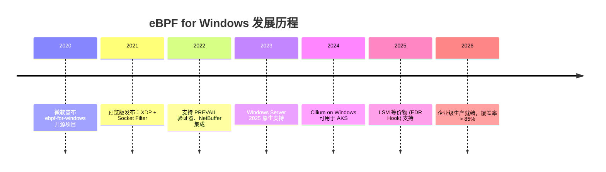
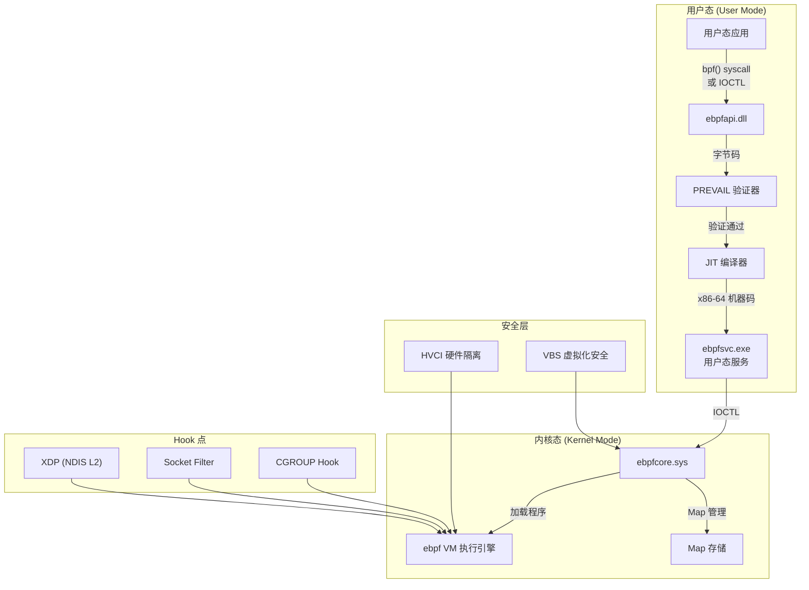
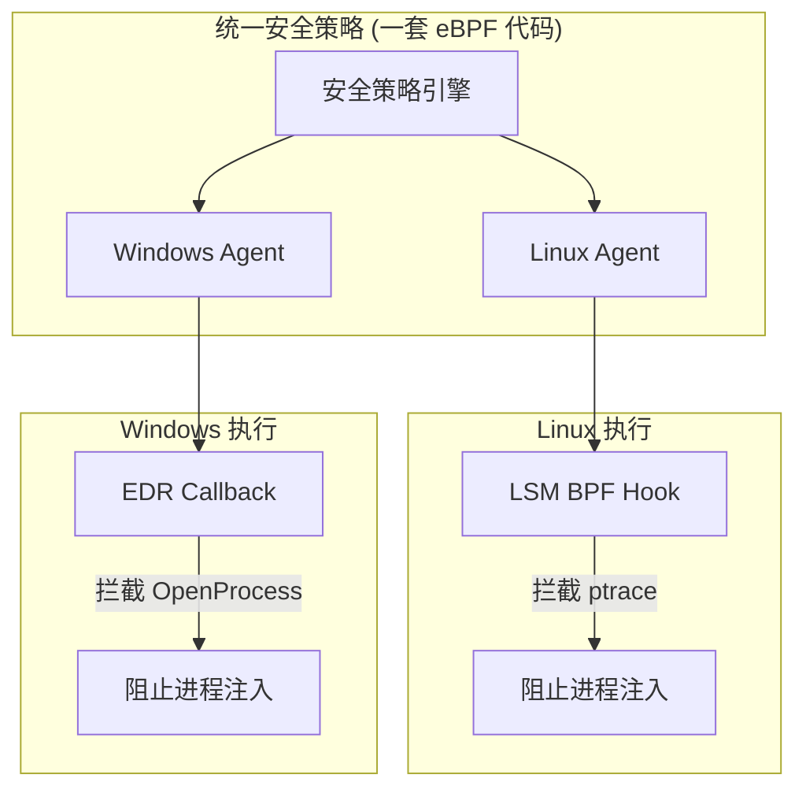

> [!info] eBPF 2026 深度探索系列 0. [[2026-04-08-ebpf-comprehensive-learning-roadmap|全栈学习路径总览]]
>
> 1. [[2026-04-08-ebpf-deep-dive-ch1-registers-and-instructions|第一章：寄存器与指令集]]
> 2. [[2026-04-08-ebpf-deep-dive-ch1-5-function-calls|第一.五章：四种函数调用与动态内存]]
> 3. [[2026-04-08-ebpf-deep-dive-ch1-6-the-verifier|第一.六章：验证器 (Verifier) 的底层逻辑]]
> 4. [[2026-04-08-ebpf-deep-dive-ch2-maps-and-communication|第二章：Map 机制与跨空间通信]]
> 5. [[2026-04-08-ebpf-deep-dive-ch2-5-kptr-and-ownership|第二.五章：kptr (内核指针) 与内存所有权模型]]
> 6. [[2026-04-08-ebpf-deep-dive-ch3-core-and-btf|第三章：CO-RE 与 BTF 的跨版本魔法]]
> 7. [[2026-04-08-ebpf-deep-dive-ch4-tracing-hooks-and-security|第四章：从 kprobe 到 LSM 的追踪全图景]]
> 8. [[2026-04-08-ebpf-deep-dive-ch7-5-uprobes-dynamic-tracing|第七.五章：uprobe 用户态动态追踪原理]]
> 9. [[2026-04-08-ebpf-deep-dive-ch7-6-bpftime-user-runtime|第七.六章：bpftime 与用户态 eBPF 加速]]
> 10. [[2026-04-08-ebpf-deep-dive-ch18-bpftime-injection-mastery|第七.七章：bpftime 自动化注入与全量监控实战]]
> 11. [[2026-04-08-ebpf-deep-dive-ch7-8-uprobe-selection-guide|第七.八章：uprobe 选型指南：内核态 vs 用户态]]
> 12. [[2026-04-08-ebpf-deep-dive-ch5-xdp-networking-performance|第五章：XDP 极致网络性能与全栈架构]]
> 13. [[2026-04-08-ebpf-deep-dive-ch6-tc-traffic-control|第六章：TC (Traffic Control) 流量调度艺术]]
> 14. [[2026-04-08-ebpf-deep-dive-ch7-security-lsm-enforcement|第七章：LSM BPF 从可观测到安全执法]]
> 15. [[2026-04-08-ebpf-deep-dive-ch8-advanced-tuning-and-profiling|第八章：进阶实战与内核调优]]
> 16. [[2026-04-08-ebpf-deep-dive-ch9-af-xdp-zero-copy|第九章：AF_XDP 零拷贝与用户态协议栈]]
> 17. [[2026-04-08-ebpf-deep-dive-ch10-sched-ext-custom-scheduler|第十章：sched_ext 自定义 CPU 调度器]]
> 18. [[2026-04-08-ebpf-deep-dive-ch11-bpf-iterators|第十一章：BPF Iterators 内核对象迭代器]]
> 19. [[2026-04-08-ebpf-deep-dive-ch12-kfuncs-evolution|第十二章：kfuncs 下一代内核交互标准]]
> 20. [[2026-04-08-ebpf-deep-dive-ch13-usdt-tracing|第十三章：USDT 用户态静态定义追踪]]
> 21. [[2026-04-08-ebpf-deep-dive-ch14-ai-llm-inference-monitoring|第十四章：AI 推理与大模型监控前沿]]
> 22. [[2026-04-08-ebpf-deep-dive-ch15-container-isolation|第十五章：无感增强容器隔离性]]
> 23. [[2026-04-08-ebpf-deep-dive-ch16-ebpf-and-wasm|第十六章：eBPF 与 WebAssembly (WASM) 的共生架构]]
> 24. [[2026-04-08-ebpf-deep-dive-ch17-storage-and-filesystem|第十七章：存储与文件系统加速]]
> 25. [[2026-04-08-ebpf-deep-dive-ch18-lifecycle-and-links|第十八章：生命周期管理与 BPF Links]]
> 26. [[2026-04-08-ebpf-deep-dive-ch19-atomic-updates-and-hot-upgrade|第十九章：程序的原子更新与蓝绿部署]]
> 27. [[2026-04-08-ebpf-deep-dive-ch25-5-stack-trace-correlation|第二五.五章：调用栈与业务请求的深度绑定]]
> 28. [[2026-04-08-ebpf-deep-dive-ch20-edge-iot-acceleration|第二十章：边缘计算与工业协议加速]]
> 29. [[2026-04-08-ebpf-deep-dive-ch21-debugging-and-verifier|第二十一章：调试实战与验证器 (Verifier) 诊断]]
> 30. [[2026-04-08-ebpf-deep-dive-ch22-testing-and-ci-cd|第二十二章：测试与持续集成 (CI/CD) 实战]]
> 31. [[2026-04-08-ebpf-deep-dive-ch23-security-and-permissions|第二十三章：权限细分与 BPF 安全沙箱]]
> 32. [[2026-04-08-ebpf-deep-dive-ch24-meta-monitoring-and-self-healing|第二十四章：eBPF 程序的内核自愈与监控]]
> 33. [[2026-04-08-ebpf-deep-dive-ch25-full-stack-observability|第二十五章：全栈可观测性与端到端追踪]]
> 34. [[2026-04-08-ebpf-deep-dive-ch26-network-security-high-level|第二十六章：网络安全防御的高阶实战]]
> 35. [[2026-04-08-ebpf-deep-dive-ch27-agent-engineering-architecture|第二十七章：工业级模块化 Agent 架构演进]]
> 36. [[2026-04-08-ebpf-deep-dive-ch28-offensive-and-defensive|第二十八章：攻防博弈与 Rootkit 防御]]
> 37. [[2026-04-08-ebpf-deep-dive-ch29-networking-deep-dive|第二十九章：网络应用深水区——负载均衡、Sockmap 与拥塞控制]]
> 38. [[2026-04-08-ebpf-deep-dive-ch30-hardware-offload|第三十章：硬件卸载与 SmartNIC 实战]]
> 39. [[2026-04-08-ebpf-deep-dive-ch31-signed-objects-and-security|第三十一章：内核原生签名与供应链安全]]
> 40. **第三十二章：跨平台崛起——eBPF for Windows**
> 41. [[2026-04-08-ebpf-deep-dive-ch32-5-macos-status|第三十二.五章：macOS 的特殊路径]]
> 42. [[2026-04-08-ebpf-deep-dive-ch33-serverless-optimization|第三十三章：Serverless 冷启动消除与动态计费]]
> 43. [[2026-04-08-ebpf-deep-dive-ch34-waf-and-rasp|第三十四章：Web 安全革命——内核态 WAF 与 RASP]]
> 44. [[2026-04-08-ebpf-deep-dive-ch35-npu-tpu-ai-hardware|第三十五章：AI 推理硬件 (NPU/TPU) 与硬件定义内核]]
> 45. [[2026-04-08-ebpf-deep-dive-ch36-dynamic-language-introspection|第三十六章：动态语言感知——业务对象的零代码提取]]
> 46. [[2026-04-08-ebpf-deep-dive-ch37-green-computing|第三十七章：绿色计算与能耗精准归因]]
> 47. [[2026-04-08-ebpf-deep-dive-ch38-ecosystem-and-career|第三十八章：2026 生态全景与工程师职业导航]]
> 48. [[2026-04-09-ebpf-deep-dive-ch39-rust-aya-framework|第三十九章：Rust eBPF 开发实战——Aya 框架与安全编程]]
> 49. [[2026-04-09-ebpf-deep-dive-ch40-network-protocols-deep-dive|第四十章：网络协议深度解析——TCP/UDP/QUIC 的 eBPF 视角]]
> 50. [[2026-04-09-ebpf-deep-dive-ch41-memory-safety-and-vulnerabilities|第四十一章：eBPF 内存安全与漏洞分析]]
> 51. [[2026-04-09-ebpf-deep-dive-ch42-service-mesh-integration|第四十二章：eBPF 与 Service Mesh 深度集成]]

---

## 1. 概述：打破 Linux 的疆界

在 eBPF 诞生的第一个十年，它是 Linux 内核的"独门绝技"。然而在 2026 年，eBPF 正式成为了横跨 Linux 与 Windows 的**通用内核编程标准**。

借助微软主导的 **ebpf-for-windows** 项目，开发者可以使用熟悉的 `libbpf` API 和同样的 eBPF 字节码，在 Windows Server 乃至普通 Windows 办公终端上实现高性能的网络过滤、安全监控和系统自省。

### 1.1 项目历史与里程碑



---

## 2. Windows eBPF 核心架构

微软并不仅是做了一层简单的模拟，而是针对 Windows 架构设计了两层安全运行环境：

### 2.1 整体架构图



### 2.2 用户态组件 (User-mode API)

- **验证器 (Verifier)**：基于 PREVAIL 验证器，在用户态完成对字节码的安全扫描
- **JIT 编译器**：将校验通过的字节码编译为原生机器码
- **ebpfapi.dll**：提供与 Linux `libbpf` 兼容的 API 接口

### 2.3 内核态运行时 (Kernel-mode Runtime)

- **ebpfcore.sys**：Windows 内核模式驱动，负责管理 BPF 程序、Maps 的生命周期
- **HVCI 增强**：利用 **Hypervisor-Enforced Code Integrity** 硬件特性，确保 BPF 生成的机器码运行在完全隔离且不可篡改的内存区域中

---

## 3. 跨平台开发的"同"与"异"

### 3.1 详细对比表

| 特性           | Linux eBPF                   | Windows eBPF                            |
| :------------- | :--------------------------- | :-------------------------------------- |
| **指令集**     | 64 位 eBPF 指令              | 64 位 eBPF 指令                         |
| **Map 类型**   | 全量支持 (30+ 种)            | 核心支持 (Hash, Array, RingBuf, PerCPU) |
| **网络上下文** | `struct __sk_buff`           | `NET_BUFFER_LIST` (封装后)              |
| **Hook 点**    | XDP, TC, LSM, kprobe, uprobe | XDP (基于 NDIS), Socket, CGROUP         |
| **权限模型**   | CAP_BPF / Root               | Administrator / 系统服务权限            |
| **验证器**     | Linux 内核验证器             | PREVAIL 验证器                          |
| **安全隔离**   | BPF 沙箱                     | HVCI + VBS 双重隔离                     |
| **包结构**     | `sk_buff`                    | `NET_BUFFER_LIST` → `NBL`               |
| **程序类型**   | 15+ 种                       | XDP, Socket, CGROUP, 等约 8 种          |

### 3.2 数据结构映射

Windows 网络栈使用 `NET_BUFFER_LIST (NBL)` 而非 Linux 的 `sk_buff`。eBPF for Windows 提供了透明映射层：

```c
// Linux eBPF 代码（跨平台）
SEC("xdp")
int bpf_main(struct xdp_md *ctx) {
    void *data = (void *)(long)ctx->data;
    void *data_end = (void *)(long)ctx->data_end;

    // 在 Linux 上：data 指向 sk_buff->data
    // 在 Windows 上：data 指向 NBL 的第一个 NET_BUFFER
    // ebpf-for-windows 的适配层自动处理差异
    struct ethhdr *eth = data;
    if ((void *)(eth + 1) > data_end) return XDP_PASS;

    if (eth->h_proto != bpf_htons(ETH_P_IP)) return XDP_PASS;
    return XDP_PASS;
}
```

---

## 4. 2026 年核心实战场景

### 4.1 统一终端防御 (XDR)

对于企业安全团队，Windows eBPF 的最大价值在于**逻辑统一**：



- **场景**：拦截非法的跨进程注入（如 `ptrace` 在 Linux，或 `OpenProcess` 在 Windows）
- **实现**：编写一套 eBPF 策略逻辑，通过抽象层屏蔽底层 OS 差异
- **价值**：极大降低了在异构机房（Linux 服务器 + Windows 工作站）中维护安全策略的成本

### 4.2 容器网络加速 (AKS)

Azure Kubernetes Service (AKS) 在 Windows 节点上使用 eBPF 实现：

- **CNI 网络策略**：替代传统的 SDN ACL，实现容器级微分段
- **服务网格代理**：类似 Cilium 在 Linux 上的能力，实现透明负载均衡
- **可观测性**：统一的网络指标采集，兼容 Prometheus 格式

---

## 5. 代码实战：跨平台网络过滤

### 5.1 编写跨平台中性逻辑

```c
#include <ebpf/api.h>  // 跨平台头文件

// 定义待过滤的 IP 黑名单
struct {
    __uint(type, BPF_MAP_TYPE_HASH);
    __uint(max_entries, 1024);
    __type(key, u32);    // IPv4 地址
    __type(value, u32);  // 标志位
} ip_blacklist SEC(".maps");

SEC("xdp")
int bpf_main(struct xdp_md *ctx) {
    void *data = (void *)(long)ctx->data;
    void *data_end = (void *)(long)ctx->data_end;

    struct ethhdr *eth = data;
    if ((void *)(eth + 1) > data_end) return XDP_PASS;

    if (eth->h_proto != bpf_htons(ETH_P_IP)) return XDP_PASS;

    struct iphdr *iph = (void *)(eth + 1);
    if ((void *)(iph + 1) > data_end) return XDP_PASS;

    u32 src_ip = iph->saddr;
    u32 *blocked = bpf_map_lookup_elem(&ip_blacklist, &src_ip);

    if (blocked) {
        return XDP_DROP;
    }

    return XDP_PASS;
}
```

### 5.2 Windows 侧的加载与管理

```powershell
# 安装 ebpf-for-windows（Windows Server 2025+ 已内置）
# Install-Module ebpf -Force

# 编译 eBPF 程序
ebpfctl compile -target bpfel -output filter.o filter.c

# 加载程序
ebpfctl load filter.o

# 查看 loaded 程序
ebpfctl list

# 添加黑名单 IP
ebpfctl map update ip_blacklist key 0xC0A80001 value 1

# 卸载程序
ebpfctl unload filter.o
```

### 5.3 用户态管理程序 (C++)

```cpp
#include <ebpf_api.h>

int main() {
    // 1. 加载 eBPF 程序
    ebpf_result_t result;
    ebpf_program_t *program;
    fd_t program_fd;

    result = ebpf_program_load("filter.o", "xdp",
                               BPF_PROG_TYPE_XDP, nullptr,
                               &program, &program_fd);
    if (result != EBPF_SUCCESS) {
        printf("Failed to load: %d\n", result);
        return 1;
    }

    // 2. 获取 Map 文件描述符
    fd_t map_fd = ebpf_object_get_map_fd(program, "ip_blacklist");

    // 3. 更新黑名单
    uint32_t block_ip = htonl(inet_addr("192.168.0.100"));
    uint32_t flag = 1;
    bpf_map_update_elem(map_fd, &block_ip, &flag, BPF_ANY);

    printf("Program loaded and attached.\n");

    // 4. 清理
    ebpf_program_close(program);
    return 0;
}
```

---

## 6. PREVAIL 验证器的特殊之处

Windows 使用 **PREVAIL** 验证器而非 Linux 的内核验证器。两者的设计哲学不同：

| 维度         | Linux 内核验证器     | PREVAIL 验证器                     |
| :----------- | :------------------- | :--------------------------------- |
| **运行位置** | 内核态               | 用户态                             |
| **验证方法** | 模拟执行 + 路径枚举  | 抽象解释 (Abstract Interpretation) |
| **确定性**   | 必须证明所有路径安全 | 证明抽象域上的安全性               |
| **性能**     | 可能成为瓶颈         | 通常更快                           |
| **限制性**   | 更严格               | 略宽松（允许更多模式）             |

PREVAIL 使用**抽象解释**技术，通过计算程序的"抽象状态"来验证安全性，而非枚举每一条可能的执行路径。这使得它在处理复杂控制流时比 Linux 验证器更高效。

---

## 7. 部署最佳实践

### 7.1 企业环境部署清单

```powershell
# 1. 检查系统要求
$osInfo = Get-CimInstance Win32_OperatingSystem
Write-Host "OS: $($osInfo.Caption) $($osInfo.Version)"
# 要求: Windows Server 2025+ 或 Windows 11 24H2+

# 2. 检查 HVCI 状态（推荐开启）
Confirm-SecureBootUEFI
Get-CimInstance -ClassName Win32_DeviceGuard -Namespace root\Microsoft\Windows\DeviceGuard

# 3. 安装 eBPF 运行时
Install-PackageProvider NuGet -Force
Install-Module -Name ebpf -Force -AllowClobber

# 4. 启用 eBPF 服务
Set-Service -Name ebpfsvc -StartupType Automatic
Start-Service ebpfsvc

# 5. 验证安装
ebpfctl version
ebpfctl list
```

### 7.2 性能基准

| 场景            | Linux (XDP) | Windows (XDP via NDIS) | 差异原因      |
| :-------------- | :---------- | :--------------------- | :------------ |
| 简单 ACL 过滤   | 12Mpps/core | 8Mpps/core             | NDIS 路径开销 |
| L3/L4 负载均衡  | 10Mpps/core | 7Mpps/core             | NBL 封装层    |
| Map 查找 + 统计 | 9Mpps/core  | 6Mpps/core             | Map 实现差异  |

## 9. 与 Linux 互通性实战指南

### 9.1 统一代码库的目录结构

```
ebpf-cross-platform/
├── common/              # 平台无关的 BPF 代码
│   ├── types.h           # 共享数据结构
│   ├── helpers.h         # 平台兼容的 Helper 包装
│   └── maps.h            # 共享 Map 定义
├── linux/                # Linux 特定代码
│   └── btf_types.h
├── windows/              # Windows 特定代码
│   └── nbl_adapter.h
├── Makefile
└── cross_compile.sh
```

### 9.2 跨平台构建脚本

```bash
#!/bin/bash
# cross_compile.sh
TARGET=$1  # "linux" or "windows"
CLANG_FLAGS="-target bpf -g -O2 -D__${TARGET}__"

for src in common/*.c; do
    clang $CLANG_FLAGS -c "$src" -o "build/$(basename ${src%.c}.o)"
done
echo "Compiled for $TARGET: $(ls build/*.o)"
```

---

## 8. 与 Linux 互通性实战指南

### 8.1 统一代码库架构

跨平台 eBPF 项目推荐以下目录结构：

```
cross-platform-ebpf/
├── bpf/                          # 平台共享的 BPF 程序
│   ├── common/
│   │   ├── types.h              # 通用数据结构定义
│   │   ├── helpers.h            # 跨平台 Helper 封装
│   │   └── maps.h               # 通用 Map 定义
│   ├── network/
│   │   ├── firewall.bpf.c       # XDP 防火墙 (两端通用)
│   │   └── dns_filter.bpf.c     # DNS 过滤
│   └── observability/
│       ├── process_trace.bpf.c  # 进程追踪
│       └── network_stats.bpf.c  # 网络统计
├── cmd/
│   ├── linux-loader/            # Linux 加载器 (libbpf)
│   └── windows-loader/          # Windows 加载器 (ebpfapi)
├── pkg/
│   ├── platform/                # 平台抽象层
│   │   ├── linux.go
│   │   └── windows.go
│   └── shared/                  # 共享业务逻辑
├── Makefile                     # 跨平台编译
├── cross-compile.sh             # 交叉编译脚本
└── go.mod
```

### 8.2 跨平台编译与测试

```bash
#!/bin/bash
# cross-compile.sh — 跨平台 eBPF 编译脚本

set -e

# 编译 eBPF 字节码（平台无关，只需编译一次）
echo "=== Compiling eBPF programs ==="
clang -target bpf -g -O2 \
    -I bpf/common \
    -c bpf/network/firewall.bpf.c \
    -o build/firewall.bpf.o

clang -target bpf -g -O2 \
    -I bpf/common \
    -c bpf/observability/network_stats.bpf.c \
    -o build/network_stats.bpf.o

echo "=== Building Linux loader ==="
cd cmd/linux-loader && GOOS=linux go build -o ../../build/linux-loader && cd ../..

echo "=== Building Windows loader ==="
cd cmd/windows-loader && GOOS=windows go build -o ../../build/windows-loader.exe && cd ../..

echo "=== Running Linux tests ==="
sudo ./build/linux-loader --test --duration 10s

echo "=== Build complete ==="
echo "Linux:   build/linux-loader + build/firewall.bpf.o"
echo "Windows: build/windows-loader.exe + build/firewall.bpf.o"
```

### 8.3 平台差异处理策略

| 差异点          | Linux                      | Windows                    | 处理方式            |
| :-------------- | :------------------------- | :------------------------- | :------------------ |
| **程序类型**    | XDP (native)               | XDP (NDIS wrapper)         | 使用相同的 SEC 名称 |
| **Map 类型**    | BPF_MAP_TYPE_HASH          | BPF_MAP_TYPE_HASH          | 完全兼容            |
| **Helper 函数** | bpf_get_current_pid_tgid() | bpf_get_current_pid_tgid() | API 兼容            |
| **网络头定义**  | `<linux/if_ether.h>`       | 自定义定义                 | 封装在 `types.h` 中 |
| **字节序**      | 通常小端                   | 小端                       | 无差异              |
| **加载方式**    | `bpf_prog_load()` syscall  | `ebpf_api_load_program()`  | 封装在平台抽象层    |
| **错误码**      | errno                      | Win32 HRESULT              | 平台抽象层统一转换  |

### 8.4 GitHub Actions 跨平台 CI

```yaml
# .github/workflows/cross-platform-test.yml
name: eBPF Cross-Platform Test
on: [push, pull_request]

jobs:
  linux-test:
    runs-on: ubuntu-24.04
    steps:
      - uses: actions/checkout@v4
      - name: Install dependencies
        run: sudo apt install -y clang llvm libbpf-dev bpftool
      - name: Compile and test
        run: |
          make bpf-build
          sudo make test

  windows-test:
    runs-on: windows-2025
    steps:
      - uses: actions/checkout@v4
      - name: Install eBPF tools
        run: pip install ebpf-for-windows
      - name: Compile and test
        shell: pwsh
        run: |
          ebpfctl compile bpf/network/firewall.bpf.c
          ebpfctl load build/firewall.bpf.o
          .\build\windows-loader.exe --test
```

---

## 9. FAQ

**Q1：ebpf-for-windows 支持哪些程序类型？**

A：2026 年支持：XDP（基于 NDIS）、Socket Filter（AF_INET/AF_INET6）、CGROUP（类似 Linux 的 cgroup hook）、以及实验性的进程追踪（通过 ETW 回调模拟 kprobe）。不支持 TC、LSM BPF 和 kprobe（但 ETW 回调可提供类似能力）。

**Q2：Linux 上编译的 .o 文件能在 Windows 上直接使用吗？**

A：大部分可以。由于 eBPF 字节码是架构无关的，同一份 .o 文件在 Linux 和 Windows 上都能加载。但需要注意：1) 依赖的 Map 类型必须双方都支持；2) Helper 函数必须在两个平台上都可用；3) 如果使用了 BTF，Windows 需要有对应的类型信息。

**Q3：如何在 Windows 上调试 eBPF 程序？**

A：工具链包括：1) `ebpfctl` 命令行工具查看程序状态和 Map 内容；2) Windows Performance Analyzer (WPA) 集成 eBPF 事件；3) Visual Studio 2026 内置的 eBPF 调试扩展（支持断点、变量查看）；4) `bpf_printk` 输出通过 ETW 事件查看器显示。

**Q4：Windows eBPF 能用于个人电脑（非服务器）吗？**

A：可以。Windows 11 24H2 及更新版本原生支持 eBPF 用户态编程。对于安全产品开发者，可以在个人电脑上开发并测试 eBPF 程序。但内核态 eBPF 需要管理员权限和 HVCI 支持，部分消费级设备可能不满足条件。

**Q5：与 Windows 自带的 WFP (Windows Filtering Platform) 相比有什么优势？**

A：WFP 是 Windows 的原生网络过滤框架，功能成熟但性能受限（用户态/内核态频繁切换）。eBPF for Windows 的优势：1) 跨平台——同一套逻辑可在 Linux/Windows 运行；2) 更低的延迟（XDP 在 NDIS 层处理，更接近硬件）；3) 更丰富的生态工具链（bpftool、libbpf 等）；4) 社区驱动——受益于全球 eBPF 社区的快速发展。

**Q6：企业安全团队如何评估是否应该采用 Windows eBPF？**

A：评估维度：1) **异构环境**——如果同时管理 Linux 和 Windows 节点，eBPF 可以统一安全策略引擎，显著降低维护成本；2) **性能需求**——如果需要在 Windows 上实现 10Gbps+ 的网络处理，eBPF XDP 是唯一可行的纯软件方案；3) **技术栈**——如果团队已有 Linux eBPF 经验，迁移成本极低。建议先在测试环境部署，验证具体场景的性能和兼容性。

**Q7：Windows eBPF 支持 kprobe 吗？**

A：不直接支持。Windows 没有 Linux 的 kprobe 机制。ebpf-for-windows 通过 ETW (Event Tracing for Windows) 回调提供类似能力。开发者可以订阅 ETW 内核事件（如系统调用、进程创建），这些事件在 eBPF 程序中以类似 tracepoint 的方式呈现。API 语义不同但功能等价。

**Q8：如何在 CI/CD 流水线中自动化测试 Windows eBPF 程序？**

A：推荐使用 GitHub Actions 的 Windows Runner：1) 使用 `windows-2025` 镜像（内置 eBPF 运行时）；2) 在 CI 脚本中调用 `ebpfctl compile` 和 `ebpfctl load`；3) 使用 Windows 的 `ncat` 或 PowerShell 脚本发送测试流量；4) 通过 `ebpfctl map dump` 验证 Map 状态。跨平台 CI 可以使用矩阵构建，同时在 Linux 和 Windows Runner 上运行测试。

**Q9：ebpf-for-windows 的许可证是什么？可以用于商业产品吗？**

A：ebpf-for-windows 使用 MIT 许可证，可以自由用于商业产品。但某些依赖组件（如 PREVAIL 验证器）可能有不同的许可证。在商业产品中嵌入前，建议审查所有依赖的许可证合规性。
