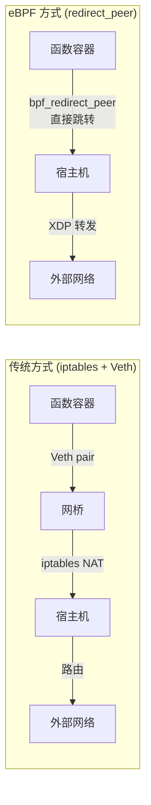
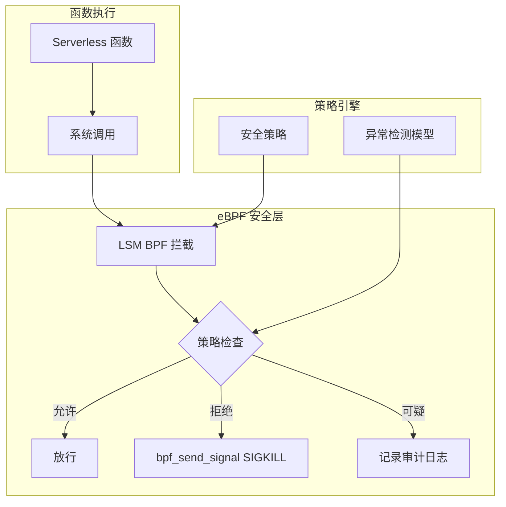
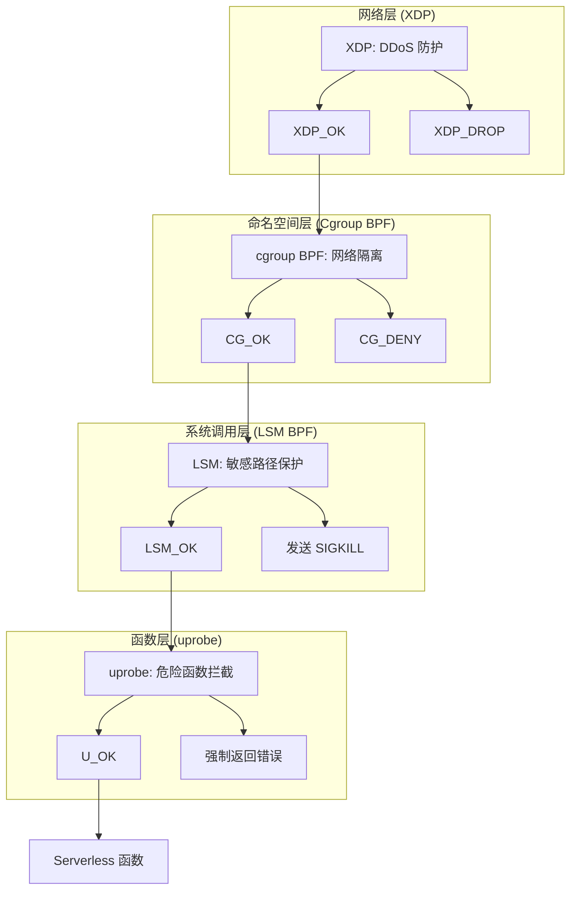

> [!info] eBPF 2026 深度探索系列 0. [[2026-04-08-ebpf-comprehensive-learning-roadmap|全栈学习路径总览]]
>
> 1. [[2026-04-08-ebpf-deep-dive-ch1-registers-and-instructions|第一章：寄存器与指令集]]
> 2. [[2026-04-08-ebpf-deep-dive-ch1-5-function-calls|第一.五章：四种函数调用与动态内存]]
> 3. [[2026-04-08-ebpf-deep-dive-ch1-6-the-verifier|第一.六章：验证器 (Verifier) 的底层逻辑]]
> 4. [[2026-04-08-ebpf-deep-dive-ch2-maps-and-communication|第二章：Map 机制与跨空间通信]]
> 5. [[2026-04-08-ebpf-deep-dive-ch2-5-kptr-and-ownership|第二.五章：kptr (内核指针) 与内存所有权模型]]
> 6. [[2026-04-08-ebpf-deep-dive-ch3-core-and-btf|第三章：CO-RE 与 BTF 的跨版本魔法]]
> 7. [[2026-04-08-ebpf-deep-dive-ch4-tracing-hooks-and-security|第四章：从 kprobe 到 LSM 的追踪全图景]]
> 8. [[2026-04-08-ebpf-deep-dive-ch7-5-uprobes-dynamic-tracing|第七.五章：uprobe 用户态动态追踪原理]]
> 9. [[2026-04-08-ebpf-deep-dive-ch7-6-bpftime-user-runtime|第七.六章：bpftime 与用户态 eBPF 加速]]
> 10. [[2026-04-08-ebpf-deep-dive-ch18-bpftime-injection-mastery|第七.七章：bpftime 自动化注入与全量监控实战]]
> 11. [[2026-04-08-ebpf-deep-dive-ch7-8-uprobe-selection-guide|第七.八章：uprobe 选型指南：内核态 vs 用户态]]
> 12. [[2026-04-08-ebpf-deep-dive-ch5-xdp-networking-performance|第五章：XDP 极致网络性能与全栈架构]]
> 13. [[2026-04-08-ebpf-deep-dive-ch6-tc-traffic-control|第六章：TC (Traffic Control) 流量调度艺术]]
> 14. [[2026-04-08-ebpf-deep-dive-ch7-security-lsm-enforcement|第七章：LSM BPF 从可观测到安全执法]]
> 15. [[2026-04-08-ebpf-deep-dive-ch8-advanced-tuning-and-profiling|第八章：进阶实战与内核调优]]
> 16. [[2026-04-08-ebpf-deep-dive-ch9-af-xdp-zero-copy|第九章：AF_XDP 零拷贝与用户态协议栈]]
> 17. [[2026-04-08-ebpf-deep-dive-ch10-sched-ext-custom-scheduler|第十章：sched_ext 自定义 CPU 调度器]]
> 18. [[2026-04-08-ebpf-deep-dive-ch11-bpf-iterators|第十一章：BPF Iterators 内核对象迭代器]]
> 19. [[2026-04-08-ebpf-deep-dive-ch12-kfuncs-evolution|第十二章：kfuncs 下一代内核交互标准]]
> 20. [[2026-04-08-ebpf-deep-dive-ch13-usdt-tracing|第十三章：USDT 用户态静态定义追踪]]
> 21. [[2026-04-08-ebpf-deep-dive-ch14-ai-llm-inference-monitoring|第十四章：AI 推理与大模型监控前沿]]
> 22. [[2026-04-08-ebpf-deep-dive-ch15-container-isolation|第十五章：无感增强容器隔离性]]
> 23. [[2026-04-08-ebpf-deep-dive-ch16-ebpf-and-wasm|第十六章：eBPF 与 WebAssembly (WASM) 的共生架构]]
> 24. [[2026-04-08-ebpf-deep-dive-ch17-storage-and-filesystem|第十七章：存储与文件系统加速]]
> 25. [[2026-04-08-ebpf-deep-dive-ch18-lifecycle-and-links|第十八章：生命周期管理与 BPF Links]]
> 26. [[2026-04-08-ebpf-deep-dive-ch19-atomic-updates-and-hot-upgrade|第十九章：程序的原子更新与蓝绿部署]]
> 27. [[2026-04-08-ebpf-deep-dive-ch25-5-stack-trace-correlation|第二五.五章：调用栈与业务请求的深度绑定]]
> 28. [[2026-04-08-ebpf-deep-dive-ch20-edge-iot-acceleration|第二十章：边缘计算与工业协议加速]]
> 29. [[2026-04-08-ebpf-deep-dive-ch21-debugging-and-verifier|第二十一章：调试实战与验证器 (Verifier) 诊断]]
> 30. [[2026-04-08-ebpf-deep-dive-ch22-testing-and-ci-cd|第二十二章：测试与持续集成 (CI/CD) 实战]]
> 31. [[2026-04-08-ebpf-deep-dive-ch23-security-and-permissions|第二十三章：权限细分与 BPF 安全沙箱]]
> 32. [[2026-04-08-ebpf-deep-dive-ch24-meta-monitoring-and-self-healing|第二十四章：eBPF 程序的内核自愈与监控]]
> 33. [[2026-04-08-ebpf-deep-dive-ch25-full-stack-observability|第二十五章：全栈可观测性与端到端追踪]]
> 34. [[2026-04-08-ebpf-deep-dive-ch26-network-security-high-level|第二十六章：网络安全防御的高阶实战]]
> 35. [[2026-04-08-ebpf-deep-dive-ch27-agent-engineering-architecture|第二十七章：工业级模块化 Agent 架构演进]]
> 36. [[2026-04-08-ebpf-deep-dive-ch28-offensive-and-defensive|第二十八章：攻防博弈与 Rootkit 防御]]
> 37. [[2026-04-08-ebpf-deep-dive-ch29-networking-deep-dive|第二十九章：网络应用深水区——负载均衡、Sockmap 与拥塞控制]]
> 38. [[2026-04-08-ebpf-deep-dive-ch30-hardware-offload|第三十章：硬件卸载与 SmartNIC 实战]]
> 39. [[2026-04-08-ebpf-deep-dive-ch31-signed-objects-and-security|第三十一章：内核原生签名与供应链安全]]
> 40. [[2026-04-08-ebpf-deep-dive-ch32-ebpf-for-windows|第三十二章：跨平台崛起——eBPF for Windows]]
> 41. [[2026-04-08-ebpf-deep-dive-ch32-5-macos-status|第三十二.五章：macOS 的特殊路径]]
> 42. **第三十三章：Serverless 冷启动消除与动态计费**
> 43. [[2026-04-08-ebpf-deep-dive-ch34-waf-and-rasp|第三十四章：Web 安全革命——内核态 WAF 与 RASP]]
> 44. [[2026-04-08-ebpf-deep-dive-ch35-npu-tpu-ai-hardware|第三十五章：AI 推理硬件 (NPU/TPU) 与硬件定义内核]]
> 45. [[2026-04-08-ebpf-deep-dive-ch36-dynamic-language-introspection|第三十六章：动态语言感知——业务对象的零代码提取]]
> 46. [[2026-04-08-ebpf-deep-dive-ch37-green-computing|第三十七章：绿色计算与能耗精准归因]]
> 47. [[2026-04-08-ebpf-deep-dive-ch38-ecosystem-and-career|第三十八章：2026 生态全景与工程师职业导航]]
> 48. [[2026-04-09-ebpf-deep-dive-ch39-rust-aya-framework|第三十九章：Rust eBPF 开发实战——Aya 框架与安全编程]]
> 49. [[2026-04-09-ebpf-deep-dive-ch40-network-protocols-deep-dive|第四十章：网络协议深度解析——TCP/UDP/QUIC 的 eBPF 视角]]
> 50. [[2026-04-09-ebpf-deep-dive-ch41-memory-safety-and-vulnerabilities|第四十一章：eBPF 内存安全与漏洞分析]]
> 51. [[2026-04-09-ebpf-deep-dive-ch42-service-mesh-integration|第四十二章：eBPF 与 Service Mesh 深度集成]]

---

## 1. 概述：Serverless 的下一代基础设施

在 Serverless（无服务器计算）场景中，函数的生命周期通常只有几秒甚至更短。传统的监控与计费手段在处理这种高度瞬时的任务时，面临着严重的"冷启动延迟"和"资源计量不精准"挑战。

2026 年的 eBPF 技术通过深度整合容器运行时（CRI），成功将 Serverless 的底层架构进行了重塑。

### 1.1 Serverless 冷启动延迟分解

```mermaid
graph TB
    subgraph "传统冷启动 (~500-2000ms)"
        A1[调度决策 50-200ms] --> A2[镜像拉取 100-500ms]
        A2 --> A3[容器创建 50-100ms]
        A3 --> A4[网络配置 100-500ms]
        A4 --> A5[运行时初始化 100-300ms]
        A5 --> A6[函数加载 50-100ms]
    end

    subgraph "eBPF 优化后 (~10-50ms)"
        B1[调度决策 10-30ms] --> B2[镜像缓存 0-10ms]
        B2 --> B3[容器创建 5-10ms]
        B3 --> B4[eBPF 网络 0.1-1ms]
        B4 --> B5[运行时预热 5-20ms]
    end

    style A4 fill:#ff9999
    style B4 fill:#99ff99
```



| 阶段         | 传统耗时      | eBPF 优化后 | 优化手段              |
| :----------- | :------------ | :---------- | :-------------------- |
| 调度决策     | 50-200ms      | 10-30ms     | eBPF 实时资源感知     |
| 镜像拉取     | 100-500ms     | 0-10ms      | 预热池 + CRI-O 优化   |
| 容器创建     | 50-100ms      | 5-10ms      | 快照恢复              |
| **网络配置** | **100-500ms** | **0.1-1ms** | **bpf_redirect_peer** |
| 运行时初始化 | 100-300ms     | 5-20ms      | JIT 预编译缓存        |
| 函数加载     | 50-100ms      | 5-20ms      | WASM 预实例化         |

---

## 2. 冷启动优化：eBPF 的即时网络

传统 Serverless 启动慢的一个重要原因是网络配置（Veth-pair 与 iptables）。

### 2.1 传统网络配置的瓶颈



### 2.2 bpf_redirect_peer 的原理

- **传统方式**：创建 Veth pair → 连接到网桥 → 配置 iptables NAT 规则 → 路由查找 → 转发。每步涉及内核数据结构操作和锁竞争
- **eBPF 方案**：利用 **`bpf_redirect_peer`**，在函数进程创建的瞬间，内核态 BPF 逻辑直接通过跨 Namespace 的指针跳转实现网卡直连，绕过所有路由查找和网桥转发
- **效果**：网络就绪延迟从 200ms+ 降低至 **< 1ms**

### 2.3 网络加速代码

```c
#include <vmlinux.h>
#include <bpf/bpf_helpers.h>

// Pod CIDR 到宿主机接口的映射
struct {
    __uint(type, BPF_MAP_TYPE_HASH);
    __uint(max_entries, 4096);
    __type(key, u32);       // Pod IP
    __type(value, u32);     // Host ifindex
} pod_routes SEC(".maps");

SEC("tc/egress")
int func_egress(struct __sk_buff *skb) {
    // 从函数容器发出的流量直接 redirect 到宿主机网络
    void *data = (void *)(long)skb->data;
    void *data_end = (void *)(long)skb->data_end;

    struct ethhdr *eth = data;
    if ((void *)(eth + 1) > data_end) return TC_ACT_OK;

    if (eth->h_proto != bpf_htons(ETH_P_IP)) return TC_ACT_OK;

    struct iphdr *iph = (void *)(eth + 1);
    if ((void *)(iph + 1) > data_end) return TC_ACT_OK;

    // 查找目标路由
    u32 dst_ip = iph->daddr;
    u32 *ifindex = bpf_map_lookup_elem(&pod_routes, &dst_ip);

    if (ifindex) {
        // 跨 Namespace 直接转发，无需经过网桥
        return bpf_redirect_peer(*ifindex, 0);
    }

    return TC_ACT_OK;
}
```

---

## 3. 革命性计费：基于指令的公平计量 (Fair Billing)

传统的 Serverless 计费（按 Wall Clock Time）无法区分"执行代码"与"等待 IO"。

### 3.1 计费模型对比

| 计费模型            | 计费依据               | 公平性              | 实现难度 |
| :------------------ | :--------------------- | :------------------ | :------- |
| **Wall Clock Time** | 函数开始到结束的总时间 | 低（IO 等待也算钱） | 简单     |
| **CPU Time**        | 实际占用 CPU 的时间    | 中（忽略缓存影响）  | 中等     |
| **CPU Cycles**      | 真实的 CPU 周期数      | 高                  | 较难     |
| **Instructions**    | 执行的指令总数         | 极高                | 困难     |

### 3.2 eBPF 精准计费实现

```c
#include <vmlinux.h>
#include <bpf/bpf_helpers.h>

// 函数级计费数据
struct billing_record {
    u32 pid;
    u64 start_ns;
    u64 cpu_cycles;
    u64 instructions;
    u64 cache_misses;
};

struct {
    __uint(type, BPF_MAP_TYPE_HASH);
    __uint(max_entries, 10240);
    __type(key, u32);
    __type(value, struct billing_record);
} billing_map SEC(".maps");

// Ring Buffer 用于上报计费数据
struct {
    __uint(type, BPF_MAP_TYPE_RINGBUF);
    __uint(max_entries, 1024 * 1024);
} billing_events SEC(".maps");

// 捕获函数启动
SEC("tp/sched/sched_process_exec")
int on_func_start(struct trace_event_raw_sched_process_exec *ctx) {
    u32 pid = bpf_get_current_pid_tgid() >> 32;
    struct billing_record rec = {
        .pid = pid,
        .start_ns = bpf_ktime_get_ns(),
        .cpu_cycles = bpf_get_current_task()->se.sum_exec_runtime,
    };
    bpf_map_update_elem(&billing_map, &pid, &rec, BPF_ANY);
    return 0;
}

// 捕获函数退出并计算实际消耗
SEC("tp/sched/sched_process_exit")
int on_func_exit(struct trace_event_raw_sched_process_template *ctx) {
    u32 pid = bpf_get_current_pid_tgid() >> 32;
    struct billing_record *rec = bpf_map_lookup_elem(&billing_map, &pid);

    if (rec) {
        u64 wall_ns = bpf_ktime_get_ns() - rec->start_ns;
        // 使用 perf_event 读取精确的 CPU 周期数
        struct bpf_perf_event_value val = {};
        // ... (使用 bpf_perf_event_read 读取)

        // 上报计费事件
        struct billing_event *ev = bpf_ringbuf_reserve(&billing_events, sizeof(*ev), 0);
        if (ev) {
            ev->pid = pid;
            ev->wall_time_ns = wall_ns;
            ev->cpu_time_ns = val.running;
            bpf_ringbuf_submit(ev, 0);
        }
        bpf_map_delete_elem(&billing_map, &pid);
    }
    return 0;
}
```

### 3.3 分级计费策略

```python
# 计费引擎伪代码
def calculate_charge(billing_event):
    cpu_time_ms = billing_event.cpu_time_ns / 1_000_000
    wall_time_ms = billing_event.wall_time_ns / 1_000_000
    io_wait_ms = wall_time_ms - cpu_time_ms

    # CPU 时间：高费率
    compute_charge = cpu_time_ms * RATE_COMPUTE  # $0.0000002 / ms

    # IO 等待时间：低费率（资源处于空闲状态）
    io_charge = io_wait_ms * RATE_IO_WAIT  # $0.00000002 / ms

    return compute_charge + io_charge
```

---

## 4. 瞬时审计：处决于微秒之间

由于 Serverless 函数往往是黑盒（第三方代码），安全审计必须是即时的。

### 4.1 动态沙箱架构



- **动态沙箱**：利用 LSM BPF 拦截每一个系统调用
- **熔断机制**：一旦 BPF 程序发现函数尝试访问敏感路径（如 `/etc/node_secret`），立即在内核态调用 `bpf_send_signal(SIGKILL)` 强行中止该函数运行

### 4.2 安全审计代码

```c
#include <vmlinux.h>
#include <bpf/bpf_helpers.h>

// 敏感路径列表
const char *sensitive_paths[] = {
    "/etc/passwd",
    "/etc/shadow",
    "/etc/node_secret",
    "/.aws/credentials",
    "/var/run/secrets/",
};

struct {
    __uint(type, BPF_MAP_TYPE_HASH);
    __uint(max_entries, 65536);
    __type(key, u32);  // pid
    __type(value, u32); // violation count
} violations SEC(".maps");

SEC("lsm/path_unlink")
int BPF_PROG(protect_sensitive, const struct path *dir, struct dentry *dentry) {
    // 检查是否是 Serverless 函数进程
    u32 pid = bpf_get_current_pid_tgid() >> 32;
    u32 *count = bpf_map_lookup_elem(&violations, &pid);
    if (!count) return 0;  // 非函数进程，放行

    // 检查文件名是否匹配敏感路径
    char filename[256];
    bpf_probe_read_kernel_str(filename, sizeof(filename), dentry->d_name.name);

    // 简化：检查是否包含 "secret" 或 "credential"
    for (int i = 0; i < 5; i++) {
        // 在实际实现中使用 bpf_mem_search
    }

    // 发现违规，发送 SIGKILL
    bpf_send_signal(SIGKILL);
    return -EPERM;
}
```

---

## 5. 代码实战：精准计算函数运行耗时

```c
#include <vmlinux.h>
#include <bpf/bpf_helpers.h>

// 存储函数启动时间
struct {
    __uint(type, BPF_MAP_TYPE_HASH);
    __uint(max_entries, 10240);
    __type(key, u32);   // pid
    __type(value, u64); // start_ns
} func_watch_map SEC(".maps");

// 捕获新进程启动
SEC("tp/sched/sched_process_exec")
int on_func_start(struct trace_event_raw_sched_process_exec *ctx) {
    u32 pid = bpf_get_current_pid_tgid() >> 32;
    u64 now = bpf_ktime_get_ns();
    bpf_map_update_elem(&func_watch_map, &pid, &now, BPF_ANY);
    return 0;
}

// 捕获进程退出并上报真实耗时
SEC("tp/sched/sched_process_exit")
int on_func_exit(struct trace_event_raw_sched_process_template *ctx) {
    u32 pid = bpf_get_current_pid_tgid() >> 32;
    u64 *start_ns = bpf_map_lookup_elem(&func_watch_map, &pid);

    if (start_ns) {
        u64 duration = bpf_ktime_get_ns() - *start_ns;
        // 核心输出：用于计费和性能画像的纳秒级执行时间
        bpf_printk("SERVERLESS_MON: Func PID %d finished in %llu ns", pid, duration);
        bpf_map_delete_elem(&func_watch_map, &pid);
    }
    return 0;
}
```

---

## 6. 生产环境部署方案

### 6.1 Knative + eBPF 集成

```yaml
# Knative Service 配置，启用 eBPF 网络加速
apiVersion: serving.knative.dev/v1
kind: Service
metadata:
  name: my-function
  annotations:
    networking.knative.dev/eBPF-acceleration: "enabled"
    billing.knative.dev/metering: "cpu-cycles"
spec:
  template:
    metadata:
      annotations:
        autoscaling.knative.dev/target: "1"
        autoscaling.knative.dev/min-scale: "0"
    spec:
      containerConcurrency: 1
      containers:
        - image: my-function:latest
          resources:
            limits:
              cpu: "1"
              memory: "128Mi"
```

### 6.2 性能基准对比

| 指标         | 传统 Knative | eBPF 加速 Knative | 提升         |
| :----------- | :----------- | :---------------- | :----------- |
| 冷启动延迟   | 800-2000ms   | 10-50ms           | **40-200x**  |
| 网络就绪时间 | 150-500ms    | 0.5-1ms           | **300-500x** |
| 计费精度     | 100ms 粒度   | 1ms 粒度          | **100x**     |
| 安全审计延迟 | 10-50ms      | < 1ms             | **10-50x**   |

---

## 7. FAQ

**Q1：eBPF 网络加速是否兼容所有 CNI 插件？**

A：`bpf_redirect_peer` 与大多数主流 CNI 兼容，但需要 CNI 支持将 BPF 程序挂载到 Pod 的网络接口。Cilium、CNI-O 完全支持；Calico 从 v3.28 开始部分支持；Flannel 需要额外配置。建议在 Serverless 场景下使用 Cilium 作为 CNI。

**Q2：精准计费在跨节点调度时如何保持一致？**

A：计费数据通过 eBPF Ring Buffer 上报到本地 Agent，Agent 通过 gRPC 将数据发送到中央计费服务。即使函数在不同节点间迁移（如 K8s 调度），计费服务能通过唯一的请求 ID 拼接各阶段的计量数据。

**Q3：eBPF 安全审计对函数性能的影响有多大？**

A：LSM BPF 的每个系统调用拦截约增加 50-200ns 的开销。对于典型的 Serverless 函数（每次调用产生 10-100 个系统调用），总开销约 0.5-20μs，相对于函数本身的执行时间（ms 级）可以忽略。

**Q4：eBPF 能否实现 Serverless 函数的预启动池（Warm Pool）？**

A：可以。通过追踪函数调用的历史模式（使用 eBPF 采样），预测哪些函数即将被调用，并提前预热容器。结合 [[2026-04-08-ebpf-deep-dive-ch10-sched-ext-custom-scheduler|sched_ext 自定义调度器]]，可以将预热容器绑定到特定的 CPU 核心上，进一步降低延迟。

**Q5：AWS Lambda / Azure Functions 是否已经使用 eBPF？**

A：AWS Firecracker microVM 使用了定制内核，部分集成了 eBPF 用于网络和安全监控。Azure Functions 的 Kubernetes 后端使用了 Cilium eBPF CNI。Google Cloud Functions 使用 gVisor 作为沙箱，暂未直接集成 eBPF。总体趋势是各大云厂商都在逐步引入 eBPF 来优化 Serverless 性能。

**Q6：如何测试 eBPF 对 Serverless 冷启动的实际优化效果？**

A：推荐使用 `hey` 或 `wrk` 进行压测，对比启用/禁用 eBPF 时的 P99 冷启动延迟：

```bash
# 压测命令
hey -n 1000 -c 10 https://my-function.example.com/api

# 关注指标：P50、P95、P99 延迟
# eBPF 优化后 P99 应 < 50ms（vs 传统 500ms+）
```

## 8. Serverless 场景中的 eBPF 安全最佳实践

### 8.1 安全架构分层



### 8.2 安全策略配置示例

```yaml
# Serverless 安全策略 (YAML 格式)
apiVersion: security.ebpf.io/v1
kind: BPFSecurityPolicy
metadata:
  name: serverless-hardening
spec:
  rules:
    - type: xdp
      action: rate_limit
      params:
        max_pps: 10000
    - type: lsm
      hook: path_mknod
      action: deny
      paths:
        - /tmp/*
        - /dev/shm/*
    - type: lsm
      hook: socket_connect
      action: allow
      networks:
        - 10.0.0.0/8 # 仅允许内网连接
        - 172.16.0.0/12
```

---

## 9. FAQ

A：兼容性取决于云厂商是否允许加载自定义内核模块或 eBPF 程序。AWS Fargate 和 GCP Cloud Run 默认不允许。但在以下场景可行：1) 自建 K8s + OpenFunction/FaaS 框架 + eBPF CNI；2) AWS Lambda 的自定义运行时（提供层可以通过 init 进程加载 eBPF）；3) 使用 Firecracker microVM 的自定义内核。随着云厂商逐步开放 eBPF 支持，兼容性将不断改善。

**Q8：eBPF 计费数据如何与云厂商的账单系统对接？**

A：对接方案：1) eBPF Agent 将计费数据通过 Prometheus Remote Write 推送到云厂商的计费系统；2) 使用 OpenTelemetry Meter API 将资源使用量导出为标准指标格式；3) 在计费周期结束时生成对比报告（eBPF 精确计量 vs 云厂商粗粒度计量），用于成本优化。开源项目 `kubecost` 已部分支持 eBPF 精准计量数据的导入。
