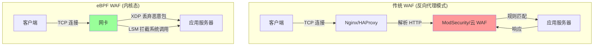
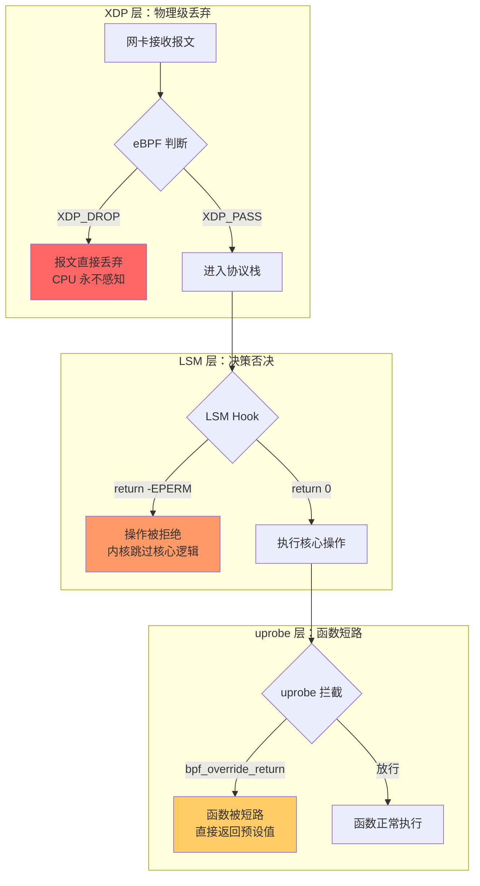
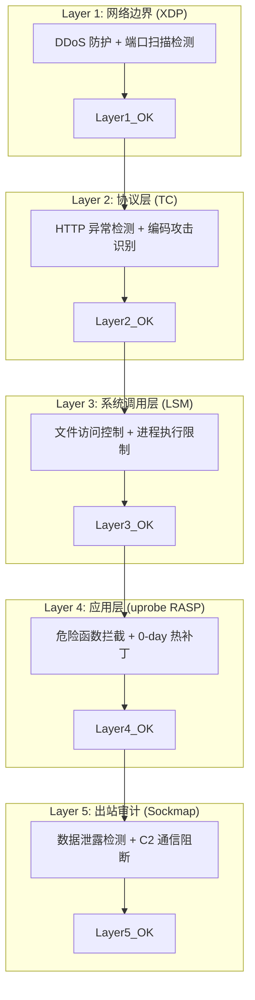

> [!info] eBPF 2026 深度探索系列 0. [[2026-04-08-ebpf-comprehensive-learning-roadmap|全栈学习路径总览]]
>
> 1. [[2026-04-08-ebpf-deep-dive-ch1-registers-and-instructions|第一章：寄存器与指令集]]
> 2. [[2026-04-08-ebpf-deep-dive-ch1-5-function-calls|第一.五章：四种函数调用与动态内存]]
> 3. [[2026-04-08-ebpf-deep-dive-ch1-6-the-verifier|第一.六章：验证器 (Verifier) 的底层逻辑]]
> 4. [[2026-04-08-ebpf-deep-dive-ch2-maps-and-communication|第二章：Map 机制与跨空间通信]]
> 5. [[2026-04-08-ebpf-deep-dive-ch2-5-kptr-and-ownership|第二.五章：kptr (内核指针) 与内存所有权模型]]
> 6. [[2026-04-08-ebpf-deep-dive-ch3-core-and-btf|第三章：CO-RE 与 BTF 的跨版本魔法]]
> 7. [[2026-04-08-ebpf-deep-dive-ch4-tracing-hooks-and-security|第四章：从 kprobe 到 LSM 的追踪全图景]]
> 8. [[2026-04-08-ebpf-deep-dive-ch7-5-uprobes-dynamic-tracing|第七.五章：uprobe 用户态动态追踪原理]]
> 9. [[2026-04-08-ebpf-deep-dive-ch7-6-bpftime-user-runtime|第七.六章：bpftime 与用户态 eBPF 加速]]
> 10. [[2026-04-08-ebpf-deep-dive-ch18-bpftime-injection-mastery|第七.七章：bpftime 自动化注入与全量监控实战]]
> 11. [[2026-04-08-ebpf-deep-dive-ch7-8-uprobe-selection-guide|第七.八章：uprobe 选型指南：内核态 vs 用户态]]
> 12. [[2026-04-08-ebpf-deep-dive-ch5-xdp-networking-performance|第五章：XDP 极致网络性能与全栈架构]]
> 13. [[2026-04-08-ebpf-deep-dive-ch6-tc-traffic-control|第六章：TC (Traffic Control) 流量调度艺术]]
> 14. [[2026-04-08-ebpf-deep-dive-ch7-security-lsm-enforcement|第七章：LSM BPF 从可观测到安全执法]]
> 15. [[2026-04-08-ebpf-deep-dive-ch8-advanced-tuning-and-profiling|第八章：进阶实战与内核调优]]
> 16. [[2026-04-08-ebpf-deep-dive-ch9-af-xdp-zero-copy|第九章：AF_XDP 零拷贝与用户态协议栈]]
> 17. [[2026-04-08-ebpf-deep-dive-ch10-sched-ext-custom-scheduler|第十章：sched_ext 自定义 CPU 调度器]]
> 18. [[2026-04-08-ebpf-deep-dive-ch11-bpf-iterators|第十一章：BPF Iterators 内核对象迭代器]]
> 19. [[2026-04-08-ebpf-deep-dive-ch12-kfuncs-evolution|第十二章：kfuncs 下一代内核交互标准]]
> 20. [[2026-04-08-ebpf-deep-dive-ch13-usdt-tracing|第十三章：USDT 用户态静态定义追踪]]
> 21. [[2026-04-08-ebpf-deep-dive-ch14-ai-llm-inference-monitoring|第十四章：AI 推理与大模型监控前沿]]
> 22. [[2026-04-08-ebpf-deep-dive-ch15-container-isolation|第十五章：无感增强容器隔离性]]
> 23. [[2026-04-08-ebpf-deep-dive-ch16-ebpf-and-wasm|第十六章：eBPF 与 WebAssembly (WASM) 的共生架构]]
> 24. [[2026-04-08-ebpf-deep-dive-ch17-storage-and-filesystem|第十七章：存储与文件系统加速]]
> 25. [[2026-04-08-ebpf-deep-dive-ch18-lifecycle-and-links|第十八章：生命周期管理与 BPF Links]]
> 26. [[2026-04-08-ebpf-deep-dive-ch19-atomic-updates-and-hot-upgrade|第十九章：程序的原子更新与蓝绿部署]]
> 27. [[2026-04-08-ebpf-deep-dive-ch25-5-stack-trace-correlation|第二五.五章：调用栈与业务请求的深度绑定]]
> 28. [[2026-04-08-ebpf-deep-dive-ch20-edge-iot-acceleration|第二十章：边缘计算与工业协议加速]]
> 29. [[2026-04-08-ebpf-deep-dive-ch21-debugging-and-verifier|第二二十一|第二十一章：调试实战与验证器 (Verifier) 诊断]]
> 30. [[2026-04-08-ebpf-deep-dive-ch22-testing-and-ci-cd|第二十二章：测试与持续集成 (CI/CD) 实战]]
> 31. [[2026-04-08-ebpf-deep-dive-ch23-security-and-permissions|第二十三章：权限细分与 BPF 安全沙箱]]
> 32. [[2026-04-08-ebpf-deep-dive-ch24-meta-monitoring-and-self-healing|第二十四章：eBPF 程序的内核自愈与监控]]
> 33. [[2026-04-08-ebpf-deep-dive-ch25-full-stack-observability|第二十五章：全栈可观测性与端到端追踪]]
> 34. [[2026-04-08-ebpf-deep-dive-ch26-network-security-high-level|第二十六章：网络安全防御的高阶实战]]
> 35. [[2026-04-08-ebpf-deep-dive-ch27-agent-engineering-architecture|第二十七章：工业级模块化 Agent 架构演进]]
> 36. [[2026-04-08-ebpf-deep-dive-ch28-offensive-and-defensive|第二十八章：攻防博弈与 Rootkit 防御]]
> 37. [[2026-04-08-ebpf-deep-dive-ch29-networking-deep-dive|第二十九章：网络应用深水区——负载均衡、Sockmap 与拥塞控制]]
> 38. [[2026-04-08-ebpf-deep-dive-ch30-hardware-offload|第三十章：硬件卸载与 SmartNIC 实战]]
> 39. [[2026-04-08-ebpf-deep-dive-ch31-signed-objects-and-security|第三十一章：内核原生签名与供应链安全]]
> 40. [[2026-04-08-ebpf-deep-dive-ch32-ebpf-for-windows|第三十二章：跨平台崛起——eBPF for Windows]]
> 41. [[2026-04-08-ebpf-deep-dive-ch32-5-macos-status|第三十二.五章：macOS 的特殊路径]]
> 42. [[2026-04-08-ebpf-deep-dive-ch33-serverless-optimization|第三十三章：Serverless 冷启动消除与动态计费]]
> 43. **第三十四章：Web 安全革命——内核态 WAF 与 RASP**
> 44. [[2026-04-08-ebpf-deep-dive-ch35-npu-tpu-ai-hardware|第三十五章：AI 推理硬件 (NPU/TPU) 与硬件定义内核]]
> 45. [[2026-04-08-ebpf-deep-dive-ch36-dynamic-language-introspection|第三十六章：动态语言感知——业务对象的零代码提取]]
> 46. [[2026-04-08-ebpf-deep-dive-ch37-green-computing|第三十七章：绿色计算与能耗精准归因]]
> 47. [[2026-04-08-ebpf-deep-dive-ch38-ecosystem-and-career|第三十八章：2026 生态全景与工程师职业导航]]
> 48. [[2026-04-09-ebpf-deep-dive-ch39-rust-aya-framework|第三十九章：Rust eBPF 开发实战——Aya 框架与安全编程]]
> 49. [[2026-04-09-ebpf-deep-dive-ch40-network-protocols-deep-dive|第四十章：网络协议深度解析——TCP/UDP/QUIC 的 eBPF 视角]]
> 50. [[2026-04-09-ebpf-deep-dive-ch41-memory-safety-and-vulnerabilities|第四十一章：eBPF 内存安全与漏洞分析]]
> 51. [[2026-04-09-ebpf-deep-dive-ch42-service-mesh-integration|第四十二章：eBPF 与 Service Mesh 深度集成]]

---

## 1. 概述：安全边界的深度下沉

传统的 Web 安全防护依赖于独立的防火墙设备或应用层插件（WAF）。但在处理 400G+ 高带宽和极低延迟要求的现代 Web 业务时，传统架构因其频繁的内核/用户态切换和数据拷贝显得力不从心。

2026 年，**eBPF** 开启了 Web 安全的新范式：通过在网卡驱动（XDP）或系统调用层（LSM/uprobe）直接注入防护逻辑，实现了"零拷贝"过滤与函数级的实时阻断。

### 1.1 传统 WAF vs eBPF WAF 架构对比



| 维度         | 传统 WAF    | eBPF WAF       | eBPF RASP         |
| :----------- | :---------- | :------------- | :---------------- |
| **防御层级** | 应用层 (L7) | 网络层 (L2-L4) | 应用内部 (函数级) |
| **延迟**     | 1-10ms      | 0.01-0.1μs     | 0.1-1μs           |
| **吞吐量**   | 10-50Gbps   | 100-400Gbps    | 无限制            |
| **CPU 开销** | 高 (用户态) | 极低 (内核态)  | 低                |
| **绕过风险** | 编码绕过    | 难以绕过       | 无法绕过          |

---

## 2. 内核态 WAF：极致性能的包检测

### 2.1 字符串匹配的硬件化加速

借助 2026 年内核完善的 **`bpf_mem_search`** 和 **`bpf_loop`** 能力，eBPF 程序可以高效地对 HTTP 请求体进行全文扫描。

- **场景**：在 XDP 层拦截包含 `SELECT * FROM` 或 `<script>` 标签的非法报文
- **优势**：攻击者在消耗服务器 CPU 资源之前就被阻断，且无需配置复杂的反向代理

### 2.2 多模式检测引擎

```c
#include <vmlinux.h>
#include <bpf/bpf_helpers.h>

// 攻击签名数据库（在 XDP 层的极简版本）
struct attack_sig {
    char pattern[32];
    u16 len;
    u8 severity;  // 0=info, 1=warn, 2=critical
};

struct {
    __uint(type, BPF_MAP_TYPE_ARRAY);
    __uint(max_entries, 32);
    __type(key, u32);
    __type(value, struct attack_sig);
} sig_db SEC(".maps");

// 统计信息
struct {
    __uint(type, BPF_MAP_TYPE_PERCPU_ARRAY);
    __uint(max_entries, 3);
    __type(key, u32);
    __type(value, u64);
} stats SEC(".maps");

// SQL 注入签名
struct attack_sig sql_sigs[] = {
    {"UNION SELECT", 12, 2},
    {"OR 1=1", 6, 2},
    {"'; DROP TABLE", 14, 2},
    {"WAITFOR DELAY", 13, 1},
};

// XSS 签名
struct attack_sig xss_sigs[] = {
    {"<script>", 8, 2},
    {"javascript:", 11, 1},
    {"onerror=", 8, 2},
};

SEC("xdp")
int xdp_waf_engine(struct xdp_md *ctx) {
    void *data = (void *)(long)ctx->data;
    void *data_end = (void *)(long)ctx->data_end;

    // 快速判断：只检查 TCP 端口 80/443 的流量
    struct ethhdr *eth = data;
    if ((void *)(eth + 1) > data_end) return XDP_PASS;
    if (eth->h_proto != bpf_htons(ETH_P_IP)) return XDP_PASS;

    struct iphdr *iph = (void *)(eth + 1);
    if ((void *)(iph + 1) > data_end) return XDP_PASS;

    // 仅检查 HTTP/HTTPS 端口
    u16 dport = bpf_ntohs(0);  // 简化：需要解析 TCP header

    // 提取 payload
    unsigned char *payload = (unsigned char *)data + 54;  // Eth(14)+IP(20)+TCP(20)
    int payload_len = (void *)data_end - (void *)payload;
    if (payload_len <= 0) return XDP_PASS;

    // 限制扫描范围以保持性能
    int scan_len = payload_len > 256 ? 256 : payload_len;

    // 扫描 SQL 注入签名
    #pragma unroll
    for (int i = 0; i < 4; i++) {
        int pos = bpf_mem_search(payload, scan_len, sql_sigs[i].pattern, sql_sigs[i].len, 0);
        if (pos >= 0) {
            // SQL 注入检测命中
            u32 key = 0;
            u64 *cnt = bpf_map_lookup_elem(&stats, &key);
            if (cnt) (*cnt)++;
            return XDP_DROP;  // 在网卡层直接丢弃
        }
    }

    // 扫描 XSS 签名
    #pragma unroll
    for (int i = 0; i < 3; i++) {
        int pos = bpf_mem_search(payload, scan_len, xss_sigs[i].pattern, xss_sigs[i].len, 0);
        if (pos >= 0) {
            u32 key = 1;
            u64 *cnt = bpf_map_lookup_elem(&stats, &key);
            if (cnt) (*cnt)++;
            return XDP_DROP;
        }
    }

    return XDP_PASS;
}
```

---

## 3. eBPF RASP：面向漏洞的"外科手术"

**RASP (Runtime Application Self-Protection)** 能够在应用内部识别攻击。eBPF 通过 `uprobe` 或 `bpftime` 实现了比传统 Agent（如 Java Agent）更轻量、更普适的 RASP 方案。

### 3.1 函数级拦截实战

针对 0-day 漏洞，管理员可以动态下发 BPF 探针，锁定关键敏感函数（如 `system()`, `eval()`, `mysqli_query()`）：

- **逻辑**：一旦参数匹配攻击特征，BPF 程序直接强制函数返回错误码，实现**无感热补丁**

### 3.2 RASP vs WAF vs 传统 Agent 对比

| 维度           | 传统 WAF       | Java Agent RASP  | eBPF RASP           |
| :------------- | :------------- | :--------------- | :------------------ |
| **部署方式**   | 反向代理       | JVM -javaagent   | 内核态 BPF 探针     |
| **语言支持**   | 所有           | 仅 Java          | 所有（uprobe 通用） |
| **性能影响**   | 1-10ms 延迟    | 5-15% 吞吐下降   | < 1% 吞吐下降       |
| **启动开销**   | 无             | 增加启动时间     | 零（动态加载）      |
| **绕过难度**   | 中（编码绕过） | 低（运行时拦截） | 极高（内核级拦截）  |
| **0-day 防护** | 需更新规则     | 需更新 Agent     | 动态下发探针        |

### 3.3 RASP 代码：拦截危险的系统调用

```c
#include <vmlinux.h>
#include <bpf/bpf_helpers.h>

// 已知的危险函数模式
struct danger_pattern {
    char pattern[64];
    u16 len;
    u32 risk_level;  // 0-100
};

struct {
    __uint(type, BPF_MAP_TYPE_ARRAY);
    __uint(max_entries, 16);
    __type(key, u32);
    __type(value, struct danger_pattern);
} danger_db SEC(".maps");

// 审计日志
struct audit_event {
    u32 pid;
    u32 uid;
    u64 timestamp;
    char comm[16];
    char func_name[32];
    u32 risk_score;
};

struct {
    __uint(type, BPF_MAP_TYPE_RINGBUF);
    __uint(max_entries, 1024 * 1024);
} audit_log SEC(".maps");

// 拦截 libc 的 system() 函数调用
SEC("uprobe//lib/x86_64-linux-gnu/libc.so.6:system")
int BPF_UPROBE(rasp_system, const char *command) {
    char cmd_buf[64];

    // 读取命令字符串
    bpf_probe_read_user_str(cmd_buf, sizeof(cmd_buf), command);

    // 检查危险模式
    u32 key = 0;
    struct danger_pattern *pat = bpf_map_lookup_elem(&danger_db, &key);
    while (pat) {
        int pos = bpf_mem_search(cmd_buf, 64, pat->pattern, pat->len, 0);
        if (pos >= 0 && pat->risk_level >= 80) {
            // 高风险命令：强制返回错误
            bpf_override_return(1);  // 返回非零表示失败

            // 记录审计日志
            struct audit_event *ev = bpf_ringbuf_reserve(&audit_log, sizeof(*ev), 0);
            if (ev) {
                ev->pid = bpf_get_current_pid_tgid() >> 32;
                ev->uid = bpf_get_current_uid_gid() & 0xFFFFFFFF;
                ev->timestamp = bpf_ktime_get_ns();
                ev->risk_score = pat->risk_level;
                bpf_get_current_comm(&ev->comm, sizeof(ev->comm));
                bpf_ringbuf_submit(ev, 0);
            }
            break;
        }
        key++;
        pat = bpf_map_lookup_elem(&danger_db, &key);
    }

    return 0;
}
```

---

## 4. 核心原理：eBPF 究竟是如何实现"实时阻断"的？

许多人困惑 eBPF 作为一个"探针"，如何能具备强力的拦截能力。其实，"阻断"在 eBPF 中是通过**改变指令流向**实现的。

### 4.1 三层阻断机制



### 4.2 XDP 层：物理级丢弃 (NIC Drop)

当 XDP 程序返回 `XDP_DROP` 时，它直接干预了网卡驱动的逻辑。内核不再将该报文拷贝至内核内存，协议栈甚至完全感知不到该包的存在。这种"物理消失"使得恶意报文无法消耗任何后续算力。

### 4.3 LSM 层：决策点的否决权 (Return-code Override)

LSM 钩子位于内核决策函数的出口。当 BPF 程序返回 `-EPERM` 时，内核会接收到这个非零信号，随即触发 `goto error` 分支，跳过真正的核心逻辑（如文件写入或进程拉起）。

### 4.4 uprobe/RASP 层：函数短路 (Short-circuiting)

这是最精妙的技术：

1. **拦截**：在应用函数执行第一条指令前触发 BPF
2. **重定向**：利用 `bpf_override_return` 辅助函数，BPF 直接修改 CPU 的指令寄存器（PC）
3. **跳过**：CPU 强行跳过目标函数的所有逻辑，直接进入 `return` 阶段。恶意指令虽然在代码里，但由于控制流被 eBPF 强行切断，一行都不会执行

---

## 5. 反向安全：利用 eBPF 实时阻断恶意发送行为

现代 Web 安全不仅要防范"攻进来"，更要防止应用"跑出去"。当应用被植入木马或发生数据泄露时，eBPF 的双向拦截能力构成了零信任架构的最后底线。

### 5.1 拦截连接意图 (LSM Connect Blocking)

黑客通常会利用反弹 Shell (Reverse Shell) 连接其 C2 服务器。利用 `lsm/socket_connect` 钩子，eBPF 可以实时校验目标 IP 的合法性：

```c
// 动态 IP 白名单
struct {
    __uint(type, BPF_MAP_TYPE_LPM_TRIE);
    __uint(max_entries, 1024);
    __type(key, struct bpf_lpm_trie_key);
    __type(value, u32);
} allowed_dest SEC(".maps");

SEC("lsm/socket_connect")
int BPF_PROG(block_c2_connect, struct socket *sock, struct sockaddr *addr, int addrlen) {
    if (addr->sa_family != AF_INET) return 0;

    struct sockaddr_in *sin = (struct sockaddr_in *)addr;
    u32 ip = sin->sin_addr.s_addr;

    // LPM 前缀匹配：允许 /24 网段
    struct bpf_lpm_trie_key key = { .prefixlen = 32, .data = ip };
    u32 *allowed = bpf_map_lookup_elem(&allowed_dest, &key);

    if (!allowed) {
        // 目标 IP 不在白名单中，阻止连接
        char comm[16];
        bpf_get_current_comm(comm, sizeof(comm));
        bpf_printk("BLOCKED: %s attempted connect to %pI4", comm, &ip);
        return -EPERM;
    }

    return 0;
}
```

### 5.2 数据内容审计 (Sockmap Send Filtering)

即便连接建立，在数据通过 `sendmsg` 发出前，eBPF (Sockmap) 仍能进行最后一次内容扫描：

- **场景**：检测报文中是否包含敏感的用户隐私数据或数据库脱库特征
- **效果**：实现内核级的 **DLP (数据防泄漏)**，确保敏感数据物理上无法离开服务器网卡

---

## 6. 代码实战：基于 XDP 的 SQL 注入探测

```c
#include <vmlinux.h>
#include <bpf/bpf_helpers.h>

// 定义待匹配的敏感关键字
const char ATTACK_PATTERN[] = "UNION SELECT";

SEC("xdp")
int xdp_waf_gate(struct xdp_md *ctx) {
    void *data = (void *)(long)ctx->data;
    void *data_end = (void *)(long)ctx->data_end;

    // 1. 简单定位 HTTP Payload（略过 Eth/IP/TCP）
    unsigned char *payload = (unsigned char *)data + 54;
    if ((void *)(payload + 64) > data_end) return XDP_PASS;

    // 2. 使用内核态搜索接口（2026 增强型）
    int pos = bpf_mem_search(payload, 64, ATTACK_PATTERN, 12, 0);

    if (pos >= 0) {
        bpf_printk("SECURITY: Blocked SQLi payload in raw packet!");
        return XDP_DROP;
    }

    return XDP_PASS;
}
```

---

## 7. 防御体系综合部署

### 7.1 多层防御架构



### 7.2 规则更新流程

```bash
# 动态更新 XDP WAF 规则（无需重启）
# 1. 更新签名数据库 Map
bpftool map update id 42 key hex 00 00 00 00 value hex 3c 73 63 72 69 70 74 3e 08 02 00 00 00 00 00 00 00 00 00 00 00 00 00 00 00 00 00 00 00 00 00 00 00 00

# 2. 添加新的 RASP 探针（针对新发现的 0-day）
bpftool prog load rasp_patch.o /sys/fs/bpf/rasp_new
bpftool prog attach id 100 uprobe /lib/x86_64-linux-gnu/libc.so.6:system

# 3. 更新 IP 白名单
bpftool map update allowed_dest key 0a 00 00 1b value 1  # 10.0.0.27
```

---

## 8. FAQ

**Q1：eBPF WAF 能替代 ModSecurity 吗？**

A：在 L3/L4 层面完全可以替代。但对于复杂的 L7 规则（如基于 Session 的攻击检测、多步请求关联），eBPF WAF 仍有局限。推荐方案是"eBPF WAF 负责快速过滤 + ModSecurity（或云 WAF）负责深度分析"的双层架构。

**Q2：XDP WAF 对 HTTPS 加密流量有效吗？**

A：XDP 层无法解密 HTTPS 流量。但有两个互补方案：1) 使用 TC 层在 TLS 握手后、加密前拦截明文（[[2026-04-08-ebpf-deep-dive-ch7-5-uprobes-dynamic-tracing|uprobe on SSL_write]]）；2) 使用 XDP 做基于 IP/Port/包大小的行为检测（如检测心包模式、异常连接频率）。

**Q3：bpf_override_return 的性能影响如何？**

A：`bpf_override_return` 本身仅增加约 100-200ns 的开销（修改 CPU 寄存器）。真正的性能影响在于 uprobe 的触发机制（INT3 断点注入），每次约 1-3μs。对于高频调用的函数，建议仅对高危函数启用拦截。

**Q4：如何防止攻击者利用 eBPF 自身来绕过安全策略？**

A：关键措施：1) 限制 `CAP_BPF` 权限，仅允许特权用户加载 BPF 程序；2) 启用 BPF 签名验证（[[2026-04-08-ebpf-deep-dive-ch31-signed-objects-and-security|第三十一章]]）；3) 使用 LSM BPF 保护 eBPF 系统调用本身；4) 定期审计已加载的 BPF 程序列表。

**Q5：eBPF WAF 对 IPv6 流量有效吗？**

A：有效。只需在解析逻辑中增加对 `ETH_P_IPV6` (0x86DD) 的判断，并使用 `struct ipv6hdr` 替代 `struct iphdr` 解析 IPv6 头部。代码逻辑与 IPv4 版本完全对称。

**Q6：大规模部署时如何管理数千台服务器的 WAF 规则？**

A：推荐使用集中式策略管理：1) **控制面**：使用 Kubernetes CRD 或类似机制定义规则，通过 API Server 分发；2) **数据面**：每台节点上的 DaemonSet 运行 Agent，监听规则变更并调用 bpftool 更新 Map；3) **回滚**：支持灰度发布和一键回滚。Cilium 的 ClusterwideNetworkPolicy 就是这个模式的成熟实现。
