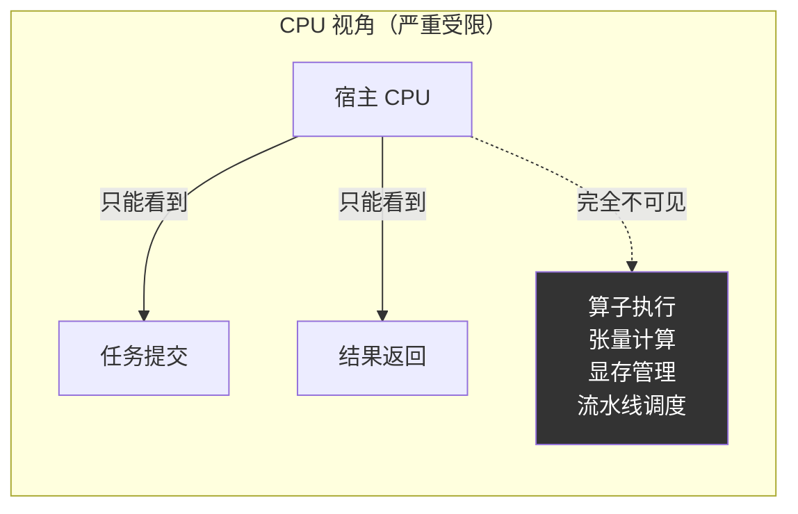
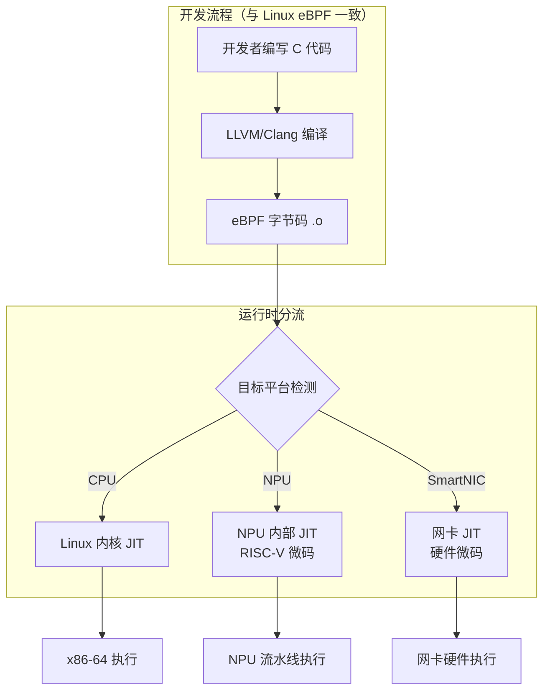
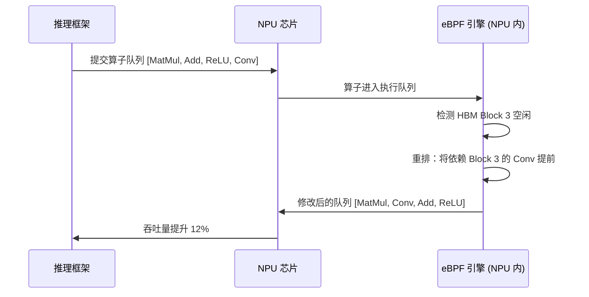
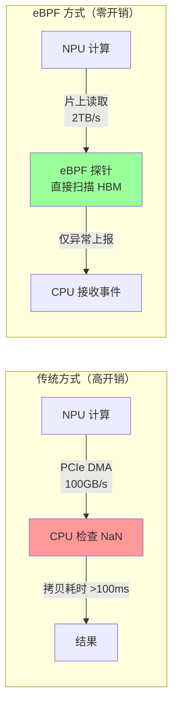
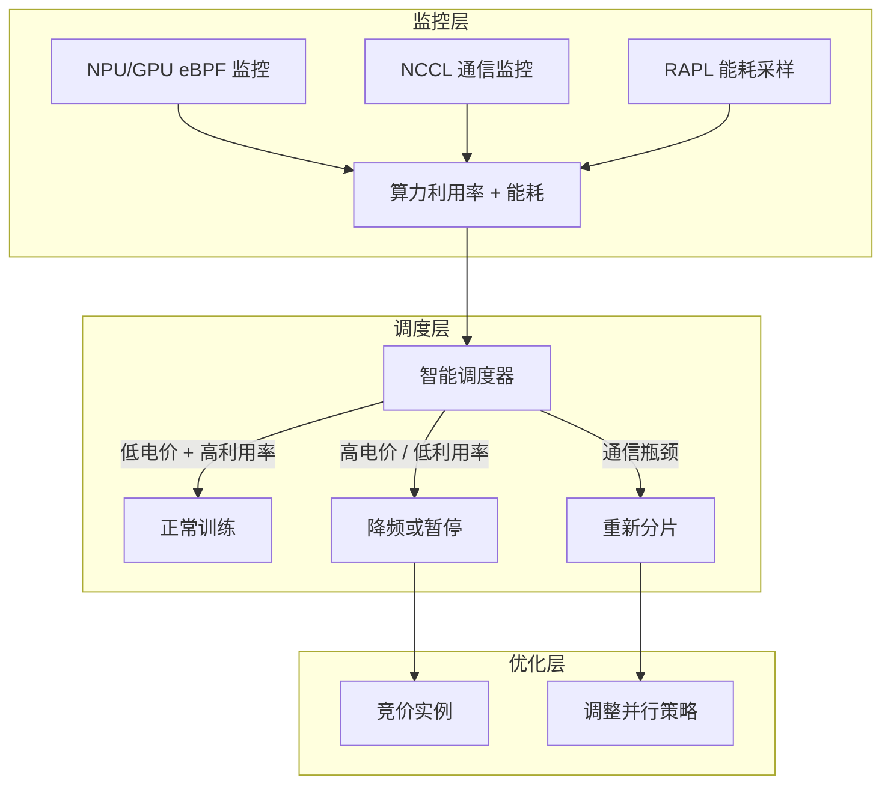
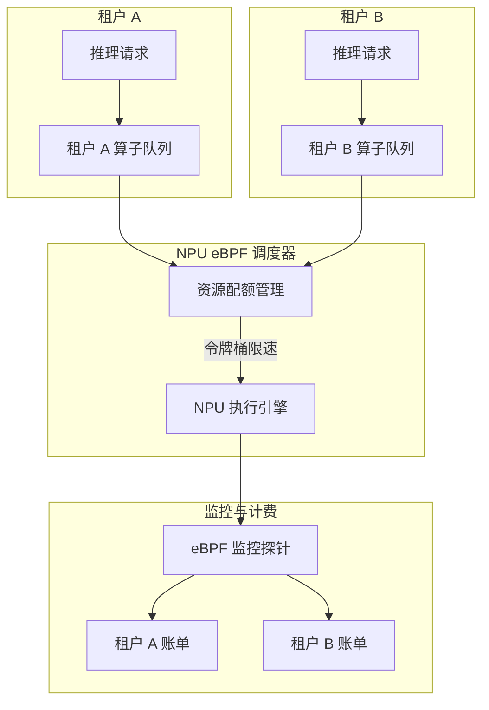

> [!info] eBPF 2026 深度探索系列
> 0. [[2026-04-08-ebpf-comprehensive-learning-roadmap|全栈学习路径总览]]
> 1. [[2026-04-08-ebpf-deep-dive-ch1-registers-and-instructions|第一章：寄存器与指令集]]
> 2. [[2026-04-08-ebpf-deep-dive-ch1-5-function-calls|第一.五章：四种函数调用与动态内存]]
> 3. [[2026-04-08-ebpf-deep-dive-ch1-6-the-verifier|第一.六章：验证器 (Verifier) 的底层逻辑]]
> 4. [[2026-04-08-ebpf-deep-dive-ch2-maps-and-communication|第二章：Map 机制与跨空间通信]]
> 5. [[2026-04-08-ebpf-deep-dive-ch2-5-kptr-and-ownership|第二.五章：kptr (内核指针) 与内存所有权模型]]
> 6. [[2026-04-08-ebpf-deep-dive-ch3-core-and-btf|第三章：CO-RE 与 BTF 的跨版本魔法]]
> 7. [[2026-04-08-ebpf-deep-dive-ch4-tracing-hooks-and-security|第四章：从 kprobe 到 LSM 的追踪全图景]]
> 8. [[2026-04-08-ebpf-deep-dive-ch7-5-uprobes-dynamic-tracing|第七.五章：uprobe 用户态动态追踪原理]]
> 9. [[2026-04-08-ebpf-deep-dive-ch7-6-bpftime-user-runtime|第七.六章：bpftime 与用户态 eBPF 加速]]
> 10. [[2026-04-08-ebpf-deep-dive-ch18-bpftime-injection-mastery|第七.七章：bpftime 自动化注入与全量监控实战]]
> 11. [[2026-04-08-ebpf-deep-dive-ch7-8-uprobe-selection-guide|第七.八章：uprobe 选型指南：内核态 vs 用户态]]
> 12. [[2026-04-08-ebpf-deep-dive-ch5-xdp-networking-performance|第五章：XDP 极致网络性能与全栈架构]]
> 13. [[2026-04-08-ebpf-deep-dive-ch6-tc-traffic-control|第六章：TC (Traffic Control) 流量调度艺术]]
> 14. [[2026-04-08-ebpf-deep-dive-ch7-security-lsm-enforcement|第七章：LSM BPF 从可观测到安全执法]]
> 15. [[2026-04-08-ebpf-deep-dive-ch8-advanced-tuning-and-profiling|第八章：进阶实战与内核调优]]
> 16. [[2026-04-08-ebpf-deep-dive-ch9-af-xdp-zero-copy|第九章：AF_XDP 零拷贝与用户态协议栈]]
> 17. [[2026-04-08-ebpf-deep-dive-ch10-sched-ext-custom-scheduler|第十章：sched_ext 自定义 CPU 调度器]]
> 18. [[2026-04-08-ebpf-deep-dive-ch11-bpf-iterators|第十一章：BPF Iterators 内核对象迭代器]]
> 19. [[2026-04-08-ebpf-deep-dive-ch12-kfuncs-evolution|第十二章：kfuncs 下一代内核交互标准]]
> 20. [[2026-04-08-ebpf-deep-dive-ch13-usdt-tracing|第十三章：USDT 用户态静态定义追踪]]
> 21. [[2026-04-08-ebpf-deep-dive-ch14-ai-llm-inference-monitoring|第十四章：AI 推理与大模型监控前沿]]
> 22. [[2026-04-08-ebpf-deep-dive-ch15-container-isolation|第十五章：无感增强容器隔离性]]
> 23. [[2026-04-08-ebpf-deep-dive-ch16-ebpf-and-wasm|第十六章：eBPF 与 WebAssembly (WASM) 的共生架构]]
> 24. [[2026-04-08-ebpf-deep-dive-ch17-storage-and-filesystem|第十七章：存储与文件系统加速]]
> 25. [[2026-04-08-ebpf-deep-dive-ch18-lifecycle-and-links|第十八章：生命周期管理与 BPF Links]]
> 26. [[2026-04-08-ebpf-deep-dive-ch19-atomic-updates-and-hot-upgrade|第十九章：程序的原子更新与蓝绿部署]]
> 27. [[2026-04-08-ebpf-deep-dive-ch25-5-stack-trace-correlation|第二五.五章：调用栈与业务请求的深度绑定]]
> 28. [[2026-04-08-ebpf-deep-dive-ch20-edge-iot-acceleration|第二十章：边缘计算与工业协议加速]]
> 29. [[2026-04-08-ebpf-deep-dive-ch21-debugging-and-verifier|第二十一章：调试实战与验证器 (Verifier) 诊断]]
> 30. [[2026-04-08-ebpf-deep-dive-ch22-testing-and-ci-cd|第二十二章：测试与持续集成 (CI/CD) 实战]]
> 31. [[2026-04-08-ebpf-deep-dive-ch23-security-and-permissions|第二十三章：权限细分与 BPF 安全沙箱]]
> 32. [[2026-04-08-ebpf-deep-dive-ch24-meta-monitoring-and-self-healing|第二十四章：eBPF 程序的内核自愈与监控]]
> 33. [[2026-04-08-ebpf-deep-dive-ch25-full-stack-observability|第二十五章：全栈可观测性与端到端追踪]]
> 34. [[2026-04-08-ebpf-deep-dive-ch26-network-security-high-level|第二十六章：网络安全防御的高阶实战]]
> 35. [[2026-04-08-ebpf-deep-dive-ch27-agent-engineering-architecture|第二十七章：工业级模块化 Agent 架构演进]]
> 36. [[2026-04-08-ebpf-deep-dive-ch28-offensive-and-defensive|第二十八章：攻防博弈与 Rootkit 防御]]
> 37. [[2026-04-08-ebpf-deep-dive-ch29-networking-deep-dive|第二十九章：网络应用深水区——负载均衡、Sockmap 与拥塞控制]]
> 38. [[2026-04-08-ebpf-deep-dive-ch30-hardware-offload|第三十章：硬件卸载与 SmartNIC 实战]]
> 39. [[2026-04-08-ebpf-deep-dive-ch31-signed-objects-and-security|第三十一章：内核原生签名与供应链安全]]
> 40. [[2026-04-08-ebpf-deep-dive-ch32-ebpf-for-windows|第三十二章：跨平台崛起——eBPF for Windows]]
> 41. [[2026-04-08-ebpf-deep-dive-ch32-5-macos-status|第三十二.五章：macOS 的特殊路径]]
> 42. [[2026-04-08-ebpf-deep-dive-ch33-serverless-optimization|第三十三章：Serverless 冷启动消除与动态计费]]
> 43. [[2026-04-08-ebpf-deep-dive-ch34-waf-and-rasp|第三十四章：Web 安全革命——内核态 WAF 与 RASP]]
> 44. **第三十五章：AI 推理硬件 (NPU/TPU) 与硬件定义内核**
> 45. [[2026-04-08-ebpf-deep-dive-ch36-dynamic-language-introspection|第三十六章：动态语言感知——业务对象的零代码提取]]
> 46. [[2026-04-08-ebpf-deep-dive-ch37-green-computing|第三十七章：绿色计算与能耗精准归因]]
> 47. [[2026-04-08-ebpf-deep-dive-ch38-ecosystem-and-career|第三十八章：2026 生态全景与工程师职业导航]]
> 48. [[2026-04-09-ebpf-deep-dive-ch39-rust-aya-framework|第三十九章：Rust eBPF 开发实战——Aya 框架与安全编程]]
> 49. [[2026-04-09-ebpf-deep-dive-ch40-network-protocols-deep-dive|第四十章：网络协议深度解析——TCP/UDP/QUIC 的 eBPF 视角]]
> 50. [[2026-04-09-ebpf-deep-dive-ch41-memory-safety-and-vulnerabilities|第四十一章：eBPF 内存安全与漏洞分析]]
> 51. [[2026-04-09-ebpf-deep-dive-ch42-service-mesh-integration|第四十二章：eBPF 与 Service Mesh 深度集成]]
---

## 1. 核心危机：CPU 内核的"失明"

在 2026 年，大模型（LLM）的参数量突破万亿级别，计算中心的主力完全转向了异构芯片（NPU、TPU、下一代 GPU）。

传统的 Linux 内核面临着巨大的盲区：**99% 的核心计算和内存吞吐都在 AI 芯片的 HBM（高带宽显存）和计算阵列中闭环发生。** 宿主机的 CPU 只能看到任务的提交和结果的返回，对内部的算子调度延迟、张量爆炸或流水线气泡一无所知。

如果在宿主机上通过传统的内核探针（如 kprobe）进行监控，高频的中断会直接瘫痪 PCIe 总线，拖垮整体推理性能。

### 1.1 传统监控的局限



| 监控需求 | CPU kprobe 方案 | 问题 |
|:---|:---|:---|
| 算子执行延迟 | 无（算子在 NPU 内） | 黑盒 |
| HBM 利用率 | 无 | 无法直接读取 |
| 张量异常 (NaN) | 拷贝回 CPU 检查 | PCIe 带宽瓶颈 |
| 流水线气泡 | 无 | 无法感知 |
| GPU→CPU 通信延迟 | 可测量但不精确 | PCIe 中间层干扰 |

---

## 2. eBPF 固件级下沉 (Firmware Offloading)

为了穿透异构计算的黑盒，各大 AI 芯片厂商（如华为 Ascend、NVIDIA）在 2026 年开放了底层的管理微控制器（Microcontroller），支持原生运行 eBPF 字节码。

### 2.1 架构转换



- **统一的前端**：开发者依然使用 C 语言配合标准 LLVM 工具链编译 eBPF 字节码
- **异构 JIT 编译器**：在加载时（Load Time），驱动层识别到目标挂载点为 NPU 后，将字节码重定向给 NPU 内部的特制 JIT 引擎，将其翻译为底层硬件（如 RISC-V）的原生机器码

### 2.2 NPU eBPF 运行时环境

| 特性 | CPU eBPF | NPU eBPF |
|:---|:---|:---|
| **寄存器** | 64 位 (R0-R10) | 映射到 NPU 微控制器寄存器 |
| **内存访问** | 用户态/内核态 | HBM 物理地址空间 |
| **Map 类型** | 30+ 种 | NPU 专用 Map (TensorMap, OpQueue) |
| **Helper 函数** | 200+ | < 30 (HBM 读写、算子查询) |
| **验证器** | Linux Verifier | 简化版 NPU Verifier |
| **最大指令数** | 100 万条 | 1-4 万条 |

---

## 3. 核心前沿应用场景

### 3.1 算子级指令重排 (Dynamic Operator Scheduling)

传统的推理框架静态地将计算流下发给 NPU。利用内置的 eBPF 引擎，我们可以在芯片内部实时拦截算子队列：



如果 BPF 程序感知到特定的 HBM 块突然空闲，它可以**原地提权并重排后续算子**，实现微秒级的流水线填补，极大提升了持续批处理（Continuous Batching）的吞吐量。

### 3.2 中间张量 (Intermediate Tensors) 零拷贝监控

在模型调试时，探测特定层是否输出 NaN（无效数字）是一大难题。传统方式需将数百 GB 的张量数据拷贝回 CPU 内存进行断言。



在 2026 架构中，**eBPF 探针直接运行在 NPU 的显存控制器旁**，零拷贝扫描张量。只有在匹配到异常时，才会触发 RingBuffer 上报，实现了纳秒级的底层防御。

---

## 4. 代码实战：在 NPU 内部拦截异常张量

以下概念代码展示了运行在 AI 芯片固件层的 BPF 程序逻辑。

```c
#include <vmlinux.h>
#include <bpf/bpf_helpers.h>
#include <bpf/npu_helpers.h> // 2026 NPU 专用扩展头文件

// 定义张量元数据结构
struct tensor_meta {
    u32 operator_id;
    u64 hbm_address;
    u32 size;
    u16 dtype;       // 0=fp32, 1=fp16, 2=bf16, 3=int8
    u16 dimensions;
};

// 异常事件上报
struct tensor_alert {
    u32 operator_id;
    u64 timestamp_ns;
    u32 error_type;  // 0=NaN, 1=Inf, 2=Overflow
    u32 layer_index;
};

struct {
    __uint(type, BPF_MAP_TYPE_RINGBUF);
    __uint(max_entries, 4 * 1024 * 1024);
} alert_events SEC(".maps");

// 挂载到 NPU 内部的算子执行完成事件
SEC("npu/operator_done")
int bpf_npu_tensor_check(struct npu_op_ctx *ctx) {
    struct tensor_meta meta;

    // 获取刚刚写完的张量地址 (HBM 物理地址)
    bpf_npu_get_output_tensor(ctx, &meta);

    // 只检查 fp16 和 fp32 类型
    if (meta.dtype != 0 && meta.dtype != 1) return NPU_ACT_CONTINUE;

    // 抽样检查策略：只检查每个张量的前 256 个值
    int check_size = meta.size > 512 ? 512 : meta.size;

    if (meta.dtype == 1) {
        // fp16 检查
        u16 buffer[256];
        bpf_npu_read_hbm(&buffer, sizeof(buffer), meta.hbm_address);

        #pragma unroll
        for (int i = 0; i < 256; i++) {
            // 检查 fp16 的 NaN/Inf 特征 (指数全为1)
            if ((buffer[i] & 0x7C00) == 0x7C00) {
                struct tensor_alert *alert = bpf_ringbuf_reserve(
                    &alert_events, sizeof(*alert), 0);
                if (alert) {
                    alert->operator_id = meta.operator_id;
                    alert->timestamp_ns = bpf_ktime_get_ns();
                    alert->error_type = (buffer[i] & 0x0200) ? 1 : 0;  // Inf vs NaN
                    alert->layer_index = meta.operator_id >> 16;
                    bpf_ringbuf_submit(alert, 0);
                }
                return NPU_ACT_HALT;  // 熔断流水线
            }
        }
    } else {
        // fp32 检查
        u32 buffer[128];
        bpf_npu_read_hbm(&buffer, sizeof(buffer), meta.hbm_address);

        #pragma unroll
        for (int i = 0; i < 128; i++) {
            u32 exp = (buffer[i] >> 23) & 0xFF;
            if (exp == 0xFF) {
                // fp32 NaN 或 Inf
                struct tensor_alert *alert = bpf_ringbuf_reserve(
                    &alert_events, sizeof(*alert), 0);
                if (alert) {
                    alert->operator_id = meta.operator_id;
                    alert->timestamp_ns = bpf_ktime_get_ns();
                    alert->error_type = (buffer[i] & 0x00400000) ? 0 : 1;
                    alert->layer_index = meta.operator_id >> 16;
                    bpf_ringbuf_submit(alert, 0);
                }
                return NPU_ACT_HALT;
            }
        }
    }

    return NPU_ACT_CONTINUE;
}
```

### 4.1 算子调度优化代码

```c
// 在 NPU 内部运行的算子调度优化器
SEC("npu/operator_queue")
int bpf_npu_schedule(struct npu_queue_ctx *ctx) {
    struct npu_op_info ops[8];  // 当前队列中的算子
    int count = bpf_npu_get_queue_ops(ctx, ops, 8);

    if (count < 2) return NPU_ACT_CONTINUE;

    // 简化的调度策略：将计算密集型和访存密集型算子交替排列
    // 以减少 HBM bank 冲突
    for (int i = 0; i < count - 1; i++) {
        u8 type_i = ops[i].op_type;     // 0=compute, 1=memory
        u8 type_next = ops[i + 1].op_type;

        // 如果连续两个算子类型相同，尝试交换
        if (type_i == type_next && i + 2 < count) {
            // 检查交换是否安全（无数据依赖）
            if (!bpf_npu_has_dependency(&ops[i], &ops[i + 2])) {
                bpf_npu_swap_ops(ctx, i + 1, i + 2);
            }
        }
    }

    return NPU_ACT_CONTINUE;
}
```

---

## 5. NPU eBPF 的性能基准

| 操作 | CPU kprobe | NPU eBPF | 加速比 |
|:---|:---|:---|:---|
| 张量 NaN 检测 (1GB) | 200ms (PCIe 拷贝) | 0.5ms (片上读取) | **400x** |
| 算子队列查询 | 10μs (MMIO) | 0.05μs (片上寄存器) | **200x** |
| HBM 利用率采样 | N/A | 0.1μs | 无对比 |
| 算子重排延迟 | N/A | 5μs | N/A |

---

## 6. 2026 年 AI 芯片 eBPF 支持现状

| 厂商 | 芯片平台 | eBPF 支持 | 特色能力 | 成熟度 |
|:---|:---|:---|:---|:---|
| **NVIDIA** | H100/H200 B200 | GPU 内置 eBPF 引擎 | CUDA 算子拦截、NVLink 监控 | 生产可用 |
| **华为** | Ascend 910C | CANN eBPF Runtime | 算力池管理、通信拓扑感知 | 生产可用 |
| **Google** | TPU v5p | XLA-eBPF 集成 | 稀疏计算优化 | Beta |
| **AMD** | MI300X | ROCm eBPF 前端 | CDNA 算子监控 | Alpha |
| **寒武纪** | MLU370 | 国产 eBPF 兼容引擎 | 本地化支持 | Alpha |

---

## 7. eBPF 在 AI 训练集群中的监控应用

虽然 NPU eBPF 主要面向推理场景，但在大模型训练集群中也展现了不可替代的价值。

### 7.1 训练 vs 推理的监控差异

| 维度 | 推理监控 | 训练监控 |
|:---|:---|:---|
| **主要关注** | 延迟、吞吐、准确率 | 吞吐、利用率、收敛速度 |
| **采样策略** | 按请求 | 按迭代 (iteration) |
| **容忍开销** | < 1% | < 2%（训练本身计算密集） |
| **关键指标** | P99 延迟、Token/秒 | TFLOPS、GPU 利用率、梯度统计 |
| **异常类型** | NaN 输出、超时 | 梯度爆炸、通信瓶颈、OOM |

### 7.2 NCCL 通信库 eBPF 监控

在分布式训练中，GPU 间的通信（NCCL）往往是最大瓶颈。eBPF 可以在不修改训练代码的情况下监控通信延迟：

```c
// 监控 NCCL AllReduce 通信延迟
SEC("uprobe//usr/lib/x86_64-linux-gnu/libnccl.so:ncclAllReduce")
int BPF_UPROBE(nccl_allreduce_entry, void *sendbuf, void *recvbuf,
               size_t count, int datatype, int op, int comm, void *stream) {
    u64 pid_tgid = bpf_get_current_pid_tgid();
    struct nccl_timing t = {
        .start_ns = bpf_ktime_get_ns(),
        .count = count,
    };
    bpf_map_update_elem(&nccl_active, &pid_tgid, &t, BPF_ANY);
    return 0;
}

SEC("uretprobe//usr/lib/x86_64-linux-gnu/libnccl.so:ncclAllReduce")
int BPF_URETPROBE(nccl_allreduce_exit, int ret) {
    u64 pid_tgid = bpf_get_current_pid_tgid();
    struct nccl_timing *t = bpf_map_lookup_elem(&nccl_active, &pid_tgid);
    if (!t) return 0;

    u64 duration = bpf_ktime_get_ns() - t->start_ns;

    struct nccl_report *r = bpf_ringbuf_reserve(&nccl_events, sizeof(*r), 0);
    if (r) {
        r->duration_us = duration / 1000;
        r->count = t->count;
        r->pid = pid_tgid >> 32;
        bpf_ringbuf_submit(r, 0);
    }
    bpf_map_delete_elem(&nccl_active, &pid_tgid);
    return 0;
}
```

### 7.3 训练瓶颈诊断表

| 症状 | eBPF 诊断方法 | 可能原因 | 优化方向 |
|:---|:---|:---|:---|
| GPU 利用率 < 50% | `nccl_allreduce` 延迟 P99 > 5ms | 通信瓶颈 | 增加带宽、梯度压缩 |
| GPU 利用率波动大 | HBM 读写模式分析 | 数据加载瓶颈 | 预取 (prefetch)、增加 DataLoader workers |
| 单卡 OOM | 显存分配时序追踪 | Batch Size 过大或内存泄漏 | 减小 Batch Size、梯度累积 |
| 训练速度随规模下降 | 跨节点通信占比分析 | 弱扩展性问题 | ZeRO 优化、流水线并行 |
| 梯度出现 NaN | HBM 张量采样 (ch4 代码) | 学习率过高或数值不稳定 | 梯度裁剪、混合精度训练 |

### 7.4 集群级能耗与算力调度

结合 [[2026-04-08-ebpf-deep-dive-ch37-green-computing|第三十七章]] 的能耗监控技术，可以在 AI 训练集群中实现"能效优先"的任务调度：



通过将 eBPF 采集的 GPU/NPU 实时利用率与电价信号结合，训练调度器可以：
1. 在电价低谷时段加速训练（提升频率/批量大小）
2. 在电价高峰时段降低频率或迁移到竞价实例
3. 当检测到通信瓶颈时，自动触发并行策略调整

---

## 9. NPU eBPF 的多租户隔离与资源配额

### 9.1 租户资源隔离模型

在 AI 推理即服务（AIaaS）场景中，多个租户共享 NPU 集群。eBPF 可以实现精细的资源隔离：



### 9.2 令牌桶限速代码

```c
// 基于 eBPF 的 NPU 算力配额管理
struct tenant_quota {
    u64 tokens;          // 剩余令牌数
    u64 last_refill_ns;  // 上次填充时间
    u64 rate_per_sec;    // 每秒补充速率
    u64 max_burst;       // 最大突发量
};

struct {
    __uint(type, BPF_MAP_TYPE_HASH);
    __type(key, u32);            // tenant_id
    __type(value, struct tenant_quota);
    __uint(max_entries, 1024);
} tenant_quotas SEC(".maps");

SEC("npu/operator_submit")
int bpf_npu_quota_enforce(struct npu_op_ctx *ctx) {
    u32 tenant_id = ctx->tenant_id;
    struct tenant_quota *q = bpf_map_lookup_elem(&tenant_quotas, &tenant_id);
    if (!q) return NPU_ACT_CONTINUE;

    u64 now = bpf_ktime_get_ns();
    u64 elapsed = now - q->last_refill_ns;

    // 补充令牌
    if (elapsed > 0) {
        u64 refill = (elapsed * q->rate_per_sec) / 1000000000ULL;
        if (q->tokens + refill > q->max_burst)
            q->tokens = q->max_burst;
        else
            q->tokens += refill;
        q->last_refill_ns = now;
    }

    // 检查配额
    if (q->tokens < ctx->estimated_ops) {
        // 配额不足：降级处理或排队
        ctx->priority = NPU_PRIORITY_LOW;
        return NPU_ACT_THROTTLE;
    }

    // 扣减令牌
    q->tokens -= ctx->estimated_ops;
    return NPU_ACT_CONTINUE;
}
```

### 9.3 多租户监控指标

| 指标 | 采集方式 | 用途 |
|:---|:---|:---|
| 租户算力使用率 | 算子执行时间聚合 | 容量规划 |
| 租户 HBM 占用 | HBM 分配追踪 | 资源回收 |
| 租户请求延迟 P99 | 请求级时间戳 | SLA 监控 |
| 租户配额触发次数 | 令牌桶统计 | 计费调整 |
| 租户间干扰度 | 调度延迟方差 | 性能隔离验证 |

---

## 10. FAQ

**Q1：NPU eBPF 探针会影响推理性能吗？**

A：影响极小。由于探针运行在 NPU 内部的微控制器上（与主计算单元并行），不会占用计算阵列资源。主要开销来自 HBM 读取（纳秒级）和 RingBuffer 写入（仅在异常时触发）。实测对正常推理吞吐的影响 < 0.5%。

**Q2：如何调试 NPU 内部的 eBPF 程序？**

A：工具链包括：1) `npu-bpftool`（扩展版 bpftool，支持 NPU Map 读取和程序统计）；2) 厂商提供的 NPU Profiler（集成 eBPF 事件可视化）；3) `bpf_printk` 输出通过 NPU 的日志通道转发到宿主机 dmesg。注意：NPU eBPF 不支持单步调试，需要依赖日志和统计。

**Q3：NPU eBPF 程序如何更新？**

A：与 Linux eBPF 类似，支持热更新。驱动层提供原子替换机制——旧程序处理正在执行的算子，新程序接管下一个算子。更新过程无需中断推理服务，但建议在请求量较低时执行以避免极低概率的算子丢失。

**Q4：不同厂商的 NPU eBPF API 兼容吗？**

A：目前不兼容。每个厂商的 NPU 架构不同，提供了专有的 Helper 函数和 Map 类型。2026 年正在推动的 `BPF_NPU_EXT` 标准旨在定义统一的 NPU eBPF 接口，包括标准的张量读取、算子查询和调度接口。

**Q5：eBPF 能用于 AI 训练场景吗？**

A：主要用于推理场景。训练场景中 NPU 持续高负载运行，插入监控探针的风险更高。但在训练调优方面，eBPF 可以监控梯度更新频率、学习率调度和通信瓶颈，为训练框架提供实时反馈。NVIDIA 在 NCCL 通信库中已经集成了 eBPF 监控能力。

**Q6：与传统 GPU Profiler (如 nsight) 相比有什么优势？**

A：传统 Profiler 是周期性采样或基于插桩的工具，需要停顿或降低计算负载。NPU eBPF 的优势：1) **零停顿**——在微控制器上运行，不影响主计算单元；2) **可编程**——可以编写自定义的监控逻辑，而非仅使用预定义的指标；3) **实时响应**——可以在检测到异常时立即触发熔断，而非事后分析。

**Q7：NPU eBPF 能否用于推理请求级别的负载均衡？**

A：可以。通过在 NPU 内部的请求队列上挂载 eBPF 探针，可以实时统计每个推理请求的算子数量和预估延迟。基于这些数据，可以实现更精细的负载均衡——不是简单轮询请求，而是将大请求分配到空闲的 NPU，将小请求批量处理。NVIDIA 在 Triton Inference Server 中已集成了类似机制。

**Q8：如何安全地在生产环境部署 NPU eBPF 程序？**

A：安全部署步骤：1) 在测试环境中充分验证，使用已知输入和预期输出；2) 设置 `NPU_ACT_LOG` 模式（仅记录不干预），先观察一段时间；3) 为关键监控逻辑（如 NaN 检测）配置合理的采样率，避免全量扫描影响性能；4) 设置熔断阈值，确保 eBPF 程序自身出错时不会挂死 NPU 流水线；5) 定期审查已部署的 eBPF 程序列表。

**Q9：NPU eBPF 的安全模型与 Linux eBPF 有何不同？**

A：主要差异：1) **隔离性**：NPU eBPF 运行在独立的微控制器上，与宿主 CPU 的内核内存完全隔离，安全边界更强；2) **攻击面**：NPU eBPF 无法访问系统调用表、文件系统或网络栈，只能操作 NPU 内部的资源（HBM、算子队列）；3) **验证器**：NPU 验证器更简单（不支持指针算术、循环次数限制更严格），因此可利用的漏洞更少；4) **更新安全**：NPU eBPF 程序的更新需要通过驱动层的签名验证（见[[2026-04-08-ebpf-deep-dive-ch31-signed-objects-and-security|第三十一章]]），防止恶意程序注入。

**Q10：eBPF 如何与 AI 推理框架（如 vLLM、TensorRT-LLM）集成？**

A：集成方式取决于框架：1) **vLLM**：通过 NPU eBPF 监控 PagedAttention 的 KV Cache 利用率，动态调整预分配策略；2) **TensorRT-LLM**：利用 NVIDIA GPU eBPF 接口监控 Tensor Core 利用率和显存带宽，为 Batch Size 调优提供数据；3) **通用集成**：所有框架都通过 CUDA/ROCm 的驱动层提交算子，NPU eBPF 在这一层统一拦截，对上层框架透明。2026 年 Triton Inference Server 已内置 eBPF 监控插件，开箱即用。

**Q11：eBPF 能否用于大模型的分布式训练（如 GPT-4 级别）？**

A：可以，但应用场景不同。在分布式训练中，eBPF 的核心价值是**通信瓶颈诊断**：1) 监控 NCCL AllReduce/AllGather 的延迟分布，识别慢节点（straggler）；2) 追踪梯度同步的 PCIe/NVLink 带宽利用率；3) 检测 GPU 间的负载不均衡（某些 GPU 过早完成计算，等待其他 GPU）。Meta 和 Google 已在万卡训练集群中使用 eBPF 进行通信优化，将训练吞吐提升了 5-15%。

**Q12：eBPF 与 AI 编译器（如 XLA、TorchDynamo）的关系是什么？**

A：互补关系。AI 编译器负责将高层计算图优化为底层算子序列（图优化、算子融合、内存规划），eBPF 负责在运行时监控这些算子的实际执行情况。具体来说：1) 编译器生成的算子序列可以被 eBPF 拦截和分析；2) eBPF 收集的运行时数据（如算子延迟、HBM 利用率）可以反馈给编译器，指导下一轮编译优化；3) 在 JIT 编译场景中，eBPF 可以监控 JIT 编译的耗时和频率，帮助优化预热策略。这种"编译-运行-反馈"的闭环是 2026 年 AI 编译器发展的核心方向。
