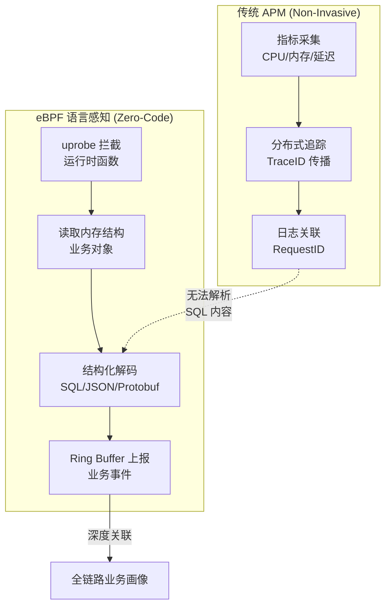
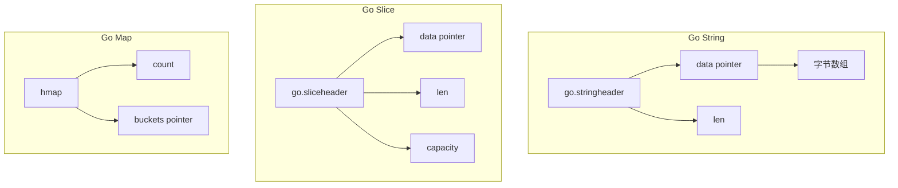
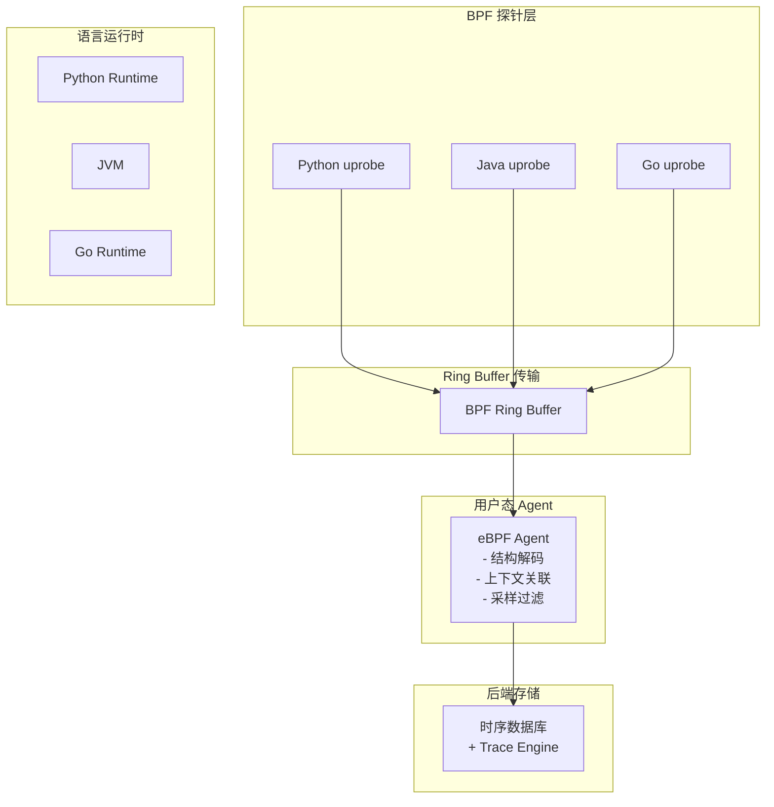

> [!info] eBPF 2026 深度探索系列
> 0. [[2026-04-08-ebpf-comprehensive-learning-roadmap|全栈学习路径总览]]
> 1. [[2026-04-08-ebpf-deep-dive-ch1-registers-and-instructions|第一章：寄存器与指令集]]
> 2. [[2026-04-08-ebpf-deep-dive-ch1-5-function-calls|第一.五章：四种函数调用与动态内存]]
> 3. [[2026-04-08-ebpf-deep-dive-ch1-6-the-verifier|第一.六章：验证器 (Verifier) 的底层逻辑]]
> 4. [[2026-04-08-ebpf-deep-dive-ch2-maps-and-communication|第二章：Map 机制与跨空间通信]]
> 5. [[2026-04-08-ebpf-deep-dive-ch2-5-kptr-and-ownership|第二.五章：kptr (内核指针) 与内存所有权模型]]
> 6. [[2026-04-08-ebpf-deep-dive-ch3-core-and-btf|第三章：CO-RE 与 BTF 的跨版本魔法]]
> 7. [[2026-04-08-ebpf-deep-dive-ch4-tracing-hooks-and-security|第四章：从 kprobe 到 LSM 的追踪全图景]]
> 8. [[2026-04-08-ebpf-deep-dive-ch7-5-uprobes-dynamic-tracing|第七.五章：uprobe 用户态动态追踪原理]]
> 9. [[2026-04-08-ebpf-deep-dive-ch7-6-bpftime-user-runtime|第七.六章：bpftime 与用户态 eBPF 加速]]
> 10. [[2026-04-08-ebpf-deep-dive-ch18-bpftime-injection-mastery|第七.七章：bpftime 自动化注入与全量监控实战]]
> 11. [[2026-04-08-ebpf-deep-dive-ch7-8-uprobe-selection-guide|第七.八章：uprobe 选型指南：内核态 vs 用户态]]
> 12. [[2026-04-08-ebpf-deep-dive-ch5-xdp-networking-performance|第五章：XDP 极致网络性能与全栈架构]]
> 13. [[2026-04-08-ebpf-deep-dive-ch6-tc-traffic-control|第六章：TC (Traffic Control) 流量调度艺术]]
> 14. [[2026-04-08-ebpf-deep-dive-ch7-security-lsm-enforcement|第七章：LSM BPF 从可观测到安全执法]]
> 15. [[2026-04-08-ebpf-deep-dive-ch8-advanced-tuning-and-profiling|第八章：进阶实战与内核调优]]
> 16. [[2026-04-08-ebpf-deep-dive-ch9-af-xdp-zero-copy|第九章：AF_XDP 零拷贝与用户态协议栈]]
> 17. [[2026-04-08-ebpf-deep-dive-ch10-sched-ext-custom-scheduler|第十章：sched_ext 自定义 CPU 调度器]]
> 18. [[2026-04-08-ebpf-deep-dive-ch11-bpf-iterators|第十一章：BPF Iterators 内核对象迭代器]]
> 19. [[2026-04-08-ebpf-deep-dive-ch12-kfuncs-evolution|第十二章：kfuncs 下一代内核交互标准]]
> 20. [[2026-04-08-ebpf-deep-dive-ch13-usdt-tracing|第十三章：USDT 用户态静态定义追踪]]
> 21. [[2026-04-08-ebpf-deep-dive-ch14-ai-llm-inference-monitoring|第十四章：AI 推理与大模型监控前沿]]
> 22. [[2026-04-08-ebpf-deep-dive-ch15-container-isolation|第十五章：无感增强容器隔离性]]
> 23. [[2026-04-08-ebpf-deep-dive-ch16-ebpf-and-wasm|第十六章：eBPF 与 WebAssembly (WASM) 的共生架构]]
> 24. [[2026-04-08-ebpf-deep-dive-ch17-storage-and-filesystem|第十七章：存储与文件系统加速]]
> 25. [[2026-04-08-ebpf-deep-dive-ch18-lifecycle-and-links|第十八章：生命周期管理与 BPF Links]]
> 26. [[2026-04-08-ebpf-deep-dive-ch19-atomic-updates-and-hot-upgrade|第十九章：程序的原子更新与蓝绿部署]]
> 27. [[2026-04-08-ebpf-deep-dive-ch25-5-stack-trace-correlation|第二五.五章：调用栈与业务请求的深度绑定]]
> 28. [[2026-04-08-ebpf-deep-dive-ch20-edge-iot-acceleration|第二十章：边缘计算与工业协议加速]]
> 29. [[2026-04-08-ebpf-deep-dive-ch21-debugging-and-verifier|第二十一章：调试实战与验证器 (Verifier) 诊断]]
> 30. [[2026-04-08-ebpf-deep-dive-ch22-testing-and-ci-cd|第二十二章：测试与持续集成 (CI/CD) 实战]]
> 31. [[2026-04-08-ebpf-deep-dive-ch23-security-and-permissions|第二十三章：权限细分与 BPF 安全沙箱]]
> 32. [[2026-04-08-ebpf-deep-dive-ch24-meta-monitoring-and-self-healing|第二十四章：eBPF 程序的内核自愈与监控]]
> 33. [[2026-04-08-ebpf-deep-dive-ch25-full-stack-observability|第二十五章：全栈可观测性与端到端追踪]]
> 34. [[2026-04-08-ebpf-deep-dive-ch26-network-security-high-level|第二十六章：网络安全防御的高阶实战]]
> 35. [[2026-04-08-ebpf-deep-dive-ch27-agent-engineering-architecture|第二十七章：工业级模块化 Agent 架构演进]]
> 36. [[2026-04-08-ebpf-deep-dive-ch28-offensive-and-defensive|第二十八章：攻防博弈与 Rootkit 防御]]
> 37. [[2026-04-08-ebpf-deep-dive-ch29-networking-deep-dive|第二十九章：网络应用深水区——负载均衡、Sockmap 与拥塞控制]]
> 38. [[2026-04-08-ebpf-deep-dive-ch30-hardware-offload|第三十章：硬件卸载与 SmartNIC 实战]]
> 39. [[2026-04-08-ebpf-deep-dive-ch31-signed-objects-and-security|第三十一章：内核原生签名与供应链安全]]
> 40. [[2026-04-08-ebpf-deep-dive-ch32-ebpf-for-windows|第三十二章：跨平台崛起——eBPF for Windows]]
> 41. [[2026-04-08-ebpf-deep-dive-ch32-5-macos-status|第三十二.五章：macOS 的特殊路径]]
> 42. [[2026-04-08-ebpf-deep-dive-ch33-serverless-optimization|第三十三章：Serverless 冷启动消除与动态计费]]
> 43. [[2026-04-08-ebpf-deep-dive-ch34-waf-and-rasp|第三十四章：Web 安全革命——内核态 WAF 与 RASP]]
> 44. [[2026-04-08-ebpf-deep-dive-ch35-npu-tpu-ai-hardware|第三十五章：AI 推理硬件 (NPU/TPU) 与硬件定义内核]]
> 45. **第三十六章：动态语言感知——业务对象的零代码提取**
> 46. [[2026-04-08-ebpf-deep-dive-ch37-green-computing|第三十七章：绿色计算与能耗精准归因]]
> 47. [[2026-04-08-ebpf-deep-dive-ch38-ecosystem-and-career|第三十八章：2026 生态全景与工程师职业导航]]
> 48. [[2026-04-09-ebpf-deep-dive-ch39-rust-aya-framework|第三十九章：Rust eBPF 开发实战——Aya 框架与安全编程]]
> 49. [[2026-04-09-ebpf-deep-dive-ch40-network-protocols-deep-dive|第四十章：网络协议深度解析——TCP/UDP/QUIC 的 eBPF 视角]]
> 50. [[2026-04-09-ebpf-deep-dive-ch41-memory-safety-and-vulnerabilities|第四十一章：eBPF 内存安全与漏洞分析]]
> 51. [[2026-04-09-ebpf-deep-dive-ch42-service-mesh-integration|第四十二章：eBPF 与 Service Mesh 深度集成]]
---

## 1. 概述：为什么需要动态语言感知？

传统的可观测性工具只能告诉你"哪个函数慢了"，但无法告诉你"慢是因为什么 SQL 查询"或"这个 HTTP 请求携带了哪些业务参数"。

动态语言感知 (Dynamic Language Introspection) 通过 eBPF 深入运行时内部，在**不修改业务代码**的情况下提取任意业务对象——SQL 语句、HTTP 请求体、序列化后的业务数据。

### 1.1 传统 APM vs eBPF 语言感知



### 1.2 支持的语言与提取场景

| 语言 | 运行时 | 可提取对象 | 技术手段 |
|:---|:---|:---|:---|
| **Python** | CPython 3.8+ | SQLAlchemy Query, Django Request, Pydantic Model | uprobe + PyObject 遍历 |
| **Java** | JVM (HotSpot) | JDBC SQL, HttpServletRequest, Dubbo Args | uprobe + JNI 反射 |
| **Go** | Go Runtime | database/sql Query, net/http Request, gRPC | uprobe + 运行时符号表 |
| **Node.js** | V8 | SQL Queries, HTTP Request/Response | uprobe + V8 API |
| **Ruby** | CRuby | ActiveRecord Query, Rack Env | uprobe + Ractor/VM 结构 |

---

## 2. Python 动态提取：CPython 内存模型

### 2.1 CPython 对象模型概述

Python 的核心对象都在堆上分配，`PyObject` 是所有对象的头结构：

```c
// CPython 3.11+ PyObject 结构
typedef struct _object {
    PyObject_HEAD  // ob_refcnt + ob_type
} PyObject;

#define PyObject_HEAD \
    Py_ssize_t ob_refcnt; \
    struct _typeobject *ob_type;
```

关键点：
- `ob_type` 指向类型对象，类型对象包含 `tp_name`（如 `"str"`, `"dict"`）
- `ob_refcnt` 是引用计数，通过追踪它可以分析对象生命周期
- 字符串对象的 `ob_sval` 存储实际字符数据

### 2.2 Python 字符串提取

```c
#include <vmlinux.h>
#include <bpf/bpf_helpers.h>

// 提取 Python 字符串内容的 BPF 程序
SEC("uprobe/python3:_PyUnicode_Trim")
intBPF_KPROBE(pystr_trim, PyObject *self) {
    // 获取 PyObject 的类型指针
    struct _typeobject *type = *(struct _typeobject **)(self + offsetof(PyObject, ob_type));
    if (!type || !type->tp_name) return 0;

    // 只处理 str 类型
    if (bpf_strncmp(type->tp_name, 3, "str") != 0) return 0;

    // Python 3.11+ 使用 compact string，字符数据紧跟在对象头后面
    Py_ssize_t length = *(Py_ssize_t *)(self + offsetof(PyVarObject, ob_size));
    char *char_data = (char *)(self + sizeof(PyObject));

    // 读取字符串内容（限制长度避免 verifier 拒绝）
    char buf[128];
    u32 copy_len = length < 127 ? length : 127;
    bpf_probe_read_user(buf, copy_len, char_data);
    buf[127] = '\0';

    bpf_printk("Python str: %s (len=%d)", buf, length);
    return 0;
}
```

### 2.3 SQLAlchemy Query 对象提取

```c
// 拦截 SQLAlchemy 的 _compile 方法获取 SQL 语句
SEC("uprobe/usr/lib/python3.11/site-packages/sqlalchemy/sql/base.c:ClauseElement.__str__")
int BPF_KPROBE(sqla_query_str, void *self) {
    // SQLAlchemy Query 对象内部结构：
    // - self->_result : 查询结果
    // - self->_statement : 底层 SQLAlchemy AST

    // 读取 _statement 指针
    void *stmt = *(void **)(self + 0x18);
    if (!stmt) return 0;

    // 获取 statement 类型名称
    struct _typeobject *type = *(struct _typeobject **)(stmt + offsetof(PyObject, ob_type));
    if (!type || !type->tp_name) return 0;

    // 尝试调用对象的 __str__ 方法（通过运行时查找）
    // 实际中需要查找 _PyObject_CallMethodIdNoArgs

    bpf_printk("SQLAlchemy stmt type: %s", type->tp_name);
    return 0;
}
```

---

## 3. Java 动态提取：JVM 内部结构

### 3.1 JVM 对象布局概述

JVM 堆中的对象布局分为：
- **普通对象**: 对象头 (Mark Word + Klass Pointer) + 实例字段
- **数组对象**: 对象头 + 数组长度 + 元素数据

```mermaid
graph TB
    subgraph "Java Object Layout"
        Header[对象头<br>Mark Word (8B) + Klass (8B)]
        Fields[实例字段<br>int, long, reference...]
    end

    subgraph "String Object"
        HeaderS[String 对象头]
        FieldsS[char[] value<br>int hash]
    end
```

### 3.2 JNI 反射读取 Java String

```c
#include <vmlinux.h>
#include <bpf/bpf_helpers.h>

// 读取 Java String 内容（通过 JNI 规则）
SEC("uprobe/libjvm.so:JNI_NewStringUTF")
int BPF_KPROBE(jni_new_string, JNIEnv *env, const char *bytes, jsize len) {
    // bytes 是 UTF-8 编码的字符串
    char buf[256];
    u32 copy_len = len < 255 ? len : 255;
    bpf_probe_read_user(buf, copy_len, bytes);
    buf[255] = '\0';

    // 上报捕获的字符串
    bpf_printk("JNI String: %s", buf);
    return 0;
}

// 拦截 JDBC 执行
SEC("uprobe/libjvm.so:Java_com_mysql_cj_jdbc_ClientPreparedStatement_executeQuery")
int BPF_KPROBE(jdbc_execute, JNIEnv *env, jobject this, jstring sql) {
    // 获取 JNIEnv 的函数表
    JNIEnv_Impl *env_impl = (JNIEnv_Impl *)env;

    // 调用 GetStringUTFChars 获取 SQL
    const char *sql_utf = env_impl->GetStringUTFChars(env, sql, NULL);
    if (sql_utf) {
        char buf[512];
        bpf_probe_read_user_str(buf, sizeof(buf), sql_utf);
        bpf_printk("JDBC SQL: %s", buf);
        env_impl->ReleaseStringUTFChars(env, sql, sql_utf);
    }
    return 0;
}
```

### 3.3 Spring Boot 请求参数提取

```c
// 拦截 Spring DispatcherServlet
SEC("uprobe/usr/lib/jvm/java-17-openjdk/libjvm.so:Java_org_springframework_web_method_ServletInvocableHandlerMethod_invokeAndHandle")
int BPF_KPROBE(spring_invoke, JNIEnv *env, jobject handlerMethod, jobject request, jobject response) {
    // 获取 HttpServletRequest 的方法、URI、参数
    JNIEnv_Impl *env_impl = (JNIEnv_Impl *)env;

    // 获取 request.getMethod()
    jmethodID getMethod = env_impl->GetMethodID(env,
        env_impl->FindClass(env, "javax/servlet/http/HttpServletRequest"),
        "getMethod", "()Ljava/lang/String;");
    jstring method = (jstring)env_impl->CallObjectMethod(env, request, getMethod);

    // 获取 request.getRequestURI()
    jmethodID getURI = env_impl->GetMethodID(env,
        env_impl->FindClass(env, "javax/servlet/http/HttpServletRequest"),
        "getRequestURI", "()Ljava/lang/String;");
    jstring uri = (jstring)env_impl->CallObjectMethod(env, request, getURI);

    // 上报 Spring MVC 请求
    if (method && uri) {
        const char *method_str = env_impl->GetStringUTFChars(env, method, NULL);
        const char *uri_str = env_impl->GetStringUTFChars(env, uri, NULL);
        bpf_printk("Spring: %s %s", method_str, uri_str);
        env_impl->ReleaseStringUTFChars(env, method, method_str);
        env_impl->ReleaseStringUTFChars(env, uri, uri_str);
    }
    return 0;
}
```

---

## 4. Go 运行时符号表提取

### 4.1 Go 运行时内存结构

Go 的垃圾回收器 (GC) 和运行时维护了复杂的数据结构，但 Go 的符号表比 Python/Java 更规整：



### 4.2 Go SQL Query 提取

```c
#include <vmlinux.h>
#include <bpf/bpf_helpers.h>

// Go string 结构（64-bit）
struct go_string {
    char *str;       // 指针
    go_int len;      // 长度
};

// database/sql 包的 SQL 节点
struct sqlNode {
    void *sql;            // go_string
    void *nodes;          // slice of sqlNode
    int numInput;
};

// 提取 database/sql 执行的 SQL
SEC("uprobe/go/usr/local/go/src/database/sql/sql.go:execStmt")
int BPF_KPROBE(go_sql_exec, void *ctx, struct sqlNode *node) {
    if (!node || !node->sql) return 0;

    struct go_string *query = (struct go_string *)node->sql;
    if (!query->str || query->len <= 0) return 0;

    // 读取 SQL 字符串（安全长度限制）
    char sql_buf[256];
    u32 copy_len = query->len < 255 ? query->len : 255;
    bpf_probe_read_user(sql_buf, copy_len, query->str);
    sql_buf[255] = '\0';

    bpf_printk("Go SQL: %s", sql_buf);
    return 0;
}

// 提取 net/http 请求
SEC("uprobe/go/usr/local/go/src/net/http/server.go:serveHTTP")
int BPF_KPROBE(go_http_serve, void *ctx, struct go_string *method, struct go_string *path) {
    if (!method || !path) return 0;

    char method_buf[16], path_buf[256];
    bpf_probe_read_user(method_buf, sizeof(method_buf), method->str);
    bpf_probe_read_user(path_buf, sizeof(path_buf), path->str);

    bpf_printk("Go HTTP: %s %s", method_buf, path_buf);
    return 0;
}
```

---

## 5. 结构化解码：SQL/JSON/Protobuf

### 5.1 SQL 解析与脱敏

```c
#include <vmlinux.h>
#include <bpf/bpf_helpers.h>

// 常见的 SQL 敏感关键词
const char *sql_sensitive[] = {
    "password", "passwd", "secret", "token", "api_key", "apikey",
    "ssn", "credit_card", "cvv", "pin"
};

struct {
    __uint(type, BPF_MAP_TYPE_ARRAY);
    __uint(max_entries, 32);
    __type(key, u32);
    __type(value, char[64]);
} sql_token_map SEC(".maps");

// SQL 脱敏 BPF 程序
SEC("uprobe")
int BPF_KPROBE(sql_capture, char *sql_query) {
    char buf[512];
    bpf_probe_read_user_str(buf, sizeof(buf), sql_query);

    // 检查是否包含敏感字段
    #pragma unroll
    for (int i = 0; i < 10; i++) {
        char *pattern = (char *)sql_sensitive[i];
        int pos = bpf_mem_search(buf, sizeof(buf), pattern, bpf_strlen(pattern), 0);
        if (pos >= 0) {
            // 脱敏处理：将敏感词替换为 ***
            // 注意：BPF 中不能直接修改字符串，这里只是标记
            bpf_printk("SQL contains sensitive field at pos %d", pos);
        }
    }

    // 通过 Ring Buffer 上报
    struct sql_event {
        u64 timestamp;
        u32 pid;
        char query[256];
    };

    struct sql_event *ev = bpf_ringbuf_reserve(&sql_events, sizeof(*ev), 0);
    if (ev) {
        ev->timestamp = bpf_ktime_get_ns();
        ev->pid = bpf_get_current_pid_tgid() >> 32;
        bpf_probe_read_user_str(ev->query, sizeof(ev->query), sql_query);
        bpf_ringbuf_submit(ev, 0);
    }

    return 0;
}
```

### 5.2 JSON 请求体解析

```c
// 捕获 JSON 请求体并提取关键字段
SEC("uprobe")
int BPF_KPROBE(json_capture, char *json_body, int len) {
    char buf[1024];
    bpf_probe_read_user_str(buf, sizeof(buf), json_body);

    // 简单 JSON 字段检测（使用 mem_search）
    // 寻找 "user_id": 模式
    char user_id_pattern[] = "user_id\":";
    int pos = bpf_mem_search(buf, sizeof(buf), user_id_pattern, sizeof(user_id_pattern) - 1, 0);
    if (pos >= 0) {
        // 提取 user_id 值
        char *value_start = buf + pos + sizeof(user_id_pattern) - 1;
        char user_id[32];
        bpf_probe_read_user(user_id, sizeof(user_id), value_start);
        bpf_printk("JSON user_id: %s", user_id);
    }

    return 0;
}
```

---

## 6. 生产级架构：零代码追踪平台

### 6.1 整体架构



### 6.2 探针自动注入

```yaml
# 自动探针注入配置
apiVersion: cilium.io/v1alpha1
kind: EBPFProgram
metadata:
  name: python-sql-trace
spec:
  # 目标语言
  language: python
  # 目标库
  library: libpython3.11.so
  # 探针函数
  function: _PyEval_EvalFrameDefault
  # 提取器配置
  extractor:
    type: sql_query
    encoding: utf-8
  # 采样率
  sampling:
    rate: 0.01  # 1% 采样
    burst: 10
  # 过滤条件
  filter:
    - app_label: web-server
    - environment: production
```

### 6.3 上下文关联

eBPF 提取的业务事件需要与分布式追踪上下文关联：

```c
// 从 HTTP Header 中提取 TraceID
SEC("uprobe")
int BPF_KPROBE(extract_trace_context, char *header_value) {
    char buf[64];
    bpf_probe_read_user_str(buf, sizeof(buf), header_value);

    // 检查是否是 traceparent header (W3C Trace Context)
    if (bpf_strncmp(buf, 10, "00-") == 0) {
        // 提取 trace-id (buf[3:35])
        char trace_id[33];
        #pragma unroll
        for (int i = 0; i < 32; i++) {
            trace_id[i] = buf[3 + i];
        }
        trace_id[32] = '\0';

        // 与业务事件关联
        u32 pid = bpf_get_current_pid_tgid() >> 32;
        struct trace_ctx {
            char trace_id[33];
            u64 span_id;
        } ctx;

        bpf_probe_read_user_str(ctx.trace_id, sizeof(ctx.trace_id), trace_id);
        bpf_map_update_elem(&trace_context, &pid, &ctx, BPF_ANY);
    }
    return 0;
}
```

---

## 7. 性能影响与优化策略

### 7.1 追踪点选择原则

| 策略 | 适用场景 | 开销 | 示例 |
|:---|:---|:---|:---|
| **高频追踪** | 入口/出口点 | 低 | `__enter__`, 函数入口 |
| **中频追踪** | 关键业务点 | 中 | SQL 执行, HTTP 请求 |
| **低频追踪** | 异常/慢请求 | 低 | 错误日志, >1s 请求 |

### 7.2 采样策略

```c
// 基于令牌桶的采样 BPF 程序
struct {
    __uint(type, BPF_MAP_TYPE_HASH);
    __uint(max_entries, 10240);
    __type(key, u32);  // pid
    __type(value, u64); // last_sample_ns
} sample_bucket SEC(".maps");

SEC("uprobe/expensive_operation")
int BPF_KPROBE(sample_expensive_op, void *arg1) {
    u32 pid = bpf_get_current_pid_tgid() >> 32;
    u64 now = bpf_ktime_get_ns();
    u64 *last = bpf_map_lookup_elem(&sample_bucket, &pid);

    // 每秒最多采样 100 次
    if (last && now - *last < 10_000_000) {  // 10ms = 100/s
        return 0;  // 跳过
    }

    // 执行实际的追踪逻辑...
    bpf_map_update_elem(&sample_bucket, &pid, &now, BPF_ANY);
    return 0;
}
```

---

## 8. FAQ

**Q1：eBPF 提取 Python 对象会触发 Python 的 GIL 吗？**

A：不会。eBPF 运行在内核态，读取用户态内存时无需 Python 解释器配合。uprobe 在 Python 函数执行的"安全点"触发，此时 Python 解释器的内部状态是稳定的，可以安全读取。注意：如果在读取过程中 Python GC 移动了对象（虽然罕见），可能读到不完整数据。

**Q2：如何处理 Python 的 Unicode 编码问题？**

A：Python 3 的字符串内部是 PyUnicodeObject，支持多种编码（UTF-8、Latin-1、UCS-4 等）。通过 `ob_type->tp_name` 确认是 `str` 类型后，根据 `PyUnicode_KIND` 判断编码类型。UTF-8 和 Latin-1 可以直接读取；UCS-4 需要读取 `wchar_t` 数组。[[2026-04-08-ebpf-deep-dive-ch7-5-uprobes-dynamic-tracing|第七.五章：uprobe 用户态动态追踪原理]] 详细介绍了 Unicode 处理。

**Q3：Java 的 JNI 调用在 BPF 中如何实现？**

A：由于 JNI 函数是 Native 代码，不能直接在 BPF 中调用 JNI 方法。我们通过 `uprobe` 拦截 JNI 包装函数（如 `JNI_NewStringUTF`），这些是 JVM 提供的 JNI 入口点，可以安全调用。实际提取时，需要读取 JVM 内部的 Java 对象布局，这依赖于 JVM 版本和 GC 算法。

**Q4：Go 的逃逸分析会影响对象布局吗？**

A：会。如果 Go 编译器判断一个对象会逃逸到堆上，它会分配到堆而不是栈。栈上对象的地址稳定，可以直接读取；堆上对象的地址也可能被 GC 移动（虽然 Go 1.17+ 使用的是非移动 GC）。建议在 Go 应用中禁用 GC 的并发压缩，或在探针设计中考虑 GC 暂停。

**Q5：eBPF 语言感知与语言自带的 APM 探针有什么优势？**

A：优势：1) **零代码修改** - 无需在业务代码中添加任何探针；2) **统一视图** - 跨越 Python/Java/Go/Node.js 的统一追踪；3) **内核级性能** - 不占用语言运行时的线程资源。劣势：1) 无法访问语言内部的高层抽象（如 Python 的类实例字段需手动遍历 PyObject*）；2) 依赖语言版本的内部结构，版本升级可能失效。
