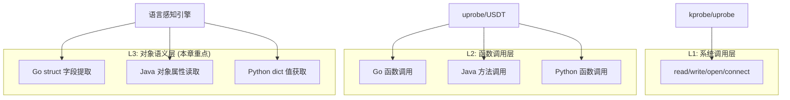

> [!info] eBPF 2026 深度探索系列
> 0. [[2026-04-08-ebpf-comprehensive-learning-roadmap|全栈学习路径总览]]
> 1. [[2026-04-08-ebpf-deep-dive-ch1-registers-and-instructions|第一章：寄存器与指令集]]
> 2. [[2026-04-08-ebpf-deep-dive-ch1-5-function-calls|第一.五章：四种函数调用与动态内存]]
> 3. [[2026-04-08-ebpf-deep-dive-ch1-6-the-verifier|第一.六章：验证器 (Verifier) 的底层逻辑]]
> 4. [[2026-04-08-ebpf-deep-dive-ch2-maps-and-communication|第二章：Map 机制与跨空间通信]]
> 5. [[2026-04-08-ebpf-deep-dive-ch2-5-kptr-and-ownership|第二.五章：kptr (内核指针) 与内存所有权模型]]
> 6. [[2026-04-08-ebpf-deep-dive-ch3-core-and-btf|第三章：CO-RE 与 BTF 的跨版本魔法]]
> 7. [[2026-04-08-ebpf-deep-dive-ch4-tracing-hooks-and-security|第四章：从 kprobe 到 LSM 的追踪全图景]]
> 8. [[2026-04-08-ebpf-deep-dive-ch7-5-uprobes-dynamic-tracing|第七.五章：uprobe 用户态动态追踪原理]]
> 9. [[2026-04-08-ebpf-deep-dive-ch7-6-bpftime-user-runtime|第七.六章：bpftime 与用户态 eBPF 加速]]
> 10. [[2026-04-08-ebpf-deep-dive-ch18-bpftime-injection-mastery|第七.七章：bpftime 自动化注入与全量监控实战]]
> 11. [[2026-04-08-ebpf-deep-dive-ch7-8-uprobe-selection-guide|第七.八章：uprobe 选型指南：内核态 vs 用户态]]
> 12. [[2026-04-08-ebpf-deep-dive-ch5-xdp-networking-performance|第五章：XDP 极致网络性能与全栈架构]]
> 13. [[2026-04-08-ebpf-deep-dive-ch6-tc-traffic-control|第六章：TC (Traffic Control) 流量调度艺术]]
> 14. [[2026-04-08-ebpf-deep-dive-ch7-security-lsm-enforcement|第七章：LSM BPF 从可观测到安全执法]]
> 15. [[2026-04-08-ebpf-deep-dive-ch8-advanced-tuning-and-profiling|第八章：进阶实战与内核调优]]
> 16. [[2026-04-08-ebpf-deep-dive-ch9-af-xdp-zero-copy|第九章：AF_XDP 零拷贝与用户态协议栈]]
> 17. [[2026-04-08-ebpf-deep-dive-ch10-sched-ext-custom-scheduler|第十章：sched_ext 自定义 CPU 调度器]]
> 18. [[2026-04-08-ebpf-deep-dive-ch11-bpf-iterators|第十一章：BPF Iterators 内核对象迭代器]]
> 19. [[2026-04-08-ebpf-deep-dive-ch12-kfuncs-evolution|第十二章：kfuncs 下一代内核交互标准]]
> 20. [[2026-04-08-ebpf-deep-dive-ch13-usdt-tracing|第十三章：USDT 用户态静态定义追踪]]
> 21. [[2026-04-08-ebpf-deep-dive-ch14-ai-llm-inference-monitoring|第十四章：AI 推理与大模型监控前沿]]
> 22. [[2026-04-08-ebpf-deep-dive-ch15-container-isolation|第十五章：无感增强容器隔离性]]
> 23. [[2026-04-08-ebpf-deep-dive-ch16-ebpf-and-wasm|第十六章：eBPF 与 WebAssembly (WASM) 的共生架构]]
> 24. [[2026-04-08-ebpf-deep-dive-ch17-storage-and-filesystem|第十七章：存储与文件系统加速]]
> 25. [[2026-04-08-ebpf-deep-dive-ch18-lifecycle-and-links|第十八章：生命周期管理与 BPF Links]]
> 26. [[2026-04-08-ebpf-deep-dive-ch19-atomic-updates-and-hot-upgrade|第十九章：程序的原子更新与蓝绿部署]]
> 27. [[2026-04-08-ebpf-deep-dive-ch25-5-stack-trace-correlation|第二五.五章：调用栈与业务请求的深度绑定]]
> 28. [[2026-04-08-ebpf-deep-dive-ch20-edge-iot-acceleration|第二十章：边缘计算与工业协议加速]]
> 29. [[2026-04-08-ebpf-deep-dive-ch21-debugging-and-verifier|第二十一章：调试实战与验证器 (Verifier) 诊断]]
> 30. [[2026-04-08-ebpf-deep-dive-ch22-testing-and-ci-cd|第二十二章：测试与持续集成 (CI/CD) 实战]]
> 31. [[2026-04-08-ebpf-deep-dive-ch23-security-and-permissions|第二十三章：权限细分与 BPF 安全沙箱]]
> 32. [[2026-04-08-ebpf-deep-dive-ch24-meta-monitoring-and-self-healing|第二十四章：eBPF 程序的内核自愈与监控]]
> 33. [[2026-04-08-ebpf-deep-dive-ch25-full-stack-observability|第二十五章：全栈可观测性与端到端追踪]]
> 34. [[2026-04-08-ebpf-deep-dive-ch26-network-security-high-level|第二十六章：网络安全防御的高阶实战]]
> 35. [[2026-04-08-ebpf-deep-dive-ch27-agent-engineering-architecture|第二十七章：工业级模块化 Agent 架构演进]]
> 36. [[2026-04-08-ebpf-deep-dive-ch28-offensive-and-defensive|第二十八章：攻防博弈与 Rootkit 防御]]
> 37. [[2026-04-08-ebpf-deep-dive-ch29-networking-deep-dive|第二十九章：网络应用深水区——负载均衡、Sockmap 与拥塞控制]]
> 38. [[2026-04-08-ebpf-deep-dive-ch30-hardware-offload|第三十章：硬件卸载与 SmartNIC 实战]]
> 39. [[2026-04-08-ebpf-deep-dive-ch31-signed-objects-and-security|第三十一章：内核原生签名与供应链安全]]
> 40. [[2026-04-08-ebpf-deep-dive-ch32-ebpf-for-windows|第三十二章：跨平台崛起——eBPF for Windows]]
> 41. [[2026-04-08-ebpf-deep-dive-ch32-5-macos-status|第三十二.五章：macOS 的特殊路径]]
> 42. [[2026-04-08-ebpf-deep-dive-ch33-serverless-optimization|第三十三章：Serverless 冷启动消除与动态计费]]
> 43. [[2026-04-08-ebpf-deep-dive-ch34-waf-and-rasp|第三十四章：Web 安全革命——内核态 WAF 与 RASP]]
> 44. [[2026-04-08-ebpf-deep-dive-ch35-npu-tpu-ai-hardware|第三十五章：AI 推理硬件 (NPU/TPU) 与硬件定义内核]]
> 45. **第三十六章：动态语言感知——业务对象的零代码提取**
> 46. [[2026-04-08-ebpf-deep-dive-ch37-green-computing|第三十七章：绿色计算与能耗精准归因]]
> 47. [[2026-04-08-ebpf-deep-dive-ch38-ecosystem-and-career|第三十八章：2026 生态全景与工程师职业导航]]
> 48. [[2026-04-09-ebpf-deep-dive-ch39-rust-aya-framework|第三十九章：Rust eBPF 开发实战——Aya 框架与安全编程]]
> 49. [[2026-04-09-ebpf-deep-dive-ch40-network-protocols-deep-dive|第四十章：网络协议深度解析——TCP/UDP/QUIC 的 eBPF 视角]]
> 50. [[2026-04-09-ebpf-deep-dive-ch41-memory-safety-and-vulnerabilities|第四十一章：eBPF 内存安全与漏洞分析]]
> 51. [[2026-04-09-ebpf-deep-dive-ch42-service-mesh-integration|第四十二章：eBPF 与 Service Mesh 深度集成]]
---

## 1. 概述：从二进制字节到业务语义

在 eBPF 发展的第一个十年，我们主要关注的是内核指标（系统调用、网络包）。但在 2026 年，eBPF 的价值高地已经迁移到了 **"业务语义层"**。

**动态语言感知 (Language Introspection)** 技术允许 eBPF 程序在不修改、不重启应用的情况下，直接从内存中"读懂" Python、Java、Go 或 Node.js 的高级对象。这意味着，你不再需要为了监控一个 `User` 结构体而手动在代码里添加 `Log.info()`。

### 1.1 语言感知的三大层次



---

## 2. 核心原理：内存布局自动映射

eBPF 运行在内核态，它面对的是原始的内存地址。要将这些地址还原为"业务变量"，需要经历以下过程：

### 2.1 符号与 DWARF 扫描

Agent 会扫描应用程序的 ELF 符号表。对于 Go 语言，这包含了结构体中每个字段的偏移量（Offsets）。

- **例子**：`User` 结构体的 `email` 字段在偏移 16 字节处

### 2.2 类信息注入 (针对 JVM)

对于 Java 这种动态运行时，2026 年的 eBPF 工具链通过与 JVM 内部的符号表进行内存映射，实时获取类定义。

### 2.3 指针追溯 (Pointer Chasing)

一旦通过 `uprobe` 捕获到方法入口地址，eBPF 就会根据扫描出的偏移量，执行多次 `bpf_probe_read_user()`，像剥洋葱一样深入对象内部提取关键数据。


---

## 3. 各语言实现方案对比

| 维度 | Go | Java (JVM) | Python | Node.js |
|:---|:---|:---|:---|:---|
| **类型系统** | 静态编译，布局确定 | 动态，但类元数据可用 | 动态，字典/对象混合 | V8 对象模型 |
| **偏移获取** | DWARF / go.objdump | JVM TI / JVMTI | PyInterpreterState | V8 快照 |
| **指针追踪** | 直接 bpf_probe_read | JVMTI 回调 + 间接读取 | PyObject 头解析 | Hidden Class 解析 |
| **工具链成熟度** | 高 | 高 | 中 | 低 |
| **典型场景** | gRPC 参数提取 | Spring MVC 追踪 | Django ORM 监控 | Express 中间件 |

---

## 4. 代码实战：捕获 Go 结构体内部变量

假设 Go 代码中有一个函数 `CreateOrder(o *Order)`，我们想抓取订单号。

```c
#include <vmlinux.h>
#include <bpf/bpf_helpers.h>

// 1. 通过工具预先探测到的结构体偏移
#define ORDER_ID_OFFSET 24
#define ORDER_AMOUNT_OFFSET 32
#define ORDER_USER_OFFSET 48

struct order_event {
    u64 order_id;
    u64 amount;
    u32 user_id;
    char user_name[32];
    u64 timestamp_ns;
};

struct {
    __uint(type, BPF_MAP_TYPE_RINGBUF);
    __uint(max_entries, 1024 * 1024);
} order_events SEC(".maps");

SEC("uprobe/my_service:CreateOrder")
int BPF_UPROBE(trace_order, void *order_ptr) {
    // 2. 核心动作：直接从应用内存地址 + 偏移量处提取数据
    struct order_event ev = {};

    bpf_probe_read_user(&ev.order_id, sizeof(ev.order_id),
                        (void *)(order_ptr + ORDER_ID_OFFSET));
    bpf_probe_read_user(&ev.amount, sizeof(ev.amount),
                        (void *)(order_ptr + ORDER_AMOUNT_OFFSET));

    // 3. 指针追溯：读取嵌套的 User 对象
    void *user_ptr;
    bpf_probe_read_user(&user_ptr, sizeof(user_ptr),
                        (void *)(order_ptr + ORDER_USER_OFFSET));

    if (user_ptr) {
        bpf_probe_read_user(&ev.user_id, sizeof(ev.user_id),
                            (void *)(user_ptr + 8));  // User.ID at offset 8
        bpf_probe_read_user_str(ev.user_name, sizeof(ev.user_name),
                               (void *)(user_ptr + 24)); // User.Name at offset 24
    }

    ev.timestamp_ns = bpf_ktime_get_ns();
    bpf_ringbuf_submit(&ev, 0);

    bpf_printk("ORDER: id=%llu amount=%llu user=%s",
               ev.order_id, ev.amount, ev.user_name);

    return 0;
}
```

### 4.1 自动偏移探测工具

```bash
# 使用 Go 工具获取结构体偏移
go tool objdump -s "main.Order" ./my_service | head -20

# 或使用 eBPF 生态工具
bpftool btf dump file /sys/kernel/btf/vmlinux | grep -A20 "Order"

# 使用 delve (Go 调试器) 获取偏移
dlv exec ./my_service -- eval 'reflect.TypeOf((*main.Order)(nil)).Elem()'
```

---

## 5. Java 对象提取

### 5.1 JVM 对象内存布局

JVM 对象的内存布局与 Go 不同，需要通过对象头（Object Header）中的 Klass 指针间接定位字段：

```c
// JVM 对象布局（简化，64 位 JVM）
// +0:  Mark Word (8 bytes)  -- GC 元数据
// +8:  Klass Pointer (8 bytes) -- 类元数据指针
// +16: 字段数据开始

// 提取 Java 对象字段
SEC("uprobe//usr/lib/jvm/java-17/lib/libjvm.so:JavaCalls::call_virtual")
int BPF_UPROBE(trace_java_method, void *recv, void *method) {
    // recv = this 指针 (Java 对象)
    // 跳过对象头 (16 bytes)
    void *field_start = recv + 16;

    // 假设我们知道第一个字段是 String 类型 (userId)
    void *str_ptr;
    bpf_probe_read_user(&str_ptr, 8, field_start);

    if (str_ptr) {
        // Java String 内部布局:
        // +12: coder (1 byte, LATIN1=0, UTF16=1)
        // +16: hash (4 bytes)
        // +20: value (byte[] pointer) -- JDK 9+ compact strings

        void *value_ptr;
        bpf_probe_read_user(&value_ptr, 8, str_ptr + 20);

        if (value_ptr) {
            // byte[] 布局:
            // +16: length (int)
            // +20: data start
            int str_len;
            bpf_probe_read_user(&str_len, 4, value_ptr + 16);

            char buf[64];
            int read_len = str_len > 63 ? 63 : str_len;
            bpf_probe_read_user(buf, read_len, value_ptr + 20);
            buf[read_len] = '\0';

            bpf_printk("JAVA_FIELD: value=%s", buf);
        }
    }
    return 0;
}
```

---

## 6. Python 对象提取

### 6.1 CPython 对象模型

Python 对象在内存中以 `PyObject` 头开始，包含引用计数和类型指针：

```c
// CPython 对象布局
typedef struct _object {
    Py_ssize_t ob_refcnt;   // +0: 引用计数
    PyTypeObject *ob_type;  // +8: 类型指针
} PyObject;

// PyDictObject 布局（简化）
// +0: ob_refcnt
// +8: ob_type
// +16: ma_used (字典大小)
// +24: ma_keys (哈希表键数组)
// +32: ma_values (值数组)

SEC("uprobe//usr/bin/python3:_PyObject_Call")
int BPF_UPROBE(trace_python_call, void *callable, void *args, void *kwargs) {
    // 假设 callable 是一个函数对象，我们想提取函数名
    // Python function object 布局:
    // +0: ob_refcnt
    // +8: ob_type
    // +16: func_code (CodeObject*)
    // +24: func_globals (dict*)
    // +32: func_name (PyObject* = ASCII str)

    void *func_name_ptr;
    bpf_probe_read_user(&func_name_ptr, 8, callable + 32);

    if (func_name_ptr) {
        // ASCII str object:
        // +0: ob_refcnt
        // +8: ob_type
        // +16: length (Py_ssize_t)
        // +24: hash (caching)
        // +32: state (interned state)
        // +40: data start (for ASCII strings)

        Py_ssize_t str_len;
        bpf_probe_read_user(&str_len, 8, func_name_ptr + 16);

        char name[64];
        int read_len = str_len > 63 ? 63 : str_len;
        bpf_probe_read_user(name, read_len, func_name_ptr + 40);
        name[read_len] = '\0';

        bpf_printk("PYTHON_CALL: function=%s", name);
    }
    return 0;
}
```

---

## 7. 2026 年的实战价值

### 7.1 零侵入的业务监控 (Zero-code BI)

运营人员可以动态配置监控项，例如"实时统计全站交易额"。eBPF Agent 在内核态直接从支付函数的参数中提取金额并进行聚合，**整个过程开发人员无需发布任何新代码。**

### 7.2 隐私数据动态脱敏

利用这一技术，安全模块可以在敏感数据（如身份证号）离开进程、进入网络栈之前，直接在内核内存中执行正则匹配并**原地掩码（Masking）**，实现极致的数据合规。

```c
// 在网络发送前对敏感数据进行脱敏
SEC("uprobe//lib/x86_64-linux-gnu/libc.so.6:send")
int BPF_UPROBE(mask_before_send, int fd, void *buf, size_t len) {
    // 检查 buf 中是否包含身份证号格式 (18位数字)
    char *data = buf;
    for (int i = 0; i < len - 18; i++) {
        // 简化：检查是否匹配数字模式
        int is_id = 1;
        for (int j = 0; j < 18; j++) {
            char c;
            bpf_probe_read_user(&c, 1, data + i + j);
            if (c < '0' || c > '9') { is_id = 0; break; }
        }
        if (is_id) {
            // 原地掩码：保留前6位和后4位，中间替换为 *
            char mask[8] = "******";
            // 注意：直接写用户内存需要特殊权限
            // 实际实现中建议在 TC 层进行替换
            bpf_printk("MASK: Found potential ID card at offset %d", i);
        }
    }
    return 0;
}
```

---

## 8. 性能开销与最佳实践

| 操作 | 延迟 | 说明 |
|:---|:---|:---|
| 单次 bpf_probe_read_user | 20-50ns | 读取 8 字节 |
| 提取简单字段（1级指针） | 50-100ns | 一次 probe_read |
| 提取嵌套对象（3级指针） | 150-300ns | 三次 probe_read |
| 读取字符串（100字节） | 200-500ns | probe_read_user_str |
| 提取复杂 Java 对象 | 500ns-2μs | 多级指针 + GC 安全 |

**最佳实践**：
1. **预计算偏移**：在 Agent 启动时一次性扫描 DWARF，避免运行时计算
2. **限制追踪深度**：最多 3-4 级指针追溯，超过建议降级为统计
3. **采样策略**：高频调用建议 1% 采样
4. **安全考虑**：提取的敏感数据应立即脱敏，避免在内核日志中泄露

---

## 9. 高级技巧：动态字段发现与自动偏移计算

### 9.1 运行时自动偏移探测

在编译时无法确定偏移的场景下（如 Go 插件、Python 动态类），可以使用 eBPF 在运行时自动发现字段偏移：

```c
// 自动发现 Go 结构体中某个字段的偏移量
// 策略：通过已知的"锚点字段"（如 string 类型）定位目标字段

SEC("uprobe/my_service:CreateOrder")
int BPF_UPROBE(auto_discover, void *order_ptr) {
    // 已知：Order 结构体包含一个 string 类型的 ID 字段
    // Go string 布局: { ptr: u64, len: u64 } = 16 字节
    // 策略：扫描结构体前 256 字节，寻找合法的 string 指针

    char candidate[64];
    u64 str_ptr, str_len;

    #pragma unroll
    for (int offset = 0; offset < 256; offset += 8) {
        // 读取指针
        bpf_probe_read_user(&str_ptr, 8, (void *)(order_ptr + offset));
        if (str_ptr == 0) continue;

        // 尝试读取长度（指针后面 8 字节）
        bpf_probe_read_user(&str_len, 8, (void *)(order_ptr + offset + 8));

        // 合法 string 的长度通常在 1-1000 之间
        if (str_len > 0 && str_len < 1000) {
            // 尝试读取字符串内容验证可读性
            int read_len = str_len > 63 ? 63 : str_len;
            long ret = bpf_probe_read_user_str(candidate, read_len + 1, (void *)str_ptr);

            if (ret > 0 && ret == read_len + 1) {
                // 成功读取到合法字符串，记录偏移
                struct field_discovery *d = bpf_ringbuf_reserve(
                    &discoveries, sizeof(*d), 0);
                if (d) {
                    d->offset = offset;
                    d->str_len = str_len;
                    __builtin_memcpy(d->value, candidate, read_len);
                    bpf_ringbuf_submit(d, 0);
                }
            }
        }
    }
    return 0;
}
```

### 9.2 基于 Go 反射的偏移自动计算

用户态工具可以通过 Go 的反射机制在运行前自动计算偏移，注入到 BPF 程序中：

```go
// offset_discover.go — 用户态偏移计算工具
package main

import (
    "fmt"
    "reflect"
    "unsafe"
)

// 通过反射获取结构体字段偏移
func getFieldOffsets(typ reflect.Type) map[string]int {
    offsets := make(map[string]int)
    for i := 0; i < typ.NumField(); i++ {
        field := typ.Field(i)
        offset := field.Offset
        offsets[field.Name] = int(offset)
        fmt.Printf("  %s: offset=%d, type=%s\n", field.Name, offset, field.Type)
    }
    return offsets
}

// 生成 BPF C 头文件中的偏移定义
func generateBPFDefines(offsets map[string]int) string {
    result := "// Auto-generated field offsets\n"
    for name, offset := range offsets {
        result += fmt.Sprintf("#define OFFSET_%s %d\n", name, offset)
    }
    return result
}

func main() {
    type Order struct {
        ID     string  // +0
        Amount float64 // +16 (Go string = 16 bytes)
        UserID uint32  // +24
        User   *User   // +32 (对齐到 8 字节)
    }

    type User struct {
        ID   uint32 // +0
        Name string // +8
    }

    fmt.Println("=== Order struct offsets ===")
    orderOffsets := getFieldOffsets(reflect.TypeOf(Order{}))

    fmt.Println("\n=== User struct offsets ===")
    userOffsets := getFieldOffsets(reflect.TypeOf(User{}))

    fmt.Println("\n=== Generated BPF defines ===")
    fmt.Println(generateBPFDefines(orderOffsets))
    fmt.Println(generateBPFDefines(userOffsets))

    // 验证指针大小
    fmt.Printf("\nPointer size: %d bytes\n", unsafe.Sizeof(&Order{}))
}
```

### 9.3 安全的指针追溯模式

多级指针追溯时，必须在每一步验证指针有效性，避免内核态崩溃：

```c
// 安全的 N 级指针追溯宏
#define SAFE_DEREF(dst, src_ptr, offset, type) ({          \
    void *_p;                                               \
    long _r = bpf_probe_read_user(&_p, sizeof(void *),      \
                (void *)((char *)(src_ptr) + (offset)));    \
    if (_r != 0 || _p == NULL) goto out;                   \
    _r = bpf_probe_read_user((dst), sizeof(type), _p);     \
    if (_r != 0) goto out;                                  \
    0;                                                      \
})

// 使用示例：安全地提取 3 级嵌套对象
SEC("uprobe/my_app:ProcessRequest")
int BPF_UPROBE(safe_trace, void *req_ptr) {
    struct result_event ev = {};

    // 第 1 级：req->user
    void *user_ptr;
    bpf_probe_read_user(&user_ptr, 8, (void *)(req_ptr + USER_OFFSET));
    if (!user_ptr) goto out;

    // 第 2 级：user->profile
    void *profile_ptr;
    bpf_probe_read_user(&profile_ptr, 8, (void *)(user_ptr + PROFILE_OFFSET));
    if (!profile_ptr) goto out;

    // 第 3 级：profile->settings
    void *settings_ptr;
    bpf_probe_read_user(&settings_ptr, 8, (void *)(profile_ptr + SETTINGS_OFFSET));
    if (!settings_ptr) goto out;

    // 最终读取目标值
    bpf_probe_read_user(&ev.setting_value, 4, (void *)(settings_ptr + VALUE_OFFSET));

    bpf_ringbuf_submit(&ev, 0);
out:
    return 0;
}
```

---

## 10. FAQ

**Q1：语言感知工具的推荐选择有哪些？**

A：Go: `ecapture`（Go 字符串提取）、`gotrace`；Java: `bpftrace`（JVM USDT 支持）、`oneprobe`；Python: `py-spy`（采样 profiler，非 eBPF）、`ecapture`（Python 版）；通用: `Otel eBPF Agent`（OpenTelemetry 官方 eBPF 扩展）。

**Q2：应用更新后偏移量会变吗？如何处理？**

A：Go 的结构体偏移在编译时确定，二进制更新后可能变化。处理策略：1) 使用 BTF/DWARF 信息在运行时自动解析偏移（CO-RE 风格）；2) Agent 监听进程重启事件，自动重新扫描偏移；3) 使用字段名而非硬编码偏移。Java 由于运行时类加载，偏移更稳定但非完全不变。

**Q3：eBPF 语言感知能处理 GC 移动的对象吗？**

A：Go 使用非移动 GC（标记-清除），对象地址在生命周期内不变，eBPF 可以安全读取。Java 的 ZGC/Shenandoah GC 会移动对象，在 STW（Stop-The-World）阶段读取是安全的，但在并发移动期间可能读到过期数据。Python 使用引用计数 + 分代 GC，同样不移动对象。Node.js V8 的 GC 会移动对象，需要配合安全点。

**Q4：这种技术在生产环境中的稳定性如何？**

A：2026 年已在大型互联网公司广泛使用（如字节跳动使用 ecapture 监控 Go 服务）。稳定性取决于：1) 偏移信息的准确性；2) eBPF 程序的正确性（不会 panic）；3) 采样的合理控制。建议先在预发环境充分验证后再上线。

**Q5：能否同时提取多个编程语言的对象？**

A：可以。不同的 uprobe 可以挂载在不同语言的运行时库上，彼此独立运行。但需要注意：1) 共享的 Map 数据结构需要统一格式；2) 混合语言环境（如 Python 调用 C 扩展）需要分别处理；3) 总体的 CPU 开销需要控制在合理范围内（建议 < 2%）。

**Q6：eBPF 语言感知与 OpenTelemetry SDK 有何区别？**

A：核心区别在于**侵入性**。OTel SDK 需要修改应用代码（引入依赖、配置 Agent），且有版本兼容性问题。eBPF 语言感知完全零侵入——不需要修改任何代码、不需要重启应用。但 eBPF 的语义理解能力有限（无法理解复杂的业务逻辑），建议两者配合使用：eBPF 负责自动发现和基础指标，OTel SDK 负责精细的业务语义。

**Q7：eBPF 语言感知对 Go 的 garbage collector 有影响吗？**

A：Go 使用非移动 GC，对象在内存中的位置不会改变，eBPF 可以安全地通过偏移量读取对象字段。但需要注意：1) 如果对象在 GC 扫描期间被标记为不可达，读取到的可能是过期数据（通常无害）；2) 对于 `string` 和 `slice` 类型，eBPF 读取的是底层数据指针，需要确保指针在读取期间有效（通常通过 uprobe 在函数调用时同步读取来保证）。

**Q8：如何处理结构体字段的内存对齐问题？**

A：内存对齐由编译器决定。Go 使用 8 字节对齐，Java 使用 8 字节对齐（JVM 64 位）。在 eBPF 中：1) 使用编译器的 DWARF 信息获取精确偏移（推荐）；2) 如果 DWARF 不可用，使用 `__builtin_offsetof` 在目标平台上预先计算；3) 使用 BTF 类型信息（CO-RE 风格）自动处理跨版本偏移差异。永远不要硬编码偏移量，除非通过工具验证过。

**Q9：eBPF 能否提取 Python 的异步框架（asyncio）上下文？**

A：可以。asyncio 的协程上下文存储在 Python 解释器的线程状态中。通过 uprobe 挂载 `PyEval_EvalFrameDefault`，可以获取当前执行的协程对象，进而提取协程 ID、任务名称等信息。结合 TCP 序列号关联技术，可以实现从 HTTP 请求到 asyncio 协程的完整调用链追踪。
