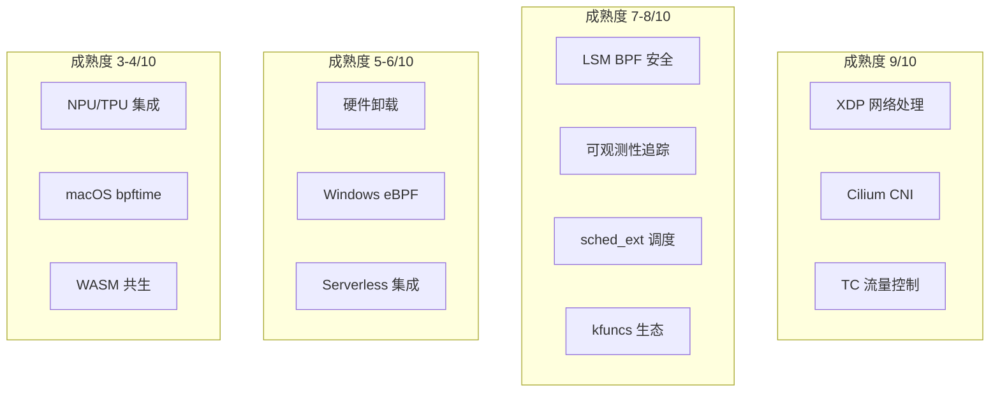
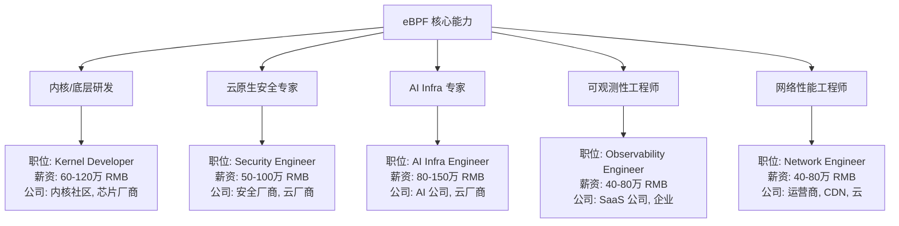
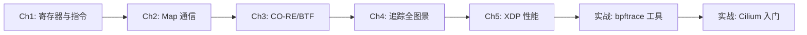
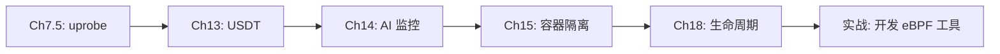
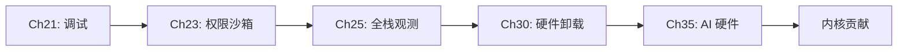

> [!info] eBPF 2026 深度探索系列
> 0. [[2026-04-08-ebpf-comprehensive-learning-roadmap|全栈学习路径总览]]
> 1. [[2026-04-08-ebpf-deep-dive-ch1-registers-and-instructions|第一章：寄存器与指令集]]
> 2. [[2026-04-08-ebpf-deep-dive-ch1-5-function-calls|第一.五章：四种函数调用与动态内存]]
> 3. [[2026-04-08-ebpf-deep-dive-ch1-6-the-verifier|第一.六章：验证器 (Verifier) 的底层逻辑]]
> 4. [[2026-04-08-ebpf-deep-dive-ch2-maps-and-communication|第二章：Map 机制与跨空间通信]]
> 5. [[2026-04-08-ebpf-deep-dive-ch2-5-kptr-and-ownership|第二.五章：kptr (内核指针) 与内存所有权模型]]
> 6. [[2026-04-08-ebpf-deep-dive-ch3-core-and-btf|第三章：CO-RE 与 BTF 的跨版本魔法]]
> 7. [[2026-04-08-ebpf-deep-dive-ch4-tracing-hooks-and-security|第四章：从 kprobe 到 LSM 的追踪全图景]]
> 8. [[2026-04-08-ebpf-deep-dive-ch7-5-uprobes-dynamic-tracing|第七.五章：uprobe 用户态动态追踪原理]]
> 9. [[2026-04-08-ebpf-deep-dive-ch7-6-bpftime-user-runtime|第七.六章：bpftime 与用户态 eBPF 加速]]
> 10. [[2026-04-08-ebpf-deep-dive-ch18-bpftime-injection-mastery|第七.七章：bpftime 自动化注入与全量监控实战]]
> 11. [[2026-04-08-ebpf-deep-dive-ch7-8-uprobe-selection-guide|第七.八章：uprobe 选型指南：内核态 vs 用户态]]
> 12. [[2026-04-08-ebpf-deep-dive-ch5-xdp-networking-performance|第五章：XDP 极致网络性能与全栈架构]]
> 13. [[2026-04-08-ebpf-deep-dive-ch6-tc-traffic-control|第六章：TC (Traffic Control) 流量调度艺术]]
> 14. [[2026-04-08-ebpf-deep-dive-ch7-security-lsm-enforcement|第七章：LSM BPF 从可观测到安全执法]]
> 15. [[2026-04-08-ebpf-deep-dive-ch8-advanced-tuning-and-profiling|第八章：进阶实战与内核调优]]
> 16. [[2026-04-08-ebpf-deep-dive-ch9-af-xdp-zero-copy|第九章：AF_XDP 零拷贝与用户态协议栈]]
> 17. [[2026-04-08-ebpf-deep-dive-ch10-sched-ext-custom-scheduler|第十章：sched_ext 自定义 CPU 调度器]]
> 18. [[2026-04-08-ebpf-deep-dive-ch11-bpf-iterators|第十一章：BPF Iterators 内核对象迭代器]]
> 19. [[2026-04-08-ebpf-deep-dive-ch12-kfuncs-evolution|第十二章：kfuncs 下一代内核交互标准]]
> 20. [[2026-04-08-ebpf-deep-dive-ch13-usdt-tracing|第十三章：USDT 用户态静态定义追踪]]
> 21. [[2026-04-08-ebpf-deep-dive-ch14-ai-llm-inference-monitoring|第十四章：AI 推理与大模型监控前沿]]
> 22. [[2026-04-08-ebpf-deep-dive-ch15-container-isolation|第十五章：无感增强容器隔离性]]
> 23. [[2026-04-08-ebpf-deep-dive-ch16-ebpf-and-wasm|第十六章：eBPF 与 WebAssembly (WASM) 的共生架构]]
> 24. [[2026-04-08-ebpf-deep-dive-ch17-storage-and-filesystem|第十七章：存储与文件系统加速]]
> 25. [[2026-04-08-ebpf-deep-dive-ch18-lifecycle-and-links|第十八章：生命周期管理与 BPF Links]]
> 26. [[2026-04-08-ebpf-deep-dive-ch19-atomic-updates-and-hot-upgrade|第十九章：程序的原子更新与蓝绿部署]]
> 27. [[2026-04-08-ebpf-deep-dive-ch25-5-stack-trace-correlation|第二五.五章：调用栈与业务请求的深度绑定]]
> 28. [[2026-04-08-ebpf-deep-dive-ch20-edge-iot-acceleration|第二十章：边缘计算与工业协议加速]]
> 29. [[2026-04-08-ebpf-deep-dive-ch21-debugging-and-verifier|第二十一章：调试实战与验证器 (Verifier) 诊断]]
> 30. [[2026-04-08-ebpf-deep-dive-ch22-testing-and-ci-cd|第二十二章：测试与持续集成 (CI/CD) 实战]]
> 31. [[2026-04-08-ebpf-deep-dive-ch23-security-and-permissions|第二十三章：权限细分与 BPF 安全沙箱]]
> 32. [[2026-04-08-ebpf-deep-dive-ch24-meta-monitoring-and-self-healing|第二十四章：eBPF 程序的内核自愈与监控]]
> 33. [[2026-04-08-ebpf-deep-dive-ch25-full-stack-observability|第二十五章：全栈可观测性与端到端追踪]]
> 34. [[2026-04-08-ebpf-deep-dive-ch26-network-security-high-level|第二十六章：网络安全防御的高阶实战]]
> 35. [[2026-04-08-ebpf-deep-dive-ch27-agent-engineering-architecture|第二十七章：工业级模块化 Agent 架构演进]]
> 36. [[2026-04-08-ebpf-deep-dive-ch28-offensive-and-defensive|第二十八章：攻防博弈与 Rootkit 防御]]
> 37. [[2026-04-08-ebpf-deep-dive-ch29-networking-deep-dive|第二十九章：网络应用深水区——负载均衡、Sockmap 与拥塞控制]]
> 38. [[2026-04-08-ebpf-deep-dive-ch30-hardware-offload|第三十章：硬件卸载与 SmartNIC 实战]]
> 39. [[2026-04-08-ebpf-deep-dive-ch31-signed-objects-and-security|第三十一章：内核原生签名与供应链安全]]
> 40. [[2026-04-08-ebpf-deep-dive-ch32-ebpf-for-windows|第三十二章：跨平台崛起——eBPF for Windows]]
> 41. [[2026-04-08-ebpf-deep-dive-ch32-5-macos-status|第三十二.五章：macOS 的特殊路径]]
> 42. [[2026-04-08-ebpf-deep-dive-ch33-serverless-optimization|第三十三章：Serverless 冷启动消除与动态计费]]
> 43. [[2026-04-08-ebpf-deep-dive-ch34-waf-and-rasp|第三十四章：Web 安全革命——内核态 WAF 与 RASP]]
> 44. [[2026-04-08-ebpf-deep-dive-ch35-npu-tpu-ai-hardware|第三十五章：AI 推理硬件 (NPU/TPU) 与硬件定义内核]]
> 45. [[2026-04-08-ebpf-deep-dive-ch36-dynamic-language-introspection|第三十六章：动态语言感知——业务对象的零代码提取]]
> 46. [[2026-04-08-ebpf-deep-dive-ch37-green-computing|第三十七章：绿色计算与能耗精准归因]]
> 47. **第三十八章：2026 生态全景与工程师职业导航**
> 48. [[2026-04-09-ebpf-deep-dive-ch39-rust-aya-framework|第三十九章：Rust eBPF 开发实战——Aya 框架与安全编程]]
> 49. [[2026-04-09-ebpf-deep-dive-ch40-network-protocols-deep-dive|第四十章：网络协议深度解析——TCP/UDP/QUIC 的 eBPF 视角]]
> 50. [[2026-04-09-ebpf-deep-dive-ch41-memory-safety-and-vulnerabilities|第四十一章：eBPF 内存安全与漏洞分析]]
> 51. [[2026-04-09-ebpf-deep-dive-ch42-service-mesh-integration|第四十二章：eBPF 与 Service Mesh 深度集成]]
---

## 1. 概述：eBPF 统治的时代

到 2026 年，eBPF 已经完成了从"内核特性"到"操作系统通用虚拟机"的华丽转身。它横跨 Linux、Windows、以及异构 AI 硬件，成为了现代分布式系统、网络安全和极致性能调优的"通用底座"。

本章旨在为您梳理目前行业最核心的资源，并为您职业生涯的下一步提供建议。

### 1.1 eBPF 2026 技术成熟度雷达



---

## 2. 2026 顶级开源项目指南

掌握 eBPF 的最佳途径是"阅读名著"。以下项目代表了当前的最高工程水准：

### 2.1 网络与基础设施

| 项目 | 语言 | 星标 (2026) | 核心能力 | 推荐阅读优先级 |
|:---|:---|:---|:---|:---|
| **Cilium** | Go/C | 22k+ | XDP 转发、LB、网络策略、可观测性 | 必读 |
| **bpftime** | C++ | 5k+ | 用户态 eBPF 运行时、JIT、注入 | 高 |
| **Katran** | C++ | 4k+ | Meta 的 XDP 负载均衡器 | 高 |
| **Suricata** | C | 6k+ | eBPF 加速的 IDS/IPS | 中 |

### 2.2 安全与防御

| 项目 | 语言 | 核心能力 | 推荐阅读优先级 |
|:---|:---|:---|:---|
| **Tetragon** | Go/C | 基于 LSM BPF 的实时安全引擎 | 必读 |
| **Falco** | C++/Go | 云原生运行时安全，规则驱动 | 高 |
| **Tracee** | Go | eBPF 事件追踪，安全分析 | 高 |
| **BPFArmor** | C | 下一代安全框架 | 中 |

### 2.3 可观测性与调试

| 项目 | 语言 | 核心能力 | 推荐阅读优先级 |
|:---|:---|:---|:---|
| **DeepFlow** | Go/C | 全栈可观测性，AutoTracing | 必读 |
| **Pixie** | C++ | K8s 原生可观测性，eBPL (扩展 BPF) | 高 |
| **ecapture** | Go | 国产无侵入监控，Go/Java/Python | 高 |
| **bpftrace** | C++ | 高级追踪语言 | 必读 |

---

## 3. 核心学习资源与社群

### 3.1 理论必读

| 资源 | 类型 | 内容 | 适合阶段 |
|:---|:---|:---|:---|
| **IETF eBPF ISA Spec** | 规范 | eBPF 指令集官方规范 | 专家 |
| **PREVAIL 论文** | 论文 | 验证器的数学证明原理 | 高级 |
| **BPF & XDP Reference** | 书籍 | Cilium 团队撰写的参考手册 | 全阶段 |
| **BPF Performance Tools** | 书籍 | Brendan Gregg 的性能分析指南 | 全阶段 |
| **Linux Kernel BPF 文档** | 文档 | 内核源码 Documentation/bpf/ | 全阶段 |

### 3.2 开发者社群

| 社群 | 平台 | 说明 |
|:---|:---|:---|
| **eBPF.io** | 网站 | 全球 eBPF 信息枢纽 |
| **CNCF Slack #ebpf** | Slack | 内核维护者与顶级工程师聚集地 |
| **LPC / LSF eBPF Summit** | 会议 | 每年两次的 eBPF 技术峰会 |
| **Reddit r/eBPF** | 论坛 | 社区问答与讨论 |
| **bpf@vger.kernel.org** | 邮件列表 | 内核 eBPF 子系统开发讨论 |

### 3.3 工具链一览

```bash
# 核心工具
bpftool          # eBPF 程序管理瑞士军刀
bpftrace         # 高级追踪脚本语言
llvm/clang      # 编译器工具链
libbpf           # C 库
cilium/ebpf-go  # Go 绑定
aya             # Rust 框架

# 调试工具
bpftool prog dump   # 查看编译后的指令
bpftool map dump    # 查看 Map 内容
drgn               # 调试内核数据结构
perf                # 性能分析集成
```

---

## 4. 2026 eBPF 工程师职业地图

掌握了本系列 38 章知识后，您的职业路径将获得极大的宽度：

### 4.1 职业方向详解



### 4.2 技能矩阵

| 方向 | 必备技能 | 加分技能 | 推荐认证 |
|:---|:---|:---|:---|
| **内核研发** | C, 内核开发, eBPF internals | Rust, 汇编, 硬件架构 | 无（贡献代码即认证）|
| **云原生安全** | LSM BPF, 容器安全, 网络策略 | Kubernetes, Terraform, 合规 | CKA / CKS |
| **AI Infra** | GPU 编程, NCCL, eBPF 监控 | CUDA, Triton, PyTorch | 无 |
| **可观测性** | OpenTelemetry, eBPF tracing | Prometheus, Grafana, SLO | 无 |

### 4.3 薪资趋势 (2026 中国市场)

| 级别 | 经验 | 薪资范围 (RMB/年) | 核心竞争力 |
|:---|:---|:---|:---|
| 初级 | 1-3 年 | 25-45 万 | 能编写和调试基础 BPF 程序 |
| 中级 | 3-5 年 | 45-80 万 | 能设计复杂的 eBPF 系统 |
| 高级 | 5-8 年 | 80-150 万 | 能解决前沿问题（性能、安全） |
| 专家 | 8+ 年 | 150-300 万 | 内核贡献者，行业影响力 |

---

## 5. 2026-2030 技术趋势展望

### 5.1 近期趋势 (2026-2027)

- **eBPF 成为云原生标配**：所有主流 K8s 发行版默认集成 Cilium eBPF CNI
- **LSM BPF 安全合规**：金融/政务行业强制要求 eBPF 签名和安全审计
- **AI 推理监控标准化**：NPU/TPU eBPF 接口统一，成为 AI 推理集群的标准监控方案

### 5.2 中期趋势 (2027-2029)

- **跨平台统一**：Linux/Windows/macOS 的 eBPF API 完全统一，一套代码三端运行
- **eBPF + AI 协同**：AI 自动生成和优化 eBPF 程序，实现自适应的网络和安全策略
- **硬件定义内核普及**：eBPF 虚拟机嵌入到每一个加速器中，形成真正的分布式操作系统

### 5.3 远期展望 (2029-2030+)

- **eBPF 成为操作系统标准接口**：不仅是 Linux，所有主流 OS 都原生支持 eBPF
- **自主安全决策**：eBPF 安全引擎结合 AI 实现自动化的威胁检测和响应
- **绿色计算标配**：eBPF 能耗监控成为所有云平台的默认功能，碳足迹审计自动化

---

## 6. 全系列知识图谱总结

### 6.1 章节知识关联

| 模块 | 章节 | 核心能力 |
|:---|:---|:---|
| **基础篇** | Ch1, Ch1.5, Ch1.6 | 指令集、函数调用、验证器 |
| **数据篇** | Ch2, Ch2.5 | Map 通信、kptr 所有权 |
| **可移植篇** | Ch3 | CO-RE 与 BTF |
| **追踪篇** | Ch4, Ch7.5, Ch13 | kprobe、uprobe、USDT |
| **网络篇** | Ch5, Ch6, Ch9, Ch29 | XDP、TC、AF_XDP、Sockmap |
| **安全篇** | Ch7, Ch26, Ch28, Ch31, Ch34 | LSM BPF、网络安全、供应链、WAF/RASP |
| **调度篇** | Ch10 | sched_ext 自定义调度 |
| **内核篇** | Ch11, Ch12, Ch18, Ch19, Ch21, Ch22 | Iterators、kfuncs、生命周期、调试、测试 |
| **云原生篇** | Ch15, Ch33 | 容器隔离、Serverless |
| **可观测篇** | Ch14, Ch25, Ch25.5, Ch36 | AI 监控、全栈追踪、语言感知 |
| **前沿篇** | Ch16, Ch20, Ch30, Ch35 | WASM、边缘计算、硬件卸载、AI 硬件 |
| **跨平台篇** | Ch32, Ch32.5 | Windows、macOS |
| **运维篇** | Ch23, Ch24, Ch37 | 权限管理、自愈监控、绿色计算 |
| **职业篇** | Ch38 | 生态全景与职业导航 |

---

## 7. 结语：你好，内核编程者

eBPF 的旅程没有终点。正如 Linux 之父 Linus Torvalds 所言："内核是所有软件的灵魂"。而 eBPF，则是赋予这个灵魂无限可能的神来之笔。

**恭喜您完成《eBPF 2026 深度探索》全系列课程！期待在内核的星辰大海中与您再次相遇。**

---

## 9. 推荐学习路线图

根据不同背景和目标，推荐以下学习路径：

### 9.1 零基础入门路线 (3-6 个月)



### 9.2 中级进阶路线 (6-12 个月)



### 9.3 高级专家路线 (12+ 个月)



---

## 10. eBPF 开源贡献实战指南

### 10.1 贡献类型与难度

| 贡献类型 | 难度 | 所需时间 | 典型项目 | 入门建议 |
|:---|:---|:---|:---|:---|
| **文档修复** | 入门 | 1-2 小时 | libbpf, bpftrace | 搜索 GitHub Issues 标签 `documentation` |
| **Bug 修复** | 初级 | 1-5 天 | cilium/ebpf-go, aya | 从 CI 失败的测试用例入手 |
| **新 Helper** | 中级 | 1-4 周 | Linux 内核 | 需要理解内核子系统 |
| **新 Map 类型** | 高级 | 2-8 周 | Linux 内核 | 需要内核维护者 Review |
| **新工具开发** | 中高级 | 2-6 周 | bpftrace, ecapture | 解决实际痛点 |
| **架构设计** | 专家 | 1-3 月 | cilium, tetragon | 需要深入理解领域 |

### 10.2 内核补丁提交流程

```mermaid
graph LR
    Idea[发现问题或需求] --> Research[邮件列表讨论<br/>bpf@vger.kernel.org]
    Research --> Patch[编写补丁]
    Patch --> Test[自测 + 自行车修补测试]
    Test --> Send[git send-email<br/>发送到邮件列表]
    Send --> Review[维护者 Review]
    Review --> Revise[修改补丁]
    Revise --> Review
    Review --> Merge[合并到 mainline<br/>通常 2-6 个版本周期]
```

```bash
# 内核补丁提交流程示例
# 1. 配置 git-send-email
git config sendemail.smtp.server smtp.gmail.com
git config sendemail.smtp.user your@gmail.com
git config sendemail.smtpencryption tls

# 2. 生成补丁（最近 3 个 commit）
git format-patch -3 --cover-letter -o /tmp/patches

# 3. 编辑 cover letter
vim /tmp/patches/0000-cover-letter.patch

# 4. 发送到邮件列表
git send-email \
    --to=bpf@vger.kernel.org \
    --cc=linux-kernel@vger.kernel.org \
    /tmp/patches/*.patch
```

### 10.3 开源项目架构深度剖析

以 Cilium 为例，理解一个顶级 eBPF 项目的架构：

```mermaid
graph TB
    subgraph "用户态 (Go)"
        Agent[Cilium Agent] --> CMap[Container Map 管理]
        Agent --> Policy[网络策略引擎]
        Agent --> Monitor[监控与指标导出]
        Agent --> L7Proxy[L7 代理 (Envoy)]
    end

    subgraph "内核态 (C/eBPF)"
        XDP[XDP 程序<br/>L2/L3 过滤]
        TC[TC 程序<br/>L3/L4 策略]
        SockOps[SockOps<br/>连接追踪]
        NTrack[网络追踪<br/>NAT/FW]
    end

    Agent --> |"bpf_prog_load"| XDP
    Agent --> |"bpf_prog_load"| TC
    Agent --> |"bpf_prog_load"| SockOps
    Agent --> |"bpf_prog_load"| NTrack

    subgraph "数据面"
        XDP --> |"redirect"| TC
        TC --> |"sk_assign"| SockOps
    end
```

**代码阅读路线**：
1. `pkg/bpf/` — BPF 程序的编译、加载和生命周期管理
2. `bpf/` — 内核态 eBPF 程序源码（C 语言）
3. `pkg/maps/` — 各种 Map 类型的封装
4. `pkg/policy/` — 网络策略引擎（从 K8s NetworkPolicy 到 BPF 规则的翻译）

### 10.4 技术影响力建设

| 渠道 | 形式 | 影响力 | 频率建议 |
|:---|:---|:---|:---|
| **技术博客** | 深度文章 | 中 | 每月 1-2 篇 |
| **技术演讲** | Meetup/Conference | 高 | 每季度 1 次 |
| **开源贡献** | PR/补丁 | 极高 | 持续 |
| **技术书籍** | 出版物 | 极高 | 1-2 年一本 |
| **培训课程** | Workshop | 高 | 按需 |

---

## 11. eBPF 工程师的日常工具链

### 11.1 开发环境配置

```bash
# 完整的 eBPF 开发环境安装 (Ubuntu/Debian)
sudo apt install -y \
    clang llvm \
    libbpf-dev \
    bpftool \
    linux-tools-common \
    linux-tools-$(uname -r) \
    gcc-multilib make \
    libelf-dev

# Go 开发者额外安装
go install github.com/cilium/ebpf/cmd/bpf2go@latest

# Rust 开发者额外安装
cargo install bpfctl

# bpftrace 安装
sudo apt install bpftrace
# 或从源码编译最新版
git clone https://github.com/iovisor/bpftrace
cd bpftrace && mkdir build && cd build
cmake .. && make -j$(nproc) && sudo make install
```

### 11.2 调试与诊断工具箱

```bash
# 快速诊断脚本集合

# 1. 查看 BPF 程序列表
bpftool prog list
bpftool prog show id <ID> --json

# 2. 查看 BPF Map 内容
bpftool map list
bpftool map dump id <MAP_ID>
bpftool map lookup id <MAP_ID> key <KEY_HEX>

# 3. 查看 JIT 编译后的指令
bpftool prog dump xlated id <ID>
bpftool prog dump jited id <ID>

# 4. 查看网络附加的 BPF 程序
bpftool net show dev eth0

# 5. 查看跟踪点 (tracepoint) 列表
sudo bpftool perf list

# 6. bpftrace 一行命令速查
# 统计系统调用频率
sudo bpftrace -e 'tracepoint:raw_syscalls:sys_enter { @[comm] = count(); }'
# 统计 TCP 连接延迟
sudo bpftrace -e 'kprobe:tcp_v4_connect { @start[tid] = nsecs; }
    kretprobe:tcp_v4_connect /@start[tid]/ { @latency = hist(nsecs - @start[tid]); delete(@start[tid]); }'
```

### 11.3 IDE 与开发体验优化

```json
// VS Code 推荐扩展
{
    "recommendations": [
        "llvm-vs-code-extensions.vscode-clangd",    // C/C++ 智能补全
        "ms-python.python",                          // 用户态工具开发
        "golang.Go",                                 // Go eBPF 开发
        "vadimcn.vscode-lldb",                       // eBPF 调试
        "bpf-developer.bpf-developer"                 // eBPF 专用 (2026)
    ]
}
```

```yaml
# DevContainer 配置 (一键开发环境)
# .devcontainer/devcontainer.json
{
    "name": "eBPF Development",
    "image": "quay.io/libbpf/bpf-dev:latest",
    "features": {
        "ghcr.io/devcontainers/features/go:1": {},
        "ghcr.io/devcontainers/features/rust:1": {}
    },
    "runArgs": ["--privileged"],
    "postCreateCommand": "bpftool version"
}
```

---

## 12. FAQ

**Q1：学完本系列后如何继续提升？**

A：推荐路径：1) 阅读一个顶级项目的源码（推荐 Cilium 或 Tetragon）；2) 为内核 eBPF 子系统提交第一个补丁（即使是文档修复）；3) 参加 LPC/LSF eBPF Summit 并做技术分享；4) 在工作中找到一个实际问题，用 eBPF 解决它并开源。

**Q2：eBPF 技能对非基础设施岗位有帮助吗？**

A：非常有帮助。应用开发者理解 eBPF 后能：1) 更好地排查性能问题（知道瓶颈在内核还是应用）；2) 利用 eBPF 工具实现零侵入监控（无需修改代码）；3) 理解云原生基础设施的工作原理（K8s 网络策略、可观测性都基于 eBPF）。这些都是"10x 工程师"的核心能力。

**Q3：Rust eBPF 生态发展如何？值得投入吗？**

A：Rust eBPF 框架（Aya、Redbpf）在 2026 年已相当成熟，许多新项目选择 Rust 而非 C。Aya 的 API 设计更加安全（利用 Rust 的类型系统防止内存错误），开发体验优于 C + libbpf。如果已有 Rust 基础，强烈推荐 Aya；如果从零开始，建议先用 C + libbpf 学习底层原理，再切换到 Rust。

**Q4：eBPF 会取代 iptables/DPDK 吗？**

A：在云原生场景中正在快速替代 iptables（Cilium eBPF 替代 kube-proxy + iptables）。但 DPDK 在超低延迟场景（如高频交易 < 1μs）仍有优势，eBPF 暂时无法替代。长期看，eBPF + 硬件卸载可能进一步缩小差距。两者将长期共存。

**Q5：如何参与 eBPF 开源社区？**

A：入门建议：1) 从文档改进开始（文档永远不够好）；2) 回答 GitHub Issues 和 StackOverflow 问题；3) 为 bpftrace 或 libbpf 提交小修复；4) 参加 eBPF Office Hours（每月一次的在线会议）。建立声誉后，可以向 LPC 提交 Talk Proposal。核心原则：从小事做起，持续贡献。

**Q6：本系列教程的内容会过时吗？如何保持更新？**

A：eBPF 内核 API 变化较快（每年 Linux 新版本都会新增功能），但本系列关注的是**原理和设计模式**，这些变化较慢。建议：1) 关注 Linux Kernel Weekly Newsletter；2) 订阅 bpf@vger.kernel.org 邮件列表；3) 关注 eBPF Summit 的演讲录像；4) 跟踪 Cilium、libbpf 的 Release Notes。核心原理在 3-5 年内不会过时。

**Q7：2026 年最值得关注的 eBPF 新特性是什么？**

A：1) **BPF Sessions (Linux 6.12)**：允许 BPF 程序在进程退出后继续保持 Map 状态，适用于长期监控；2) **bpf_iter** 增强：支持更多内核对象的迭代（cgroup、socket 等）；3) **kfunc 大幅扩展**：内核提供了数百个新的 kfunc，覆盖网络、存储、安全等领域；4) **LSM BPF 权限细化**：支持更细粒度的安全策略控制。

**Q8：如何在本系列 38 章之外继续深入学习？**

A：推荐进阶路径：1) **内核源码阅读**：从 `kernel/bpf/` 目录开始，理解 verifier、Map、helper 的实现；2) **论文精读**：PREVAIL 验证器论文、BPF CO-RE 原始论文；3) **项目贡献**：选择一个感兴趣的开源项目（推荐 Cilium 或 bpftrace），从 Issue 标签 "good first issue" 开始贡献；4) **LPC/LSF 参与**：每年两次的 Linux Plumbers Conference 有专门的 eBPF Micro-conference，是了解最新进展的最佳场合。

**Q9：eBPF 在边缘计算和 IoT 领域的前景如何？**

A：eBPF 在边缘计算领域前景广阔（详见[[2026-04-08-ebpf-deep-dive-ch20-edge-iot-acceleration|第二十章]]）。边缘设备通常资源受限，eBPF 的低开销特性非常适合。2026 年的应用包括：1) 工业网关的协议解析和流量过滤；2) 智能摄像头的网络加速；3) 自动驾驶域控制器的实时监控；4) 5G MEC 场景的网络虚拟化。随着 ARM 平台的 eBPF 支持完善，嵌入式 eBPF 将成为物联网设备的标准监控方案。

**Q10：对于想进入 eBPF 领域的应届毕业生，有什么建议？**

A：入门建议：1) 先学习 Linux 内核基础（进程管理、内存管理、网络协议栈），推荐阅读《Understanding the Linux Kernel》；2) 学习本系列的第 1-5 章，动手实践每个代码示例；3) 参加 eBPF 相关的 CTF 挑战赛（DEF CON、HITCON 等）；4) 在 GitHub 上维护一个 eBPF 项目（哪怕是简单的工具）；5) 寻找实习机会，优先选择使用 Cilium/Tetragon 的公司。内核能力是最难获得的护城河，值得投入时间。
