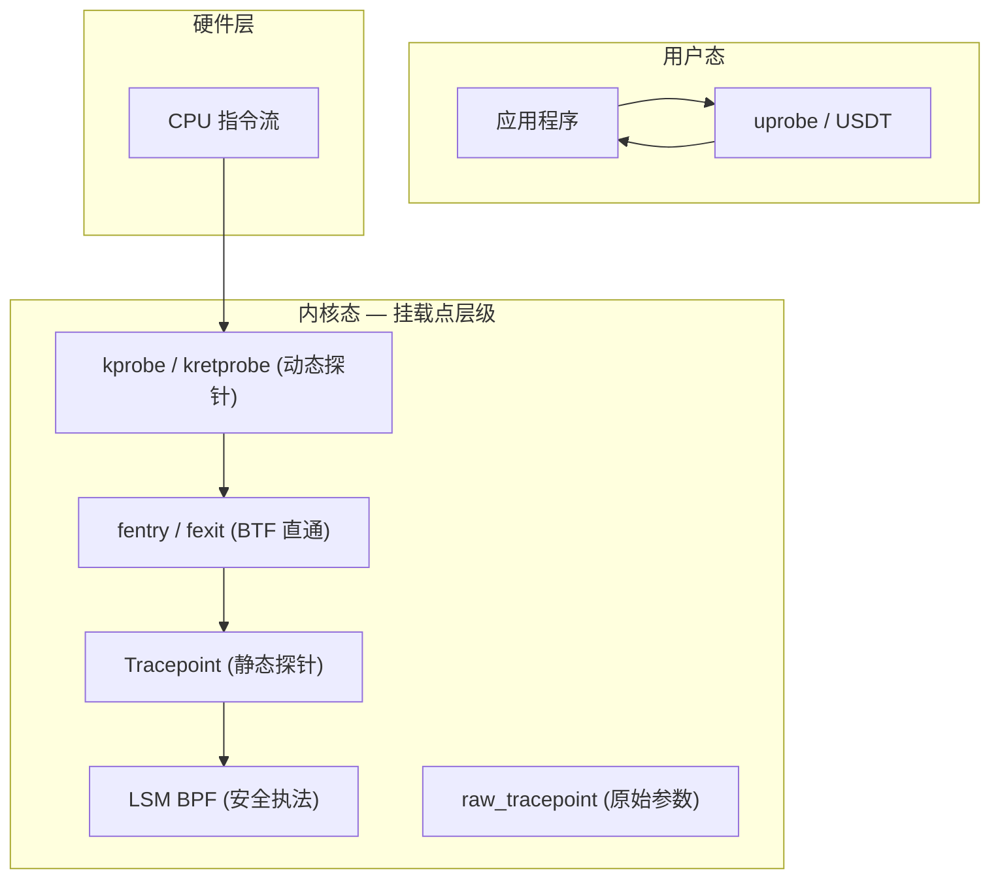
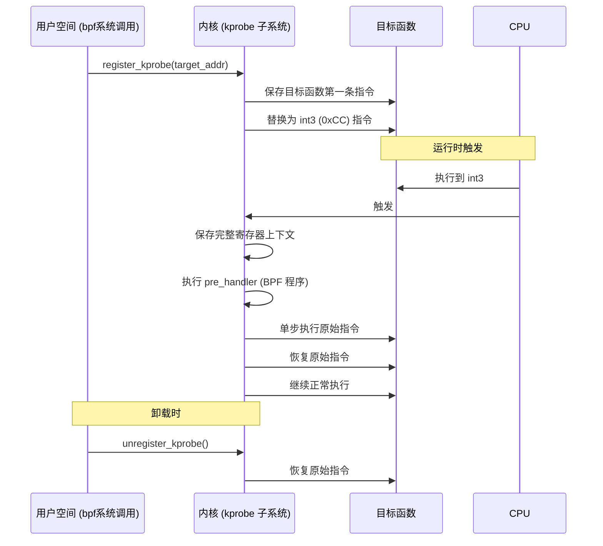
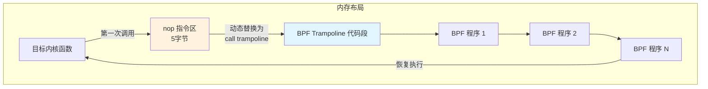
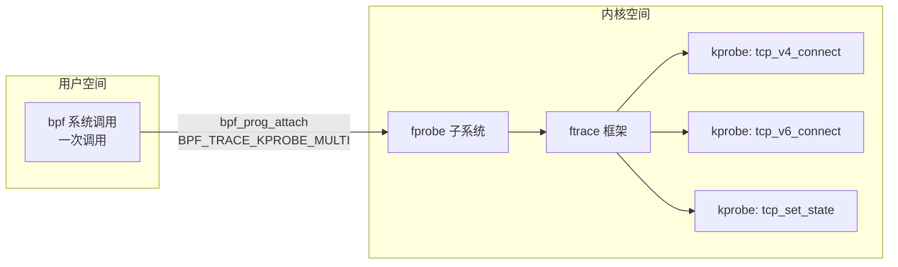
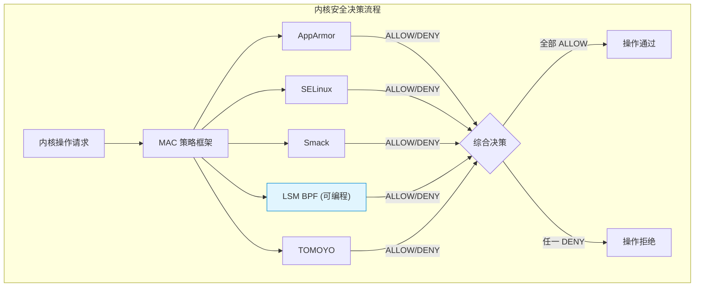
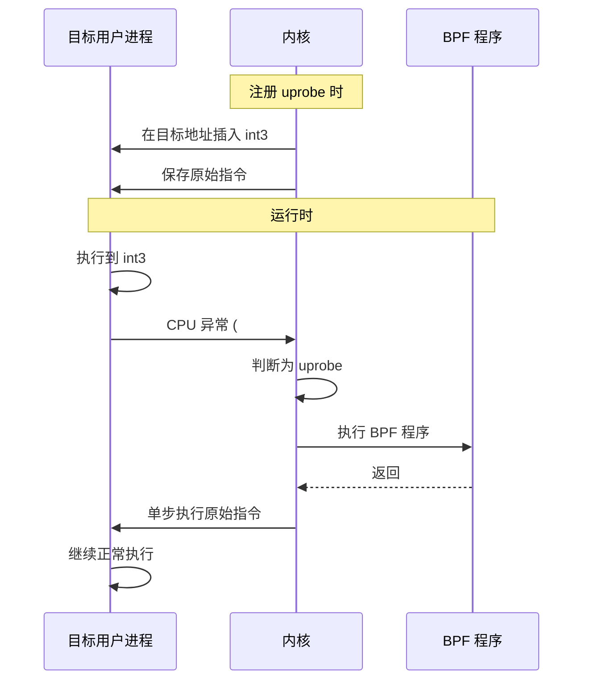
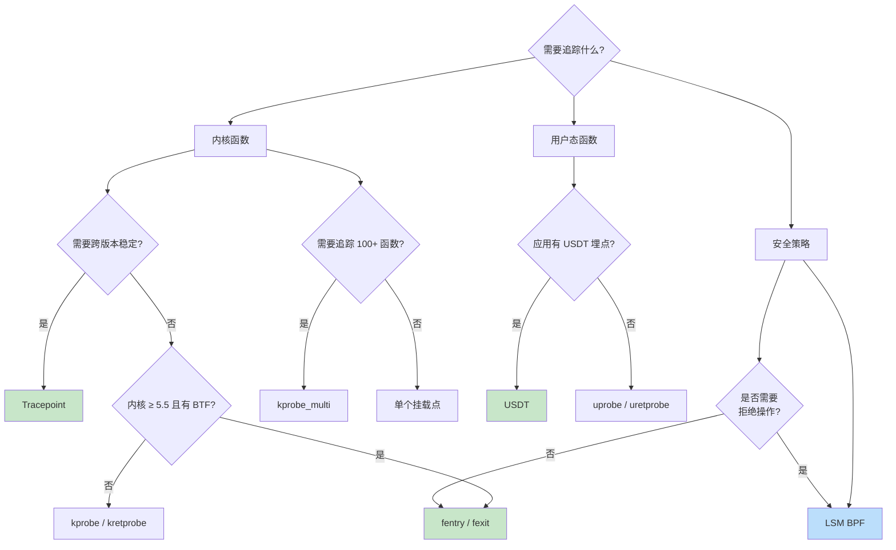
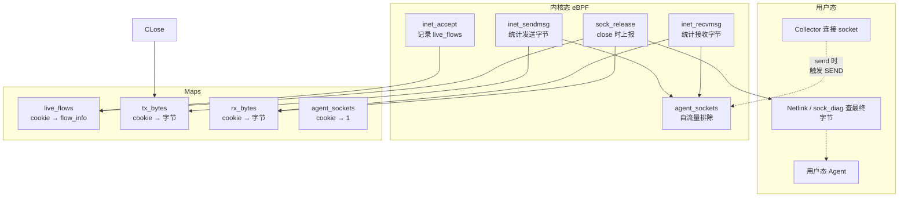
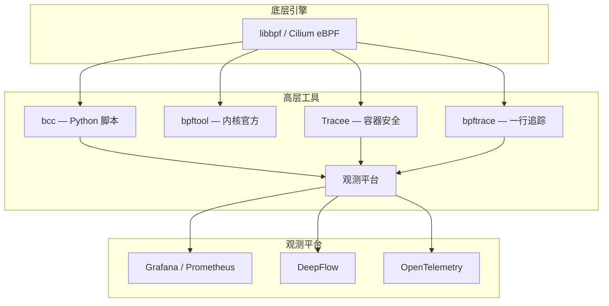

> [!info] eBPF 2026 深度探索系列
> 0. [[2026-04-08-ebpf-comprehensive-learning-roadmap|全栈学习路径总览]]
> 1. [[2026-04-08-ebpf-deep-dive-ch1-registers-and-instructions|第一章：寄存器与指令集]]
> 2. [[2026-04-08-ebpf-deep-dive-ch1-5-function-calls|第一.五章：四种函数调用与动态内存]]
> 3. [[2026-04-08-ebpf-deep-dive-ch1-6-the-verifier|第一.六章：验证器 (Verifier) 的底层逻辑]]
> 4. [[2026-04-08-ebpf-deep-dive-ch2-maps-and-communication|第二章：Map 机制与跨空间通信]]
> 5. [[2026-04-08-ebpf-deep-dive-ch2-5-kptr-and-ownership|第二.五章：kptr (内核指针) 与内存所有权模型]]
> 6. [[2026-04-08-ebpf-deep-dive-ch3-core-and-btf|第三章：CO-RE 与 BTF 的跨版本魔法]]
> 7. **第四章：从 kprobe 到 LSM 的追踪全图景**
> 8. [[2026-04-08-ebpf-deep-dive-ch7-5-uprobes-dynamic-tracing|第七.五章：uprobe 用户态动态追踪原理]]
> 9. [[2026-04-08-ebpf-deep-dive-ch7-6-bpftime-user-runtime|第七.六章：bpftime 与用户态 eBPF 加速]]
> 10. [[2026-04-08-ebpf-deep-dive-ch18-bpftime-injection-mastery|第七.七章：bpftime 自动化注入与全量监控实战]]
> 11. [[2026-04-08-ebpf-deep-dive-ch7-8-uprobe-selection-guide|第七.八章：uprobe 选型指南：内核态 vs 用户态]]
> 12. [[2026-04-08-ebpf-deep-dive-ch5-xdp-networking-performance|第五章：XDP 极致网络性能与全栈架构]]
> 13. [[2026-04-08-ebpf-deep-dive-ch6-tc-traffic-control|第六章：TC (Traffic Control) 流量调度艺术]]
> 14. [[2026-04-08-ebpf-deep-dive-ch7-security-lsm-enforcement|第七章：LSM BPF 从可观测到安全执法]]
> 15. [[2026-04-08-ebpf-deep-dive-ch8-advanced-tuning-and-profiling|第八章：进阶实战与内核调优]]
> 16. [[2026-04-08-ebpf-deep-dive-ch9-af-xdp-zero-copy|第九章：AF_XDP 零拷贝与用户态协议栈]]
> 17. [[2026-04-08-ebpf-deep-dive-ch10-sched-ext-custom-scheduler|第十章：sched_ext 自定义 CPU 调度器]]
> 18. [[2026-04-08-ebpf-deep-dive-ch11-bpf-iterators|第十一章：BPF Iterators 内核对象迭代器]]
> 19. [[2026-04-08-ebpf-deep-dive-ch12-kfuncs-evolution|第十二章：kfuncs 下一代内核交互标准]]
> 20. [[2026-04-08-ebpf-deep-dive-ch13-usdt-tracing|第十三章：USDT 用户态静态定义追踪]]
> 21. [[2026-04-08-ebpf-deep-dive-ch14-ai-llm-inference-monitoring|第十四章：AI 推理与大模型监控前沿]]
> 22. [[2026-04-08-ebpf-deep-dive-ch15-container-isolation|第十五章：无感增强容器隔离性]]
> 23. [[2026-04-08-ebpf-deep-dive-ch16-ebpf-and-wasm|第十六章：eBPF 与 WebAssembly (WASM) 的共生架构]]
> 24. [[2026-04-08-ebpf-deep-dive-ch17-storage-and-filesystem|第十七章：存储与文件系统加速]]
> 25. [[2026-04-08-ebpf-deep-dive-ch18-lifecycle-and-links|第十八章：生命周期管理与 BPF Links]]
> 26. [[2026-04-08-ebpf-deep-dive-ch19-atomic-updates-and-hot-upgrade|第十九章：程序的原子更新与蓝绿部署]]
> 27. [[2026-04-08-ebpf-deep-dive-ch25-5-stack-trace-correlation|第二五.五章：调用栈与业务请求的深度绑定]]
> 28. [[2026-04-08-ebpf-deep-dive-ch20-edge-iot-acceleration|第二十章：边缘计算与工业协议加速]]
> 29. [[2026-04-08-ebpf-deep-dive-ch21-debugging-and-verifier|第二十一章：调试实战与验证器 (Verifier) 诊断]]
> 30. [[2026-04-08-ebpf-deep-dive-ch22-testing-and-ci-cd|第二十二章：测试与持续集成 (CI/CD) 实战]]
> 31. [[2026-04-08-ebpf-deep-dive-ch23-security-and-permissions|第二十三章：权限细分与 BPF 安全沙箱]]
> 32. [[2026-04-08-ebpf-deep-dive-ch24-meta-monitoring-and-self-healing|第二十四章：eBPF 程序的内核自愈与监控]]
> 33. [[2026-04-08-ebpf-deep-dive-ch25-full-stack-observability|第二十五章：全栈可观测性与端到端追踪]]
> 34. [[2026-04-08-ebpf-deep-dive-ch26-network-security-high-level|第二十六章：网络安全防御的高阶实战]]
> 35. [[2026-04-08-ebpf-deep-dive-ch27-agent-engineering-architecture|第二十七章：工业级模块化 Agent 架构演进]]
> 36. [[2026-04-08-ebpf-deep-dive-ch28-offensive-and-defensive|第二十八章：攻防博弈与 Rootkit 防御]]
> 37. [[2026-04-08-ebpf-deep-dive-ch29-networking-deep-dive|第二十九章：网络应用深水区——负载均衡、Sockmap 与拥塞控制]]
> 38. [[2026-04-08-ebpf-deep-dive-ch30-hardware-offload|第三十章：硬件卸载与 SmartNIC 实战]]
> 39. [[2026-04-08-ebpf-deep-dive-ch31-signed-objects-and-security|第三十一章：内核原生签名与供应链安全]]
> 40. [[2026-04-08-ebpf-deep-dive-ch32-ebpf-for-windows|第三十二章：跨平台崛起——eBPF for Windows]]
> 41. [[2026-04-08-ebpf-deep-dive-ch32-5-macos-status|第三十二.五章：macOS 的特殊路径]]
> 42. [[2026-04-08-ebpf-deep-dive-ch33-serverless-optimization|第三十三章：Serverless 冷启动消除与动态计费]]
> 43. [[2026-04-08-ebpf-deep-dive-ch34-waf-and-rasp|第三十四章：Web 安全革命——内核态 WAF 与 RASP]]
> 44. [[2026-04-08-ebpf-deep-dive-ch35-npu-tpu-ai-hardware|第三十五章：AI 推理硬件 (NPU/TPU) 与硬件定义内核]]
> 45. [[2026-04-08-ebpf-deep-dive-ch36-dynamic-language-introspection|第三十六章：动态语言感知——业务对象的零代码提取]]
> 46. [[2026-04-08-ebpf-deep-dive-ch37-green-computing|第三十七章：绿色计算与能耗精准归因]]
> 47. [[2026-04-08-ebpf-deep-dive-ch38-ecosystem-and-career|第三十八章：2026 生态全景与工程师职业导航]]
> 48. [[2026-04-09-ebpf-deep-dive-ch39-rust-aya-framework|第三十九章：Rust eBPF 开发实战——Aya 框架与安全编程]]
> 49. [[2026-04-09-ebpf-deep-dive-ch40-network-protocols-deep-dive|第四十章：网络协议深度解析——TCP/UDP/QUIC 的 eBPF 视角]]
> 50. [[2026-04-09-ebpf-deep-dive-ch41-memory-safety-and-vulnerabilities|第四十一章：eBPF 内存安全与漏洞分析]]
> 51. [[2026-04-09-ebpf-deep-dive-ch42-service-mesh-integration|第四十二章：eBPF 与 Service Mesh 深度集成]]
---

# 第四章：从 kprobe 到 LSM 的追踪全图景

## 1. 追踪体系总览

eBPF 的追踪能力建立在一个分层的挂载点 (Attachment Point) 体系之上。从最底层的内核函数级拦截，到高层的 LSM 安全策略执行，每个挂载点都有其独特的性能特征、ABI 稳定性和适用场景。



### 1.1 挂载点的四大维度

评估一个挂载点是否适合你的场景，需要从四个维度综合考虑：

| 维度 | 说明 | 高 = 好 |
|:---|:---|:---|
| **性能开销** | 每次触发的 CPU 时间消耗 | 低开销 = 好 |
| **ABI 稳定性** | 跨内核版本是否保持兼容 | 稳定 = 好 |
| **参数可访问性** | 能否直接读取函数参数 | 类型安全 = 好 |
| **安全能力** | 能否拒绝/修改内核操作 | 可拒绝 = 强 |

---

## 2. kprobe：动态追踪的基石

### 2.1 底层实现原理

kprobe 是 Linux 内核最早的可动态插桩机制，其实现基于指令级修改：



**关键实现细节：**

1. **指令替换**：x86_64 架构下，目标函数的第一条指令被替换为 `int3`（机器码 `0xCC`，单字节），这是一个断点指令
2. **异常处理**：CPU 执行到 `int3` 时触发 `#BP` (Breakpoint) 异常，内核的 `do_int3()` 处理函数接管
3. **上下文保存**：在异常处理中，完整的 CPU 寄存器状态被保存到 `struct pt_regs` 中
4. **单步执行**：原始指令被临时恢复，通过设置 CPU 的 Trap Flag (TF) 单步执行后再次替换为 `int3`

### 2.2 kretprobe：函数返回值捕获

kretprobe 在 kprobe 基础上增加了返回值捕获能力：

```c
// kprobe 捕获入口参数
SEC("kprobe/do_sys_openat2")
int BPF_KPROBE(trace_open_entry, int dfd, const char __user *filename, int flags) {
    u64 pid_tgid = bpf_get_current_pid_tgid();
    u32 pid = pid_tgid >> 32;

    // 保存文件名到 Map，供 kretprobe 使用
    struct event *e = reserve_event();
    if (e) {
        bpf_probe_read_user_str(e->filename, sizeof(e->filename), filename);
        e->pid = pid;
        e->flags = flags;
    }
    return 0;
}

// kretprobe 捕获返回值
SEC("kretprobe/do_sys_openat2")
int BPF_KRETPROBE(trace_open_exit, int ret) {
    // ret 就是 do_sys_openat2 的返回值 (fd 或负错误码)
    struct event *e = get_reserved_event();
    if (e) {
        e->fd = ret;
        submit_event(e);
    }
    return 0;
}
```

**kretprobe 的实现陷阱 — trampoline 栈帧：**

kretprobe 并非简单地"在 return 指令处插桩"。它的工作原理是：

1. 在函数入口处（kprobe 位置）将返回地址替换为一段跳板代码 (trampoline)
2. 原始返回地址被保存到一个 per-CPU 的哈希表中
3. 当函数执行 `ret` 指令时，实际跳转到 trampoline
4. Trampoline 查表找到原始返回地址，执行 post_handler，然后跳回

这意味着 kretprobe 的开销比 kprobe 更大，因为它还涉及栈帧修改和额外的哈希表查找。

### 2.3 kprobe 的性能瓶颈

| 瓶颈 | 原因 | 量化影响 |
|:---|:---|:---|
| **中断开销** | `int3` 触发软中断，需要保存/恢复完整上下文 | ~500-1000ns per hit |
| **单步执行** | 原始指令需要单步恢复执行 | ~100-200ns |
| **缓存污染** | 异常处理代码不在指令缓存中 | 难以量化，但显著 |
| **并发限制** | 同一地址上的 kprobe 数量有上限 | 内核限制 128 个 |

### 2.4 BPF_KPROBE 宏的寄存器解析

`BPF_KPROBE` 宏自动将 `struct pt_regs` 中的寄存器映射为函数参数：

```c
// BPF_KPROBE 宏展开后等价于：
SEC("kprobe/do_sys_openat2")
int trace_open_entry(struct pt_regs *ctx) {
    // x86_64 调用约定：rdi, rsi, rdx, rcx, r8, r9
    int dfd       = PT_REGS_PARM1_CORE(ctx);  // rdi
    const char *filename = PT_REGS_PARM2_CORE(ctx);  // rsi
    int flags    = PT_REGS_PARM3_CORE(ctx);  // rdx
    // ...
}
```

**跨架构注意事项：** 不同 CPU 架构的调用约定不同。ARM64 使用 `x0-x7` 作为参数寄存器，而 x86_64 使用 `rdi/rsi/rdx/rcx/r8/r9`。BTF + CO-RE 可以在编译时自动适配，但如果使用原始 kprobe + `PT_REGS_PARM*`，需要确保编译目标架构与运行时一致。

---

## 3. fentry / fexit：BTF 驱动的新一代追踪

### 3.1 BPF Trampoline 机制

fentry/fexit 是 2020 年引入的新一代追踪机制，其核心是 **BPF Trampoline (蹦床)**：



**Trampoline 的关键技术优势：**

1. **无中断**：不使用 `int3`，而是将函数开头的 `nop` 指令（5 字节）替换为 `call` 指令，直接跳转到 Trampoline
2. **接近零开销**：在未被触发时，仅多了一条 `call` 指令的开销（~2-5ns），远低于 kprobe 的中断开销
3. **多程序聚合**：Trampoline 可以同时挂载多个 BPF 程序，按顺序执行，只需一次跳转
4. **BTF 类型安全**：函数签名直接从 BTF 获取，参数类型在编译期和验证期都受到检查

### 3.2 BPF_PROG 宏的参数魔法

虽然 eBPF VM 规定程序入口只能接收一个 R1 参数，但 `BPF_PROG` 宏通过 Trampoline 实现了"多参数"的错觉：

```c
// 看起来像普通 C 函数，有 3 个参数
SEC("fentry/vfs_write")
int BPF_PROG(trace_vfs_write, struct file *file,
             const char __user *buf, size_t count) {
    u32 pid = bpf_get_current_pid_tgid() >> 32;

    // 直接通过 BTF 访问内核结构体成员
    struct dentry *dentry = BPF_CORE_READ(file, f_path.dentry);
    char name[64] = {};
    bpf_probe_read_kernel_str(name, sizeof(name), dentry->d_name.name);

    bpf_printk("pid=%d write to %s, count=%d", pid, name, count);
    return 0;
}
```

**BPF_PROG 宏展开原理：**

```c
// 宏展开后的等价代码
SEC("fentry/vfs_write")
int trace_vfs_write(__u64 *ctx) {
    // ctx 是 Trampoline 在栈上构造的参数数组
    struct file *file = (struct file *)ctx[0];     // 对应 %rdi
    const char __user *buf = (const char *)ctx[1]; // 对应 %rsi
    size_t count = (size_t)ctx[2];                  // 对应 %rdx
    // ... 函数体 ...
}
```

Trampoline 在拦截目标函数时，将 CPU 寄存器中的参数值保存到栈上的一个数组中，然后将该数组的地址通过 R1 传给 BPF 程序。

### 3.3 fentry vs kprobe 详细对比

| 特性 | kprobe | fentry/fexit |
|:---|:---|:---|
| **触发机制** | `int3` 软中断 | `call` 指令跳转 |
| **典型开销** | 500-1000ns | 2-5ns |
| **参数访问** | `PT_REGS_PARM*` 宏 | 直接类型化参数 |
| **BTF 支持** | 部分支持 | 原生支持 |
| **返回值访问** | 需要 kretprobe | fexit 直接返回值参数 |
| **跨版本稳定** | 函数名可能变 | BTF 签名驱动 |
| **内核版本要求** | Linux 4.x+ | Linux 5.5+ |
| **内联函数** | 无法追踪 | 可以追踪 (配合 BTF) |
| **批量挂载** | kprobe_multi (ftrace) | BPF Sessions (5.16+) |

---

## 4. Tracepoint：内核预留的静态探针

### 4.1 核心设计哲学

Tracepoint 是内核开发者**主动暴露**的观测接口，代表"这些行为是我承诺不会随意更改的"。它不同于 kprobe 的"任意插桩"哲学，而是建立了一个 ABI 契约。

```c
// 内核源码中的 Tracepoint 定义 (net/netlink/af_netlink.c)
TRACE_EVENT(netlink_extack,
    TP_PROTO(const struct netlink_ext_ack *extack),

    TP_ARGS(extack),

    TP_STRUCT__entry(
        __field(const char *, msg)
        __field(u8, bad_attr)
        __field(u8, done)
    ),

    TP_fast_assign(
        __entry->msg = extack ? extack->_msg : NULL;
        __entry->bad_attr = extack ? extack->bad_attr : 0;
        __entry->done = extack ? extack->done : 0;
    ),

    TP_printk("msg=%s bad_attr=%u done=%u",
              __entry->msg ? __entry->msg : "(null)",
              __entry->bad_attr, __entry->done)
);
```

### 4.2 Tracepoint vs Raw Tracepoint

| 特性 | Tracepoint (`tp_btf`) | Raw Tracepoint (`raw_tp`) |
|:---|:---|:---|
| **参数格式** | 已解析的 `trace_event` 结构体 | 原始寄存器值 |
| **使用便捷性** | 高 — 结构体字段可直接访问 | 低 — 需手动解析 |
| **性能** | 略低（有结构体构造开销） | 略高（零拷贝） |
| **BTF 支持** | 有限 | 完整 |
| **推荐场景** | 快速原型开发 | 高频生产监控 |

```c
// Raw Tracepoint 示例：直接访问原始参数
SEC("raw_tracepoint/sys_enter")
int trace_sys_enter(struct bpf_raw_tracepoint_args *ctx) {
    // ctx->args[0] = 系统调用号 (long)
    // ctx->args[1-5] = 参数 (原始寄存器值)
    long syscall_nr = ctx->args[0];

    if (syscall_nr == __NR_execve) {
        // 读取第一个参数：filename 指针
        const char *filename;
        bpf_probe_read_user(&filename, sizeof(filename), &ctx->args[1]);
    }
    return 0;
}
```

### 4.3 查看可用 Tracepoint

```bash
# 列出所有 Tracepoint 类别
ls /sys/kernel/debug/tracing/events/

# 查看 sched_switch 的格式定义
cat /sys/kernel/debug/tracing/events/sched/sched_switch/format

# 输出示例：
# name: sched_switch
# ID: 308
# format:
#     field:unsigned short common_type;   offset:0;  size:2; signed:0;
#     field:unsigned char common_flags;   offset:2;  size:1; signed:0;
#     field:unsigned char common_preempt_count; offset:3; size:1; signed:0;
#     field:int common_pid;               offset:4;  size:4; signed:1;
#     field:char prev_comm[TASK_COMM_LEN]; offset:8;  size:16; signed:1;
#     field:pid_t prev_pid;               offset:24; size:4; signed:1;
#     ...
```

---

## 5. kprobe_multi 与 BPF Sessions：批量追踪

### 5.1 kprobe_multi

传统的 kprobe 每挂载一个函数需要一次 `bpf()` 系统调用。当需要监控数百个函数时，加载时间可能长达数秒。

```c
// kprobe_multi：一次系统调用挂载多个函数
SEC("kprobe.multi/skb_*")
int trace_skb_functions(struct pt_regs *ctx) {
    // 自动匹配所有以 skb_ 开头的内核函数
    // 内部使用 fprobe 实现
    return 0;
}

// 也可以手动指定函数列表
const char *syms[] = {
    "tcp_v4_connect",
    "tcp_v6_connect",
    "tcp_set_state",
    "tcp_rcv_established",
};
```

**kprobe_multi 内部实现：**



### 5.2 性能对比：单个 kprobe vs kprobe_multi

| 指标 | 单个 kprobe (100 函数) | kprobe_multi (100 函数) |
|:---|:---|:---|
| 系统调用次数 | 100 次 | 1 次 |
| 加载时间 | ~2-5 秒 | ~50ms |
| 运行时开销 | 相同 | 相同（都基于 ftrace） |
| 内存占用 | 100 个独立 kprobe 结构 | 1 个 fprobe 结构 |

---

## 6. LSM BPF：从观察者到执法者

### 6.1 核心突破

LSM (Linux Security Module) BPF 是 eBPF 追踪体系的"安全升级"。传统追踪程序（kprobe、fentry）只能**观察**内核行为，返回值被忽略。而 LSM BPF 程序可以**拒绝**内核操作。

```c
// LSM BPF：拒绝执行指定二进制
SEC("lsm/bprm_check_security")
int BPF_PROG(deny_malware, struct linux_binprm *bprm) {
    // 读取要执行的文件路径
    const char *filename;
    filename = BPF_CORE_READ(bprm, filename);

    char comm[16];
    bpf_probe_read_kernel_str(comm, sizeof(comm), filename);

    // 检查是否在黑名单中
    u32 key = 0;
    struct blocked *b = bpf_map_lookup_elem(&blacklist, &key);
    if (b && b->is_blocked) {
        bpf_printk("Blocked execution: %s", comm);
        return -EPERM;  // 拒绝执行！
    }
    return 0;
}
```

### 6.2 LSM BPF 可用的挂载点

| LSM Hook | 拦截能力 | 典型用途 |
|:---|:---|:---|
| `bprm_check_security` | 进程执行 | 防止恶意程序运行 |
| `file_open` | 文件打开 | 敏感文件保护 |
| `inode_permission` | 文件系统权限 | 细粒度访问控制 |
| `socket_bind` | Socket 绑定 | 端口保护 |
| `socket_connect` | 网络连接 | 出站连接控制 |
| `task_setuid` | UID 变更 | 特权提升防护 |
| `bpf_map` | BPF Map 操作 | Map 级安全策略 |
| `inode_rename` | 文件重命名 | 防篡改保护 |

### 6.3 LSM BPF 与传统 LSM 的关系



**关键要点：** LSM BPF 程序与其他 LSM 模块**并行运行**，不是替代关系。所有 LSM 模块都返回 ALLOW 时操作才被允许，任何一个返回 DENY 即被拒绝。

### 6.4 LSM BPF 的权限要求

加载 LSM BPF 程序需要特殊权限：

```bash
# 必须启用 BPF LSM
echo "lsm=bpf" | sudo tee /sys/kernel/security/lsm

# 或者在 GRUB 中配置
# GRUB_CMDLINE_LINUX="... lsm=apparmor,bpf"

# 运行时检查 LSM 链
cat /sys/kernel/security/lsm
# 输出：apparmor,bpf
```

---

## 7. 用户态追踪：uprobe 与 USDT

### 7.1 uprobe 原理

uprobe 是 kprobe 在用户态的镜像。它在用户空间二进制文件的指定地址处插入断点：



**uprobe 的性能挑战：**

| 挑战 | 原因 | 影响 |
|:---|:---|:---|
| **用户态-内核态切换** | 每次 uprobe 触发需要两次上下文切换 | ~2000-5000ns |
| **信号处理干扰** | `int3` 通过信号机制传递 | 可能被目标进程的信号处理器干扰 |
| **地址空间随机化** | ASLR 导致同一函数在不同进程中地址不同 | 需要配合符号表解析 |
| **JIT 编译代码** | JIT 生成的代码没有符号表 | 无法通过函数名挂载 |

```c
// uprobe 示例：追踪 malloc 调用
SEC("uprobe/libc.so.6:malloc")
int BPF_UPROBE(trace_malloc, size_t size) {
    u64 pid_tgid = bpf_get_current_pid_tgid();
    u32 pid = pid_tgid >> 32;
    u32 tid = pid_tgid;

    struct alloc_event e = {
        .pid = pid,
        .tid = tid,
        .size = size,
        .timestamp = bpf_ktime_get_ns(),
    };
    bpf_map_update_elem(&allocs, &tid, &e, BPF_ANY);
    return 0;
}

// uretprobe 捕获返回地址
SEC("uretprobe/libc.so.6:malloc")
int BPF_URETPROBE(trace_malloc_ret, void *ret) {
    u32 tid = bpf_get_current_pid_tgid();
    struct alloc_event *e = bpf_map_lookup_elem(&allocs, &tid);
    if (e) {
        e->addr = (u64)ret;
        // 提交到 Ring Buffer
        bpf_ringbuf_output(&events, e, sizeof(*e), 0);
    }
    return 0;
}
```

### 7.2 USDT (User-Level Statically Defined Tracing)

USDT 是应用开发者**主动暴露**的追踪接口，是用户态的 Tracepoint：

```c
// 应用程序中定义 USDT (使用 sys/sdt.h)
#include <sys/sdt.h>

void process_request(struct request *req) {
    DTRACE_PROBE2(myapp, request__start, req->id, req->size);
    // ... 处理逻辑 ...
    DTRACE_PROBE1(myapp, request__done, req->id);
}
```

```c
// eBPF 挂载 USDT 探针
SEC("usdt/libmyapp.so:myapp:request__start")
int BPF_USDT(trace_request_start, int request_id, size_t size) {
    // 参数直接可用，类型安全
    bpf_printk("request start: id=%d size=%d", request_id, size);
    return 0;
}
```

**USDT vs uprobe 对比：**

| 特性 | uprobe | USDT |
|:---|:---|:---|
| **定义方式** | 任意地址 | 开发者显式声明 |
| **ABI 稳定性** | 低（函数签名可能变） | 高（开发者承诺） |
| **性能** | ~2000-5000ns | ~2000-5000ns（同为断点机制） |
| **生产适用性** | 调试/临时监控 | 生产级监控 |
| **零开销** | 否（即使不挂载也有探测逻辑） | 是（不挂载时探针为 nop） |

---

## 8. 挂载点选型决策

### 8.1 决策流程图



### 8.2 选型速查表

| 场景 | 推荐挂载点 | 理由 |
|:---|:---|:---|
| 生产环境可观测性 | Tracepoint / fentry | ABI 稳定，跨版本兼容 |
| 调试特定内核 bug | kprobe | 最灵活，任意函数可插桩 |
| 全量内核审计 | kprobe_multi | 一次挂载数千函数 |
| 高频热路径监控 | fentry | 开销极低（2-5ns） |
| 安全策略执行 | LSM BPF | 唯一可拒绝操作的挂载点 |
| 追踪 Go/Python/Java | USDT > uprobe | 语言运行时通常提供 USDT |
| 捕获函数返回值 | fexit / kretprobe | 类型安全 vs 通用 |
| 内核版本 < 5.5 | kprobe / Tracepoint | fentry 不可用 |

---

## 9. 生产实战：全链路请求追踪

### 9.1 场景描述

追踪一个 HTTP 请求从内核接收（`tcp_v4_rcv`）到用户态应用处理（`read` 系统调用）的完整路径。

```c
// ==========================================
// Stage 1: 内核网络层 — 使用 fentry
// ==========================================
SEC("fentry/tcp_v4_rcv")
int BPF_PROG(trace_tcp_recv, struct sk_buff *skb) {
    struct sock *sk = BPF_CORE_READ(skb, sk);
    __be16 sport = BPF_CORE_READ(sk, __sk_common.skc_num);
    __be32 saddr = BPF_CORE_READ(sk, __sk_common.skc_rcv_saddr);

    u64 tgid = bpf_get_current_pid_tgid() >> 32;
    struct trace_ctx ctx = {
        .pid = tgid,
        .sport = sport,
        .saddr = saddr,
        .timestamp = bpf_ktime_get_ns(),
    };

    u64 id = bpf_ktime_get_ns();
    bpf_map_update_elem(&conn_track, &id, &ctx, BPF_ANY);
    return 0;
}

// ==========================================
// Stage 2: 系统调用层 — 使用 Tracepoint
// ==========================================
SEC("tp/syscalls/sys_enter_read")
int trace_sys_read_enter(struct trace_event_raw_sys_enter *ctx) {
    u64 pid_tgid = bpf_get_current_pid_tgid();
    u32 pid = pid_tgid >> 32;
    int fd = (int)ctx->args[0];

    struct read_ctx r = {
        .pid = pid,
        .fd = fd,
        .timestamp = bpf_ktime_get_ns(),
    };
    bpf_map_update_elem(&read_track, &pid, &r, BPF_ANY);
    return 0;
}

// ==========================================
// Stage 3: LSM 层 — 安全检查
// ==========================================
SEC("lsm/socket_connect")
int BPF_PROG(trace_socket_connect, struct socket *sock,
             struct sockaddr *addr, int addr_len) {
    // 记录出站连接尝试
    if (addr->sa_family == AF_INET) {
        struct sockaddr_in *sin = (struct sockaddr_in *)addr;
        u32 dest_ip = sin->sin_addr.s_addr;
        u16 dest_port = bpf_ntohs(sin->sin_port);

        struct conn_event e = {
            .dest_ip = dest_ip,
            .dest_port = dest_port,
            .timestamp = bpf_ktime_get_ns(),
        };
        bpf_ringbuf_output(&conn_events, &e, sizeof(e), 0);
    }
    return 0;  // 不阻止，仅记录
}
```

### 9.2 性能优化技巧

1. **Ring Buffer 而非 Perf Event**：对于高吞吐场景，Ring Buffer 的批量提交机制比 Perf Event Array 效率高 3-5 倍
2. **Per-CPU Map**：如果只需要聚合统计，使用 `BPF_MAP_TYPE_PERCPU_ARRAY` 避免锁竞争
3. **采样率控制**：对于热路径函数，使用 `bpf_get_prandom_u32() < sampling_rate` 控制采样
4. **字符串截断**：使用 `bpf_probe_read_*_str` 时指定合理的最大长度，避免不必要的拷贝
5. **提前返回**：将最常见的过滤条件放在 BPF 程序最前面，尽早返回减少开销

---

## 9.3 实战：kprobe 全流量抓取与自流量排除

本节实现一个完整的 eBPF 全流量抓取系统：kprobe 挂载在 `inet_sendmsg`/`inet_recvmsg`，追踪所有 TCP 流量，通过 socket cookie 排除自身发送的 collector 流量，在 `sock_close` 时一次性上报最终统计。

### 9.3.1 整体架构



### 9.3.2 数据结构

```c
// ============================================================
// flow_capture.h — 全流量抓取 eBPF 程序
// ============================================================

#define MAX_LIVE_FLOWS   100000
#define MAX_AGENT_SOCKS  1024

/* 活跃连接信息表：在 accept/connect 时写入，close 时读取并删除 */
struct {
    __uint(type, BPF_MAP_TYPE_HASH);
    __uint(max_entries, MAX_LIVE_FLOWS);
    __type(key, __u64);           /* sock_cookie */
    __type(value, struct flow_info);
} live_flows SEC(".maps");

/* 发送字节统计：每个 socket 一个累加值 */
struct {
    __uint(type, BPF_MAP_TYPE_HASH);
    __uint(max_entries, MAX_LIVE_FLOWS);
    __type(key, __u64);           /* sock_cookie */
    __type(value, __u64);         /* 累计发送字节数 */
} tx_bytes SEC(".maps");

/* 接收字节统计：每个 socket 一个累加值 */
struct {
    __uint(type, BPF_MAP_TYPE_HASH);
    __uint(max_entries, MAX_LIVE_FLOWS);
    __type(key, __u64);           /* sock_cookie */
    __type(value, __u64);         /* 累计接收字节数 */
} rx_bytes SEC(".maps");

/* 自流量排除表：agent 进程创建的 socket cookie 写入这里 */
struct {
    __uint(type, BPF_MAP_TYPE_HASH);
    __uint(max_entries, MAX_AGENT_SOCKS);
    __type(key, __u64);           /* sock_cookie */
    __type(value, __u8);          /* 固定值 1 */
} agent_sockets SEC(".maps");

/* 上报事件的 ring buffer */
struct {
    __uint(type, BPF_MAP_TYPE_RINGBUF);
    __uint(max_entries, 256 * 1024);
} events SEC(".maps");

/* 运行时注入：agent PID，用于过滤 */
const volatile __u32 agent_pid = 0;

/* 连接信息结构体 */
struct flow_info {
    __u32 saddr;          /* 源 IP */
    __u32 daddr;          /* 目的 IP */
    __u16 sport;          /* 源 port */
    __u16 dport;          /* 目的 port */
    __u8  proto;          /* 协议 (IPPROTO_TCP/UDP) */
    __u8  state;          /* 连接状态 */
    __u32 tid;            /* 创建该 socket 的线程 ID */
    __u64 timestamp;      /* 创建时间 */
};

/* 上报事件 */
struct flow_event {
    __u64 cookie;
    __u32 saddr;
    __u32 daddr;
    __u16 sport;
    __u16 dport;
    __u8  proto;
    __u8  state;
    __u64 tx_bytes;
    __u64 rx_bytes;
    __u64 duration_ns;    /* 连接持续时间 */
};
```

### 9.3.3 辅助函数

```c
/* 从 fd 获取 socket cookie */
static __always_inline __u64 get_sock_cookie_from_fd(int fd)
{
    struct socket *sock = bpf_sock_from_fd(fd);
    if (!sock)
        return 0;
    return bpf_sock_cookie(sock->sk);
}

/* 检查是否是 agent 自己的 socket */
static __always_inline int is_agent_socket(__u64 cookie)
{
    if (!agent_pid)
        return 0;
    __u8 *v = bpf_map_lookup_elem(&agent_sockets, &cookie);
    return v && *v == 1;
}

/* 检查是否是 agent 进程 */
static __always_inline int is_agent_process(void)
{
    if (!agent_pid)
        return 0;
    return bpf_get_current_pid_tgid() >> 32 == agent_pid;
}

/* 构建 flow_key（用于去重，实际上这里用 cookie 就够了） */
static __always_inline struct flow_info build_flow_info(struct sock *sk)
{
    struct flow_info info = {
        .saddr   = sk->__sk_common.skc_rcv_saddr,
        .daddr   = sk->__sk_common.skc_daddr,
        .sport   = sk->__sk_common.skc_num,
        .dport   = bpf_ntohs(sk->__sk_common.skc_dport),
        .proto   = sk->__sk_common.skc_protocol,
        .state   = sk->sk_state,
        .tid     = bpf_get_current_pid_tgid() & 0xFFFFFFFF,
        .timestamp = bpf_ktime_get_ns(),
    };
    return info;
}
```

### 9.3.4 核心挂载点

```c
// ============================================================
// 挂载点 1：inet_accept — 记录 downstream 连接（client → agent）
// ============================================================
SEC("kprobe/inet_accept")
int BPF_KPROBE(kprobe_accept, struct socket *listen_sock,
               struct socket *new_sock)
{
    struct sock *sk = new_sock->sk;
    if (!sk)
        return 0;

    __u64 cookie = bpf_sock_cookie(sk);
    struct flow_info info = build_flow_info(sk);

    /* 写入 live_flows */
    bpf_map_update_elem(&live_flows, &cookie, &info, BPF_ANY);

    /* 初始化 tx/rx 统计 */
    __u64 zero = 0;
    bpf_map_update_elem(&tx_bytes, &cookie, &zero, BPF_ANY);
    bpf_map_update_elem(&rx_bytes, &cookie, &zero, BPF_ANY);

    /* 如果是 agent 进程自己的 accept（agent 作为 server），
     * 也加入排除列表（虽然 agent 通常不会 accept collector 连接）*/
    if (is_agent_process()) {
        __u8 one = 1;
        bpf_map_update_elem(&agent_sockets, &cookie, &one, BPF_ANY);
    }

    return 0;
}

// ============================================================
// 挂载点 2：tcp_v4_connect — 记录 upstream 连接（agent → server）
// ============================================================
SEC("kprobe/tcp_v4_connect")
int BPF_KPROBE(kprobe_connect, struct sock *sk)
{
    if (!sk)
        return 0;

    /* 这个点发生在 connect() 调用时，连接还未完成
     * socket cookie 已经分配，但连接状态是 TCP_CLOSE */
    __u64 cookie = bpf_sock_cookie(sk);

    /* 如果是 agent 发起的连接（连 collector），加入排除列表 */
    if (is_agent_process()) {
        __u8 one = 1;
        bpf_map_update_elem(&agent_sockets, &cookie, &one, BPF_ANY);
    }

    return 0;
}

// ============================================================
// 挂载点 3：inet_sendmsg — 统计发送字节（排除自流量）
// ============================================================
SEC("kprobe/inet_sendmsg")
int BPF_KPROBE(kprobe_send, struct socket *sock,
               struct msghdr *msg, size_t size)
{
    struct sock *sk = sock->sk;
    if (!sk)
        return 0;

    __u64 cookie = bpf_sock_cookie(sk);

    /* 排除自流量：agent → collector 的发送不走统计 */
    if (is_agent_socket(cookie))
        return 0;

    /* 累加发送字节 */
    __u64 *tx = bpf_map_lookup_elem(&tx_bytes, &cookie);
    if (tx) {
        __sync_fetch_and_add(tx, size);
    }

    return 0;
}

// ============================================================
// 挂载点 4：inet_recvmsg — 统计接收字节（排除自流量）
// ============================================================
SEC("kprobe/inet_recvmsg")
int BPF_KPROBE(kprobe_recv, struct socket *sock,
               struct msghdr *msg, size_t size)
{
    struct sock *sk = sock->sk;
    if (!sk)
        return 0;

    __u64 cookie = bpf_sock_cookie(sk);

    /* 排除自流量 */
    if (is_agent_socket(cookie))
        return 0;

    /* 累加接收字节 */
    __u64 *rx = bpf_map_lookup_elem(&rx_bytes, &cookie);
    if (rx) {
        __sync_fetch_and_add(rx, size);
    }

    return 0;
}

// ============================================================
// 挂载点 5：sock_close — 连接关闭时上报统计
// ============================================================
SEC("kprobe/sock_release")
int BPF_KPROBE(kprobe_close, struct socket *sock)
{
    struct sock *sk = sock->sk;
    if (!sk)
        return 0;

    __u64 cookie = bpf_sock_cookie(sk);

    /* 查 live_flows，看是否是追踪的连接 */
    struct flow_info *info = bpf_map_lookup_elem(&live_flows, &cookie);
    if (!info)
        return 0;  /* 不是我们追踪的连接 */

    /* 查 tx/rx 统计 */
    __u64 tx = 0, rx = 0;
    __u64 *txp = bpf_map_lookup_elem(&tx_bytes, &cookie);
    __u64 *rxp = bpf_map_lookup_elem(&rx_bytes, &cookie);
    if (txp) tx = *txp;
    if (rxp) rx = *rxp;

    /* 构建上报事件 */
    struct flow_event event = {
        .cookie   = cookie,
        .saddr    = info->saddr,
        .daddr    = info->daddr,
        .sport    = info->sport,
        .dport    = info->dport,
        .proto    = info->proto,
        .state    = info->state,
        .tx_bytes = tx,
        .rx_bytes = rx,
        .duration_ns = bpf_ktime_get_ns() - info->timestamp,
    };

    /* 通过 ring buffer 上报 */
    bpf_ringbuf_output(&events, &event, sizeof(event), 0);

    /* 清理：删除 live_flows 和 tx/rx entries */
    bpf_map_delete_elem(&live_flows, &cookie);
    bpf_map_delete_elem(&tx_bytes, &cookie);
    bpf_map_delete_elem(&rx_bytes, &cookie);
    /* agent_sockets 的清理由 agent_pid 退出时自然过期（进程退出后 map 清空）*/

    return 0;
}

// ============================================================
// 挂载点 6：tcp_set_state — 追踪连接状态变化
// ============================================================
SEC("tracepoint/tcp/tcp_set_state")
int on_tcp_set_state(struct trace_event_raw_tcp_set_state *ctx)
{
    struct sock *sk = (struct sock *)ctx->skaddr;
    if (!sk)
        return 0;

    __u64 cookie = bpf_sock_cookie(sk);

    /* 更新连接状态 */
    struct flow_info *info = bpf_map_lookup_elem(&live_flows, &cookie);
    if (info) {
        info->state = ctx->new_state;
    }

    return 0;
}

char _license[] SEC("license") = "GPL";
```

### 9.3.5 用户态程序

```c
// ============================================================
// user.c — 用户态 Agent 主程序
// ============================================================
#include <stdio.h>
#include <stdlib.h>
#include <signal.h>
#include <unistd.h>
#include <sys/socket.h>
#include <linux/bpf.h>
#include <bpf/bpf.h>
#include <bpf/libbpf.h>
#include "flow_capture.skel.h"

static volatile int running = 1;

static void signal_handler(int sig)
{
    running = 0;
}

/* 处理 ring buffer 事件（从内核上报的 flow_event） */
static int handle_event(void *ctx, void *data, size_t len)
{
    struct flow_event *e = data;
    printf("[flow] cookie=0x%llx %pI4:%d -> %pI4:%d proto=%d "
           "tx=%llu rx=%llu duration=%lluus state=%d\n",
           e->cookie,
           &e->saddr, e->sport,
           &e->daddr, e->dport,
           e->proto,
           e->tx_bytes, e->rx_bytes,
           e->duration_ns / 1000,
           e->state);
    return 0;
}

int main(int argc, char **argv)
{
    struct flow_capture_bpf *skel;
    struct ring_buffer *rb = NULL;
    int agent_pid = getpid();

    printf("[*] agent pid=%d\n", agent_pid);

    /* -------- 加载 eBPF 程序 -------- */
    skel = flow_capture_bpf__open();
    if (!skel) {
        fprintf(stderr, "open failed\n");
        return 1;
    }

    /* 注入 agent_pid，运行时用于过滤 */
    skel->rodata->agent_pid = agent_pid;

    /* -------- 加载并 attach -------- */
    if (flow_capture_bpf__load(skel)) {
        fprintf(stderr, "load failed: %s\n", libbpf_strerror(errno));
        return 1;
    }

    /* attach 所有 kprobe */
    if (flow_capture_bpf__attach(skel)) {
        fprintf(stderr, "attach failed\n");
        return 1;
    }

    printf("[*] eBPF programs attached\n");

    /* -------- 设置 ring buffer 回调 -------- */
    int events_fd = bpf_map__fd(skel->maps.events);
    rb = ring_buffer__new(events_fd, handle_event, NULL, NULL);
    if (!rb) {
        fprintf(stderr, "ring_buffer__new failed\n");
        return 1;
    }

    /* -------- 连接 collector（会触发 tcp_v4_connect） -------- */
    int collector_fd = socket(AF_INET, SOCK_STREAM, 0);
    struct sockaddr_in collector_addr = {
        .sin_family = AF_INET,
        .sin_port = htons(9000),
        .sin_addr.s_addr = inet_addr("10.0.1.100"),
    };

    if (connect(collector_fd, (struct sockaddr *)&collector_addr,
                sizeof(collector_addr)) < 0) {
        perror("connect collector");
        /* 不退出，collector 连接失败不影响业务流量抓取 */
    } else {
        printf("[*] connected to collector (fd=%d)\n", collector_fd);
    }

    /* -------- 信号处理 -------- */
    signal(SIGINT, signal_handler);
    signal(SIGTERM, signal_handler);

    /* -------- 主循环 -------- */
    printf("[*] capturing traffic...\n");
    while (running) {
        /* poll ring buffer，超时 1s */
        ring_buffer__poll(rb, 1000);
    }

    /* -------- 清理 -------- */
    printf("[*] shutting down...\n");
    close(collector_fd);
    ring_buffer__free(rb);
    flow_capture_bpf__destroy(skel);

    return 0;
}
```

### 9.3.6 整体数据流

```
同一台机器上，send/recv 的 5-tuple 方向天然相反，不会合并：

  socket_A (client 侧):
    send → 5-tuple = (10.0.0.1:50000 → 10.0.0.2:80)  ← 一个 key
    recv → 5-tuple = (10.0.0.2:80 → 10.0.0.1:50000) ← 另一个 key，天然分开！

  socket_B (server 侧):
    send → 5-tuple = (10.0.0.2:80 → 10.0.0.1:50000)
    recv → 5-tuple = (10.0.0.1:50000 → 10.0.0.2:80)

所以 send/recv 的重复计数问题在"同一机器"内本来就不存在：
  tx_bytes[cookie] 和 rx_bytes[cookie] 用 cookie 做 key 完全独立
  不会发生"同一字节被计入同一个 key"的情况
```

### 9.3.7 cookie 的唯一作用：排除自流量

```
cookie 的作用只有一件事：

  agent → collector 的发送 → inet_sendmsg 被触发
                                ↓
  bpf_sock_cookie(sk) → 查 agent_sockets → 存在 → 跳过统计
                                ↓
  防止自流量进入统计，导致自抓死循环

除此之外，cookie 不参与任何去重或合并逻辑。
```

### 9.3.8 运行结果

```bash
# 编译
clang -target bpf -O2 -g -I/usr/include/bpf \
      -I./vmlinux.h \
      flow_capture.bpf.c -o flow_capture.bpf.o

# 用户态程序
clang -O2 -g -o user user.c -lbpf -lelf

# 运行
$ sudo ./user
[*] agent pid=12345
[*] eBPF programs attached
[*] connected to collector (fd=8)
[*] capturing traffic...

# 模拟业务流量（另一台机器上）
$ curl http://10.0.1.200/api/data

# agent 输出：
[flow] cookie=0x7f3a1b2c3d4e5f00 10.0.0.50:45678 -> 10.0.1.200:80 proto=6 tx=523 rx=4821 duration=1245000us state=1
[flow] cookie=0x8a9b0c1d2e3f4a0 10.0.1.200:80 -> 10.0.0.50:45678 proto=6 tx=4821 rx=523 duration=1245000us state=1

# collector 发送的包（自流量，被排除）：
# (无输出，inet_sendmsg 中的 is_agent_socket(cookie) 返回 true，统计被跳过)
```

### 9.3.9 关键设计决策

| 决策 | 选择 | 原因 |
|------|------|------|
| **统计时机** | close 时一次性上报 | map 只存活跃连接，不存在重复计数 |
| **自流量排除** | cookie 查 agent_sockets | 不依赖 IP/端口，精确到 socket 级别 |
| **tx/rx 分开** | tx_bytes[cookie] + rx_bytes[cookie] | send/recv 的 5-tuple 方向天然相反，但按 cookie 分表更直接准确 |
| **socket pair 关联** | 不做 | 上报时每条记录包含 tx/rx，远端可自行聚合 |
| **close 前查最终字节** | 用户态 netlink | eBPF 里 getsockopt 能力有限，close 后通过 sock_diag 拿精确值 |

### 9.3.10 已知局限

| 局限 | 影响 | 缓解方案 |
|------|------|----------|
| **kprobe 中断开销** | 高频 send/recv 时 ~500-1000ns/call | 生产环境用 fentry 替代 |
| **老内核 (< 5.6)** | 无 bpf_sock_cookie | 用 tid<<32 \| fd 或 getsockopt(SO_COOKIE) |
| **多线程共享 socket** | cookie 相同，tx/rx 合并统计 | 可接受，同一 socket 的统计本就该合并 |
| **进程退出时 map 未清理** | agent_sockets 残留 | 容器环境进程退出即清理，或定期同步 PID 列表 |
| **ring buffer 丢事件** | 高并发时可能丢失 | 调大 max_entries，或用 perf event array 兜底 |

---

## 10. 2026 追踪技术演进

### 10.1 新一代特性

| 特性 | 内核版本 | 影响 |
|:---|:---|:---|
| **BPF Sessions** | 5.16+ | fentry 批量挂载，全量审计成为可能 |
| **kprobe_multi** | 6.0+ | 一次系统调用挂载数千个函数 |
| **LSM BPF cgroup** | 6.0+ | per-cgroup 安全策略 |
| **BPF iterator** | 5.8+ | 安全遍历内核数据结构 |
| **user ring buffer** | 6.1+ | 用户态向内核推送事件 |

### 10.2 追踪工具生态



---

## 11. 常见问题 FAQ

**Q1：fentry 能追踪内联函数吗？**

A：可以，但有条件。如果内联函数的 BTF 信息存在（大多数情况），fentry 可以追踪。但要注意，内联函数的每次调用都会触发 fentry，可能导致同一个逻辑调用被多次记录。可以使用 `bpf_get_func_ip()` 获取调用者的地址来去重。

**Q2：kprobe 和 kretprobe 必须成对使用吗？**

A：不必须。kprobe 可以单独使用来监控函数入口参数。kretprobe 也可以单独使用来监控返回值。但要注意，kretprobe 的 trampoline 机制会在函数入口处插桩，即使你没有注册对应的 kprobe。

**Q3：LSM BPF 程序会影响系统性能吗？**

A：LSM BPF 程序在每个匹配的内核安全检查点都会执行。对于高频操作（如 `inode_permission`，文件系统每秒可能调用数百万次），一个低效的 LSM BPF 程序会显著影响系统性能。建议：保持 LSM 程序尽可能简短，使用 Map 缓存决策结果，避免在热路径中进行字符串比较。

**Q4：uprobe 能追踪 Go 程序吗？**

A：Go 程序的挑战在于：1) Go runtime 使用协程栈，寄存器中的参数可能已经被 spilling 到栈上；2) Go 的调用约定与 C 不同；3) Go 的 `cgo` 边界需要特殊处理。推荐使用 Go 的 USDT 探针（`runtime trace`）或使用特定工具如 `ecapture` 对 Go 程序进行追踪。

**Q5：如何处理 kprobe 目标函数被内联的情况？**

A：如果目标函数被编译器内联，kprobe 将无法找到该函数的入口地址。解决方案：1) 使用 `fentry`，它依赖 BTF 而非实际函数地址；2) 查找调用链上未被内联的上层函数；3) 查看编译选项，某些函数可以通过 `__attribute__((noinline))` 或 `noinline` 标记阻止内联。
