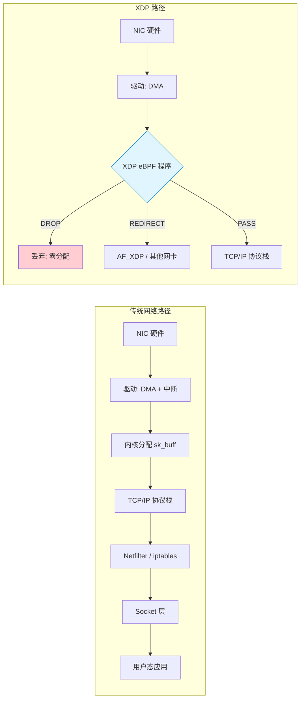
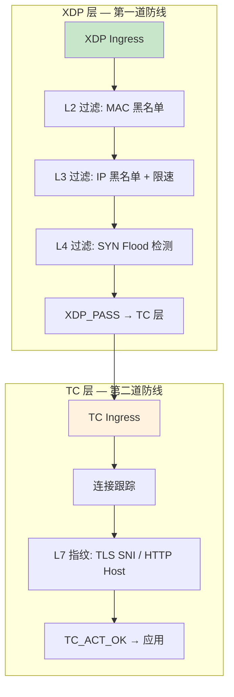
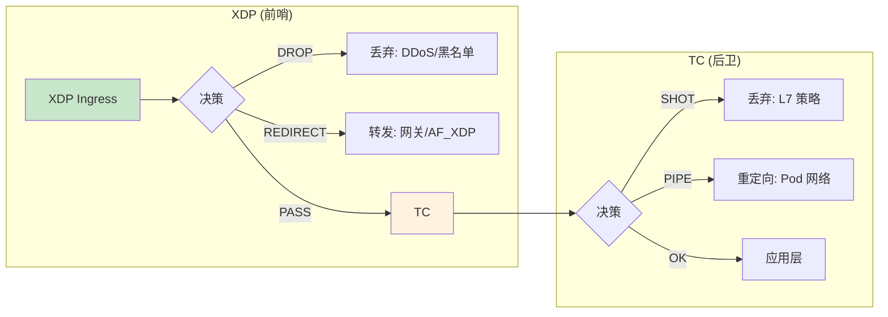
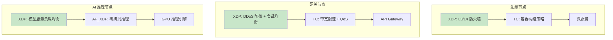

> [!info] eBPF 2026 深度探索系列
> 0. [[2026-04-08-ebpf-comprehensive-learning-roadmap|全栈学习路径总览]]
> 1. [[2026-04-08-ebpf-deep-dive-ch1-registers-and-instructions|第一章：寄存器与指令集]]
> 2. [[2026-04-08-ebpf-deep-dive-ch1-5-function-calls|第一.五章：四种函数调用与动态内存]]
> 3. [[2026-04-08-ebpf-deep-dive-ch1-6-the-verifier|第一.六章：验证器 (Verifier) 的底层逻辑]]
> 4. [[2026-04-08-ebpf-deep-dive-ch2-maps-and-communication|第二章：Map 机制与跨空间通信]]
> 5. [[2026-04-08-ebpf-deep-dive-ch2-5-kptr-and-ownership|第二.五章：kptr (内核指针) 与内存所有权模型]]
> 6. [[2026-04-08-ebpf-deep-dive-ch3-core-and-btf|第三章：CO-RE 与 BTF 的跨版本魔法]]
> 7. [[2026-04-08-ebpf-deep-dive-ch4-tracing-hooks-and-security|第四章：从 kprobe 到 LSM 的追踪全图景]]
> 8. [[2026-04-08-ebpf-deep-dive-ch7-5-uprobes-dynamic-tracing|第七.五章：uprobe 用户态动态追踪原理]]
> 9. [[2026-04-08-ebpf-deep-dive-ch7-6-bpftime-user-runtime|第七.六章：bpftime 与用户态 eBPF 加速]]
> 10. [[2026-04-08-ebpf-deep-dive-ch18-bpftime-injection-mastery|第七.七章：bpftime 自动化注入与全量监控实战]]
> 11. [[2026-04-08-ebpf-deep-dive-ch7-8-uprobe-selection-guide|第七.八章：uprobe 选型指南：内核态 vs 用户态]]
> 12. **第五章：XDP 极致网络性能与全栈架构**
> 13. [[2026-04-08-ebpf-deep-dive-ch6-tc-traffic-control|第六章：TC (Traffic Control) 流量调度艺术]]
> 14. [[2026-04-08-ebpf-deep-dive-ch7-security-lsm-enforcement|第七章：LSM BPF 从可观测到安全执法]]
> 15. [[2026-04-08-ebpf-deep-dive-ch8-advanced-tuning-and-profiling|第八章：进阶实战与内核调优]]
> 16. [[2026-04-08-ebpf-deep-dive-ch9-af-xdp-zero-copy|第九章：AF_XDP 零拷贝与用户态协议栈]]
> 17. [[2026-04-08-ebpf-deep-dive-ch10-sched-ext-custom-scheduler|第十章：sched_ext 自定义 CPU 调度器]]
> 18. [[2026-04-08-ebpf-deep-dive-ch11-bpf-iterators|第十一章：BPF Iterators 内核对象迭代器]]
> 19. [[2026-04-08-ebpf-deep-dive-ch12-kfuncs-evolution|第十二章：kfuncs 下一代内核交互标准]]
> 20. [[2026-04-08-ebpf-deep-dive-ch13-usdt-tracing|第十三章：USDT 用户态静态定义追踪]]
> 21. [[2026-04-08-ebpf-deep-dive-ch14-ai-llm-inference-monitoring|第十四章：AI 推理与大模型监控前沿]]
> 22. [[2026-04-08-ebpf-deep-dive-ch15-container-isolation|第十五章：无感增强容器隔离性]]
> 23. [[2026-04-08-ebpf-deep-dive-ch16-ebpf-and-wasm|第十六章：eBPF 与 WebAssembly (WASM) 的共生架构]]
> 24. [[2026-04-08-ebpf-deep-dive-ch17-storage-and-filesystem|第十七章：存储与文件系统加速]]
> 25. [[2026-04-08-ebpf-deep-dive-ch18-lifecycle-and-links|第十八章：生命周期管理与 BPF Links]]
> 26. [[2026-04-08-ebpf-deep-dive-ch19-atomic-updates-and-hot-upgrade|第十九章：程序的原子更新与蓝绿部署]]
> 27. [[2026-04-08-ebpf-deep-dive-ch25-5-stack-trace-correlation|第二五.五章：调用栈与业务请求的深度绑定]]
> 28. [[2026-04-08-ebpf-deep-dive-ch20-edge-iot-acceleration|第二十章：边缘计算与工业协议加速]]
> 29. [[2026-04-08-ebpf-deep-dive-ch21-debugging-and-verifier|第二十一章：调试实战与验证器 (Verifier) 诊断]]
> 30. [[2026-04-08-ebpf-deep-dive-ch22-testing-and-ci-cd|第二十二章：测试与持续集成 (CI/CD) 实战]]
> 31. [[2026-04-08-ebpf-deep-dive-ch23-security-and-permissions|第二十三章：权限细分与 BPF 安全沙箱]]
> 32. [[2026-04-08-ebpf-deep-dive-ch24-meta-monitoring-and-self-healing|第二十四章：eBPF 程序的内核自愈与监控]]
> 33. [[2026-04-08-ebpf-deep-dive-ch25-full-stack-observability|第二十五章：全栈可观测性与端到端追踪]]
> 34. [[2026-04-08-ebpf-deep-dive-ch26-network-security-high-level|第二十六章：网络安全防御的高阶实战]]
> 35. [[2026-04-08-ebpf-deep-dive-ch27-agent-engineering-architecture|第二十七章：工业级模块化 Agent 架构演进]]
> 36. [[2026-04-08-ebpf-deep-dive-ch28-offensive-and-defensive|第二十八章：攻防博弈与 Rootkit 防御]]
> 37. [[2026-04-08-ebpf-deep-dive-ch29-networking-deep-dive|第二十九章：网络应用深水区——负载均衡、Sockmap 与拥塞控制]]
> 38. [[2026-04-08-ebpf-deep-dive-ch30-hardware-offload|第三十章：硬件卸载与 SmartNIC 实战]]
> 39. [[2026-04-08-ebpf-deep-dive-ch31-signed-objects-and-security|第三十一章：内核原生签名与供应链安全]]
> 40. [[2026-04-08-ebpf-deep-dive-ch32-ebpf-for-windows|第三十二章：跨平台崛起——eBPF for Windows]]
> 41. [[2026-04-08-ebpf-deep-dive-ch32-5-macos-status|第三十二.五章：macOS 的特殊路径]]
> 42. [[2026-04-08-ebpf-deep-dive-ch33-serverless-optimization|第三十三章：Serverless 冷启动消除与动态计费]]
> 43. [[2026-04-08-ebpf-deep-dive-ch34-waf-and-rasp|第三十四章：Web 安全革命——内核态 WAF 与 RASP]]
> 44. [[2026-04-08-ebpf-deep-dive-ch35-npu-tpu-ai-hardware|第三十五章：AI 推理硬件 (NPU/TPU) 与硬件定义内核]]
> 45. [[2026-04-08-ebpf-deep-dive-ch36-dynamic-language-introspection|第三十六章：动态语言感知——业务对象的零代码提取]]
> 46. [[2026-04-08-ebpf-deep-dive-ch37-green-computing|第三十七章：绿色计算与能耗精准归因]]
> 47. [[2026-04-08-ebpf-deep-dive-ch38-ecosystem-and-career|第三十八章：2026 生态全景与工程师职业导航]]
> 48. [[2026-04-09-ebpf-deep-dive-ch39-rust-aya-framework|第三十九章：Rust eBPF 开发实战——Aya 框架与安全编程]]
> 49. [[2026-04-09-ebpf-deep-dive-ch40-network-protocols-deep-dive|第四十章：网络协议深度解析——TCP/UDP/QUIC 的 eBPF 视角]]
> 50. [[2026-04-09-ebpf-deep-dive-ch41-memory-safety-and-vulnerabilities|第四十一章：eBPF 内存安全与漏洞分析]]
> 51. [[2026-04-09-ebpf-deep-dive-ch42-service-mesh-integration|第四十二章：eBPF 与 Service Mesh 深度集成]]
---

# 第五章：XDP 极致网络性能与全栈架构

## 1. XDP：网卡驱动层的极速处理引擎

XDP (Express Data Path) 是 Linux 内核中性能最高的可编程网络路径。它的核心哲学是：**在数据包进入昂贵的 TCP/IP 协议栈之前，就对其进行处理。**

### 1.1 传统网络路径 vs XDP 路径



**性能差距的本质原因：**

| 开销来源 | 传统路径 | XDP 路径 |
|:---|:---|:---|
| sk_buff 分配 | 必须分配（~200ns） | DROP 时零分配 |
| 中断处理 | 每包一次硬件中断 | 可批量处理 |
| 协议栈解析 | L2→L3→L4 全部解析 | 仅在 PASS 时进入 |
| Netfilter 钩子 | 遍历所有 hook | 完全跳过 |
| 内存拷贝 | 可能多次拷贝 | 直接操作 DMA 内存 |

### 1.2 XDP 的性能边界

在单核 100Gbps 网络环境下（最小包 64 字节），理论上每秒需要处理约 1.48 亿个包（148.8 Mpps）。XDP 的 Native 模式在 Intel Xeon 上可以达到 **40-50 Mpps**（单核），是传统 iptables 的 **10-20 倍**。

---

## 2. XDP 的三种部署模式

### 2.1 三层卸载架构


| 模式            | 运行位置            | 性能         | 硬件要求                         | 适用场景       |
| :------------ | :-------------- | :--------- | :--------------------------- | :--------- |
| **Offloaded** | 网卡硬件 (SmartNIC) | 极致 (零 CPU) | Netronome、Mellanox BlueField | 数据中心核心     |
| **Native**    | 网卡驱动层           | 极高         | 驱动需支持 XDP                    | 生产环境主力     |
| **Generic**   | 协议栈入口           | 一般         | 无要求                          | 开发调试、CI/CD |

### 2.2 模式检测与降级

```c
// 加载 XDP 程序时的模式检测逻辑
int load_xdp(const char *ifname, struct bpf_program *prog) {
    struct bpf_link *link;

    // 尝试 Native 模式
    link = bpf_program__attach_xdp(prog, ifindex);
    if (!link) {
        // 降级到 Generic 模式
        printf("Falling back to generic XDP\n");
        link = bpf_program__attach_xdp(prog, ifindex);
    }
    return link ? 0 : -1;
}
```

**重要提示：** 在生产环境中，Generic 模式的性能远低于 Native 模式。如果网卡不支持 Native XDP，应考虑升级驱动或更换网卡，而不是依赖 Generic 模式处理高吞吐量。

---

## 3. 五大返回码：报文的生命裁决

XDP 程序的返回值直接决定数据包的去向：

| 返回码 | 值 | 行为 | 典型场景 |
|:---|:---|:---|:---|
| `XDP_ABORTED` | 0 | 丢弃 + 内核警告 | 程序异常 |
| `XDP_DROP` | 1 | 静默丢弃 | DDoS 防御 |
| `XDP_PASS` | 2 | 交给协议栈 | 正常流量 |
| `XDP_TX` | 3 | 原路返回 | L2 负载均衡 |
| `XDP_REDIRECT` | 4 | 重定向到其他网卡/AF_XDP | 网关转发 |

### 3.1 XDP_TX：L2 负载均衡原理

```c
// XDP_TX 示例：修改 MAC 地址后原路返回
SEC("xdp")
int xdp_l2_lb(struct xdp_md *ctx) {
    void *data_end = (void *)(long)ctx->data_end;
    void *data = (void *)(long)ctx->data;

    struct ethhdr *eth = data;
    if ((void *)(eth + 1) > data_end)
        return XDP_PASS;

    // 交换源和目的 MAC 地址
    unsigned char tmp[6];
    __builtin_memcpy(tmp, eth->h_source, 6);
    __builtin_memcpy(eth->h_source, eth->h_dest, 6);
    __builtin_memcpy(eth->h_dest, tmp, 6);

    return XDP_TX;  // 从接收网卡原路发回
}
```

### 3.2 XDP_REDIRECT：跨网卡转发

```c
// XDP_REDIRECT 示例：将流量重定向到另一个网卡
SEC("xdp")
int xdp_redirect_prog(struct xdp_md *ctx) {
    void *data_end = (void *)(long)ctx->data_end;
    void *data = (void *)(long)ctx->data;
    struct ethhdr *eth = data;

    if ((void *)(eth + 1) > data_end)
        return XDP_PASS;

    // 目标网卡 ifindex（通常从 Map 或配置获取）
    u32 target_ifindex = TARGET_IFINDEX;
    return bpf_redirect(target_ifindex, 0);
}
```

**REDIRECT 的 CP 引擎：** `bpf_redirect()` 本身非常轻量，它只设置一个标志位。真正的重定向操作由内核的 **CP (CP redirect) 引擎** 在 softirq 上下文中异步执行。这意味着 `bpf_redirect()` 的调用开销几乎为零。

---

## 4. XDP 内存模型与边界检查

### 4.1 直接内存访问

XDP 程序操作的是网卡 DMA 内存中的原始字节流，没有 `sk_buff` 结构体的保护。因此，**每个指针访问都必须进行边界检查**。

```c
SEC("xdp")
int xdp_parse_packet(struct xdp_md *ctx) {
    void *data_end = (void *)(long)ctx->data_end;
    void *data = (void *)(long)ctx->data;
    struct ethhdr *eth;

    // 边界检查 #1：以太网头
    eth = data;
    if ((void *)(eth + 1) > data_end)
        return XDP_PASS;

    // 边界检查 #2：仅当需要进一步解析时
    if (eth->h_proto != bpf_htons(ETH_P_IP))
        return XDP_PASS;

    struct iphdr *iph = (void *)(eth + 1);
    // 边界检查 #3：IP 头
    if ((void *)(iph + 1) > data_end)
        return XDP_PASS;

    // 边界检查 #4：变长头（如 TCP 选项）
    if (iph->protocol == IPPROTO_TCP) {
        struct tcphdr *th = (void *)(iph + 1);
        if ((void *)(th + 1) > data_end)
            return XDP_PASS;

        // 使用 bpf_ntohl 读取网络字节序
        u16 dest_port = bpf_ntohs(th->dest);
    }

    return XDP_PASS;
}
```

### 4.2 为什么边界检查如此关键

XDP 的 `data` 和 `data_end` 指针直接指向 DMA 内存区域。验证器要求**所有内存访问都被证明在 `[data, data_end)` 范围内**。如果缺少边界检查：

1. **验证期拒绝**：Verifier 会拒绝加载程序
2. **安全风险**：即使绕过验证器，越界访问可能导致内核崩溃

### 4.3 data_meta：XDP 独有的自定义元数据

```c
// XDP 可以在 data 之前添加自定义元数据
SEC("xdp")
int xdp_with_meta(struct xdp_md *ctx) {
    void *data_end = (void *)(long)ctx->data_end;
    void *data = (void *)(long)ctx->data;

    // 在 data 之前预留 16 字节的元数据空间
    int offset = 16;
    if (bpf_xdp_adjust_meta(ctx, -offset))
        return XDP_DROP;

    // 现在可以访问 meta 区域
    void *meta = (void *)(long)ctx->data_meta;
    if (meta + offset > data)
        return XDP_DROP;

    // 写入自定义元数据，TC 层或 AF_XDP 可读取
    struct my_meta *m = meta;
    m->timestamp = bpf_ktime_get_ns();
    m->queue_id = ctx->rx_queue_index;

    return XDP_PASS;
}
```

---

## 5. 生产实战：L3/L4 DDoS 防御系统

### 5.1 多层防御架构



### 5.2 完整 DDoS 过滤代码

```c
// ============================================
// XDP DDoS 防御 — 完整示例
// ============================================

struct {
    __uint(type, BPF_MAP_TYPE_LPM_TRIE);
    __uint(key_size, sizeof(struct bpf_lpm_trie_key));
    __uint(value_size, sizeof(u32));
    __uint(max_entries, 100000);
    __uint(map_flags, BPF_F_NO_PREALLOC);
} ip_blacklist SEC(".maps");

struct {
    __uint(type, BPF_MAP_TYPE_PERCPU_ARRAY);
    __uint(key_size, sizeof(u32));
    __uint(value_size, sizeof(struct rate_limit));
    __uint(max_entries, 1);
} rate_limits SEC(".maps");

struct rate_limit {
    u64 packets;
    u64 last_update;
    u64 max_pps;
};

struct {
    __uint(type, BPF_MAP_TYPE_PERCPU_HASH);
    __uint(key_size, sizeof(u32));  // src IP
    __uint(value_size, sizeof(u64)); // conn count
    __uint(max_entries, 1000000);
} conn_track SEC(".maps");

// SYN Flood 检测
SEC("xdp")
int xdp_ddos_filter(struct xdp_md *ctx) {
    void *data_end = (void *)(long)ctx->data_end;
    void *data = (void *)(long)ctx->data;

    struct ethhdr *eth = data;
    if ((void *)(eth + 1) > data_end) return XDP_PASS;
    if (eth->h_proto != bpf_htons(ETH_P_IP)) return XDP_PASS;

    struct iphdr *iph = (void *)(eth + 1);
    if ((void *)(iph + 1) > data_end) return XDP_PASS;

    // === Layer 3: IP 黑名单 (LPM Trie) ===
    struct bpf_lpm_trie_key key = {
        .prefixlen = 32,
    };
    key.data = iph->saddr;

    u32 *blocked = bpf_map_lookup_elem(&ip_blacklist, &key);
    if (blocked && *blocked) {
        return XDP_DROP;
    }

    // === Layer 4: SYN Flood 检测 ===
    if (iph->protocol == IPPROTO_TCP) {
        struct tcphdr *th = (void *)(iph + 1);
        if ((void *)(th + 1) > data_end) return XDP_PASS;

        // 检测 SYN 包（非 ACK）
        if (th->syn && !th->ack) {
            u32 src_ip = iph->saddr;
            u64 *count = bpf_map_lookup_elem(&conn_track, &src_ip);
            u64 new_count = 1;

            if (count) {
                new_count = *count + 1;
                // 超过阈值则丢弃
                if (new_count > 1000) {
                    return XDP_DROP;
                }
            }
            bpf_map_update_elem(&conn_track, &src_ip, &new_count, BPF_ANY);
        }
    }

    // === 全局限速 (Token Bucket) ===
    u32 zero = 0;
    struct rate_limit *rl = bpf_map_lookup_elem(&rate_limits, &zero);
    if (rl) {
        u64 now = bpf_ktime_get_ns();
        // 简化的令牌桶：每纳秒补充 max_pps 个令牌
        u64 elapsed = now - rl->last_update;
        rl->packets += (elapsed * rl->max_pps) / 1000000000ULL;
        if (rl->packets > rl->max_pps)
            rl->packets = rl->max_pps;
        rl->last_update = now;

        if (rl->packets == 0)
            return XDP_DROP;
        rl->packets--;
    }

    return XDP_PASS;
}
```

### 5.3 用户态控制面

```c
// 用户态：动态更新 IP 黑名单
int update_blacklist(int map_fd, const char *cidr, u32 prefix_len) {
    struct bpf_lpm_trie_key key = { .prefixlen = prefix_len };
    inet_pton(AF_INET, cidr, &key.data);

    u32 value = 1;  // blocked
    return bpf_map_update_elem(map_fd, &key, &value, BPF_ANY);
}

// 添加 IP 段黑名单
update_blacklist(map_fd, "10.0.0.0", 8);       // 10.0.0.0/8
update_blacklist(map_fd, "192.168.1.100", 32); // 单个 IP
update_blacklist(map_fd, "203.0.113.0", 24);   // 203.0.113.0/24
```

---

## 6. XDP 与 TC 的协同架构

### 6.1 前后分工模型



### 6.2 功能分工对比

| 功能         | XDP            | TC         |
| :--------- | :------------- | :--------- |
| L2 DDoS 防御 | 最佳             | 可以但不推荐     |
| L3/L4 过滤   | 最佳             | 好          |
| L7 深度包检测   | 不支持（无 sk_buff） | 最佳         |
| 出向流量控制     | 不支持            | 最佳         |
| 容器网络策略     | 有限             | Cilium 的主力 |
| 带宽限速       | 不支持            | EDT 模式最佳   |
| AF_XDP 集成  | 原生支持           | 不直接支持      |

---

## 7. Multi-buff：处理 Jumbo Frames

### 7.1 传统 XDP 的 4KB 限制

传统 XDP 每个包只能占用一个内存页（通常 4KB），这意味着：

- 最大可处理包长 ≈ 4096 - 头部开销 ≈ 3800 字节
- 标准 MTU 1500 字节足够，但 **Jumbo Frames（9000 字节）无法处理**

### 7.2 Multi-buff 机制

```c
// Multi-buff 支持：处理跨页面的数据包
SEC("xdp")
int xdp_multi_buff(struct xdp_md *ctx) {
    void *data_end = (void *)(long)ctx->data_end;
    void *data = (void *)(long)ctx->data;

    // 检查是否为 multi-buff 包
    if (ctx->data_meta + sizeof(*eth) > data)
        return XDP_PASS;

    struct ethhdr *eth = (void *)(long)ctx->data;
    if ((void *)(eth + 1) > data_end)
        return XDP_PASS;

    // 对于 multi-buff 包，data_end 可能跨越页面边界
    // 验证器会自动处理跨页面的边界检查
    // 但要注意：bpf_xdp_load_bytes() 可以加载非连续数据
    struct iphdr iph_buf;
    bpf_xdp_load_bytes(ctx, sizeof(*eth), &iph_buf, sizeof(iph_buf));

    if (iph_buf.protocol == IPPROTO_UDP) {
        // 处理 UDP 载荷...
    }

    return XDP_PASS;
}
```

**Multi-buff 的关键 API：**

| API                     | 功能                | 内核版本  |
| :---------------------- | :---------------- | :---- |
| `bpf_xdp_load_bytes()`  | 从非线性数据加载字节        | 5.18+ |
| `bpf_xdp_store_bytes()` | 向非线性数据写入字节        | 5.18+ |
| `ctx->data`             | 第一个 fragment 的起始  | 始终可用  |
| `ctx->data_end`         | 最后一个 fragment 的结束 | 始终可用  |

---

## 8. XDP 程序链 (Program Chaining)

### 8.1 daisy-chain 模式

多个 XDP 程序可以链式执行，形成处理管道：

```c
// 程序 1: L2 过滤
SEC("xdp")
int xdp_l2_filter(struct xdp_md *ctx) {
    // MAC 地址过滤...
    return XDP_PASS;  // 传递给下一个程序
}

// 程序 2: L3 过滤
SEC("xdp")
int xdp_l3_filter(struct xdp_md *ctx) {
    // IP 黑名单过滤...
    return XDP_PASS;  // 传递给下一个程序
}

// 程序 3: L4 策略
SEC("xdp")
int xdp_l4_policy(struct xdp_md *ctx) {
    // TCP/UDP 策略...
    return XDP_PASS;
}
```

```bash
# 链式加载多个 XDP 程序
ip link set dev eth0 xdp obj l2_filter.o sec xdp
ip link set dev eth0 xdp obj l3_filter.o sec xdp chain
ip link set dev eth0 xdp obj l4_policy.o sec xdp chain
```

### 8.2 链式执行的性能考虑

- **缓存友好性**：链式执行意味着同一个包会被多个程序处理，增加了指令缓存压力
- **建议**：将最高频的过滤规则放在链的最前面，尽早 DROP 以减少后续开销
- **替代方案**：如果链太长，考虑将多个逻辑合并为一个程序，用 BPF Map 配置化

---

## 9. 性能调优实战

### 9.1 Per-CPU 队列亲和性

```c
// 使用 XDP 的 RX 队列信息做 Per-CPU 处理
SEC("xdp")
int xdp_cpu_affinity(struct xdp_md *ctx) {
    u32 cpu = bpf_get_smp_processor_id();
    u32 rxq = ctx->rx_queue_index;

    // 将特定 RX 队列的流量重定向到特定 CPU
    u32 target_cpu = rxq % num_cpus;
    return bpf_redirect_map(&cpu_map, target_cpu, 0);
}
```

### 9.2 批量操作 API

```c
// 用户态批量接收 XDP 处理结果
while (1) {
    // 批量接收 AF_XDP 帧
    unsigned int rcvd = xsk_ring_cons__peek(&rx, BATCH_SIZE, &idx_rx);
    if (!rcvd) continue;

    for (unsigned int i = 0; i < rcvd; i++) {
        // 处理每个帧...
    }

    xsk_ring_cons__release(&rx, rcvd);

    // 批量提交 TX 帧
    unsigned int sent = xsk_ring_prod__reserve(&tx, BATCH_SIZE, &idx_tx);
    xsk_ring_prod__submit(&tx, sent);
}
```

### 9.3 性能对比数据

| 场景 | XDP Native | XDP Generic | iptables | nftables |
|:---|:---|:---|:---|:---|
| 简单 DROP | 14.8 Mpps | 2.1 Mpps | 0.8 Mpps | 1.5 Mpps |
| L3 重定向 | 12.0 Mpps | 1.8 Mpps | 0.5 Mpps | 1.2 Mpps |
| L4 端口过滤 | 10.5 Mpps | 1.5 Mpps | 0.4 Mpps | 1.0 Mpps |

> 测试环境：Intel Xeon Gold 6230, Mellanox ConnectX-6, 单核

---

## 10. 2026 年 XDP 演进方向

### 10.1 新特性一览

| 特性 | 状态 | 影响 |
|:---|:---|:---|
| **Multi-buff** | 已稳定 (5.18+) | 支持 Jumbo Frames，NVMe-over-Fabrics |
| **XDP hints** | 实验性 | 硬件向 BPF 程序传递元数据（如 RSS hash） |
| **XDP on wireless** | 进展中 | WiFi 6/7 网卡支持 |
| **XDP bonding** | 已支持 | Bond 网卡的 XDP 处理 |
| **Hardware offload** | 成熟 | Netronome、Mellanox BlueField 2/3 |

### 10.2 XDP 在 2026 的典型部署架构



---

## 11. 常见问题 FAQ

**Q1：XDP 能处理出向流量吗？**

A：不能。XDP 仅在网卡接收路径（Ingress）运行。如果需要处理出向流量，使用 TC Egress。Cilium 的做法是：XDP 处理入向的快速过滤，TC 处理出向的策略执行。

**Q2：XDP 程序能调用 bpf_printk 吗？**

A：可以，但在生产环境中应避免。`bpf_printk` 有性能开销且输出到内核日志缓冲区。生产环境应使用 Perf Event Array 或 Ring Buffer 将数据发送到用户态处理。

**Q3：XDP 的 `data` 指针是物理内存还是虚拟内存？**

A：`data` 和 `data_end` 是内核虚拟地址（准确地说是 DMA 映射到内核地址空间的虚拟地址）。BPF 程序通过这些虚拟地址直接操作网卡 DMA 内存，避免了额外的内存拷贝。

**Q4：如何在不重启服务的情况下更新 XDP 程序？**

A：使用原子替换。通过 `bpf_xdp_attach()` 配合 `XDP_FLAGS_REPLACE` 标志，可以原子地替换旧程序。替换过程对数据平面是透明的，不会丢包。详见第十九章（原子更新与蓝绿部署）。

**Q5：XDP Generic 模式真的有用吗？**

A：有用，但仅限于开发/测试场景。Generic 模式的价值在于：1) 在不支持 Native XDP 的网卡上测试程序逻辑；2) CI/CD 环境中运行网络相关的测试用例；3) 在虚拟机环境中验证 XDP 程序。但它的性能（~2 Mpps）远不能满足生产需求。
