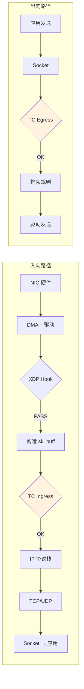
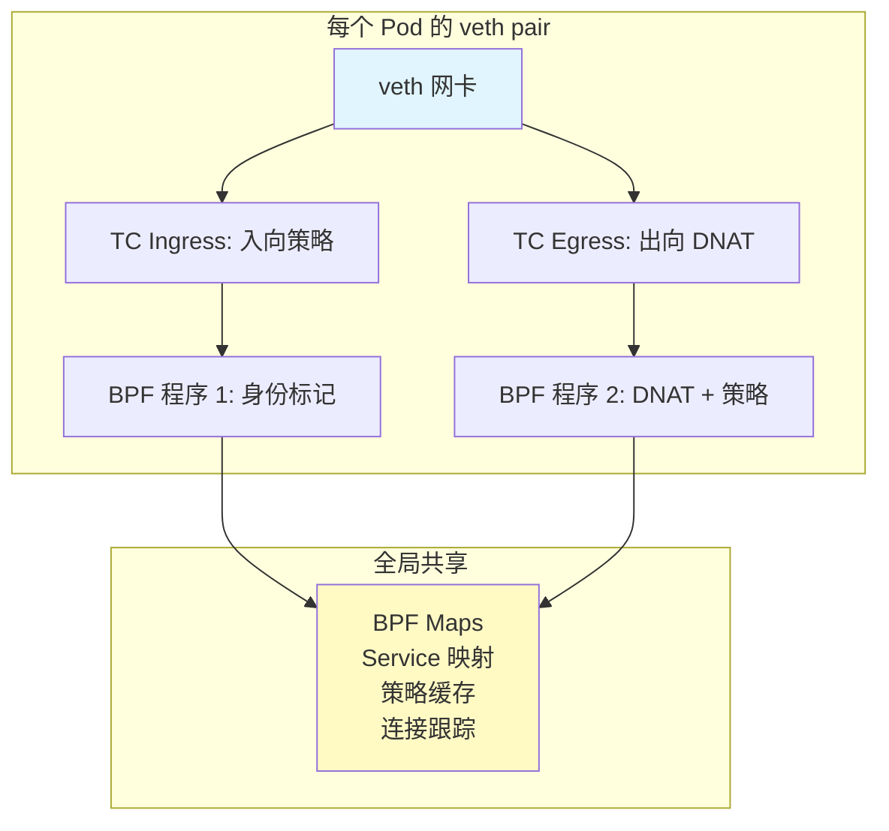
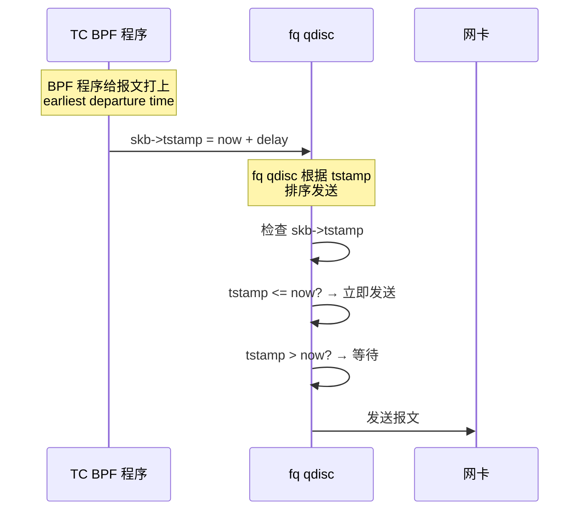
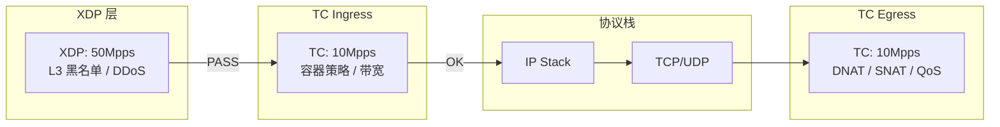

> [!info] eBPF 2026 深度探索系列 0. [[2026-04-08-ebpf-comprehensive-learning-roadmap|全栈学习路径总览]]
>
> 1. [[2026-04-08-ebpf-deep-dive-ch1-registers-and-instructions|第一章：寄存器与指令集]]
> 2. [[2026-04-08-ebpf-deep-dive-ch1-5-function-calls|第一.五章：四种函数调用与动态内存]]
> 3. [[2026-04-08-ebpf-deep-dive-ch1-6-the-verifier|第一.六章：验证器 (Verifier) 的底层逻辑]]
> 4. [[2026-04-08-ebpf-deep-dive-ch2-maps-and-communication|第二章：Map 机制与跨空间通信]]
> 5. [[2026-04-08-ebpf-deep-dive-ch2-5-kptr-and-ownership|第二.五章：kptr (内核指针) 与内存所有权模型]]
> 6. [[2026-04-08-ebpf-deep-dive-ch3-core-and-btf|第三章：CO-RE 与 BTF 的跨版本魔法]]
> 7. [[2026-04-08-ebpf-deep-dive-ch4-tracing-hooks-and-security|第四章：从 kprobe 到 LSM 的追踪全图景]]
> 8. [[2026-04-08-ebpf-deep-dive-ch7-5-uprobes-dynamic-tracing|第七.五章：uprobe 用户态动态追踪原理]]
> 9. [[2026-04-08-ebpf-deep-deep-dive-ch7-6-bpftime-user-runtime|第七.六章：bpftime 与用户态 eBPF 加速]]
> 10. [[2026-04-08-ebpf-deep-dive-ch18-bpftime-injection-mastery|第七.七章：bpftime 自动化注入与全量监控实战]]
> 11. [[2026-04-08-ebpf-deep-dive-ch7-8-uprobe-selection-guide|第七.八章：uprobe 选型指南：内核态 vs 用户态]]
> 12. [[2026-04-08-ebpf-deep-dive-ch5-xdp-networking-performance|第五章：XDP 极致网络性能与全栈架构]]
> 13. **第六章：TC (Traffic Control) 流量调度艺术**
> 14. [[2026-04-08-ebpf-deep-dive-ch7-security-lsm-enforcement|第七章：LSM BPF 从可观测到安全执法]]
> 15. [[2026-04-08-ebpf-deep-dive-ch8-advanced-tuning-and-profiling|第八章：进阶实战与内核调优]]
> 16. [[2026-04-08-ebpf-deep-dive-ch9-af-xdp-zero-copy|第九章：AF_XDP 零拷贝与用户态协议栈]]
> 17. [[2026-04-08-ebpf-deep-dive-ch10-sched-ext-custom-scheduler|第十章：sched_ext 自定义 CPU 调度器]]
> 18. [[2026-04-08-ebpf-deep-dive-ch11-bpf-iterators|第十一章：BPF Iterators 内核对象迭代器]]
> 19. [[2026-04-08-ebpf-deep-dive-ch12-kfuncs-evolution|第十二章：kfuncs 下一代内核交互标准]]
> 20. [[2026-04-08-ebpf-deep-dive-ch13-usdt-tracing|第十三章：USDT 用户态静态定义追踪]]
> 21. [[2026-04-08-ebpf-deep-dive-ch14-ai-llm-inference-monitoring|第十四章：AI 推理与大模型监控前沿]]
> 22. [[2026-04-08-ebpf-deep-dive-ch15-container-isolation|第十五章：无感增强容器隔离性]]
> 23. [[2026-04-08-ebpf-deep-dive-ch16-ebpf-and-wasm|第十六章：eBPF 与 WebAssembly (WASM) 的共生架构]]
> 24. [[2026-04-08-ebpf-deep-dive-ch17-storage-and-filesystem|第十七章：存储与文件系统加速]]
> 25. [[2026-04-08-ebpf-deep-dive-ch18-lifecycle-and-links|第十八章：生命周期管理与 BPF Links]]
> 26. [[2026-04-08-ebpf-deep-dive-ch19-atomic-updates-and-hot-upgrade|第十九章：程序的原子更新与蓝绿部署]]
> 27. [[2026-04-08-ebpf-deep-dive-ch25-5-stack-trace-correlation|第二五.五章：调用栈与业务请求的深度绑定]]
> 28. [[2026-04-08-ebpf-deep-dive-ch20-edge-iot-acceleration|第二十章：边缘计算与工业协议加速]]
> 29. [[2026-04-08-ebpf-deep-dive-ch21-debugging-and-verifier|第二十一章：调试实战与验证器 (Verifier) 诊断]]
> 30. [[2026-04-08-ebpf-deep-dive-ch22-testing-and-ci-cd|第二十二章：测试与持续集成 (CI/CD) 实战]]
> 31. [[2026-04-08-ebpf-deep-dive-ch23-security-and-permissions|第二十三章：权限细分与 BPF 安全沙箱]]
> 32. [[2026-04-08-ebpf-deep-dive-ch24-meta-monitoring-and-self-healing|第二十四章：eBPF 程序的内核自愈与监控]]
> 33. [[2026-04-08-ebpf-deep-dive-ch25-full-stack-observability|第二十五章：全栈可观测性与端到端追踪]]
> 34. [[2026-04-08-ebpf-deep-dive-ch26-network-security-high-level|第二十六章：网络安全防御的高阶实战]]
> 35. [[2026-04-08-ebpf-deep-dive-ch27-agent-engineering-architecture|第二十七章：工业级模块化 Agent 架构演进]]
> 36. [[2026-04-08-ebpf-deep-dive-ch28-offensive-and-defensive|第二十八章：攻防博弈与 Rootkit 防御]]
> 37. [[2026-04-08-ebpf-deep-dive-ch29-networking-deep-dive|第二十九章：网络应用深水区——负载均衡、Sockmap 与拥塞控制]]
> 38. [[2026-04-08-ebpf-deep-dive-ch30-hardware-offload|第三十章：硬件卸载与 SmartNIC 实战]]
> 39. [[2026-04-08-ebpf-deep-dive-ch31-signed-objects-and-security|第三十一章：内核原生签名与供应链安全]]
> 40. [[2026-04-08-ebpf-deep-dive-ch32-ebpf-for-windows|第三十二章：跨平台崛起——eBPF for Windows]]
> 41. [[2026-04-08-ebpf-deep-dive-ch32-5-macos-status|第三十二.五章：macOS 的特殊路径]]
> 42. [[2026-04-08-ebpf-deep-dive-ch33-serverless-optimization|第三十三章：Serverless 冷启动消除与动态计费]]
> 43. [[2026-04-08-ebpf-deep-dive-ch34-waf-and-rasp|第三十四章：Web 安全革命——内核态 WAF 与 RASP]]
> 44. [[2026-04-08-ebpf-deep-dive-ch35-npu-tpu-ai-hardware|第三十五章：AI 推理硬件 (NPU/TPU) 与硬件定义内核]]
> 45. [[2026-04-08-ebpf-deep-dive-ch36-dynamic-language-introspection|第三十六章：动态语言感知——业务对象的零代码提取]]
> 46. [[2026-04-08-ebpf-deep-dive-ch37-green-computing|第三十七章：绿色计算与能耗精准归因]]
> 47. [[2026-04-08-ebpf-deep-dive-ch38-ecosystem-and-career|第三十八章：2026 生态全景与工程师职业导航]]
> 48. [[2026-04-09-ebpf-deep-dive-ch39-rust-aya-framework|第三十九章：Rust eBPF 开发实战——Aya 框架与安全编程]]
> 49. [[2026-04-09-ebpf-deep-dive-ch40-network-protocols-deep-dive|第四十章：网络协议深度解析——TCP/UDP/QUIC 的 eBPF 视角]]
> 50. [[2026-04-09-ebpf-deep-dive-ch41-memory-safety-and-vulnerabilities|第四十一章：eBPF 内存安全与漏洞分析]]
> 51. [[2026-04-09-ebpf-deep-dive-ch42-service-mesh-integration|第四十二章：eBPF 与 Service Mesh 深度集成]]

---

# 第六章：TC (Traffic Control) 流量调度艺术

## 1. TC 在网络栈中的位置

如果说 XDP 是网络驱动层的"高速卡口"，那么 **TC (Traffic Control)** 就是内核协议栈 L2 层的"分拣中心"。TC BPF 位于 `sk_buff` 已构造完成之后、协议栈深度处理之前的位置，这使得它既能操作原始报文数据，又能利用内核预解析的元数据。



### 1.1 TC vs XDP 核心差异

| 维度           | XDP                      | TC (cls_bpf)                        |
| :------------- | :----------------------- | :---------------------------------- |
| **挂载点**     | 驱动层（SKB 构造前）     | 协议栈 L2 层（SKB 构造后）          |
| **上下文结构** | `xdp_md`（原始字节指针） | `__sk_buff`（结构化元数据）         |
| **方向**       | 仅 Ingress               | **Ingress + Egress**                |
| **性能**       | 极高（无 SKB 开销）      | 高（有 SKB 开销）                   |
| **协议解析**   | 手动（逐字节）           | 可利用 `skb->protocol` 等预解析字段 |
| **硬件要求**   | 需驱动支持 Native        | 无特殊要求                          |
| **适用场景**   | DDoS 防御、快速转发      | 策略执行、带宽控制、容器网络        |

---

## 2. TC 的 qdisc-class-filter 架构

### 2.1 传统 TC 架构

TC 的基础架构由三层组成：

```mermaid
graph TB
    IFACE[网卡 eth0] --> QDISC[qdisc: 排队规则<br>clsact (无队列)]
    QDISC --> CLS1[class/filter 1<br>TC Ingress]
    QDISC --> CLS2[class/filter 2<br>TC Egress]

    CLS1 --> ACT1[action 1: BPF 程序]
    CLS2 --> ACT2[action 2: BPF 程序]

    style QDISC fill:#e1f5fe
    style ACT1 fill:#c8e6c9
    style ACT2 fill:#c8e6c9
```

- **qdisc (Queueing Discipline)**：决定排队策略。对于 BPF，使用 `clsact`（无排队，纯分类）
- **class**：流量分类的容器
- **filter**：匹配规则，将流量导向特定 class 或执行 action

### 2.2 clsact：BPF 专用的 qdisc

```bash
# 创建 clsact qdisc（BPF TC 的基础）
tc qdisc add dev eth0 clsact

# 添加 Ingress filter
tc filter add dev eth0 ingress bpf da obj filter.o sec tc_ingress

# 添加 Egress filter
tc filter add dev eth0 egress bpf da obj filter.o sec tc_egress

# 查看已加载的 filter
tc filter show dev eth0 ingress
tc filter show dev eth0 egress

# 删除 filter
tc filter del dev eth0 ingress
```

**`clsact` 的特殊之处：** 与传统的 `ingress` qdisc 不同，`clsact` 不创建任何队列。它纯粹是一个 BPF 程序的挂载点，所有流量处理逻辑都在 BPF 程序中完成。

---

## 3. TC BPF 的 \_\_sk_buff 上下文

### 3.1 核心字段

`__sk_buff` 是 TC BPF 程序的上下文结构体，提供了丰富的预解析元数据：

```c
struct __sk_buff {
    __u32 len;           // 报文总长度
    __u32 pkt_type;      // PACKET_HOST, PACKET_BROADCAST 等
    __u32 mark;          // skb->mark (Netfilter 标记)
    __u32 queue_mapping; // RX 队列号
    __u32 protocol;      // 网络层协议 (ETH_P_IP, ETH_P_IPV6 等)
    __u32 vlan_present;  // 是否有 VLAN 标签
    __u32 vlan_tci;      // VLAN TCI
    __u32 vlan_proto;    // VLAN 协议
    __u32 priority;      // 优先级
    __u32 ingress_ifindex; // 入口网卡 ifindex
    __u32 ifindex;       // 当前网卡 ifindex
    __u32 tc_index;      // TC 分类索引
    __u32 cb[5];         // 通用控制块（自定义数据）
    __u32 hash;          // skb 哈希值
    __u32 tc_classid;    // 流量类别 ID
    __u64 tstamp;        // 时间戳
    __u32 wire_len;      // 线路长度（含 MAC 头）
    __u32 gso_size;      // GSO 段大小
    __u32 gso_segs;      // GSO 段数量

    // 数据指针（通过 helper 函数访问）
    __u64 data;          // 数据起始
    __u64 data_end;      // 数据结束
    __u64 data_meta;     // 元数据区域
};
```

### 3.2 数据访问方式

TC BPF 与 XDP 的一个重要区别是数据访问方式：

```c
SEC("tc")
int tc_parse(struct __sk_buff *skb) {
    // TC 中需要通过 helper 获取数据指针
    void *data_end = (void *)(long)skb->data_end;
    void *data = (void *)(long)skb->data;

    // 协议头解析与 XDP 相同
    struct ethhdr *eth = data;
    if ((void *)(eth + 1) > data_end)
        return TC_ACT_OK;

    // 利用 __sk_buff 的预解析字段
    __u16 proto = skb->protocol;  // 已解析的网络层协议
    if (proto != bpf_htons(ETH_P_IP))
        return TC_ACT_OK;

    return TC_ACT_OK;
}
```

**重要区别：** 在 TC 中，`skb->data` 和 `skb->data_end` 是通过 helper 函数访问的间接指针，不是 XDP 中直接的内存指针。这意味着 TC 的数据访问比 XDP 多一层间接寻址，但同时也意味着 TC 可以利用 `skb_pull`、`skb_push` 等 helper 函数修改 SKB 的数据区域。

---

## 4. Direct Action 模式与返回码

### 4.1 Direct Action (da) 模式

现代 TC BPF 推荐使用 **Direct Action** 模式（`tc filter` 命令中的 `da` 标志）。在此模式下，BPF 程序的返回值直接决定报文的处理方式，不需要传统的 class/action 链。

| 返回码              | 值  | 行为                   |
| :------------------ | :-- | :--------------------- |
| `TC_ACT_OK`         | 0   | 通过，继续后续处理     |
| `TC_ACT_SHOT`       | -1  | **丢弃报文**           |
| `TC_ACT_RECLASSIFY` | 1   | 重新分类（回到 qdisc） |
| `TC_ACT_PIPE`       | 3   | 传递给下一个 filter    |
| `TC_ACT_REDIRECT`   | 7   | 重定向到另一个接口     |
| `TC_ACT_UNSPEC`     | -1  | 使用默认动作           |

### 4.2 cb[]：自定义控制块

`skb->cb[5]` 是一个 5 个 `u32` 的数组，用于在 XDP→TC→应用之间传递自定义元数据：

```c
// TC Ingress：读取 XDP 设置的元数据
SEC("tc")
int tc_ingress(struct __sk_buff *skb) {
    // XDP 程序可以在 data_meta 中写入元数据
    // TC 程序通过 cb[] 接收

    // 方式 1：直接使用 cb[]
    u32 custom_mark = skb->cb[0];
    u32 queue_hint = skb->cb[1];

    // 方式 2：通过 bpf_skb_load_bytes 读取 data_meta
    struct xdp_meta meta;
    bpf_skb_load_bytes(skb, 0, &meta, sizeof(meta));

    return TC_ACT_OK;
}
```

---

## 5. TC 与容器网络：Cilium 的核心技术

### 5.1 零损耗 DNAT

在 Kubernetes 集群中，Pod A 访问 Service ClusterIP 时，传统方案使用 iptables 进行 DNAT，需要遍历复杂的规则链。Cilium 的 TC BPF 方案直接在 Pod 的 Egress 路径上完成 DNAT。

```c
// Cilium 的简化版 DNAT 实现
struct {
    __uint(type, BPF_MAP_TYPE_HASH);
    __uint(key_size, sizeof(struct endpoint_key));
    __uint(value_size, sizeof(struct endpoint_value));
    __uint(max_entries, 65536);
} service_map SEC(".maps");

SEC("tc")
int cilium_dnat(struct __sk_buff *skb) {
    void *data_end = (void *)(long)skb->data_end;
    void *data = (void *)(long)skb->data;

    struct ethhdr *eth = data;
    if ((void *)(eth + 1) > data_end) return TC_ACT_OK;

    if (eth->h_proto != bpf_htons(ETH_P_IP)) return TC_ACT_OK;

    struct iphdr *iph = (void *)(eth + 1);
    if ((void *)(iph + 1) > data_end) return TC_ACT_OK;

    // 查找 Service → 后端 Pod 映射
    struct endpoint_key key = {
        .protocol = iph->protocol,
        .ip = iph->daddr,
        .port = 0, // 从 TCP/UDP 头解析
    };

    struct endpoint_value *ep = bpf_map_lookup_elem(&service_map, &key);
    if (!ep) return TC_ACT_OK;

    // 修改目的 IP 和端口
    iph->daddr = ep->ip;

    // 修改 TCP/UDP 目的端口
    if (iph->protocol == IPPROTO_TCP) {
        struct tcphdr *th = (void *)(iph + 1);
        if ((void *)(th + 1) > data_end) return TC_ACT_OK;
        th->dest = ep->port;
    }

    // 重新计算校验和
    bpf_l4_csum_replace(skb,
        sizeof(struct ethhdr) + sizeof(struct iphdr) +
        offsetof(struct tcphdr, check),
        0, ep->port, sizeof(ep->port));

    return TC_ACT_OK;
}
```

### 5.2 Cilium 的 TC 加载模型



**性能优势：** 相比 iptables 的 O(n) 规则匹配（n 为规则数量），Cilium 的 TC BPF 方案使用 Hash Map 进行 O(1) 查找。在 10000 条 Service 规则的场景下，iptables 的延迟可达毫秒级，而 TC BPF 保持在微秒级。

---

## 6. EDT：精准带宽控制

### 6.1 Earliest Departure Time 机制

传统 TC 的 HTB (Hierarchical Token Bucket) 在多核环境下有严重的锁竞争问题。EDT (Earliest Departure Time) 是一种全新的带宽控制方式：



### 6.2 EDT BPF 实现

```c
// EDT 带宽控制
struct {
    __uint(type, BPF_MAP_TYPE_HASH);
    __uint(key_size, sizeof(u32));  // cgroup id
    __uint(value_size, sizeof(u64)); // rate (bytes per ns)
    __uint(max_entries, 1024);
} rate_map SEC(".maps");

SEC("tc")
int tc_edt(struct __sk_buff *skb) {
    u32 cgid = bpf_get_current_cgroup_id();
    u64 *rate = bpf_map_lookup_elem(&rate_map, &cgid);
    if (!rate)
        return TC_ACT_OK;

    // 计算该报文的最早发送时间
    u64 now = bpf_ktime_get_ns();
    u64 pkt_delay = (skb->len * 1000000000ULL) / *rate;
    u64 earliest = now + pkt_delay;

    // 设置 skb->tstamp，fq qdisc 会据此调度
    bpf_skb_set_tstamp(skb, earliest, BPF_F_TSTAMP_UNSPEC);

    return TC_ACT_OK;
}
```

```bash
# 配合 fq qdisc 使用 EDT
tc qdisc add dev eth0 root handle 1: fq

# 配合 EDT 的 fq qdisc 参数
tc qdisc add dev eth0 root handle 1: fq \
    pacing 1 \          # 启用 pacing
    low_rate_threshold 1500  # 低速率阈值
```

### 6.3 EDT vs HTB 性能对比

| 指标       | HTB                        | EDT + fq               |
| :--------- | :------------------------- | :--------------------- |
| 多核扩展性 | 差（全局锁）               | 优（Per-CPU 无锁）     |
| 延迟抖动   | 高（队列调度不精确）       | 低（精确时间戳调度）   |
| 配置复杂度 | 高（多层 class/hierarchy） | 低（一个 BPF 程序）    |
| 精度       | ~1ms                       | ~100ns                 |
| CPU 开销   | 高（规则遍历 + 锁）        | 低（Hash 查找 + 无锁） |

---

## 7. 代码实战：TC 流量过滤与重定向

### 7.1 基础过滤

```c
SEC("tc")
int tc_port_filter(struct __sk_buff *skb) {
    void *data_end = (void *)(long)skb->data_end;
    void *data = (void *)(long)skb->data;

    struct ethhdr *eth = data;
    if ((void *)(eth + 1) > data_end) return TC_ACT_OK;

    // 利用预解析的 protocol 字段快速过滤
    if (skb->protocol != bpf_htons(ETH_P_IP))
        return TC_ACT_OK;

    struct iphdr *iph = (void *)(eth + 1);
    if ((void *)(iph + 1) > data_end) return TC_ACT_OK;

    if (iph->protocol == IPPROTO_TCP) {
        struct tcphdr *th = (void *)(iph + 1);
        if ((void *)(th + 1) > data_end) return TC_ACT_OK;

        // 阻止特定端口
        u16 dest = bpf_ntohs(th->dest);
        if (dest == 22 || dest == 3389) {
            return TC_ACT_SHOT;
        }
    }

    return TC_ACT_OK;
}
```

### 7.2 TC 重定向

```c
// TC 重定向到另一个网卡
struct {
    __uint(type, BPF_MAP_TYPE_DEVMAP);
    __uint(key_size, sizeof(u32));
    __uint(value_size, sizeof(struct bpf_devmap_val));
    __uint(max_entries, 64);
} redirect_map SEC(".maps");

SEC("tc")
int tc_redirect(struct __sk_buff *skb) {
    void *data_end = (void *)(long)skb->data_end;
    void *data = (void *)(long)skb->data;

    struct ethhdr *eth = data;
    if ((void *)(eth + 1) > data_end) return TC_ACT_OK;

    // 修改目的 MAC 为目标网卡的 MAC
    __builtin_memcpy(eth->h_dest, target_mac, 6);

    // 重定向到目标网卡
    struct bpf_devmap_val val = {
        .ifindex = TARGET_IFINDEX,
    };
    return bpf_redirect_map(&redirect_map, TARGET_IFINDEX, 0);
}
```

### 7.3 用户态加载脚本

```c
// 用户态：加载 TC BPF 程序的完整流程
int attach_tc(const char *ifname, int prog_fd, bool ingress) {
    // 1. 创建 clsact qdisc（如果不存在）
    struct rtnl_link *link = rtnl_link_get_by_name(sock, ifname);

    // 2. 添加 filter
    struct tc_msg tcm = {
        .tcm_family = AF_UNSPEC,
        .tcm_ifindex = if_nametoindex(ifname),
        .tcm_parent = ingress ? TC_H_MAKE(TC_H_CLSACT, TC_H_MIN_INGRESS)
                              : TC_H_MAKE(TC_H_CLSACT, TC_H_MIN_EGRESS),
        .tcm_info = TC_H_MAKE(0xFFFF, 0),
    };

    // 3. 设置 BPF fd
    struct tcf_ematch_tree_hdr ethdr = {};
    struct nlattr *attr = ...;

    // 简化版：使用 iproute2
    char cmd[256];
    snprintf(cmd, sizeof(cmd),
        "tc filter add dev %s %s bpf da fd %d",
        ifname, ingress ? "ingress" : "egress", prog_fd);
    system(cmd);

    return 0;
}
```

---

## 8. TC 与 XDP 的协同部署

### 8.1 前后分工模型

```c
// === XDP 层：快速 L3/L4 过滤 ===
SEC("xdp")
int xdp_front_door(struct xdp_md *ctx) {
    // 1. IP 黑名单 → XDP_DROP
    // 2. 已知恶意流量 → XDP_DROP
    // 3. 正常流量 → XDP_PASS (进入 TC)
    return XDP_PASS;
}

// === TC Ingress 层：L4-L7 策略 ===
SEC("tc")
int tc_policy_ingress(struct __sk_buff *skb) {
    // 1. 容器网络策略检查
    // 2. 带宽限速 (EDT)
    // 3. 连接跟踪标记
    return TC_ACT_OK;
}

// === TC Egress 层：出向策略 ===
SEC("tc")
int tc_policy_egress(struct __sk_buff *skb) {
    // 1. DNAT (Service → Pod)
    // 2. SNAT (Pod IP → Node IP)
    // 3. 出向带宽控制
    return TC_ACT_OK;
}
```

### 8.2 数据流协同图



---

## 9. 高级技巧

### 9.1 skb 修改 API

```c
SEC("tc")
int tc_modify_skb(struct __sk_buff *skb) {
    // 调整数据区域大小（添加/移除头部）
    // bpf_skb_adjust_room 可以添加 VLAN 标签、隧道头等

    // 添加 VLAN 标签（push 4 字节）
    int ret = bpf_skb_vlan_push(skb, bpf_htons(ETH_P_8021Q), 100);
    if (ret) return TC_ACT_SHOT;

    // 移除 VLAN 标签
    ret = bpf_skb_vlan_pop(skb);
    if (ret) return TC_ACT_SHOT;

    // 修改 skb mark（供后续 Netfilter/iptables 使用）
    skb->mark = 0x1234;

    // 修改优先级
    skb->priority = 3;

    return TC_ACT_OK;
}
```

### 9.2 TC 中的 cgroup 级策略

```c
// 基于 cgroup ID 实现多租户带宽隔离
SEC("tc")
int tc_cgroup_bw(struct __sk_buff *skb) {
    u64 cgid = bpf_get_current_cgroup_id();

    // 查找该 cgroup 的带宽配额
    struct bw_limit *limit = bpf_map_lookup_elem(&cgroup_limits, &cgid);
    if (!limit) return TC_ACT_OK;

    // EDT 限速
    u64 now = bpf_ktime_get_ns();
    u64 delay = div_u64(skb->len * 1000000000ULL, limit->rate_bps);
    bpf_skb_set_tstamp(skb, now + delay, BPF_F_TSTAMP_UNSPEC);

    return TC_ACT_OK;
}
```

---

## 10. 常见问题 FAQ

**Q1：TC BPF 程序能修改报文内容吗？**

A：可以。TC BPF 可以修改 `sk_buff` 中的数据（如 IP 地址、端口、MAC 地址），也可以添加/移除头部（如 VLAN 标签、隧道封装）。使用 `bpf_skb_store_bytes()` 写入数据，`bpf_skb_adjust_room()` 调整头部空间。但要注意每次修改后需要重新计算校验和。

**Q2：TC 的性能比 XDP 差多少？**

A：取决于场景。对于简单的 DROP 操作，XDP 约 14.8 Mpps（单核），TC 约 2-4 Mpps。差距主要来自 SKB 的分配和管理开销。但对于需要修改报文或执行复杂策略的场景，TC 的结构化 `__sk_buff` 上下文实际上比 XDP 的原始字节操作更方便。

**Q3：clsact qdisc 可以和传统 qdisc 共存吗？**

A：可以。`clsact` 只占用 Ingress 方向（和 Egress 的 clsact filter），不会影响 Root qdisc（如 fq、htb）。实际部署中常见：`clsact` 负责 Ingress/Egress 的 BPF 过滤，Root qdisc（如 `fq`）负责出向排队。

**Q4：EDT 限速的精度如何？**

A：EDT 的理论精度取决于 `bpf_ktime_get_ns()` 的精度，通常在纳秒级别。但实际延迟精度受 fq qdisc 的调度周期影响，一般在 100ns-1μs 之间。对于 1Gbps 的带宽限制，一个 1500 字节的包需要 ~12μs 的延迟，EDT 可以精确控制到这个量级。

**Q5：如何调试 TC BPF 程序？**

A：1) 使用 `tc exec bpf dbg` 查看 BPF 程序的运行统计（指令数、命中次数）；2) 使用 `bpftool net show` 查看所有已挂载的 TC BPF 程序；3) 在 BPF 程序中使用 `bpf_trace_printk()` 输出调试信息（注意性能影响）；4) 使用 `bpf_printk` + `trace_pipe` 实时查看。
