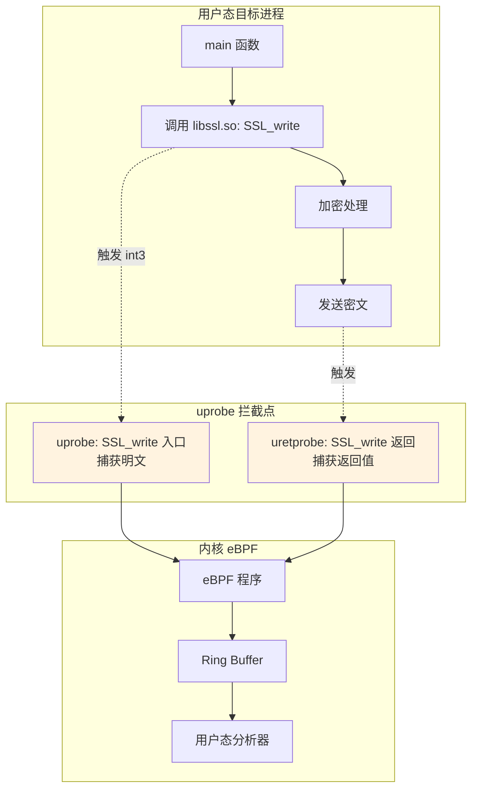
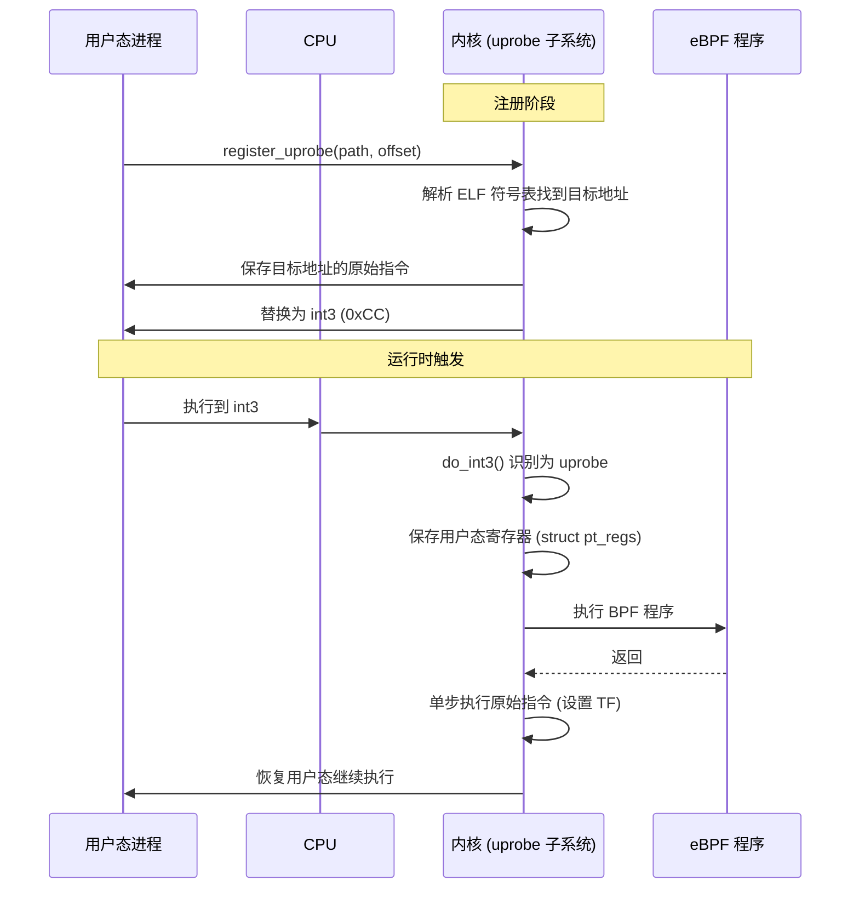
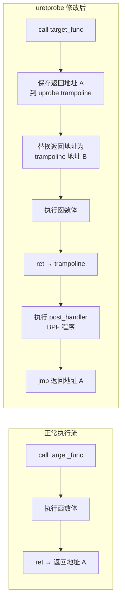

> [!info] eBPF 2026 深度探索系列
> 0. [[2026-04-08-ebpf-comprehensive-learning-roadmap|全栈学习路径总览]]
> 1. [[2026-04-08-ebpf-deep-dive-ch1-registers-and-instructions|第一章：寄存器与指令集]]
> 2. [[2026-04-08-ebpf-deep-dive-ch1-5-function-calls|第一.五章：四种函数调用与动态内存]]
> 3. [[2026-04-08-ebpf-deep-dive-ch1-6-the-verifier|第一.六章：验证器 (Verifier) 的底层逻辑]]
> 4. [[2026-04-08-ebpf-deep-dive-ch2-maps-and-communication|第二章：Map 机制与跨空间通信]]
> 5. [[2026-04-08-ebpf-deep-dive-ch2-5-kptr-and-ownership|第二.五章：kptr (内核指针) 与内存所有权模型]]
> 6. [[2026-04-08-ebpf-deep-dive-ch3-core-and-btf|第三章：CO-RE 与 BTF 的跨版本魔法]]
> 7. [[2026-04-08-ebpf-deep-dive-ch4-tracing-hooks-and-security|第四章：从 kprobe 到 LSM 的追踪全图景]]
> 8. **第七.五章：uprobe 用户态动态追踪原理**
> 9. [[2026-04-08-ebpf-deep-dive-ch7-6-bpftime-user-runtime|第七.六章：bpftime 与用户态 eBPF 加速]]
> 10. [[2026-04-08-ebpf-deep-dive-ch18-bpftime-injection-mastery|第七.七章：bpftime 自动化注入与全量监控实战]]
> 11. [[2026-04-08-ebpf-deep-dive-ch7-8-uprobe-selection-guide|第七.八章：uprobe 选型指南：内核态 vs 用户态]]
> 12. [[2026-04-08-ebpf-deep-dive-ch5-xdp-networking-performance|第五章：XDP 极致网络性能与全栈架构]]
> 13. [[2026-04-08-ebpf-deep-dive-ch6-tc-traffic-control|第六章：TC (Traffic Control) 流量调度艺术]]
> 14. [[2026-04-08-ebpf-deep-dive-ch7-security-lsm-enforcement|第七章：LSM BPF 从可观测到安全执法]]
> 15. [[2026-04-08-ebpf-deep-dive-ch8-advanced-tuning-and-profiling|第八章：进阶实战与内核调优]]
> 16. [[2026-04-08-ebpf-deep-dive-ch9-af-xdp-zero-copy|第九章：AF_XDP 零拷贝与用户态协议栈]]
> 17. [[2026-04-08-ebpf-deep-dive-ch10-sched-ext-custom-scheduler|第十章：sched_ext 自定义 CPU 调度器]]
> 18. [[2026-04-08-ebpf-deep-dive-ch11-bpf-iterators|第十一章：BPF Iterators 内核对象迭代器]]
> 19. [[2026-04-08-ebpf-deep-dive-ch12-kfuncs-evolution|第十二章：kfuncs 下一代内核交互标准]]
> 20. [[2026-04-08-ebpf-deep-dive-ch13-usdt-tracing|第十三章：USDT 用户态静态定义追踪]]
> 21. [[2026-04-08-ebpf-deep-dive-ch14-ai-llm-inference-monitoring|第十四章：AI 推理与大模型监控前沿]]
> 22. [[2026-04-08-ebpf-deep-dive-ch15-container-isolation|第十五章：无感增强容器隔离性]]
> 23. [[2026-04-08-ebpf-deep-dive-ch16-ebpf-and-wasm|第十六章：eBPF 与 WebAssembly (WASM) 的共生架构]]
> 24. [[2026-04-08-ebpf-deep-dive-ch17-storage-and-filesystem|第十七章：存储与文件系统加速]]
> 25. [[2026-04-08-ebpf-deep-dive-ch18-lifecycle-and-links|第十八章：生命周期管理与 BPF Links]]
> 26. [[2026-04-08-ebpf-deep-dive-ch19-atomic-updates-and-hot-upgrade|第十九章：程序的原子更新与蓝绿部署]]
> 27. [[2026-04-08-ebpf-deep-dive-ch25-5-stack-trace-correlation|第二五.五章：调用栈与业务请求的深度绑定]]
> 28. [[2026-04-08-ebpf-deep-dive-ch20-edge-iot-acceleration|第二十章：边缘计算与工业协议加速]]
> 29. [[2026-04-08-ebpf-deep-dive-ch21-debugging-and-verifier|第二十一章：调试实战与验证器 (Verifier) 诊断]]
> 30. [[2026-04-08-ebpf-deep-dive-ch22-testing-and-ci-cd|第二十二章：测试与持续集成 (CI/CD) 实战]]
> 31. [[2026-04-08-ebpf-deep-dive-ch23-security-and-permissions|第二十三章：权限细分与 BPF 安全沙箱]]
> 32. [[2026-04-08-ebpf-deep-dive-ch24-meta-monitoring-and-self-healing|第二十四章：eBPF 程序的内核自愈与监控]]
> 33. [[2026-04-08-ebpf-deep-dive-ch25-full-stack-observability|第二十五章：全栈可观测性与端到端追踪]]
> 34. [[2026-04-08-ebpf-deep-dive-ch26-network-security-high-level|第二十六章：网络安全防御的高阶实战]]
> 35. [[2026-04-08-ebpf-deep-dive-ch27-agent-engineering-architecture|第二十七章：工业级模块化 Agent 架构演进]]
> 36. [[2026-04-08-ebpf-deep-dive-ch28-offensive-and-defensive|第二十八章：攻防博弈与 Rootkit 防御]]
> 37. [[2026-04-08-ebpf-deep-dive-ch29-networking-deep-dive|第二十九章：网络应用深水区——负载均衡、Sockmap 与拥塞控制]]
> 38. [[2026-04-08-ebpf-deep-dive-ch30-hardware-offload|第三十章：硬件卸载与 SmartNIC 实战]]
> 39. [[2026-04-08-ebpf-deep-dive-ch31-signed-objects-and-security|第三十一章：内核原生签名与供应链安全]]
> 40. [[2026-04-08-ebpf-deep-dive-ch32-ebpf-for-windows|第三十二章：跨平台崛起——eBPF for Windows]]
> 41. [[2026-04-08-ebpf-deep-dive-ch32-5-macos-status|第三十二.五章：macOS 的特殊路径]]
> 42. [[2026-04-08-ebpf-deep-dive-ch33-serverless-optimization|第三十三章：Serverless 冷启动消除与动态计费]]
> 43. [[2026-04-08-ebpf-deep-dive-ch34-waf-and-rasp|第三十四章：Web 安全革命——内核态 WAF 与 RASP]]
> 44. [[2026-04-08-ebpf-deep-dive-ch35-npu-tpu-ai-hardware|第三十五章：AI 推理硬件 (NPU/TPU) 与硬件定义内核]]
> 45. [[2026-04-08-ebpf-deep-dive-ch36-dynamic-language-introspection|第三十六章：动态语言感知——业务对象的零代码提取]]
> 46. [[2026-04-08-ebpf-deep-dive-ch37-green-computing|第三十七章：绿色计算与能耗精准归因]]
> 47. [[2026-04-08-ebpf-deep-dive-ch38-ecosystem-and-career|第三十八章：2026 生态全景与工程师职业导航]]
> 48. [[2026-04-09-ebpf-deep-dive-ch39-rust-aya-framework|第三十九章：Rust eBPF 开发实战——Aya 框架与安全编程]]
> 49. [[2026-04-09-ebpf-deep-dive-ch40-network-protocols-deep-dive|第四十章：网络协议深度解析——TCP/UDP/QUIC 的 eBPF 视角]]
> 50. [[2026-04-09-ebpf-deep-dive-ch41-memory-safety-and-vulnerabilities|第四十一章：eBPF 内存安全与漏洞分析]]
> 51. [[2026-04-09-ebpf-deep-dive-ch42-service-mesh-integration|第四十二章：eBPF 与 Service Mesh 深度集成]]
---

# 第七章.5：uprobe 用户态动态追踪原理

## 1. uprobe：用户态的"外科手术"

uprobe (User-space Probes) 允许开发者在不修改目标程序源码、不重启进程的前提下，动态地在任意用户态函数（包括共享库函数）上挂载探针。它是实现"上帝视角"监控的关键技术——例如在 SSL 库加密前拦截明文，或在数据库驱动中拦截 SQL 语句。



---

## 2. 底层实现原理

### 2.1 CPU 断点机制

uprobe 的底层实现与 kprobe 类似，都基于 CPU 的异常处理机制，但作用域不同：



**关键实现细节：**

| 步骤 | x86_64 实现 | ARM64 实现 |
|:---|:---|:---|
| 断点指令 | `int3` (0xCC, 1 字节) | `brk` (0xD4200000, 4 字节) |
| 原始指令保存 | 保存 1+ 字节 | 保存 4+ 字节 |
| 寄存器保存 | `struct pt_regs` | `struct pt_regs` |
| 单步执行 | Trap Flag (EFLAGS.TF) | SS bit (SPSR_EL1.SS) |

### 2.2 uretprobe 的 trampoline 机制

uretprobe 捕获函数返回值，其实现比 uprobe 更复杂：



**uretprobe 的额外开销：**
- 在函数入口处修改栈上的返回地址（需要额外的内存写入）
- 维护 per-CPU 的 trampoline 结构和返回地址哈希表
- 函数返回时的跳转指令（非连续执行，影响 CPU 分支预测）

---

## 3. 地址解析与符号查找

### 3.1 ELF 符号解析

uprobe 需要将"函数名"转换为内存中的实际地址。这个过程涉及 ELF 文件格式解析：

```c
// 用户态：解析符号地址
#include <elf.h>
#include <link.h>

// 方法 1：使用 libelf
long resolve_symbol(const char *binary_path, const char *symbol_name) {
    Elf64_Shdr *symtab, *strtab;
    Elf64_Sym *sym;
    int fd = open(binary_path, O_RDONLY);
    // ... 解析 ELF header, section header table ...
    // ... 遍历 .symtab, 匹配 symbol_name ...
    // ... 返回 st_value + base_address ...
}

// 方法 2：使用 dladdr（对于已加载的共享库）
void *get_func_addr(const char *func_name) {
    void *handle = dlopen("libssl.so.3", RTLD_LAZY);
    void *addr = dlsym(handle, func_name);
    dlclose(handle);
    return addr;
}

// 方法 3：使用 /proc/pid/maps + /proc/pid/maps
// 解析目标进程的内存映射找到 .text 段基地址
```

### 3.2 ASLR (地址空间随机化) 的影响

现代 Linux 启用了 ASLR，同一个库在不同进程中的加载地址不同。uprobe 的处理方式：

```bash
# 方法 1：使用 perf 解析符号（推荐）
perf probe -x /usr/lib/x86_64-linux-gnu/libssl.so.3 'SSL_write'

# 方法 2：在 /proc/pid/maps 中查找
cat /proc/$(pgrep nginx)/maps | grep libssl
# 7f8a1b200000-7f8a1b4a0000 r-xp ... /usr/lib/x86_64-linux-gnu/libssl.so.3
# 基地址 = 0x7f8a1b200000

# 方法 3：使用 bpftrace（自动处理 ASLR）
bpftrace -e 'uprobe:/usr/lib/x86_64-linux-gnu/libssl.so.3:SSL_write { printf("hit\n"); }'
```

**libbpf 的自动处理：** 现代 libbpf 在 `bpf_program__attach_uprobe_opts()` 中可以自动解析符号名和基地址，开发者无需手动处理 ASLR。

---

## 4. 代码实战

### 4.1 拦截 OpenSSL 明文流量

```c
#include "vmlinux.h"
#include <bpf/bpf_helpers.h>
#include <bpf/bpf_tracing.h>

char _license[] SEC("license") = "GPL";

// 事件结构体
struct ssl_event {
    u32 pid;
    u32 tid;
    u32 len;
    u64 timestamp_ns;
    char comm[16];
    char data[256];
};

// Ring Buffer 用于向用户态发送事件
struct {
    __uint(type, BPF_MAP_TYPE_RINGBUF);
    __uint(max_entries, 256 * 1024);
} events SEC(".maps");

// SSL_write 入口：捕获明文
SEC("uprobe//usr/lib/x86_64-linux-gnu/libssl.so.3:SSL_write")
int BPF_UPROBE(trace_ssl_write_entry, void *ssl, const void *buf, int num) {
    u64 pid_tgid = bpf_get_current_pid_tgid();
    u32 pid = pid_tgid >> 32;
    u32 tid = (u32)pid_tgid;

    struct ssl_event *e;
    e = bpf_ringbuf_reserve(&events, sizeof(*e), 0);
    if (!e) return 0;

    e->pid = pid;
    e->tid = tid;
    e->len = num;
    e->timestamp_ns = bpf_ktime_get_ns();
    bpf_get_current_comm(&e->comm, sizeof(e->comm));

    // 从用户态内存安全读取明文
    bpf_probe_read_user_str(e->data, sizeof(e->data), buf);

    bpf_ringbuf_submit(e, 0);
    return 0;
}

// SSL_read 入口：捕获接收到的明文
SEC("uprobe//usr/lib/x86_64-linux-gnu/libssl.so.3:SSL_read")
int BPF_UPROBE(trace_ssl_read_entry, void *ssl, void *buf, int num) {
    // 与 SSL_write 类似，但 buf 是写入方向
    // 实际明文在 SSL_read 返回后才写入 buf
    // 所以这里只记录 pid/tid，用 uretprobe 获取数据
    return 0;
}

// SSL_read 返回：此时 buf 中已有明文
SEC("uretprobe//usr/lib/x86_64-linux-gnu/libssl.so.3:SSL_read")
int BPF_URETPROBE(trace_ssl_read_return, int ret) {
    if (ret <= 0) return 0;

    u64 pid_tgid = bpf_get_current_pid_tgid();
    u32 pid = pid_tgid >> 32;

    struct ssl_event *e;
    e = bpf_ringbuf_reserve(&events, sizeof(*e), 0);
    if (!e) return 0;

    e->pid = pid;
    e->tid = (u32)pid_tgid;
    e->len = ret;
    e->timestamp_ns = bpf_ktime_get_ns();
    bpf_get_current_comm(&e->comm, sizeof(e->comm));

    // 注意：uretprobe 中无法直接访问 buf
    // 需要在 uprobe 入口时将 buf 地址保存到 Map 中
    bpf_ringbuf_submit(e, 0);
    return 0;
}
```

### 4.2 追踪 Go 程序

Go 程序的追踪需要特殊处理，因为 Go runtime 有自己的调用约定：

```c
// Go HTTP handler 追踪
// Go 使用的是 fast-call 调用约定，参数通过栈传递
SEC("uprobe/go_bin:net/http.(*Server).ServeHTTP")
int BPF_UPROBE(trace_go_http, void *server, void *handler, void *req) {
    // Go 的栈布局需要根据具体版本分析
    // 这里仅演示概念
    bpf_printk("Go HTTP handler called");
    return 0;
}

// 更安全的方式：追踪 Go 的 USDT 探针
// Go 1.21+ 内置了 runtime trace USDT
SEC("usdt/go_bin:runtime:go:proc:start")
int BPF_USDT(trace_go_proc_start) {
    bpf_printk("Goroutine started in pid %d", bpf_get_current_pid_tgid() >> 32);
    return 0;
}
```

### 4.3 追踪 Python 函数调用

```c
// 追踪 Python 的 C API 函数
SEC("uprobe//usr/bin/python3:PyEval_EvalFrameEx")
int BPF_UPROBE(trace_python_eval, void *frame) {
    // PyEval_EvalFrameEx 是 Python 字节码执行的核心函数
    // 可以通过解析 frame 结构获取当前执行的 Python 代码行
    bpf_printk("Python eval frame in pid %d", bpf_get_current_pid_tgid() >> 32);
    return 0;
}

// 追踪 Python 内存分配
SEC("uprobe//usr/lib/x86_64-linux-gnu/libpython3.11.so.1.0:PyObject_Malloc")
int BPF_UPROBE(trace_python_malloc, size_t size) {
    u32 pid = bpf_get_current_pid_tgid() >> 32;

    struct alloc_info info = {
        .size = size,
        .timestamp = bpf_ktime_get_ns(),
    };
    bpf_map_update_elem(&python_allocs, &pid, &info, BPF_ANY);
    return 0;
}
```

### 4.4 用户态加载与卸载

```c
// 用户态：加载 uprobe 程序
int attach_uprobe(const char *binary_path, const char *symbol,
                  struct bpf_program *prog, pid_t target_pid) {
    LIBBPF_OPTS(bpf_uprobe_opts, opts,
        .func_name = symbol,
        .retprobe = false,
    );

    // 自动解析符号地址
    struct bpf_link *link = bpf_program__attach_uprobe_opts(
        prog, target_pid, binary_path, 0, &opts);

    if (!link) {
        fprintf(stderr, "Failed to attach uprobe to %s:%s\n",
                binary_path, symbol);
        return -1;
    }

    // 保存 link 以便后续卸载
    return 0;
}

// 卸载 uprobe（通过关闭 link）
void detach_uprobe(struct bpf_link *link) {
    bpf_link__destroy(link);
    // 内核自动恢复原始指令
}
```

---

## 5. 性能优化策略

### 5.1 性能瓶颈分析

| 开销来源 | 耗时 | 占比 |
|:---|:---|:---|
| 用户态→内核态切换 | ~200-500ns | ~20% |
| 内核态→用户态切换 | ~200-500ns | ~20% |
| BPF 程序执行 | ~50-200ns | ~10% |
| 单步执行原始指令 | ~100-300ns | ~15% |
| 寄存器保存/恢复 | ~200-400ns | ~25% |
| 其他（缓存失效等） | ~100-500ns | ~10% |
| **总计** | **~1000-2500ns** | 100% |

### 5.2 优化技巧

```c
// 优化 1: 采样率控制 — 避免高频函数导致性能雪崩
SEC("uprobe/libc.so.6:malloc")
int BPF_UPROBE(trace_malloc_sampled, size_t size) {
    // 仅采样 1% 的调用
    if (bpf_get_prandom_u32() % 100 != 0)
        return 0;

    // ... 记录逻辑 ...
    return 0;
}

// 优化 2: Per-CPU 预聚合 — 减少向用户态发送的事件量
struct {
    __uint(type, BPF_MAP_TYPE_PERCPU_ARRAY);
    __uint(key_size, sizeof(u32));
    __uint(value_size, sizeof(struct stats));
    __uint(max_entries, 1);
} agg_stats SEC(".maps");

struct stats {
    u64 call_count;
    u64 total_size;
    u64 max_size;
};

// 优化 3: 延迟 Ring Buffer 提交
SEC("uprobe/libssl.so.3:SSL_write")
int BPF_UPROBE(trace_ssl_fast, void *ssl, const void *buf, int num) {
    // 快速路径：仅更新计数器
    u32 zero = 0;
    struct stats *s = bpf_map_lookup_elem(&agg_stats, &zero);
    if (s) {
        s->call_count++;
        s->total_size += num;
        if (num > s->max_size)
            s->max_size = num;
    }
    return 0;
}
```

### 5.3 uprobe_multi：批量挂载优化

```c
// 批量挂载到 libssl.so 的所有 SSL_* 函数
SEC("uprobe.multi/libssl.so.3:SSL_*")
int BPF_UPROBE(trace_ssl_functions) {
    // 自动匹配所有 SSL_ 前缀的函数
    // 使用 bpf_get_func_ip() 区分具体函数
    u64 ip = bpf_get_func_ip();
    bpf_printk("SSL function called at %llx", ip);
    return 0;
}
```

---

## 6. uprobe vs USDT 选型

| 特性 | uprobe | USDT |
|:---|:---|:---|
| **灵活性** | 极高（任意函数） | 低（需开发者预埋点） |
| **ABI 稳定性** | 低（随版本变化） | **高**（开发者承诺） |
| **性能** | ~1000-2500ns | ~1000-2500ns（同机制） |
| **零开销** | 否（int3 始终存在） | **是**（不挂载时为 nop） |
| **参数类型** | 需手动解析 | 有类型信息 |
| **生产适用性** | 调试/临时排查 | **生产级监控** |
| **JIT 代码** | 不可追踪 | 不可追踪 |

---

## 7. 常见问题 FAQ

**Q1：uprobe 能追踪静态链接的程序吗？**

A：可以。uprobe 的目标是 ELF 文件中的符号，无论该程序是静态链接还是动态链接。对于静态链接的程序，符号直接在主二进制文件中；对于动态链接的程序，符号在共享库中。关键区别是路径指定：静态程序指定二进制路径，动态库指定 `.so` 文件路径。

**Q2：uprobe 会导致目标进程崩溃吗？**

A：正常情况下不会。uprobe 的 int3 机制是内核提供的安全功能，经过充分测试。但如果 BPF 程序本身有 bug（如读取了无效的用户态指针），BPF 程序会被 Verifier 拒绝或安全返回错误，不会影响目标进程。唯一的风险是如果目标进程依赖精确的时序（如实时系统），uprobe 的额外延迟可能导致时序问题。

**Q3：如何追踪多线程程序中的特定线程？**

A：在 BPF 程序中使用 `bpf_get_current_pid_tgid()` 获取线程 ID（低 32 位），然后与目标 TID 比较过滤。也可以在注册 uprobe 时指定 `pid` 参数，仅追踪特定进程。libbpf 的 `bpf_program__attach_uprobe_opts()` 中有 `pid` 字段用于此目的。

**Q4：uprobe 在容器中如何工作？**

A：在容器中使用 uprobe 需要注意：1) 容器内的库路径可能与宿主机不同，需要使用容器内的绝对路径；2) 容器的 PID namespace 不同，`pid_tgid` 返回的是容器内的 PID；3) 需要确保容器有足够的权限（通常需要 `CAP_SYS_ADMIN` 或至少 `CAP_BPF`）。

**Q5：uprobe 能追踪 JIT 编译的代码吗（如 V8 JavaScript 引擎）？**

A：不能直接追踪。JIT 编译生成的代码没有 ELF 符号表，uprobe 无法通过符号名找到地址。变通方案：1) 使用 V8 内置的 USDT 探针；2) 解析 JIT 代码的内存映射（/proc/pid/maps），找到 JIT 区域后手动计算偏移；3) 使用 `bpf_probe_read_user()` 读取 JIT 代码的内存内容进行反汇编分析。

**Q6：uprobe 和 breakpoint 调试器（如 GDB）能同时使用吗？**

A：不能。uprobe 底层使用与 GDB 相同的调试寄存器（x86 上的 DR0-DR3）或 `INT3` 指令注入机制。两者会互相冲突——uprobe 注入的断点会被 GDB 覆盖，反之亦然。正确做法是：调试期间关闭 uprobe 探针，或使用 `bpftime` 用户态运行时与 GDB 并行（因为 bpftime 不使用硬件断点寄存器）。
