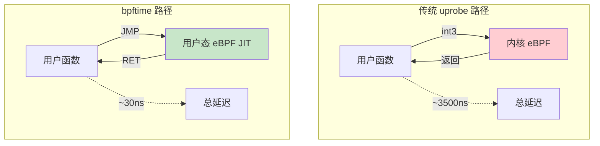
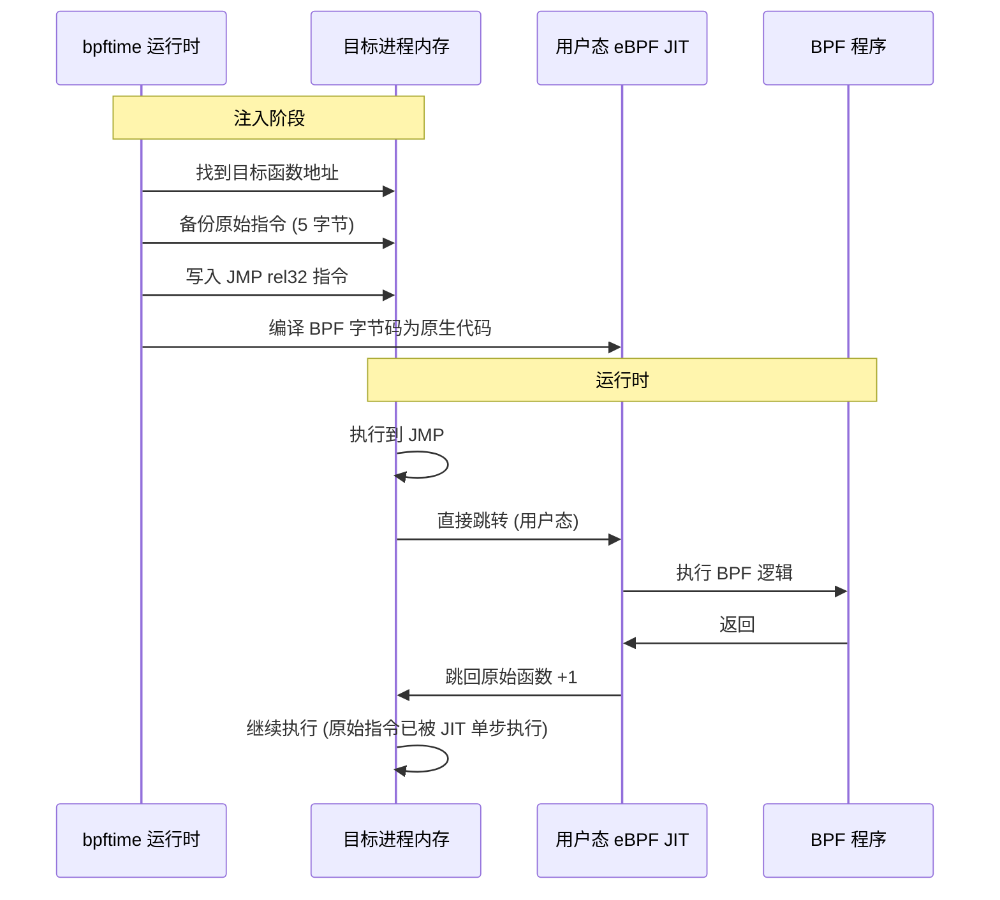
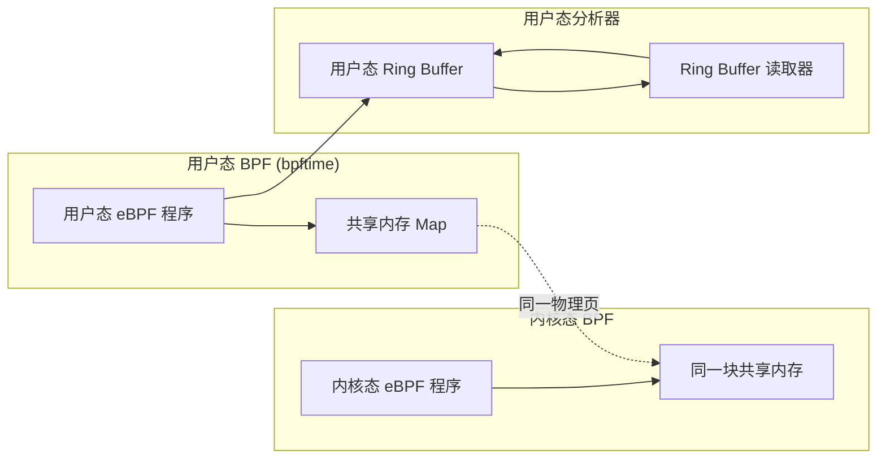
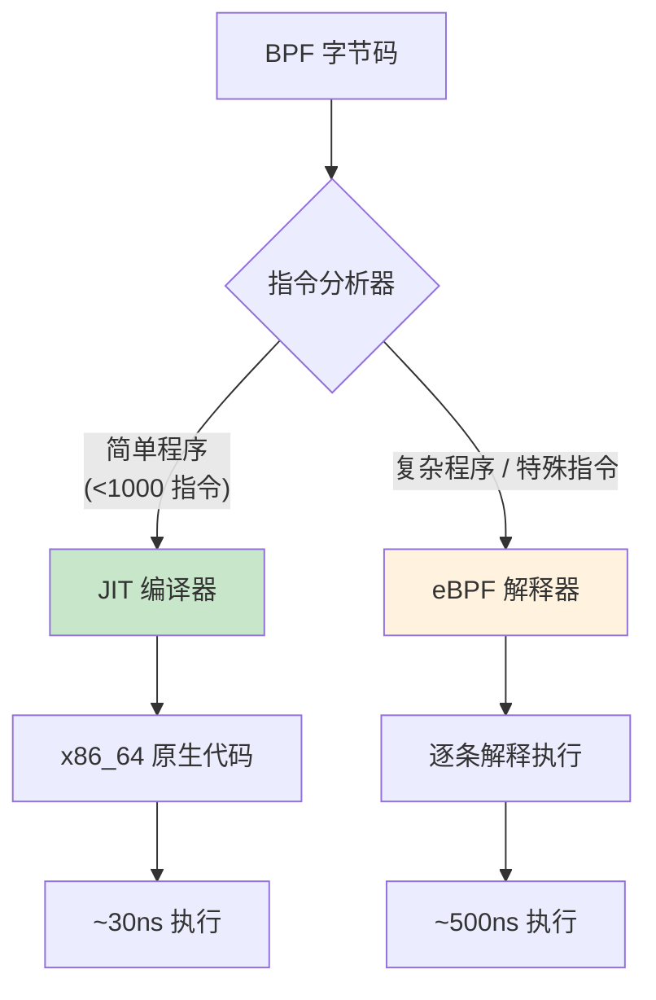
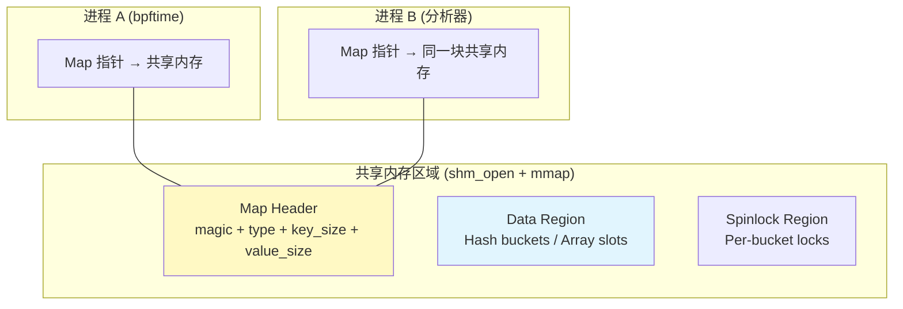

> [!info] eBPF 2026 深度探索系列 0. [[2026-04-08-ebpf-comprehensive-learning-roadmap|全栈学习路径总览]]
>
> 1. [[2026-04-08-ebpf-deep-dive-ch1-registers-and-instructions|第一章：寄存器与指令集]]
> 2. [[2026-04-08-ebpf-deep-dive-ch1-5-function-calls|第一.五章：四种函数调用与动态内存]]
> 3. [[2026-04-08-ebpf-deep-dive-ch1-6-the-verifier|第一.六章：验证器 (Verifier) 的底层逻辑]]
> 4. [[2026-04-08-ebpf-deep-dive-ch2-maps-and-communication|第二章：Map 机制与跨空间通信]]
> 5. [[2026-04-08-ebpf-deep-dive-ch2-5-kptr-and-ownership|第二.五章：kptr (内核指针) 与内存所有权模型]]
> 6. [[2026-04-08-ebpf-deep-dive-ch3-core-and-bTF|第三章：CO-RE 与 BTF 的跨版本魔法]]
> 7. [[2026-04-08-ebpf-deep-dive-ch4-tracing-hooks-and-security|第四章：从 kprobe 到 LSM 的追踪全图景]]
> 8. [[2026-04-08-ebpf-deep-dive-ch7-5-uprobes-dynamic-tracing|第七.五章：uprobe 用户态动态追踪原理]]
> 9. **第七.六章：bpftime 与用户态 eBPF 加速**
> 10. [[2026-04-08-ebpf-deep-dive-ch18-bpftime-injection-mastery|第七.七章：bpftime 自动化注入与全量监控实战]]
> 11. [[2026-04-08-ebpf-deep-dive-ch7-8-uprobe-selection-guide|第七.八章：uprobe 选型指南：内核态 vs 用户态]]
> 12. [[2026-04-08-ebpf-deep-dive-ch5-xdp-networking-performance|第五章：XDP 极致网络性能与全栈架构]]
> 13. [[2026-04-08-ebpf-deep-dive-ch6-tc-traffic-control|第六章：TC (Traffic Control) 流量调度艺术]]
> 14. [[2026-04-08-ebpf-deep-dive-ch7-security-lsm-enforcement|第七章：LSM BPF 从可观测到安全执法]]
> 15. [[2026-04-08-ebpf-deep-dive-ch8-advanced-tuning-and-profiling|第八章：进阶实战与内核调优]]
> 16. [[2026-04-08-ebpf-deep-dive-ch9-af-xdp-zero-copy|第九章：AF_XDP 零拷贝与用户态协议栈]]
> 17. [[2026-04-08-ebpf-deep-dive-ch10-sched-ext-custom-scheduler|第十章：sched_ext 自定义 CPU 调度器]]
> 18. [[2026-04-08-ebpf-deep-dive-ch11-bpf-iterators|第十一章：BPF Iterators 内核对象迭代器]]
> 19. [[2026-04-08-ebpf-deep-dive-ch12-kfuncs-evolution|第十二章：kfuncs 下一代内核交互标准]]
> 20. [[2026-04-08-ebpf-deep-dive-ch13-usdt-tracing|第十三章：USDT 用户态静态定义追踪]]
> 21. [[2026-04-08-ebpf-deep-dive-ch14-ai-llm-inference-monitoring|第十四章：AI 推理与大模型监控前沿]]
> 22. [[2026-04-08-ebpf-deep-dive-ch15-container-isolation|第十五章：无感增强容器隔离性]]
> 23. [[2026-04-08-ebpf-deep-dive-ch16-ebpf-and-wasm|第十六章：eBPF 与 WebAssembly (WASM) 的共生架构]]
> 24. [[2026-04-08-ebpf-deep-dive-ch17-storage-and-filesystem|第十七章：存储与文件系统加速]]
> 25. [[2026-04-08-ebpf-deep-dive-ch18-lifecycle-and-links|第十八章：生命周期管理与 BPF Links]]
> 26. [[2026-04-08-ebpf-deep-dive-ch19-atomic-updates-and-hot-upgrade|第十九章：程序的原子更新与蓝绿部署]]
> 27. [[2026-04-08-ebpf-deep-dive-ch25-5-stack-trace-correlation|第二五.五章：调用栈与业务请求的深度绑定]]
> 28. [[2026-04-08-ebpf-deep-dive-ch20-edge-iot-acceleration|第二十章：边缘计算与工业协议加速]]
> 29. [[2026-04-08-ebpf-deep-dive-ch21-debugging-and-verifier|第二十一章：调试实战与验证器 (Verifier) 诊断]]
> 30. [[2026-04-08-ebpf-deep-dive-ch22-testing-and-ci-cd|第二十二章：测试与持续集成 (CI/CD) 实战]]
> 31. [[2026-04-08-ebpf-deep-dive-ch23-security-and-permissions|第二十三章：权限细分与 BPF 安全沙箱]]
> 32. [[2026-04-08-ebpf-deep-dive-ch24-meta-monitoring-and-self-healing|第二十四章：eBPF 程序的内核自愈与监控]]
> 33. [[2026-04-08-ebpf-deep-dive-ch25-full-stack-observability|第二十五章：全栈可观测性与端到端追踪]]
> 34. [[2026-04-08-ebpf-deep-dive-ch26-network-security-high-level|第二十六章：网络安全防御的高阶实战]]
> 35. [[2026-04-08-ebpf-deep-dive-ch27-agent-engineering-architecture|第二十七章：工业级模块化 Agent 架构演进]]
> 36. [[2026-04-08-ebpf-deep-dive-ch28-offensive-and-defensive|第二十八章：攻防博弈与 Rootkit 防御]]
> 37. [[2026-04-08-ebpf-deep-dive-ch29-networking-deep-dive|第二十九章：网络应用深水区——负载均衡、Sockmap 与拥塞控制]]
> 38. [[2026-04-08-ebpf-deep-dive-ch30-hardware-offload|第三十章：硬件卸载与 SmartNIC 实战]]
> 39. [[2026-04-08-ebpf-deep-dive-ch31-signed-objects-and-security|第三十一章：内核原生签名与供应链安全]]
> 40. [[2026-04-08-ebpf-deep-dive-ch32-ebpf-for-windows|第三十二章：跨平台崛起——eBPF for Windows]]
> 41. [[2026-04-08-ebpf-deep-dive-ch32-5-macos-status|第三十二.五章：macOS 的特殊路径]]
> 42. [[2026-04-08-ebpf-deep-dive-ch33-serverless-optimization|第三十三章：Serverless 冷启动消除与动态计费]]
> 43. [[2026-04-08-ebpf-deep-dive-ch34-waf-and-rasp|第三十四章：Web 安全革命——内核态 WAF 与 RASP]]
> 44. [[2026-04-08-ebpf-deep-dive-ch35-npu-tpu-ai-hardware|第三十五章：AI 推理硬件 (NPU/TPU) 与硬件定义内核]]
> 45. [[2026-04-08-ebpf-deep-dive-ch36-dynamic-language-introspection|第三十六章：动态语言感知——业务对象的零代码提取]]
> 46. [[2026-04-08-ebpf-deep-dive-ch37-green-computing|第三十七章：绿色计算与能耗精准归因]]
> 47. [[2026-04-08-ebpf-deep-dive-ch38-ecosystem-and-career|第三十八章：2026 生态全景与工程师职业导航]]
> 48. [[2026-04-09-ebpf-deep-dive-ch39-rust-aya-framework|第三十九章：Rust eBPF 开发实战——Aya 框架与安全编程]]
> 49. [[2026-04-09-ebpf-deep-dive-ch40-network-protocols-deep-dive|第四十章：网络协议深度解析——TCP/UDP/QUIC 的 eBPF 视角]]
> 50. [[2026-04-09-ebpf-deep-dive-ch41-memory-safety-and-vulnerabilities|第四十一章：eBPF 内存安全与漏洞分析]]
> 51. [[2026-04-09-ebpf-deep-dive-ch42-service-mesh-integration|第四十二章：eBPF 与 Service Mesh 深度集成]]

---

# 第七章.6：bpftime 与用户态 eBPF 加速

## 1. 为什么需要用户态 eBPF

在第七.五章中我们分析了 uprobe 的核心瓶颈：每次触发都需要通过 `int3` 断点进行**用户态→内核态→用户态**的两次上下文切换，开销约 1000-5000ns。对于 `malloc`、`SSL_write` 这类每秒调用数十万次的高频函数，内核 uprobe 会导致明显的性能退化。

bpftime 的核心思路是：**将 eBPF 的执行引擎嵌入到应用进程的地址空间中，彻底消除上下文切换开销。**



---

## 2. bpftime 架构深度解析

### 2.1 三层架构

```mermaid
graph TB
    subgraph "Layer 1: 注入层"
        LD[LD_PRELOAD 注入]
        PT[PTRACE 动态注入]
        CRI[CRI 集成注入]
    end

    subgraph "Layer 2: 运行时层 (进程内存内)"
        JIT[用户态 JIT 编译器]
        VM[eBPF 解释器 (fallback)]
        PATCH[指令热补丁引擎]
        DISP[分发器: JMP → BPF]
    end

    subgraph "Layer 3: 数据层"
        SMAP[共享内存 Maps]
        SHM[POSIX shm / mmap]
        RBUF[用户态 Ring Buffer]
    end

    LD --> JIT
    PT --> JIT
    CRI --> JIT

    JIT --> DISP
    PATCH --> DISP
    DISP --> JIT

    JIT --> SMAP
    JIT --> RBUF
    SMAP --> SHM

    style JIT fill:#c8e6c9
    style SMAP fill:#fff9c4
```

### 2.2 指令热补丁 (Hot-patching) 原理

bpftime 不使用内核的 `int3` 断点机制，而是直接修改用户态内存中的机器指令：



**JMP 指令编码（x86_64）：**

```asm
; 原始函数入口（假设在 0x7f1234560000）
; 原始指令: mov edi, esi   (89 F7, 2 字节) + 后续 3 字节

; bpftime 替换为:
; 0x7f1234560000: E9 xx xx xx xx    ; JMP rel32 → JIT 代码段
; 其中 xx xx xx xx = (JIT_addr - 0x7f1234560000 - 5)
```

### 2.3 原始指令的执行

被 JMP 覆盖的原始指令（通常 1-5 字节）需要在 BPF 程序执行后补执行。bpftime 的处理方式：

1. **短指令（≤5 字节）**：将原始指令嵌入 JIT 代码的末尾，BPF 执行完后自动执行
2. **长指令（>5 字节）**：将原始指令拷贝到"trampoline 页"，JMP 先跳到 trampoline 执行原始指令，再跳回

---

## 3. 用户态 Maps 与跨空间通信

### 3.1 共享内存 Map 实现

bpftime 使用共享内存重新实现了 eBPF Maps，使得用户态和内核态 BPF 程序可以通过同一块物理内存交换数据：



### 3.2 Map 类型支持

| Map 类型                    | bpftime 支持 | 实现方式            |
| :-------------------------- | :----------- | :------------------ |
| `BPF_MAP_TYPE_HASH`         | 支持         | 共享内存 + spinlock |
| `BPF_MAP_TYPE_ARRAY`        | 支持         | 共享内存直接索引    |
| `BPF_MAP_TYPE_PERCPU_ARRAY` | 支持         | 每个线程独立区域    |
| `BPF_MAP_TYPE_RINGBUF`      | 支持         | 用户态 Ring Buffer  |
| `BPF_MAP_TYPE_LPM_TRIE`     | 支持         | 共享内存 LPM 树     |
| `BPF_MAP_TYPE_STACK`        | 支持         | 无锁栈              |
| `BPF_MAP_TYPE_QUEUE`        | 支持         | 无锁队列            |

---

## 4. 代码实战：使用 bpftime 追踪 SSL 流量

### 4.1 BPF 程序（与内核 uprobe 完全兼容）

```c
// 这段 BPF 程序同时兼容内核 uprobe 和 bpftime
#include "vmlinux.h"
#include <bpf/bpf_helpers.h>
#include <bpf/bpf_tracing.h>

char _license[] SEC("license") = "GPL";

struct ssl_event {
    u32 pid;
    u32 len;
    u64 timestamp;
    char comm[16];
    char data[256];
};

struct {
    __uint(type, BPF_MAP_TYPE_RINGBUF);
    __uint(max_entries, 256 * 1024);
} events SEC(".maps");

// bpftime 使用 "uprobe/" 前缀，与 libbpf 兼容
SEC("uprobe//usr/lib/x86_64-linux-gnu/libssl.so.3:SSL_write")
int BPF_UPROBE(trace_ssl_write, void *ssl, const void *buf, int num) {
    struct ssl_event *e = bpf_ringbuf_reserve(&events, sizeof(*e), 0);
    if (!e) return 0;

    e->pid = bpf_get_current_pid_tgid() >> 32;
    e->len = num;
    e->timestamp = bpf_ktime_get_ns();
    bpf_get_current_comm(&e->comm, sizeof(e->comm));
    bpf_probe_read_user_str(e->data, sizeof(e->data), buf);

    bpf_ringbuf_submit(e, 0);
    return 0;
}
```

### 4.2 使用 bpftime 加载

```bash
# 方法 1: LD_PRELOAD 方式启动应用
LD_PRELOAD=/usr/lib/bpftime/libbpftime-agent.so \
    bpftime attach -e trace_ssl.o \
    -- /usr/bin/curl https://example.com

# 方法 2: 动态注入到运行中的进程
bpftime attach -e trace_ssl.o -p $(pgrep nginx)

# 方法 3: 使用 bpftime CLI 工具
bpftime-cli start --module trace_ssl.so \
    --binary /usr/lib/x86_64-linux-gnu/libssl.so.3 \
    --symbol SSL_write
```

### 4.3 用户态读取 Ring Buffer

```c
// bpftime 的 Ring Buffer 与内核的 API 兼容
#include <bpf/libbpf.h>

int main() {
    struct ring_buffer *rb;
    struct bpf_object *obj;
    int err;

    // 加载 BPF 对象
    err = bpf_object__open_file("trace_ssl.o", NULL);
    // ... bpftime 运行时自动处理 uprobe 附加 ...

    // 创建 Ring Buffer 消费者
    rb = ring_buffer__new(bpf_map__fd(events_map),
                          handle_event, NULL, NULL);

    while (1) {
        ring_buffer__poll(rb, 1000);  // 每秒轮询
    }
    return 0;
}
```

---

## 5. 性能基准测试

### 5.1 微基准对比

| 场景          | 内核 uprobe | bpftime | 提升倍数 |
| :------------ | :---------- | :------ | :------- |
| 空函数追踪    | ~3500ns     | ~32ns   | **109x** |
| SSL 流量捕获  | ~5200ns     | ~150ns  | **34x**  |
| Map 更新操作  | ~800ns      | ~120ns  | **6.7x** |
| malloc 追踪   | ~2800ns     | ~45ns   | **62x**  |
| JSON 解析追踪 | ~3100ns     | ~60ns   | **52x**  |

### 5.2 应用级吞吐量影响

| 应用场景         | 无探针     | 内核 uprobe       | bpftime           |
| :--------------- | :--------- | :---------------- | :---------------- |
| Nginx (静态文件) | 100K req/s | 85K req/s (-15%)  | 99K req/s (-1%)   |
| Redis (GET/SET)  | 500K ops/s | 320K ops/s (-36%) | 490K ops/s (-2%)  |
| PostgreSQL (TPS) | 12000 TPS  | 9500 TPS (-21%)   | 11800 TPS (-1.7%) |

---

## 6. 注入机制详解

### 6.1 LD_PRELOAD（启动时注入）

```bash
# bpftime-agent.so 会在进程启动时自动：
# 1. 解析环境变量 BPFTIME_ATTACH_CONFIG
# 2. 加载指定的 BPF 程序
# 3. 对目标函数执行热补丁
export BPFTIME_ATTACH_CONFIG='[{"binary":"/usr/lib/libssl.so.3","symbol":"SSL_write","bpf":"trace_ssl.o"}]'
LD_PRELOAD=/usr/lib/bpftime/libbpftime-agent.so /usr/bin/myapp
```

### 6.2 PTRACE（运行时注入）

```bash
# 1. 暂停目标进程
kill -STOP $(pgrep myapp)

# 2. 注入 bpftime 共享库
bpftime inject -p $(pgrep myapp) -l /usr/lib/bpftime/libbpftime-agent.so

# 3. 附加 BPF 程序
bpftime attach -p $(pgrep myapp) -e trace_ssl.o

# 4. 恢复进程
kill -CONT $(pgrep myapp)
```

### 6.3 CRI 集成（容器环境）

```yaml
# containerd 配置：自动注入 bpftime
[plugins."io.containerd.grpc.v1.cri"]
  [plugins."io.containerd.grpc.v1.cri".containerd]
    [plugins."io.containerd.grpc.v1.cri".containerd.default_runtime]
      # 在容器创建时注入 bpftime
      preload_hooks = ["/usr/local/bin/bpftime-cri-hook"]
```

### 6.4 静态链接模式

```c
// 在编译时将 bpftime 运行时嵌入应用
#include <bpftime/bpftime.hpp>

int main() {
    // 初始化 bpftime 运行时
    bpftime::init();

    // 附加 BPF 程序
    bpftime::attach("trace_ssl.o");

    // 应用主逻辑...
    run_application();
}
```

---

## 7. 挑战与局限

### 7.1 权限与环境限制

| 限制                | 原因                                 | 解决方案                      |
| :------------------ | :----------------------------------- | :---------------------------- |
| **PTRACE scope**    | `/proc/sys/kernel/yama/ptrace_scope` | 降级为 LD_PRELOAD 或 CRI 注入 |
| **W^X 策略**        | SELinux/AppArmor 阻止可写+可执行内存 | 使用 `execmem` SELinux 布尔值 |
| **静态链接**        | LD_PRELOAD 无法注入                  | 使用 PTRACE 或静态链接模式    |
| **符号剥离**        | Stripped 二进制无法通过函数名定位    | 使用 ELF 解析工具手动计算偏移 |
| **容器 Capability** | 缺少 `SYS_PTRACE`                    | 使用 CRI 集成或特权 Pod       |

### 7.2 安全性考虑

bpftime 本质上是在目标进程中注入代码执行，这与传统恶意软件的注入技术（如 DLL 注入）在原理上相同。因此：

1. **仅限授权使用**：确保 bpftime 仅由运维/安全团队使用
2. **审计追踪**：记录所有 bpftime 注入操作
3. **最小权限**：BPF 程序只应读取必要的数据
4. **生产隔离**：将监控数据收集与分析分离，避免探针进程被攻破后影响分析系统

---

## 8. JIT 编译器深入

### 8.1 两级执行模式

bpftime 提供两种 BPF 字节码执行方式，根据 BPF 程序的复杂度自动选择：



### 8.2 JIT 编译流程

```
BPF 字节码 (ELF .text)
    │
    ▼
指令验证器 (安全检查)
    │
    ▼
寄存器分配 (BPF r0-r10 → x86_64 寄存器)
    │
    ▼
指令选择 (BPF_OP → x86_64 指令)
    │
    ▼
代码生成 (mmap PROT_EXEC 页)
    │
    ▼
原生代码 (可执行)
```

### 8.3 寄存器映射

| BPF 寄存器 | x86_64 寄存器            | 用途             |
| :--------- | :----------------------- | :--------------- |
| `r0`       | `rax`                    | 返回值           |
| `r1-r5`    | `rdi, rsi, rdx, rcx, r8` | 函数参数         |
| `r6-r9`    | `rbx, r13, r14, r15`     | 被调用者保存     |
| `r10`      | `rbp`                    | 栈帧指针（只读） |

### 8.4 JIT vs 解释器性能差异

| 指令类型          | JIT 延迟 | 解释器延迟 |
| :---------------- | :------- | :--------- |
| ALU (add/sub/mul) | ~1ns     | ~5ns       |
| 内存加载 (ldxw)   | ~2ns     | ~10ns      |
| 条件分支          | ~1ns     | ~8ns       |
| 函数调用 (helper) | ~50ns    | ~80ns      |
| Map 查找          | ~120ns   | ~150ns     |

---

## 9. 共享内存 Map 内部实现

### 9.1 内存布局



### 9.2 Hash Map 的并发安全

```c
// bpftime 共享内存 Hash Map 的查找流程
// 使用 per-bucket spinlock 保证并发安全

struct shm_hash_map {
    struct map_header header;
    u32 n_buckets;
    u32 value_size;
    // 每个 bucket 的 spinlock (对齐到 64 字节避免 false sharing)
    struct bucket {
        spinlock_t lock;
        struct hash_entry *entries;
    } buckets[];
};

void *shm_map_lookup(struct shm_hash_map *map, const void *key) {
    u32 hash = jhash(key, map->header.key_size, 0);
    u32 idx = hash % map->n_buckets;

    // 获取 bucket 锁
    spin_lock(&map->buckets[idx].lock);

    // 遍历链表
    struct hash_entry *entry = map->buckets[idx].entries;
    while (entry) {
        if (memcmp(entry->key, key, map->header.key_size) == 0) {
            spin_unlock(&map->buckets[idx].lock);
            return entry->value;
        }
        entry = entry->next;
    }

    spin_unlock(&map->buckets[idx].lock);
    return NULL;  // 未找到
}
```

### 9.3 Per-CPU Map 的线程本地优化

bpftime 的 Per-CPU Map 使用线程局部存储（TLS）而非真正的 per-CPU 分配：

```c
// 线程 ID → CPU 映射
static inline int get_cpu_id(void) {
    // 使用 syscall(__NR_getcpu) 或 sched_getcpu()
    // 对于性能关键路径，使用 rdtscp 指令读取 TSC_AUX
    unsigned int cpu;
    __asm__ volatile("rdtscp" : "=c" (cpu) :: "rax", "rdx");
    return cpu;
}

// Per-CPU 区域偏移计算
static inline void *per_cpu_ptr(void *base, int cpu, size_t size) {
    return (char *)base + cpu * size;
}
```

---

## 10. 错误处理与诊断

### 10.1 常见错误及解决

| 错误信息                      | 原因                  | 解决方案                                           |
| :---------------------------- | :-------------------- | :------------------------------------------------- |
| `Permission denied (PTRACE)`  | ptrace_scope ≠ 0      | `sudo sysctl kernel.yama.ptrace_scope=0`           |
| `Cannot allocate RWX memory`  | SELinux/AppArmor 阻止 | `sudo setsebool -P domain_can_mmap_shared_pages 1` |
| `Symbol not found: SSL_write` | 符号被 strip          | 使用 `objdump -T` 查找动态符号                     |
| `ELF parse error`             | 静态链接二进制        | 使用 PTRACE 注入模式                               |
| `JIT compilation failed`      | BPF 指令序列过于复杂  | 使用 `--interp` 解释器模式                         |
| `SHM already exists`          | 上次异常退出未清理    | `rm /dev/shm/bpftime.*`                            |

### 10.2 调试命令

```bash
# 查看当前注入状态
bpftime list -p $(pgrep myapp)

# 查看 Map 内容
bpftime map dump -p $(pgrep myapp) -n events

# 查看运行时统计
bpftime stats -p $(pgrep myapp)

# 开启详细日志
export BPFTIME_LOG_LEVEL=debug
bpftime attach -e trace.o -p $(pgrep myapp)

# 检查共享内存使用情况
ls -la /dev/shm/bpftime.*
```

### 10.3 健康检查脚本

```bash
#!/bin/bash
# bpftime-healthcheck.sh
PID=$(pgrep -f "$1")
if [ -z "$PID" ]; then
    echo "ERROR: Process $1 not found"
    exit 1
fi

# 检查注入状态
INJECT_COUNT=$(bpftime list -p $PID 2>/dev/null | wc -l)
if [ "$INJECT_COUNT" -eq 0 ]; then
    echo "WARNING: No bpftime probes attached"
    exit 1
fi

# 检查共享内存
SHM_SIZE=$(du -sh /dev/shm/bpftime.* 2>/dev/null | tail -1 | awk '{print $1}')
echo "OK: $INJECT_COUNT probes active, SHM usage: $SHM_SIZE"
```

---

## 11. 常见问题 FAQ

**Q1：bpftime 和内核 uprobe 的 BPF 程序可以互换吗？**

A：基本可以。bpftime 的目标是与 libbpf API 兼容。使用标准 `SEC("uprobe/...")` 注解的 BPF 程序通常可以在两种模式下运行，无需修改。但要注意：bpftime 不支持所有内核 helper 函数（如 `bpf_get_current_task()`），仅支持用户态可实现的 helper。

**Q2：bpftime 在生产环境稳定吗？**

A：截至 2026 年，bpftime 已经在多家互联网公司的大规模部署中验证。但作为用户态注入技术，稳定性取决于目标程序的复杂度。建议：1) 在灰度环境充分测试；2) 实现自动退化机制（注入失败时回退到内核 uprobe）；3) 监控 bpftime 运行时自身的资源消耗。

**Q3：bpftime 支持哪些 CPU 架构？**

A：x86_64 架构支持最完善。ARM64 支持正在进行中（热补丁的指令编码不同）。由于 bpftime 的 JIT 引擎需要为不同架构生成不同的机器码，RISC-V 等架构的支持还在早期阶段。

**Q4：如何处理 bpftime 和内核 uprobe 同时追踪同一函数的情况？**

A：不建议同时使用。如果内核 uprobe 已经在目标地址安装了 `int3`，bpftime 的 JMP 热补丁会与 int3 冲突。应该选择其中一种方案，或者在不同函数上分别使用。

**Q5：bpftime 的 JIT 编译是在什么时候发生的？**

A：bpftime 在附加 BPF 程序时进行 JIT 编译（AOT 模式），而不是每次触发时解释执行。这意味着：1) 附加时有短暂的编译延迟（通常 <100ms）；2) 运行时的每次触发只执行原生机器码，没有解释器开销。对于无法 JIT 的复杂 BPF 指令序列，bpftime 会回退到解释器模式。

**Q6：bpftime 的共享内存 Map 会被意外清理吗？**

A：bpftime 使用 POSIX 共享内存（`/dev/shm/`），生命周期独立于进程。如果 bpftime agent 异常退出，共享内存不会自动释放。建议在 agent 启动时检查并清理残留的共享内存（`rm /dev/shm/bpftime.*`），或在代码中注册 `atexit` 清理函数。

**Q7：能否用 bpftime 追踪多线程程序？**

A：可以。bpftime 的指令热补丁对所有线程可见（修改的是进程地址空间中的代码页）。但需要注意：1) 热补丁期间需要短暂暂停所有线程（`SIGSTOP`），避免部分线程执行到半补丁状态；2) Per-CPU Map 使用线程 ID 而非 CPU ID 来区分，确保数据隔离。
