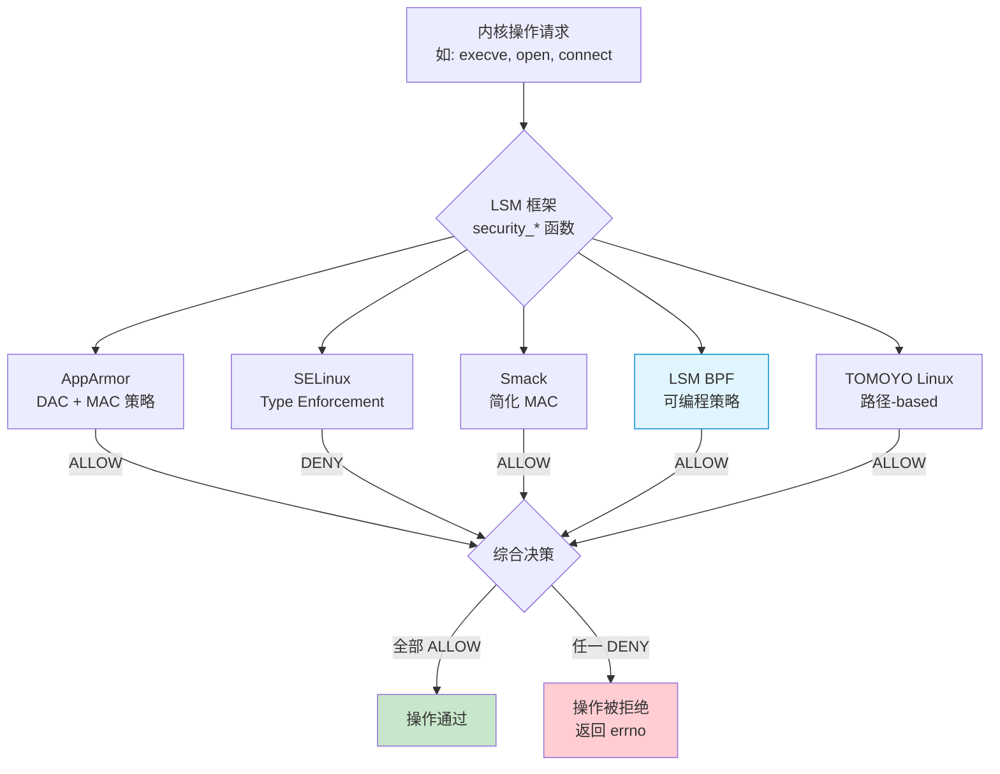
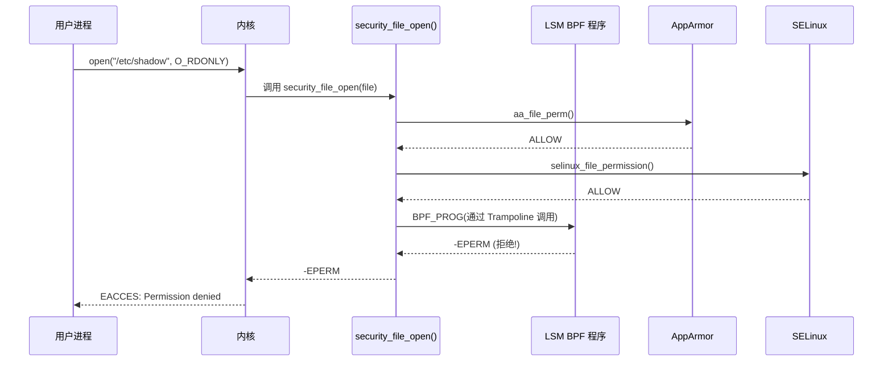
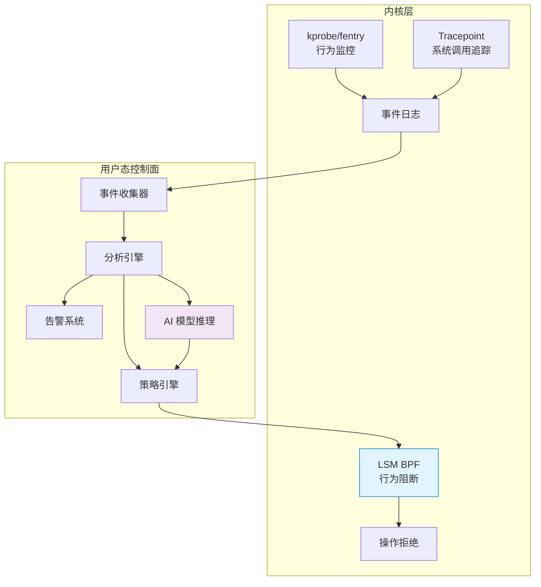

> [!info] eBPF 2026 深度探索系列 0. [[2026-04-08-ebpf-comprehensive-learning-roadmap|全栈学习路径总览]]
>
> 1. [[2026-04-08-ebpf-deep-dive-ch1-registers-and-instructions|第一章：寄存器与指令集]]
> 2. [[2026-04-08-ebpf-deep-dive-ch1-5-function-calls|第一.五章：四种函数调用与动态内存]]
> 3. [[2026-04-08-ebpf-deep-dive-ch1-6-the-verifier|第一.六章：验证器 (Verifier) 的底层逻辑]]
> 4. [[2026-04-08-ebpf-deep-dive-ch2-maps-and-communication|第二章：Map 机制与跨空间通信]]
> 5. [[2026-04-08-ebpf-deep-dive-ch2-5-kptr-and-ownership|第二.五章：kptr (内核指针) 与内存所有权模型]]
> 6. [[2026-04-08-ebpf-deep-dive-ch3-core-and-btf|第三章：CO-RE 与 BTF 的跨版本魔法]]
> 7. [[2026-04-08-ebpf-deep-dive-ch4-tracing-hooks-and-security|第四章：从 kprobe 到 LSM 的追踪全图景]]
> 8. [[2026-04-08-ebpf-deep-dive-ch7-5-uprobes-dynamic-tracing|第七.五章：uprobe 用户态动态追踪原理]]
> 9. [[2026-04-08-ebpf-deep-dive-ch7-6-bpftime-user-runtime|第七.六章：bpftime 与用户态 eBPF 加速]]
> 10. [[2026-04-08-ebpf-deep-dive-ch18-bpftime-injection-mastery|第七.七章：bpftime 自动化注入与全量监控实战]]
> 11. [[2026-04-08-ebpf-deep-dive-ch7-8-uprobe-selection-guide|第七.八章：uprobe 选型指南：内核态 vs 用户态]]
> 12. [[2026-04-08-ebpf-deep-dive-ch5-xdp-networking-performance|第五章：XDP 极致网络性能与全栈架构]]
> 13. [[2026-04-08-ebpf-deep-dive-ch6-tc-traffic-control|第六章：TC (Traffic Control) 流量调度艺术]]
> 14. **第七章：LSM BPF 从可观测到安全执法**
> 15. [[2026-04-08-ebpf-deep-dive-ch8-advanced-tuning-and-profiling|第八章：进阶实战与内核调优]]
> 16. [[2026-04-08-ebpf-deep-dive-ch9-af-xdp-zero-copy|第九章：AF_XDP 零拷贝与用户态协议栈]]
> 17. [[2026-04-08-ebpf-deep-dive-ch10-sched-ext-custom-scheduler|第十章：sched_ext 自定义 CPU 调度器]]
> 18. [[2026-04-08-ebpf-deep-dive-ch11-bpf-iterators|第十一章：BPF Iterators 内核对象迭代器]]
> 19. [[2026-04-08-ebpf-deep-dive-ch12-kfuncs-evolution|第十二章：kfuncs 下一代内核交互标准]]
> 20. [[2026-04-08-ebpf-deep-dive-ch13-usdt-tracing|第十三章：USDT 用户态静态定义追踪]]
> 21. [[2026-04-08-ebpf-deep-dive-ch14-ai-llm-inference-monitoring|第十四章：AI 推理与大模型监控前沿]]
> 22. [[2026-04-08-ebpf-deep-dive-ch15-container-isolation|第十五章：无感增强容器隔离性]]
> 23. [[2026-04-08-ebpf-deep-dive-ch16-ebpf-and-wasm|第十六章：eBPF 与 WebAssembly (WASM) 的共生架构]]
> 24. [[2026-04-08-ebpf-deep-dive-ch17-storage-and-filesystem|第十七章：存储与文件系统加速]]
> 25. [[2026-04-08-ebpf-deep-dive-ch18-lifecycle-and-links|第十八章：生命周期管理与 BPF Links]]
> 26. [[2026-04-08-ebpf-deep-dive-ch19-atomic-updates-and-hot-upgrade|第十九章：程序的原子更新与蓝绿部署]]
> 27. [[2026-04-08-ebpf-deep-dive-ch25-5-stack-trace-correlation|第二五.五章：调用栈与业务请求的深度绑定]]
> 28. [[2026-04-08-ebpf-deep-dive-ch20-edge-iot-acceleration|第二十章：边缘计算与工业协议加速]]
> 29. [[2026-04-08-ebpf-deep-dive-ch21-debugging-and-verifier|第二十一章：调试实战与验证器 (Verifier) 诊断]]
> 30. [[2026-04-08-ebpf-deep-dive-ch22-testing-and-ci-cd|第二十二章：测试与持续集成 (CI/CD) 实战]]
> 31. [[2026-04-08-ebpf-deep-dive-ch23-security-and-permissions|第二十三章：权限细分与 BPF 安全沙箱]]
> 32. [[2026-04-08-ebpf-deep-dive-ch24-meta-monitoring-and-self-healing|第二十四章：eBPF 程序的内核自愈与监控]]
> 33. [[2026-04-08-ebpf-deep-dive-ch25-full-stack-observability|第二十五章：全栈可观测性与端到端追踪]]
> 34. [[2026-04-08-ebpf-deep-dive-ch26-network-security-high-level|第二十六章：网络安全防御的高阶实战]]
> 35. [[2026-04-08-ebpf-deep-dive-ch27-agent-engineering-architecture|第二十七章：工业级模块化 Agent 架构演进]]
> 36. [[2026-04-08-ebpf-deep-dive-ch28-offensive-and-defensive|第二十八章：攻防博弈与 Rootkit 防御]]
> 37. [[2026-04-08-ebpf-deep-dive-ch29-networking-deep-dive|第二十九章：网络应用深水区——负载均衡、Sockmap 与拥塞控制]]
> 38. [[2026-04-08-ebpf-deep-dive-ch30-hardware-offload|第三十章：硬件卸载与 SmartNIC 实战]]
> 39. [[2026-04-08-ebpf-deep-dive-ch31-signed-objects-and-security|第三十一章：内核原生签名与供应链安全]]
> 40. [[2026-04-08-ebpf-deep-dive-ch32-ebpf-for-windows|第三十二章：跨平台崛起——eBPF for Windows]]
> 41. [[2026-04-08-ebpf-deep-dive-ch32-5-macos-status|第三十二.五章：macOS 的特殊路径]]
> 42. [[2026-04-08-ebpf-deep-dive-ch33-serverless-optimization|第三十三章：Serverless 冷启动消除与动态计费]]
> 43. [[2026-04-08-ebpf-deep-dive-ch34-waf-and-rasp|第三十四章：Web 安全革命——内核态 WAF 与 RASP]]
> 44. [[2026-04-08-ebpf-deep-dive-ch35-npu-tpu-ai-hardware|第三十五章：AI 推理硬件 (NPU/TPU) 与硬件定义内核]]
> 45. [[2026-04-08-ebpf-deep-dive-ch36-dynamic-language-introspection|第三十六章：动态语言感知——业务对象的零代码提取]]
> 46. [[2026-04-08-ebpf-deep-dive-ch37-green-computing|第三十七章：绿色计算与能耗精准归因]]
> 47. [[2026-04-08-ebpf-deep-dive-ch38-ecosystem-and-career|第三十八章：2026 生态全景与工程师职业导航]]
> 48. [[2026-04-09-ebpf-deep-dive-ch39-rust-aya-framework|第三十九章：Rust eBPF 开发实战——Aya 框架与安全编程]]
> 49. [[2026-04-09-ebpf-deep-dive-ch40-network-protocols-deep-dive|第四十章：网络协议深度解析——TCP/UDP/QUIC 的 eBPF 视角]]
> 50. [[2026-04-09-ebpf-deep-dive-ch41-memory-safety-and-vulnerabilities|第四十一章：eBPF 内存安全与漏洞分析]]
> 51. [[2026-04-09-ebpf-deep-dive-ch42-service-mesh-integration|第四十二章：eBPF 与 Service Mesh 深度集成]]

---

# 第七章：LSM BPF 从可观测到安全执法

## 1. 从观察者到执法者

在 eBPF 的世界里，存在一个根本性的分水岭：

- **Tracing 程序**（kprobe、fentry、tracepoint）是**观察者** — 它们只能记录日志，返回值被内核忽略
- **LSM BPF 程序**是**执法者** — 它们可以返回 `-EPERM` 来**拒绝内核操作**

这个区别看似微小，实则是从"监控"到"安全"的质变。一个只记录日志的 DDoS 检测器和一个能在包到达应用前就丢弃它的防火墙，是完全不同的安全层次。

### 1.1 LSM BPF vs Seccomp：深度对比

| 维度         | Seccomp-BPF                | LSM BPF                            |
| :----------- | :------------------------- | :--------------------------------- |
| **拦截时机** | 系统调用入口               | 内核函数内部                       |
| **上下文**   | 系统调用参数（原始寄存器） | 解析后的内核结构体                 |
| **文件路径** | 只能看到 fd/指针           | 可以看到完整路径（`file->f_path`） |
| **网络信息** | 只有 socket fd             | 可以看到 `struct socket`、目标地址 |
| **性能**     | 系统调用开销               | Trampoline 近零开销                |
| **灵活性**   | 过滤系统调用号             | 过滤任意内核安全决策点             |
| **动态更新** | 需要重启进程               | 运行时热加载                       |
| **适用场景** | 沙箱隔离                   | 运行时安全、容器安全               |

---

## 2. LSM 架构深度解析

### 2.1 LSM 钩子链模型

Linux 内核的 LSM 框架采用"堆叠"模型 — 多个 LSM 模块可以同时运行，它们的决策通过布尔 AND 组合：



**关键规则：** LSM BPF 不是替代 AppArmor 或 SELinux，而是**与之并行**。如果 AppArmor 返回 DENY，即使 LSM BPF 返回 ALLOW，操作也会被拒绝。这是一种"最严格优先"的安全模型。

### 2.2 LSM BPF 的 BPF Trampoline 实现

LSM BPF 程序使用与 fentry/fexit 相同的 BPF Trampoline 机制：



---

## 3. LSM BPF 可用钩子全景

### 3.1 核心钩子分类

#### 进程生命周期

| Hook                  | 触发时机            | 参数                    | 典型用途           |
| :-------------------- | :------------------ | :---------------------- | :----------------- |
| `bprm_check_security` | `execve()` 系统调用 | `struct linux_binprm *` | 阻止恶意程序执行   |
| `task_setuid`         | UID 变更            | `struct cred *`         | 防止特权提升       |
| `task_setgid`         | GID 变更            | `struct cred *`         | 防止组权限提升     |
| `task_kill`           | 发送信号            | `struct siginfo *`      | 防止进程间信号攻击 |
| `ptrace_access_check` | ptrace 调试         | `struct task_struct *`  | 防止调试器注入     |
| `task_prctl`          | prctl 调用          | 各参数                  | 监控进程属性变更   |

#### 文件系统

| Hook               | 触发时机   | 参数                              | 典型用途         |
| :----------------- | :--------- | :-------------------------------- | :--------------- |
| `file_open`        | 文件打开   | `struct file *`                   | 保护敏感文件     |
| `inode_permission` | 权限检查   | `struct inode *, int`             | 细粒度访问控制   |
| `inode_create`     | 文件创建   | `struct inode *, struct dentry *` | 防止恶意文件写入 |
| `inode_unlink`     | 文件删除   | `struct inode *, struct dentry *` | 防篡改保护       |
| `inode_rename`     | 文件重命名 | `struct inode *, struct dentry *` | 关键文件保护     |
| `mmap_file`        | 内存映射   | `struct file *, unsigned long`    | 防止可疑代码映射 |

#### 网络

| Hook                | 触发时机     | 参数                                 | 典型用途         |
| :------------------ | :----------- | :----------------------------------- | :--------------- |
| `socket_create`     | Socket 创建  | `int family, int type`               | 限制 socket 类型 |
| `socket_bind`       | Socket 绑定  | `struct socket *, struct sockaddr *` | 端口保护         |
| `socket_connect`    | 网络连接     | `struct socket *, struct sockaddr *` | 出站连接控制     |
| `socket_listen`     | 监听         | `struct socket *, int`               | 防止非法监听     |
| `inet_conn_request` | TCP 连接请求 | `struct sock *, struct sk_buff *`    | TCP 级别过滤     |

#### BPF 自身

| Hook        | 触发时机       | 参数                        | 典型用途          |
| :---------- | :------------- | :-------------------------- | :---------------- |
| `bpf_map`   | BPF Map 操作   | `struct bpf_map *, fmode_t` | Map 级访问控制    |
| `bpf_prog`  | BPF 程序操作   | `struct bpf_prog *`         | 防止恶意 BPF 加载 |
| `bpf_token` | BPF Token 操作 | `struct bpf_token *`        | Token 权限控制    |

---

## 4. 代码实战：运行时安全防御

### 4.1 文件保护系统

```c
#include "vmlinux.h"
#include <bpf/bpf_helpers.h>
#include <bpf/bpf_tracing.h>
#include <bpf/bpf_core_read.h>

char _license[] SEC("license") = "GPL";

// 受保护的文件列表（哈希 Map）
struct {
    __uint(type, BPF_MAP_TYPE_HASH);
    __uint(key_size, 64);    // 文件名
    __uint(value_size, sizeof(u32));  // 保护级别
    __uint(max_entries, 1024);
} protected_files SEC(".maps");

// 审计日志 Ring Buffer
struct {
    __uint(type, BPF_MAP_TYPE_RINGBUF);
    __uint(max_entries, 256 * 1024);
} audit_log SEC(".maps");

struct audit_event {
    u32 pid;
    u32 uid;
    u32 type;  // 事件类型
    char comm[16];
    char path[128];
    u64 timestamp;
};

SEC("lsm/file_open")
int BPF_PROG(protect_sensitive_files, struct file *file) {
    // 提取文件路径
    struct path f_path;
    bpf_core_read(&f_path, sizeof(f_path), &file->f_path);

    char filepath[128];
    bpf_d_path(&f_path, filepath, sizeof(filepath));

    // 检查是否在保护列表中
    u32 *level = bpf_map_lookup_elem(&protected_files, filepath);
    if (!level) return 0;

    u32 uid = bpf_get_current_uid_gid() & 0xFFFFFFFF;

    // 保护级别 1: 仅允许 root 访问
    if (*level == 1 && uid != 0) {
        // 记录审计日志
        struct audit_event *e = bpf_ringbuf_reserve(&audit_log, sizeof(*e), 0);
        if (e) {
            e->pid = bpf_get_current_pid_tgid() >> 32;
            e->uid = uid;
            e->type = 1;  // file access denied
            bpf_get_current_comm(&e->comm, sizeof(e->comm));
            __builtin_memcpy(e->path, filepath, sizeof(e->path));
            e->timestamp = bpf_ktime_get_ns();
            bpf_ringbuf_submit(e, 0);
        }
        return -EPERM;
    }

    // 保护级别 2: 审计但不阻止
    if (*level == 2) {
        struct audit_event *e = bpf_ringbuf_reserve(&audit_log, sizeof(*e), 0);
        if (e) {
            e->pid = bpf_get_current_pid_tgid() >> 32;
            e->uid = uid;
            e->type = 2;  // file access audited
            bpf_get_current_comm(&e->comm, sizeof(e->comm));
            __builtin_memcpy(e->path, filepath, sizeof(e->path));
            e->timestamp = bpf_ktime_get_ns();
            bpf_ringbuf_submit(e, 0);
        }
    }

    return 0;
}
```

### 4.2 进程执行控制

```c
// 基于文件哈希的执行白名单
struct {
    __uint(type, BPF_MAP_TYPE_HASH);
    __uint(key_size, 64);  // 可执行文件路径
    __uint(value_size, 32); // SHA256 哈希前 4 字节（简化）
    __uint(max_entries, 4096);
} exec_whitelist SEC(".maps");

SEC("lsm/bprm_check_security")
int BPF_PROG(exec_whitelist, struct linux_binprm *bprm) {
    u32 uid = bpf_get_current_uid_gid() & 0xFFFFFFFF;

    // root 用户不受限制
    if (uid == 0) return 0;

    // 获取可执行文件路径
    char filepath[128];
    bpf_d_path(&bprm->file->f_path, filepath, sizeof(filepath));

    // 检查白名单
    u32 *hash = bpf_map_lookup_elem(&exec_whitelist, filepath);
    if (!hash) {
        bpf_printk("LSM: Denied exec of %s by uid %d", filepath, uid);
        return -EACCES;
    }

    return 0;
}
```

### 4.3 网络微隔离

```c
// 网络策略：限制进程的网络出站连接
struct {
    __uint(type, BPF_MAP_TYPE_HASH);
    __uint(key_size, sizeof(u32));  // pid
    __uint(value_size, sizeof(struct net_policy));
    __uint(max_entries, 65536);
} net_policies SEC(".maps");

struct net_policy {
    u32 allowed_ports[8];  // 允许的目标端口
    u32 num_ports;
    u64 deny_all;          // 1 = 拒绝所有出站
};

SEC("lsm/socket_connect")
int BPF_PROG(net_microseg, struct socket *sock,
             struct sockaddr *addr, int addr_len) {
    u32 pid = bpf_get_current_pid_tgid() >> 32;

    struct net_policy *policy = bpf_map_lookup_elem(&net_policies, &pid);
    if (!policy) return 0;  // 无策略 = 允许

    if (policy->deny_all)
        return -EPERM;

    // 仅支持 IPv4
    if (addr->sa_family != AF_INET)
        return 0;

    struct sockaddr_in *sin = (struct sockaddr_in *)addr;
    u16 dest_port = bpf_ntohs(sin->sin_port);

    // 检查是否在允许列表中
    #pragma unroll
    for (int i = 0; i < 8; i++) {
        if (i < policy->num_ports && policy->allowed_ports[i] == dest_port)
            return 0;  // 允许
    }

    bpf_printk("LSM: Blocked connection from pid %d to port %d", pid, dest_port);
    return -EPERM;
}
```

### 4.4 防止 ptrace 注入

```c
SEC("lsm/ptrace_access_check")
int BPF_PROG(block_ptrace, struct task_struct *child,
             unsigned int mode) {
    // 仅允许 root 进行 ptrace
    u32 uid = bpf_get_current_uid_gid() & 0xFFFFFFFF;
    if (uid != 0) {
        bpf_printk("LSM: Blocked ptrace from uid %d", uid);
        return -EPERM;
    }
    return 0;
}
```

---

## 5. 启用 LSM BPF

### 5.1 内核配置

```bash
# 检查内核是否支持 LSM BPF
grep CONFIG_BPF_LSM /boot/config-$(uname -r)
# 期望输出：CONFIG_BPF_LSM=y

# 检查当前 LSM 链
cat /sys/kernel/security/lsm
# 可能输出：lockdown,capability,ima

# 启用 BPF LSM（需要重启）
# 方法 1: 通过 GRUB
sudo vim /etc/default/grub
# 修改: GRUB_CMDLINE_LINUX="... lsm=lockdown,capability,bpf"
sudo update-grub
sudo reboot

# 方法 2: 通过内核参数临时启用（某些发行版）
echo "lsm=lockdown,capability,bpf" | sudo tee /proc/cmdline
```

### 5.2 加载 LSM BPF 程序

```c
// 用户态加载 LSM BPF 程序
int load_lsm(const char *obj_path) {
    struct bpf_object *obj;
    struct bpf_program *prog;
    struct bpf_link *link;
    int err;

    // 打开 BPF 对象文件
    err = bpf_object__open_file(obj_path, NULL);
    if (err) return -1;

    // 加载到内核
    err = bpf_object__load(obj);
    if (err) {
        fprintf(stderr, "Load failed: %s\n", strerror(-err));
        return -1;
    }

    // 附加 LSM 程序
    bpf_object__for_each_program(prog, obj) {
        const char *sec = bpf_program__section_name(prog);
        if (strncmp(sec, "lsm/", 4) == 0) {
            link = bpf_program__attach_lsm(prog);
            if (!link) {
                fprintf(stderr, "Attach failed for %s\n", sec);
                // 注意：LSM attach 需要 CAP_SYS_ADMIN 或 CAP_MAC_ADMIN
                continue;
            }
        }
    }

    return 0;
}
```

**权限要求：** 加载 LSM BPF 程序需要 `CAP_SYS_ADMIN`（较新内核可以细化为 `CAP_BPF` + `CAP_MAC_ADMIN`）。

---

## 6. 容器安全：cgroup LSM

### 6.1 per-cgroup 安全策略

内核 6.0+ 引入了 cgroup 级别的 LSM BPF，允许为不同容器设置不同的安全策略：

```mermaid
graph TB
    subgraph "宿主机"
        LSM[LSM BPF 框架]
    end

    subgraph "Container A (前端)"
        CGA[cgroup /k8s/pod-a]
        POLA[策略: 仅允许 80/443 出站]
    end

    subgraph "Container B (数据库)"
        CGB[cgroup /k8s/pod-b]
        POLB[策略: 仅允许 5432 端口]
    end

    subgraph "Container C (特权)"
        CGC[cgroup /k8s/pod-c]
        POLC[策略: 无限制 (root)]
    end

    CGA --> LSM
    CGB --> LSM
    CGC --> LSM

    POLA -.-> CGA
    POLB -.-> CGB
    POLC -.-> CGC
```

```c
// cgroup LSM BPF 程序
SEC("lsm/cgroup/file_open")
int BPF_PROG(cgroup_file_open, struct file *file) {
    u64 cgid = bpf_get_current_cgroup_id();

    // 根据 cgroup ID 查找安全策略
    struct cgroup_policy *pol = bpf_map_lookup_elem(&cgroup_policies, &cgid);
    if (!pol) return 0;

    if (pol->deny_file_read) {
        // 检查文件路径
        char path[128];
        bpf_d_path(&file->f_path, path, sizeof(path));

        if (is_sensitive_path(path, pol)) {
            return -EPERM;
        }
    }

    return 0;
}
```

---

## 7. 性能考虑与优化

### 7.1 热路径防护

LSM Hook 中最频繁的是 `inode_permission`，每秒可能被调用数百万次。优化策略：

```c
// 优化 1: 使用 Per-CPU Map 缓存决策
struct {
    __uint(type, BPF_MAP_TYPE_PERCPU_HASH);
    __uint(key_size, sizeof(u64));  // inode number
    __uint(value_size, sizeof(u32)); // cached decision
    __uint(max_entries, 1024);
} decision_cache SEC(".maps");

SEC("lsm/inode_permission")
int BPF_PROG(fast_perm_check, struct inode *inode, int mask) {
    u64 ino = BPF_CORE_READ(inode, i_ino);

    // 查询缓存
    u32 *cached = bpf_map_lookup_elem(&decision_cache, &ino);
    if (cached) return *cached;

    // 缓存未命中时进行完整检查...
    u32 decision = do_full_check(inode, mask);

    // 写入缓存
    bpf_map_update_elem(&decision_cache, &ino, &decision, BPF_ANY);

    return decision;
}
```

### 7.2 性能数据

| LSM Hook              | 典型调用频率 | BPF 程序耗时 | 对系统的影响       |
| :-------------------- | :----------- | :----------- | :----------------- |
| `inode_permission`    | ~1-10M/s     | ~20-50ns     | 低（如果优化良好） |
| `file_open`           | ~10-100K/s   | ~100-500ns   | 极低               |
| `bprm_check_security` | ~1-10K/s     | ~200ns-1μs   | 可忽略             |
| `socket_connect`      | ~1-50K/s     | ~100-300ns   | 可忽略             |

---

## 8. 运行时安全工具生态

### 8.1 Tetragon（Cilium）

Tetragon 是目前最成熟的 LSM BPF 安全工具：

```yaml
# Tetragon TracingPolicy 示例：阻止容器内读取 /etc/shadow
apiVersion: cilium.io/v1alpha1
kind: TracingPolicy
metadata:
  name: shadow-file-protection
spec:
  lsmHooks:
    - hook: security_file_open
      args:
        - index: 0
          type: "file" # struct file *
      selectors:
        - matchNamespaces:
            - namespace: Mnt
              operator: NotIn
              values:
                - "host_mnt_ns" # 仅在容器内生效
        - matchArguments:
            - index: 0
              operator: "Prefix"
              values:
                - "/etc/shadow"
      actions:
        - action: Post
          actionPost: |-
            return -EPERM;
```

### 8.2 安全架构全景



---

## 9. 常见问题 FAQ

**Q1：LSM BPF 程序错误会导致系统崩溃吗？**

A：理论上不会。LSM BPF 程序在返回前会经过 Verifier 的严格检查，确保不会访问越界内存。但如果策略逻辑错误（如阻止了所有 `inode_permission` 调用），系统会变得无法使用（无法打开任何文件）。建议：1) 在测试环境充分验证；2) 实现超时/自毁机制；3) 保持 root 用户的 SSH 访问以应对紧急情况。

**Q2：LSM BPF 和 AppArmor/SELinux 会冲突吗？**

A：不会冲突，而是并行叠加。所有 LSM 模块的决策通过 AND 逻辑组合。如果 AppArmor 允许但 LSM BPF 拒绝，操作被拒绝。反之亦然。这意味着 LSM BPF 可以作为已有安全策略的**补充**，而不需要替换它们。

**Q3：可以在运行时动态修改 LSM BPF 的安全策略吗？**

A：可以。策略数据存储在 BPF Map 中，用户态程序可以通过 Map 更新 API 动态修改策略，无需重新加载 BPF 程序。这是 LSM BPF 相比编译型 LSM（如 AppArmor）的核心优势之一。

**Q4：如何调试 LSM BPF 策略导致的权限问题？**

A：1) 使用 `bpf_trace_printk()` 输出决策日志到 `/sys/kernel/debug/tracing/trace_pipe`；2) 临时将策略从"拒绝"改为"仅记录"以定位问题；3) 使用 `bpftool prog show` 查看已加载的 LSM BPF 程序及其运行统计；4) 检查 `/sys/kernel/security/lsm` 确认 BPF LSM 已启用。

**Q5：LSM BPF 能否检测和阻止 rootkit？**

A：可以，但有限制。LSM BPF 能阻止：1) 未授权的内核模块加载（`kernel_module_request` hook）；2) 可疑的 `/dev/mem` 或 `/dev/kmem` 访问；3) 异常的 ptrace 操作。但如果 rootkit 已经获得内核级执行权限（如通过已加载的恶意模块），LSM BPF 本身也可能被绕过。LSM BPF 是纵深防御的一层，不能作为唯一防线。
