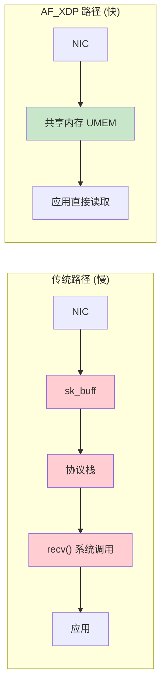
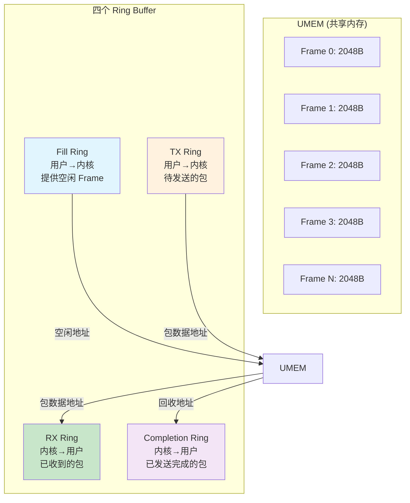
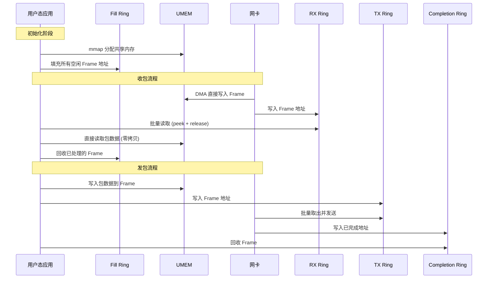
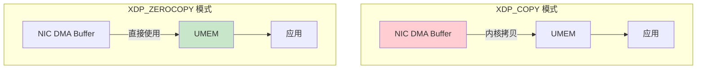
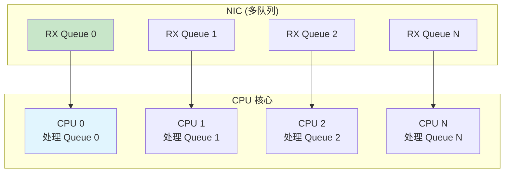
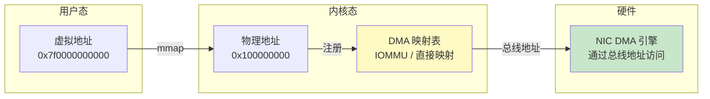

> [!info] eBPF 2026 深度探索系列
> 0. [[2026-04-08-ebpf-comprehensive-learning-roadmap|全栈学习路径总览]]
> 1. [[2026-04-08-ebpf-deep-dive-ch1-registers-and-instructions|第一章：寄存器与指令集]]
> 2. [[2026-04-08-ebpf-deep-dive-ch1-5-function-calls|第一.五章：四种函数调用与动态内存]]
> 3. [[2026-04-08-ebpf-deep-dive-ch1-6-the-verifier|第一.六章：验证器 (Verifier) 的底层逻辑]]
> 4. [[2026-04-08-ebpf-deep-dive-ch2-maps-and-communication|第二章：Map 机制与跨空间通信]]
> 5. [[2026-04-08-ebpf-deep-dive-ch2-5-kptr-and-ownership|第二.五章：kptr (内核指针) 与内存所有权模型]]
> 6. [[2026-04-08-ebpf-deep-dive-ch3-core-and-btf|第三章：CO-RE 与 BTF 的跨版本魔法]]
> 7. [[2026-04-08-ebpf-deep-dive-ch4-tracing-hooks-and-security|第四章：从 kprobe 到 LSM 的追踪全图景]]
> 8. [[2026-04-08-ebpf-deep-dive-ch7-5-uprobes-dynamic-tracing|第七.五章：uprobe 用户态动态追踪原理]]
> 9. [[2026-04-08-ebpf-deep-dive-ch7-6-bpftime-user-runtime|第七.六章：bpftime 与用户态 eBPF 加速]]
> 10. [[2026-04-08-ebpf-deep-dive-ch18-bpftime-injection-mastery|第七.七章：bpftime 自动化注入与全量监控实战]]
> 11. [[2026-04-08-ebpf-deep-dive-ch7-8-uprobe-selection-guide|第七.八章：uprobe 选型指南：内核态 vs 用户态]]
> 12. [[2026-04-08-ebpf-deep-dive-ch5-xdp-networking-performance|第五章：XDP 极致网络性能与全栈架构]]
> 13. [[2026-04-08-ebpf-deep-dive-ch6-tc-traffic-control|第六章：TC (Traffic Control) 流量调度艺术]]
> 14. [[2026-04-08-ebpf-deep-dive-ch7-security-lsm-enforcement|第七章：LSM BPF 从可观测到安全执法]]
> 15. [[2026-04-08-ebpf-deep-dive-ch8-advanced-tuning-and-profiling|第八章：进阶实战与内核调优]]
> 16. **第九章：AF_XDP 零拷贝与用户态协议栈**
> 17. [[2026-04-08-ebpf-deep-dive-ch10-sched-ext-custom-scheduler|第十章：sched_ext 自定义 CPU 调度器]]
> 18. [[2026-04-08-ebpf-deep-dive-ch11-bpf-iterators|第十一章：BPF Iterators 内核对象迭代器]]
> 19. [[2026-04-08-ebpf-deep-dive-ch12-kfuncs-evolution|第十二章：kfuncs 下一代内核交互标准]]
> 20. [[2026-04-08-ebpf-deep-dive-ch13-usdt-tracing|第十三章：USDT 用户态静态定义追踪]]
> 21. [[2026-04-08-ebpf-deep-dive-ch14-ai-llm-inference-monitoring|第十四章：AI 推理与大模型监控前沿]]
> 22. [[2026-04-08-ebpf-deep-dive-ch15-container-isolation|第十五章：无感增强容器隔离性]]
> 23. [[2026-04-08-ebpf-deep-dive-ch16-ebpf-and-wasm|第十六章：eBPF 与 WebAssembly (WASM) 的共生架构]]
> 24. [[2026-04-08-ebpf-deep-dive-ch17-storage-and-filesystem|第十七章：存储与文件系统加速]]
> 25. [[2026-04-08-ebpf-deep-dive-ch18-lifecycle-and-links|第十八章：生命周期管理与 BPF Links]]
> 26. [[2026-04-08-ebpf-deep-dive-ch19-atomic-updates-and-hot-upgrade|第十九章：程序的原子更新与蓝绿部署]]
> 27. [[2026-04-08-ebpf-deep-dive-ch25-5-stack-trace-correlation|第二五.五章：调用栈与业务请求的深度绑定]]
> 28. [[2026-04-08-ebpf-deep-dive-ch20-edge-iot-acceleration|第二十章：边缘计算与工业协议加速]]
> 29. [[2026-04-08-ebpf-deep-dive-ch21-debugging-and-verifier|第二十一章：调试实战与验证器 (Verifier) 诊断]]
> 30. [[2026-04-08-ebpf-deep-dive-ch22-testing-and-ci-cd|第二十二章：测试与持续集成 (CI/CD) 实战]]
> 31. [[2026-04-08-ebpf-deep-dive-ch23-security-and-permissions|第二十三章：权限细分与 BPF 安全沙箱]]
> 32. [[2026-04-08-ebpf-deep-dive-ch24-meta-monitoring-and-self-healing|第二十四章：eBPF 程序的内核自愈与监控]]
> 33. [[2026-04-08-ebpf-deep-dive-ch25-full-stack-observability|第二十五章：全栈可观测性与端到端追踪]]
> 34. [[2026-04-08-ebpf-deep-dive-ch26-network-security-high-level|第二十六章：网络安全防御的高阶实战]]
> 35. [[2026-04-08-ebpf-deep-dive-ch27-agent-engineering-architecture|第二十七章：工业级模块化 Agent 架构演进]]
> 36. [[2026-04-08-ebpf-deep-dive-ch28-offensive-and-defensive|第二十八章：攻防博弈与 Rootkit 防御]]
> 37. [[2026-04-08-ebpf-deep-dive-ch29-networking-deep-dive|第二十九章：网络应用深水区——负载均衡、Sockmap 与拥塞控制]]
> 38. [[2026-04-08-ebpf-deep-dive-ch30-hardware-offload|第三十章：硬件卸载与 SmartNIC 实战]]
> 39. [[2026-04-08-ebpf-deep-dive-ch31-signed-objects-and-security|第三十一章：内核原生签名与供应链安全]]
> 40. [[2026-04-08-ebpf-deep-dive-ch32-ebpf-for-windows|第三十二章：跨平台崛起——eBPF for Windows]]
> 41. [[2026-04-08-ebpf-deep-dive-ch32-5-macos-status|第三十二.五章：macOS 的特殊路径]]
> 42. [[2026-04-08-ebpf-deep-dive-ch33-serverless-optimization|第三十三章：Serverless 冷启动消除与动态计费]]
> 43. [[2026-04-08-ebpf-deep-dive-ch34-waf-and-rasp|第三十四章：Web 安全革命——内核态 WAF 与 RASP]]
> 44. [[2026-04-08-ebpf-deep-dive-ch35-npu-tpu-ai-hardware|第三十五章：AI 推理硬件 (NPU/TPU) 与硬件定义内核]]
> 45. [[2026-04-08-ebpf-deep-dive-ch36-dynamic-language-introspection|第三十六章：动态语言感知——业务对象的零代码提取]]
> 46. [[2026-04-08-ebpf-deep-dive-ch37-green-computing|第三十七章：绿色计算与能耗精准归因]]
> 47. [[2026-04-08-ebpf-deep-dive-ch38-ecosystem-and-career|第三十八章：2026 生态全景与工程师职业导航]]
> 48. [[2026-04-09-ebpf-deep-dive-ch39-rust-aya-framework|第三十九章：Rust eBPF 开发实战——Aya 框架与安全编程]]
> 49. [[2026-04-09-ebpf-deep-dive-ch40-network-protocols-deep-dive|第四十章：网络协议深度解析——TCP/UDP/QUIC 的 eBPF 视角]]
> 50. [[2026-04-09-ebpf-deep-dive-ch41-memory-safety-and-vulnerabilities|第四十一章：eBPF 内存安全与漏洞分析]]
> 51. [[2026-04-09-ebpf-deep-dive-ch42-service-mesh-integration|第四十二章：eBPF 与 Service Mesh 深度集成]]
---

# 第九章：AF_XDP 零拷贝与用户态协议栈

## 1. 为什么需要 AF_XDP

传统 Linux 网络栈处理一个网络包的路径是：NIC → DMA → 中断 → sk_buff 分配 → 协议栈解析 → Socket 缓冲区 → `recv()` 系统调用。每一步都有内存拷贝和 CPU 开销。

AF_XDP (Address Family XDP) 的核心突破：**将网卡 DMA 内存直接映射到用户态地址空间**，应用通过共享内存直接读写报文数据，跳过内核协议栈。



---

## 2. UMEM 与四环架构

### 2.1 UMEM (User Memory)

UMEM 是 AF_XDP 的核心数据结构——一块在用户态分配的连续内存区域，被映射到内核态和用户态的地址空间中：



### 2.2 四个 Ring 的职责

| Ring | 方向 | 生产者 | 消费者 | 存储内容 |
|:---|:---|:---|:---|:---|
| **Fill Ring** | 用户→内核 | 用户态应用 | 内核驱动 | 空闲 Frame 地址（供内核存放新包） |
| **RX Ring** | 内核→用户 | 内核驱动 | 用户态应用 | 已收到包的 Frame 地址 |
| **TX Ring** | 用户→内核 | 用户态应用 | 内核驱动 | 待发送包的 Frame 地址 |
| **Completion Ring** | 内核→用户 | 内核驱动 | 用户态应用 | 已发送完成的 Frame 地址（可回收） |

---

## 3. 数据流转全景



---

## 4. 代码实战

### 4.1 内核态 XDP 分拣程序

```c
#include "vmlinux.h"
#include <bpf/bpf_helpers.h>

struct {
    __uint(type, BPF_MAP_TYPE_XSKMAP);
    __uint(max_entries, 64);
    __type(key, u32);
    __type(value, u32);
} xsks_map SEC(".maps");

// 将指定队列的流量重定向到 AF_XDP Socket
SEC("xdp")
int xdp_sock_prog(struct xdp_md *ctx) {
    u32 index = ctx->rx_queue_index;

    // 检查该队列是否有绑定的 AF_XDP Socket
    if (bpf_map_lookup_elem(&xsks_map, &index)) {
        return bpf_redirect_map(&xsks_map, index, 0);
    }

    // 未绑定的队列交给内核协议栈
    return XDP_PASS;
}
```

### 4.2 用户态 Socket 初始化

```c
#include <bpf/xsk.h>
#include <linux/if_xdp.h>

int create_af_xdp_socket(const char *ifname, int queue_id) {
    struct xsk_socket_config cfg = {
        .rx_size = XSK_RING_PROD__DEFAULT_NUM_DESCS,  // 2048
        .tx_size = XSK_RING_PROD__DEFAULT_NUM_DESCS,
        .libxdp_flags = XSK_LIBXDP_FLAGS__INHIBIT_PROG_LOAD,
    };

    // 1. 创建 UMEM
    struct xsk_umem_config umem_cfg = {
        .frame_size = 2048,  // 每个 Frame 2KB
        .frame_headroom = 0,
        .comp_size = XSK_RING_PROD__DEFAULT_NUM_DESCS,
        .fill_size = XSK_RING_PROD__DEFAULT_NUM_DESCS,
    };

    struct xsk_umem *umem;
    void *umem_area;
    size_t umem_size = NUM_FRAMES * FRAME_SIZE;

    // 分配 UMEM 内存（使用 huge pages 提高性能）
    umem_area = mmap(NULL, umem_size,
                     PROT_READ | PROT_WRITE,
                     MAP_PRIVATE | MAP_ANONYMOUS | MAP_HUGETLB, -1, 0);

    xsk_umem__create(&umem, umem_area, umem_size, &umem_cfg);

    // 2. 创建 AF_XDP Socket
    struct xsk_socket *xsk;
    int ifindex = if_nametoindex(ifname);
    xsk_socket__create(&xsk, ifindex, queue_id, umem, NULL, &cfg);

    return xsk_socket__fd(xsk);
}
```

### 4.3 用户态收发包循环

```c
void poll_loop(struct xsk_socket *xsk, struct xsk_umem *umem) {
    struct xsk_ring_cons *rx = xsk_ring_cons__(xsk);
    struct xsk_ring_prod *fill = xsk_ring_prod__(xsk);
    struct xsk_ring_prod *tx = xsk_ring_prod__(xsk);
    struct xsk_ring_cons *comp = xsk_ring_cons__(xsk);

    while (1) {
        // === 收包路径 ===
        u32 idx_rx = 0;
        unsigned int rcvd = xsk_ring_cons__peek(rx, BATCH_SIZE, &idx_rx);

        if (rcvd > 0) {
            for (unsigned int i = 0; i < rcvd; i++) {
                const struct xdp_desc *desc = xsk_ring_cons__rx_desc(rx, idx_rx + i);
                // 直接从 UMEM 读取，零拷贝
                u8 *pkt = xsk_umem__get_data(umem->buffer, desc->addr);
                process_packet(pkt, desc->len);
            }
            xsk_ring_cons__release(rx, rcvd);

            // 回收 Frame 到 Fill Ring
            u32 idx_fill = 0;
            unsigned int filled = xsk_ring_prod__reserve(fill, rcvd, &idx_fill);
            if (filled > 0) {
                for (unsigned int i = 0; i < filled; i++) {
                    u64 *fill_addr = xsk_ring_prod__fill_addr(fill, idx_fill + i);
                    *fill_addr = xsk_ring_cons__rx_desc(rx, idx_rx + i)->addr;
                }
                xsk_ring_prod__submit(fill, filled);
            }
        }

        // === 发包路径 ===
        // ... 类似的 TX Ring 操作 ...
    }
}
```

---

## 5. 高级配置与优化

### 5.1 绑定模式 (Bind Flags)

| 模式 | 描述 | 适用场景 |
|:---|:---|:---|
| `XDP_COPY` | 内核拷贝报文到 UMEM | 兼容性最好，有拷贝开销 |
| `XDP_ZEROCOPY` | 真正的零拷贝 | 需要驱动支持，最高性能 |
| `XDP_USE_NEED_WAKEUP` | 需要应用主动唤醒 TX | 减少系统调用 |

```c
// 设置零拷贝模式
struct xsk_socket_config cfg = {
    .rx_size = 4096,
    .tx_size = 4096,
    .bind_flags = XDP_COPY | XDP_USE_NEED_WAKEUP,
};

// 零拷贝模式的完整配置
struct xsk_socket_config zc_cfg = {
    .rx_size = 8192,
    .tx_size = 8192,
    .libxdp_flags = 0,
    .xdp_flags = XDP_FLAGS_UPDATE_IF_NOEXIST,
    .bind_flags = XDP_ZEROCOPY | XDP_USE_NEED_WAKEUP,
};
```

### 5.2 零拷贝 vs 拷贝模式



| 指标 | COPY 模式 | ZEROCOPY 模式 |
|:---|:---|:---|
| 内存拷贝 | 1次（内核→UMEM） | 0次 |
| 延迟 | ~1-2μs | ~0.5-1μs |
| 吞吐量 | ~20-30 Mpps | ~40-50 Mpps |
| 驱动要求 | 通用 | 需要驱动支持 |
| 内存使用 | UMEM + DMA buffer | 仅 UMEM |

### 5.3 批量处理优化

```c
// 批量处理的关键参数
#define BATCH_SIZE 64        // 每批处理 64 个包
#define BUSY_POLL_US 10      // busy poll 10μs

void optimized_poll(struct xsk_socket *xsk) {
    struct pollfd fds = {
        .fd = xsk_socket__fd(xsk),
        .events = POLLIN,
    };

    while (1) {
        // 使用 poll + busy polling 减少空转
        int ret = poll(&fds, 1, BUSY_POLL_US);
        if (ret <= 0) continue;

        // 批量消费 RX Ring
        u32 idx;
        unsigned int rcvd = xsk_ring_cons__peek(rx, BATCH_SIZE, &idx);
        if (!rcvd) continue;

        // 批量处理...
        for (unsigned int i = 0; i < rcvd; i++) {
            process_packet(...);
        }

        // 批量释放 + 批量填充 Fill Ring
        xsk_ring_cons__release(rx, rcvd);
        // ...
    }
}
```

### 5.4 NUMA 感知

```c
// 在 NUMA 架构上优化 UMEM 分配
void *allocate_numa_aware_umem(size_t size, int numa_node) {
    // 方案 1: 使用 numactl 预分配
    // numactl --cpunodebind=0 --membind=0 ./my_app

    // 方案 2: 使用 mbind 系统调用
    void *area = mmap(NULL, size,
                      PROT_READ | PROT_WRITE,
                      MAP_PRIVATE | MAP_ANONYMOUS, -1, 0);

    unsigned long nodemask = 1UL << numa_node;
    mbind(area, size, MPOL_BIND, &nodemask,
          sizeof(nodemask) * 8, 0);

    return area;
}
```

---

## 6. AF_XDP vs 其他用户态网络方案

| 方案 | 零拷贝 | 内核集成 | 可编程性 | 生态成熟度 |
|:---|:---|:---|:---|:---|
| **AF_XDP** | 是 | 原生 eBPF | 高（BPF + 用户态） | 高 |
| **DPDK** | 是 | 无（旁路内核） | 高（完全用户态） | 极高 |
| **io_uring + 零拷贝** | 部分 | 原生 | 中 | 中 |
| **netmap** | 是 | 无 | 低 | 低 |

**AF_XDP 的独特优势：** 与 DPDK 不同，AF_XDP 不需要旁路整个内核网络栈。未被 AF_XDP 处理的流量仍然走正常内核路径（SSH、监控等），管理平面完全保留。

---

## 7. 2026 应用场景

| 场景 | AF_XDP 角色 | 性能收益 |
|:---|:---|:---|
| 软交换机/网关 | 替代 OVS 的快速路径 | 延迟降低 5-10x |
| 高频交易 (HFT) | 直接处理交易报文 | 延迟 < 5μs |
| 网络功能虚拟化 (NFV) | 用户态防火墙/IDS | 吞吐 40+ Mpps |
| AI 推理网关 | 模型推理前置解析 | 消除协议栈瓶颈 |
| 流量镜像/审计 | 全量报文复制 | TB 级实时镜像 |

---

## 8. 多队列与 CPU 亲和性

### 8.1 多队列架构

高性能 AF_XDP 应用通常使用多个 Socket，每个绑定到网卡的独立 RX/TX 队列：



### 8.2 RSS 与队列映射

```bash
# 配置网卡 RSS (Receive Side Scaling)
# 让特定流量的哈希映射到特定队列
ethtool -X eth0 hfunc toeplitz
ethtool -X eth0 equal 8  # 8 个队列均匀分布

# 查看当前 RSS 配置
ethtool -x eth0

# 将 CPU 亲和性固定到队列
# IRQ affinity
for irq in $(grep eth0 /proc/interrupts | cut -d: -f1); do
    echo $((1 << 0)) > /proc/irq/$irq/smp_affinity
done
```

### 8.3 多 Socket 初始化

```c
#define NUM_QUEUES 4

struct xsk_socket *xsks[NUM_QUEUES];
struct xsk_umem *umems[NUM_QUEUES];

int setup_multi_queue(const char *ifname) {
    int ifindex = if_nametoindex(ifname);

    for (int q = 0; q < NUM_QUEUES; q++) {
        // 每个 CPU 在自己的 NUMA 节点分配 UMEM
        void *umem_area = mmap(NULL, UMEM_SIZE,
                                PROT_READ | PROT_WRITE,
                                MAP_PRIVATE | MAP_ANONYMOUS | MAP_HUGETLB, -1, 0);
        // 绑定 NUMA 节点
        unsigned long mask = 1UL << (q % numa_num_configured_nodes());
        mbind(umem_area, UMEM_SIZE, MPOL_BIND, &mask, sizeof(mask) * 8, 0);

        xsk_umem__create(&umems[q], umem_area, UMEM_SIZE, &umem_cfg);

        // 创建 Socket 绑定到队列 q
        xsk_socket__create(&xsks[q], ifindex, q, umems[q], NULL, &xsk_cfg);
    }
    return 0;
}
```

---

## 9. DMA 映射与内存管理

### 9.1 DMA 映射机制

AF_XDP 零拷贝的关键在于 DMA 映射——将 UMEM 的虚拟地址映射为网卡可访问的物理地址：



### 9.2 IOMMU 配置

```bash
# 检查 IOMMU 状态
dmesg | grep -i iommu
cat /proc/interrupts | grep iommu

# 启用 IOMMU（内核启动参数）
# intel_iommu=on 或 amd_iommu=on
# iommu=pt (passthrough，最佳性能)

# 验证 IOMMU DMA 映射
find /sys/kernel/iommu_groups/ -type l | head -20
```

### 9.3 Huge Pages 与性能

| 内存类型 | TLB Miss 率 | 性能影响 |
|:---|:---|:---|
| 4KB Pages | 高 | 基准 |
| 2MB Huge Pages | 低 | 吞吐提升 10-20% |
| 1GB Huge Pages | 极低 | 吞吐提升 15-25% |

```bash
# 预分配 huge pages
echo 1024 > /proc/sys/vm/nr_hugepages

# 查看当前 huge pages 状态
cat /proc/meminfo | grep -i huge

# 在代码中使用 MAP_HUGETLB
void *umem = mmap(NULL, size,
    PROT_READ | PROT_WRITE,
    MAP_PRIVATE | MAP_ANONYMOUS | MAP_HUGETLB, -1, 0);
```

---

## 10. 性能调优实战

### 10.1 xdpsock 基准测试

```bash
# 收包测试（零拷贝模式）
xdpsock -i eth0 -r -N -q 0 \
    --frames 4096 --frame-size 2048

# 发包测试
xdpsock -i eth0 -t -N -q 0

# 双向同时测试
xdpsock -i eth0 -r -t -N

# 查看详细统计
xdpsock -i eth0 -r -N -v -q 0
```

### 10.2 常见性能瓶颈

| 瓶颈 | 症状 | 解决方案 |
|:---|:---|:---|
| **Fill Ring 耗尽** | 网卡丢包（`rx_dropped` 上升） | 增大 Ring size 或加快处理速度 |
| **CPU 单核瓶颈** | 单队列无法超过 ~20Mpps | 启用多队列 + RSS |
| **NUMA 跨节点访问** | 延迟波动大 | 确保 UMEM 在网卡所在 NUMA 节点 |
| **中断不均匀** | 部分 CPU 100% | 调整 RPS/RFS 或 IRQ affinity |
| **TLB Miss** | 大 UMEM 下性能下降 | 使用 huge pages |

### 10.3 性能监控

```bash
# 网卡队列级统计
ethtool -S eth0 | grep -E "(rx_queue|tx_queue).*_"

# AF_XDP Socket 统计
cat /proc/net/xdp_socket

# XDP 程序性能
bpftool prog profile id <PROG_ID> duration 10

# 系统级网络统计
nstat -az | grep -E "(TcpExt|IpExt)"
```

---

## 11. 常见问题 FAQ

**Q1：AF_XDP 和 DPDK 该选哪个？**

A：选型取决于是否需要保留内核网络栈。如果所有流量都由你的应用处理（如专用转发设备），DPDK 的旁路模式性能略优。如果需要部分流量走内核（如 SSH 管理、容器网络），AF_XDP 是更好的选择。2026 年的趋势是 AF_XDP 逐渐替代 DPDK，因为它的内核集成性更好。

**Q2：零拷贝模式下 UMEM 会被网卡直接 DMA 写入吗？**

A：是的。在零拷贝模式下，网卡 DMA 引擎直接将收到的包写入 UMEM 中的 Frame。这意味着 UMEM 必须使用 DMA 友好的内存（对齐到页边界，huge pages 更好）。如果使用普通 `malloc` 分配的内存，可能因物理地址不连续导致 DMA 失败。

**Q3：Fill Ring 和 Completion Ring 有什么区别？**

A：Fill Ring 用于**收包**：应用告诉内核"这些 Frame 是空的，可以用来存放新收到的包"。Completion Ring 用于**发包**：内核告诉应用"这些 Frame 中的包已经发送完成，你可以回收它们了"。两者都是应用需要定期处理的。

**Q4：AF_XDP 的 Socket 是 per-CPU 的吗？**

A：AF_XDP Socket 绑定到网卡的特定 RX 队列。如果网卡有 N 个 RX 队列，通常创建 N 个 Socket，每个绑定到一个队列，由不同的 CPU 核心处理。这就是为什么 `xsk_map` 是一个数组——每个队列索引对应一个 Socket。

**Q5：如何调试 AF_XDP 的性能问题？**

A：1) 使用 `ethtool -S eth0` 查看网卡统计（rx_queue_*_* 字段）；2) 使用 `bpftool prog profile` 查看 XDP 程序的性能；3) 检查 Fill Ring 是否经常为空（说明应用处理速度跟不上网卡接收速度）；4) 使用 `xdpsock -i eth0` 进行基准测试。

**Q6：AF_XDP 能处理 jumbo frames (MTU > 1500) 吗？**

A：可以。将 UMEM 的 `frame_size` 设置为大于等于 MTU + 头部开销（如 4096 字节），并在网卡接口上配置 MTU（`ip link set eth0 mtu 9000`）。XDP 程序中 `ctx->data_end - ctx->data` 可以正确反映实际包长度。注意：Multi-buffer XDP（分片包）需要内核 5.10+ 支持。

**Q7：AF_XDP 在虚拟机中能用吗？**

A：取决于虚拟化方案。KVM + virtio_net 不支持 AF_XDP。但 SR-IOV 直通的 VF（Virtual Function）支持完整的 AF_XDP 功能。Cloud Hypervisor 和 Firecracker 正在添加 AF_XDP 支持。建议在生产环境中使用 SR-IOV 或裸金属部署。
