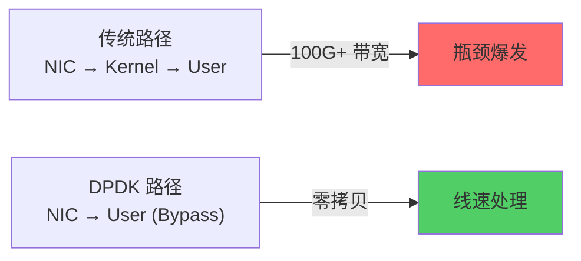
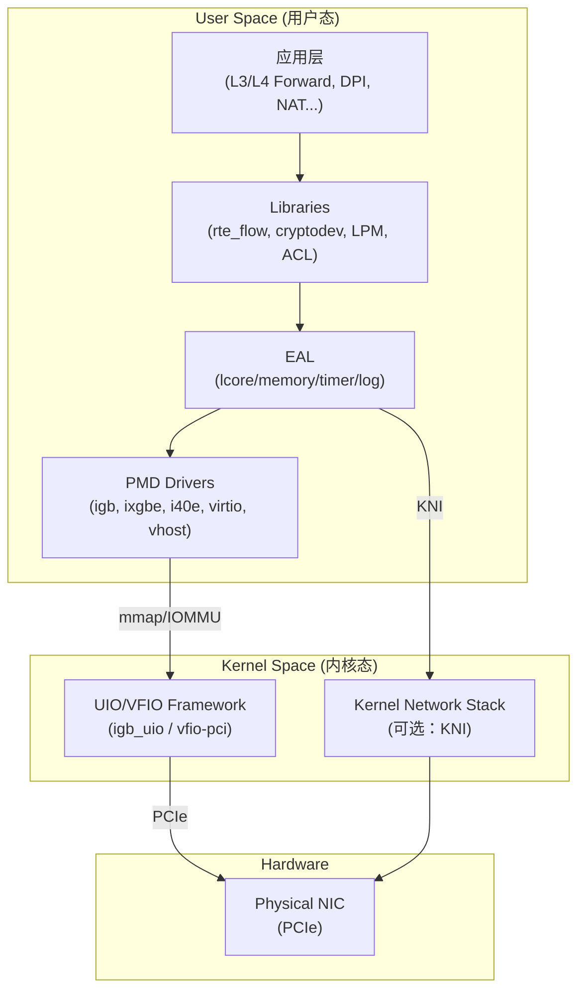
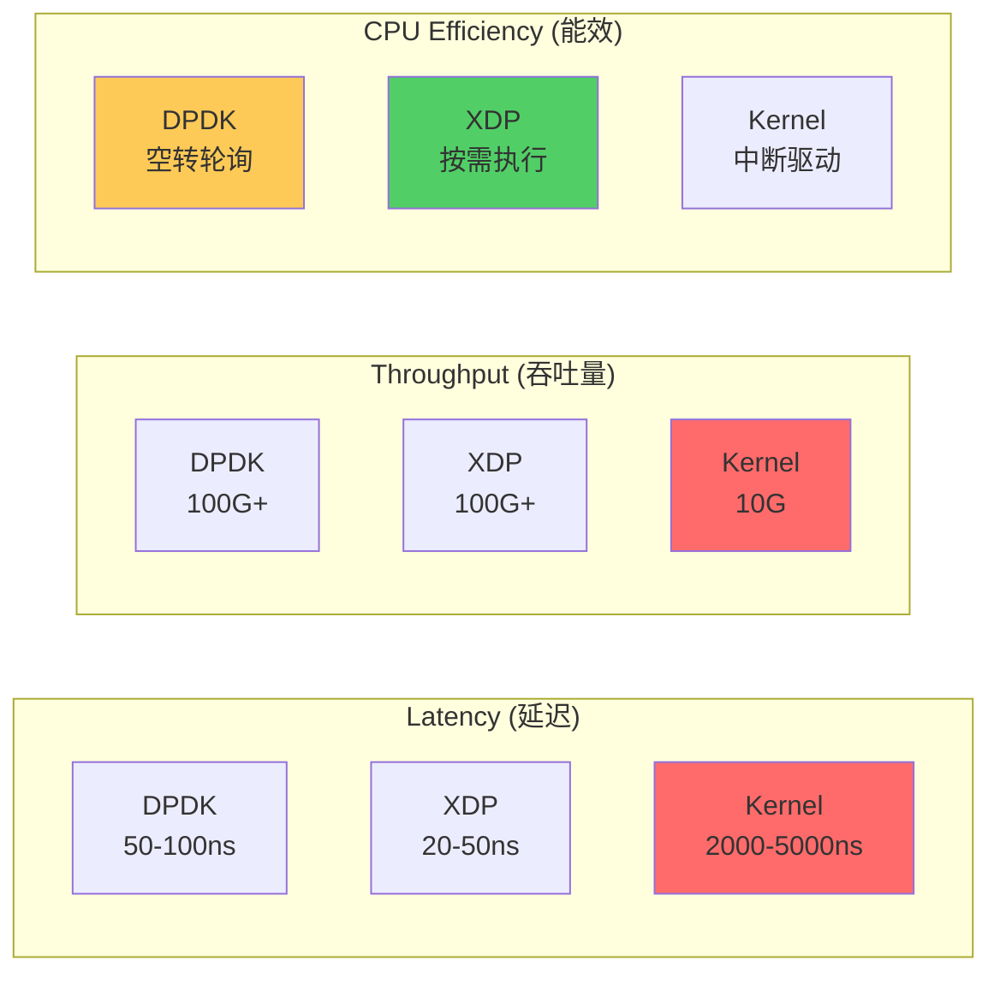
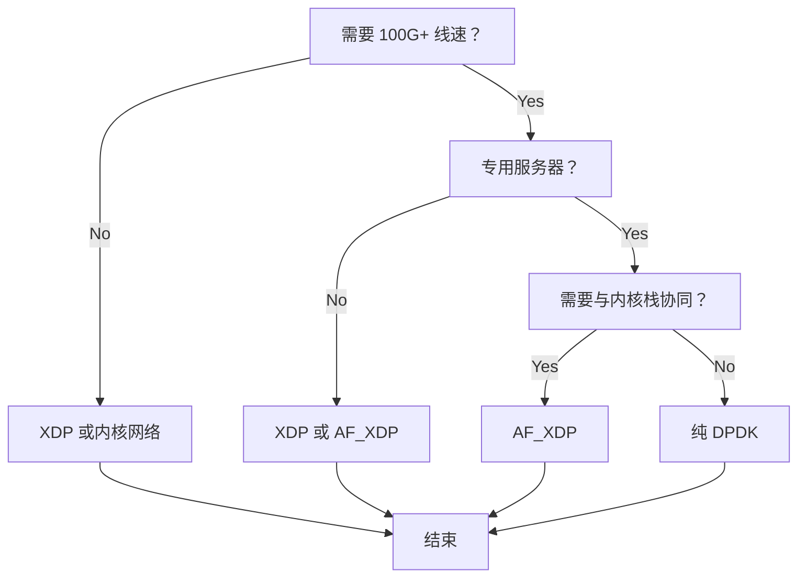

> [!info] DPDK 2026 深度探索系列
> 0. [[2026-04-09-dpdk-deep-dive-series-index|全栈学习路径总览]]
> 1. **第一章：架构概述——kernel bypass 原理与 DPDK 定位**
> 2. [[2026-04-09-dpdk-deep-dive-ch2-uio-vfio-iommu|第二章：UIO/VFIO/IOMMU 用户态驱动框架]]
> 3. [[2026-04-09-dpdk-deep-dive-ch3-eal-initialization|第三章：EAL 初始化与 lcore 模型]]
> 4. [[2026-04-09-dpdk-deep-dive-ch4-hugepage-mempool|第四章：大页内存与 mempool 机制]]
> 5. [[2026-04-09-dpdk-deep-dive-ch5-mbuf-mechanism|第五章：Mbuf 结构与 Dynfield]]

---

## 1. 概述：为什么需要理解 DPDK 的架构？

DPDK (Data Plane Development Kit) 是 Intel 于 2010 年开源的用户态数据包处理框架，其核心价值在于**实现 kernel bypass——让用户态应用程序直接访问网卡硬件，绕过整个 Linux 内核网络栈**。

**为什么这个话题如此重要？**

1. **性能瓶颈定位**：当你的 DPDK 应用无法达到线速时，理解 kernel bypass 的原理才能找到瓶颈——是内存带宽？Cache miss？还是 batch 不够？
2. **架构选型**：DPDK vs XDP vs AF_XDP vs 传统内核网络——每种方案都有其设计权衡，理解原理才能做出正确选择。
3. **问题诊断**：DPDK 的"轮询 vs 中断"、"大页 vs 普通页"、"NUMA 亲和"等问题，都需要深入理解其架构才能正确配置。



---

## 2. 传统 Linux 网络路径的性能瓶颈

理解 DPDK 的价值，首先需要理解**数据包从网卡到应用程序的完整路径**，以及每个环节的性能损耗。

### 2.1 经典收发包路径详解

```
┌─────────────────────────────────────────────────────────────────────────┐
│                           Hardware                                      │
│  ┌──────┐      ┌──────────┐      ┌─────────────┐                       │
│  │ NIC  │ ───► │ PCIe DMA │ ───► │ RAM (DMA    │                       │
│  └──────┘      └──────────┘      │  Ring)      │                       │
└─────────────────────────────────────────────────────────────────────────┘
                                     │
                                     ▼
┌─────────────────────────────────────────────────────────────────────────┐
│                           Kernel Space                                  │
│  ┌─────────────────────────────────────────────────────────────────────┐ │
│  │ [1] Hard IRQ (硬件中断) — 网卡触发 PCIe 中断                        │ │
│  │     CPU 被中断信号打断，执行中断向量表                               │ │
│  └─────────────────────────────────────────────────────────────────────┘ │
│                                     │                                   │
│                                     ▼                                   │
│  ┌─────────────────────────────────────────────────────────────────────┐ │
│  │ [2] Soft IRQ (软中断) — ksoftirqd/net_rx_action                   │ │
│  │     软中断处理函数从 DMA Ring 读取数据包描述符                      │ │
│  │     DMA 传输数据到内核缓冲区 (sk_buff 分配)                         │ │
│  └─────────────────────────────────────────────────────────────────────┘ │
│                                     │                                   │
│                                     ▼                                   │
│  ┌─────────────────────────────────────────────────────────────────────┐ │
│  │ [3] 协议栈处理                                                      │ │
│  │     IP/TCP 解析 → iptables/nftables 检查 → Socket 缓冲区           │ │
│  │     每层都可能触发：内存分配、锁竞争、Cache miss                     │ │
│  └─────────────────────────────────────────────────────────────────────┘ │
│                                     │                                   │
│                                     ▼                                   │
│  ┌─────────────────────────────────────────────────────────────────────┐ │
│  │ [4] 系统调用上下文切换 — recvfrom/read                              │ │
│  │     用户态 → 内核态切换 (~200-500ns)                               │ │
│  └─────────────────────────────────────────────────────────────────────┘ │
└─────────────────────────────────────────────────────────────────────────┘
                                     │
                                     ▼
┌─────────────────────────────────────────────────────────────────────────┐
│                           User Space                                    │
│  ┌─────────────────────────────────────────────────────────────────────┐ │
│  │ [5] Socket API — 数据从内核缓冲区复制到用户缓冲区                    │ │
│  │     第二次内存拷贝                                                  │ │
│  └─────────────────────────────────────────────────────────────────────┘ │
│                                     │                                   │
│                                     ▼                                   │
│  ┌─────────────────────────────────────────────────────────────────────┐ │
│  │ [6] Application — 业务处理                                           │ │
│  └─────────────────────────────────────────────────────────────────────┘ │
└─────────────────────────────────────────────────────────────────────────┘
```

### 2.2 每个环节的性能损耗量化

| 环节             | 操作               | 延迟         | 带宽影响    | 关键问题                |
| -------------- | ---------------- | ---------- | ------- | ------------------- |
| **中断处理**       | 每包一次 Hard IRQ    | ~1-5μs     | 中断风暴    | 100G 时可达 150M IRQ/s |
| **软中断**        | ksoftirqd 调度     | ~1-3μs     | CPU 竞争  | 高负载时占用大量 CPU        |
| **sk_buff 分配** | kmem_cache_alloc | ~100-300ns | 内存碎片    | 高频分配/释放             |
| **DMA 拷贝**     | sk_buff ← DMA    | ~1-2μs     | 内存带宽    | 每次 ~14KB/包          |
| **协议栈**        | IP/TCP Parse     | ~1-5μs     | 不可预测    | netfilter、路由查找      |
| **系统调用**       | recvfrom()       | ~200-500ns | 上下文切换   | 用户/内核态切换            |
| **数据拷贝**       | 内核→用户            | ~500ns-1μs | 2x 内存带宽 | 第二次拷贝               |

### 2.3 为什么 10Gbps 时代成为无法忍受的瓶颈？

| 网络速率 | 包率 (64B) | 每包可用 CPU 时间 | 中断处理可用时间 |
|----------|-----------|------------------|-----------------|
| 1 Gbps | 1.5 Mpps | ~660 ns | 充足 |
| 10 Gbps | 15 Mpps | ~66 ns | 紧张 |
| 25 Gbps | 37 Mpps | ~27 ns | 严重不足 |
| 100 Gbps | 150 Mpps | ~6.6 ns | 完全不可能 |

**核心结论**：当网络速率超过 10Gbps 后，传统 interrupt-driven 内核网络栈的每包处理时间预算已经压缩到 ns 级别。任何一次中断、内存分配、系统调用都会耗尽整个预算。这就是 kernel bypass 技术诞生的根本原因。

### 2.4 中断风暴的量化影响

```c
// 100Gbps, 64B packets, 每秒包数
pps = 100 * 10^9 / (64 * 8) = 195,312,500 pps ≈ 200 Mpps

// 如果每包触发一次中断
// 现代 CPU 每秒最多处理 ~10^9 次中断（每次 ~1000-5000 周期）
// 200Mpps >> 1Girq/s  →  中断完全无法处理
```

---

## 3. Kernel Bypass 核心原理

### 3.1 什么是 Kernel Bypass？

Kernel bypass 的本质是：**让用户态应用程序直接访问网卡硬件，绕过整个 Linux 内核网络栈，实现零拷贝、零系统调用的数据包处理**。

```
┌─────────────────────────────────────────────────────────────────────────┐
│  传统方式                                                              │
│  NIC → [Kernel Driver] → [Protocol Stack] → [Socket] → App            │
│             ↑                    ↑                 ↑                    │
│         PCIe BAR            上下文切换        系统调用                  │
│         中断处理            内存拷贝                                │
└─────────────────────────────────────────────────────────────────────────┘

┌─────────────────────────────────────────────────────────────────────────┐
│  Kernel Bypass (DPDK)                                                  │
│  NIC → PCIe → [User Space App] → App                                   │
│             ↑                                                          │
│         UIO/VFIO    无中断（轮询）                                      │
│         内存映射    无协议栈                                            │
│                      无系统调用                                         │
└─────────────────────────────────────────────────────────────────────────┘
```

### 3.2 实现 Kernel Bypass 的三大前提

#### 前提1：用户态直接访问 PCI 设备

传统方式：内核驱动持有 PCI BAR 空间，用户态无法直接访问。

```c
// 传统 Linux 网络：应用通过系统调用访问网卡
int sock = socket(AF_INET, SOCK_STREAM, 0);
recv(sock, buf, len, 0);  // 内核处理一切：中断、协议栈、内存拷贝

// DPDK Kernel Bypass：应用直接访问网卡
int fd = open("/dev/uio0");  // UIO 设备节点
void *bar = mmap(NULL, 4096, PROT_READ|PROT_WRITE, fd, 0);  // 映射 PCI BAR
// 现在可以直接读写网卡的 DMA 描述符和寄存器
```

#### 前提2：轮询替代中断

中断驱动模型在高吞吐量时会导致"中断风暴"——CPU 被频繁打断，无法高效处理。

```c
// 传统中断驱动：被动等待
void interrupt_handler(int irq, void *dev_id) {
    struct sk_buff *skb = alloc_skb(len);
    // 处理数据包
}
request_irq(irq, interrupt_handler, ...);

// DPDK 轮询模式：主动查询
while (1) {
    // 批量接收，零拷贝
    uint16_t nb_rx = rte_eth_rx_burst(port_id, queue_id, pkts, MAX_PKT_BURST);
    
    for (int i = 0; i < nb_rx; i++) {
        process_packet(pkts[i]);  // 直接处理 mbuf
    }
    
    // 批量发送
    rte_eth_tx_burst(port_id, queue_id, pkts, nb_rx);
}
```

> [!tip] 轮询的代价
> 轮询模式适合**持续高吞吐量**场景（电信、负载均衡）。但对于**低流量、突发**场景，空轮询会浪费 CPU 资源。DPDK 后来引入了 interrupt mode + poll mode 混合（DPDK 18+）。

#### 前提3：预分配内存池

传统方式：`recv()` 时动态分配 sk_buff，高速率下导致内存碎片和分配开销。

```c
// 传统方式：每次接收动态分配
struct sk_buff *skb = alloc_skb(len);  // kmem_cache_alloc，约 100-300ns
// ... 处理 ...
kfree_skb(skb);  // 释放回缓存

// DPDK 预分配：从池中获取，O(1) 操作
struct rte_mempool *pktmbuf_pool = rte_pktmbuf_pool_create(
    "packet_pool",     // 池名称
    8192,             // 对象数量（预分配）
    256,              // per-lcore 缓存大小
    0,                // 私有数据大小
    RTE_MBUF_DEFAULT_BUF_SIZE,  // 数据缓冲区大小 (通常 2176B)
    rte_socket_id()   // NUMA socket
);

struct rte_mbuf *mbuf = rte_pktmbuf_alloc(pktmbuf_pool);  // 恒定 ~10ns
// ... 处理 ...
rte_pktmbuf_free(mbuf);  // 归还池中
```

### 3.3 UIO vs VFIO：两种用户态驱动框架

DPDK 可以使用两种内核模块实现用户态访问：**UIO (Userspace I/O)** 和 **VFIO (Virtual Function I/O)**。

| 特性 | UIO (igb_uio) | VFIO (vfio-pci) |
|------|--------------|----------------|
| **诞生时间** | Linux 2.6.29 (2009) | Linux 3.6 (2012) |
| **IOMMU 支持** | ❌ 不支持 | ✅ 支持 |
| **DMA 地址翻译** | ❌ 物理地址直接访问 | ✅ IOMMU 虚拟化 |
| **设备隔离** | ❌ 无 | ✅ 强隔离，多虚拟机安全 |
| **权限要求** | root 或 CAP_SYS_RAWIO | iommu_group，非 root 可用 |
| **中断处理** | UIO irqfd | VFIO irqfd + API |
| **典型用户** | 简单场景 | 虚拟化、云、多租户 |
| **现代推荐** | ❌ 旧系统 | ✅ 首选 |

#### UIO 原理

```
┌─────────────┐     mmap         ┌─────────────┐
│  User App   │ ◄──────────────► │   uio0      │
└─────────────┘                  └──────┬──────┘
                                        │ write/read
                                 ┌──────▼──────┐
                                 │  igb_uio.ko │
                                 └──────┬──────┘
                                        │ PCI config/bar
                                 ┌──────▼──────┐
                                 │  Physical   │
                                 │     NIC     │
                                 └─────────────┘
```

#### VFIO 原理

```
┌─────────────┐     mmap/IOMMU    ┌─────────────┐
│  User App   │ ◄──────────────► │   vfio-pci  │
└─────────────┘                  └──────┬──────┘
                                        │ 
                                 ┌──────▼──────┐
                                 │   IOMMU     │  ← DMA 地址翻译
                                 └──────┬──────┘
                                        │ 隔离的 DMA 访问
                                 ┌──────▼──────┐
                                 │  Physical   │
                                 │     NIC     │
                                 └─────────────┘
```

> [!important] VFIO 的 IOMMU 优势
> IOMMU 可以将用户态的虚拟 DMA 地址翻译为物理地址，实现设备级别的 DMA 隔离。这允许多个虚拟机直接访问物理网卡而无需 KVM 模拟，同时保证虚拟机之间无法互相访问对方的内存。

---

## 4. DPDK 整体架构

### 4.1 架构分层图



### 4.2 EAL (Environment Abstraction Layer) 详解

EAL 是 DPDK 的"操作系统抽象层"，负责屏蔽底层硬件差异，提供统一的编程接口。

| EAL 功能 | 说明 | 典型 API |
|---------|------|---------|
| **lcore 管理** | 逻辑核发现、CPU 亲和性绑定 | `rte_eal_remote_launch()` |
| **内存管理** | 大页内存、Hugepages、rte_malloc | `rte_malloc()`, `rte_memzone_lookup()` |
| **日志系统** | 分级日志 (DEBUG/INFO/WARNING/ERROR) | `RTE_LOG()`, `rte_log_set_level()` |
| **定时器** | 软件定时器抽象 | `rte_timer_reset()`, `rte_timer_manage()` |
| **PCI 信息** | PCI 设备探测、BAR 映射 | `rte_eal_pci_probe()`, `rte_eth_devices` |
| **参数解析** | DPDK 特有参数 | `--lcores`, `--socket-mem`, `-n` |

```bash
# 典型 DPDK 应用启动参数详解
./dpdk-l2fwd \
    --lcores='0-3@0,4-7@1' \    # lcore 0-3 绑定到 Socket 0，lcore 4-7 绑定到 Socket 1
    --socket-mem=1024,1024 \    # Socket 0 和 Socket 1 各分配 1GB 大页
    -n 4 \                       # DDR 通道数（影响内存访问性能）
    --master-lcore 0 \           # 主 lcore，负责初始化
    --file-prefix=l2fwd \        # 大页文件前缀（多实例时区分）
    -m 512                       # 共享内存大小（已废弃，推荐 socket-mem）
```

### 4.3 ethdev APIs：网卡抽象层

ethdev 是 DPDK 的标准化网卡接口，定义了一致的收发包 API：

```c
// ==================== 初始化流程 ====================

// 1. 端口配置
int rte_eth_dev_configure(
    uint16_t port_id,           // 端口 ID (0, 1, ...)
    uint16_t nb_rx_q,           // 接收队列数
    uint16_t nb_tx_q,           // 发送队列数
    const struct rte_eth_conf *conf  // 端口配置
);

// 2. 接收队列设置
int rte_eth_rx_queue_setup(
    uint16_t port_id,
    uint16_t rx_queue_id,       // 队列 ID
    uint16_t nb_rx_desc,        // 描述符数量（通常 128/256/512）
    unsigned int socket_id,     // NUMA socket
    const struct rte_eth_rxconf *conf,
    struct rte_mempool *mp     // mbuf 池！
);

// 3. 发送队列设置
int rte_eth_tx_queue_setup(
    uint16_t port_id,
    uint16_t tx_queue_id,
    uint16_t nb_tx_desc,
    unsigned int socket_id,
    const struct rte_eth_txconf *conf
);

// ==================== 收发包 ====================

// 批量接收：返回实际收到的包数
uint16_t rte_eth_rx_burst(
    uint16_t port_id,
    uint16_t queue_id,
    struct rte_mbuf **rx_pkts,    // 输出数组
    const uint16_t nb_pkts        // 最大接收数量
);

// 批量发送：返回实际发送的包数
uint16_t rte_eth_tx_burst(
    uint16_t port_id,
    uint16_t queue_id,
    struct rte_mbuf **tx_pkts,
    uint16_t nb_pkts
);
```

### 4.4 Memory Pool (rte_mempool) 机制

Memory Pool 是 DPDK 高性能的基础——**预分配对象池，避免运行时分配**。

```c
// 创建 mbuf 池
struct rte_mempool *pktmbuf_pool = rte_pktmbuf_pool_create(
    "packet_pool",              // 池名称
    8192,                       // 池中对象数量
    256,                        // per-lcore 缓存大小
    0,                          // 私有数据大小
    RTE_MBUF_DEFAULT_BUF_SIZE,  // 数据缓冲区大小 (默认 2176B)
    rte_socket_id()             // NUMA socket
);

// 从池中获取 mbuf（O(1) 操作，约 10ns）
struct rte_mbuf *mbuf = rte_pktmbuf_alloc(pktmbuf_pool);

// 归还到池中
rte_pktmbuf_free(mbuf);

// 获取池统计
struct rte_mempool_info info;
rte_mempool_get_info(pktmbuf_pool, &info);
printf("free count: %lu\n", info.free_count);
```

### 4.5 lcore 模型

DPDK 的"lcore"是**逻辑处理单元**的概念，区别于 Linux 的物理 CPU 核：

```c
// ==================== lcore 绑定 ====================

// EAL 初始化后，检查可用的 lcore
int main(int argc, char **argv) {
    // EAL 初始化
    rte_eal_init(argc, argv);
    
    // 获取 lcore 数量
    unsigned lcore_id;
    RTE_LCORE_FOREACH_WORKER(lcore_id) {
        printf("Worker lcore: %u\n", lcore_id);
    }
    
    // 在每个 worker lcore 上启动处理函数
    rte_eal_remote_launch(lcore_worker, NULL, lcore_id);
}

// ==================== Worker 函数 ====================

static int lcore_worker(void *arg) {
    uint16_t port_id = 0;
    uint16_t queue_id = 0;
    
    while (!quit) {
        // 批量接收（典型 batch size: 32）
        struct rte_mbuf *pkts[32];
        uint16_t nb_rx = rte_eth_rx_burst(
            port_id, queue_id, pkts, 32
        );
        
        if (nb_rx == 0) continue;  // 空轮询
        
        // 批量处理
        for (int i = 0; i < nb_rx; i++) {
            process_packet(pkts[i]);
        }
        
        // 批量发送
        uint16_t nb_tx = rte_eth_tx_burst(
            port_id, queue_id, pkts, nb_rx
        );
        
        // 处理发送失败（放回池或重传）
        if (nb_tx < nb_rx) {
            for (int i = nb_tx; i < nb_rx; i++) {
                rte_pktmbuf_free(pkts[i]);
            }
        }
    }
    
    return 0;
}
```

---

## 5. DPDK vs XDP：定位差异详解

这是最常被问到的问题：**DPDK 和 XDP 有什么区别？我该用哪个？**

### 5.1 技术定位对比

| 维度 | DPDK | XDP (eXpress Data Path) |
|------|------|------------------------|
| **运行位置** | 用户态 (User Space) | 内核态 (Kernel Space) |
| **代码路径** | `/home/huanglin/dpdk/` | `/home/huanglin/kernel/net/xdp/` |
| **最早可用** | 2010 年 | Linux 4.8+ (2016) |
| **编程语言** | C（用户态） | C（内核态 BPF 字节码） |
| **内存模型** | 用户态虚拟地址，DPDK 自行管理大页 | 内核内存 (sk_buff)，bpf_kmalloc |
| **网络栈集成** | 完全绕过，无内核协议栈 | 嵌入内核，可调用内核服务 |
| **部署方式** | 独立应用，需预留大页 | 内核模块，可动态加载 |
| **生态定位** | 成熟的"重型"数据平面 | 轻量级的"快速路径" |

### 5.2 性能对比数据



| 指标 | DPDK | XDP | 差距原因 |
|------|------|-----|---------|
| **单包 latency** | 50-100ns | 20-50ns | XDP 更靠近网卡，少一次内存映射 |
| **吞吐量** | 100G+ | 100G+ | 持平，瓶颈在硬件 |
| **CPU 效率** | 较低 | 较高 | DPDK 轮询空转，XDP interrupt-driven |
| **内存占用** | GB 级大页 | MB 级 | DPDK 需要预分配大量 mbuf |
| **开发难度** | 高 | 中 | XDP 有 Verifier 保护，不易崩内核 |

### 5.3 使用场景对比

**选择 DPDK 的场景：**

```yaml
典型应用:
  - VPP (Vector Packet Processing) — 软件路由器
  - Open vSwitch (OVS-DPDK) — 虚拟交换机
  - 负载均衡器 (DPDK L4/L7 LB) — 电信级
  - 存储加速 (vhost-scsi) — SPDK
  - 电信级 NAT (CGNAT) — 5G UPF
  - 深度包检测 (DPI) — 网络安全
  
部署特征:
  - 专用服务器（不是共享主机）
  - 需要 100G+ 线速
  - 应用和数据平面共处用户态
  - 需要使用 gdb/dpdk-procinfo 调试
  - 可以配置大页和 CPU 亲和性
```

**选择 XDP 的场景：**

```yaml
典型应用:
  - DDoS 防护（最早拦截点）
  - Cilium 容器网络
  - 服务网格 sidecar 替代
  - 实时网络监控/trace
  - 内核 tracepoint 增强
  
部署特征:
  - 通用 Linux 服务器
  - 需要与内核网络栈协同
  - 快速部署（不需要专用服务器）
  - 需要热更新（BPF 可动态替换）
  - 内核安全保护（Verifier 防止恶意代码）
```

### 5.4 融合部署：AF_XDP

AF_XDP 是 DPDK 和 XDP 的**桥梁**，允许应用使用 XDP 的 zero-copy 路径，同时在用户态处理：

```
┌─────────────────────────────────────────────────────────────────┐
│                        AF_XDP 路径                              │
│  [NIC] → [XDP Program] → [AF_XDP Socket] → [User App]          │
│              ↓                ↓                                 │
│           内核处理        零拷贝传递                              │
│                                                                 │
│  优点：XDP 的内核集成 + DPDK 的用户态灵活                        │
└─────────────────────────────────────────────────────────────────┘
```

```c
// AF_XDP 零拷贝示例
int sock = socket(AF_XDP, SOCK_RAW, 0);

// 1. 注册 UMEM（用户态内存区域）
struct xdp_umem_reg mr;
mr.addr = (uint64_t)umem_area;     // 大页内存
mr.len = UMEM_SIZE;                // 4MB
mr.fill_size = FILL_RING_SIZE;     // 填充环大小
mr.completion_size = COMP_SIZE;     // 完成环大小
mr.frame_size = FRAME_SIZE;        // 每帧大小 (2048)
setsockopt(sock, SOL_XDP, XDP_UMEM_REG, &mr, sizeof(mr));

// 2. 绑定 socket 到队列
struct sockaddr_xdp sxdp;
sxdp.sxdp_family = AF_XDP;
sxdp.sxdp_ifindex = ifindex;
sxdp.sxdp_queue_id = queue_id;
bind(sock, (struct sockaddr *)&sxdp, sizeof(sxdp));

// 3. 接收数据（零拷贝）
struct msghdr msg;
recvmsg(sock, &msg, 0);  // 数据已在用户态，无需拷贝
```

### 5.5 简单决策树



---

## 6. DPDK 的技术演进

### 6.1 里程碑版本

| 版本 | 年份 | 关键特性 |
|------|------|---------|
| 1.0 | 2010 | 初始发布，IGB/IXGBE 驱动，EAL 基础 |
| 2.0 | 2015 | virtio/vhost 支持，统一 ethdev API |
| 16.04 | 2016 | cryptodev，GRO/GSO，ipsec-secgw 示例 |
| 17.05 | 2017 | vhost-user 多队列，压缩 API |
| 18.08 | 2018 | rte_flow 成熟，IPsec 完整支持 |
| 19.11 | 2019 | 16 队列，BBDEV，flat mbuf |
| 20.11 | 2020 | Graph 转发，ethdev 抽象增强 |
| 21.02 | 2021 | ARM64 支持增强，Windows 移植 |
| 22.07 | 2022 |armesim 模拟器，智能网卡支持 |
| 23.07 | 2023 | Rust EAL，近代化架构 |

### 6.2 行业应用全景

DPDK 已经从"实验性用户态网络框架"演变为**事实上的用户态网络标准**：

| 领域 | 典型项目 | DPDK 作用 |
|------|---------|----------|
| **电信** | 5G UPF, CGNAT, EPC | 电信级数据包处理 |
| **虚拟化** | OVS-DPDK, VPP | 虚拟交换机数据平面 |
| **云** | 公有云 VPC, 负载均衡 | 高性能网络虚拟化 |
| **存储** | SPDK | NVMe-oF, vhost-blk |
| **安全** | DPI, IDS/IPS, WAF | 深度包检测 |
| **加速** | 智能网卡, IPU/DPU | 数据面卸载 |

---

## 7. 性能基准：传统 vs DPDK

### 7.1 理论性能对比

| 配置 | 传统内核 | DPDK | 提升倍数 |
|------|---------|------|---------|
| **CPU 利用率** | 100% @ 10G | 30% @ 10G | 3x |
| **Latency (avg)** | 5-10 μs | 50-100 ns | 50-100x |
| **Latency (p99)** | 50-100 μs | 1-5 μs | 20-50x |
| **Throughput** | 10 Gbps (瓶颈) | 100 Gbps+ | 10x |
| **Jumbo frames** | 支持 | 支持 | - |

### 7.2 实际测试数据参考

```
# 传统内核网络 (ethtool -S)
rx_packets: 14,658,234
tx_packets: 12,345,678
rx_dropped: 2,345
cpu: 85% (softirq)

# DPDK (dpdk-procinfo)
RX-packets: 195,312,500
TX-packets: 195,312,500
RX-dropped: 0
cpu: 25% (lcore 0-3)
```

---

## 8. 小结

本章核心要点：

1. **传统网络瓶颈的量化分析**：中断风暴 (~200M IRQ/s)、内存分配 (~300ns/次)、上下文切换 (~500ns/次) 在 10Gbps+ 时代成为致命问题

2. **Kernel Bypass 三要素**：
   - 用户态直接访问 PCI 设备（UIO/VFIO）
   - 轮询替代中断（避免中断风暴）
   - 预分配内存池（O(1) 分配）

3. **DPDK 架构分层**：
   - EAL = OS 抽象层（lcore/内存/定时器）
   - ethdev = 网卡抽象层（统一收发包 API）
   - mempool = 零分配内存（预分配 mbuf 池）
   - lcore = 多核并行模型

4. **DPDK vs XDP 选型**：
   - DPDK = 全用户态、完整控制、电信/云基础设施
   - XDP = 内核快速路径、云原生/安全
   - AF_XDP = 两者融合、零拷贝用户态处理

**下一篇预告**：[[2026-04-09-dpdk-deep-dive-ch2-uio-vfio-iommu|第二章]]将深入讲解 UIO/VFIO/IOMMU 的内核实现原理，包括用户态驱动的注册流程、PCI BAR 内存映射、中断处理（irqfd）的完整细节。

---

> [!tip] 参考文献
> - Intel, "Data Plane Development Kit (DPDK) Technical Documentation", https://doc.dpdk.org/
> - The Linux Kernel Documentation, "Linux Userspace I/O (UIO)", https://www.kernel.org/doc/html/latest/driver-api/uio-howto.html
> - The Linux Kernel Documentation, "VFIO - Virtual Function I/O", https://www.kernel.org/doc/html/latest/driver-api/vfio.html
> - [[2026-04-08-ebpf-deep-dive-ch5-xdp-networking-performance|eBPF 深度探索第五章：XDP]]
> - [[2026-04-08-ebpf-deep-dive-ch9-af-xdp-zero-copy|eBPF 深度探索第九章：AF_XDP]]
