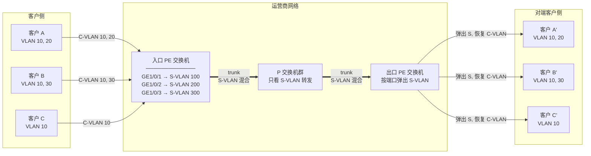
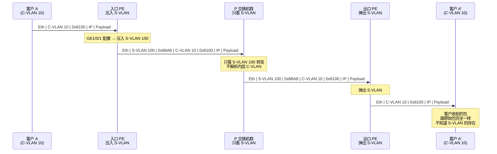
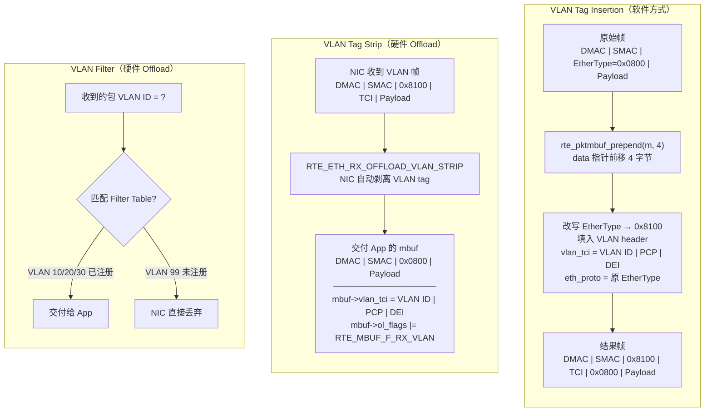
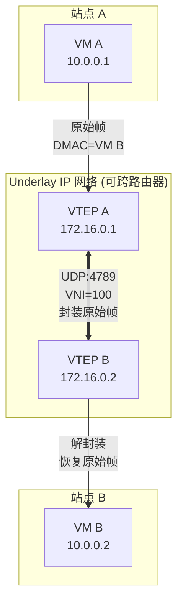
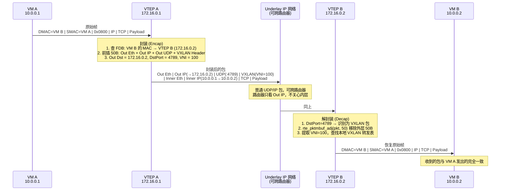
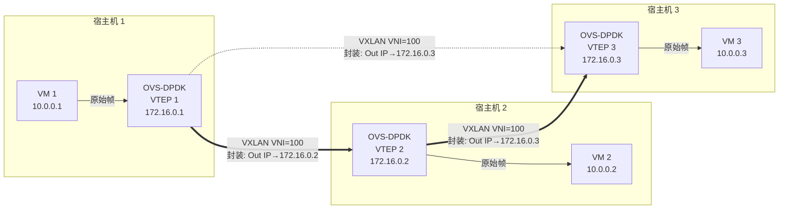
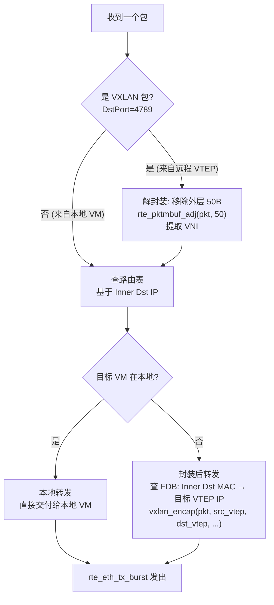

> [!info] DPDK 深度探索系列 0. [[2026-04-09-dpdk-deep-dive-series-index|全栈学习路径总览]]
> 1-13. 前十三章已完成 14. **第十四章：VLAN/VXLAN 隧道与报头封装**

---

## 1. 概述：隧道技术为什么重要？

### 1.1 VLAN vs VXLAN

| 特性         | VLAN                        | VXLAN                                       |
| ------------ | --------------------------- | ------------------------------------------- |
| **标识数量** | 4096                        | 1600 万 (2^24)                              |
| **网络范围** | 本地（L2 broadcast domain） | 跨 L3 网络（Overlay）                       |
| **封装位置** | 交换机/路由器               | VTEP（隧道端点）                            |
| **头部开销** | 4 字节                      | 50 字节（外部 Ethernet + IP + UDP + VXLAN） |
| **三层互通** | 需要 VLAN 间路由            | 天然跨三层                                  |

### 1.2 典型报文格式

```mermaid
flowchart TB
    subgraph Normal ["普通 Ethernet 包"]
        direction LR
        N1["Ether<br/>14B"] --> N2["IP<br/>20B"] --> N3["L4<br/>20B"] --> N4["Payload<br/>..."]
    end

    subgraph VLAN ["VLAN 包 (802.1Q)"]
        direction LR
        V1["Ether<br/>14B"] --> V2["VLAN<br/>4B<br/>0x8100"] --> V3["IP<br/>20B"] --> V4["L4<br/>20B"] --> V5["Payload<br/>..."]
    end

    subgraph VXLAN ["VXLAN 包 (Overlay)"]
        direction LR
        X1["Out Ether<br/>14B"] --> X2["Out IP<br/>20B"] --> X3["Out UDP<br/>8B"] --> X4["VXLAN<br/>8B"] --> X5["Inner Ether<br/>14B"] --> X6["Inner IP<br/>20B"] --> X7["Payload<br/>..."]
    end
```



| 对比         | 普通 Ethernet | VLAN (802.1Q)         | VXLAN (Overlay)         |
| ------------ | ------------- | --------------------- | ----------------------- |
| **额外开销** | 0B            | +4B (VLAN tag)        | +50B (Eth+IP+UDP+VXLAN) |
| **网络标识** | 无            | 12-bit VLAN ID (4096) | 24-bit VNI (1600万)     |
| **跨 L3**    | 不支持        | 不支持                | 支持 (UDP 封装)         |

---

---

## 2. VLAN (802.1Q)

### 2.1 VLAN 头部结构

```c
// lib/net/rte_ether.h

// VLAN 头部 (802.1Q)
struct rte_vlan_hdr {
    rte_be16_t vlan_tci;      // Tag Control Information
    rte_be16_t eth_proto;     // 内部 EtherType
};

#define RTE_VLAN_HLEN 4

// TCI 结构
// ┌─────────────────────────────────────────────┐
// │ PCP (3) │ DEI (1) │     VLAN ID (12)        │
// │ 优先级   │ DROP Eligible │   VLAN 标识        │
// └─────────────────────────────────────────────┘

// PCP (Priority Code Point) - 帧优先级
#define RTE_VLAN_PRI_SHIFT  13
#define RTE_VLAN_PRI_MASK   0xE000

// DEI (Drop Eligibility Indicator)
#define RTE_VLAN_DEI_SHIFT  12
#define RTE_VLAN_DEI_MASK   0x1000

// VLAN ID
#define RTE_VLAN_ID_MASK    0x0FFF
```

### 2.2 解析 VLAN

```c
// 解析 VLAN 头部
static void
parse_vlan(struct rte_ether_hdr *eth)
{
    struct rte_vlan_hdr *vlan = (struct rte_vlan_hdr *)(eth + 1);

    uint16_t tci = rte_be_to_cpu_16(vlan->vlan_tci);
    uint16_t vlan_id = tci & RTE_VLAN_ID_MASK;
    uint16_t pcp = (tci >> RTE_VLAN_PRI_SHIFT) & 0x07;
    uint16_t dei = (tci >> RTE_VLAN_DEI_SHIFT) & 0x01;

    printf("VLAN: id=%d, pcp=%d, dei=%d\n", vlan_id, pcp, dei);

    // 内部 EtherType
    uint16_t inner_etype = rte_be_to_cpu_16(vlan->eth_proto);

    if (inner_etype == RTE_ETHER_TYPE_IPV4) {
        struct rte_ipv4_hdr *ip = (struct rte_ipv4_hdr *)(vlan + 1);
        printf("  Inner: IPv4\n");
    } else if (inner_etype == RTE_ETHER_TYPE_IPV6) {
        printf("  Inner: IPv6\n");
    }
}

// 检查 EtherType 是否为 VLAN
static inline int
is_vlan_tagged(struct rte_ether_hdr *eth)
{
    return eth->ether_type == rte_cpu_to_be_16(RTE_ETHER_TYPE_VLAN);
}
```

### 2.3 QinQ (双层 VLAN)

> [!example] 为什么需要 QinQ？
> **问题**：你是运营商（如中国电信），接入了两家企业客户。客户 A（互联网公司）内部用 VLAN 10/20/30，客户 B（银行）内部也用 VLAN 10/20/30。
> 两家都用 VLAN 10 —— 他们的流量在你的网络里完全混在一起，无法区分。
>
> **没有 QinQ**：你需要跟每家客户协商"你不要用 VLAN 10，换一个"——4096 个 ID 根本不够分，而且客户内部网络改 VLAN 成本极高。
>
> **有了 QinQ**：客户的 VLAN 你完全不动。流量进入你的网络时，你在外面再包一层你自己的 S-VLAN：
>
> ```
> 客户 A 的包:  S-VLAN 100 + C-VLAN 10     ← 客户 A 的 VLAN 10
> 客户 B 的包:  S-VLAN 200 + C-VLAN 10     ← 客户 B 的 VLAN 10
> ```
>
> 你的网络只看 S-VLAN（100 vs 200）来转发，两家客户互不干扰。
> 客户 A 和 B 完全不知道你在外面包了一层，他们继续用自己的 VLAN 编号方案。
> 这就是 QinQ 的核心价值：**在不改变客户内部网络的前提下，实现多客户 VLAN ID 复用**。
>
> **注意**：QinQ 和普通 VLAN 一样是 L2 技术，通过 trunk 口跨交换机透传，
> 同样不能跨越路由器。两者的唯一区别就是上面说的 VLAN ID 复用能力。

```c
// QinQ (802.1ad / 802.1Q-in-Q) - 双层 VLAN 标签
// 外层 VLAN（服务提供商 S-VLAN）
// 内层 VLAN（客户 C-VLAN）
//
// DPDK 不提供独立的 rte_qinq_hdr 结构体，
// 双层 VLAN 本质上是两个连续的 rte_vlan_hdr：

// EtherType: 外层 0x88A8 (IEEE 802.1ad)
#define RTE_ETHER_TYPE_QINQ  0x88A8
// 注意：0x9100/0x9200/0x9300 是已废弃的早期 QinQ EtherType

// 解析 QinQ
static void
parse_qinq(struct rte_ether_hdr *eth)
{
    if (eth->ether_type != rte_cpu_to_be_16(RTE_ETHER_TYPE_QINQ))
        return;

    struct rte_vlan_hdr *outer = (struct rte_vlan_hdr *)(eth + 1);
    struct rte_vlan_hdr *inner = (struct rte_vlan_hdr *)(outer + 1);

    uint16_t outer_vlan = rte_be_to_cpu_16(outer->vlan_tci) & RTE_VLAN_ID_MASK;
    uint16_t inner_vlan = rte_be_to_cpu_16(inner->vlan_tci) & RTE_VLAN_ID_MASK;

    printf("QinQ: outer=%d, inner=%d\n", outer_vlan, inner_vlan);

    // 内层 EtherType
    uint16_t inner_etype = rte_be_to_cpu_16(inner->eth_proto);
}
```



> 三个客户都用 VLAN 10，但各自的 S-VLAN 不同（100/200/300），在运营商网络中互不干扰。
> S-VLAN 映射规则在入口 PE 上静态配置，出口 PE 根据目标端口弹出对应的 S-VLAN。



> **QinQ vs VLAN 的关系**：两者都是 L2 技术，都通过 trunk 口跨交换机透传，都不能跨路由器。QinQ 的唯一优势是允许不同客户复用相同的 C-VLAN ID。跨机房 / 跨数据中心 / 跨公网 → 需要下一节的 VXLAN。

### 2.4 VLAN Offload

```c
// VLAN offload 配置
struct rte_eth_conf conf = {
    .rxmode = {
        .mq_mode = RTE_ETH_MQ_RX_NONE,
        .offloads = RTE_ETH_RX_OFFLOAD_VLAN_FILTER |  // VLAN 过滤
                    RTE_ETH_RX_OFFLOAD_VLAN_STRIP,    // VLAN 剥离
    },
};

// VLAN 过滤 - 只接收特定 VLAN 的包
int
vlan_filter_enable(uint16_t port_id, uint16_t vlan_id)
{
    return rte_eth_dev_vlan_filter(port_id, vlan_id, 1);
}

// VLAN 剥离 - 通过 vlan offload API 控制
int
vlan_strip_enable(uint16_t port_id)
{
    // rte_eth_dev_set_vlan_offload: 设置端口的 VLAN offload 功能
    // 参数: port_id, offload_mask (RTE_ETH_VLAN_STRIP_MASK 等)
    return rte_eth_dev_set_vlan_offload(port_id, RTE_ETH_VLAN_STRIP_MASK);
}

// 在发送时插入 VLAN tag
// 注意：如果硬件支持 RTE_ETH_TX_OFFLOAD_VLAN_INSERT，
// 可以通过 mbuf->vlan_tci 直接让硬件插入，无需软件操作。
// 以下展示软件插入方式：
int
vlan_insert(struct rte_mbuf *m, uint16_t vlan_id)
{
    struct rte_ether_hdr *eth = rte_pktmbuf_mtod(m, struct rte_ether_hdr *);

    // 在 Ethernet 头和 payload 之间插入 4 字节 VLAN 头
    char *new_hdr = (char *)rte_pktmbuf_prepend(m, RTE_VLAN_HLEN);
    if (new_hdr == NULL)
        return -ENOMEM;

    struct rte_ether_hdr *new_eth = (struct rte_ether_hdr *)new_hdr;
    struct rte_vlan_hdr *vlan = (struct rte_vlan_hdr *)(new_eth + 1);

    // 保存原始 EtherType
    uint16_t orig_etype = eth->ether_type;

    // 恢复 Ethernet 头（DMAC + SMAC），prepend 已经前移了数据
    // 由于 prepend 前移了 data 指针，eth 指针已失效，
    // 需要从新的 new_hdr 重新构建
    rte_memcpy(new_eth, new_hdr + RTE_VLAN_HLEN, sizeof(struct rte_ether_hdr));

    // 设置 VLAN 头
    vlan->vlan_tci = rte_cpu_to_be_16(vlan_id);
    vlan->eth_proto = orig_etype;

    // 更新 EtherType 为 802.1Q
    new_eth->ether_type = rte_cpu_to_be_16(RTE_ETHER_TYPE_VLAN);

    // pkt_len 和 data_len 已由 rte_pktmbuf_prepend 自动更新
    return 0;
}
```

### 2.5 VLAN 处理流程



---

## 3. VXLAN 详解

### 3.1 VXLAN 背景

VXLAN (Virtual eXtensible LAN) 是 RFC 7348 定义的一种 Overlay 网络技术：



> VM A 和 VM B 在同一个 VXLAN (VNI=100)，即使它们在不同的物理网络中，也能通过 Underlay IP 网络直接通信。VXLAN 解决了 QinQ/VLAN 不能跨路由器的限制。

### 3.2 VXLAN 头部结构

```c
// lib/net/rte_vxlan.h

// VXLAN 头部 (8 字节)
// 实际 DPDK 使用 union + bitfield 定义，支持 GBP 扩展 (RFC 7348)。
// 此处为简化表示：
//
//   Word 0 (4 bytes): Flags (8 bits) + Reserved (24 bits)
//                      bit 3 = I flag (VNI valid)
//   Word 1 (4 bytes): VNI (24 bits) + Reserved (8 bits)
//
struct rte_vxlan_hdr {
    rte_be32_t vx_flags;        // Flags (8 bits) + Reserved (24 bits)
    rte_be32_t vx_vni;          // VNI (24 bits) + Reserved (8 bits)
} __rte_packed;

// I flag: bit 3 of first byte, 表示 VNI 有效
// 注意：DPDK 实际通过 union bitfield 的 flag_i 成员访问
#define RTE_VXLAN_FLAGS_I  0x08

// VXLAN UDP 目的端口 (IANA 标准端口)
#define RTE_VXLAN_DEFAULT_PORT  4789

// 解析 VNI (VXLAN Network Identifier)
static inline uint32_t
vxlan_get_vni(struct rte_vxlan_hdr *vh)
{
    uint32_t vni_field = rte_be_to_cpu_32(vh->vx_vni);
    return (vni_field >> 8) & 0xFFFFFF;
}

// VXLAN 头部解析示例
static void
parse_vxlan(struct rte_udp_hdr *udp)
{
    uint16_t dst_port = rte_be_to_cpu_16(udp->dst_port);

    if (dst_port == RTE_VXLAN_DEFAULT_PORT) {
        struct rte_vxlan_hdr *vxlan = (struct rte_vxlan_hdr *)(udp + 1);

        // 通过 be32 读取 flags，取最低字节
        uint32_t flags_be = rte_be_to_cpu_32(vxlan->vx_flags);
        uint8_t flags = (uint8_t)(flags_be >> 24);
        uint32_t vni = vxlan_get_vni(vxlan);

        printf("VXLAN: flags=0x%02x, vni=%d\n", flags, vni);

        if (flags & RTE_VXLAN_FLAGS_I) {
            // I flag 置位，VNI 有效
        }
    }
}
```

### 3.3 VXLAN 完整封装

| 字段                   | 大小 | 说明                                                             |
| ---------------------- | ---- | ---------------------------------------------------------------- |
| **Outer Ethernet**     | 14B  | DMAC(6B) + SMAC(6B) + EtherType=0x0800                           |
| **Outer IP**           | 20B  | Src=VTEP-A IP, Dst=VTEP-B IP, Proto=17(UDP)                      |
| **Outer UDP**          | 8B   | SrcPort(动态), DstPort=4789, Checksum(可选)                      |
| **VXLAN Header**       | 8B   | Word 0: Flags(1B) + Reserved(3B), Word 1: VNI(3B) + Reserved(1B) |
| **Inner Ethernet**     | 14B  | 原始帧的 DMAC + SMAC + EtherType                                 |
| **Inner IP**           | 20B  | VM 之间的原始 IP 头                                              |
| **Inner L4 + Payload** | ...  | 原始 TCP/UDP 头及数据                                            |

> **Total Outer Overhead: 50 bytes** (14 + 20 + 8 + 8)，每个 VXLAN 包都额外携带 50 字节的外层头。对于大量小包（如 64B 的 TCP ACK），开销比例高达 78%。

### 3.4 VXLAN 封装/解封装流程



> **关键点**：VM 完全不知道 VXLAN 的存在，它以为自己在一个扁平的二层网络里。封装/解封装对 VM 透明，全部由 VTEP 完成。

### 3.5 VXLAN 封装实现

```c
// VXLAN 封装函数
static struct rte_mbuf *
vxlan_encap(struct rte_mbuf *pkt,
            uint32_t src_ip, uint32_t dst_ip,
            uint16_t src_port, uint32_t vni)
{
    struct rte_mbuf *encap = rte_pktmbuf_alloc(mbuf_pool);
    if (!encap)
        return NULL;

    // 准备头部空间 (14 + 20 + 8 + 8 = 50 bytes)
    char *head = rte_pktmbuf_prepend(encap, 50);
    if (!head) {
        rte_pktmbuf_free(encap);
        return NULL;
    }

    // 填充 Outer Ethernet
    struct rte_ether_hdr *outer_eth = (struct rte_ether_hdr *)head;
    // ... 设置 DMAC, SMAC, ether_type = 0x0800

    // 填充 Outer IP
    struct rte_ipv4_hdr *outer_ip = (struct rte_ipv4_hdr *)(outer_eth + 1);
    outer_ip->version_ihl = (4 << 4) | 5;
    outer_ip->total_length = rte_cpu_to_be_16(20 + 8 + 8 + rte_pktmbuf_pkt_len(pkt));
    outer_ip->ttl = 64;
    outer_ip->next_proto_id = IPPROTO_UDP;
    outer_ip->src_addr = src_ip;
    outer_ip->dst_addr = dst_ip;

    // 填充 Outer UDP
    struct rte_udp_hdr *outer_udp = (struct rte_udp_hdr *)(outer_ip + 1);
    outer_udp->src_port = rte_cpu_to_be_16(src_port);
    outer_udp->dst_port = rte_cpu_to_be_16(RTE_VXLAN_DEFAULT_PORT);
    outer_udp->dgram_len = rte_cpu_to_be_16(8 + 8 + rte_pktmbuf_pkt_len(pkt));

    // 填充 VXLAN Header
    struct rte_vxlan_hdr *vxlan = (struct rte_vxlan_hdr *)(outer_udp + 1);
    // Flags: I flag (bit 3) = 1, 其余为 0
    // I flag 在第一个字节的 bit 3，网络字节序下最高字节为 flags
    vxlan->vx_flags = rte_cpu_to_be_32(RTE_VXLAN_FLAGS_I << 24);
    // VNI: 高 24 位，低 8 位 reserved
    vxlan->vx_vni = rte_cpu_to_be_32(vni << 8);

    // 链接原始包（encap 只含外层头，pkt 链为后续 segment）
    encap->next = pkt;
    encap->pkt_len = 50 + rte_pktmbuf_pkt_len(pkt);
    encap->nb_segs = pkt->nb_segs + 1;

    // 设置 offload flags
    encap->ol_flags |= RTE_MBUF_F_TX_IPV4 | RTE_MBUF_F_TX_IP_CKSUM |
                       RTE_MBUF_F_TX_UDP_CKSUM;
    // 设置外层头部长度，用于硬件 checksum offload
    encap->l2_len = sizeof(struct rte_ether_hdr);
    encap->l3_len = sizeof(struct rte_ipv4_hdr);
    encap->l4_len = sizeof(struct rte_udp_hdr);

    return encap;
}
```

### 3.6 VXLAN 解封装

```c
// VXLAN 解封装
static struct rte_mbuf *
vxlan_decap(struct rte_mbuf *pkt)
{
    struct rte_ether_hdr *outer_eth = rte_pktmbuf_mtod(pkt, struct rte_ether_hdr *);
    struct rte_ipv4_hdr *outer_ip = (struct rte_ipv4_hdr *)(outer_eth + 1);
    struct rte_udp_hdr *outer_udp = (struct rte_udp_hdr *)(outer_ip + 1);
    struct rte_vxlan_hdr *vxlan = (struct rte_vxlan_hdr *)(outer_udp + 1);

    // 验证 VXLAN I flag
    uint32_t flags_be = rte_be_to_cpu_32(vxlan->vx_flags);
    uint8_t flags = (uint8_t)(flags_be >> 24);
    if (!(flags & RTE_VXLAN_FLAGS_I)) {
        return NULL;  // 不是有效的 VXLAN 包
    }

    // 提取 VNI
    uint32_t vni = vxlan_get_vni(vxlan);
    printf("VXLAN VNI: %d\n", vni);

    // 移除外层头部 (14 + 20 + 8 + 8 = 50 bytes)
    // 注意：如果外层有 VLAN tag，需要额外减去 4 字节
    rte_pktmbuf_adj(pkt, 50);

    // 现在是原始的 Inner Ethernet 包
    struct rte_ether_hdr *inner_eth = rte_pktmbuf_mtod(pkt, struct rte_ether_hdr *);
    printf("Inner: %02x:%02x:%02x:%02x:%02x:%02x -> %02x:%02x:%02x:%02x:%02x:%02x\n",
           inner_eth->src_addr.addr_bytes[0], inner_eth->src_addr.addr_bytes[1],
           inner_eth->src_addr.addr_bytes[2], inner_eth->src_addr.addr_bytes[3],
           inner_eth->src_addr.addr_bytes[4], inner_eth->src_addr.addr_bytes[5],
           inner_eth->dst_addr.addr_bytes[0], inner_eth->dst_addr.addr_bytes[1],
           inner_eth->dst_addr.addr_bytes[2], inner_eth->dst_addr.addr_bytes[3],
           inner_eth->dst_addr.addr_bytes[4], inner_eth->dst_addr.addr_bytes[5]);

    return pkt;
}
```

---

## 4. VXLAN Flow 规则

### 4.1 使用 rte_flow 匹配 VXLAN

```c
// 使用 rte_flow 匹配 VXLAN 流量
static int
vxlan_flow_create(uint16_t port_id)
{
    struct rte_flow_attr attr = {
        .ingress = 1,
        .priority = 0,
    };

    // 匹配模式：外层 IP + UDP + VXLAN VNI
    struct rte_flow_item pattern[] = {
        // 外层 Ethernet
        {
            .type = RTE_FLOW_ITEM_TYPE_ETH,
            .mask = &rte_flow_item_eth_mask,
        },
        // 外层 IPv4
        {
            .type = RTE_FLOW_ITEM_TYPE_IPV4,
            .mask = &rte_flow_item_ipv4_mask,
            .spec = &(struct rte_flow_item_ipv4) {
                .hdr = {
                    .dst_addr = 0xFFFFFFFF,  // 匹配目标 IP
                },
            },
        },
        // 外层 UDP
        {
            .type = RTE_FLOW_ITEM_TYPE_UDP,
            .mask = &rte_flow_item_udp_mask,
            .spec = &(struct rte_flow_item_udp) {
                .hdr = {
                    .dst_port = rte_cpu_to_be_16(RTE_VXLAN_DEFAULT_PORT),
                },
            },
        },
        // VXLAN (DPDK 23.11+)
        {
            .type = RTE_FLOW_ITEM_TYPE_VXLAN,
            .mask = &rte_flow_item_vxlan_mask,
            .spec = &(struct rte_flow_item_vxlan) {
                .hdr = {
                    .vx_vni = rte_cpu_to_be_32(0xFFFFFF << 8),  // 匹配 VNI
                },
            },
        },
        // 内层 Ethernet
        {
            .type = RTE_FLOW_ITEM_TYPE_ETH,
            .mask = &rte_flow_item_eth_mask,
        },
        // 内层 IPv4
        {
            .type = RTE_FLOW_ITEM_TYPE_IPV4,
            .mask = &rte_flow_item_ipv4_mask,
        },
        {
            .type = RTE_FLOW_ITEM_TYPE_END,
        },
    };

    // 动作：排队到 queue 0
    struct rte_flow_action actions[] = {
        {
            .type = RTE_FLOW_ACTION_TYPE_QUEUE,
            .conf = &(struct rte_flow_action_queue) { .index = 0 },
        },
        {
            .type = RTE_FLOW_ACTION_TYPE_END,
        },
    };

    return rte_flow_create(port_id, &attr, pattern, actions, &error);
}
```

### 4.2 NVGRE 封装

```c
// NVGRE (Network Virtualization using GRE)
// RFC 7637 - 另一种 Overlay 封装
//
// NVGRE 没有独立的头部结构体，它复用标准 GRE 头 (rte_gre_hdr)。
// NVGRE 的特殊之处：
// - GRE Version = 0, K flag = 1 (Key Present), S/C = 0
// - Key 字段高 24 bit 为 VSID (Virtual Subnet ID)，低 8 bit 为 Flow ID
// - Protocol Type = 0x6558 (Transparent Ethernet Bridging)

// lib/net/rte_gre.h - 标准 GRE 头
struct rte_gre_hdr {
    // 16-bit flags (各 bit 含义取决于字节序)
    rte_be16_t flags;       // C(bit0) R K S ver(3bits) ...
    rte_be16_t proto;       // Protocol Type
} __rte_packed;

// NVGRE Key 字段 (4 bytes, 紧跟 GRE header):
// ┌─────────────────────────────────────────┐
// │  VSID (24 bits)    │  Flow ID (8 bits)  │
// └─────────────────────────────────────────┘

// NVGRE 对比 VXLAN
// - VXLAN: UDP 封装，端口 4789，天然支持 ECMP
// - NVGRE: GRE 封装，协议类型 0x6558，ECMP 需要 hash 校准
```

### 4.3 GENEVE 封装

```c
// GENEVE (Generic Network Virtualization Encapsulation)
// RFC 8926 - VXLAN 的后继者

// lib/net/rte_geneve.h
struct rte_geneve_hdr {
    // Byte 0: ver(2) + opt_len(6)
    // Byte 1: reserved(6) + critical(1) + oam(1)
    rte_be16_t ver_opt_len;   // Version + Options Length + Flags
    rte_be16_t proto;         // Protocol Type (0x6558 = Ethernet)
    uint8_t    vni[3];        // Virtual Network Identifier (24 bits)
    uint8_t    reserved;      // Reserved
    uint32_t   opts[];        // Variable length TLV options
} __rte_packed;

#define RTE_GENEVE_DEFAULT_PORT 6081
#define RTE_GENEVE_TYPE_ETH     0x6558

// GENEVE 特点
// - 可扩展选项 (TLV)：每个 option 4 字节对齐
// - 支持 IPv4 和 IPv6 封装
// - UDP 封装 (6081)
// - 硬件支持不如 VXLAN 广泛
```

---

## 5. GENEVE vs VXLAN vs VLAN 对比

### 5.1 特性对比表

| 特性            | VLAN      | VXLAN   | GENEVE   |
| --------------- | --------- | ------- | -------- |
| **ID 空间**     | 4096      | 1600 万 | 1600 万  |
| **封装位置**    | L2 交换机 | VTEP    | VTEP     |
| **外层协议**    | -         | UDP     | UDP      |
| **Header 大小** | 4B        | 8B      | 8B+      |
| **L2 扩展**     | 本地      | 跨 L3   | 跨 L3    |
| **可扩展性**    | 无        | 固定    | TLV 选项 |
| **硬件支持**    | 广泛      | 较好    | 一般     |

### 5.2 选型指南

```c
// 选型决策树

if (需要 > 4096 个隔离网络) {
    // 使用 VXLAN 或 GENEVE
    if (需要可扩展选项) {
        // GENEVE - 适合 SDN 控制器
    } else {
        // VXLAN - 更广泛的硬件支持
    }
} else {
    // 使用 VLAN - 简单高效
}
```

---

## 6. Tunnel Offload

### 6.1 Tunnel Offload 配置

```c
// 启用 Tunnel offload
struct rte_eth_conf conf = {
    .rxmode = {
        .offloads = RTE_ETH_RX_OFFLOAD_VLAN_STRIP |
                    RTE_ETH_RX_OFFLOAD_OUTER_IPV4_CKSUM |  // 外层 IPv4 checksum
                    RTE_ETH_RX_OFFLOAD_OUTER_UDP_CKSUM,    // 外层 UDP checksum
    },
    .txmode = {
        .offloads = RTE_ETH_TX_OFFLOAD_VLAN_INSERT |
                    RTE_ETH_TX_OFFLOAD_VXLAN_TNL_TSO |  // VXLAN TSO
                    RTE_ETH_TX_OFFLOAD_GRE_TNL_TSO,     // GRE TSO
    },
};
```

### 6.2 Tunnel TSO (TCP Segmentation Offload)

```c
// Tunnel TSO - NIC 对隧道内层 TCP 进行硬件分段
// 发送路径：App 构造大包 → 设置 tunnel + TSO flag → NIC 自动分段
//   NIC 每个分段都会复制外层 (outer Eth + IP + UDP + VXLAN) + 内层 (inner Eth + IP)
//   只在最后一个分段填充外层/内层 checksum
//
// 接收路径：NIC 接收分段包 → GRO 合并 → App 处理完整包

static void
tunnel_tso_example(struct rte_mbuf *pkt, uint16_t mss)
{
    // 假设 pkt 包含完整的 VXLAN 包
    // 我们想要对内部 TCP 进行 TSO

    struct rte_ether_hdr *outer_eth = rte_pktmbuf_mtod(pkt, struct rte_ether_hdr *);
    struct rte_ipv4_hdr *outer_ip = (struct rte_ipv4_hdr *)(outer_eth + 1);
    struct rte_udp_hdr *outer_udp = (struct rte_udp_hdr *)(outer_ip + 1);
    struct rte_vxlan_hdr *vxlan = (struct rte_vxlan_hdr *)(outer_udp + 1);
    struct rte_ether_hdr *inner_eth = (struct rte_ether_hdr *)(vxlan + 1);
    struct rte_ipv4_hdr *inner_ip = (struct rte_ipv4_hdr *)(inner_eth + 1);
    struct rte_tcp_hdr *inner_tcp = (struct rte_tcp_hdr *)(inner_ip + 1);

    // 设置 TSO 参数
    // MSS 应用于内部 TCP
    uint16_t inner_l4_len = (inner_tcp->data_off >> 4) * 4;
    uint16_t inner_data_len = rte_be_to_cpu_16(inner_ip->total_length) -
                               sizeof(struct rte_ipv4_hdr) - inner_l4_len;

    if (inner_data_len > mss) {
        // 标记隧道类型，NIC 需要知道外层封装格式
        pkt->ol_flags |= RTE_MBUF_F_TX_TUNNEL_VXLAN;
        pkt->ol_flags |= RTE_MBUF_F_TX_TCP_SEG;
        pkt->tso_segsz = mss;  // 内部 TCP MSS

        // 设置各层头部长度，NIC 用于定位 checksum 计算位置
        pkt->outer_l2_len = sizeof(struct rte_ether_hdr);
        pkt->outer_l3_len = sizeof(struct rte_ipv4_hdr);
        pkt->l2_len = sizeof(struct rte_ether_hdr);
        pkt->l3_len = sizeof(struct rte_ipv4_hdr);
        pkt->l4_len = inner_l4_len;
    }
}
```

---

## 7. 实际应用示例

### 7.1 OVS-DPDK VXLAN 转发

OVS-DPDK 作为 VTEP 时，收到的包可能来自本地 VM（需封装发出）或远程 VTEP（需解封装后转发）。典型场景是三层 VXLAN 网关——VTEP 既是隧道的端点，也是内部 VM 的默认网关。





```c
// OVS-DPDK 中 VXLAN 转发逻辑
static void
vxlan_forward(struct rte_mbuf *pkt, uint32_t vni, uint32_t dst_vtep_ip)
{
    // 1. 解封装（如果是 VXLAN 包）
    if (is_vxlan_packet(pkt)) {
        pkt = vxlan_decap(pkt);
    }

    // 2. 查找路由（基于内部 IP）
    struct rte_ipv4_hdr *inner_ip = get_inner_ip(pkt);
    struct route_entry *rt = lookup_route(inner_ip->dst_addr);

    // 3. 封装到目标 VTEP
    if (rt->is_remote) {
        uint32_t src_vtep = get_local_vtep_ip(rt->src_net);
        uint16_t udp_src = hash5tuple(inner_ip) & 0xFFFF;

        struct rte_mbuf *encap = vxlan_encap(pkt,
                                              src_vtep,
                                              rt->remote_vtep,
                                              udp_src,
                                              rt->vni);
        // 发送
        rte_eth_tx_burst(port_id, 0, &encap, 1);
    } else {
        // 本地转发
        rte_eth_tx_burst(port_id, 0, &pkt, 1);
    }
}
```

### 7.2 多租户 VLAN + VXLAN

```c
// 多租户网络架构：VLAN 隔离租户，VXLAN 提供租户内扩展

// 租户 A: VLAN 100, VXLAN VNI 10000
// 租户 B: VLAN 200, VXLAN VNI 20000

struct tenant_config {
    uint16_t vlan_id;
    uint32_t vxlan_vni;
    uint32_t tenant_ip_base;
};

// 配置 tenant flows
static void
setup_tenant_flows(uint16_t port_id, struct tenant_config *tenant)
{
    // 1. VLAN 过滤 - 只接收该租户的 VLAN 包
    rte_eth_dev_vlan_filter(port_id, tenant->vlan_id, 1);

    // 2. rte_flow - 匹配 VLAN + 内部 IP，添加 VXLAN 封装
    struct rte_flow_attr attr = { .ingress = 1, .priority = 0 };

    struct rte_flow_item pattern[] = {
        { .type = RTE_FLOW_ITEM_TYPE_ETH },
        {
            .type = RTE_FLOW_ITEM_TYPE_VLAN,
            .spec = &(struct rte_flow_item_vlan) {
                .tci = rte_cpu_to_be_16(tenant->vlan_id),
            },
        },
        {
            .type = RTE_FLOW_ITEM_TYPE_IPV4,
            .spec = &(struct rte_flow_item_ipv4) {
                .hdr = {
                    .dst_addr = rte_cpu_to_be_32(tenant->tenant_ip_base),
                    .dst_mask = rte_cpu_to_be_32(0xFFFFFF00),
                },
            },
        },
        { .type = RTE_FLOW_ITEM_TYPE_END },
    };

    struct rte_flow_action actions[] = {
        {
            .type = RTE_FLOW_ACTION_TYPE_PHY_PORT,
            .conf = &(struct rte_flow_action_phy_port) {
                .original = 1,
                .index = 0,  // 物理端口
            },
        },
        { .type = RTE_FLOW_ACTION_TYPE_END },
    };

    rte_flow_create(port_id, &attr, pattern, actions, &error);
}
```

---

## 8. 小结

本章核心要点：

1. **VLAN (802.1Q)**：4 字节头部，TCI 包含 PCP(3位) + DEI(1位) + VLAN ID(12位)，共 4096 个 VLAN。

2. **QinQ (802.1ad)**：双层 VLAN，外层 S-VLAN（服务提供商），内层 C-VLAN（客户），EtherType 0x88A8。

3. **VLAN Offload**：VLAN filter（过滤）、VLAN strip（剥离接收）、VLAN insert（发送插入）。

4. **VXLAN**：Overlay 封装，50 字节开销（14+20+8+8），VNI 24 位 = 1600 万网络。

5. **VXLAN 头部**：8 字节（两个 32-bit word），Word 0 = Flags(1B) + Reserved(3B)，Word 1 = VNI(3B) + Reserved(1B)，I 标志表示 VNI 有效。

6. **VXLAN 封装/解封装**：添加/移除 outer Ethernet + IP + UDP + VXLAN header。

7. **rte_flow 匹配 VXLAN**：外层 IP/UDP + VXLAN VNI + 内层 Ethernet/IP。

8. **NVGRE vs GENEVE**：NVGRE 用 GRE 封装（无 UDP），GENEVE 支持 TLV 扩展选项。

9. **Tunnel Offload**：VXLAN TSO、GRE TSO，保持外层 offload 的同时对内部 TCP 分段。

10. **选型**：VLAN（≤4096 网络，简单场景）vs VXLAN/GENEVE（大规模多租户，跨 L3）。

**下一篇预告**：[[2026-04-09-dpdk-deep-dive-ch15-kni-interface|第十五章]]将讲解 KNI（Kernel NIC Interface）—— DPDK 与 Linux 内核网络栈的桥梁，实现用户态与内核的零拷贝通信。

---

> [!tip] 参考文献
>
> - IEEE 802.1Q, "IEEE Standard for Local and Metropolitan Area Networks"
> - RFC 7348, "VXLAN: A Framework for Overlaying Virtualized Layer 2 Networks"
> - RFC 7637, "NVGRE: Network Virtualization Using Generic Routing Encapsulation"
> - RFC 8926, "GENEVE: Generic Network Virtualization Encapsulation"
